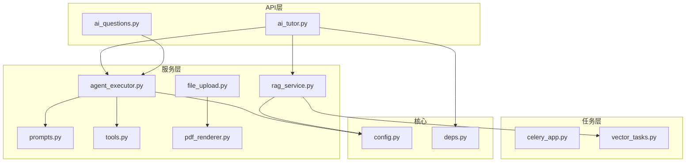
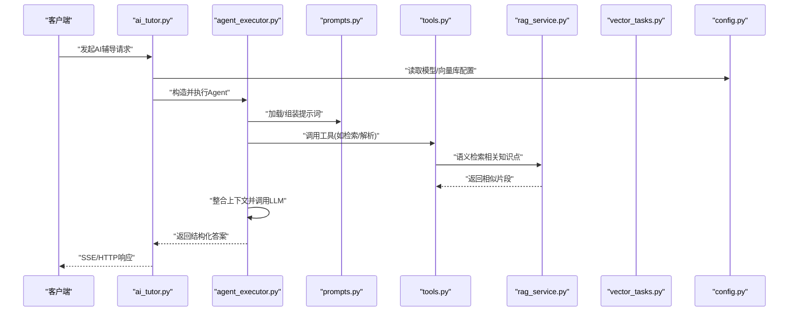
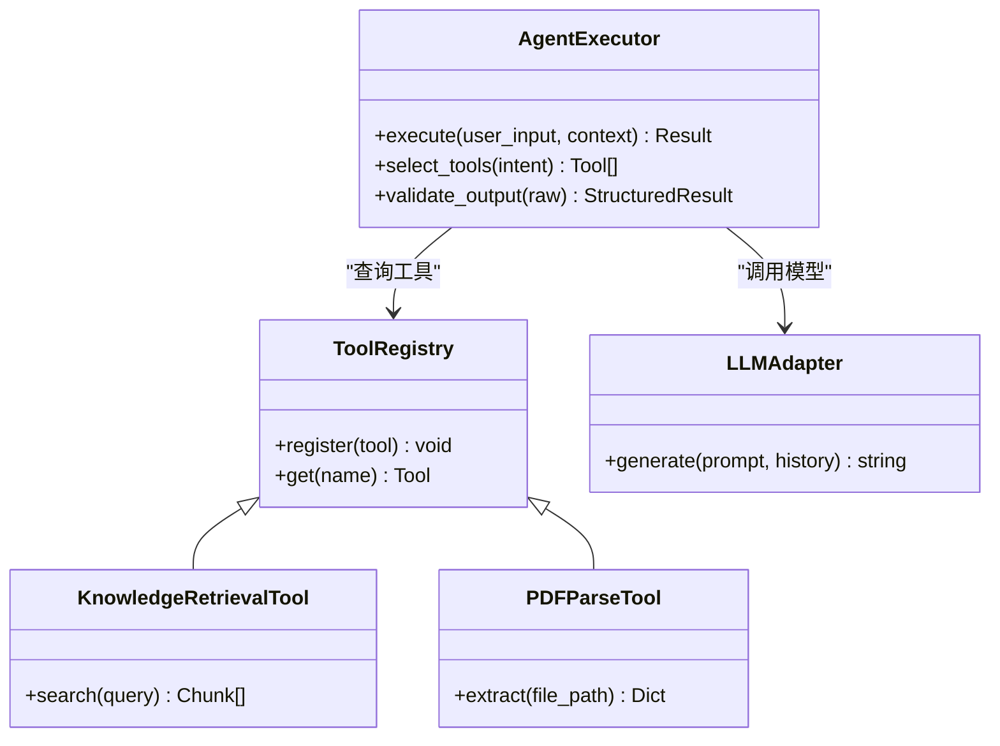
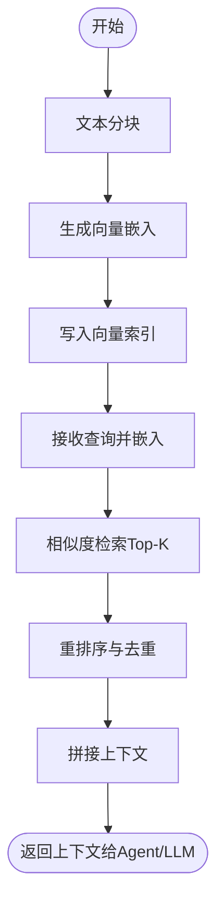
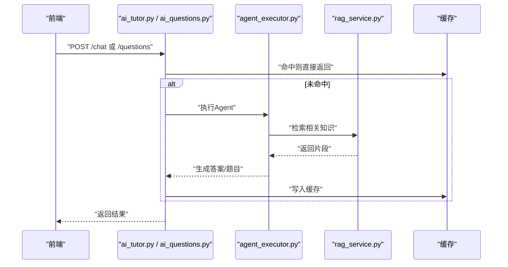
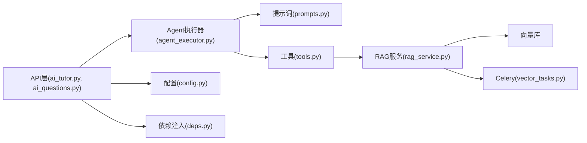

# AI系统架构

<cite>
**本文引用的文件**   
- [backend/app/services/agent/agent_executor.py](file://backend/app/services/agent/agent_executor.py)
- [backend/app/services/agent/prompts.py](file://backend/app/services/agent/prompts.py)
- [backend/app/services/agent/tools.py](file://backend/app/services/agent/tools.py)
- [backend/app/services/rag_service.py](file://backend/app/services/rag_service.py)
- [backend/app/api/v1/ai_tutor.py](file://backend/app/api/v1/ai_tutor.py)
- [backend/app/api/v1/ai_questions.py](file://backend/app/api/v1/ai_questions.py)
- [backend/app/core/config.py](file://backend/app/core/config.py)
- [backend/app/core/deps.py](file://backend/app/core/deps.py)
- [backend/app/tasks/celery_app.py](file://backend/app/tasks/celery_app.py)
- [backend/app/tasks/vector_tasks.py](file://backend/app/tasks/vector_tasks.py)
- [backend/app/services/file_upload.py](file://backend/app/services/file_upload.py)
- [backend/app/services/pdf_renderer.py](file://backend/app/services/pdf_renderer.py)
- [backend/app/schemas/ai.py](file://backend/app/schemas/ai.py)
</cite>

## 目录
1. [简介](#简介)
2. [项目结构](#项目结构)
3. [核心组件](#核心组件)
4. [架构总览](#架构总览)
5. [详细组件分析](#详细组件分析)
6. [依赖关系分析](#依赖关系分析)
7. [性能考虑](#性能考虑)
8. [故障排查指南](#故障排查指南)
9. [结论](#结论)
10. [附录](#附录)

## 简介
本文件面向AI助教系统的AI模块，聚焦于基于LangChain的Agent系统设计、RAG检索增强生成、多模态处理能力、大语言模型集成与Prompt工程、异步处理与缓存策略、错误恢复机制，以及扩展开发指南。文档以代码级视角梳理关键路径与数据流，并提供可视化图示帮助理解。

## 项目结构
后端采用分层组织：API层暴露REST接口，服务层封装业务逻辑（含Agent、RAG、作业解析等），任务层使用Celery进行异步处理，配置与依赖注入位于core层，数据模型与Schema位于models与schemas层。

图表来源
- [backend/app/api/v1/ai_tutor.py](file://backend/app/api/v1/ai_tutor.py)
- [backend/app/api/v1/ai_questions.py](file://backend/app/api/v1/ai_questions.py)
- [backend/app/services/agent/agent_executor.py](file://backend/app/services/agent/agent_executor.py)
- [backend/app/services/agent/prompts.py](file://backend/app/services/agent/prompts.py)
- [backend/app/services/agent/tools.py](file://backend/app/services/agent/tools.py)
- [backend/app/services/rag_service.py](file://backend/app/services/rag_service.py)
- [backend/app/services/file_upload.py](file://backend/app/services/file_upload.py)
- [backend/app/services/pdf_renderer.py](file://backend/app/services/pdf_renderer.py)
- [backend/app/tasks/celery_app.py](file://backend/app/tasks/celery_app.py)
- [backend/app/tasks/vector_tasks.py](file://backend/app/tasks/vector_tasks.py)
- [backend/app/core/config.py](file://backend/app/core/config.py)
- [backend/app/core/deps.py](file://backend/app/core/deps.py)

章节来源
- [backend/app/api/v1/ai_tutor.py](file://backend/app/api/v1/ai_tutor.py)
- [backend/app/api/v1/ai_questions.py](file://backend/app/api/v1/ai_questions.py)
- [backend/app/services/agent/agent_executor.py](file://backend/app/services/agent/agent_executor.py)
- [backend/app/services/rag_service.py](file://backend/app/services/rag_service.py)
- [backend/app/core/config.py](file://backend/app/core/config.py)
- [backend/app/core/deps.py](file://backend/app/core/deps.py)
- [backend/app/tasks/celery_app.py](file://backend/app/tasks/celery_app.py)
- [backend/app/tasks/vector_tasks.py](file://backend/app/tasks/vector_tasks.py)

## 核心组件
- Agent执行器：负责编排提示词、工具调用与大模型交互，支持多轮对话与结果聚合。
- 工具链：提供可插拔的工具函数，如知识检索、题目解析、PDF渲染等。
- RAG服务：实现向量索引构建、语义检索与上下文拼接，支撑高质量问答。
- 异步任务：通过Celery将耗时操作（如向量化入库）异步化，提升吞吐与稳定性。
- 配置与依赖注入：集中管理模型、向量库、第三方服务参数，统一获取实例。

章节来源
- [backend/app/services/agent/agent_executor.py](file://backend/app/services/agent/agent_executor.py)
- [backend/app/services/agent/tools.py](file://backend/app/services/agent/tools.py)
- [backend/app/services/rag_service.py](file://backend/app/services/rag_service.py)
- [backend/app/tasks/celery_app.py](file://backend/app/tasks/celery_app.py)
- [backend/app/core/config.py](file://backend/app/core/config.py)
- [backend/app/core/deps.py](file://backend/app/core/deps.py)

## 架构总览
整体流程从API进入，路由到服务层；Agent执行器组合提示词与工具，必要时触发RAG检索；耗时任务下沉至Celery；配置与依赖由core层统一管理。

图表来源
- [backend/app/api/v1/ai_tutor.py](file://backend/app/api/v1/ai_tutor.py)
- [backend/app/services/agent/agent_executor.py](file://backend/app/services/agent/agent_executor.py)
- [backend/app/services/agent/prompts.py](file://backend/app/services/agent/prompts.py)
- [backend/app/services/agent/tools.py](file://backend/app/services/agent/tools.py)
- [backend/app/services/rag_service.py](file://backend/app/services/rag_service.py)
- [backend/app/tasks/vector_tasks.py](file://backend/app/tasks/vector_tasks.py)
- [backend/app/core/config.py](file://backend/app/core/config.py)

## 详细组件分析

### Agent执行器与工具链
- 执行器职责
  - 维护对话状态与上下文窗口
  - 根据意图选择工具并编排调用顺序
  - 对LLM输出进行校验与格式化
- 工具链设计
  - 工具注册与发现：通过统一接口声明工具元信息（名称、描述、参数）
  - 输入校验与错误隔离：每个工具独立捕获异常，避免污染主流程
  - 可扩展性：新增工具只需实现标准接口并在注册表中登记
- 典型工具
  - 知识检索：对接RAG服务，按主题或关键词召回片段
  - 题目解析：结合OCR/PDF解析，抽取题干与选项
  - 渲染与导出：将结构化结果渲染为PDF或图片

图表来源
- [backend/app/services/agent/agent_executor.py](file://backend/app/services/agent/agent_executor.py)
- [backend/app/services/agent/tools.py](file://backend/app/services/agent/tools.py)
- [backend/app/services/pdf_renderer.py](file://backend/app/services/pdf_renderer.py)

章节来源
- [backend/app/services/agent/agent_executor.py](file://backend/app/services/agent/agent_executor.py)
- [backend/app/services/agent/tools.py](file://backend/app/services/agent/tools.py)
- [backend/app/services/pdf_renderer.py](file://backend/app/services/pdf_renderer.py)

### 提示词工程管理
- 模板组织
  - 按场景拆分模板（如“错题讲解”、“作文批改”、“口语评估”）
  - 变量占位符标准化，便于动态注入上下文
- 版本与回滚
  - 模板文件纳入版本控制，发布前进行一致性校验
- 质量保障
  - 单元测试覆盖边界条件（空输入、超长文本、特殊字符）
  - 灰度切换：通过配置开关在A/B模板间切换

章节来源
- [backend/app/services/agent/prompts.py](file://backend/app/services/agent/prompts.py)

### RAG（检索增强生成）实现
- 向量数据库集成
  - 文本分块与嵌入：对文档进行切分并生成向量
  - 索引构建：批量写入向量库，建立相似度索引
- 语义搜索
  - 查询嵌入与Top-K召回
  - 重排序与去重，保证上下文相关性
- 知识检索
  - 与Agent工具链打通，按需检索并拼接至提示词
  - 异步任务驱动：向量化入库走Celery队列，避免阻塞请求

图表来源
- [backend/app/services/rag_service.py](file://backend/app/services/rag_service.py)
- [backend/app/tasks/vector_tasks.py](file://backend/app/tasks/vector_tasks.py)

章节来源
- [backend/app/services/rag_service.py](file://backend/app/services/rag_service.py)
- [backend/app/tasks/vector_tasks.py](file://backend/app/tasks/vector_tasks.py)

### 多模态AI处理能力
- 文本理解
  - 长文本分段与摘要，保留关键信息
- 图像识别
  - 通过OCR或视觉模型提取图片中的文字与表格
- 语音处理
  - 语音转文本后进入常规NLP流程
- 文件上传与渲染
  - 支持PDF等多格式文件，解析后进入RAG或Agent流程

章节来源
- [backend/app/services/file_upload.py](file://backend/app/services/file_upload.py)
- [backend/app/services/pdf_renderer.py](file://backend/app/services/pdf_renderer.py)

### 大语言模型集成方案
- 模型适配层
  - 统一抽象接口，屏蔽不同厂商差异
  - 支持温度、最大长度、重试次数等参数化配置
- Prompt工程最佳实践
  - 明确角色与任务目标
  - 结构化输出约束（JSON Schema或固定字段）
  - 少样本示例增强稳定性
- 输出质量控制
  - 二次校验：正则/模式匹配过滤非法内容
  - 安全护栏：敏感词检测与降级策略

章节来源
- [backend/app/services/agent/agent_executor.py](file://backend/app/services/agent/agent_executor.py)
- [backend/app/services/agent/prompts.py](file://backend/app/services/agent/prompts.py)
- [backend/app/core/config.py](file://backend/app/core/config.py)

### 异步处理、缓存与错误恢复
- 异步处理
  - Celery应用初始化与任务定义
  - 向量入库、报告生成等耗时任务入队
- 缓存策略
  - 热点问题与相似题结果短期缓存，降低重复计算
  - 缓存失效策略：按时间或内容哈希更新
- 错误恢复
  - 幂等重试与退避策略
  - 失败告警与人工兜底入口

章节来源
- [backend/app/tasks/celery_app.py](file://backend/app/tasks/celery_app.py)
- [backend/app/tasks/vector_tasks.py](file://backend/app/tasks/vector_tasks.py)
- [backend/app/core/config.py](file://backend/app/core/config.py)

### API与服务编排
- 辅导对话接口
  - 接收用户输入与上下文，调用Agent执行器
  - 支持SSE流式返回，提升交互体验
- 题目生成接口
  - 基于知识点与难度参数，调用Agent生成题目
  - 结果持久化与历史追溯

图表来源
- [backend/app/api/v1/ai_tutor.py](file://backend/app/api/v1/ai_tutor.py)
- [backend/app/api/v1/ai_questions.py](file://backend/app/api/v1/ai_questions.py)
- [backend/app/services/agent/agent_executor.py](file://backend/app/services/agent/agent_executor.py)
- [backend/app/services/rag_service.py](file://backend/app/services/rag_service.py)

章节来源
- [backend/app/api/v1/ai_tutor.py](file://backend/app/api/v1/ai_tutor.py)
- [backend/app/api/v1/ai_questions.py](file://backend/app/api/v1/ai_questions.py)

## 依赖关系分析
- 组件耦合
  - API层仅依赖服务层与配置层，保持低耦合
  - Agent执行器依赖提示词与工具，工具可替换
  - RAG服务依赖向量库与任务队列
- 外部依赖
  - 大模型提供商SDK
  - 向量数据库客户端
  - Celery与消息中间件
  - 文件存储与渲染引擎

图表来源
- [backend/app/api/v1/ai_tutor.py](file://backend/app/api/v1/ai_tutor.py)
- [backend/app/api/v1/ai_questions.py](file://backend/app/api/v1/ai_questions.py)
- [backend/app/services/agent/agent_executor.py](file://backend/app/services/agent/agent_executor.py)
- [backend/app/services/agent/prompts.py](file://backend/app/services/agent/prompts.py)
- [backend/app/services/agent/tools.py](file://backend/app/services/agent/tools.py)
- [backend/app/services/rag_service.py](file://backend/app/services/rag_service.py)
- [backend/app/tasks/vector_tasks.py](file://backend/app/tasks/vector_tasks.py)
- [backend/app/core/config.py](file://backend/app/core/config.py)
- [backend/app/core/deps.py](file://backend/app/core/deps.py)

章节来源
- [backend/app/api/v1/ai_tutor.py](file://backend/app/api/v1/ai_tutor.py)
- [backend/app/api/v1/ai_questions.py](file://backend/app/api/v1/ai_questions.py)
- [backend/app/services/agent/agent_executor.py](file://backend/app/services/agent/agent_executor.py)
- [backend/app/services/rag_service.py](file://backend/app/services/rag_service.py)
- [backend/app/core/config.py](file://backend/app/core/config.py)
- [backend/app/core/deps.py](file://backend/app/core/deps.py)
- [backend/app/tasks/celery_app.py](file://backend/app/tasks/celery_app.py)
- [backend/app/tasks/vector_tasks.py](file://backend/app/tasks/vector_tasks.py)

## 性能考虑
- 并发与吞吐
  - 使用连接池与对象复用减少创建开销
  - 合理设置并发数与超时，避免资源耗尽
- 缓存命中率
  - 针对高频问题与相似题做缓存预热
  - 使用LRU或TTL策略平衡新鲜度与性能
- 向量检索优化
  - 调整Top-K与阈值，减少无关片段
  - 增量索引与定期重建，保证时效性
- 异步与背压
  - 任务队列削峰填谷，防止雪崩
  - 监控队列积压与消费者健康度

[本节为通用指导，不直接分析具体文件]

## 故障排查指南
- 常见问题定位
  - 模型调用失败：检查配置项与密钥、网络连通性与限流
  - 向量检索为空：确认索引是否构建完成、查询嵌入维度一致
  - 任务堆积：查看Celery日志与消费者数量
- 日志与追踪
  - 关键路径埋点：请求ID贯穿API→Agent→RAG→任务
  - 错误码与堆栈：统一包装，便于前端展示与后台分析
- 恢复策略
  - 自动重试与指数退避
  - 降级模式：关闭非核心功能，优先保障主流程

章节来源
- [backend/app/core/config.py](file://backend/app/core/config.py)
- [backend/app/tasks/celery_app.py](file://backend/app/tasks/celery_app.py)
- [backend/app/tasks/vector_tasks.py](file://backend/app/tasks/vector_tasks.py)

## 结论
本架构围绕Agent执行器与工具链、RAG检索增强、多模态能力与异步任务展开，形成高内聚、低耦合的服务体系。通过统一的配置与依赖注入、严格的Prompt工程与输出质量控制，系统在准确性、稳定性与可扩展性方面具备良好基础。后续可在模型切换、缓存策略与监控告警方面持续优化。

[本节为总结性内容，不直接分析具体文件]

## 附录

### 扩展开发指南
- 自定义工具开发
  - 实现标准工具接口，声明元信息与参数校验
  - 在工具注册表中登记，确保Agent可发现
  - 编写单测覆盖异常分支
- 提示词模板设计
  - 按场景拆分模板，使用占位符注入上下文
  - 引入少样本示例，稳定输出格式
  - 灰度发布与回滚机制
- 模型切换配置
  - 在配置层定义模型别名与参数映射
  - 通过依赖注入获取对应适配器
  - 测试不同模型的输出质量与延迟

章节来源
- [backend/app/services/agent/tools.py](file://backend/app/services/agent/tools.py)
- [backend/app/services/agent/prompts.py](file://backend/app/services/agent/prompts.py)
- [backend/app/core/config.py](file://backend/app/core/config.py)
- [backend/app/core/deps.py](file://backend/app/core/deps.py)

### 数据模型与接口约定
- 统一响应结构
  - 包含状态码、消息、数据体与追踪ID
- 输入校验
  - 必填字段、类型与长度限制
  - 敏感信息过滤与脱敏

章节来源
- [backend/app/schemas/ai.py](file://backend/app/schemas/ai.py)