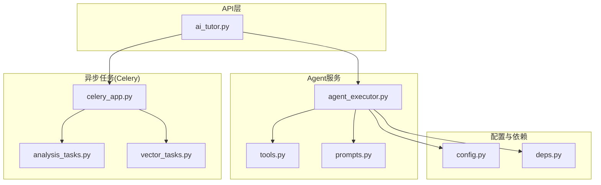
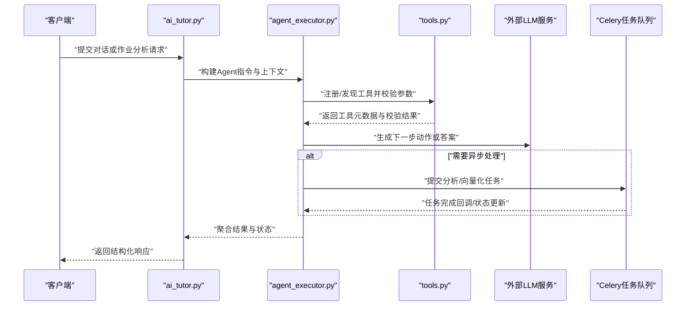
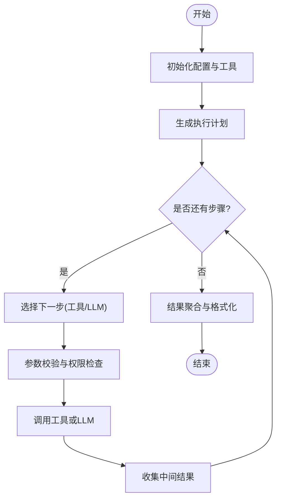
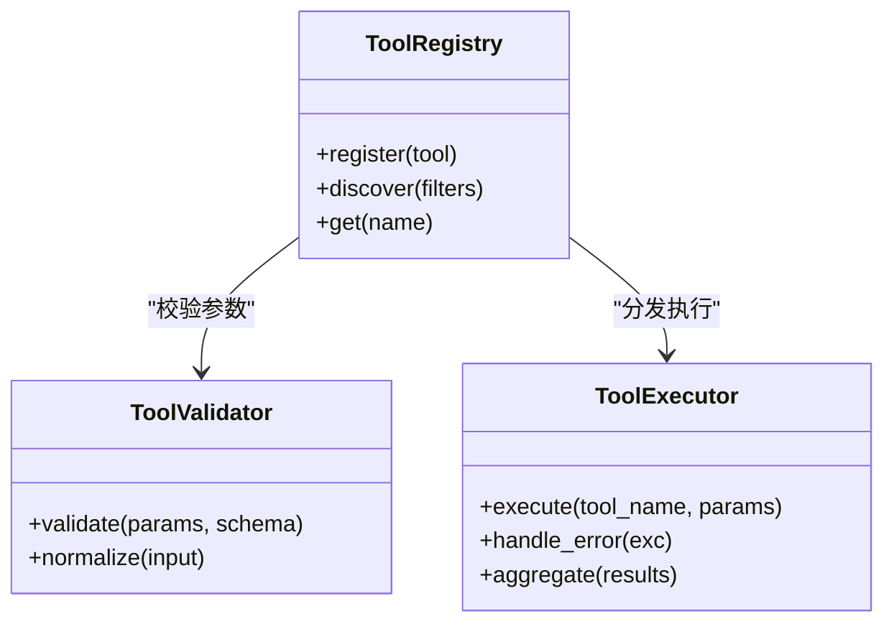
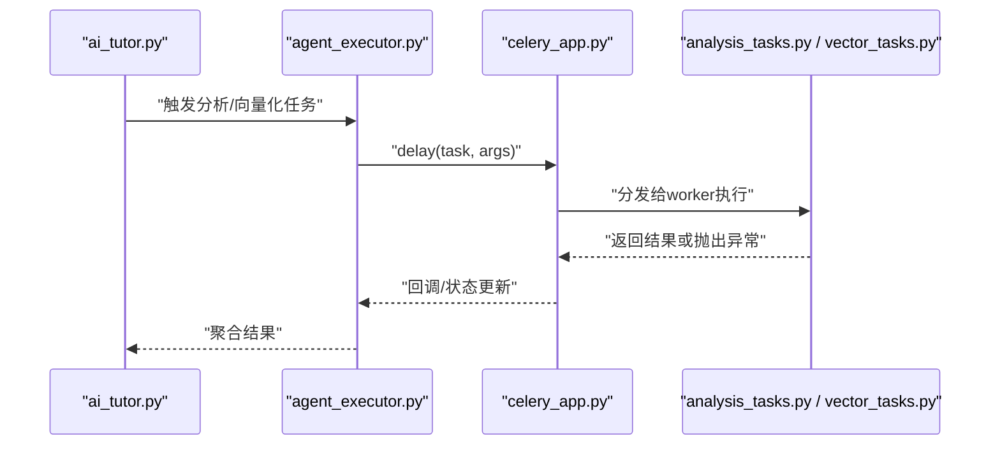
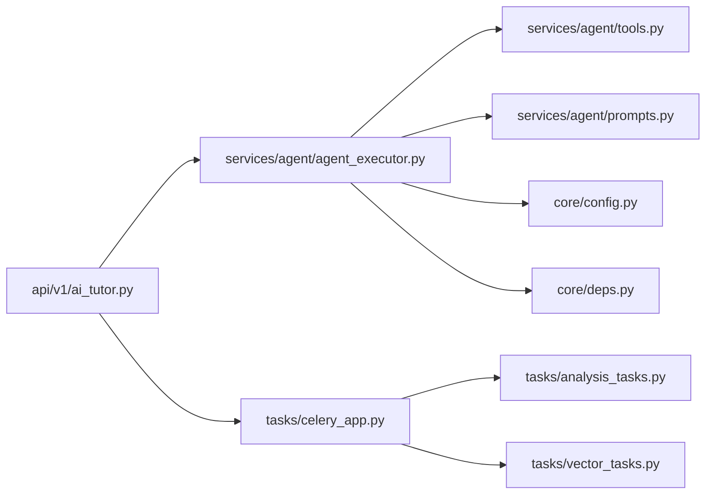

# Agent执行器系统

<cite>
**本文引用的文件**   
- [agent_executor.py](file://backend/app/services/agent/agent_executor.py)
- [tools.py](file://backend/app/services/agent/tools.py)
- [prompts.py](file://backend/app/services/agent/prompts.py)
- [ai_tutor.py](file://backend/app/api/v1/ai_tutor.py)
- [config.py](file://backend/app/core/config.py)
- [deps.py](file://backend/app/core/deps.py)
- [celery_app.py](file://backend/app/tasks/celery_app.py)
- [analysis_tasks.py](file://backend/app/tasks/analysis_tasks.py)
- [vector_tasks.py](file://backend/app/tasks/vector_tasks.py)
</cite>

## 目录
1. [简介](#简介)
2. [项目结构](#项目结构)
3. [核心组件](#核心组件)
4. [架构总览](#架构总览)
5. [详细组件分析](#详细组件分析)
6. [依赖关系分析](#依赖关系分析)
7. [性能考虑](#性能考虑)
8. [故障排查指南](#故障排查指南)
9. [结论](#结论)
10. [附录](#附录)

## 简介
本技术文档围绕基于LangChain的Agent执行器系统进行深入解析，重点覆盖以下方面：
- Agent生命周期管理、任务调度机制与状态跟踪
- 工具链注册与调用机制（发现、参数校验、错误处理、结果聚合）
- 异步任务处理模式（并发控制、超时管理、重试策略）
- Agent配置管理与动态加载机制、性能监控
- 自定义工具开发指南（接口规范、装饰器使用、依赖注入）
- 扩展新AI能力的实践路径与示例说明

## 项目结构
后端采用分层组织方式，Agent相关能力集中在 services/agent 目录下，并通过API层暴露给前端。异步任务通过Celery进行编排。

图表来源
- [ai_tutor.py](file://backend/app/api/v1/ai_tutor.py)
- [agent_executor.py](file://backend/app/services/agent/agent_executor.py)
- [tools.py](file://backend/app/services/agent/tools.py)
- [prompts.py](file://backend/app/services/agent/prompts.py)
- [config.py](file://backend/app/core/config.py)
- [deps.py](file://backend/app/core/deps.py)
- [celery_app.py](file://backend/app/tasks/celery_app.py)
- [analysis_tasks.py](file://backend/app/tasks/analysis_tasks.py)
- [vector_tasks.py](file://backend/app/tasks/vector_tasks.py)

章节来源
- [ai_tutor.py](file://backend/app/api/v1/ai_tutor.py)
- [agent_executor.py](file://backend/app/services/agent/agent_executor.py)
- [tools.py](file://backend/app/services/agent/tools.py)
- [prompts.py](file://backend/app/services/agent/prompts.py)
- [config.py](file://backend/app/core/config.py)
- [deps.py](file://backend/app/core/deps.py)
- [celery_app.py](file://backend/app/tasks/celery_app.py)
- [analysis_tasks.py](file://backend/app/tasks/analysis_tasks.py)
- [vector_tasks.py](file://backend/app/tasks/vector_tasks.py)

## 核心组件
- Agent执行器：负责Agent生命周期管理、提示词组装、工具链编排、结果聚合与状态跟踪。
- 工具注册中心：提供工具发现、参数校验、错误处理与结果聚合的统一入口。
- 提示词模板：集中管理Prompt模板与上下文注入逻辑。
- API网关：将外部请求转换为Agent可执行的指令，并返回结构化响应。
- 异步任务编排：通过Celery对耗时任务进行解耦与调度，支持重试与超时。

章节来源
- [agent_executor.py](file://backend/app/services/agent/agent_executor.py)
- [tools.py](file://backend/app/services/agent/tools.py)
- [prompts.py](file://backend/app/services/agent/prompts.py)
- [ai_tutor.py](file://backend/app/api/v1/ai_tutor.py)
- [celery_app.py](file://backend/app/tasks/celery_app.py)

## 架构总览
整体架构遵循“API -> Agent执行器 -> 工具链 -> 外部LLM/向量库”的分层模型，并通过Celery异步化长耗时操作。

图表来源
- [ai_tutor.py](file://backend/app/api/v1/ai_tutor.py)
- [agent_executor.py](file://backend/app/services/agent/agent_executor.py)
- [tools.py](file://backend/app/services/agent/tools.py)
- [celery_app.py](file://backend/app/tasks/celery_app.py)

## 详细组件分析

### Agent执行器（生命周期、调度与状态）
- 生命周期阶段
  - 初始化：加载配置、注册工具、准备提示词模板
  - 规划：根据用户输入与上下文生成计划步骤
  - 执行：按步骤调用工具或LLM，收集中间结果
  - 聚合：汇总各步骤输出，形成最终响应
  - 收尾：清理资源、记录日志与指标
- 任务调度机制
  - 同步路径：适用于轻量工具与快速推理
  - 异步路径：对于耗时任务（如批量分析、向量化），通过Celery派发任务，并在完成后回填状态
- 状态跟踪
  - 维护Agent运行状态（待处理、进行中、成功、失败）
  - 记录关键事件与错误堆栈，便于追踪与回放

图表来源
- [agent_executor.py](file://backend/app/services/agent/agent_executor.py)
- [tools.py](file://backend/app/services/agent/tools.py)
- [prompts.py](file://backend/app/services/agent/prompts.py)

章节来源
- [agent_executor.py](file://backend/app/services/agent/agent_executor.py)
- [tools.py](file://backend/app/services/agent/tools.py)
- [prompts.py](file://backend/app/services/agent/prompts.py)

### 工具链注册与调用机制
- 工具发现
  - 通过统一注册表扫描已注册的工具，支持按标签或类别筛选
- 参数验证
  - 基于声明式Schema进行入参校验，确保类型、必填项与取值范围正确
- 错误处理
  - 捕获工具执行异常，分类为参数错误、业务错误、系统错误，并返回标准化错误码
- 结果聚合
  - 将多个工具的返回值合并为统一的响应结构，支持流式增量输出

图表来源
- [tools.py](file://backend/app/services/agent/tools.py)

章节来源
- [tools.py](file://backend/app/services/agent/tools.py)

### 提示词模板管理
- 模板集中管理，支持变量注入与上下文拼装
- 针对不同场景（问答、作文批改、口语评估等）提供专用模板
- 结合Agent执行器在运行时动态替换占位符

章节来源
- [prompts.py](file://backend/app/services/agent/prompts.py)

### API集成与请求路由
- 接收前端请求，解析参数并构造Agent指令
- 将同步/异步分支路由到对应执行路径
- 返回统一的结构化响应，包含状态、消息与数据体

章节来源
- [ai_tutor.py](file://backend/app/api/v1/ai_tutor.py)

### 异步任务处理（Celery）
- 任务定义与注册：在celery_app中创建应用实例，并在tasks中定义具体任务
- 并发控制：通过worker数量与任务队列隔离不同优先级任务
- 超时管理：为任务设置超时时间，避免长时间阻塞
- 重试策略：针对瞬时错误（网络抖动、限流）实现指数退避重试

图表来源
- [celery_app.py](file://backend/app/tasks/celery_app.py)
- [analysis_tasks.py](file://backend/app/tasks/analysis_tasks.py)
- [vector_tasks.py](file://backend/app/tasks/vector_tasks.py)

章节来源
- [celery_app.py](file://backend/app/tasks/celery_app.py)
- [analysis_tasks.py](file://backend/app/tasks/analysis_tasks.py)
- [vector_tasks.py](file://backend/app/tasks/vector_tasks.py)

### 配置管理与动态加载
- 配置来源
  - 环境变量与配置文件（config.py）
  - 运行时依赖注入（deps.py）
- 动态加载
  - 支持按需加载工具与提示词模板，减少启动开销
  - 基于标签或模块名进行选择性启用

章节来源
- [config.py](file://backend/app/core/config.py)
- [deps.py](file://backend/app/core/deps.py)

## 依赖关系分析
- 组件耦合
  - API层仅依赖执行器与任务队列，保持薄封装
  - 执行器依赖工具注册中心与提示词模板，低耦合高内聚
- 外部依赖
  - LLM服务、向量数据库、消息队列（Celery Broker）
- 潜在循环依赖
  - 通过依赖注入与接口抽象避免直接循环引用

图表来源
- [ai_tutor.py](file://backend/app/api/v1/ai_tutor.py)
- [agent_executor.py](file://backend/app/services/agent/agent_executor.py)
- [tools.py](file://backend/app/services/agent/tools.py)
- [prompts.py](file://backend/app/services/agent/prompts.py)
- [config.py](file://backend/app/core/config.py)
- [deps.py](file://backend/app/core/deps.py)
- [celery_app.py](file://backend/app/tasks/celery_app.py)
- [analysis_tasks.py](file://backend/app/tasks/analysis_tasks.py)
- [vector_tasks.py](file://backend/app/tasks/vector_tasks.py)

章节来源
- [ai_tutor.py](file://backend/app/api/v1/ai_tutor.py)
- [agent_executor.py](file://backend/app/services/agent/agent_executor.py)
- [tools.py](file://backend/app/services/agent/tools.py)
- [prompts.py](file://backend/app/services/agent/prompts.py)
- [config.py](file://backend/app/core/config.py)
- [deps.py](file://backend/app/core/deps.py)
- [celery_app.py](file://backend/app/tasks/celery_app.py)
- [analysis_tasks.py](file://backend/app/tasks/analysis_tasks.py)
- [vector_tasks.py](file://backend/app/tasks/vector_tasks.py)

## 性能考虑
- 并发控制
  - 合理设置Celery worker数量与队列分区，避免热点任务争用
- 超时管理
  - 为LLM调用与外部I/O设置合理超时，防止雪崩
- 重试策略
  - 对幂等性良好的任务采用指数退避重试，限制最大重试次数
- 缓存与批处理
  - 对频繁查询的结果进行缓存；对向量化与分析任务进行批处理以降低延迟
- 监控与观测
  - 记录关键指标（QPS、P95/P99延迟、错误率、重试次数）

[本节为通用指导，不直接分析具体文件]

## 故障排查指南
- 常见问题定位
  - 参数校验失败：检查工具Schema与入参类型
  - 工具执行异常：查看错误分类与堆栈信息
  - 任务超时/重试：核对Celery配置与任务超时设置
- 日志与追踪
  - 在关键节点输出结构化日志，包含请求ID、步骤序号与耗时
- 恢复策略
  - 对可重试错误自动重试，不可重试错误转人工复核

章节来源
- [tools.py](file://backend/app/services/agent/tools.py)
- [celery_app.py](file://backend/app/tasks/celery_app.py)

## 结论
本系统以Agent执行为核心，结合工具链注册与异步任务编排，实现了可扩展、可观测、可运维的AI助教能力。通过清晰的职责划分与依赖注入，系统具备良好的演进性与稳定性。

[本节为总结性内容，不直接分析具体文件]

## 附录

### 自定义工具开发指南
- 工具接口规范
  - 明确输入Schema（字段、类型、约束）
  - 定义输出结构与错误码
- 装饰器使用
  - 使用统一装饰器声明工具元数据（名称、描述、版本、权限）
  - 自动完成参数校验与错误包装
- 依赖注入
  - 通过依赖注入获取外部服务（LLM、向量库、存储）
  - 避免在工具内部硬编码全局状态
- 示例说明（路径指引）
  - 参考现有工具注册与调用流程，新增工具后在注册表中声明即可被Agent发现与调用
  - 如需异步执行，可将工具逻辑迁移至Celery任务，并通过回调回填结果

章节来源
- [tools.py](file://backend/app/services/agent/tools.py)
- [agent_executor.py](file://backend/app/services/agent/agent_executor.py)
- [celery_app.py](file://backend/app/tasks/celery_app.py)

### 扩展新AI能力的实践路径
- 新增能力步骤
  - 定义新的工具或提示词模板
  - 在Agent执行器中注册并编排调用顺序
  - 若为耗时任务，拆分为Celery任务并配置重试与超时
  - 在API层增加路由与参数校验
- 验证与回归
  - 单元测试覆盖参数校验与错误分支
  - 集成测试验证端到端流程与状态流转

章节来源
- [agent_executor.py](file://backend/app/services/agent/agent_executor.py)
- [prompts.py](file://backend/app/services/agent/prompts.py)
- [ai_tutor.py](file://backend/app/api/v1/ai_tutor.py)
- [celery_app.py](file://backend/app/tasks/celery_app.py)