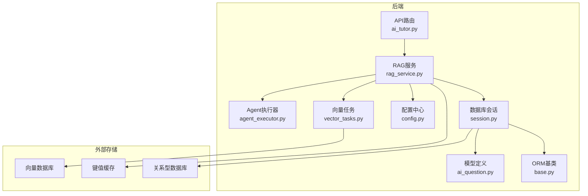
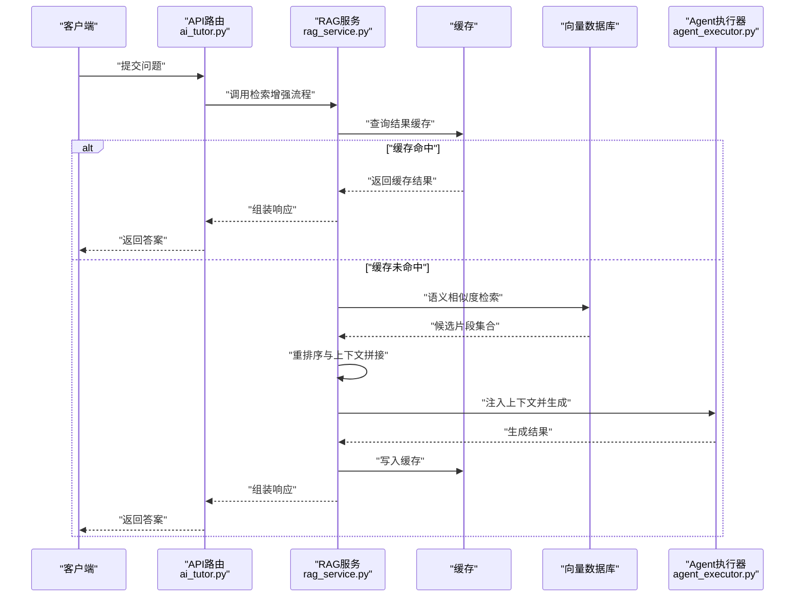
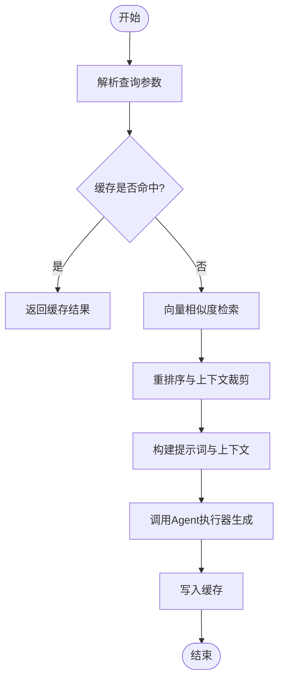
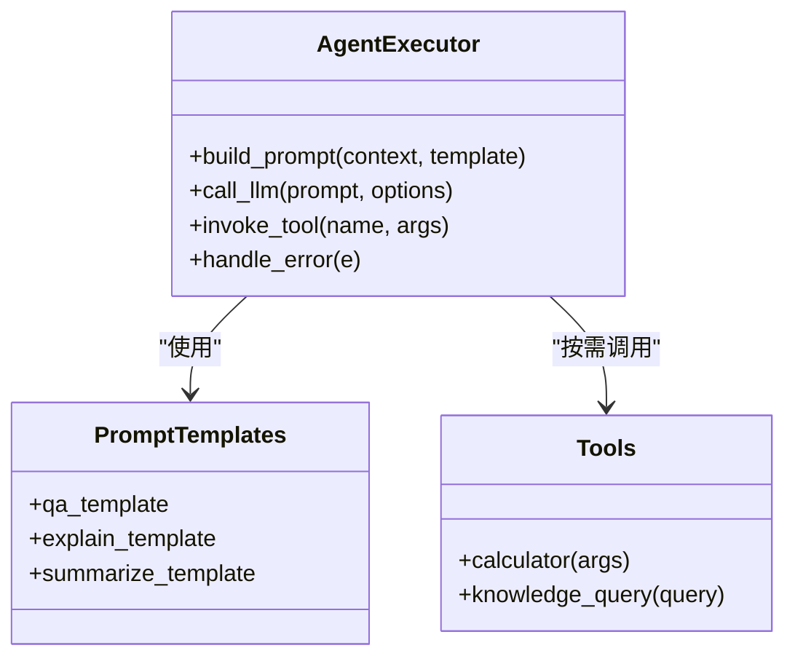
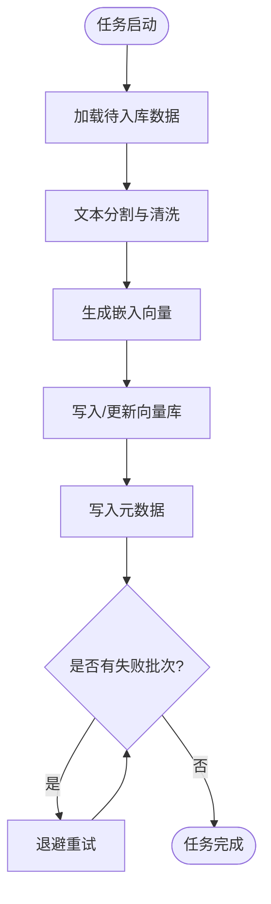
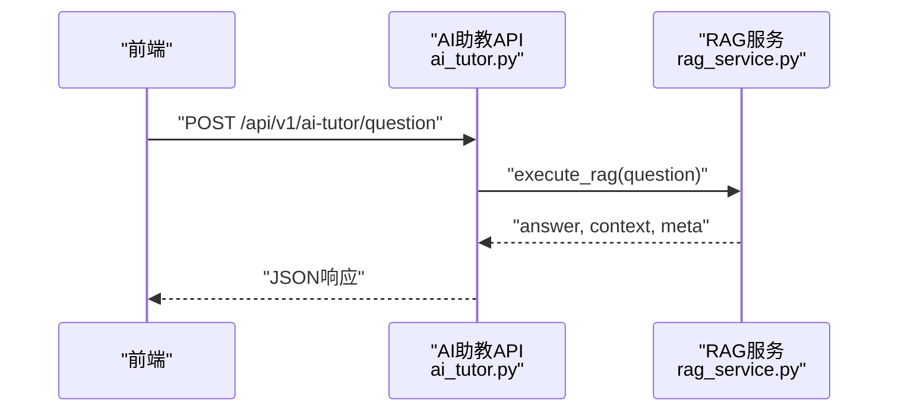
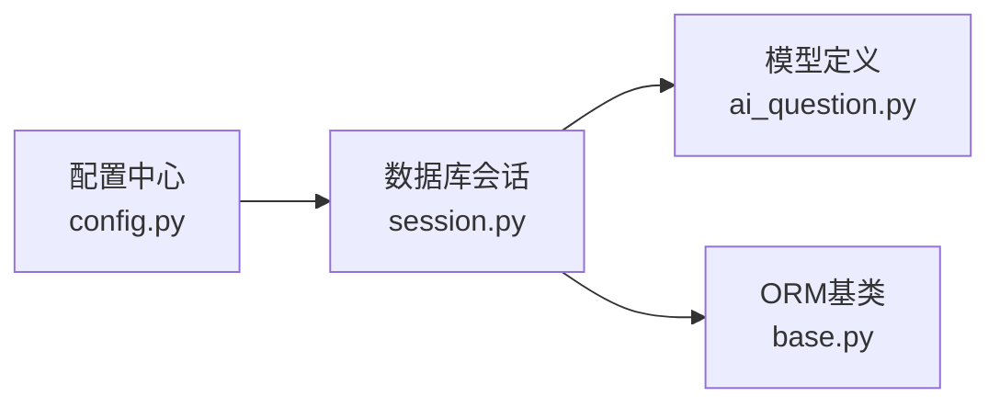
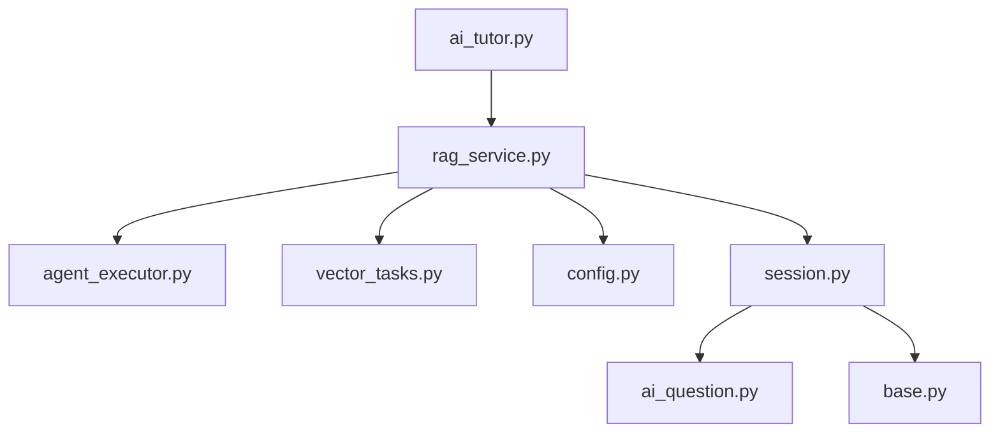

# RAG检索增强系统

<cite>
**本文引用的文件**   
- [rag_service.py](file://backend/app/services/rag_service.py)
- [vector_tasks.py](file://backend/app/tasks/vector_tasks.py)
- [ai_tutor.py](file://backend/app/api/v1/ai_tutor.py)
- [agent_executor.py](file://backend/app/services/agent/agent_executor.py)
- [config.py](file://backend/app/core/config.py)
- [session.py](file://backend/app/db/session.py)
- [base.py](file://backend/app/db/base.py)
- [ai_question.py](file://backend/app/models/ai_question.py)
- [ai.py](file://backend/app/schemas/ai.py)
</cite>

## 目录
1. [简介](#简介)
2. [项目结构](#项目结构)
3. [核心组件](#核心组件)
4. [架构总览](#架构总览)
5. [详细组件分析](#详细组件分析)
6. [依赖关系分析](#依赖关系分析)
7. [性能考虑](#性能考虑)
8. [故障排查指南](#故障排查指南)
9. [结论](#结论)
10. [附录](#附录)

## 简介
本技术文档围绕RAG（检索增强生成）系统，结合仓库中的后端服务与任务模块，系统性阐述向量数据库集成、知识图谱构建、检索优化、文档预处理、缓存机制设计与性能调优策略。文档面向具备不同技术背景的读者，提供从高层架构到代码级实现的渐进式说明，并给出可操作的实践建议与排障指引。

## 项目结构
本项目采用前后端分离的模块化架构：
- 后端以FastAPI为核心，提供REST API与服务层逻辑；通过Celery异步任务处理向量索引构建等耗时操作；使用SQLAlchemy进行数据持久化。
- 前端基于React+TypeScript，负责交互与可视化展示。

与本RAG文档相关的后端关键路径包括：
- API层：接收用户查询，编排RAG流程
- 服务层：封装检索、生成、任务调度等能力
- 任务层：异步执行向量索引构建与更新
- 配置与数据库：集中管理外部依赖与连接

图表来源
- [ai_tutor.py](file://backend/app/api/v1/ai_tutor.py)
- [rag_service.py](file://backend/app/services/rag_service.py)
- [agent_executor.py](file://backend/app/services/agent/agent_executor.py)
- [vector_tasks.py](file://backend/app/tasks/vector_tasks.py)
- [config.py](file://backend/app/core/config.py)
- [session.py](file://backend/app/db/session.py)
- [base.py](file://backend/app/db/base.py)
- [ai_question.py](file://backend/app/models/ai_question.py)

章节来源
- [ai_tutor.py](file://backend/app/api/v1/ai_tutor.py)
- [rag_service.py](file://backend/app/services/rag_service.py)
- [vector_tasks.py](file://backend/app/tasks/vector_tasks.py)
- [agent_executor.py](file://backend/app/services/agent/agent_executor.py)
- [config.py](file://backend/app/core/config.py)
- [session.py](file://backend/app/db/session.py)
- [base.py](file://backend/app/db/base.py)
- [ai_question.py](file://backend/app/models/ai_question.py)

## 核心组件
- RAG服务：统一编排“检索-重排-生成”链路，协调向量检索、缓存命中、任务触发与结果组装。
- Agent执行器：承载提示词模板、工具调用与LLM交互，将检索上下文注入生成过程。
- 向量任务：异步构建与维护向量索引，支持增量更新与批量入库。
- 配置中心：集中管理嵌入模型、向量库、缓存、数据库等外部依赖参数。
- 数据访问层：通过ORM模型与数据库会话读写结构化数据，为RAG提供元数据与历史上下文。

章节来源
- [rag_service.py](file://backend/app/services/rag_service.py)
- [agent_executor.py](file://backend/app/services/agent/agent_executor.py)
- [vector_tasks.py](file://backend/app/tasks/vector_tasks.py)
- [config.py](file://backend/app/core/config.py)
- [ai_question.py](file://backend/app/models/ai_question.py)
- [session.py](file://backend/app/db/session.py)
- [base.py](file://backend/app/db/base.py)

## 架构总览
下图展示了RAG在请求生命周期内的主要交互：API接收查询，服务层优先尝试缓存命中；未命中则进入向量检索与可选的知识图谱检索，随后进行重排序与上下文拼接，最终由Agent执行器驱动LLM生成答案。

图表来源
- [ai_tutor.py](file://backend/app/api/v1/ai_tutor.py)
- [rag_service.py](file://backend/app/services/rag_service.py)
- [agent_executor.py](file://backend/app/services/agent/agent_executor.py)

## 详细组件分析

### 组件一：RAG服务（检索增强编排）
职责与要点
- 查询入口：解析输入、校验参数、构造检索条件。
- 缓存策略：按查询指纹或规范化后的查询文本作为键，设置过期时间，避免重复计算。
- 向量检索：调用向量库接口进行近似最近邻搜索，返回Top-K片段及分数。
- 重排序：对候选片段进行相关性打分与去重，控制上下文长度与噪声。
- 生成编排：将检索到的上下文与提示词模板组合，交由Agent执行器生成答案。
- 结果回写：将最终答案与必要元数据写入缓存，供后续快速命中。

图表来源
- [rag_service.py](file://backend/app/services/rag_service.py)

章节来源
- [rag_service.py](file://backend/app/services/rag_service.py)

### 组件二：Agent执行器（提示词与生成）
职责与要点
- 提示词工程：维护多套提示词模板，适配不同场景（问答、解释、总结）。
- 工具调用：按需引入外部工具（如计算器、知识库查询），扩展生成能力。
- LLM交互：封装调用协议、重试与超时控制，保证稳定性。
- 上下文注入：将RAG检索到的片段以结构化方式注入提示词，提升回答准确性。

图表来源
- [agent_executor.py](file://backend/app/services/agent/agent_executor.py)

章节来源
- [agent_executor.py](file://backend/app/services/agent/agent_executor.py)

### 组件三：向量任务（索引构建与更新）
职责与要点
- 批量索引：读取待入库文档，分块、生成嵌入、写入向量库。
- 增量更新：对比变更源，仅对新增或修改的条目进行向量化与入库。
- 失败重试：对异常批次进行重试与告警，保障索引一致性。
- 元数据管理：为每个向量记录附加来源、版本、时间戳等元数据，便于过滤与溯源。

图表来源
- [vector_tasks.py](file://backend/app/tasks/vector_tasks.py)

章节来源
- [vector_tasks.py](file://backend/app/tasks/vector_tasks.py)

### 组件四：API路由（对外接口）
职责与要点
- 接收前端请求，校验鉴权与参数。
- 调用RAG服务完成检索增强流程。
- 返回标准化响应体，包含答案、引用片段与元信息。

图表来源
- [ai_tutor.py](file://backend/app/api/v1/ai_tutor.py)
- [rag_service.py](file://backend/app/services/rag_service.py)

章节来源
- [ai_tutor.py](file://backend/app/api/v1/ai_tutor.py)

### 组件五：配置与数据访问
- 配置中心：集中管理嵌入模型、向量库连接、缓存与数据库URL等参数，便于环境切换与灰度发布。
- 数据访问：通过ORM模型与数据库会话读写结构化数据，支撑知识追踪、历史记录与统计。

图表来源
- [config.py](file://backend/app/core/config.py)
- [session.py](file://backend/app/db/session.py)
- [ai_question.py](file://backend/app/models/ai_question.py)
- [base.py](file://backend/app/db/base.py)

章节来源
- [config.py](file://backend/app/core/config.py)
- [session.py](file://backend/app/db/session.py)
- [ai_question.py](file://backend/app/models/ai_question.py)
- [base.py](file://backend/app/db/base.py)

## 依赖关系分析
- 低耦合高内聚：API路由仅负责入参与出参转换，核心逻辑下沉至服务层；服务层通过配置与任务模块解耦外部依赖。
- 异步与同步边界清晰：向量索引构建走异步任务，在线查询走同步服务，避免阻塞。
- 外部依赖抽象：向量库、缓存、LLM与数据库均通过配置与接口抽象，便于替换与测试。

图表来源
- [ai_tutor.py](file://backend/app/api/v1/ai_tutor.py)
- [rag_service.py](file://backend/app/services/rag_service.py)
- [agent_executor.py](file://backend/app/services/agent/agent_executor.py)
- [vector_tasks.py](file://backend/app/tasks/vector_tasks.py)
- [config.py](file://backend/app/core/config.py)
- [session.py](file://backend/app/db/session.py)
- [ai_question.py](file://backend/app/models/ai_question.py)
- [base.py](file://backend/app/db/base.py)

章节来源
- [ai_tutor.py](file://backend/app/api/v1/ai_tutor.py)
- [rag_service.py](file://backend/app/services/rag_service.py)
- [agent_executor.py](file://backend/app/services/agent/agent_executor.py)
- [vector_tasks.py](file://backend/app/tasks/vector_tasks.py)
- [config.py](file://backend/app/core/config.py)
- [session.py](file://backend/app/db/session.py)
- [ai_question.py](file://backend/app/models/ai_question.py)
- [base.py](file://backend/app/db/base.py)

## 性能考虑
- 索引优化
  - 合理分块大小：平衡语义完整性与检索精度，避免过长导致嵌入稀释。
  - 嵌入维度与距离度量：根据业务选择合适模型与相似度算法，必要时做降维。
  - 索引分区与过滤：利用元数据进行预过滤，减少向量空间扫描范围。
- 查询加速
  - 多级缓存：热点知识近线缓存与查询结果缓存分层设计，降低重复计算。
  - 混合检索：关键词与向量联合召回，再重排序，提高召回率与准确率。
  - 流式输出：对长答案采用流式返回，改善首字延迟体验。
- 内存管理
  - 控制上下文窗口：限制注入片段数量与长度，避免超出LLM上下文上限。
  - 批处理与分页：批量向量化与分页检索，避免一次性加载过多数据。
  - 资源回收：及时释放临时对象与连接，防止内存泄漏。

[本节为通用性能指导，不直接分析具体文件]

## 故障排查指南
- 常见问题定位
  - 缓存未命中：检查缓存键生成规则与过期策略，确认是否因查询规范化不一致导致。
  - 向量检索为空：核对索引是否成功构建，检查向量库连通性与过滤条件。
  - 生成质量不佳：调整提示词模板与上下文裁剪策略，增加相关片段或减少噪声。
  - 任务失败重试：查看任务日志与重试次数，确认数据源一致性与幂等性。
- 监控与观测
  - 指标采集：记录检索耗时、重排序耗时、生成耗时与缓存命中率。
  - 错误分类：区分网络错误、模型限流、数据异常与业务校验错误，分别处理。
  - 告警阈值：对P95/P99延迟与错误率设置阈值，及时触发告警。

章节来源
- [rag_service.py](file://backend/app/services/rag_service.py)
- [vector_tasks.py](file://backend/app/tasks/vector_tasks.py)
- [agent_executor.py](file://backend/app/services/agent/agent_executor.py)

## 结论
本RAG系统通过服务层统一编排检索与生成流程，结合异步任务与缓存机制，实现了可扩展、高性能的知识增强问答能力。建议在持续迭代中完善提示词工程、重排序策略与监控体系，逐步引入知识图谱与混合检索以提升复杂场景下的回答质量与鲁棒性。

[本节为总结性内容，不直接分析具体文件]

## 附录

### 向量数据库集成方案
- 数据索引构建
  - 文本分割：按段落/标题/固定长度切分，保留层级结构与页码等元数据。
  - 嵌入生成：使用统一嵌入模型，确保跨文档一致性。
  - 元数据管理：为每条向量记录附加来源、版本、时间戳、标签等字段，支持过滤与审计。
- 语义搜索实现
  - 相似度计算：余弦相似度或内积，依据模型输出特性选择。
  - Top-K召回：控制召回数量，结合过滤条件缩小搜索空间。
- 最佳实践
  - 建立索引健康检查：定期验证向量数量、分布与覆盖率。
  - 灰度发布新索引：新旧索引并行运行，逐步切换流量。

章节来源
- [vector_tasks.py](file://backend/app/tasks/vector_tasks.py)
- [rag_service.py](file://backend/app/services/rag_service.py)

### 知识图谱构建过程
- 实体识别：从文档中抽取关键概念、术语与人物，形成节点集合。
- 关系抽取：识别实体间关系（如“属于”“依赖”“前置”），形成边集合。
- 知识存储：将图结构存入图数据库或关系表，维护版本与来源。
- 应用融合：在检索阶段结合图谱路径推理，辅助重排序与解释生成。

[本节为概念性说明，不直接分析具体文件]

### 检索优化策略
- 查询重写：对用户问题进行同义改写、关键词提取与意图识别，提升召回质量。
- 混合检索：关键词匹配与向量相似度联合召回，扩大覆盖范围。
- 重排序算法：基于相关性打分、位置权重与多样性约束，精选最终上下文。

章节来源
- [rag_service.py](file://backend/app/services/rag_service.py)

### 文档预处理流程
- 文本分割：按语义单元切分，保留标题层级与段落结构。
- 嵌入生成：统一模型与参数，确保嵌入空间稳定。
- 元数据管理：为每个片段附加来源、时间、作者、标签等，便于过滤与溯源。

章节来源
- [vector_tasks.py](file://backend/app/tasks/vector_tasks.py)

### 缓存机制设计
- 热点知识缓存：对高频实体与概念建立短TTL缓存，提升命中率。
- 查询结果缓存：对规范化后的查询指纹映射到答案与上下文，避免重复计算。
- 增量更新策略：当底层知识变更时，失效相关缓存并异步重建。

章节来源
- [rag_service.py](file://backend/app/services/rag_service.py)

### 实际应用场景与最佳实践
- 教学问答：针对课程知识点构建索引，结合图谱关系提升解释深度。
- 作业辅导：根据学生错题与相似题进行检索，生成个性化讲解。
- 教师备课：聚合多源资料，自动摘要与推荐素材。

章节来源
- [ai_tutor.py](file://backend/app/api/v1/ai_tutor.py)
- [ai_question.py](file://backend/app/models/ai_question.py)
- [ai.py](file://backend/app/schemas/ai.py)