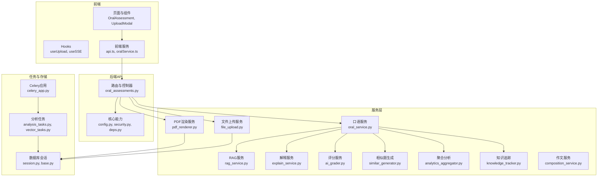
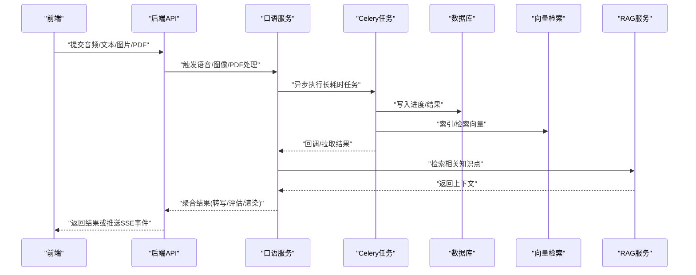
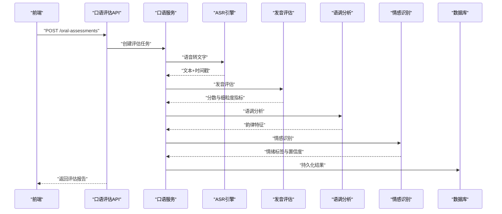
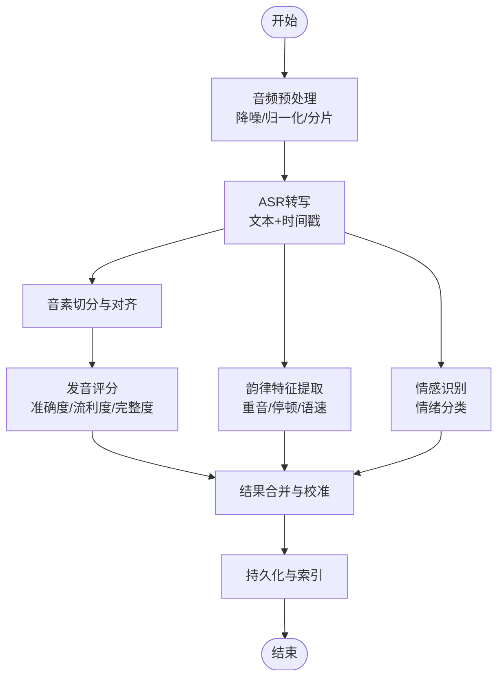
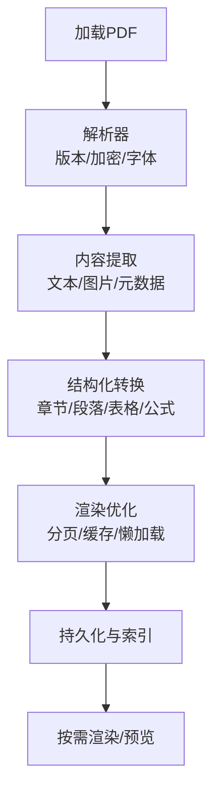
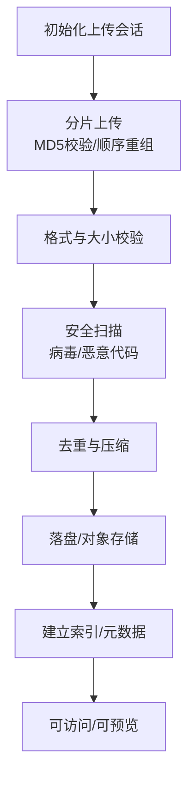
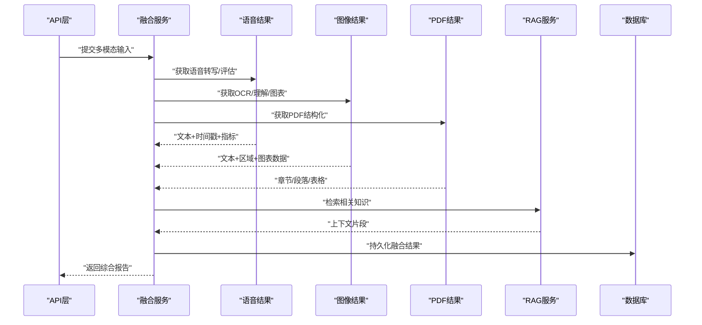
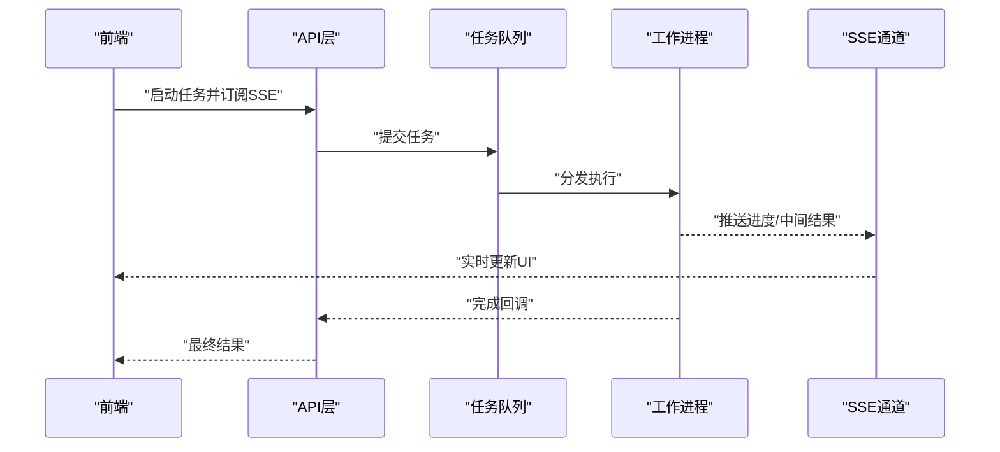
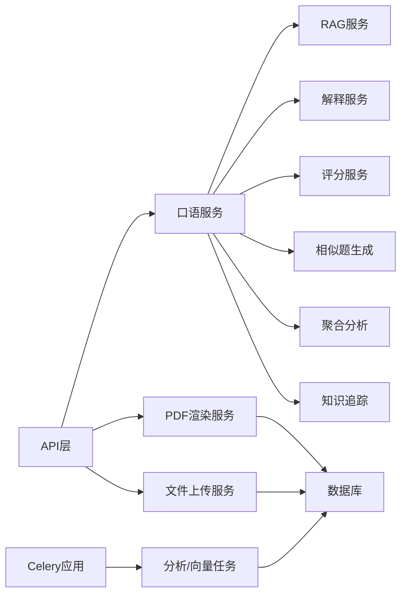

# 多模态AI处理

<cite>
**本文引用的文件**   
- [backend/app/services/oral_service.py](file://backend/app/services/oral_service.py)
- [backend/app/api/v1/oral_assessments.py](file://backend/app/api/v1/oral_assessments.py)
- [backend/app/schemas/ai.py](file://backend/app/schemas/ai.py)
- [backend/app/models/oral_assessment.py](file://backend/app/models/oral_assessment.py)
- [backend/app/services/pdf_renderer.py](file://backend/app/services/pdf_renderer.py)
- [backend/app/services/file_upload.py](file://backend/app/services/file_upload.py)
- [backend/app/core/config.py](file://backend/app/core/config.py)
- [backend/app/core/security.py](file://backend/app/core/security.py)
- [backend/app/tasks/celery_app.py](file://backend/app/tasks/celery_app.py)
- [backend/app/tasks/analysis_tasks.py](file://backend/app/tasks/analysis_tasks.py)
- [backend/app/tasks/vector_tasks.py](file://backend/app/tasks/vector_tasks.py)
- [backend/app/services/rag_service.py](file://backend/app/services/rag_service.py)
- [backend/app/services/explain_service.py](file://backend/app/services/explain_service.py)
- [backend/app/services/composition_service.py](file://backend/app/services/composition_service.py)
- [backend/app/services/ai_grader.py](file://backend/app/services/ai_grader.py)
- [backend/app/services/knowledge_tracker.py](file://backend/app/services/knowledge_tracker.py)
- [backend/app/services/similar_generator.py](file://backend/app/services/similar_generator.py)
- [backend/app/services/analytics_aggregator.py](file://backend/app/services/analytics_aggregator.py)
- [backend/app/db/session.py](file://backend/app/db/session.py)
- [backend/app/db/base.py](file://backend/app/db/base.py)
- [backend/app/core/deps.py](file://backend/app/core/deps.py)
- [backend/app/utils/main.py](file://backend/app/utils/main.py)
- [frontend/src/hooks/useUpload.ts](file://frontend/src/hooks/useUpload.ts)
- [frontend/src/components/UploadModal.tsx](file://frontend/src/components/UploadModal.tsx)
- [frontend/src/pages/OralAssessment/index.tsx](file://frontend/src/pages/OralAssessment/index.tsx)
</cite>

## 目录
1. [简介](#简介)
2. [项目结构](#项目结构)
3. [核心组件](#核心组件)
4. [架构总览](#架构总览)
5. [详细组件分析](#详细组件分析)
6. [依赖关系分析](#依赖关系分析)
7. [性能考虑](#性能考虑)
8. [故障排查指南](#故障排查指南)
9. [结论](#结论)
10. [附录](#附录)

## 简介
本技术文档面向多模态AI处理系统，覆盖语音、图像、PDF与文件上传管理四大能力域，并阐述跨模态融合与实时优化策略。系统后端基于FastAPI构建，结合Celery异步任务队列与向量检索服务，提供从数据接入、解析、推理到结果持久化的完整链路；前端通过React/Vite实现交互与可视化。重点包括：
- 语音处理：语音转文字、发音评估、语调分析、情感识别
- 图像处理：OCR文字识别、图像理解、图表分析、手写体识别
- PDF处理：格式解析、内容提取、结构化转换、渲染优化
- 文件上传管理：大文件分片、格式校验、安全扫描、存储优化
- 多模态融合：跨模态对齐、信息互补、联合推理
- 实时优化：流式处理、增量计算、内存管理

## 项目结构
后端采用分层组织：API层暴露REST接口，Services层封装业务逻辑，Models/Schemas定义数据契约，Tasks层承载异步任务，Core提供配置与安全，DB层负责会话与模型基类。前端以功能页面与通用组件为主，并通过hooks与服务模块对接后端API。

**图示来源** 
- [backend/app/api/v1/oral_assessments.py](file://backend/app/api/v1/oral_assessments.py)
- [backend/app/services/oral_service.py](file://backend/app/services/oral_service.py)
- [backend/app/services/pdf_renderer.py](file://backend/app/services/pdf_renderer.py)
- [backend/app/services/file_upload.py](file://backend/app/services/file_upload.py)
- [backend/app/tasks/celery_app.py](file://backend/app/tasks/celery_app.py)
- [backend/app/tasks/analysis_tasks.py](file://backend/app/tasks/analysis_tasks.py)
- [backend/app/tasks/vector_tasks.py](file://backend/app/tasks/vector_tasks.py)
- [backend/app/db/session.py](file://backend/app/db/session.py)
- [backend/app/db/base.py](file://backend/app/db/base.py)
- [backend/app/core/config.py](file://backend/app/core/config.py)
- [backend/app/core/security.py](file://backend/app/core/security.py)
- [backend/app/core/deps.py](file://backend/app/core/deps.py)

**章节来源**
- [backend/app/api/v1/oral_assessments.py](file://backend/app/api/v1/oral_assessments.py)
- [backend/app/services/oral_service.py](file://backend/app/services/oral_service.py)
- [backend/app/services/pdf_renderer.py](file://backend/app/services/pdf_renderer.py)
- [backend/app/services/file_upload.py](file://backend/app/services/file_upload.py)
- [backend/app/tasks/celery_app.py](file://backend/app/tasks/celery_app.py)
- [backend/app/tasks/analysis_tasks.py](file://backend/app/tasks/analysis_tasks.py)
- [backend/app/tasks/vector_tasks.py](file://backend/app/tasks/vector_tasks.py)
- [backend/app/db/session.py](file://backend/app/db/session.py)
- [backend/app/db/base.py](file://backend/app/db/base.py)
- [backend/app/core/config.py](file://backend/app/core/config.py)
- [backend/app/core/security.py](file://backend/app/core/security.py)
- [backend/app/core/deps.py](file://backend/app/core/deps.py)

## 核心组件
- 语音处理服务：封装语音转写、发音评估、语调分析与情感识别的调用与结果聚合，并与RAG/解释/评分等下游服务协作。
- PDF渲染服务：负责PDF解析、内容提取、结构化转换与渲染优化，支持分页与按需加载。
- 文件上传服务：实现分片上传、格式验证、安全扫描与存储优化（压缩、去重、冷热分层）。
- 任务编排：Celery应用统一调度分析任务与向量化任务，解耦耗时操作。
- 数据模型与Schema：定义口语评估、用户、题目等实体及请求/响应契约。
- 配置与安全：集中化配置项、鉴权中间件与依赖注入。

**章节来源**
- [backend/app/services/oral_service.py](file://backend/app/services/oral_service.py)
- [backend/app/services/pdf_renderer.py](file://backend/app/services/pdf_renderer.py)
- [backend/app/services/file_upload.py](file://backend/app/services/file_upload.py)
- [backend/app/tasks/celery_app.py](file://backend/app/tasks/celery_app.py)
- [backend/app/models/oral_assessment.py](file://backend/app/models/oral_assessment.py)
- [backend/app/schemas/ai.py](file://backend/app/schemas/ai.py)
- [backend/app/core/config.py](file://backend/app/core/config.py)
- [backend/app/core/security.py](file://backend/app/core/security.py)

## 架构总览
系统采用“API网关 + 领域服务 + 异步任务”的分层架构。前端通过HTTP/SSE与后端交互，后端将耗时任务投递至Celery，使用数据库与向量库持久化结果，并通过RAG增强回答质量。

**图示来源** 
- [backend/app/api/v1/oral_assessments.py](file://backend/app/api/v1/oral_assessments.py)
- [backend/app/services/oral_service.py](file://backend/app/services/oral_service.py)
- [backend/app/tasks/celery_app.py](file://backend/app/tasks/celery_app.py)
- [backend/app/tasks/analysis_tasks.py](file://backend/app/tasks/analysis_tasks.py)
- [backend/app/tasks/vector_tasks.py](file://backend/app/tasks/vector_tasks.py)
- [backend/app/services/rag_service.py](file://backend/app/services/rag_service.py)
- [backend/app/db/session.py](file://backend/app/db/session.py)

## 详细组件分析

### 语音处理子系统
职责范围：
- 语音转文字：音频预处理、ASR转写、分段与时间戳对齐
- 发音评估：音素级对比、准确度/流利度/完整度打分
- 语调分析：韵律特征提取、重音与停顿检测
- 情感识别：情绪分类与置信度输出

关键流程（序列图）：

**图示来源** 
- [backend/app/api/v1/oral_assessments.py](file://backend/app/api/v1/oral_assessments.py)
- [backend/app/services/oral_service.py](file://backend/app/services/oral_service.py)
- [backend/app/models/oral_assessment.py](file://backend/app/models/oral_assessment.py)

处理流程图（算法视角）：

**图示来源** 
- [backend/app/services/oral_service.py](file://backend/app/services/oral_service.py)

**章节来源**
- [backend/app/api/v1/oral_assessments.py](file://backend/app/api/v1/oral_assessments.py)
- [backend/app/services/oral_service.py](file://backend/app/services/oral_service.py)
- [backend/app/models/oral_assessment.py](file://backend/app/models/oral_assessment.py)

### 图像处理子系统
职责范围：
- OCR文字识别：版面分析、文本行/词级识别、表格/公式解析
- 图像理解：场景/对象识别、图文描述生成
- 图表分析：图表类型识别、数据点抽取、趋势总结
- 手写体识别：连笔/潦草字符识别与校正

处理流程图（算法视角）：

```mermaid
flowchart TD
Ingest["输入图像"] --> Detect["版面分析<br/>段落/表格/公式定位"]
Detect --> OCR["OCR识别<br/>文本/公式/表格"]
Detect --> Understand["图像理解<br/>对象/场景/关系"]
Detect --> Chart["图表分析<br/>类型识别/数据抽取"]
Detect --> Handwriting["手写体识别<br/>字符校正"]
OCR --> Fuse["多源信息融合"]
Understand --> Fuse
Chart --> Fuse
Handwriting --> Fuse
Fuse --> Output["结构化结果<br/>JSON/Markdown/表格"]
```

[本节为概念性说明，不直接分析具体文件]

### PDF文档处理子系统
职责范围：
- 格式解析：版本兼容、加密解密、字体嵌入检查
- 内容提取：文本、图片、元数据、目录书签
- 结构化转换：章节/段落/表格/公式的结构化表示
- 渲染优化：分页、按需加载、矢量图缩放、缓存策略

处理流程图（算法视角）：

**图示来源** 
- [backend/app/services/pdf_renderer.py](file://backend/app/services/pdf_renderer.py)

**章节来源**
- [backend/app/services/pdf_renderer.py](file://backend/app/services/pdf_renderer.py)

### 文件上传管理系统
职责范围：
- 大文件处理：分片上传、断点续传、并发控制
- 格式验证：MIME类型、扩展名、白名单校验
- 安全扫描：病毒扫描、恶意脚本检测、沙箱隔离
- 存储优化：压缩、去重、冷热分层、CDN加速

处理流程图（算法视角）：

**图示来源** 
- [backend/app/services/file_upload.py](file://backend/app/services/file_upload.py)
- [backend/app/core/security.py](file://backend/app/core/security.py)

**章节来源**
- [backend/app/services/file_upload.py](file://backend/app/services/file_upload.py)
- [backend/app/core/security.py](file://backend/app/core/security.py)

### 多模态数据融合
目标：
- 跨模态对齐：时间轴/空间坐标对齐（如音频时间戳与文本片段、图像区域与OCR框）
- 信息互补：语音+文本+图像联合表征，提升鲁棒性与准确性
- 联合推理：基于RAG的知识增强与一致性约束，生成综合报告

融合流程（序列图）：

**图示来源** 
- [backend/app/services/oral_service.py](file://backend/app/services/oral_service.py)
- [backend/app/services/pdf_renderer.py](file://backend/app/services/pdf_renderer.py)
- [backend/app/services/rag_service.py](file://backend/app/services/rag_service.py)

**章节来源**
- [backend/app/services/oral_service.py](file://backend/app/services/oral_service.py)
- [backend/app/services/pdf_renderer.py](file://backend/app/services/pdf_renderer.py)
- [backend/app/services/rag_service.py](file://backend/app/services/rag_service.py)

### 实时处理优化
策略：
- 流式处理：SSE推送进度与中间结果，降低首屏延迟
- 增量计算：对变更部分进行局部更新，避免全量重算
- 内存管理：流式读取、分块处理、对象池与缓存淘汰

实时流程（序列图）：

**图示来源** 
- [backend/app/tasks/celery_app.py](file://backend/app/tasks/celery_app.py)
- [backend/app/tasks/analysis_tasks.py](file://backend/app/tasks/analysis_tasks.py)
- [backend/app/tasks/vector_tasks.py](file://backend/app/tasks/vector_tasks.py)

**章节来源**
- [backend/app/tasks/celery_app.py](file://backend/app/tasks/celery_app.py)
- [backend/app/tasks/analysis_tasks.py](file://backend/app/tasks/analysis_tasks.py)
- [backend/app/tasks/vector_tasks.py](file://backend/app/tasks/vector_tasks.py)

## 依赖关系分析
- 组件耦合：API层依赖服务层，服务层依赖任务与数据库；RAG与解释/评分/相似题生成等服务形成横向支撑。
- 外部集成：Celery任务队列、向量检索、对象存储、安全扫描工具。
- 循环依赖：应避免服务间相互引用，通过消息或事件总线解耦。

**图示来源** 
- [backend/app/api/v1/oral_assessments.py](file://backend/app/api/v1/oral_assessments.py)
- [backend/app/services/oral_service.py](file://backend/app/services/oral_service.py)
- [backend/app/services/pdf_renderer.py](file://backend/app/services/pdf_renderer.py)
- [backend/app/services/file_upload.py](file://backend/app/services/file_upload.py)
- [backend/app/services/rag_service.py](file://backend/app/services/rag_service.py)
- [backend/app/services/explain_service.py](file://backend/app/services/explain_service.py)
- [backend/app/services/ai_grader.py](file://backend/app/services/ai_grader.py)
- [backend/app/services/similar_generator.py](file://backend/app/services/similar_generator.py)
- [backend/app/services/analytics_aggregator.py](file://backend/app/services/analytics_aggregator.py)
- [backend/app/services/knowledge_tracker.py](file://backend/app/services/knowledge_tracker.py)
- [backend/app/tasks/celery_app.py](file://backend/app/tasks/celery_app.py)
- [backend/app/tasks/analysis_tasks.py](file://backend/app/tasks/analysis_tasks.py)
- [backend/app/tasks/vector_tasks.py](file://backend/app/tasks/vector_tasks.py)
- [backend/app/db/session.py](file://backend/app/db/session.py)

**章节来源**
- [backend/app/api/v1/oral_assessments.py](file://backend/app/api/v1/oral_assessments.py)
- [backend/app/services/oral_service.py](file://backend/app/services/oral_service.py)
- [backend/app/services/pdf_renderer.py](file://backend/app/services/pdf_renderer.py)
- [backend/app/services/file_upload.py](file://backend/app/services/file_upload.py)
- [backend/app/services/rag_service.py](file://backend/app/services/rag_service.py)
- [backend/app/services/explain_service.py](file://backend/app/services/explain_service.py)
- [backend/app/services/ai_grader.py](file://backend/app/services/ai_grader.py)
- [backend/app/services/similar_generator.py](file://backend/app/services/similar_generator.py)
- [backend/app/services/analytics_aggregator.py](file://backend/app/services/analytics_aggregator.py)
- [backend/app/services/knowledge_tracker.py](file://backend/app/services/knowledge_tracker.py)
- [backend/app/tasks/celery_app.py](file://backend/app/tasks/celery_app.py)
- [backend/app/tasks/analysis_tasks.py](file://backend/app/tasks/analysis_tasks.py)
- [backend/app/tasks/vector_tasks.py](file://backend/app/tasks/vector_tasks.py)
- [backend/app/db/session.py](file://backend/app/db/session.py)

## 性能考虑
- 批处理与并行：对批量音频/图像/PDF采用流水线并行，提高吞吐。
- 缓存策略：热点结果与向量索引缓存，减少重复计算与I/O。
- 资源隔离：GPU/CPU任务分离，限制并发与超时，防止雪崩。
- 监控与度量：记录端到端时延、成功率、错误率与资源占用。

[本节为通用指导，不直接分析具体文件]

## 故障排查指南
常见问题与定位要点：
- 任务失败：查看Celery日志与工作进程状态，确认重试与死信队列。
- 上传中断：检查分片MD5校验与顺序重组，确认网络与存储可用性。
- 渲染异常：核对PDF版本与字体嵌入，启用降级渲染与回退路径。
- 鉴权问题：确认令牌有效期与权限范围，检查中间件拦截规则。

**章节来源**
- [backend/app/tasks/celery_app.py](file://backend/app/tasks/celery_app.py)
- [backend/app/tasks/analysis_tasks.py](file://backend/app/tasks/analysis_tasks.py)
- [backend/app/tasks/vector_tasks.py](file://backend/app/tasks/vector_tasks.py)
- [backend/app/core/security.py](file://backend/app/core/security.py)

## 结论
本系统围绕多模态数据处理构建了稳健的后端架构与前端交互体验。通过服务化拆分、异步任务编排与RAG增强，实现了语音、图像、PDF的统一处理与融合输出。建议持续完善监控告警、容量规划与灰度发布机制，进一步提升稳定性与可扩展性。

[本节为总结性内容，不直接分析具体文件]

## 附录

### 前端交互要点
- 上传组件：支持拖拽、分片、进度条与错误提示。
- 口语评估页：展示转写文本、评分详情、韵律曲线与情感标签。
- SSE订阅：实时更新任务进度与中间结果。

**章节来源**
- [frontend/src/components/UploadModal.tsx](file://frontend/src/components/UploadModal.tsx)
- [frontend/src/hooks/useUpload.ts](file://frontend/src/hooks/useUpload.ts)
- [frontend/src/pages/OralAssessment/index.tsx](file://frontend/src/pages/OralAssessment/index.tsx)

### 配置与安全
- 配置中心：集中管理模型路径、存储桶、队列参数与阈值。
- 安全策略：令牌校验、权限控制、输入清洗与输出脱敏。

**章节来源**
- [backend/app/core/config.py](file://backend/app/core/config.py)
- [backend/app/core/security.py](file://backend/app/core/security.py)
- [backend/app/core/deps.py](file://backend/app/core/deps.py)

### 数据模型与Schema
- 口语评估：包含转写文本、评分维度、韵律特征与情感标签。
- AI相关Schema：定义请求/响应结构与校验规则。

**章节来源**
- [backend/app/models/oral_assessment.py](file://backend/app/models/oral_assessment.py)
- [backend/app/schemas/ai.py](file://backend/app/schemas/ai.py)

### 数据库与会话
- 会话管理：连接池、事务与重试策略。
- 模型基类：公共字段、审计信息与软删除。

**章节来源**
- [backend/app/db/session.py](file://backend/app/db/session.py)
- [backend/app/db/base.py](file://backend/app/db/base.py)

### 辅助服务
- 解释服务：生成可读性强的反馈与建议。
- 评分服务：多维度评分与一致性校验。
- 相似题生成：基于语义相似度推荐练习。
- 聚合分析：学习行为与成绩统计。
- 知识追踪：知识点掌握度建模。
- 作文服务：作文批改与润色建议。

**章节来源**
- [backend/app/services/explain_service.py](file://backend/app/services/explain_service.py)
- [backend/app/services/ai_grader.py](file://backend/app/services/ai_grader.py)
- [backend/app/services/similar_generator.py](file://backend/app/services/similar_generator.py)
- [backend/app/services/analytics_aggregator.py](file://backend/app/services/analytics_aggregator.py)
- [backend/app/services/knowledge_tracker.py](file://backend/app/services/knowledge_tracker.py)
- [backend/app/services/composition_service.py](file://backend/app/services/composition_service.py)