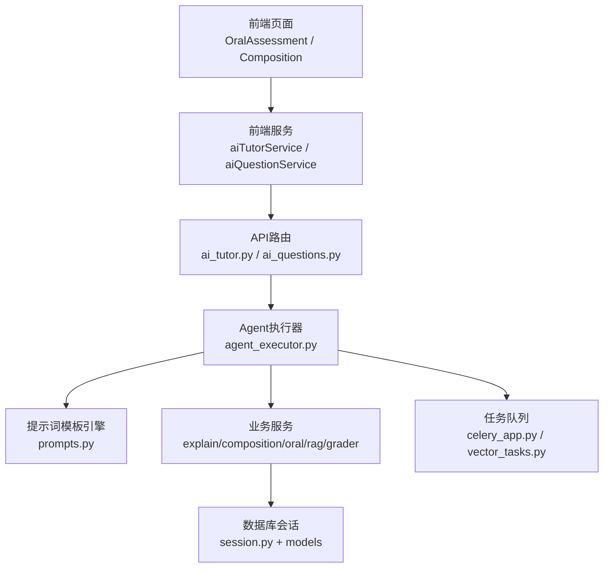
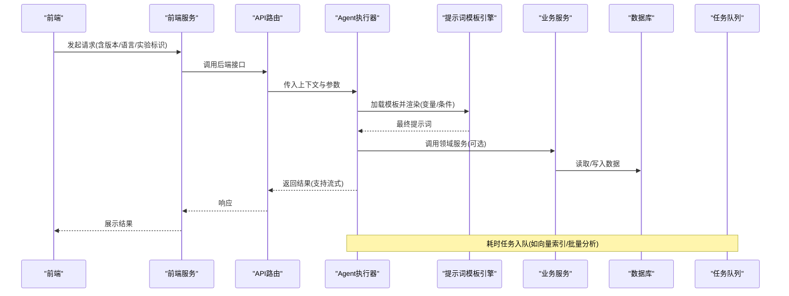
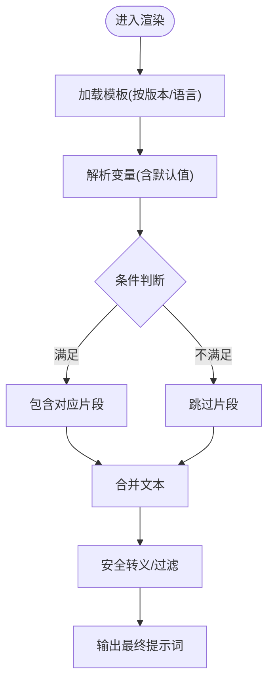
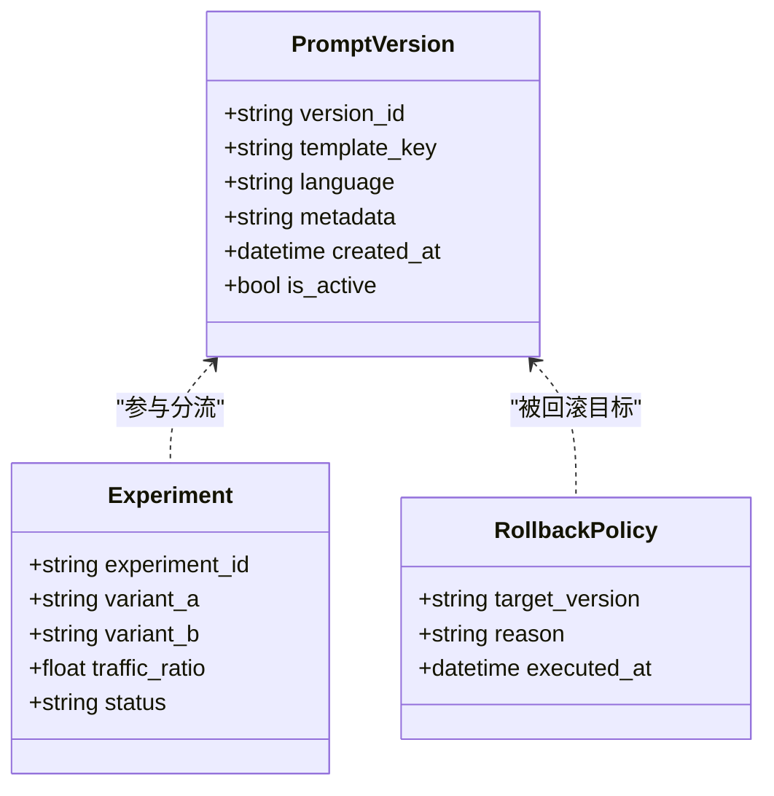
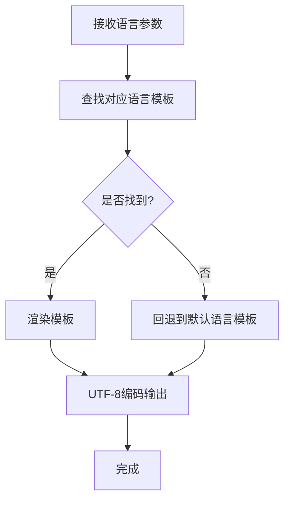
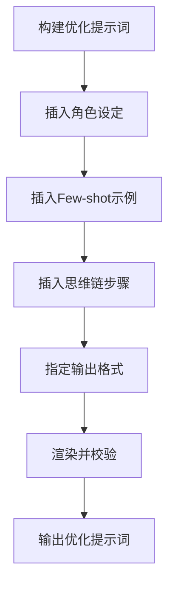
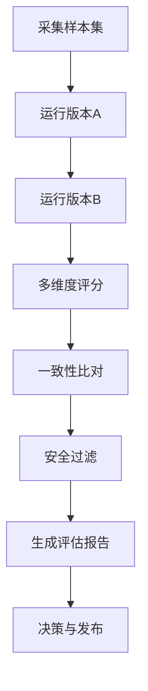
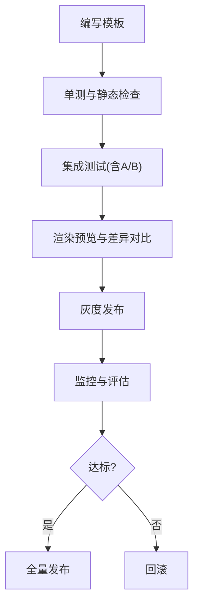
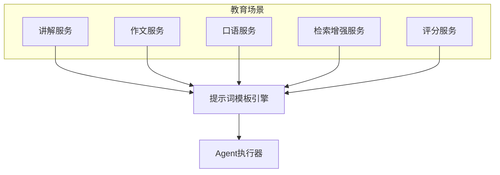
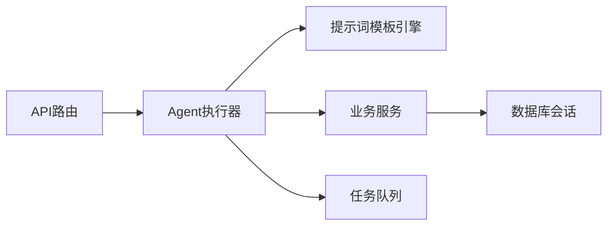

# 提示词工程系统

<cite>
**本文引用的文件**   
- [backend/app/services/agent/prompts.py](file://backend/app/services/agent/prompts.py)
- [backend/app/services/agent/agent_executor.py](file://backend/app/services/agent/agent_executor.py)
- [backend/app/api/v1/ai_tutor.py](file://backend/app/api/v1/ai_tutor.py)
- [backend/app/api/v1/ai_questions.py](file://backend/app/api/v1/ai_questions.py)
- [backend/app/schemas/ai.py](file://backend/app/schemas/ai.py)
- [backend/app/core/config.py](file://backend/app/core/config.py)
- [backend/app/db/session.py](file://backend/app/db/session.py)
- [backend/app/models/conversation.py](file://backend/app/models/conversation.py)
- [backend/app/models/question.py](file://backend/app/models/question.py)
- [backend/app/models/ai_question.py](file://backend/app/models/ai_question.py)
- [backend/app/services/explain_service.py](file://backend/app/services/explain_service.py)
- [backend/app/services/composition_service.py](file://backend/app/services/composition_service.py)
- [backend/app/services/oral_service.py](file://backend/app/services/oral_service.py)
- [backend/app/services/rag_service.py](file://backend/app/services/rag_service.py)
- [backend/app/services/ai_grader.py](file://backend/app/services/ai_grader.py)
- [backend/app/tasks/celery_app.py](file://backend/app/tasks/celery_app.py)
- [backend/app/tasks/vector_tasks.py](file://backend/app/tasks/vector_tasks.py)
- [frontend/src/services/aiTutorService.ts](file://frontend/src/services/aiTutorService.ts)
- [frontend/src/services/aiQuestionService.ts](file://frontend/src/services/aiQuestionService.ts)
- [frontend/src/pages/OralAssessment/index.tsx](file://frontend/src/pages/OralAssessment/index.tsx)
- [frontend/src/pages/Composition/index.tsx](file://frontend/src/pages/Composition/index.tsx)
</cite>

## 目录
1. [简介](#简介)
2. [项目结构](#项目结构)
3. [核心组件](#核心组件)
4. [架构总览](#架构总览)
5. [详细组件分析](#详细组件分析)
6. [依赖关系分析](#依赖关系分析)
7. [性能考量](#性能考量)
8. [故障排查指南](#故障排查指南)
9. [结论](#结论)
10. [附录](#附录)

## 简介
本技术文档围绕“提示词工程系统”展开，聚焦于动态提示词模板引擎、版本管理、多语言支持、优化技术与质量评估体系，并结合教育场景给出可落地的设计模式与最佳实践。系统后端基于FastAPI构建，前端采用React+TypeScript；提示词相关能力集中在服务层与Agent执行器中，通过API暴露给前端调用。

## 项目结构
从代码组织看，提示词工程相关能力主要分布在以下位置：
- 提示词模板与渲染：services/agent/prompts.py
- Agent编排与执行：services/agent/agent_executor.py
- 业务服务（作文、口语、讲解、评分等）：services/*_service.py
- API路由：api/v1/ai_tutor.py、api/v1/ai_questions.py
- 数据模型与持久化：models/*、db/session.py
- 任务队列（异步处理）：tasks/*
- 前端交互：frontend/src/services/*、frontend/src/pages/*

图表来源
- [backend/app/api/v1/ai_tutor.py](file://backend/app/api/v1/ai_tutor.py)
- [backend/app/api/v1/ai_questions.py](file://backend/app/api/v1/ai_questions.py)
- [backend/app/services/agent/agent_executor.py](file://backend/app/services/agent/agent_executor.py)
- [backend/app/services/agent/prompts.py](file://backend/app/services/agent/prompts.py)
- [backend/app/services/explain_service.py](file://backend/app/services/explain_service.py)
- [backend/app/services/composition_service.py](file://backend/app/services/composition_service.py)
- [backend/app/services/oral_service.py](file://backend/app/services/oral_service.py)
- [backend/app/services/rag_service.py](file://backend/app/services/rag_service.py)
- [backend/app/services/ai_grader.py](file://backend/app/services/ai_grader.py)
- [backend/app/db/session.py](file://backend/app/db/session.py)
- [backend/app/tasks/celery_app.py](file://backend/app/tasks/celery_app.py)
- [backend/app/tasks/vector_tasks.py](file://backend/app/tasks/vector_tasks.py)
- [frontend/src/services/aiTutorService.ts](file://frontend/src/services/aiTutorService.ts)
- [frontend/src/services/aiQuestionService.ts](file://frontend/src/services/aiQuestionService.ts)
- [frontend/src/pages/OralAssessment/index.tsx](file://frontend/src/pages/OralAssessment/index.tsx)
- [frontend/src/pages/Composition/index.tsx](file://frontend/src/pages/Composition/index.tsx)

章节来源
- [backend/app/services/agent/prompts.py](file://backend/app/services/agent/prompts.py)
- [backend/app/services/agent/agent_executor.py](file://backend/app/services/agent/agent_executor.py)
- [backend/app/api/v1/ai_tutor.py](file://backend/app/api/v1/ai_tutor.py)
- [backend/app/api/v1/ai_questions.py](file://backend/app/api/v1/ai_questions.py)
- [backend/app/schemas/ai.py](file://backend/app/schemas/ai.py)
- [backend/app/core/config.py](file://backend/app/core/config.py)
- [backend/app/db/session.py](file://backend/app/db/session.py)
- [backend/app/models/conversation.py](file://backend/app/models/conversation.py)
- [backend/app/models/question.py](file://backend/app/models/question.py)
- [backend/app/models/ai_question.py](file://backend/app/models/ai_question.py)
- [backend/app/services/explain_service.py](file://backend/app/services/explain_service.py)
- [backend/app/services/composition_service.py](file://backend/app/services/composition_service.py)
- [backend/app/services/oral_service.py](file://backend/app/services/oral_service.py)
- [backend/app/services/rag_service.py](file://backend/app/services/rag_service.py)
- [backend/app/services/ai_grader.py](file://backend/app/services/ai_grader.py)
- [backend/app/tasks/celery_app.py](file://backend/app/tasks/celery_app.py)
- [backend/app/tasks/vector_tasks.py](file://backend/app/tasks/vector_tasks.py)
- [frontend/src/services/aiTutorService.ts](file://frontend/src/services/aiTutorService.ts)
- [frontend/src/services/aiQuestionService.ts](file://frontend/src/services/aiQuestionService.ts)
- [frontend/src/pages/OralAssessment/index.tsx](file://frontend/src/pages/OralAssessment/index.tsx)
- [frontend/src/pages/Composition/index.tsx](file://frontend/src/pages/Composition/index.tsx)

## 核心组件
- 动态提示词模板引擎：负责模板解析、变量替换、条件渲染与上下文注入。
- Agent执行器：统一编排提示词渲染、工具调用、流式输出与错误恢复。
- 业务服务：将领域知识（讲解、作文、口语、检索增强、评分）封装为可组合的提示词工作流。
- API层：定义请求/响应契约，承载版本参数、A/B实验标识、语言偏好等。
- 数据层：持久化对话、题目、AI生成结果，支撑版本追踪与回滚。
- 任务队列：承担耗时任务（向量索引、批量分析），避免阻塞主流程。

章节来源
- [backend/app/services/agent/prompts.py](file://backend/app/services/agent/prompts.py)
- [backend/app/services/agent/agent_executor.py](file://backend/app/services/agent/agent_executor.py)
- [backend/app/api/v1/ai_tutor.py](file://backend/app/api/v1/ai_tutor.py)
- [backend/app/api/v1/ai_questions.py](file://backend/app/api/v1/ai_questions.py)
- [backend/app/schemas/ai.py](file://backend/app/schemas/ai.py)
- [backend/app/core/config.py](file://backend/app/core/config.py)
- [backend/app/db/session.py](file://backend/app/db/session.py)
- [backend/app/models/conversation.py](file://backend/app/models/conversation.py)
- [backend/app/models/question.py](file://backend/app/models/question.py)
- [backend/app/models/ai_question.py](file://backend/app/models/ai_question.py)

## 架构总览
下图展示了从前端到后端的完整调用链，以及提示词在其中的流转路径。

图表来源
- [backend/app/api/v1/ai_tutor.py](file://backend/app/api/v1/ai_tutor.py)
- [backend/app/api/v1/ai_questions.py](file://backend/app/api/v1/ai_questions.py)
- [backend/app/services/agent/agent_executor.py](file://backend/app/services/agent/agent_executor.py)
- [backend/app/services/agent/prompts.py](file://backend/app/services/agent/prompts.py)
- [backend/app/db/session.py](file://backend/app/db/session.py)
- [backend/app/tasks/celery_app.py](file://backend/app/tasks/celery_app.py)
- [backend/app/tasks/vector_tasks.py](file://backend/app/tasks/vector_tasks.py)

## 详细组件分析

### 动态提示词模板引擎
- 模板语法
  - 变量占位符：用于注入用户输入、上下文、系统配置等。
  - 条件渲染：根据角色、学段、难度、语言等开关控制段落或示例的显隐。
  - 列表/片段复用：将常用片段（如评分维度、反馈句式）抽象为可复用块。
- 变量替换
  - 安全替换：对特殊字符进行转义，防止提示词注入。
  - 默认值与缺失处理：当变量缺失时提供降级策略。
- 条件渲染
  - 基于上下文的布尔表达式与枚举匹配，实现不同教学策略的切换。
- 版本化与缓存
  - 模板按版本键控，变更时自动失效旧缓存，保证一致性。
- 多语言支持
  - 以语言码为键选择对应模板分支，统一编码为UTF-8输出。

图表来源
- [backend/app/services/agent/prompts.py](file://backend/app/services/agent/prompts.py)

章节来源
- [backend/app/services/agent/prompts.py](file://backend/app/services/agent/prompts.py)

### 提示词版本管理机制
- 版本控制
  - 模板与服务逻辑绑定版本号，API请求携带版本参数，确保可复现。
  - 元数据记录变更说明、生效时间、影响范围。
- A/B测试
  - 通过实验标识分流不同模板版本，统计关键指标（正确率、满意度、耗时）。
  - 前端传递实验ID，后端据此选择模板与评估策略。
- 回滚策略
  - 支持一键回滚至上一稳定版本，保留历史快照与审计日志。
  - 灰度发布：先小流量验证，再全量上线。

图表来源
- [backend/app/api/v1/ai_tutor.py](file://backend/app/api/v1/ai_tutor.py)
- [backend/app/api/v1/ai_questions.py](file://backend/app/api/v1/ai_questions.py)
- [backend/app/schemas/ai.py](file://backend/app/schemas/ai.py)
- [backend/app/models/ai_question.py](file://backend/app/models/ai_question.py)
- [backend/app/models/conversation.py](file://backend/app/models/conversation.py)

章节来源
- [backend/app/api/v1/ai_tutor.py](file://backend/app/api/v1/ai_tutor.py)
- [backend/app/api/v1/ai_questions.py](file://backend/app/api/v1/ai_questions.py)
- [backend/app/schemas/ai.py](file://backend/app/schemas/ai.py)
- [backend/app/models/ai_question.py](file://backend/app/models/ai_question.py)
- [backend/app/models/conversation.py](file://backend/app/models/conversation.py)

### 多语言提示词支持
- 国际化
  - 以语言码为维度维护模板集合，支持中文、英文等多套模板。
- 本地化
  - 结合地区习惯调整术语与表达风格，保持教学一致性。
- 字符编码
  - 统一使用UTF-8，避免乱码；对外部输入进行编码校验与清洗。

图表来源
- [backend/app/services/agent/prompts.py](file://backend/app/services/agent/prompts.py)
- [backend/app/core/config.py](file://backend/app/core/config.py)

章节来源
- [backend/app/services/agent/prompts.py](file://backend/app/services/agent/prompts.py)
- [backend/app/core/config.py](file://backend/app/core/config.py)

### 提示词优化技术
- Few-shot学习
  - 在模板中嵌入少量高质量示例，提升模型对齐度与稳定性。
- 思维链提示
  - 引导模型分步推理，提高复杂问题的解答质量。
- 角色设定
  - 明确教师/助教角色与语气，增强一致性与亲和力。
- 结构化输出
  - 要求JSON或固定字段，便于后续解析与评测。

图表来源
- [backend/app/services/agent/prompts.py](file://backend/app/services/agent/prompts.py)
- [backend/app/services/agent/agent_executor.py](file://backend/app/services/agent/agent_executor.py)

章节来源
- [backend/app/services/agent/prompts.py](file://backend/app/services/agent/prompts.py)
- [backend/app/services/agent/agent_executor.py](file://backend/app/services/agent/agent_executor.py)

### 提示词质量评估体系
- 效果评分
  - 基于准确率、可读性、教学有效性等维度打分。
- 一致性检查
  - 对比同一输入在不同版本的输出差异，检测漂移。
- 安全性过滤
  - 敏感词过滤、越权指令拦截、内容合规审查。
- 评估流水线
  - 离线批测与在线抽检结合，持续监控。

图表来源
- [backend/app/services/ai_grader.py](file://backend/app/services/ai_grader.py)
- [backend/app/api/v1/ai_tutor.py](file://backend/app/api/v1/ai_tutor.py)
- [backend/app/api/v1/ai_questions.py](file://backend/app/api/v1/ai_questions.py)

章节来源
- [backend/app/services/ai_grader.py](file://backend/app/services/ai_grader.py)
- [backend/app/api/v1/ai_tutor.py](file://backend/app/api/v1/ai_tutor.py)
- [backend/app/api/v1/ai_questions.py](file://backend/app/api/v1/ai_questions.py)

### 提示词开发工作流
- 编写规范
  - 模板命名约定、版本语义化、注释与变更记录。
- 测试方法
  - 单元测试覆盖边界条件；集成测试验证端到端链路；回归测试保障稳定性。
- 调试工具
  - 可视化渲染预览、变量注入检查、差异对比与日志追踪。
- 发布流程
  - 灰度→观察→全量；失败快速回滚。

图表来源
- [backend/app/api/v1/ai_tutor.py](file://backend/app/api/v1/ai_tutor.py)
- [backend/app/api/v1/ai_questions.py](file://backend/app/api/v1/ai_questions.py)
- [backend/app/services/agent/prompts.py](file://backend/app/services/agent/prompts.py)

章节来源
- [backend/app/api/v1/ai_tutor.py](file://backend/app/api/v1/ai_tutor.py)
- [backend/app/api/v1/ai_questions.py](file://backend/app/api/v1/ai_questions.py)
- [backend/app/services/agent/prompts.py](file://backend/app/services/agent/prompts.py)

### 教育场景下的设计模式与最佳实践
- 讲解类
  - 角色设定为“耐心教师”，配合思维链逐步拆解知识点。
- 作文批改
  - 引入评分维度与示例，强调建设性反馈与改进建议。
- 口语测评
  - 结合语音转写与评分规则，提供发音、流利度、准确度反馈。
- 错题分析与相似题生成
  - 利用RAG检索相关知识，生成针对性练习与解释。

图表来源
- [backend/app/services/explain_service.py](file://backend/app/services/explain_service.py)
- [backend/app/services/composition_service.py](file://backend/app/services/composition_service.py)
- [backend/app/services/oral_service.py](file://backend/app/services/oral_service.py)
- [backend/app/services/rag_service.py](file://backend/app/services/rag_service.py)
- [backend/app/services/ai_grader.py](file://backend/app/services/ai_grader.py)
- [backend/app/services/agent/prompts.py](file://backend/app/services/agent/prompts.py)
- [backend/app/services/agent/agent_executor.py](file://backend/app/services/agent/agent_executor.py)

章节来源
- [backend/app/services/explain_service.py](file://backend/app/services/explain_service.py)
- [backend/app/services/composition_service.py](file://backend/app/services/composition_service.py)
- [backend/app/services/oral_service.py](file://backend/app/services/oral_service.py)
- [backend/app/services/rag_service.py](file://backend/app/services/rag_service.py)
- [backend/app/services/ai_grader.py](file://backend/app/services/ai_grader.py)
- [backend/app/services/agent/prompts.py](file://backend/app/services/agent/prompts.py)
- [backend/app/services/agent/agent_executor.py](file://backend/app/services/agent/agent_executor.py)

## 依赖关系分析
- 模块耦合
  - API层依赖执行器与Schema；执行器依赖模板引擎与业务服务；业务服务依赖数据库与会话。
- 外部依赖
  - 任务队列用于异步处理；数据库用于持久化；配置中心用于运行时参数。
- 潜在循环依赖
  - 通过分层与接口隔离避免循环引用。

图表来源
- [backend/app/api/v1/ai_tutor.py](file://backend/app/api/v1/ai_tutor.py)
- [backend/app/api/v1/ai_questions.py](file://backend/app/api/v1/ai_questions.py)
- [backend/app/services/agent/agent_executor.py](file://backend/app/services/agent/agent_executor.py)
- [backend/app/services/agent/prompts.py](file://backend/app/services/agent/prompts.py)
- [backend/app/db/session.py](file://backend/app/db/session.py)
- [backend/app/tasks/celery_app.py](file://backend/app/tasks/celery_app.py)

章节来源
- [backend/app/api/v1/ai_tutor.py](file://backend/app/api/v1/ai_tutor.py)
- [backend/app/api/v1/ai_questions.py](file://backend/app/api/v1/ai_questions.py)
- [backend/app/services/agent/agent_executor.py](file://backend/app/services/agent/agent_executor.py)
- [backend/app/services/agent/prompts.py](file://backend/app/services/agent/prompts.py)
- [backend/app/db/session.py](file://backend/app/db/session.py)
- [backend/app/tasks/celery_app.py](file://backend/app/tasks/celery_app.py)

## 性能考量
- 模板渲染缓存：按版本与语言键控，减少重复计算。
- 流式输出：降低首字节延迟，提升用户体验。
- 异步任务：将耗时操作（向量索引、批量分析）放入队列，避免阻塞。
- 连接池与限流：数据库与外部LLM调用设置合理超时与重试策略。

[本节为通用指导，无需特定文件来源]

## 故障排查指南
- 常见问题定位
  - 模板未命中：检查版本与语言参数是否正确。
  - 变量缺失：查看渲染日志中的变量注入情况。
  - 安全拦截：确认敏感词与安全策略配置。
- 诊断手段
  - 启用详细日志，记录模板渲染前后差异。
  - 使用A/B面板对比不同版本表现。
  - 回放历史请求，复现场景。

章节来源
- [backend/app/api/v1/ai_tutor.py](file://backend/app/api/v1/ai_tutor.py)
- [backend/app/api/v1/ai_questions.py](file://backend/app/api/v1/ai_questions.py)
- [backend/app/services/agent/prompts.py](file://backend/app/services/agent/prompts.py)
- [backend/app/services/agent/agent_executor.py](file://backend/app/services/agent/agent_executor.py)

## 结论
本系统通过模块化设计与清晰的职责划分，实现了可扩展的提示词工程能力。模板引擎、版本管理、多语言支持与评估体系共同保障了教学质量与稳定性。结合教育场景的设计模式与最佳实践，可在讲解、作文、口语与错题分析等方向持续提升学习效果。

[本节为总结性内容，无需特定文件来源]

## 附录
- 前端对接要点
  - 传递版本、语言与实验标识，确保后端能正确选择模板与策略。
  - 使用流式接口获取实时反馈，提升交互体验。
- 数据模型参考
  - 对话、题目、AI问题等实体用于追踪与审计。

章节来源
- [frontend/src/services/aiTutorService.ts](file://frontend/src/services/aiTutorService.ts)
- [frontend/src/services/aiQuestionService.ts](file://frontend/src/services/aiQuestionService.ts)
- [frontend/src/pages/OralAssessment/index.tsx](file://frontend/src/pages/OralAssessment/index.tsx)
- [frontend/src/pages/Composition/index.tsx](file://frontend/src/pages/Composition/index.tsx)
- [backend/app/models/conversation.py](file://backend/app/models/conversation.py)
- [backend/app/models/question.py](file://backend/app/models/question.py)
- [backend/app/models/ai_question.py](file://backend/app/models/ai_question.py)