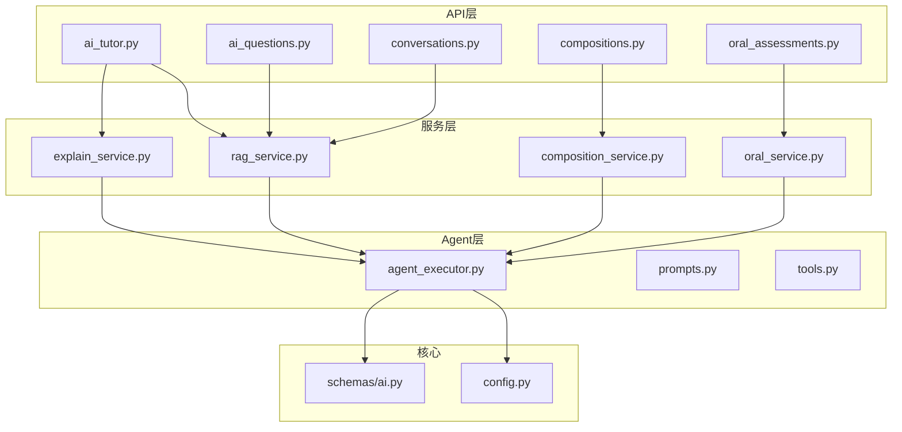
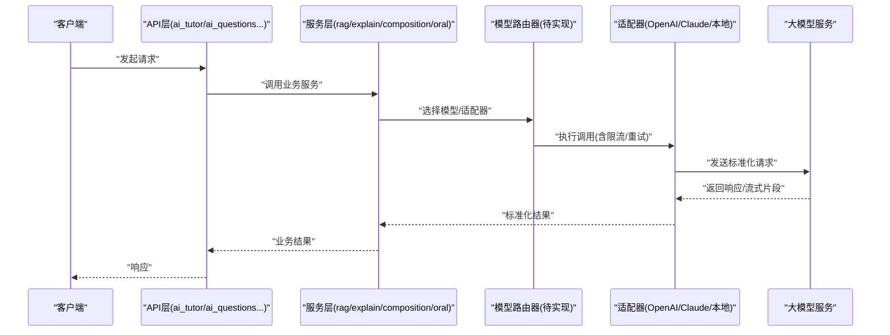
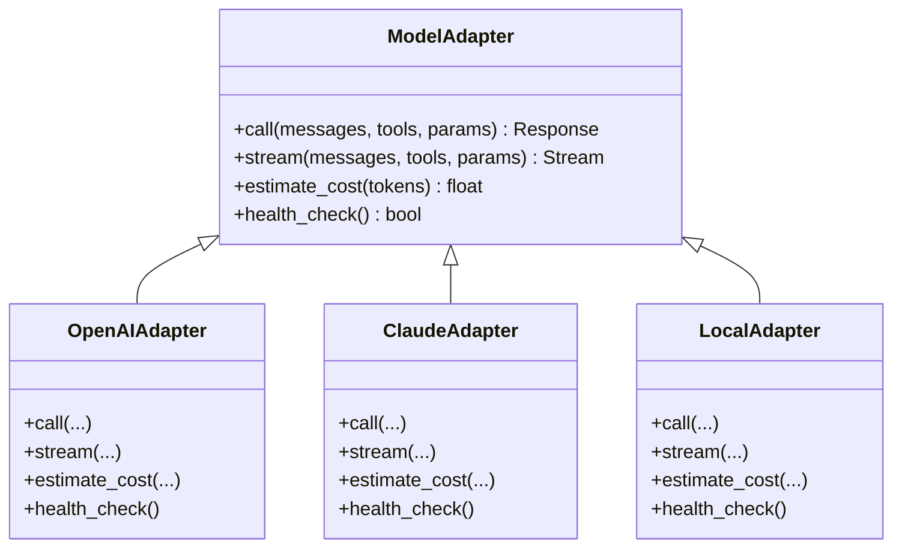
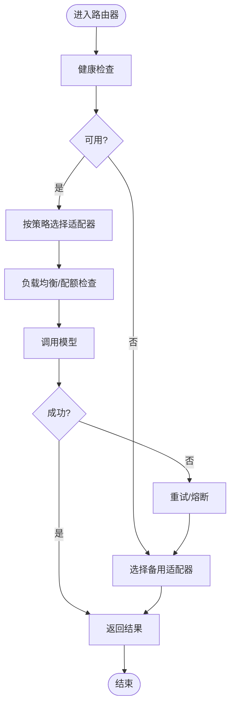
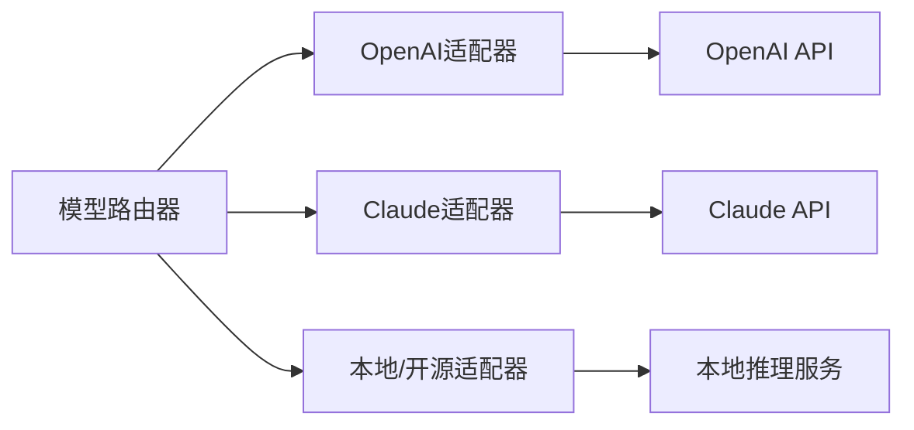
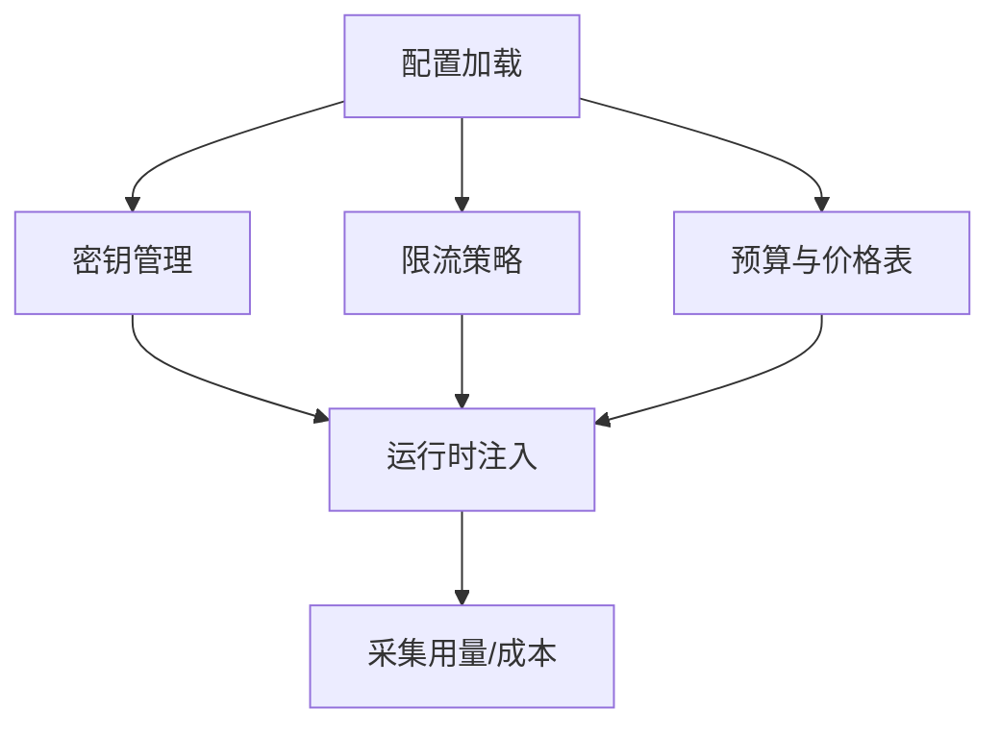
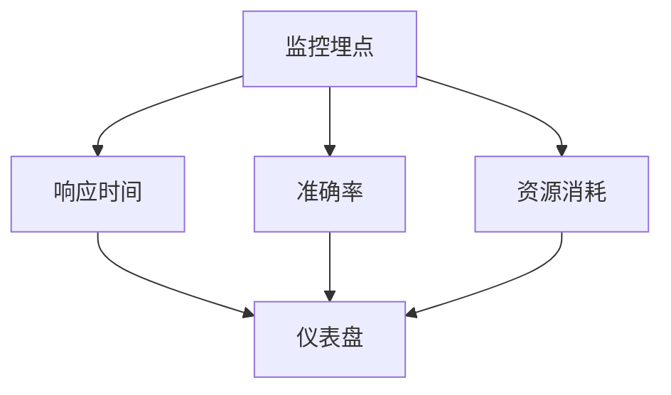
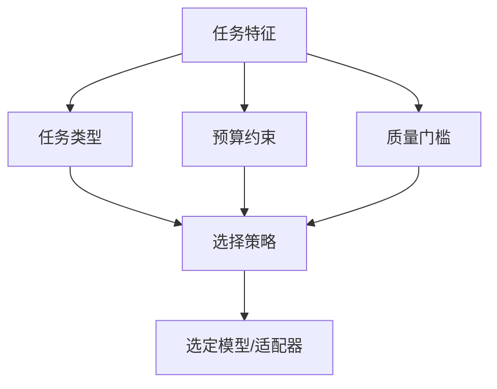
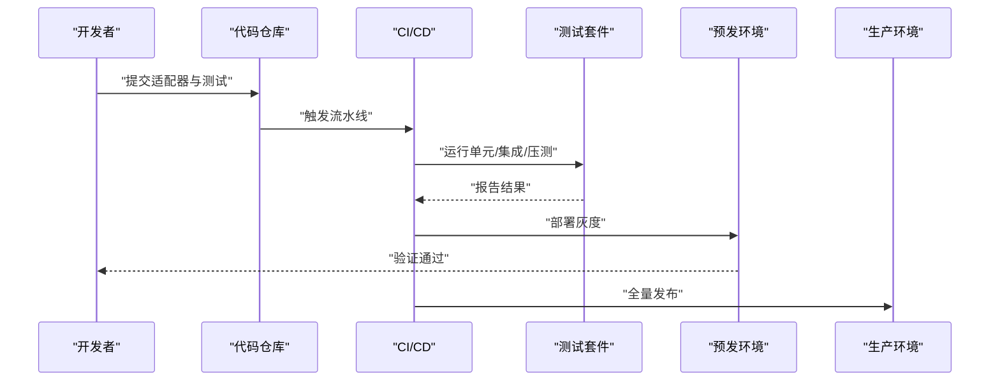
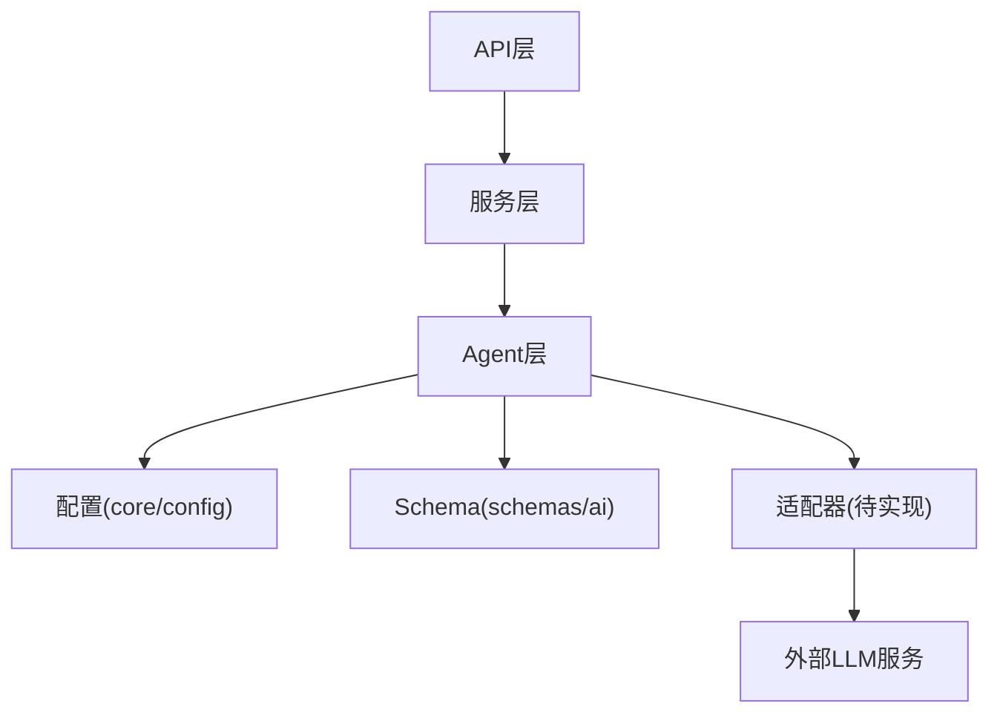

# 模型集成与切换

<cite>
**本文引用的文件**   
- [backend/app/core/config.py](file://backend/app/core/config.py)
- [backend/app/services/rag_service.py](file://backend/app/services/rag_service.py)
- [backend/app/services/explain_service.py](file://backend/app/services/explain_service.py)
- [backend/app/services/composition_service.py](file://backend/app/services/composition_service.py)
- [backend/app/services/oral_service.py](file://backend/app/services/oral_service.py)
- [backend/app/api/v1/ai_tutor.py](file://backend/app/api/v1/ai_tutor.py)
- [backend/app/api/v1/ai_questions.py](file://backend/app/api/v1/ai_questions.py)
- [backend/app/api/v1/conversations.py](file://backend/app/api/v1/conversations.py)
- [backend/app/api/v1/compositions.py](file://backend/app/api/v1/compositions.py)
- [backend/app/api/v1/oral_assessments.py](file://backend/app/api/v1/oral_assessments.py)
- [backend/app/schemas/ai.py](file://backend/app/schemas/ai.py)
- [backend/app/services/agent/agent_executor.py](file://backend/app/services/agent/agent_executor.py)
- [backend/app/services/agent/prompts.py](file://backend/app/services/agent/prompts.py)
- [backend/app/services/agent/tools.py](file://backend/app/services/agent/tools.py)
</cite>

## 目录
1. [简介](#简介)
2. [项目结构](#项目结构)
3. [核心组件](#核心组件)
4. [架构总览](#架构总览)
5. [详细组件分析](#详细组件分析)
6. [依赖关系分析](#依赖关系分析)
7. [性能考虑](#性能考虑)
8. [故障排查指南](#故障排查指南)
9. [结论](#结论)
10. [附录](#附录)

## 简介
本技术文档围绕“模型集成与切换系统”展开，目标是构建一个统一的多模型抽象层，支持动态路由、负载均衡、故障转移与降级策略，并覆盖主流LLM提供商（OpenAI、Claude）与本地/开源模型的适配。同时提供配置管理（API密钥、限流、成本优化）、性能监控（响应时间、准确率、资源消耗）、模型选择策略（任务类型、成本效益、质量要求），以及新模型接入的开发流程与测试方法。

## 项目结构
后端采用分层组织：API层负责请求路由与参数校验；服务层封装业务逻辑与模型调用；Agent层提供智能体编排能力；配置与安全集中在core模块。当前仓库中未见统一的“模型抽象层”实现，但存在多处面向不同任务的LLM调用入口与服务，适合作为抽象层与切换机制的落地位置。

图表来源
- [backend/app/api/v1/ai_tutor.py](file://backend/app/api/v1/ai_tutor.py)
- [backend/app/api/v1/ai_questions.py](file://backend/app/api/v1/ai_questions.py)
- [backend/app/api/v1/conversations.py](file://backend/app/api/v1/conversations.py)
- [backend/app/api/v1/compositions.py](file://backend/app/api/v1/compositions.py)
- [backend/app/api/v1/oral_assessments.py](file://backend/app/api/v1/oral_assessments.py)
- [backend/app/services/rag_service.py](file://backend/app/services/rag_service.py)
- [backend/app/services/explain_service.py](file://backend/app/services/explain_service.py)
- [backend/app/services/composition_service.py](file://backend/app/services/composition_service.py)
- [backend/app/services/oral_service.py](file://backend/app/services/oral_service.py)
- [backend/app/services/agent/agent_executor.py](file://backend/app/services/agent/agent_executor.py)
- [backend/app/services/agent/prompts.py](file://backend/app/services/agent/prompts.py)
- [backend/app/services/agent/tools.py](file://backend/app/services/agent/tools.py)
- [backend/app/core/config.py](file://backend/app/core/config.py)
- [backend/app/schemas/ai.py](file://backend/app/schemas/ai.py)

章节来源
- [backend/app/core/config.py](file://backend/app/core/config.py)
- [backend/app/services/rag_service.py](file://backend/app/services/rag_service.py)
- [backend/app/services/explain_service.py](file://backend/app/services/explain_service.py)
- [backend/app/services/composition_service.py](file://backend/app/services/composition_service.py)
- [backend/app/services/oral_service.py](file://backend/app/services/oral_service.py)
- [backend/app/api/v1/ai_tutor.py](file://backend/app/api/v1/ai_tutor.py)
- [backend/app/api/v1/ai_questions.py](file://backend/app/api/v1/ai_questions.py)
- [backend/app/api/v1/conversations.py](file://backend/app/api/v1/conversations.py)
- [backend/app/api/v1/compositions.py](file://backend/app/api/v1/compositions.py)
- [backend/app/api/v1/oral_assessments.py](file://backend/app/api/v1/oral_assessments.py)
- [backend/app/services/agent/agent_executor.py](file://backend/app/services/agent/agent_executor.py)
- [backend/app/services/agent/prompts.py](file://backend/app/services/agent/prompts.py)
- [backend/app/services/agent/tools.py](file://backend/app/services/agent/tools.py)
- [backend/app/schemas/ai.py](file://backend/app/schemas/ai.py)

## 核心组件
- 统一接口定义
  - 建议以“模型适配器接口”为核心，定义统一的输入输出契约（消息列表、工具调用、流式输出等），由具体提供商适配器实现。
  - 在现有结构中，可将该接口置于服务层或新增“adapters”子包，供各服务通过依赖注入使用。
- 适配器模式
  - OpenAI适配器、Claude适配器、本地/开源适配器分别实现统一接口，屏蔽差异。
  - 适配器内部处理鉴权、重试、超时、令牌计数与费用估算。
- 插件架构
  - 基于注册表/工厂模式加载适配器，支持热插拔与运行时选择。
  - 结合配置中心或环境变量，按租户/任务维度选择默认适配器。
- 模型切换机制
  - 动态路由：根据任务类型、上下文长度、预算阈值选择目标适配器。
  - 负载均衡：多实例或多Key轮询/加权分配。
  - 故障转移：失败自动回退到次优模型或缓存结果。
  - 降级策略：当上游不可用时返回兜底答案或提示用户重试。
- 配置管理
  - API密钥管理：集中化存储（环境变量/密钥管理服务），避免硬编码。
  - 请求限流：令牌桶/漏桶算法，按Key或租户粒度控制QPS与并发。
  - 成本优化：按Token用量统计、价格表映射、预算告警与自动降级。
- 性能监控
  - 响应时间统计：端到端耗时、首字节延迟、模型推理耗时。
  - 准确率评估：对关键任务引入离线评测集与在线A/B对比。
  - 资源消耗追踪：CPU/GPU、显存、网络I/O、外部API配额。
- 模型选择策略
  - 基于任务类型：对话、检索增强生成、作文评分、口语评估等。
  - 成本效益分析：单位Token成本与质量权衡。
  - 质量要求匹配：高可靠场景优先高质量模型，低敏感场景走低成本模型。
- 新模型接入流程与测试
  - 开发流程：实现适配器接口→注册→配置→单元测试→集成测试→灰度发布。
  - 测试方法：契约测试、回归测试、混沌工程（模拟超时/错误）、压测与容量规划。

章节来源
- [backend/app/services/agent/agent_executor.py](file://backend/app/services/agent/agent_executor.py)
- [backend/app/services/agent/prompts.py](file://backend/app/services/agent/prompts.py)
- [backend/app/services/agent/tools.py](file://backend/app/services/agent/tools.py)
- [backend/app/core/config.py](file://backend/app/core/config.py)
- [backend/app/schemas/ai.py](file://backend/app/schemas/ai.py)

## 架构总览
下图展示从API到服务再到模型适配器的整体数据流与控制流，体现统一接口、适配器与切换机制的位置。

图表来源
- [backend/app/api/v1/ai_tutor.py](file://backend/app/api/v1/ai_tutor.py)
- [backend/app/api/v1/ai_questions.py](file://backend/app/api/v1/ai_questions.py)
- [backend/app/api/v1/conversations.py](file://backend/app/api/v1/conversations.py)
- [backend/app/api/v1/compositions.py](file://backend/app/api/v1/compositions.py)
- [backend/app/api/v1/oral_assessments.py](file://backend/app/api/v1/oral_assessments.py)
- [backend/app/services/rag_service.py](file://backend/app/services/rag_service.py)
- [backend/app/services/explain_service.py](file://backend/app/services/explain_service.py)
- [backend/app/services/composition_service.py](file://backend/app/services/composition_service.py)
- [backend/app/services/oral_service.py](file://backend/app/services/oral_service.py)

## 详细组件分析

### 统一接口与适配器设计
- 统一接口要点
  - 输入：消息历史、系统提示、工具定义、温度/TopP等超参、流式开关。
  - 输出：结构化文本、函数调用、流式事件、元数据（Token用量、耗时）。
- 适配器职责
  - 鉴权与签名、请求构造、错误码映射、重试与熔断、计费统计。
- 注册与发现
  - 维护适配器清单，支持按名称/标签查找与权重配置。

图表来源
- [backend/app/services/agent/agent_executor.py](file://backend/app/services/agent/agent_executor.py)
- [backend/app/services/agent/prompts.py](file://backend/app/services/agent/prompts.py)
- [backend/app/services/agent/tools.py](file://backend/app/services/agent/tools.py)
- [backend/app/schemas/ai.py](file://backend/app/schemas/ai.py)

章节来源
- [backend/app/services/agent/agent_executor.py](file://backend/app/services/agent/agent_executor.py)
- [backend/app/services/agent/prompts.py](file://backend/app/services/agent/prompts.py)
- [backend/app/services/agent/tools.py](file://backend/app/services/agent/tools.py)
- [backend/app/schemas/ai.py](file://backend/app/schemas/ai.py)

### 模型切换机制（动态路由/负载均衡/故障转移/降级）
- 动态路由
  - 依据任务类型、上下文大小、预算阈值、地域/合规要求选择适配器。
- 负载均衡
  - 多Key/多实例轮询或加权，避免单点过载。
- 故障转移
  - 健康检查失败时切换到备用适配器；记录错误指标用于后续调优。
- 降级策略
  - 当主模型不可用或成本超标时，回退到低成本模型或缓存结果。

图表来源
- [backend/app/core/config.py](file://backend/app/core/config.py)
- [backend/app/services/agent/agent_executor.py](file://backend/app/services/agent/agent_executor.py)

章节来源
- [backend/app/core/config.py](file://backend/app/core/config.py)
- [backend/app/services/agent/agent_executor.py](file://backend/app/services/agent/agent_executor.py)

### 不同LLM提供商集成
- OpenAI
  - 适配器需处理API Key、模型版本、速率限制、错误码映射与费用估算。
- Claude
  - 关注系统提示格式、工具调用协议、流式输出与配额管理。
- 本地/开源模型
  - 对接本地推理服务（如vLLM、Ollama），注意并发、显存与批处理策略。

图表来源
- [backend/app/services/rag_service.py](file://backend/app/services/rag_service.py)
- [backend/app/services/explain_service.py](file://backend/app/services/explain_service.py)
- [backend/app/services/composition_service.py](file://backend/app/services/composition_service.py)
- [backend/app/services/oral_service.py](file://backend/app/services/oral_service.py)

章节来源
- [backend/app/services/rag_service.py](file://backend/app/services/rag_service.py)
- [backend/app/services/explain_service.py](file://backend/app/services/explain_service.py)
- [backend/app/services/composition_service.py](file://backend/app/services/composition_service.py)
- [backend/app/services/oral_service.py](file://backend/app/services/oral_service.py)

### 模型配置管理（API密钥/限流/成本优化）
- API密钥管理
  - 集中读取与轮换，避免明文存储；按租户/环境隔离。
- 请求限流
  - 全局与Key级限流，支持突发与平滑两种策略。
- 成本优化
  - Token用量统计、价格表映射、预算上限与自动降级。

图表来源
- [backend/app/core/config.py](file://backend/app/core/config.py)
- [backend/app/schemas/ai.py](file://backend/app/schemas/ai.py)

章节来源
- [backend/app/core/config.py](file://backend/app/core/config.py)
- [backend/app/schemas/ai.py](file://backend/app/schemas/ai.py)

### 模型性能监控（响应时间/准确率/资源消耗）
- 响应时间统计
  - 端到端耗时、首字节延迟、模型推理耗时、重试耗时。
- 准确率评估
  - 离线评测集打分、在线A/B实验、人工抽检。
- 资源消耗追踪
  - CPU/GPU、显存、网络I/O、外部API配额与错误率。

图表来源
- [backend/app/services/agent/agent_executor.py](file://backend/app/services/agent/agent_executor.py)
- [backend/app/services/rag_service.py](file://backend/app/services/rag_service.py)
- [backend/app/services/explain_service.py](file://backend/app/services/explain_service.py)
- [backend/app/services/composition_service.py](file://backend/app/services/composition_service.py)
- [backend/app/services/oral_service.py](file://backend/app/services/oral_service.py)

章节来源
- [backend/app/services/agent/agent_executor.py](file://backend/app/services/agent/agent_executor.py)
- [backend/app/services/rag_service.py](file://backend/app/services/rag_service.py)
- [backend/app/services/explain_service.py](file://backend/app/services/explain_service.py)
- [backend/app/services/composition_service.py](file://backend/app/services/composition_service.py)
- [backend/app/services/oral_service.py](file://backend/app/services/oral_service.py)

### 模型选择策略（任务类型/成本效益/质量要求）
- 任务类型
  - 对话/问答、检索增强生成、作文评分、口语评估等。
- 成本效益
  - 单位Token成本、吞吐与延迟权衡。
- 质量要求
  - 高可靠场景优先高质量模型，低敏感场景走低成本模型。

图表来源
- [backend/app/services/rag_service.py](file://backend/app/services/rag_service.py)
- [backend/app/services/explain_service.py](file://backend/app/services/explain_service.py)
- [backend/app/services/composition_service.py](file://backend/app/services/composition_service.py)
- [backend/app/services/oral_service.py](file://backend/app/services/oral_service.py)

章节来源
- [backend/app/services/rag_service.py](file://backend/app/services/rag_service.py)
- [backend/app/services/explain_service.py](file://backend/app/services/explain_service.py)
- [backend/app/services/composition_service.py](file://backend/app/services/composition_service.py)
- [backend/app/services/oral_service.py](file://backend/app/services/oral_service.py)

### 新模型接入开发与测试流程
- 开发流程
  - 实现适配器接口→注册到路由器→配置密钥与限流→编写单元测试→集成测试→灰度发布。
- 测试方法
  - 契约测试（输入输出一致性）、回归测试（Prompt/工具兼容）、混沌工程（超时/错误注入）、压测（吞吐/延迟/资源）。
- 上线与回滚
  - 灰度比例逐步放量，异常自动回滚至上一稳定版本。

图表来源
- [backend/app/services/agent/agent_executor.py](file://backend/app/services/agent/agent_executor.py)
- [backend/app/services/agent/prompts.py](file://backend/app/services/agent/prompts.py)
- [backend/app/services/agent/tools.py](file://backend/app/services/agent/tools.py)
- [backend/app/core/config.py](file://backend/app/core/config.py)

章节来源
- [backend/app/services/agent/agent_executor.py](file://backend/app/services/agent/agent_executor.py)
- [backend/app/services/agent/prompts.py](file://backend/app/services/agent/prompts.py)
- [backend/app/services/agent/tools.py](file://backend/app/services/agent/tools.py)
- [backend/app/core/config.py](file://backend/app/core/config.py)

## 依赖关系分析
- 耦合与内聚
  - API层仅依赖服务层；服务层依赖Agent与配置；适配器与外部LLM解耦。
- 直接/间接依赖
  - 服务层可能间接依赖数据库、向量库、缓存等，但模型调用应通过适配器隔离。
- 循环依赖
  - 避免服务层反向依赖API层；适配器不依赖业务逻辑。
- 外部依赖
  - OpenAI/Claude SDK或HTTP客户端；本地推理服务HTTP/gRPC。

图表来源
- [backend/app/api/v1/ai_tutor.py](file://backend/app/api/v1/ai_tutor.py)
- [backend/app/api/v1/ai_questions.py](file://backend/app/api/v1/ai_questions.py)
- [backend/app/api/v1/conversations.py](file://backend/app/api/v1/conversations.py)
- [backend/app/api/v1/compositions.py](file://backend/app/api/v1/compositions.py)
- [backend/app/api/v1/oral_assessments.py](file://backend/app/api/v1/oral_assessments.py)
- [backend/app/services/rag_service.py](file://backend/app/services/rag_service.py)
- [backend/app/services/explain_service.py](file://backend/app/services/explain_service.py)
- [backend/app/services/composition_service.py](file://backend/app/services/composition_service.py)
- [backend/app/services/oral_service.py](file://backend/app/services/oral_service.py)
- [backend/app/services/agent/agent_executor.py](file://backend/app/services/agent/agent_executor.py)
- [backend/app/core/config.py](file://backend/app/core/config.py)
- [backend/app/schemas/ai.py](file://backend/app/schemas/ai.py)

章节来源
- [backend/app/api/v1/ai_tutor.py](file://backend/app/api/v1/ai_tutor.py)
- [backend/app/api/v1/ai_questions.py](file://backend/app/api/v1/ai_questions.py)
- [backend/app/api/v1/conversations.py](file://backend/app/api/v1/conversations.py)
- [backend/app/api/v1/compositions.py](file://backend/app/api/v1/compositions.py)
- [backend/app/api/v1/oral_assessments.py](file://backend/app/api/v1/oral_assessments.py)
- [backend/app/services/rag_service.py](file://backend/app/services/rag_service.py)
- [backend/app/services/explain_service.py](file://backend/app/services/explain_service.py)
- [backend/app/services/composition_service.py](file://backend/app/services/composition_service.py)
- [backend/app/services/oral_service.py](file://backend/app/services/oral_service.py)
- [backend/app/services/agent/agent_executor.py](file://backend/app/services/agent/agent_executor.py)
- [backend/app/core/config.py](file://backend/app/core/config.py)
- [backend/app/schemas/ai.py](file://backend/app/schemas/ai.py)

## 性能考虑
- 并发与批处理
  - 合理设置并发度与批大小，避免OOM与外部限流。
- 缓存与复用
  - 对相似查询进行语义缓存，减少重复调用。
- 流式输出
  - 降低首字节延迟，提升用户体验。
- 弹性伸缩
  - 水平扩展服务实例，配合负载均衡器。
- 观测性
  - 指标、日志、链路追踪三件套完善，便于定位瓶颈。

[本节为通用指导，无需源码引用]

## 故障排查指南
- 常见问题
  - 鉴权失败：检查密钥与权限范围。
  - 限流/配额耗尽：调整限流策略或申请配额。
  - 超时/错误：启用重试与熔断，观察错误码分布。
  - 成本飙升：核对Token用量与价格表，设置预算告警。
- 诊断步骤
  - 查看监控指标（延迟、错误率、资源占用）。
  - 拉取链路追踪定位慢点。
  - 复现最小用例，隔离问题域。
- 恢复策略
  - 快速回滚到上一稳定版本。
  - 临时降级到低成本模型或缓存结果。

章节来源
- [backend/app/core/config.py](file://backend/app/core/config.py)
- [backend/app/services/agent/agent_executor.py](file://backend/app/services/agent/agent_executor.py)

## 结论
通过构建统一模型抽象层与适配器体系，结合动态路由、负载均衡、故障转移与降级策略，可实现多模型的高可用与可演进集成。完善的配置管理、性能监控与选择策略将显著提升系统的稳定性、成本效率与用户体验。新模型接入的流程化与测试保障有助于持续扩展生态。

[本节为总结，无需源码引用]

## 附录
- 术语
  - 适配器：封装特定LLM实现的组件。
  - 路由器：根据策略选择适配器的组件。
  - 限流：控制请求速率的机制。
  - 熔断：在错误率过高时快速失败以避免雪崩。
- 参考实现位置
  - 统一接口与适配器：建议在服务层或新增adapters包实现。
  - 路由器与策略：可在Agent层或服务层实现。
  - 配置与Schema：位于core与schemas目录。

[本节为补充说明，无需源码引用]