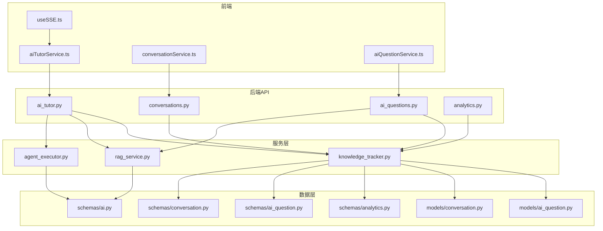
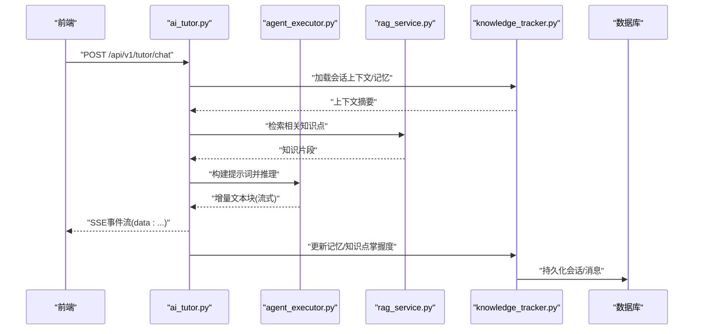
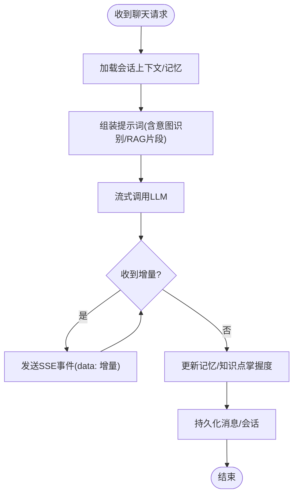
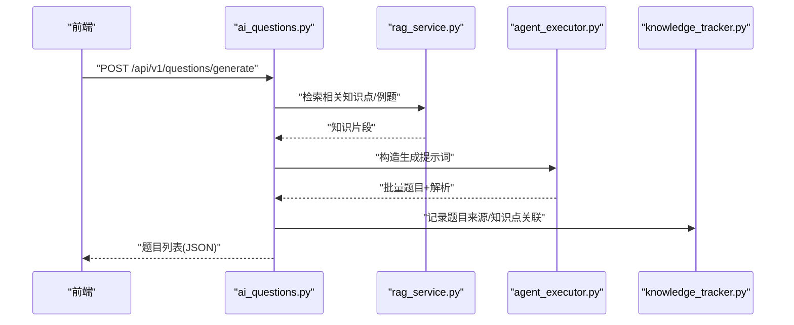
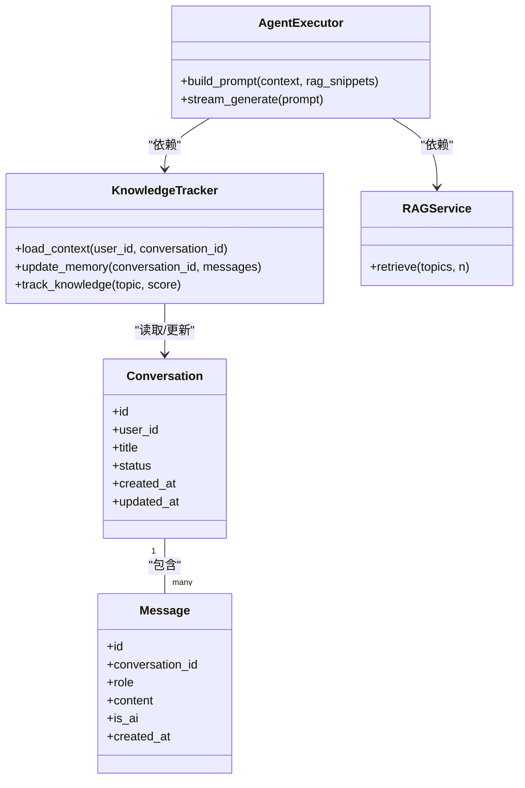
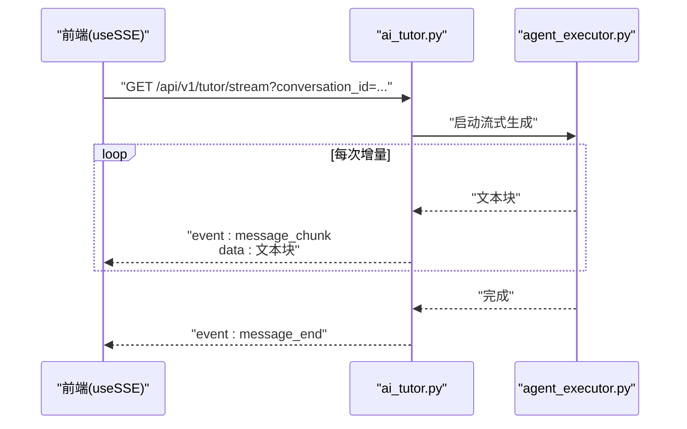
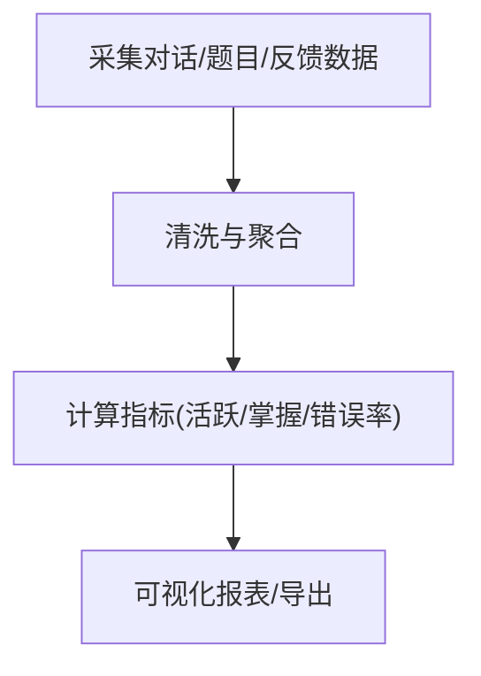
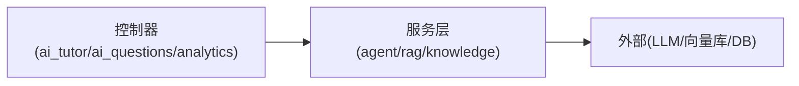

# AI问答API

<cite>
**本文引用的文件**   
- [backend/app/api/v1/ai_tutor.py](file://backend/app/api/v1/ai_tutor.py)
- [backend/app/api/v1/conversations.py](file://backend/app/api/v1/conversations.py)
- [backend/app/api/v1/ai_questions.py](file://backend/app/api/v1/ai_questions.py)
- [backend/app/api/v1/analytics.py](file://backend/app/api/v1/analytics.py)
- [backend/app/schemas/ai.py](file://backend/app/schemas/ai.py)
- [backend/app/schemas/conversation.py](file://backend/app/schemas/conversation.py)
- [backend/app/schemas/ai_question.py](file://backend/app/schemas/ai_question.py)
- [backend/app/schemas/analytics.py](file://backend/app/schemas/analytics.py)
- [backend/app/services/agent/agent_executor.py](file://backend/app/services/agent/agent_executor.py)
- [backend/app/services/rag_service.py](file://backend/app/services/rag_service.py)
- [backend/app/services/knowledge_tracker.py](file://backend/app/services/knowledge_tracker.py)
- [backend/app/models/conversation.py](file://backend/app/models/conversation.py)
- [backend/app/models/ai_question.py](file://backend/app/models/ai_question.py)
- [backend/app/core/deps.py](file://backend/app/core/deps.py)
- [frontend/src/hooks/useSSE.ts](file://frontend/src/hooks/useSSE.ts)
- [frontend/src/services/aiTutorService.ts](file://frontend/src/services/aiTutorService.ts)
- [frontend/src/services/conversationService.ts](file://frontend/src/services/conversationService.ts)
- [frontend/src/services/aiQuestionService.ts](file://frontend/src/services/aiQuestionService.ts)
</cite>

## 目录
1. [简介](#简介)
2. [项目结构](#项目结构)
3. [核心组件](#核心组件)
4. [架构总览](#架构总览)
5. [详细组件分析](#详细组件分析)
6. [依赖分析](#依赖分析)
7. [性能考虑](#性能考虑)
8. [故障排查指南](#故障排查指南)
9. [结论](#结论)
10. [附录](#附录)

## 简介
本文件为AI问答与辅导系统的后端API文档，覆盖以下能力：
- 实时对话接口：消息发送、接收、历史记录查询
- AI助手上下文管理与记忆机制
- 智能提问接口：基于知识点自动生成问题
- 对话状态管理、多轮对话支持、意图识别
- 流式响应处理（SSE）
- AI回答质量评估与反馈收集
- 对话数据统计分析与学习效果评估
- WebSocket连接示例与错误处理方案

## 项目结构
系统采用前后端分离架构。后端基于FastAPI提供REST与SSE接口，前端通过HTTP/SSE进行交互。关键模块如下：
- API层：按功能域划分路由，如ai_tutor、conversations、ai_questions、analytics
- Schema层：请求/响应数据模型定义
- 服务层：Agent执行器、RAG检索增强生成、知识追踪等
- 模型层：数据库ORM模型
- 前端：SSE Hook与服务封装，便于客户端实现实时通信

图表来源
- [backend/app/api/v1/ai_tutor.py](file://backend/app/api/v1/ai_tutor.py)
- [backend/app/api/v1/conversations.py](file://backend/app/api/v1/conversations.py)
- [backend/app/api/v1/ai_questions.py](file://backend/app/api/v1/ai_questions.py)
- [backend/app/api/v1/analytics.py](file://backend/app/api/v1/analytics.py)
- [backend/app/services/agent/agent_executor.py](file://backend/app/services/agent/agent_executor.py)
- [backend/app/services/rag_service.py](file://backend/app/services/rag_service.py)
- [backend/app/services/knowledge_tracker.py](file://backend/app/services/knowledge_tracker.py)
- [backend/app/models/conversation.py](file://backend/app/models/conversation.py)
- [backend/app/models/ai_question.py](file://backend/app/models/ai_question.py)
- [backend/app/schemas/ai.py](file://backend/app/schemas/ai.py)
- [backend/app/schemas/conversation.py](file://backend/app/schemas/conversation.py)
- [backend/app/schemas/ai_question.py](file://backend/app/schemas/ai_question.py)
- [backend/app/schemas/analytics.py](file://backend/app/schemas/analytics.py)
- [frontend/src/hooks/useSSE.ts](file://frontend/src/hooks/useSSE.ts)
- [frontend/src/services/aiTutorService.ts](file://frontend/src/services/aiTutorService.ts)
- [frontend/src/services/conversationService.ts](file://frontend/src/services/conversationService.ts)
- [frontend/src/services/aiQuestionService.ts](file://frontend/src/services/aiQuestionService.ts)

章节来源
- [backend/app/api/v1/ai_tutor.py](file://backend/app/api/v1/ai_tutor.py)
- [backend/app/api/v1/conversations.py](file://backend/app/api/v1/conversations.py)
- [backend/app/api/v1/ai_questions.py](file://backend/app/api/v1/ai_questions.py)
- [backend/app/api/v1/analytics.py](file://backend/app/api/v1/analytics.py)
- [backend/app/services/agent/agent_executor.py](file://backend/app/services/agent/agent_executor.py)
- [backend/app/services/rag_service.py](file://backend/app/services/rag_service.py)
- [backend/app/services/knowledge_tracker.py](file://backend/app/services/knowledge_tracker.py)
- [backend/app/models/conversation.py](file://backend/app/models/conversation.py)
- [backend/app/models/ai_question.py](file://backend/app/models/ai_question.py)
- [backend/app/schemas/ai.py](file://backend/app/schemas/ai.py)
- [backend/app/schemas/conversation.py](file://backend/app/schemas/conversation.py)
- [backend/app/schemas/ai_question.py](file://backend/app/schemas/ai_question.py)
- [backend/app/schemas/analytics.py](file://backend/app/schemas/analytics.py)
- [frontend/src/hooks/useSSE.ts](file://frontend/src/hooks/useSSE.ts)
- [frontend/src/services/aiTutorService.ts](file://frontend/src/services/aiTutorService.ts)
- [frontend/src/services/conversationService.ts](file://frontend/src/services/conversationService.ts)
- [frontend/src/services/aiQuestionService.ts](file://frontend/src/services/aiQuestionService.ts)

## 核心组件
- 实时对话控制器：负责创建会话、发送消息、获取历史、SSE流式输出
- 智能提问控制器：基于知识点生成题目，返回题目列表与元信息
- 分析控制器：聚合对话与练习数据，输出学习成效指标
- Agent执行器：编排提示词、工具调用、LLM推理与结果后处理
- RAG服务：检索相关知识片段，注入到提示词上下文
- 知识追踪服务：维护会话上下文、记忆摘要、知识点掌握度
- 数据模型与Schema：会话、消息、题目、分析指标的持久化与校验

章节来源
- [backend/app/api/v1/ai_tutor.py](file://backend/app/api/v1/ai_tutor.py)
- [backend/app/api/v1/ai_questions.py](file://backend/app/api/v1/ai_questions.py)
- [backend/app/api/v1/analytics.py](file://backend/app/api/v1/analytics.py)
- [backend/app/services/agent/agent_executor.py](file://backend/app/services/agent/agent_executor.py)
- [backend/app/services/rag_service.py](file://backend/app/services/rag_service.py)
- [backend/app/services/knowledge_tracker.py](file://backend/app/services/knowledge_tracker.py)
- [backend/app/models/conversation.py](file://backend/app/models/conversation.py)
- [backend/app/models/ai_question.py](file://backend/app/models/ai_question.py)
- [backend/app/schemas/ai.py](file://backend/app/schemas/ai.py)
- [backend/app/schemas/conversation.py](file://backend/app/schemas/conversation.py)
- [backend/app/schemas/ai_question.py](file://backend/app/schemas/ai_question.py)
- [backend/app/schemas/analytics.py](file://backend/app/schemas/analytics.py)

## 架构总览
整体流程：
- 前端通过HTTP发起对话或题目生成请求
- 控制器解析参数并调用服务层
- 服务层组合RAG检索、Agent编排与知识追踪
- 结果以JSON或SSE事件流返回前端
- 分析接口汇总对话与练习数据，输出学习成效

图表来源
- [backend/app/api/v1/ai_tutor.py](file://backend/app/api/v1/ai_tutor.py)
- [backend/app/services/agent/agent_executor.py](file://backend/app/services/agent/agent_executor.py)
- [backend/app/services/rag_service.py](file://backend/app/services/rag_service.py)
- [backend/app/services/knowledge_tracker.py](file://backend/app/services/knowledge_tracker.py)
- [backend/app/models/conversation.py](file://backend/app/models/conversation.py)

## 详细组件分析

### 实时对话接口（聊天与SSE）
- 功能要点
  - 创建/恢复会话：根据用户ID与可选会话ID定位或新建会话
  - 发送消息：携带用户输入、可选上下文参数（如知识点标签、难度）
  - 流式响应：服务端以SSE事件推送增量文本，前端逐步渲染
  - 历史记录：分页查询某会话的消息列表，支持时间范围过滤
  - 意图识别：在提示词中注入意图分类规则，结合RAG结果提升回复相关性
  - 多轮对话：通过会话ID维持上下文，服务层维护记忆摘要与短期窗口
- 典型请求/响应
  - 发送消息：请求体包含用户消息、会话标识、可选参数；响应为SSE事件流
  - 查询历史：返回消息数组，含角色、内容、时间戳、是否AI生成等字段
- SSE事件格式
  - data: 文本增量
  - event: 类型（如message_start、message_chunk、message_end）
  - error: 异常信息（当发生错误时）
- 错误处理
  - 网络中断：前端重连策略（指数退避）
  - 超时：服务端设置合理超时，前端显示重试提示
  - 业务异常：返回结构化错误码与消息

图表来源
- [backend/app/api/v1/ai_tutor.py](file://backend/app/api/v1/ai_tutor.py)
- [backend/app/services/agent/agent_executor.py](file://backend/app/services/agent/agent_executor.py)
- [backend/app/services/rag_service.py](file://backend/app/services/rag_service.py)
- [backend/app/services/knowledge_tracker.py](file://backend/app/services/knowledge_tracker.py)

章节来源
- [backend/app/api/v1/ai_tutor.py](file://backend/app/api/v1/ai_tutor.py)
- [backend/app/schemas/conversation.py](file://backend/app/schemas/conversation.py)
- [backend/app/models/conversation.py](file://backend/app/models/conversation.py)
- [frontend/src/hooks/useSSE.ts](file://frontend/src/hooks/useSSE.ts)
- [frontend/src/services/aiTutorService.ts](file://frontend/src/services/aiTutorService.ts)
- [frontend/src/services/conversationService.ts](file://frontend/src/services/conversationService.ts)

### 智能提问接口（基于知识点生成）
- 功能要点
  - 输入：知识点集合、难度、题型、数量等
  - 过程：RAG检索相似题/知识点片段，Agent生成新题与解析
  - 输出：题目列表、答案、解析、知识点映射、难度分布
- 使用场景
  - 自适应练习：根据学生薄弱点动态出题
  - 课堂测验：快速生成随堂小测
- 错误处理
  - 知识点为空或无效：返回明确错误码
  - 生成失败：降级返回少量高质量题目或提示重试

图表来源
- [backend/app/api/v1/ai_questions.py](file://backend/app/api/v1/ai_questions.py)
- [backend/app/services/rag_service.py](file://backend/app/services/rag_service.py)
- [backend/app/services/agent/agent_executor.py](file://backend/app/services/agent/agent_executor.py)
- [backend/app/services/knowledge_tracker.py](file://backend/app/services/knowledge_tracker.py)
- [backend/app/models/ai_question.py](file://backend/app/models/ai_question.py)
- [backend/app/schemas/ai_question.py](file://backend/app/schemas/ai_question.py)

章节来源
- [backend/app/api/v1/ai_questions.py](file://backend/app/api/v1/ai_questions.py)
- [backend/app/schemas/ai_question.py](file://backend/app/schemas/ai_question.py)
- [backend/app/models/ai_question.py](file://backend/app/models/ai_question.py)
- [frontend/src/services/aiQuestionService.ts](file://frontend/src/services/aiQuestionService.ts)

### 对话状态管理与记忆机制
- 会话状态
  - 新建、进行中、已结束、归档
  - 状态变更由控制器在服务层触发
- 记忆机制
  - 短期记忆：最近N轮对话摘要
  - 长期记忆：知识点掌握度、错题集、偏好风格
  - 更新时机：每轮对话结束后异步更新
- 意图识别
  - 在提示词中注入意图分类规则，结合RAG结果提高准确性
  - 意图用于路由不同工具或调整回复风格

图表来源
- [backend/app/models/conversation.py](file://backend/app/models/conversation.py)
- [backend/app/services/knowledge_tracker.py](file://backend/app/services/knowledge_tracker.py)
- [backend/app/services/agent/agent_executor.py](file://backend/app/services/agent/agent_executor.py)
- [backend/app/services/rag_service.py](file://backend/app/services/rag_service.py)

章节来源
- [backend/app/models/conversation.py](file://backend/app/models/conversation.py)
- [backend/app/services/knowledge_tracker.py](file://backend/app/services/knowledge_tracker.py)
- [backend/app/services/agent/agent_executor.py](file://backend/app/services/agent/agent_executor.py)
- [backend/app/services/rag_service.py](file://backend/app/services/rag_service.py)

### 流式响应处理（SSE）
- 前端实现
  - 使用SSE Hook建立连接，监听事件并渲染增量文本
  - 断线重连与错误提示
- 后端实现
  - 控制器返回SSE流，逐块推送增量
  - 事件类型区分开始、增量、结束、错误
- 最佳实践
  - 控制增量大小，避免UI抖动
  - 合并相邻增量，减少渲染开销
  - 对长文本进行分段展示

图表来源
- [frontend/src/hooks/useSSE.ts](file://frontend/src/hooks/useSSE.ts)
- [backend/app/api/v1/ai_tutor.py](file://backend/app/api/v1/ai_tutor.py)
- [backend/app/services/agent/agent_executor.py](file://backend/app/services/agent/agent_executor.py)

章节来源
- [frontend/src/hooks/useSSE.ts](file://frontend/src/hooks/useSSE.ts)
- [frontend/src/services/aiTutorService.ts](file://frontend/src/services/aiTutorService.ts)
- [backend/app/api/v1/ai_tutor.py](file://backend/app/api/v1/ai_tutor.py)

### 质量评估与反馈收集
- 评估维度
  - 正确性、清晰度、针对性、可理解性、教学价值
- 反馈方式
  - 用户对单条AI回复点赞/踩、评分、备注
  - 后台自动指标：响应时长、重复率、引用知识点命中率
- 存储与分析
  - 将反馈与消息关联，纳入分析报表
  - 用于优化提示词与RAG检索策略

章节来源
- [backend/app/schemas/ai.py](file://backend/app/schemas/ai.py)
- [backend/app/services/knowledge_tracker.py](file://backend/app/services/knowledge_tracker.py)

### 数据分析与学习效果评估
- 指标
  - 对话活跃度、平均会话时长、题目完成率、知识点掌握趋势
  - 错误率、薄弱环节热力图、进步曲线
- 接口
  - 聚合统计：按日/周/月维度汇总
  - 明细查询：会话、题目、反馈明细导出
- 用途
  - 教师看板、个性化推荐、课程改进

图表来源
- [backend/app/api/v1/analytics.py](file://backend/app/api/v1/analytics.py)
- [backend/app/schemas/analytics.py](file://backend/app/schemas/analytics.py)
- [backend/app/services/knowledge_tracker.py](file://backend/app/services/knowledge_tracker.py)

章节来源
- [backend/app/api/v1/analytics.py](file://backend/app/api/v1/analytics.py)
- [backend/app/schemas/analytics.py](file://backend/app/schemas/analytics.py)
- [backend/app/services/knowledge_tracker.py](file://backend/app/services/knowledge_tracker.py)

## 依赖分析
- 组件耦合
  - 控制器依赖服务层，服务层依赖RAG与Agent执行器
  - 知识追踪贯穿对话与题目生成，形成横向依赖
- 外部依赖
  - LLM推理服务（通过Agent执行器抽象）
  - 向量检索（RAG）
  - 数据库（会话、消息、题目、分析指标）
- 潜在循环依赖
  - 控制器与服务层单向依赖，无循环
  - 服务层内部通过接口解耦，降低耦合风险

图表来源
- [backend/app/api/v1/ai_tutor.py](file://backend/app/api/v1/ai_tutor.py)
- [backend/app/api/v1/ai_questions.py](file://backend/app/api/v1/ai_questions.py)
- [backend/app/api/v1/analytics.py](file://backend/app/api/v1/analytics.py)
- [backend/app/services/agent/agent_executor.py](file://backend/app/services/agent/agent_executor.py)
- [backend/app/services/rag_service.py](file://backend/app/services/rag_service.py)
- [backend/app/services/knowledge_tracker.py](file://backend/app/services/knowledge_tracker.py)

章节来源
- [backend/app/core/deps.py](file://backend/app/core/deps.py)
- [backend/app/api/v1/ai_tutor.py](file://backend/app/api/v1/ai_tutor.py)
- [backend/app/api/v1/ai_questions.py](file://backend/app/api/v1/ai_questions.py)
- [backend/app/api/v1/analytics.py](file://backend/app/api/v1/analytics.py)

## 性能考虑
- 流式传输：优先使用SSE，降低首字节延迟
- 增量渲染：前端合并增量，限制DOM更新频率
- 缓存策略：热点知识点片段缓存，减少RAG开销
- 批处理：题目生成批量返回，避免多次往返
- 资源限流：对高频接口实施速率限制，保护后端

## 故障排查指南
- 常见问题
  - SSE连接断开：检查网络与代理，启用重连
  - 流式卡顿：增大增量合并阈值，减少渲染次数
  - 题目生成失败：检查知识点有效性，回退到默认题库
  - 分析数据缺失：确认数据采集任务运行正常
- 诊断步骤
  - 查看后端日志中的错误码与堆栈
  - 验证Schema校验是否通过
  - 检查数据库写入是否成功
  - 复现最小用例，隔离问题范围

章节来源
- [backend/app/schemas/ai.py](file://backend/app/schemas/ai.py)
- [backend/app/schemas/conversation.py](file://backend/app/schemas/conversation.py)
- [backend/app/schemas/ai_question.py](file://backend/app/schemas/ai_question.py)
- [backend/app/schemas/analytics.py](file://backend/app/schemas/analytics.py)

## 结论
本API体系围绕“对话—生成—评估—分析”的闭环设计，结合RAG与Agent编排，提供高质量的AI问答与辅导体验。通过SSE流式响应与完善的错误处理，确保实时性与稳定性；通过知识追踪与分析报表，支撑个性化学习与教学决策。

## 附录

### WebSocket连接示例与错误处理方案
- 说明
  - 当前系统主要采用HTTP+SSE实现实时通信
  - 若需WebSocket，可在现有控制器基础上扩展，复用会话与记忆逻辑
- 建议
  - 使用统一鉴权中间件
  - 心跳保活与断线重连
  - 错误事件标准化，便于前端统一处理

[本节为概念性说明，不直接分析具体文件]