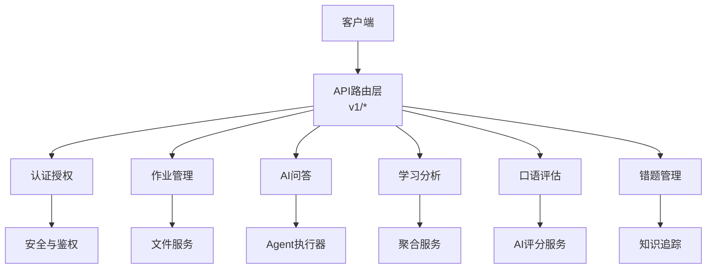
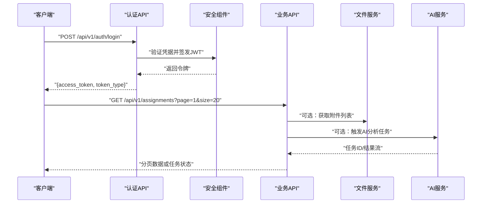
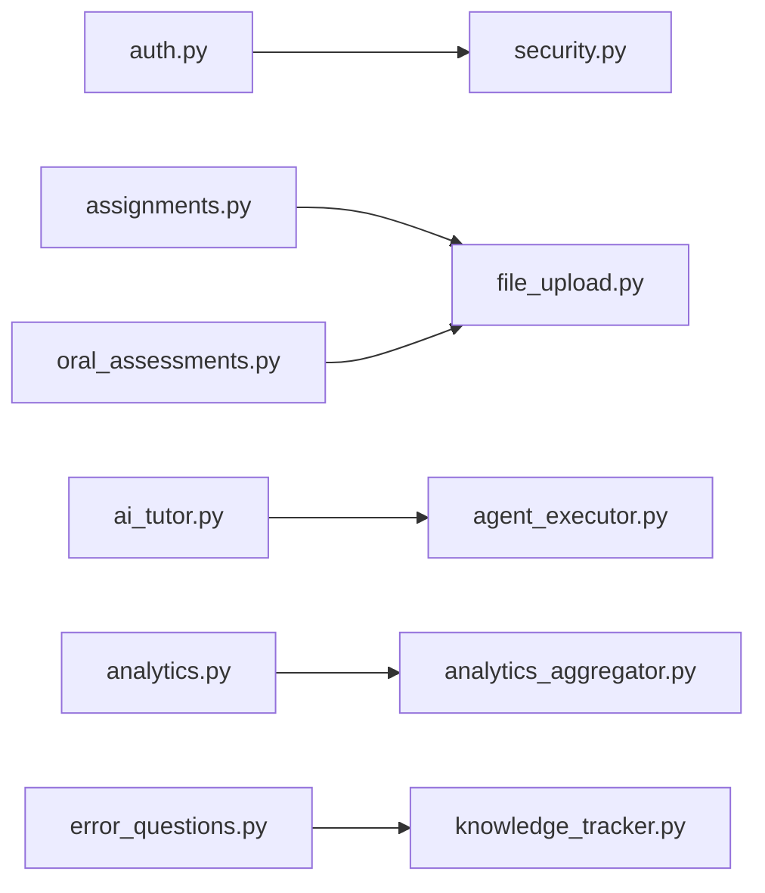

# API接口文档

<cite>
**本文引用的文件**   
- [backend/app/main.py](file://backend/app/main.py)
- [backend/app/api/v1/auth.py](file://backend/app/api/v1/auth.py)
- [backend/app/api/v1/assignments.py](file://backend/app/api/v1/assignments.py)
- [backend/app/api/v1/ai_tutor.py](file://backend/app/api/v1/ai_tutor.py)
- [backend/app/api/v1/analytics.py](file://backend/app/api/v1/analytics.py)
- [backend/app/api/v1/oral_assessments.py](file://backend/app/api/v1/oral_assessments.py)
- [backend/app/api/v1/error_questions.py](file://backend/app/api/v1/error_questions.py)
- [backend/app/core/security.py](file://backend/app/core/security.py)
- [backend/app/core/config.py](file://backend/app/core/config.py)
- [backend/app/services/file_upload.py](file://backend/app/services/file_upload.py)
</cite>

## 目录
1. [简介](#简介)
2. [项目结构](#项目结构)
3. [核心组件](#核心组件)
4. [架构总览](#架构总览)
5. [详细组件分析](#详细组件分析)
6. [依赖关系分析](#依赖关系分析)
7. [性能考虑](#性能考虑)
8. [故障排查指南](#故障排查指南)
9. [结论](#结论)
10. [附录](#附录)

## 简介
本文件为AI助教系统的API接口参考文档，覆盖认证授权、作业管理、AI问答、学习分析、口语评估、错题管理等模块。文档包含RESTful端点说明、请求与响应格式、错误码定义、JWT认证机制、分页与文件上传下载规范、版本管理与兼容性策略、速率限制建议以及客户端集成示例与SDK使用说明。

## 项目结构
后端采用模块化分层设计：
- API路由层：按功能模块划分在 app/api/v1 下，每个模块对应一个控制器文件
- 核心能力：安全与配置位于 app/core
- 业务服务：app/services 提供AI评分、文件处理、RAG检索等能力
- 数据模型与Schema：app/models 与 app/schemas 分别定义ORM模型与Pydantic校验结构
- 任务队列：app/tasks 使用Celery执行异步任务（如分析与向量索引）

图表来源
- [backend/app/main.py](file://backend/app/main.py)
- [backend/app/api/v1/auth.py](file://backend/app/api/v1/auth.py)
- [backend/app/api/v1/assignments.py](file://backend/app/api/v1/assignments.py)
- [backend/app/api/v1/ai_tutor.py](file://backend/app/api/v1/ai_tutor.py)
- [backend/app/api/v1/analytics.py](file://backend/app/api/v1/analytics.py)
- [backend/app/api/v1/oral_assessments.py](file://backend/app/api/v1/oral_assessments.py)
- [backend/app/api/v1/error_questions.py](file://backend/app/api/v1/error_questions.py)
- [backend/app/core/security.py](file://backend/app/core/security.py)
- [backend/app/services/file_upload.py](file://backend/app/services/file_upload.py)

章节来源
- [backend/app/main.py](file://backend/app/main.py)
- [backend/app/core/config.py](file://backend/app/core/config.py)

## 核心组件
- 认证与安全
  - JWT签发与验证、密码哈希、角色权限控制
  - 统一鉴权中间件用于保护受保护路由
- 文件服务
  - 支持多类型文件上传、大小与类型校验、存储路径管理
- AI服务
  - 对话式问答、题目生成、作文批改、口语评测、相似题生成
- 分析服务
  - 作业统计、知识点热力图、学生画像聚合
- 任务队列
  - 异步执行耗时任务（分析、向量化、批量处理）

章节来源
- [backend/app/core/security.py](file://backend/app/core/security.py)
- [backend/app/services/file_upload.py](file://backend/app/services/file_upload.py)

## 架构总览
系统对外暴露REST API，内部通过服务层调用AI与数据库资源。关键交互如下：

图表来源
- [backend/app/api/v1/auth.py](file://backend/app/api/v1/auth.py)
- [backend/app/core/security.py](file://backend/app/core/security.py)
- [backend/app/api/v1/assignments.py](file://backend/app/api/v1/assignments.py)
- [backend/app/services/file_upload.py](file://backend/app/services/file_upload.py)

## 详细组件分析

### 通用约定
- 基础URL前缀：/api/v1
- 认证方式：Bearer Token（JWT），请求头携带 Authorization: Bearer <token>
- 内容类型：JSON默认；文件上传使用 multipart/form-data
- 分页参数：page（页码，从1开始）、size（每页条数，最大由服务端限制）
- 时间字段：ISO 8601字符串，时区UTC
- 统一响应体：{code, message, data}，其中code为业务状态码，data为具体数据对象
- 错误响应：HTTP状态码表示传输层错误，code表示业务错误码

章节来源
- [backend/app/core/config.py](file://backend/app/core/config.py)

### 认证授权API
- 登录
  - 方法：POST
  - 路径：/api/v1/auth/login
  - 请求体：用户名、密码
  - 成功响应：access_token、token_type
  - 失败：用户名或密码错误、账户锁定
- 刷新令牌
  - 方法：POST
  - 路径：/api/v1/auth/refresh
  - 请求体：refresh_token
  - 成功响应：新的access_token
- 登出
  - 方法：POST
  - 路径：/api/v1/auth/logout
  - 请求头：Authorization
  - 行为：使当前token失效（黑名单或短期过期）
- 获取当前用户信息
  - 方法：GET
  - 路径：/api/v1/auth/me
  - 请求头：Authorization
  - 响应：用户基本信息与角色

权限要求
- 登录无需认证
- 刷新令牌需要有效refresh_token
- 登出与获取个人信息需要有效access_token

错误码
- 401：未认证或令牌无效
- 403：权限不足
- 400：参数校验失败
- 404：资源不存在
- 429：请求过于频繁
- 500：服务器内部错误

章节来源
- [backend/app/api/v1/auth.py](file://backend/app/api/v1/auth.py)
- [backend/app/core/security.py](file://backend/app/core/security.py)

### 作业管理API
- 创建作业
  - 方法：POST
  - 路径：/api/v1/assignments
  - 请求体：标题、描述、截止时间、难度、标签、是否公开
  - 响应：作业ID与元信息
- 更新作业
  - 方法：PUT
  - 路径：/api/v1/assignments/{id}
  - 请求体：可更新字段
  - 响应：更新后的作业信息
- 删除作业
  - 方法：DELETE
  - 路径：/api/v1/assignments/{id}
  - 响应：确认删除
- 获取作业详情
  - 方法：GET
  - 路径：/api/v1/assignments/{id}
  - 响应：作业详情与关联附件
- 列出作业（分页）
  - 方法：GET
  - 路径：/api/v1/assignments
  - 查询参数：page、size、keyword、status、subject
  - 响应：分页数据与总数
- 提交作业
  - 方法：POST
  - 路径：/api/v1/assignments/{id}/submissions
  - 请求体：文本答案或文件引用
  - 响应：提交记录ID
- 上传作业附件
  - 方法：POST
  - 路径：/api/v1/assignments/{id}/attachments
  - 内容类型：multipart/form-data
  - 表单字段：file（二进制文件）
  - 响应：附件ID与访问URL
- 下载作业附件
  - 方法：GET
  - 路径：/api/v1/assignments/{id}/attachments/{file_id}
  - 响应：文件流或预签名URL
- 触发AI解析与批阅
  - 方法：POST
  - 路径：/api/v1/assignments/{id}/analyze
  - 响应：任务ID，后续通过任务状态接口查询进度

权限要求
- 教师：创建、更新、删除、批阅
- 学生：提交、查看本人提交
- 访客：仅查看公开作业

错误码
- 400：参数校验失败（如截止时间早于当前时间）
- 404：作业不存在
- 403：无操作权限
- 413：文件过大
- 415：不支持的文件类型
- 429：上传频率限制

章节来源
- [backend/app/api/v1/assignments.py](file://backend/app/api/v1/assignments.py)
- [backend/app/services/file_upload.py](file://backend/app/services/file_upload.py)

### AI问答API
- 发起对话
  - 方法：POST
  - 路径：/api/v1/ai/chat
  - 请求体：消息内容、上下文ID（可选）、意图标签（可选）
  - 响应：回复内容、思考过程摘要、相关知识点
- 历史会话
  - 方法：GET
  - 路径：/api/v1/ai/conversations
  - 查询参数：page、size、keyword
  - 响应：分页的会话列表
- 获取会话详情
  - 方法：GET
  - 路径：/api/v1/ai/conversations/{conversation_id}
  - 响应：会话消息序列
- 生成相似题
  - 方法：POST
  - 路径：/api/v1/ai/questions/similar
  - 请求体：原题ID或题干文本
  - 响应：相似题列表
- 生成个性化题目
  - 方法：POST
  - 路径：/api/v1/ai/questions/generate
  - 请求体：知识点、难度、数量、题型
  - 响应：题目集合

权限要求
- 学生：提问、查看个人会话
- 教师：查看班级会话、批量生成题目

错误码
- 400：输入为空或长度超限
- 429：AI调用限频
- 503：AI服务不可用

章节来源
- [backend/app/api/v1/ai_tutor.py](file://backend/app/api/v1/ai_tutor.py)

### 学习分析API
- 作业统计
  - 方法：GET
  - 路径：/api/v1/analytics/homework-stats
  - 查询参数：assignment_id、class_id、date_range
  - 响应：平均分、正确率分布、提交趋势
- 知识点热力图
  - 方法：GET
  - 路径：/api/v1/analytics/knowledge-heatmap
  - 查询参数：student_id、subject、period
  - 响应：知识点掌握度矩阵
- 学生画像
  - 方法：GET
  - 路径：/api/v1/analytics/student-profile
  - 查询参数：student_id
  - 响应：学习行为指标与建议
- 导出报告
  - 方法：POST
  - 路径：/api/v1/analytics/export
  - 请求体：导出范围与格式（PDF/Excel）
  - 响应：任务ID，完成后提供下载链接

权限要求
- 教师：班级维度分析
- 学生：个人维度分析
- 管理员：全局统计

错误码
- 400：时间范围非法
- 404：数据不存在
- 429：导出任务限频

章节来源
- [backend/app/api/v1/analytics.py](file://backend/app/api/v1/analytics.py)

### 口语评估API
- 提交录音评估
  - 方法：POST
  - 路径：/api/v1/oral/assessments
  - 内容类型：multipart/form-data
  - 表单字段：audio_file、prompt_text（可选）
  - 响应：评估ID、分数、反馈要点
- 获取评估结果
  - 方法：GET
  - 路径：/api/v1/oral/assessments/{assessment_id}
  - 响应：详细评分项与改进建议
- 批量评估
  - 方法：POST
  - 路径：/api/v1/oral/assessments/batch
  - 请求体：多个音频文件ID或上传文件数组
  - 响应：任务ID与进度查询接口

权限要求
- 学生：提交与查看本人评估
- 教师：查看班级评估汇总

错误码
- 413：音频过大
- 415：不支持的音频格式
- 429：评估频率限制

章节来源
- [backend/app/api/v1/oral_assessments.py](file://backend/app/api/v1/oral_assessments.py)
- [backend/app/services/file_upload.py](file://backend/app/services/file_upload.py)

### 错题管理API
- 添加错题
  - 方法：POST
  - 路径：/api/v1/error-questions
  - 请求体：题目ID、错误原因、备注
  - 响应：错题记录ID
- 获取错题列表（分页）
  - 方法：GET
  - 路径：/api/v1/error-questions
  - 查询参数：page、size、subject、difficulty、date_from、date_to
  - 响应：错题分页数据
- 获取错题详情
  - 方法：GET
  - 路径：/api/v1/error-questions/{id}
  - 响应：题目、错误记录、复习建议
- 标记已掌握
  - 方法：PATCH
  - 路径：/api/v1/error-questions/{id}/mastered
  - 响应：更新后的掌握状态
- 生成巩固练习
  - 方法：POST
  - 路径：/api/v1/error-questions/{id}/practice
  - 请求体：数量、难度
  - 响应：练习题集合

权限要求
- 学生：管理本人错题
- 教师：查看班级错题统计

错误码
- 400：重复添加或参数非法
- 404：错题不存在
- 429：练习生成限频

章节来源
- [backend/app/api/v1/error_questions.py](file://backend/app/api/v1/error_questions.py)

## 依赖关系分析
- 路由到服务
  - 各API模块依赖安全组件进行鉴权
  - 作业与口语评估依赖文件服务进行上传下载
  - AI问答与分析依赖AI服务与任务队列
- 外部依赖
  - 数据库：持久化用户、作业、错题、会话等数据
  - 向量库：用于相似题与RAG检索
  - 消息队列：Celery执行异步任务

图表来源
- [backend/app/api/v1/auth.py](file://backend/app/api/v1/auth.py)
- [backend/app/api/v1/assignments.py](file://backend/app/api/v1/assignments.py)
- [backend/app/api/v1/oral_assessments.py](file://backend/app/api/v1/oral_assessments.py)
- [backend/app/api/v1/ai_tutor.py](file://backend/app/api/v1/ai_tutor.py)
- [backend/app/api/v1/analytics.py](file://backend/app/api/v1/analytics.py)
- [backend/app/api/v1/error_questions.py](file://backend/app/api/v1/error_questions.py)
- [backend/app/core/security.py](file://backend/app/core/security.py)
- [backend/app/services/file_upload.py](file://backend/app/services/file_upload.py)

## 性能考虑
- 分页与过滤：对列表接口强制分页，避免全量拉取
- 缓存热点数据：作业详情、题目内容、知识点映射
- 异步任务：大文件处理、AI批阅、分析报告生成走队列
- 连接池与超时：数据库与AI服务设置合理超时与重试
- 压缩与CDN：静态资源与导出文件通过CDN分发

[本节为通用指导，不直接分析具体文件]

## 故障排查指南
- 认证失败
  - 检查Authorization头是否正确携带Bearer Token
  - 确认Token未过期且未被吊销
- 文件上传失败
  - 检查文件大小与类型是否符合限制
  - 查看服务端日志中的存储路径与权限问题
- AI服务异常
  - 观察限频与可用性状态
  - 降级策略：返回缓存结果或提示稍后重试
- 任务队列积压
  - 监控Celery工作节点健康与消费速率
  - 调整并发与重试策略

章节来源
- [backend/app/core/security.py](file://backend/app/core/security.py)
- [backend/app/services/file_upload.py](file://backend/app/services/file_upload.py)

## 结论
本API文档覆盖了AI助教系统的核心接口与集成要点。通过统一的认证、清晰的分页与错误码、完善的文件与任务处理能力，系统具备良好的可扩展性与稳定性。建议在客户端实现中遵循本文约定的请求头、分页与错误处理策略，并结合SDK示例快速集成。

## 附录

### 请求头规范
- Authorization: Bearer <access_token>
- Content-Type: application/json 或 multipart/form-data（文件上传）
- Accept: application/json
- X-Request-ID: 可选，用于链路追踪

### 分页查询
- page：页码，默认1
- size：每页条数，默认20，最大由服务端限制
- 响应包含：items、total、page、size

### 文件上传下载
- 上传：multipart/form-data，字段名file
- 下载：GET返回文件流或预签名URL
- 限制：最大文件大小、允许类型白名单

### 错误码定义
- 400：参数校验失败
- 401：未认证
- 403：权限不足
- 404：资源不存在
- 413：文件过大
- 415：不支持的内容类型
- 429：请求过于频繁
- 500：服务器内部错误
- 503：服务不可用

### 版本管理与兼容性
- URL前缀包含版本号：/api/v1
- 向后兼容策略：新增字段不破坏现有客户端；废弃字段保留至少两个版本周期
- 变更通知：通过OpenAPI文档与发布说明公告

### 速率限制
- 建议限制：登录接口每分钟10次，普通接口每分钟60次，AI接口每分钟20次
- 响应头：X-RateLimit-Limit、X-RateLimit-Remaining、X-RateLimit-Reset
- 超限返回：429与重试After-Seconds

### 客户端集成示例与SDK说明
- 初始化
  - 设置BaseURL为/api/v1
  - 保存access_token并在请求头注入Authorization
- 登录流程
  - 调用登录接口获取access_token
  - 将token存入本地安全存储
- 调用受保护接口
  - 在每个请求附加Authorization头
  - 处理401自动刷新或重新登录
- SDK使用
  - 封装常用接口为类方法
  - 统一错误处理与重试逻辑
  - 提供分页与文件上传辅助函数

章节来源
- [backend/app/api/v1/auth.py](file://backend/app/api/v1/auth.py)
- [backend/app/api/v1/assignments.py](file://backend/app/api/v1/assignments.py)
- [backend/app/api/v1/ai_tutor.py](file://backend/app/api/v1/ai_tutor.py)
- [backend/app/api/v1/analytics.py](file://backend/app/api/v1/analytics.py)
- [backend/app/api/v1/oral_assessments.py](file://backend/app/api/v1/oral_assessments.py)
- [backend/app/api/v1/error_questions.py](file://backend/app/api/v1/error_questions.py)
- [backend/app/core/security.py](file://backend/app/core/security.py)
- [backend/app/services/file_upload.py](file://backend/app/services/file_upload.py)