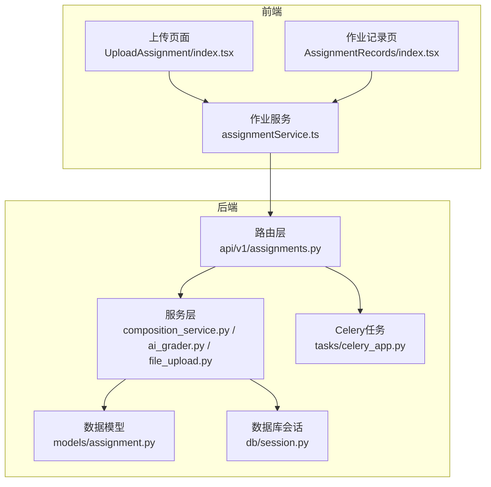
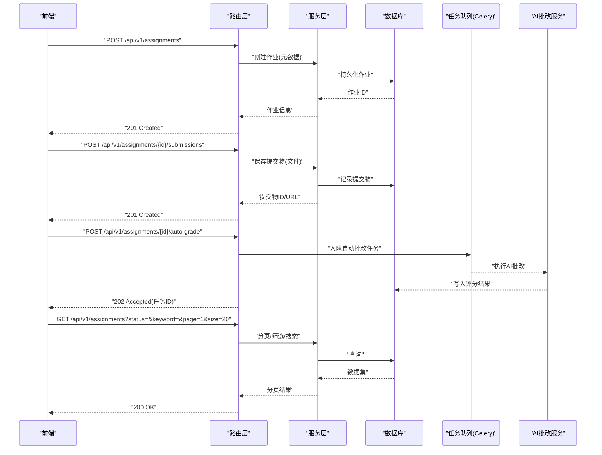
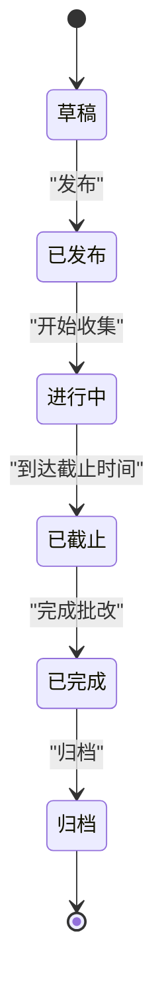
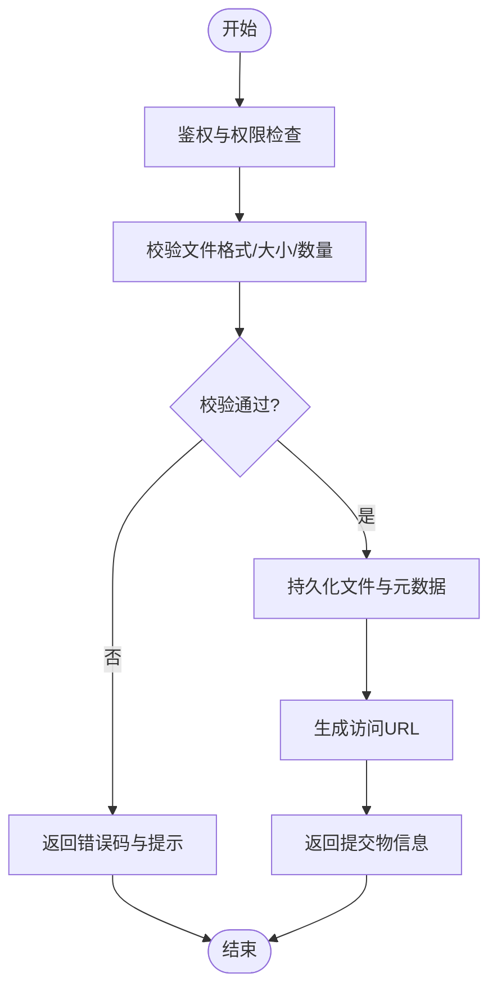
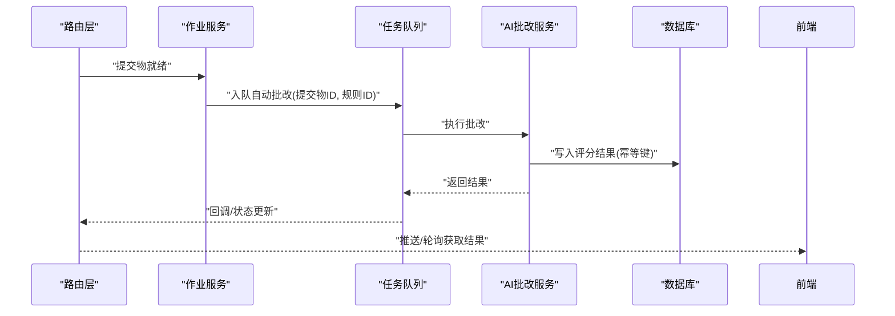
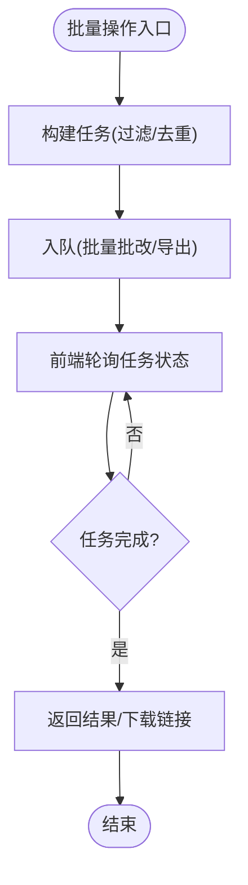
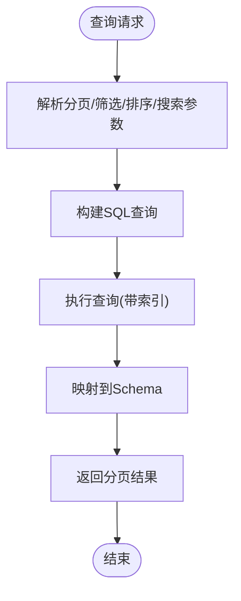
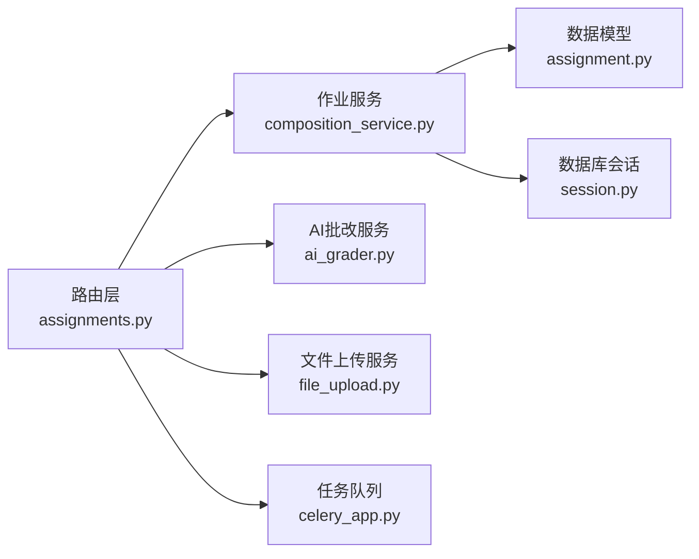

# 作业管理API

<cite>
**本文引用的文件**   
- [backend/app/api/v1/assignments.py](file://backend/app/api/v1/assignments.py)
- [backend/app/schemas/assignment.py](file://backend/app/schemas/assignment.py)
- [backend/app/models/assignment.py](file://backend/app/models/assignment.py)
- [backend/app/services/file_upload.py](file://backend/app/services/file_upload.py)
- [backend/app/services/composition_service.py](file://backend/app/services/composition_service.py)
- [backend/app/services/ai_grader.py](file://backend/app/services/ai_grader.py)
- [backend/app/tasks/celery_app.py](file://backend/app/tasks/celery_app.py)
- [backend/app/core/deps.py](file://backend/app/core/deps.py)
- [backend/app/db/session.py](file://backend/app/db/session.py)
- [frontend/src/pages/AssignmentManagement/UploadAssignment/index.tsx](file://frontend/src/pages/AssignmentManagement/UploadAssignment/index.tsx)
- [frontend/src/pages/AssignmentManagement/AssignmentRecords/index.tsx](file://frontend/src/pages/AssignmentManagement/AssignmentRecords/index.tsx)
- [frontend/src/services/assignmentService.ts](file://frontend/src/services/assignmentService.ts)
</cite>

## 目录
1. [简介](#简介)
2. [项目结构](#项目结构)
3. [核心组件](#核心组件)
4. [架构总览](#架构总览)
5. [详细组件分析](#详细组件分析)
6. [依赖关系分析](#依赖关系分析)
7. [性能考虑](#性能考虑)
8. [故障排查指南](#故障排查指南)
9. [结论](#结论)
10. [附录](#附录)

## 简介
本文件为“作业管理模块”的完整API文档，覆盖作业的创建、上传、批改、查看、统计等接口；包含文件上传下载、批量操作（批量批改、批量导出）、状态管理、评分规则配置、自动批改触发、错误处理与重试机制、分页查询/筛选排序/搜索实现细节，并提供请求响应示例与错误码说明。

## 项目结构
后端采用分层架构：路由层（FastAPI）→ 服务层（业务逻辑）→ 数据访问层（SQLAlchemy模型+会话）。前端通过TS服务调用后端REST API，并支持文件上传与进度展示。

图表来源
- [backend/app/api/v1/assignments.py](file://backend/app/api/v1/assignments.py)
- [backend/app/services/composition_service.py](file://backend/app/services/composition_service.py)
- [backend/app/services/ai_grader.py](file://backend/app/services/ai_grader.py)
- [backend/app/services/file_upload.py](file://backend/app/services/file_upload.py)
- [backend/app/models/assignment.py](file://backend/app/models/assignment.py)
- [backend/app/tasks/celery_app.py](file://backend/app/tasks/celery_app.py)
- [backend/app/db/session.py](file://backend/app/db/session.py)
- [frontend/src/pages/AssignmentManagement/UploadAssignment/index.tsx](file://frontend/src/pages/AssignmentManagement/UploadAssignment/index.tsx)
- [frontend/src/pages/AssignmentManagement/AssignmentRecords/index.tsx](file://frontend/src/pages/AssignmentManagement/AssignmentRecords/index.tsx)
- [frontend/src/services/assignmentService.ts](file://frontend/src/services/assignmentService.ts)

章节来源
- [backend/app/api/v1/assignments.py](file://backend/app/api/v1/assignments.py)
- [backend/app/services/composition_service.py](file://backend/app/services/composition_service.py)
- [backend/app/services/ai_grader.py](file://backend/app/services/ai_grader.py)
- [backend/app/services/file_upload.py](file://backend/app/services/file_upload.py)
- [backend/app/models/assignment.py](file://backend/app/models/assignment.py)
- [backend/app/tasks/celery_app.py](file://backend/app/tasks/celery_app.py)
- [backend/app/db/session.py](file://backend/app/db/session.py)
- [frontend/src/pages/AssignmentManagement/UploadAssignment/index.tsx](file://frontend/src/pages/AssignmentManagement/UploadAssignment/index.tsx)
- [frontend/src/pages/AssignmentManagement/AssignmentRecords/index.tsx](file://frontend/src/pages/AssignmentManagement/AssignmentRecords/index.tsx)
- [frontend/src/services/assignmentService.ts](file://frontend/src/services/assignmentService.ts)

## 核心组件
- 路由层：定义作业相关REST端点，负责参数校验、鉴权、事务边界与响应封装。
- 服务层：
  - 作业与作文服务：作业生命周期、提交物管理、结果聚合。
  - AI批改服务：对接AI能力，执行自动批改与评分。
  - 文件上传服务：多格式文件解析、存储、预览与下载。
- 数据模型：作业实体、提交物、评分记录等持久化结构。
- 任务队列：异步批量批改、导出等耗时任务。
- 前端服务：统一HTTP封装、文件上传、分页与筛选参数组装。

章节来源
- [backend/app/api/v1/assignments.py](file://backend/app/api/v1/assignments.py)
- [backend/app/services/composition_service.py](file://backend/app/services/composition_service.py)
- [backend/app/services/ai_grader.py](file://backend/app/services/ai_grader.py)
- [backend/app/services/file_upload.py](file://backend/app/services/file_upload.py)
- [backend/app/models/assignment.py](file://backend/app/models/assignment.py)
- [backend/app/tasks/celery_app.py](file://backend/app/tasks/celery_app.py)
- [frontend/src/services/assignmentService.ts](file://frontend/src/services/assignmentService.ts)

## 架构总览
作业管理API遵循“路由-服务-模型-任务”的分层设计，关键流程包括：
- 作业创建：路由接收请求，服务写入作业元数据与初始状态。
- 文件上传：路由接收multipart/form-data，服务校验类型/大小，落盘或对象存储，生成可下载URL。
- 自动批改：路由触发任务，Celery消费任务，AI服务执行评分，更新结果。
- 批量操作：路由发起批量任务，返回任务ID供轮询。
- 查询统计：路由组合分页、筛选、排序与搜索条件，返回结构化数据。

图表来源
- [backend/app/api/v1/assignments.py](file://backend/app/api/v1/assignments.py)
- [backend/app/services/composition_service.py](file://backend/app/services/composition_service.py)
- [backend/app/services/ai_grader.py](file://backend/app/services/ai_grader.py)
- [backend/app/tasks/celery_app.py](file://backend/app/tasks/celery_app.py)
- [backend/app/models/assignment.py](file://backend/app/models/assignment.py)
- [backend/app/db/session.py](file://backend/app/db/session.py)

## 详细组件分析

### 作业CRUD与状态管理
- 创建作业：支持设置标题、描述、截止时间、是否启用自动批改、评分规则等。
- 更新作业：修改元数据、开关自动批改、调整评分规则。
- 删除作业：软删除或硬删除（按策略）。
- 获取作业详情：包含关联提交物数量、平均分数、状态汇总。
- 作业状态机：草稿、已发布、进行中、已截止、已完成、归档。

图表来源
- [backend/app/models/assignment.py](file://backend/app/models/assignment.py)
- [backend/app/api/v1/assignments.py](file://backend/app/api/v1/assignments.py)

章节来源
- [backend/app/api/v1/assignments.py](file://backend/app/api/v1/assignments.py)
- [backend/app/models/assignment.py](file://backend/app/models/assignment.py)
- [backend/app/schemas/assignment.py](file://backend/app/schemas/assignment.py)

### 文件上传与下载
- 支持格式：PDF、图片（JPG/PNG/WebP）、Word（DOCX）、文本（TXT/MD）。
- 限制：单文件大小上限、总提交数限制、命名规范。
- 流程：
  - 上传：路由接收multipart表单，服务校验MIME/扩展名，落盘/对象存储，生成唯一文件名与URL。
  - 预览：根据类型渲染或返回缩略图。
  - 下载：基于令牌或权限校验后返回二进制流。
- 错误处理：非法类型、过大文件、重复提交、存储异常；提供重试与回滚策略。

图表来源
- [backend/app/api/v1/assignments.py](file://backend/app/api/v1/assignments.py)
- [backend/app/services/file_upload.py](file://backend/app/services/file_upload.py)
- [backend/app/models/assignment.py](file://backend/app/models/assignment.py)

章节来源
- [backend/app/api/v1/assignments.py](file://backend/app/api/v1/assignments.py)
- [backend/app/services/file_upload.py](file://backend/app/services/file_upload.py)
- [backend/app/models/assignment.py](file://backend/app/models/assignment.py)

### 自动批改与评分规则
- 触发方式：
  - 手动触发：提交完成后立即调用自动批改。
  - 定时触发：到达截止时间后批量触发。
  - 事件驱动：新提交入库时触发。
- 评分规则配置：
  - 维度权重（内容、语言、结构、创意等）。
  - 阈值与等级映射（A/B/C/D/F）。
  - 模板与提示词（由AI服务加载）。
- 结果结构：总分、各维度得分、评语、建议、置信度。
- 幂等性：同一提交多次触发不重复计分，支持重评。

图表来源
- [backend/app/api/v1/assignments.py](file://backend/app/api/v1/assignments.py)
- [backend/app/services/ai_grader.py](file://backend/app/services/ai_grader.py)
- [backend/app/tasks/celery_app.py](file://backend/app/tasks/celery_app.py)
- [backend/app/models/assignment.py](file://backend/app/models/assignment.py)

章节来源
- [backend/app/api/v1/assignments.py](file://backend/app/api/v1/assignments.py)
- [backend/app/services/ai_grader.py](file://backend/app/services/ai_grader.py)
- [backend/app/tasks/celery_app.py](file://backend/app/tasks/celery_app.py)
- [backend/app/models/assignment.py](file://backend/app/models/assignment.py)

### 批量操作（批量批改、批量导出）
- 批量批改：
  - 输入：作业ID列表或筛选条件。
  - 输出：任务ID，前端轮询任务状态。
  - 失败重试：指数退避，最大重试次数，死信队列记录。
- 批量导出：
  - 支持CSV/Excel导出，含学生姓名、提交时间、分数、评语摘要。
  - 大文件分片生成与压缩打包。
  - 下载链接有效期与访问控制。

图表来源
- [backend/app/api/v1/assignments.py](file://backend/app/api/v1/assignments.py)
- [backend/app/tasks/celery_app.py](file://backend/app/tasks/celery_app.py)

章节来源
- [backend/app/api/v1/assignments.py](file://backend/app/api/v1/assignments.py)
- [backend/app/tasks/celery_app.py](file://backend/app/tasks/celery_app.py)

### 分页查询、筛选排序与搜索
- 分页参数：page、size、order_by、sort_dir。
- 筛选字段：状态、创建时间范围、教师ID、班级ID、是否已批改等。
- 搜索：关键词匹配（标题、描述、提交者姓名），支持模糊与高亮标记。
- 性能优化：索引字段、延迟加载、只返回必要字段。

图表来源
- [backend/app/api/v1/assignments.py](file://backend/app/api/v1/assignments.py)
- [backend/app/models/assignment.py](file://backend/app/models/assignment.py)

章节来源
- [backend/app/api/v1/assignments.py](file://backend/app/api/v1/assignments.py)
- [backend/app/models/assignment.py](file://backend/app/models/assignment.py)

### 统计与分析
- 作业级统计：提交率、平均分、分数分布、完成率。
- 学生级统计：个人历史趋势、知识点掌握热力图。
- 导出：支持将统计数据导出为报表。

章节来源
- [backend/app/api/v1/analytics.py](file://backend/app/api/v1/analytics.py)
- [backend/app/services/analytics_aggregator.py](file://backend/app/services/analytics_aggregator.py)

## 依赖关系分析
- 路由层依赖服务层与依赖注入容器。
- 服务层依赖数据模型与会话、外部AI服务、任务队列。
- 任务队列解耦耗时操作，提升吞吐与稳定性。
- 前端服务统一封装HTTP与文件上传，简化调用。

图表来源
- [backend/app/api/v1/assignments.py](file://backend/app/api/v1/assignments.py)
- [backend/app/services/composition_service.py](file://backend/app/services/composition_service.py)
- [backend/app/services/ai_grader.py](file://backend/app/services/ai_grader.py)
- [backend/app/services/file_upload.py](file://backend/app/services/file_upload.py)
- [backend/app/models/assignment.py](file://backend/app/models/assignment.py)
- [backend/app/db/session.py](file://backend/app/db/session.py)
- [backend/app/tasks/celery_app.py](file://backend/app/tasks/celery_app.py)

章节来源
- [backend/app/api/v1/assignments.py](file://backend/app/api/v1/assignments.py)
- [backend/app/core/deps.py](file://backend/app/core/deps.py)
- [backend/app/db/session.py](file://backend/app/db/session.py)

## 性能考虑
- 文件上传：分块上传、断点续传、并发校验、异步转码/预览。
- 自动批改：批处理、限流、缓存评分模板、结果幂等。
- 查询优化：分页游标、选择性字段、复合索引、读写分离。
- 任务队列：消费者水平扩展、任务优先级、失败重试与告警。

[本节为通用指导，无需代码来源]

## 故障排查指南
- 常见错误码：
  - 400 参数错误：缺失必填字段、类型不符、超出限制。
  - 401 未认证：缺少Token或Token过期。
  - 403 无权限：非作业负责人或管理员。
  - 404 资源不存在：作业/提交物ID无效。
  - 409 冲突：重复提交、状态不允许的操作。
  - 413 文件过大：超过单文件限制。
  - 415 不支持的文件类型：不在白名单内。
  - 422 校验失败：业务规则校验不通过。
  - 500 服务器内部错误：未知异常。
  - 503 服务不可用：AI服务/存储/队列不可用。
- 重试机制：
  - 网络抖动：指数退避重试，最多N次。
  - 任务失败：进入死信队列，人工介入。
  - 幂等键：避免重复计分与重复导出。
- 日志与追踪：
  - 请求ID贯穿链路，便于定位。
  - 关键步骤打点（上传、解析、评分、落库）。

章节来源
- [backend/app/api/v1/assignments.py](file://backend/app/api/v1/assignments.py)
- [backend/app/services/file_upload.py](file://backend/app/services/file_upload.py)
- [backend/app/services/ai_grader.py](file://backend/app/services/ai_grader.py)
- [backend/app/tasks/celery_app.py](file://backend/app/tasks/celery_app.py)

## 结论
作业管理API以清晰的分层与职责划分，实现了从作业创建、文件上传、自动批改到批量操作与统计分析的完整闭环。通过任务队列与幂等设计保障高可用与一致性，结合完善的错误处理与重试机制提升鲁棒性。前端服务与路由层配合良好，便于扩展更多功能与接入新的AI能力。

[本节为总结，无需代码来源]

## 附录

### API清单与示例

- 作业管理
  - POST /api/v1/assignments
    - 请求体：作业元数据（标题、描述、截止时间、评分规则ID、是否自动批改等）
    - 响应：作业对象（含ID、状态、创建时间）
    - 状态码：201 Created
  - GET /api/v1/assignments
    - 查询参数：page、size、status、keyword、created_at_from、created_at_to、teacher_id、class_id、graded
    - 响应：分页结果（items、total、page、size）
    - 状态码：200 OK
  - GET /api/v1/assignments/{id}
    - 响应：作业详情（含提交物数量、平均分、状态）
    - 状态码：200 OK
  - PUT /api/v1/assignments/{id}
    - 请求体：可更新字段
    - 响应：更新后的作业对象
    - 状态码：200 OK
  - DELETE /api/v1/assignments/{id}
    - 响应：成功确认
    - 状态码：204 No Content

- 提交物管理
  - POST /api/v1/assignments/{id}/submissions
    - 表单字段：file（multipart/form-data）
    - 支持类型：PDF、JPG、PNG、WebP、DOCX、TXT、MD
    - 响应：提交物ID、文件名、大小、URL、状态
    - 状态码：201 Created
  - GET /api/v1/submissions/{submission_id}
    - 响应：提交物详情与下载URL
    - 状态码：200 OK
  - GET /api/v1/submissions/{submission_id}/download
    - 响应：二进制文件流
    - 状态码：200 OK

- 自动批改
  - POST /api/v1/assignments/{id}/auto-grade
    - 请求体：可选（规则ID、提交物ID列表）
    - 响应：任务ID
    - 状态码：202 Accepted
  - GET /api/v1/tasks/{task_id}
    - 响应：任务状态（pending、processing、completed、failed）、结果摘要
    - 状态码：200 OK

- 批量操作
  - POST /api/v1/assignments/batch-grade
    - 请求体：作业ID列表或筛选条件
    - 响应：任务ID
    - 状态码：202 Accepted
  - POST /api/v1/assignments/batch-export
    - 请求体：作业ID列表或筛选条件、导出格式（csv/xlsx）
    - 响应：任务ID
    - 状态码：202 Accepted

- 统计与分析
  - GET /api/v1/assignments/{id}/stats
    - 响应：提交率、平均分、分数分布等
    - 状态码：200 OK

章节来源
- [backend/app/api/v1/assignments.py](file://backend/app/api/v1/assignments.py)
- [backend/app/schemas/assignment.py](file://backend/app/schemas/assignment.py)
- [backend/app/services/file_upload.py](file://backend/app/services/file_upload.py)
- [backend/app/services/ai_grader.py](file://backend/app/services/ai_grader.py)
- [backend/app/tasks/celery_app.py](file://backend/app/tasks/celery_app.py)

### 前端集成要点
- 文件上传：使用FormData发送multipart请求，显示进度条与错误提示。
- 任务轮询：对任务ID进行周期性GET，直到完成或失败。
- 分页与筛选：拼装查询参数，支持关键词搜索与排序。
- 下载：根据返回URL直接打开或触发浏览器下载。

章节来源
- [frontend/src/pages/AssignmentManagement/UploadAssignment/index.tsx](file://frontend/src/pages/AssignmentManagement/UploadAssignment/index.tsx)
- [frontend/src/pages/AssignmentManagement/AssignmentRecords/index.tsx](file://frontend/src/pages/AssignmentManagement/AssignmentRecords/index.tsx)
- [frontend/src/services/assignmentService.ts](file://frontend/src/services/assignmentService.ts)