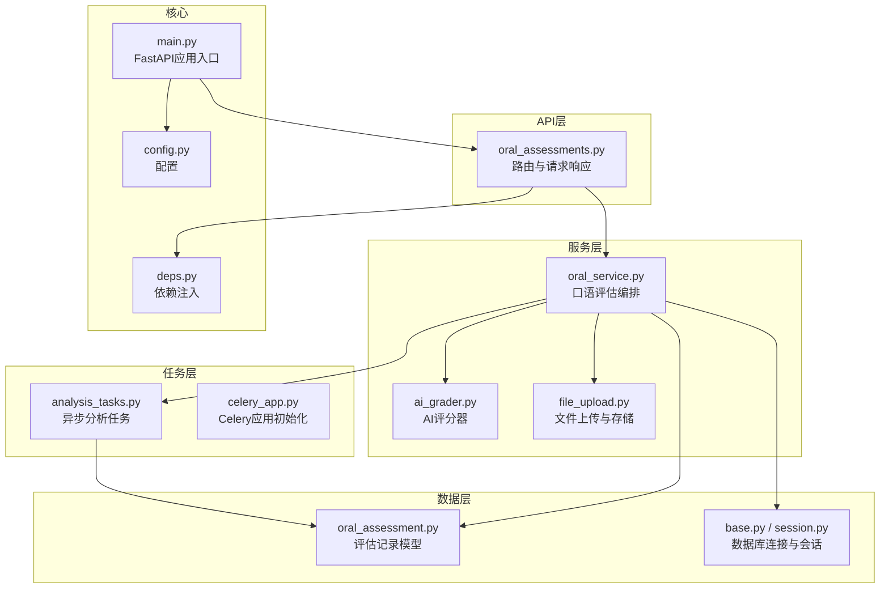
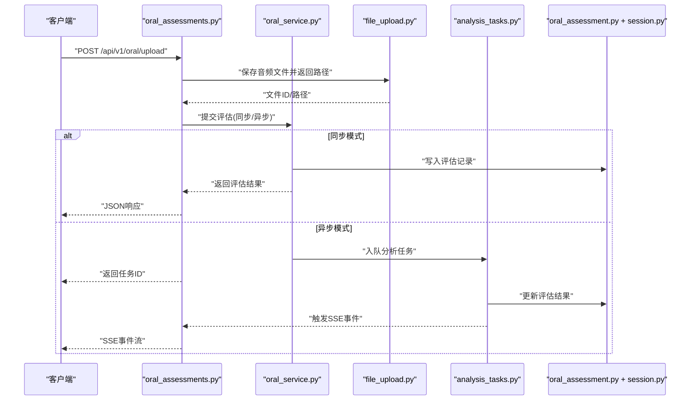
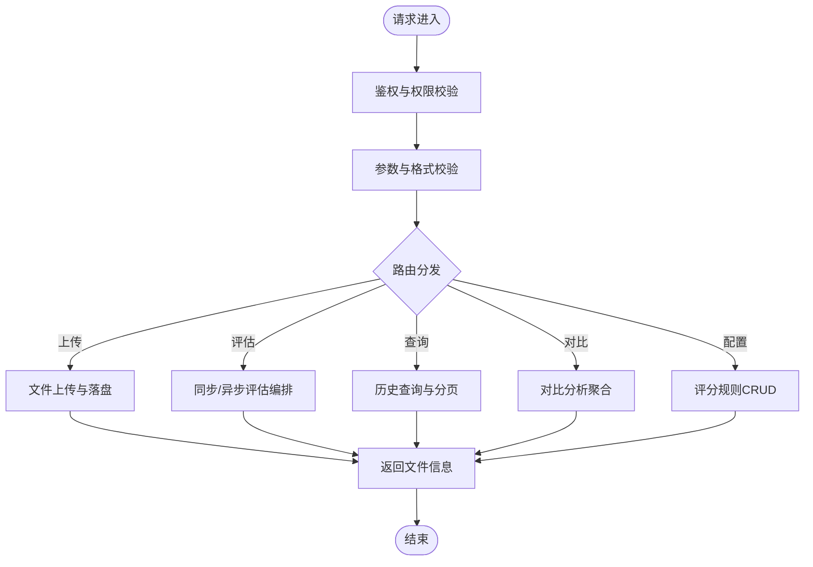
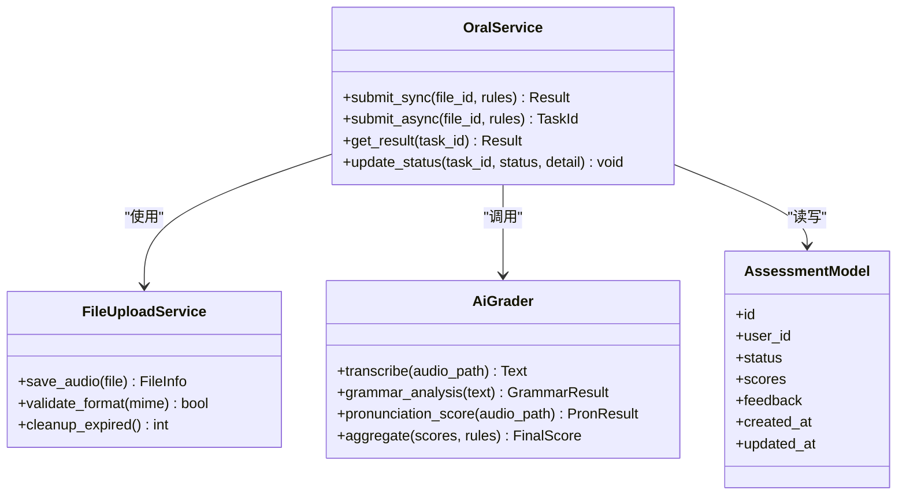
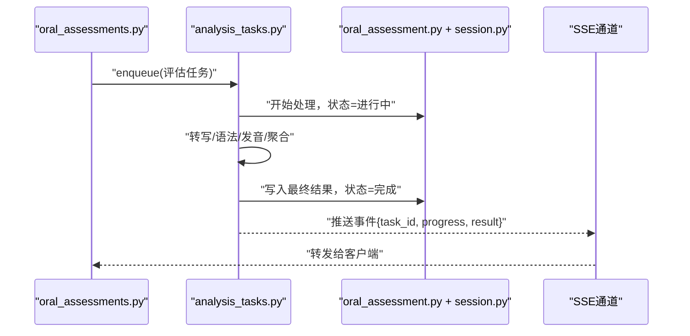
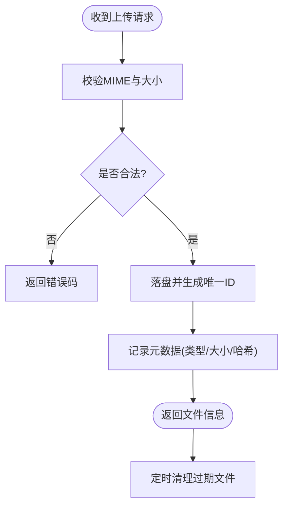
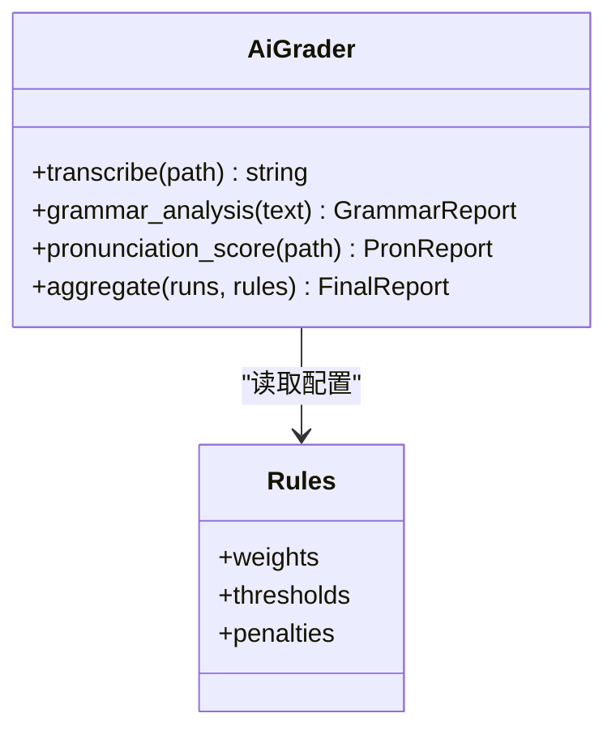
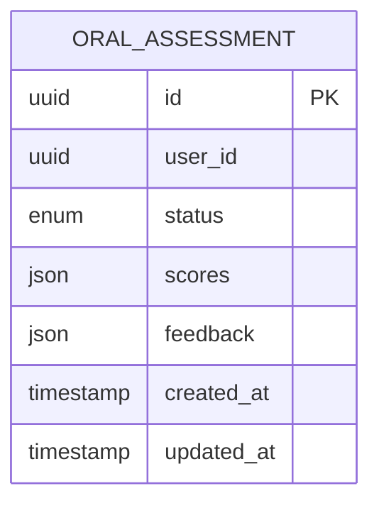
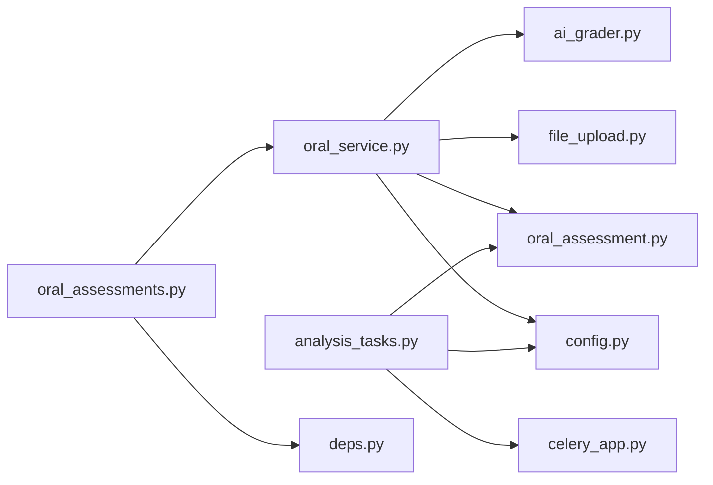

# 口语评估API

<cite>
**本文引用的文件**   
- [oral_assessments.py](file://backend/app/api/v1/oral_assessments.py)
- [oral_service.py](file://backend/app/services/oral_service.py)
- [ai_grader.py](file://backend/app/services/ai_grader.py)
- [file_upload.py](file://backend/app/services/file_upload.py)
- [analysis_tasks.py](file://backend/app/tasks/analysis_tasks.py)
- [celery_app.py](file://backend/app/tasks/celery_app.py)
- [config.py](file://backend/app/core/config.py)
- [deps.py](file://backend/app/core/deps.py)
- [session.py](file://backend/app/db/session.py)
- [base.py](file://backend/app/db/base.py)
- [oral_assessment.py](file://backend/app/models/oral_assessment.py)
- [main.py](file://backend/app/main.py)
</cite>

## 目录
1. [简介](#简介)
2. [项目结构](#项目结构)
3. [核心组件](#核心组件)
4. [架构总览](#架构总览)
5. [详细组件分析](#详细组件分析)
6. [依赖关系分析](#依赖关系分析)
7. [性能考虑](#性能考虑)
8. [故障排查指南](#故障排查指南)
9. [结论](#结论)
10. [附录](#附录)

## 简介
本文件为“口语评估系统”的完整API文档，覆盖以下能力：
- 语音文件上传与处理接口（支持多种音频格式）
- 语音转文字、语法分析、发音评估等核心功能
- 结构化评估结果数据模型（评分指标与详细反馈）
- 实时评估接口（流式语音输入与即时反馈）
- 评估标准配置接口（自定义评分规则）
- 历史评估数据查询与对比分析
- 音频文件存储管理与清理策略
- 完整的错误处理与重试机制说明

## 项目结构
后端采用分层架构：API层负责路由与参数校验；服务层封装业务逻辑；任务层通过Celery异步处理耗时操作；数据层基于SQLAlchemy管理持久化。

图表来源
- [oral_assessments.py](file://backend/app/api/v1/oral_assessments.py)
- [oral_service.py](file://backend/app/services/oral_service.py)
- [ai_grader.py](file://backend/app/services/ai_grader.py)
- [file_upload.py](file://backend/app/services/file_upload.py)
- [analysis_tasks.py](file://backend/app/tasks/analysis_tasks.py)
- [celery_app.py](file://backend/app/tasks/celery_app.py)
- [oral_assessment.py](file://backend/app/models/oral_assessment.py)
- [base.py](file://backend/app/db/base.py)
- [session.py](file://backend/app/db/session.py)
- [config.py](file://backend/app/core/config.py)
- [deps.py](file://backend/app/core/deps.py)
- [main.py](file://backend/app/main.py)

章节来源
- [main.py](file://backend/app/main.py)
- [oral_assessments.py](file://backend/app/api/v1/oral_assessments.py)
- [oral_service.py](file://backend/app/services/oral_service.py)
- [ai_grader.py](file://backend/app/services/ai_grader.py)
- [file_upload.py](file://backend/app/services/file_upload.py)
- [analysis_tasks.py](file://backend/app/tasks/analysis_tasks.py)
- [celery_app.py](file://backend/app/tasks/celery_app.py)
- [oral_assessment.py](file://backend/app/models/oral_assessment.py)
- [base.py](file://backend/app/db/base.py)
- [session.py](file://backend/app/db/session.py)
- [config.py](file://backend/app/core/config.py)
- [deps.py](file://backend/app/core/deps.py)

## 核心组件
- API路由模块：提供REST与SSE接口，统一鉴权与参数校验，返回标准化响应体。
- 口语评估服务：编排语音转写、语法分析、发音评估流程，协调同步与异步路径。
- AI评分器：封装评分算法与规则，输出多维评分与可解释性反馈。
- 文件上传服务：处理多格式音频上传、校验、落盘与生命周期管理。
- 异步任务：将耗时分析放入队列，避免阻塞HTTP请求。
- 数据模型与会话：定义评估记录结构与数据库访问。

章节来源
- [oral_assessments.py](file://backend/app/api/v1/oral_assessments.py)
- [oral_service.py](file://backend/app/services/oral_service.py)
- [ai_grader.py](file://backend/app/services/ai_grader.py)
- [file_upload.py](file://backend/app/services/file_upload.py)
- [analysis_tasks.py](file://backend/app/tasks/analysis_tasks.py)
- [oral_assessment.py](file://backend/app/models/oral_assessment.py)
- [session.py](file://backend/app/db/session.py)

## 架构总览
整体调用链：客户端发起请求 → FastAPI路由 → 服务层编排 → 可选异步任务 → 数据持久化 → 返回结果或推送SSE事件。

图表来源
- [oral_assessments.py](file://backend/app/api/v1/oral_assessments.py)
- [oral_service.py](file://backend/app/services/oral_service.py)
- [file_upload.py](file://backend/app/services/file_upload.py)
- [analysis_tasks.py](file://backend/app/tasks/analysis_tasks.py)
- [oral_assessment.py](file://backend/app/models/oral_assessment.py)
- [session.py](file://backend/app/db/session.py)

## 详细组件分析

### 组件A：口语评估API路由
职责
- 定义上传、评估、查询、配置、SSE等端点
- 统一鉴权、参数校验、异常映射
- 返回标准化响应体

关键端点（概念性描述）
- 上传音频：接收multipart表单，校验格式与大小，落盘后返回文件标识
- 提交评估：支持同步与异步两种模式；异步返回任务ID并通过SSE推送进度
- 查询历史：按用户、时间范围、任务状态筛选
- 对比分析：对多次评估结果进行差异统计
- 配置评分规则：增删改查评分维度与权重

图表来源
- [oral_assessments.py](file://backend/app/api/v1/oral_assessments.py)
- [deps.py](file://backend/app/core/deps.py)

章节来源
- [oral_assessments.py](file://backend/app/api/v1/oral_assessments.py)
- [deps.py](file://backend/app/core/deps.py)

### 组件B：口语评估服务（OralService）
职责
- 编排语音转写、语法分析、发音评估
- 选择同步或异步执行路径
- 维护评估记录的生命周期与状态机

图表来源
- [oral_service.py](file://backend/app/services/oral_service.py)
- [file_upload.py](file://backend/app/services/file_upload.py)
- [ai_grader.py](file://backend/app/services/ai_grader.py)
- [oral_assessment.py](file://backend/app/models/oral_assessment.py)

章节来源
- [oral_service.py](file://backend/app/services/oral_service.py)
- [ai_grader.py](file://backend/app/services/ai_grader.py)
- [file_upload.py](file://backend/app/services/file_upload.py)
- [oral_assessment.py](file://backend/app/models/oral_assessment.py)

### 组件C：异步分析任务（Celery）
职责
- 消费评估任务，执行耗时步骤
- 更新数据库中的评估结果与状态
- 触发SSE事件通知前端

图表来源
- [analysis_tasks.py](file://backend/app/tasks/analysis_tasks.py)
- [celery_app.py](file://backend/app/tasks/celery_app.py)
- [oral_assessment.py](file://backend/app/models/oral_assessment.py)
- [session.py](file://backend/app/db/session.py)

章节来源
- [analysis_tasks.py](file://backend/app/tasks/analysis_tasks.py)
- [celery_app.py](file://backend/app/tasks/celery_app.py)
- [oral_assessment.py](file://backend/app/models/oral_assessment.py)
- [session.py](file://backend/app/db/session.py)

### 组件D：文件上传与存储管理
职责
- 校验音频格式与大小
- 安全落盘与元数据记录
- 过期清理策略与磁盘配额控制

图表来源
- [file_upload.py](file://backend/app/services/file_upload.py)
- [config.py](file://backend/app/core/config.py)

章节来源
- [file_upload.py](file://backend/app/services/file_upload.py)
- [config.py](file://backend/app/core/config.py)

### 组件E：AI评分器（AiGrader）
职责
- 语音转文本
- 语法分析与纠错建议
- 发音准确度与流利度评分
- 依据评分规则聚合最终得分

图表来源
- [ai_grader.py](file://backend/app/services/ai_grader.py)
- [config.py](file://backend/app/core/config.py)

章节来源
- [ai_grader.py](file://backend/app/services/ai_grader.py)
- [config.py](file://backend/app/core/config.py)

### 组件F：数据模型与会话
职责
- 定义评估记录字段与约束
- 提供会话创建与事务管理

图表来源
- [oral_assessment.py](file://backend/app/models/oral_assessment.py)
- [base.py](file://backend/app/db/base.py)
- [session.py](file://backend/app/db/session.py)

章节来源
- [oral_assessment.py](file://backend/app/models/oral_assessment.py)
- [base.py](file://backend/app/db/base.py)
- [session.py](file://backend/app/db/session.py)

## 依赖关系分析
- API层依赖服务层与依赖注入容器
- 服务层依赖文件上传、AI评分器、数据库会话
- 任务层依赖Celery应用与数据库会话
- 配置集中化管理，影响上传限制、评分规则、任务超时等

图表来源
- [oral_assessments.py](file://backend/app/api/v1/oral_assessments.py)
- [oral_service.py](file://backend/app/services/oral_service.py)
- [ai_grader.py](file://backend/app/services/ai_grader.py)
- [file_upload.py](file://backend/app/services/file_upload.py)
- [analysis_tasks.py](file://backend/app/tasks/analysis_tasks.py)
- [celery_app.py](file://backend/app/tasks/celery_app.py)
- [oral_assessment.py](file://backend/app/models/oral_assessment.py)
- [config.py](file://backend/app/core/config.py)
- [deps.py](file://backend/app/core/deps.py)

章节来源
- [oral_assessments.py](file://backend/app/api/v1/oral_assessments.py)
- [oral_service.py](file://backend/app/services/oral_service.py)
- [ai_grader.py](file://backend/app/services/ai_grader.py)
- [file_upload.py](file://backend/app/services/file_upload.py)
- [analysis_tasks.py](file://backend/app/tasks/analysis_tasks.py)
- [celery_app.py](file://backend/app/tasks/celery_app.py)
- [oral_assessment.py](file://backend/app/models/oral_assessment.py)
- [config.py](file://backend/app/core/config.py)
- [deps.py](file://backend/app/core/deps.py)

## 性能考虑
- 大音频文件优先走异步路径，避免长连接阻塞
- 并发上传时启用分片与断点续传（前端实现）
- 评分流水线可并行化：转写与语法分析可并行，发音评分串行
- 数据库索引优化：按用户ID、时间范围、状态建立索引
- 缓存热点配置与评分规则，减少重复加载
- 合理设置Celery worker数量与任务超时，防止资源耗尽

[本节为通用指导，不直接分析具体文件]

## 故障排查指南
常见问题与定位要点
- 上传失败：检查MIME类型、文件大小、磁盘空间与权限
- 评估超时：查看Celery日志、worker负载、任务队列堆积情况
- 评分异常：核对评分规则配置、阈值与权重；确认输入文本与音频一致性
- SSE中断：检查网络稳定性与服务端事件推送链路
- 数据不一致：核对事务边界与幂等键，确保任务重试不会重复写入

错误处理与重试机制
- 上传阶段：非法格式/过大文件立即返回错误码；临时IO错误指数退避重试
- 评估阶段：非致命错误（如外部服务抖动）自动重试；致命错误标记失败并保留中间结果
- 任务阶段：Celery内置重试策略，结合死信队列记录失败详情
- 统一错误码与消息体，便于前端展示与监控告警

章节来源
- [file_upload.py](file://backend/app/services/file_upload.py)
- [analysis_tasks.py](file://backend/app/tasks/analysis_tasks.py)
- [celery_app.py](file://backend/app/tasks/celery_app.py)
- [oral_service.py](file://backend/app/services/oral_service.py)

## 结论
本API围绕“上传—评估—结果—配置—历史—实时”形成闭环，兼顾同步与异步体验，具备可扩展的评分规则与完善的错误处理机制。建议在生产环境开启异步默认、完善监控与审计，并对敏感数据进行脱敏与加密存储。

[本节为总结性内容，不直接分析具体文件]

## 附录

### 支持的音频格式
- 常见格式：MP3、WAV、OGG、FLAC、AAC、M4A
- 采样率建议：≥16kHz，单声道或立体声均可
- 最大文件大小：由配置项控制，默认值见配置章节

章节来源
- [file_upload.py](file://backend/app/services/file_upload.py)
- [config.py](file://backend/app/core/config.py)

### 评估结果数据结构（示例字段）
- 基础信息：任务ID、用户ID、状态、时间戳
- 综合得分：总分、各维度权重加权结果
- 维度评分：语法准确性、词汇丰富度、发音准确度、流利度、连贯性
- 详细反馈：错误定位、改进建议、参考范例
- 过程信息：转写文本、中间分数、耗时统计

章节来源
- [oral_assessment.py](file://backend/app/models/oral_assessment.py)
- [ai_grader.py](file://backend/app/services/ai_grader.py)

### 实时评估（SSE）交互流程
- 客户端建立SSE连接并携带任务ID
- 服务端在任务各阶段推送进度与片段结果
- 完成后推送最终结果并关闭连接

章节来源
- [oral_assessments.py](file://backend/app/api/v1/oral_assessments.py)
- [analysis_tasks.py](file://backend/app/tasks/analysis_tasks.py)

### 评估标准配置接口
- 新增/修改/删除评分维度与权重
- 设置阈值与惩罚规则
- 版本化管理与灰度发布

章节来源
- [oral_assessments.py](file://backend/app/api/v1/oral_assessments.py)
- [config.py](file://backend/app/core/config.py)

### 历史评估查询与对比分析
- 查询条件：用户、时间范围、任务状态、关键词
- 对比维度：同用户多次评估趋势、不同规则下结果差异
- 导出能力：CSV/Excel导出

章节来源
- [oral_assessments.py](file://backend/app/api/v1/oral_assessments.py)
- [oral_assessment.py](file://backend/app/models/oral_assessment.py)

### 音频文件存储管理与清理策略
- 存储位置：本地磁盘或对象存储（由配置决定）
- 命名规范：基于哈希与时间戳，避免冲突
- 清理策略：按过期时间、磁盘水位线、用户配额回收
- 备份与恢复：定期快照与增量备份

章节来源
- [file_upload.py](file://backend/app/services/file_upload.py)
- [config.py](file://backend/app/core/config.py)

### 错误码与重试策略（概览）
- 上传错误：格式不支持、大小超限、权限不足
- 评估错误：转写失败、评分服务不可用、规则缺失
- 任务错误：队列拥堵、Worker崩溃、超时
- 重试策略：指数退避、最大重试次数、死信队列

章节来源
- [file_upload.py](file://backend/app/services/file_upload.py)
- [analysis_tasks.py](file://backend/app/tasks/analysis_tasks.py)
- [celery_app.py](file://backend/app/tasks/celery_app.py)