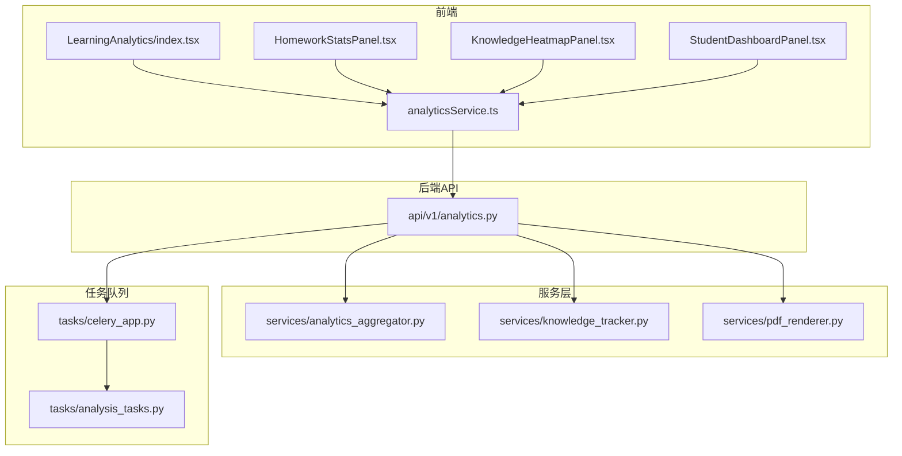
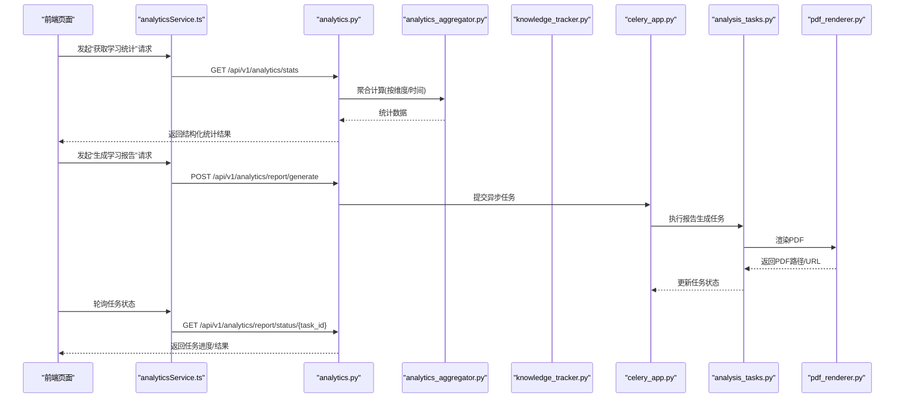
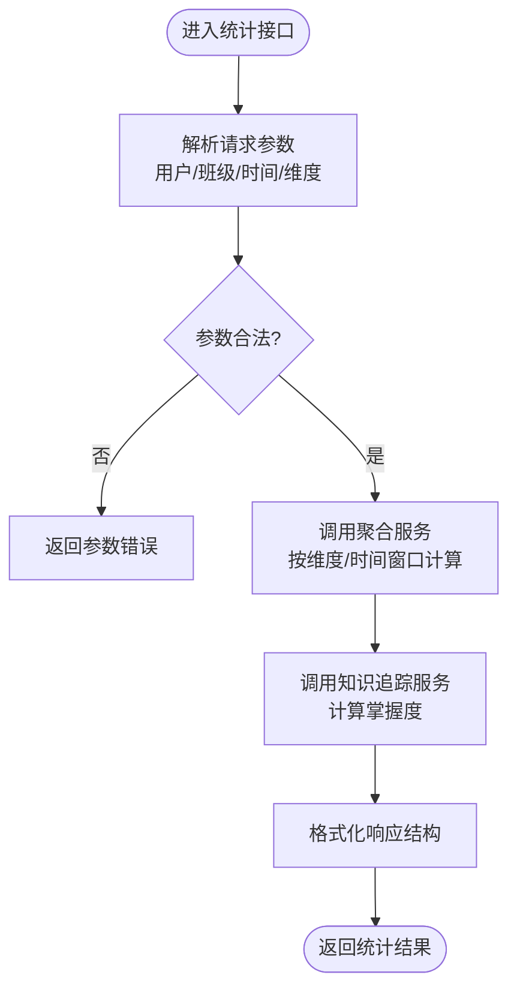
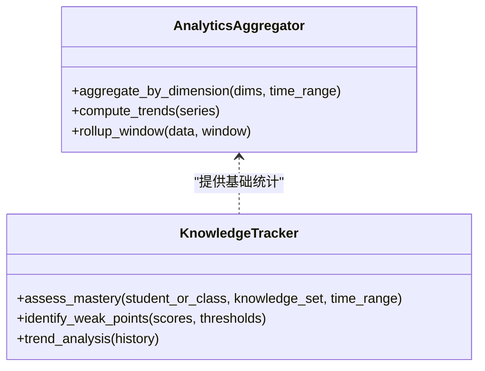
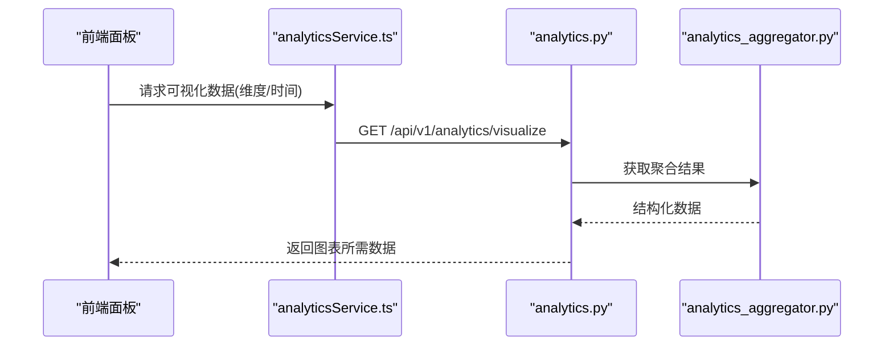
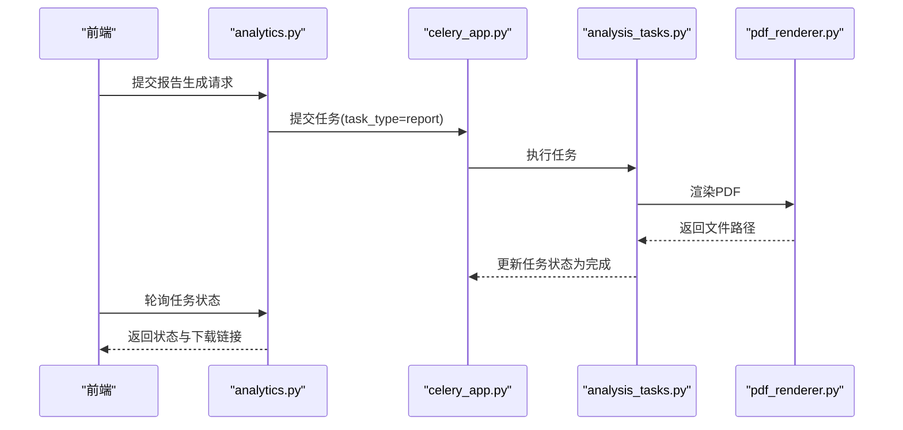
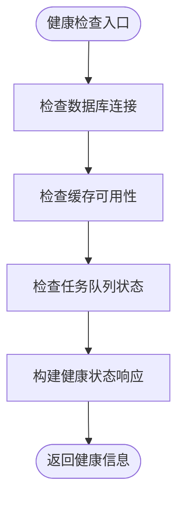
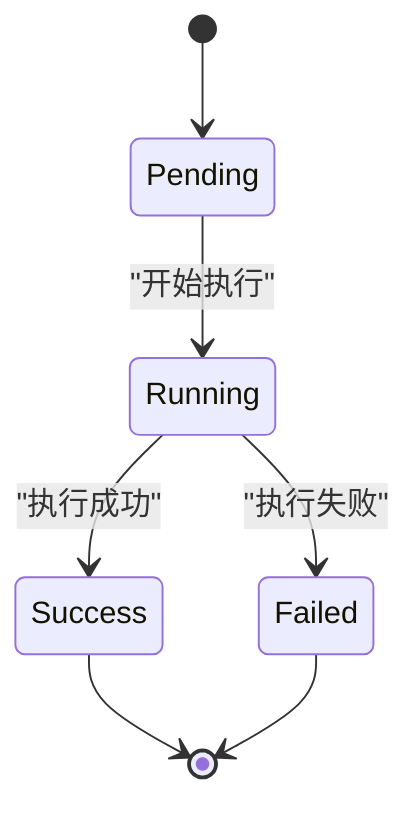
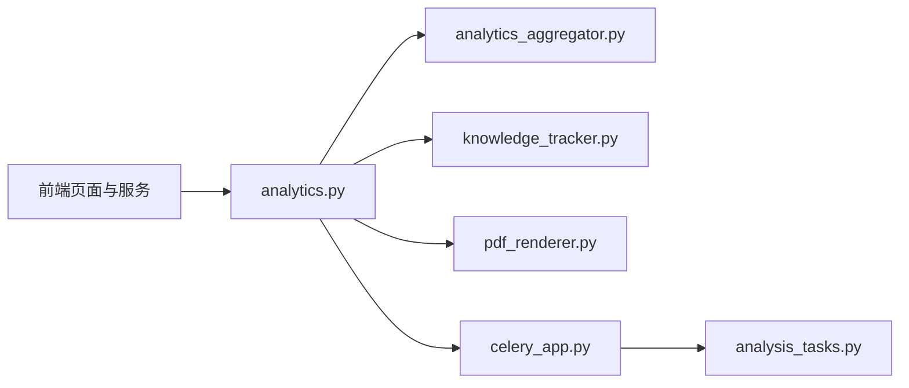

# 学习分析API

<cite>
**本文引用的文件**   
- [backend/app/api/v1/analytics.py](file://backend/app/api/v1/analytics.py)
- [backend/app/schemas/analytics.py](file://backend/app/schemas/analytics.py)
- [backend/app/services/analytics_aggregator.py](file://backend/app/services/analytics_aggregator.py)
- [backend/app/services/knowledge_tracker.py](file://backend/app/services/knowledge_tracker.py)
- [backend/app/services/pdf_renderer.py](file://backend/app/services/pdf_renderer.py)
- [backend/app/tasks/analysis_tasks.py](file://backend/app/tasks/analysis_tasks.py)
- [backend/app/tasks/celery_app.py](file://backend/app/tasks/celery_app.py)
- [frontend/src/pages/LearningAnalytics/index.tsx](file://frontend/src/pages/LearningAnalytics/index.tsx)
- [frontend/src/pages/LearningAnalytics/HomeworkStatsPanel.tsx](file://frontend/src/pages/LearningAnalytics/HomeworkStatsPanel.tsx)
- [frontend/src/pages/LearningAnalytics/KnowledgeHeatmapPanel.tsx](file://frontend/src/pages/LearningAnalytics/KnowledgeHeatmapPanel.tsx)
- [frontend/src/pages/LearningAnalytics/StudentDashboardPanel.tsx](file://frontend/src/pages/LearningAnalytics/StudentDashboardPanel.tsx)
- [frontend/src/services/analyticsService.ts](file://frontend/src/services/analyticsService.ts)
</cite>

## 目录
1. [简介](#简介)
2. [项目结构](#项目结构)
3. [核心组件](#核心组件)
4. [架构总览](#架构总览)
5. [详细组件分析](#详细组件分析)
6. [依赖关系分析](#依赖关系分析)
7. [性能考虑](#性能考虑)
8. [故障排查指南](#故障排查指南)
9. [结论](#结论)
10. [附录](#附录)

## 简介
本文件为“学习分析模块”的完整API文档，覆盖以下能力：
- 学习数据统计接口：个人学习轨迹、班级整体表现、知识点掌握度分析
- 数据聚合与计算接口：支持自定义分析维度与时间范围
- 可视化数据接口：为前端图表提供结构化数据
- 学习报告生成接口：支持PDF导出与邮件发送
- 性能监控与健康检查接口
- 异步任务状态查询：用于长时间运行的分析任务
- 数据缓存策略与性能优化建议
- 完整的数据格式定义与示例响应

## 项目结构
学习分析相关代码主要分布在后端API层、Schema定义、服务层、任务队列以及前端页面与服务调用封装中。

**图示来源**
- [backend/app/api/v1/analytics.py](file://backend/app/api/v1/analytics.py)
- [backend/app/services/analytics_aggregator.py](file://backend/app/services/analytics_aggregator.py)
- [backend/app/services/knowledge_tracker.py](file://backend/app/services/knowledge_tracker.py)
- [backend/app/services/pdf_renderer.py](file://backend/app/services/pdf_renderer.py)
- [backend/app/tasks/celery_app.py](file://backend/app/tasks/celery_app.py)
- [backend/app/tasks/analysis_tasks.py](file://backend/app/tasks/analysis_tasks.py)
- [frontend/src/pages/LearningAnalytics/index.tsx](file://frontend/src/pages/LearningAnalytics/index.tsx)
- [frontend/src/pages/LearningAnalytics/HomeworkStatsPanel.tsx](file://frontend/src/pages/LearningAnalytics/HomeworkStatsPanel.tsx)
- [frontend/src/pages/LearningAnalytics/KnowledgeHeatmapPanel.tsx](file://frontend/src/pages/LearningAnalytics/KnowledgeHeatmapPanel.tsx)
- [frontend/src/pages/LearningAnalytics/StudentDashboardPanel.tsx](file://frontend/src/pages/LearningAnalytics/StudentDashboardPanel.tsx)
- [frontend/src/services/analyticsService.ts](file://frontend/src/services/analyticsService.ts)

**章节来源**
- [backend/app/api/v1/analytics.py](file://backend/app/api/v1/analytics.py)
- [backend/app/services/analytics_aggregator.py](file://backend/app/services/analytics_aggregator.py)
- [backend/app/services/knowledge_tracker.py](file://backend/app/services/knowledge_tracker.py)
- [backend/app/services/pdf_renderer.py](file://backend/app/services/pdf_renderer.py)
- [backend/app/tasks/celery_app.py](file://backend/app/tasks/celery_app.py)
- [backend/app/tasks/analysis_tasks.py](file://backend/app/tasks/analysis_tasks.py)
- [frontend/src/pages/LearningAnalytics/index.tsx](file://frontend/src/pages/LearningAnalytics/index.tsx)
- [frontend/src/pages/LearningAnalytics/HomeworkStatsPanel.tsx](file://frontend/src/pages/LearningAnalytics/HomeworkStatsPanel.tsx)
- [frontend/src/pages/LearningAnalytics/KnowledgeHeatmapPanel.tsx](file://frontend/src/pages/LearningAnalytics/KnowledgeHeatmapPanel.tsx)
- [frontend/src/pages/LearningAnalytics/StudentDashboardPanel.tsx](file://frontend/src/pages/LearningAnalytics/StudentDashboardPanel.tsx)
- [frontend/src/services/analyticsService.ts](file://frontend/src/services/analyticsService.ts)

## 核心组件
- API路由层：统一暴露学习分析相关REST接口，负责参数校验、权限控制、结果序列化。
- Schema定义：集中描述请求与响应的数据结构，保证前后端契约一致。
- 聚合服务：实现多维度、多时间窗口的统计与聚合计算。
- 知识追踪服务：维护知识点掌握度、薄弱点识别与趋势变化。
- PDF渲染服务：将分析报告渲染为可下载的PDF。
- 任务队列：通过Celery执行耗时分析任务，并提供任务状态查询。

**章节来源**
- [backend/app/api/v1/analytics.py](file://backend/app/api/v1/analytics.py)
- [backend/app/schemas/analytics.py](file://backend/app/schemas/analytics.py)
- [backend/app/services/analytics_aggregator.py](file://backend/app/services/analytics_aggregator.py)
- [backend/app/services/knowledge_tracker.py](file://backend/app/services/knowledge_tracker.py)
- [backend/app/services/pdf_renderer.py](file://backend/app/services/pdf_renderer.py)
- [backend/app/tasks/celery_app.py](file://backend/app/tasks/celery_app.py)
- [backend/app/tasks/analysis_tasks.py](file://backend/app/tasks/analysis_tasks.py)

## 架构总览
学习分析模块采用分层架构：前端通过统一的analyticsService发起请求；后端API层进行鉴权与入参校验后，调用聚合与知识追踪服务完成计算；对耗时任务使用Celery异步执行并返回任务ID供前端轮询；报告生成由PDF渲染服务完成。

**图示来源**
- [frontend/src/services/analyticsService.ts](file://frontend/src/services/analyticsService.ts)
- [backend/app/api/v1/analytics.py](file://backend/app/api/v1/analytics.py)
- [backend/app/services/analytics_aggregator.py](file://backend/app/services/analytics_aggregator.py)
- [backend/app/services/knowledge_tracker.py](file://backend/app/services/knowledge_tracker.py)
- [backend/app/tasks/celery_app.py](file://backend/app/tasks/celery_app.py)
- [backend/app/tasks/analysis_tasks.py](file://backend/app/tasks/analysis_tasks.py)
- [backend/app/services/pdf_renderer.py](file://backend/app/services/pdf_renderer.py)

## 详细组件分析

### 学习数据统计接口
- 个人学习轨迹
  - 功能：按时间序列汇总个人的练习、作业、测评等学习行为，输出时间轴事件与指标。
  - 输入：用户标识、时间范围、可选维度（如题型、知识点）。
  - 输出：时间序列数据、累计指标、趋势变化。
- 班级整体表现
  - 功能：聚合班级维度的成绩分布、正确率、参与度等指标。
  - 输入：班级标识、时间范围、分组维度（如单元、知识点）。
  - 输出：分布直方图数据、排名、对比指标。
- 知识点掌握度分析
  - 功能：基于历史作答与测评结果，评估学生对各知识点的掌握程度与变化趋势。
  - 输入：学生或班级标识、时间范围、知识点集合。
  - 输出：掌握度评分、薄弱点列表、提升建议。

**图示来源**
- [backend/app/api/v1/analytics.py](file://backend/app/api/v1/analytics.py)
- [backend/app/services/analytics_aggregator.py](file://backend/app/services/analytics_aggregator.py)
- [backend/app/services/knowledge_tracker.py](file://backend/app/services/knowledge_tracker.py)

**章节来源**
- [backend/app/api/v1/analytics.py](file://backend/app/api/v1/analytics.py)
- [backend/app/services/analytics_aggregator.py](file://backend/app/services/analytics_aggregator.py)
- [backend/app/services/knowledge_tracker.py](file://backend/app/services/knowledge_tracker.py)

### 数据聚合与计算接口
- 自定义分析维度
  - 支持按知识点、题型、难度、单元等多维度组合筛选。
  - 支持时间粒度选择（日、周、月）与滚动窗口计算。
- 计算逻辑
  - 聚合服务负责从底层数据源拉取原始记录，按维度分组、过滤、聚合，输出中间态统计对象。
  - 知识追踪服务在聚合基础上计算掌握度、趋势与异常检测。
- 性能要点
  - 预聚合表与索引优化
  - 分页与增量计算
  - 缓存热点维度与时间窗口

**图示来源**
- [backend/app/services/analytics_aggregator.py](file://backend/app/services/analytics_aggregator.py)
- [backend/app/services/knowledge_tracker.py](file://backend/app/services/knowledge_tracker.py)

**章节来源**
- [backend/app/services/analytics_aggregator.py](file://backend/app/services/analytics_aggregator.py)
- [backend/app/services/knowledge_tracker.py](file://backend/app/services/knowledge_tracker.py)

### 可视化数据接口
- 目标：为前端图表提供可直接消费的结构化数据，减少前端二次处理成本。
- 典型输出字段
  - 时间序列：时间戳、值、标签
  - 分类分布：类别、计数、占比
  - 热力矩阵：行/列维度、强度值
- 前端集成
  - LearningAnalytics页面通过analyticsService调用可视化接口，直接绑定到图表库。

**图示来源**
- [frontend/src/pages/LearningAnalytics/HomeworkStatsPanel.tsx](file://frontend/src/pages/LearningAnalytics/HomeworkStatsPanel.tsx)
- [frontend/src/pages/LearningAnalytics/KnowledgeHeatmapPanel.tsx](file://frontend/src/pages/LearningAnalytics/KnowledgeHeatmapPanel.tsx)
- [frontend/src/pages/LearningAnalytics/StudentDashboardPanel.tsx](file://frontend/src/pages/LearningAnalytics/StudentDashboardPanel.tsx)
- [frontend/src/services/analyticsService.ts](file://frontend/src/services/analyticsService.ts)
- [backend/app/api/v1/analytics.py](file://backend/app/api/v1/analytics.py)
- [backend/app/services/analytics_aggregator.py](file://backend/app/services/analytics_aggregator.py)

**章节来源**
- [frontend/src/pages/LearningAnalytics/HomeworkStatsPanel.tsx](file://frontend/src/pages/LearningAnalytics/HomeworkStatsPanel.tsx)
- [frontend/src/pages/LearningAnalytics/KnowledgeHeatmapPanel.tsx](file://frontend/src/pages/LearningAnalytics/KnowledgeHeatmapPanel.tsx)
- [frontend/src/pages/LearningAnalytics/StudentDashboardPanel.tsx](file://frontend/src/pages/LearningAnalytics/StudentDashboardPanel.tsx)
- [frontend/src/services/analyticsService.ts](file://frontend/src/services/analyticsService.ts)
- [backend/app/api/v1/analytics.py](file://backend/app/api/v1/analytics.py)
- [backend/app/services/analytics_aggregator.py](file://backend/app/services/analytics_aggregator.py)

### 学习报告生成接口
- 功能：根据选定维度与时间范围生成学习报告，支持PDF导出与邮件发送。
- 流程
  - 前端提交生成请求，后端创建异步任务并返回任务ID。
  - 任务执行阶段调用PDF渲染服务生成报告文件。
  - 前端轮询任务状态，完成后下载PDF或触发邮件发送。
- 关键接口
  - 生成报告：POST /api/v1/analytics/report/generate
  - 查询状态：GET /api/v1/analytics/report/status/{task_id}
  - 下载报告：GET /api/v1/analytics/report/download/{task_id}
  - 发送邮件：POST /api/v1/analytics/report/email/{task_id}

**图示来源**
- [backend/app/api/v1/analytics.py](file://backend/app/api/v1/analytics.py)
- [backend/app/tasks/celery_app.py](file://backend/app/tasks/celery_app.py)
- [backend/app/tasks/analysis_tasks.py](file://backend/app/tasks/analysis_tasks.py)
- [backend/app/services/pdf_renderer.py](file://backend/app/services/pdf_renderer.py)

**章节来源**
- [backend/app/api/v1/analytics.py](file://backend/app/api/v1/analytics.py)
- [backend/app/tasks/celery_app.py](file://backend/app/tasks/celery_app.py)
- [backend/app/tasks/analysis_tasks.py](file://backend/app/tasks/analysis_tasks.py)
- [backend/app/services/pdf_renderer.py](file://backend/app/services/pdf_renderer.py)

### 性能监控与健康检查接口
- 健康检查
  - GET /api/v1/analytics/health：返回服务可用性与依赖状态。
- 性能监控
  - GET /api/v1/analytics/metrics：返回关键指标（QPS、延迟分位、错误率、缓存命中率）。
- 用途
  - 运维监控面板展示
  - 告警阈值触发

[此图为概念性流程图，不直接映射具体源码文件]

### 异步任务状态查询
- 任务类型
  - report：学习报告生成
  - analytics：大规模数据分析
- 状态枚举
  - pending：排队中
  - running：运行中
  - success：成功
  - failed：失败
- 查询接口
  - GET /api/v1/analytics/task/status/{task_id}

**图示来源**
- [backend/app/tasks/analysis_tasks.py](file://backend/app/tasks/analysis_tasks.py)
- [backend/app/tasks/celery_app.py](file://backend/app/tasks/celery_app.py)

**章节来源**
- [backend/app/tasks/analysis_tasks.py](file://backend/app/tasks/analysis_tasks.py)
- [backend/app/tasks/celery_app.py](file://backend/app/tasks/celery_app.py)

## 依赖关系分析
- 前端依赖
  - 页面组件依赖analyticsService进行网络请求与错误处理。
- 后端依赖
  - API层依赖聚合与知识追踪服务；异步任务依赖Celery与应用配置；PDF渲染独立于业务逻辑。
- 外部依赖
  - 数据库、缓存、消息队列、邮件服务。

**图示来源**
- [frontend/src/services/analyticsService.ts](file://frontend/src/services/analyticsService.ts)
- [backend/app/api/v1/analytics.py](file://backend/app/api/v1/analytics.py)
- [backend/app/services/analytics_aggregator.py](file://backend/app/services/analytics_aggregator.py)
- [backend/app/services/knowledge_tracker.py](file://backend/app/services/knowledge_tracker.py)
- [backend/app/services/pdf_renderer.py](file://backend/app/services/pdf_renderer.py)
- [backend/app/tasks/celery_app.py](file://backend/app/tasks/celery_app.py)
- [backend/app/tasks/analysis_tasks.py](file://backend/app/tasks/analysis_tasks.py)

**章节来源**
- [frontend/src/services/analyticsService.ts](file://frontend/src/services/analyticsService.ts)
- [backend/app/api/v1/analytics.py](file://backend/app/api/v1/analytics.py)
- [backend/app/services/analytics_aggregator.py](file://backend/app/services/analytics_aggregator.py)
- [backend/app/services/knowledge_tracker.py](file://backend/app/services/knowledge_tracker.py)
- [backend/app/services/pdf_renderer.py](file://backend/app/services/pdf_renderer.py)
- [backend/app/tasks/celery_app.py](file://backend/app/tasks/celery_app.py)
- [backend/app/tasks/analysis_tasks.py](file://backend/app/tasks/analysis_tasks.py)

## 性能考虑
- 缓存策略
  - 对热点维度与时间窗口结果进行缓存，设置合理过期时间与失效策略。
  - 使用键空间隔离不同租户/班级/用户，避免污染。
- 计算优化
  - 预聚合与物化视图，减少实时计算压力。
  - 增量更新与滚动窗口，降低全量扫描。
- I/O优化
  - 批量读取与分页游标，避免大结果集一次性加载。
  - 压缩传输与按需字段返回。
- 并发与限流
  - 针对长任务限制并发数，防止资源耗尽。
  - 对高频接口实施令牌桶限流。
- 监控与告警
  - 采集P95/P99延迟、错误率、缓存命中率、队列积压等指标。
  - 设置阈值告警与自动降级策略。

[本节为通用指导，无需特定文件引用]

## 故障排查指南
- 常见问题
  - 参数校验失败：检查时间范围、维度枚举、必填字段。
  - 任务失败：查看任务日志与错误堆栈，确认PDF渲染与存储路径权限。
  - 缓存未命中：检查缓存服务连通性与键命名规范。
- 定位步骤
  - 通过任务状态接口获取任务详情与错误码。
  - 核对聚合服务的输入数据完整性与一致性。
  - 验证健康检查接口，确认依赖服务状态。
- 恢复建议
  - 重试失败任务，必要时清理脏数据。
  - 调整缓存TTL与预热策略。
  - 扩容计算节点与队列消费者。

**章节来源**
- [backend/app/api/v1/analytics.py](file://backend/app/api/v1/analytics.py)
- [backend/app/tasks/analysis_tasks.py](file://backend/app/tasks/analysis_tasks.py)
- [backend/app/services/pdf_renderer.py](file://backend/app/services/pdf_renderer.py)

## 结论
学习分析模块通过清晰的分层设计与异步任务机制，实现了高可用的统计、可视化与报告生成能力。配合合理的缓存与监控策略，可在复杂分析场景下保持稳定的性能与用户体验。后续可进一步扩展更多维度分析与智能诊断能力。

[本节为总结性内容，无需特定文件引用]

## 附录

### 数据格式定义与示例响应
以下为常见接口的数据模型说明与示例响应结构（以字段名与类型为主，不包含具体代码片段）：

- 个人学习轨迹
  - 请求参数
    - user_id：字符串
    - start_time：ISO时间字符串
    - end_time：ISO时间字符串
    - dimensions：数组，包含维度键值
  - 响应结构
    - data：对象
      - timeline：数组，元素包含时间戳、指标值、标签
      - summary：对象，包含累计次数、平均正确率、趋势方向
    - meta：对象，包含时间范围、维度说明
  - 示例响应
    - {
        "data": {
          "timeline": [
            {"timestamp": "2024-01-01T00:00:00Z", "value": 12, "label": "练习"}
          ],
          "summary": {
            "total_count": 120,
            "avg_accuracy": 0.78,
            "trend": "上升"
          }
        },
        "meta": {
          "time_range": {"start": "2024-01-01", "end": "2024-01-31"},
          "dimensions": ["type", "knowledge_point"]
        }
      }

- 班级整体表现
  - 请求参数
    - class_id：字符串
    - start_time：ISO时间字符串
    - end_time：ISO时间字符串
    - group_by：字符串，如unit或knowledge_point
  - 响应结构
    - data：对象
      - distribution：数组，元素包含区间、人数、占比
      - ranking：数组，元素包含学生ID、分数、名次
      - comparison：对象，包含与上期对比的变化指标
    - meta：对象，包含分组维度与统计口径
  - 示例响应
    - {
        "data": {
          "distribution": [
            {"range": "0-60", "count": 5, "ratio": 0.1},
            {"range": "60-80", "count": 20, "ratio": 0.4},
            {"range": "80-100", "count": 25, "ratio": 0.5}
          ],
          "ranking": [
            {"student_id": "s001", "score": 92, "rank": 1}
          ],
          "comparison": {
            "accuracy_change": 0.05,
            "participation_change": 0.03
          }
        },
        "meta": {
          "group_by": "unit",
          "methodology": "加权平均"
        }
      }

- 知识点掌握度分析
  - 请求参数
    - target_id：字符串（学生或班级）
    - knowledge_set：数组，知识点标识
    - start_time：ISO时间字符串
    - end_time：ISO时间字符串
  - 响应结构
    - data：对象
      - mastery_scores：对象，键为知识点，值为掌握度评分
      - weak_points：数组，包含薄弱知识点与建议
      - trends：数组，元素包含时间点与掌握度变化
    - meta：对象，包含阈值与评估方法
  - 示例响应
    - {
        "data": {
          "mastery_scores": {
            "algebra": 0.85,
            "geometry": 0.62,
            "statistics": 0.74
          },
          "weak_points": [
            {"knowledge_point": "geometry", "reason": "连续两次低于阈值", "suggestion": "增加专项练习"}
          ],
          "trends": [
            {"timestamp": "2024-01-15", "score": 0.6},
            {"timestamp": "2024-01-22", "score": 0.62}
          ]
        },
        "meta": {
          "threshold": 0.7,
          "method": "贝叶斯估计"
        }
      }

- 可视化数据接口
  - 请求参数
    - type：字符串，如bar、line、heatmap
    - dimensions：数组，维度键值
    - time_range：对象，包含start与end
  - 响应结构
    - data：对象
      - series：数组，元素包含时间戳与值
      - categories：数组，分类名称
      - matrix：二维数组，热力矩阵
    - meta：对象，包含单位与刻度信息
  - 示例响应
    - {
        "data": {
          "series": [
            {"time": "2024-01-01", "value": 10},
            {"time": "2024-01-02", "value": 12}
          ],
          "categories": ["A", "B", "C"],
          "matrix": [[0.8, 0.6], [0.5, 0.9]]
        },
        "meta": {
          "unit": "次",
          "scale": "线性"
        }
      }

- 报告生成与状态
  - 生成请求参数
    - scope：对象，包含target_id、dimensions、time_range
    - format：字符串，如pdf
    - email：布尔，是否发送邮件
  - 响应结构
    - task_id：字符串
    - status：字符串，初始为pending
  - 状态查询响应
    - task_id：字符串
    - status：字符串，枚举值见上
    - result：对象，包含download_url或error_message
  - 示例响应
    - 生成：{"task_id": "rpt_001", "status": "pending"}
    - 状态：{"task_id": "rpt_001", "status": "success", "result": {"download_url": "/api/v1/analytics/report/download/rpt_001"}}

**章节来源**
- [backend/app/schemas/analytics.py](file://backend/app/schemas/analytics.py)
- [backend/app/api/v1/analytics.py](file://backend/app/api/v1/analytics.py)
- [backend/app/services/analytics_aggregator.py](file://backend/app/services/analytics_aggregator.py)
- [backend/app/services/knowledge_tracker.py](file://backend/app/services/knowledge_tracker.py)
- [backend/app/services/pdf_renderer.py](file://backend/app/services/pdf_renderer.py)
- [backend/app/tasks/analysis_tasks.py](file://backend/app/tasks/analysis_tasks.py)
- [frontend/src/services/analyticsService.ts](file://frontend/src/services/analyticsService.ts)