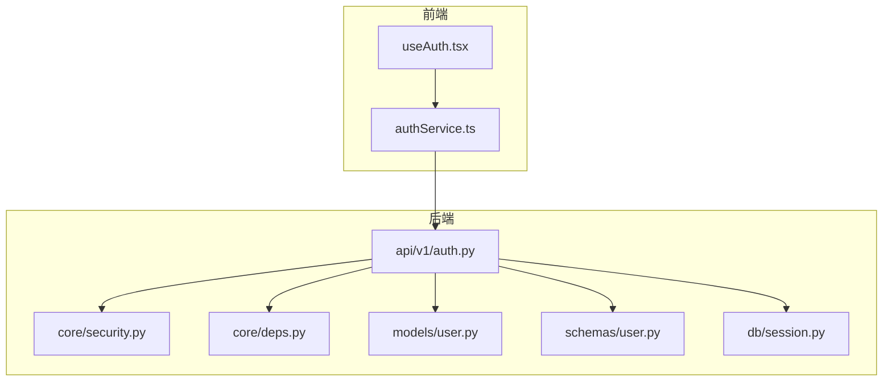
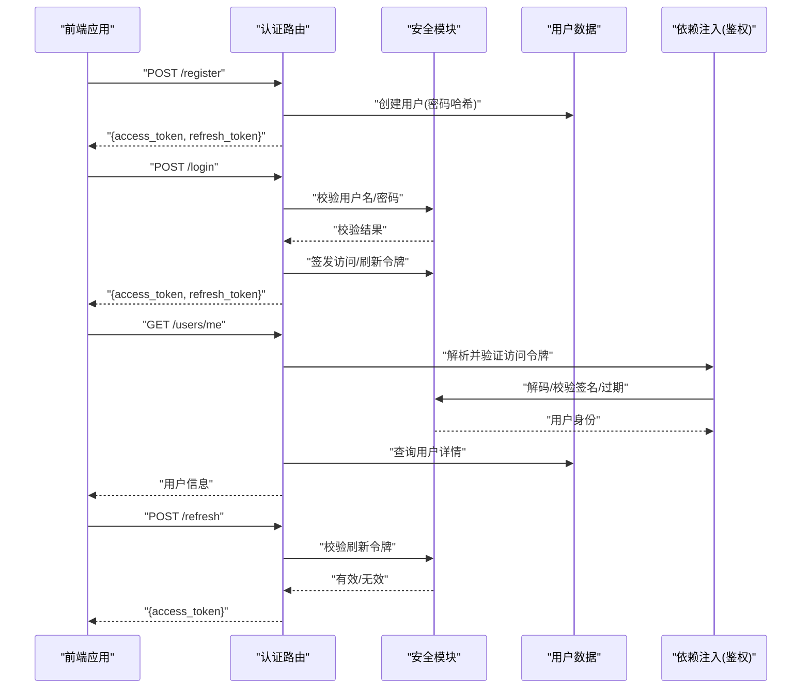
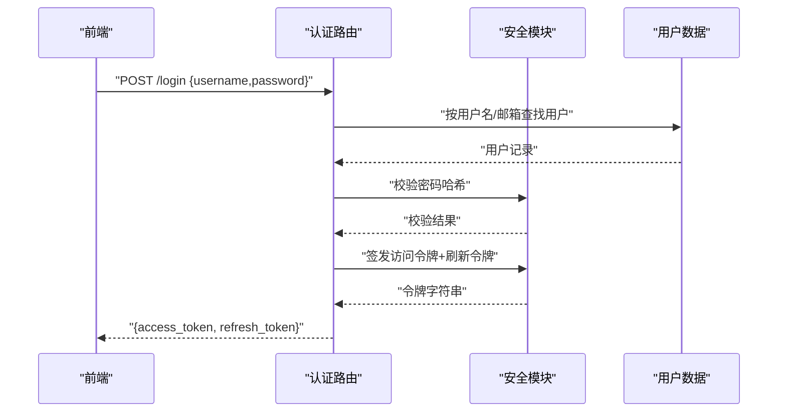
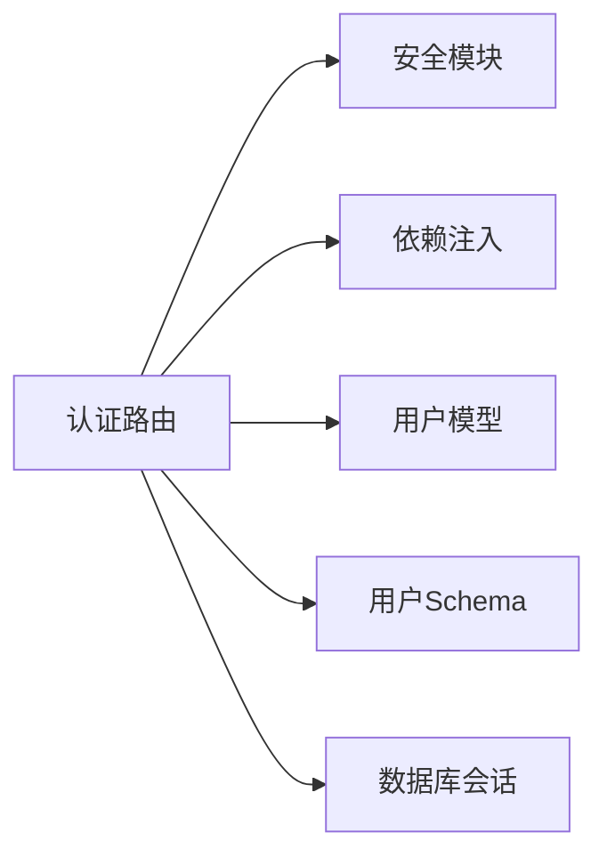

# 认证授权API

<cite>
**本文引用的文件**   
- [backend/app/api/v1/auth.py](file://backend/app/api/v1/auth.py)
- [backend/app/core/security.py](file://backend/app/core/security.py)
- [backend/app/core/deps.py](file://backend/app/core/deps.py)
- [backend/app/models/user.py](file://backend/app/models/user.py)
- [backend/app/schemas/user.py](file://backend/app/schemas/user.py)
- [backend/app/db/session.py](file://backend/app/db/session.py)
- [frontend/src/services/authService.ts](file://frontend/src/services/authService.ts)
- [frontend/src/hooks/useAuth.tsx](file://frontend/src/hooks/useAuth.tsx)
</cite>

## 目录
1. [简介](#简介)
2. [项目结构](#项目结构)
3. [核心组件](#核心组件)
4. [架构总览](#架构总览)
5. [详细组件分析](#详细组件分析)
6. [依赖分析](#依赖分析)
7. [性能考虑](#性能考虑)
8. [故障排查指南](#故障排查指南)
9. [结论](#结论)
10. [附录](#附录)

## 简介
本文件为“认证与授权”模块的完整API文档，覆盖用户注册、登录、登出、密码重置等认证相关接口；说明JWT访问令牌与刷新令牌的生成与验证机制；记录用户信息管理接口（获取详情、更新个人信息、修改密码）；并给出权限控制相关的API设计建议。文档同时提供请求/响应示例（成功与错误场景），以及安全最佳实践（密码加密存储、令牌过期处理、会话管理等）。

## 项目结构
后端采用分层架构：路由层（API）、服务与安全层（Security/Depends）、数据模型与Schema、数据库会话管理。前端通过HTTP客户端调用后端API，并在本地持久化令牌与会话状态。

图表来源
- [backend/app/api/v1/auth.py](file://backend/app/api/v1/auth.py)
- [backend/app/core/security.py](file://backend/app/core/security.py)
- [backend/app/core/deps.py](file://backend/app/core/deps.py)
- [backend/app/models/user.py](file://backend/app/models/user.py)
- [backend/app/schemas/user.py](file://backend/app/schemas/user.py)
- [backend/app/db/session.py](file://backend/app/db/session.py)
- [frontend/src/services/authService.ts](file://frontend/src/services/authService.ts)
- [frontend/src/hooks/useAuth.tsx](file://frontend/src/hooks/useAuth.tsx)

章节来源
- [backend/app/api/v1/auth.py](file://backend/app/api/v1/auth.py)
- [backend/app/core/security.py](file://backend/app/core/security.py)
- [backend/app/core/deps.py](file://backend/app/core/deps.py)
- [backend/app/models/user.py](file://backend/app/models/user.py)
- [backend/app/schemas/user.py](file://backend/app/schemas/user.py)
- [backend/app/db/session.py](file://backend/app/db/session.py)
- [frontend/src/services/authService.ts](file://frontend/src/services/authService.ts)
- [frontend/src/hooks/useAuth.tsx](file://frontend/src/hooks/useAuth.tsx)

## 核心组件
- 认证路由与业务编排：负责接收认证相关请求，校验输入，调用安全模块签发/验证令牌，操作用户数据。
- 安全模块：负责密码哈希与校验、JWT访问令牌与刷新令牌的签发与解析、令牌黑名单/撤销（可选）、时间戳与过期策略。
- 依赖注入：提供当前已认证用户、角色/权限校验等通用依赖。
- 数据模型与Schema：定义用户实体字段、校验规则与序列化格式。
- 数据库会话：提供统一的数据库连接与事务上下文。

章节来源
- [backend/app/api/v1/auth.py](file://backend/app/api/v1/auth.py)
- [backend/app/core/security.py](file://backend/app/core/security.py)
- [backend/app/core/deps.py](file://backend/app/core/deps.py)
- [backend/app/models/user.py](file://backend/app/models/user.py)
- [backend/app/schemas/user.py](file://backend/app/schemas/user.py)
- [backend/app/db/session.py](file://backend/app/db/session.py)

## 架构总览
下图展示认证授权的端到端流程：前端发起认证请求，后端路由层进行参数校验，安全模块完成密码校验与JWT签发，随后在受保护资源访问时进行令牌验证与权限检查。

图表来源
- [backend/app/api/v1/auth.py](file://backend/app/api/v1/auth.py)
- [backend/app/core/security.py](file://backend/app/core/security.py)
- [backend/app/core/deps.py](file://backend/app/core/deps.py)
- [backend/app/models/user.py](file://backend/app/models/user.py)
- [backend/app/schemas/user.py](file://backend/app/schemas/user.py)
- [backend/app/db/session.py](file://backend/app/db/session.py)

## 详细组件分析

### 认证接口
- 用户注册
  - 方法路径：POST /api/v1/auth/register
  - 请求体：用户名、邮箱、密码（遵循最小长度与复杂度要求）
  - 响应：返回访问令牌与刷新令牌
  - 错误：用户名或邮箱重复、参数不合法
- 用户登录
  - 方法路径：POST /api/v1/auth/login
  - 请求体：用户名或邮箱、密码
  - 响应：返回访问令牌与刷新令牌
  - 错误：凭证不正确、账户被锁定（如实现）
- 刷新令牌
  - 方法路径：POST /api/v1/auth/refresh
  - 请求体：刷新令牌
  - 响应：新的访问令牌
  - 错误：刷新令牌无效或过期
- 登出
  - 方法路径：POST /api/v1/auth/logout
  - 行为：将刷新令牌加入黑名单（若启用），或清除服务端会话
  - 响应：成功确认
- 密码重置
  - 方法路径：POST /api/v1/auth/forgot-password
  - 行为：发送重置链接或一次性验证码（根据实现）
  - 方法路径：POST /api/v1/auth/reset-password
  - 请求体：重置令牌/验证码、新密码
  - 响应：重置成功

章节来源
- [backend/app/api/v1/auth.py](file://backend/app/api/v1/auth.py)
- [backend/app/core/security.py](file://backend/app/core/security.py)
- [backend/app/models/user.py](file://backend/app/models/user.py)
- [backend/app/schemas/user.py](file://backend/app/schemas/user.py)
- [backend/app/db/session.py](file://backend/app/db/session.py)

#### 登录序列图（含令牌签发）

图表来源
- [backend/app/api/v1/auth.py](file://backend/app/api/v1/auth.py)
- [backend/app/core/security.py](file://backend/app/core/security.py)
- [backend/app/models/user.py](file://backend/app/models/user.py)
- [backend/app/db/session.py](file://backend/app/db/session.py)

### JWT令牌机制
- 访问令牌（Access Token）
  - 用途：携带用户身份与必要声明，用于访问受保护资源
  - 生命周期：短时效（分钟级）
  - 传输：通常置于请求头 Authorization: Bearer <token>
- 刷新令牌（Refresh Token）
  - 用途：换取新的访问令牌
  - 生命周期：长时效（天级）
  - 安全：建议仅通过安全通道传输，服务端可维护黑名单以支持主动撤销
- 令牌签发与验证
  - 签发：使用安全密钥对，包含用户ID、角色/权限声明、过期时间等
  - 验证：校验签名、过期时间、黑名单状态；从请求头提取并解析

章节来源
- [backend/app/core/security.py](file://backend/app/core/security.py)
- [backend/app/core/deps.py](file://backend/app/core/deps.py)

### 用户信息管理接口
- 获取当前用户详情
  - 方法路径：GET /api/v1/users/me
  - 鉴权：需要有效的访问令牌
  - 响应：用户基本信息（不包含敏感字段）
- 更新个人信息
  - 方法路径：PUT /api/v1/users/me
  - 请求体：昵称、头像URL、联系方式等
  - 响应：更新后的用户信息
- 修改密码
  - 方法路径：PUT /api/v1/users/me/password
  - 请求体：旧密码、新密码（需满足复杂度）
  - 响应：修改成功

章节来源
- [backend/app/api/v1/auth.py](file://backend/app/api/v1/auth.py)
- [backend/app/schemas/user.py](file://backend/app/schemas/user.py)
- [backend/app/models/user.py](file://backend/app/models/user.py)
- [backend/app/core/deps.py](file://backend/app/core/deps.py)

### 权限控制相关API（建议）
- 角色管理
  - 列出角色：GET /api/v1/roles
  - 创建角色：POST /api/v1/roles
  - 更新角色：PUT /api/v1/roles/{role_id}
  - 删除角色：DELETE /api/v1/roles/{role_id}
- 权限分配
  - 为用户分配角色：POST /api/v1/users/{user_id}/roles
  - 移除角色：DELETE /api/v1/users/{user_id}/roles/{role_id}
- 权限校验
  - 在受保护资源路由中，基于当前用户的角色/权限声明进行访问控制

章节来源
- [backend/app/core/deps.py](file://backend/app/core/deps.py)
- [backend/app/models/user.py](file://backend/app/models/user.py)

### 前端集成要点
- 令牌存储与自动注入
  - 登录后保存访问/刷新令牌到本地存储
  - 在每次请求前自动附加Authorization头
- 令牌刷新策略
  - 当收到401且存在刷新令牌时，调用刷新接口并重试原请求
- 登出清理
  - 清除本地令牌并调用后端登出接口

章节来源
- [frontend/src/services/authService.ts](file://frontend/src/services/authService.ts)
- [frontend/src/hooks/useAuth.tsx](file://frontend/src/hooks/useAuth.tsx)

## 依赖分析
- 路由层依赖安全模块进行密码校验与令牌签发/验证
- 依赖注入提供当前用户与权限校验能力
- 数据模型与Schema确保数据一致性与校验
- 数据库会话统一管理连接与事务

图表来源
- [backend/app/api/v1/auth.py](file://backend/app/api/v1/auth.py)
- [backend/app/core/security.py](file://backend/app/core/security.py)
- [backend/app/core/deps.py](file://backend/app/core/deps.py)
- [backend/app/models/user.py](file://backend/app/models/user.py)
- [backend/app/schemas/user.py](file://backend/app/schemas/user.py)
- [backend/app/db/session.py](file://backend/app/db/session.py)

章节来源
- [backend/app/api/v1/auth.py](file://backend/app/api/v1/auth.py)
- [backend/app/core/security.py](file://backend/app/core/security.py)
- [backend/app/core/deps.py](file://backend/app/core/deps.py)
- [backend/app/models/user.py](file://backend/app/models/user.py)
- [backend/app/schemas/user.py](file://backend/app/schemas/user.py)
- [backend/app/db/session.py](file://backend/app/db/session.py)

## 性能考虑
- 令牌签发与验证应轻量高效，避免频繁I/O；必要时可对公共配置做缓存
- 刷新令牌批量轮换可能带来额外开销，建议按需刷新与合理过期策略
- 用户信息查询应避免N+1问题，合理使用预加载与投影
- 在高并发下，注意数据库连接池大小与超时设置

[本节为通用指导，无需代码来源]

## 故障排查指南
- 常见错误码与含义
  - 400：请求参数不合法（如密码不符合复杂度）
  - 401：未认证或令牌无效/过期
  - 403：无权限访问
  - 404：资源不存在
  - 409：冲突（如用户名/邮箱重复）
  - 422：数据校验失败
  - 500：服务器内部错误
- 调试建议
  - 检查请求头是否包含正确的Authorization头
  - 确认刷新令牌未被撤销或过期
  - 查看服务端日志中的异常堆栈与SQL执行计划
  - 核对密码哈希算法与盐值配置一致性

章节来源
- [backend/app/api/v1/auth.py](file://backend/app/api/v1/auth.py)
- [backend/app/core/security.py](file://backend/app/core/security.py)
- [backend/app/core/deps.py](file://backend/app/core/deps.py)

## 结论
本认证授权模块围绕JWT令牌与用户数据展开，提供完整的注册、登录、刷新、登出与密码管理接口，并通过依赖注入实现统一的鉴权与权限控制。结合前端令牌管理与刷新策略，可实现安全、可扩展的用户认证体验。建议在生产环境严格实施密码强度策略、令牌短期化与刷新令牌黑名单机制，并配合完善的日志与监控体系。

[本节为总结性内容，无需代码来源]

## 附录

### 请求/响应示例（成功）
- 登录
  - 请求
    - 方法路径：POST /api/v1/auth/login
    - 请求体：{ "username": "string", "password": "string" }
  - 响应
    - 状态码：200
    - 响应体：{ "access_token": "string", "refresh_token": "string", "token_type": "bearer" }
- 刷新令牌
  - 请求
    - 方法路径：POST /api/v1/auth/refresh
    - 请求体：{ "refresh_token": "string" }
  - 响应
    - 状态码：200
    - 响应体：{ "access_token": "string", "token_type": "bearer" }
- 获取用户详情
  - 请求
    - 方法路径：GET /api/v1/users/me
    - 请求头：Authorization: Bearer <access_token>
  - 响应
    - 状态码：200
    - 响应体：{ "id": "int", "username": "string", "email": "string", "created_at": "datetime" }

### 请求/响应示例（错误）
- 登录失败（凭证不正确）
  - 状态码：401
  - 响应体：{ "detail": "用户名或密码错误" }
- 令牌过期
  - 状态码：401
  - 响应体：{ "detail": "令牌已过期" }
- 参数不合法（注册）
  - 状态码：422
  - 响应体：{ "detail": "密码长度不足" }
- 资源冲突（用户名重复）
  - 状态码：409
  - 响应体：{ "detail": "用户名已存在" }

### 安全最佳实践
- 密码存储
  - 使用强哈希算法（如bcrypt/argon2）加盐存储
  - 禁止明文存储或弱哈希
- 令牌安全
  - 访问令牌短时效，刷新令牌长时效但可撤销
  - 仅在HTTPS环境下传输令牌
  - 服务端维护刷新令牌黑名单以支持主动登出
- 会话管理
  - 前端在登出时清除本地令牌
  - 刷新令牌轮换策略与重试机制需谨慎处理幂等性
- 权限控制
  - 基于角色的访问控制（RBAC），最小权限原则
  - 敏感操作二次确认与审计日志

[本节为通用指导，无需代码来源]