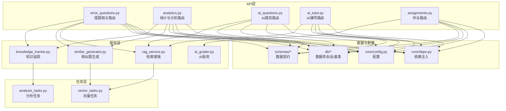
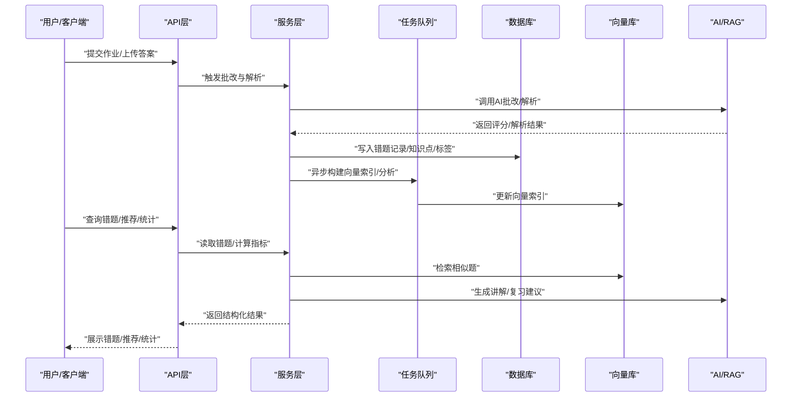
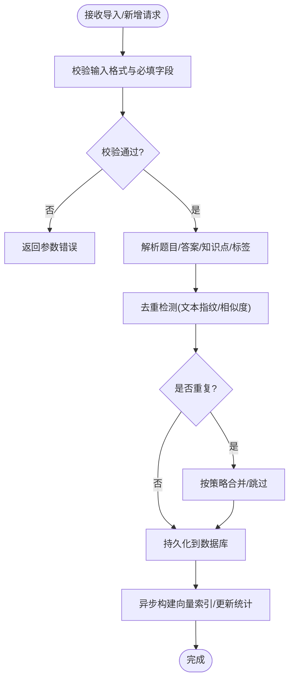
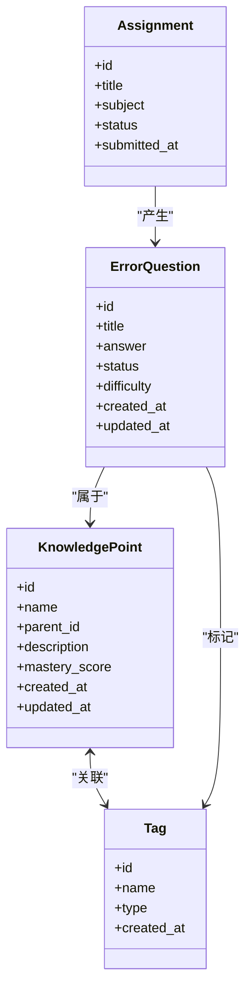
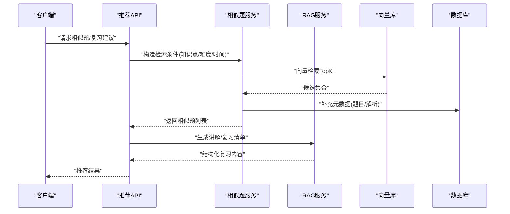
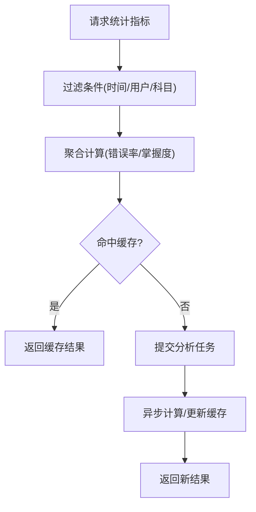
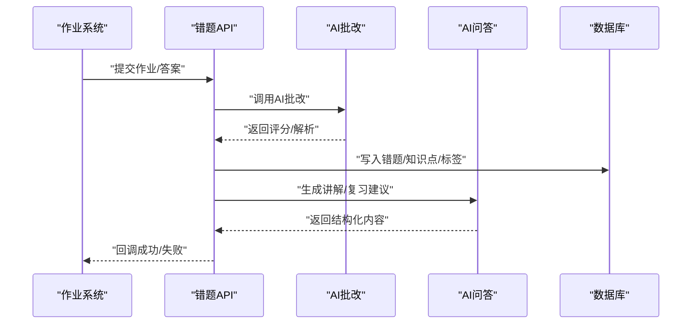
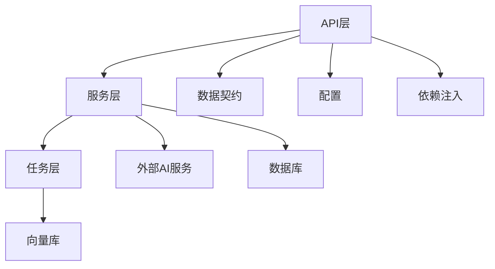

# 错题管理API

<cite>
**本文引用的文件**   
- [error_questions.py](file://backend/app/api/v1/error_questions.py)
- [analytics.py](file://backend/app/api/v1/analytics.py)
- [ai_questions.py](file://backend/app/api/v1/ai_questions.py)
- [ai_tutor.py](file://backend/app/api/v1/ai_tutor.py)
- [assignments.py](file://backend/app/api/v1/assignments.py)
- [question.py](file://backend/app/schemas/question.py)
- [ai_question.py](file://backend/app/schemas/ai_question.py)
- [analytics.py](file://backend/app/schemas/analytics.py)
- [assignment.py](file://backend/app/schemas/assignment.py)
- [knowledge_tracker.py](file://backend/app/services/knowledge_tracker.py)
- [similar_generator.py](file://backend/app/services/similar_generator.py)
- [rag_service.py](file://backend/app/services/rag_service.py)
- [ai_grader.py](file://backend/app/services/ai_grader.py)
- [analysis_tasks.py](file://backend/app/tasks/analysis_tasks.py)
- [vector_tasks.py](file://backend/app/tasks/vector_tasks.py)
- [config.py](file://backend/app/core/config.py)
- [deps.py](file://backend/app/core/deps.py)
- [base.py](file://backend/app/db/base.py)
- [session.py](file://backend/app/db/session.py)
</cite>

## 目录
1. [简介](#简介)
2. [项目结构](#项目结构)
3. [核心组件](#核心组件)
4. [架构总览](#架构总览)
5. [详细组件分析](#详细组件分析)
6. [依赖关系分析](#依赖关系分析)
7. [性能考虑](#性能考虑)
8. [故障排查指南](#故障排查指南)
9. [结论](#结论)
10. [附录](#附录)

## 简介
本文件为“错题管理系统”的完整API文档，覆盖以下能力：
- 错题自动收集、手动添加与分类整理接口
- 知识点关联与标签管理
- 智能推荐（基于错题历史推送相似题目与复习内容）
- 错题本导入导出（多格式支持）
- 统计分析（错误率趋势、薄弱知识点识别等）
- 复习计划生成与提醒通知
- 错题去重与合并算法的配置项
- 完整的错题数据结构定义与示例数据
- 与作业系统、AI问答系统的集成方式

## 项目结构
后端采用分层架构：API层（路由）、服务层（业务逻辑）、任务层（异步处理）、模型与Schema（数据契约）、配置与依赖注入。前端通过服务层调用API并渲染界面。

图表来源
- [error_questions.py](file://backend/app/api/v1/error_questions.py)
- [analytics.py](file://backend/app/api/v1/analytics.py)
- [ai_questions.py](file://backend/app/api/v1/ai_questions.py)
- [ai_tutor.py](file://backend/app/api/v1/ai_tutor.py)
- [assignments.py](file://backend/app/api/v1/assignments.py)
- [knowledge_tracker.py](file://backend/app/services/knowledge_tracker.py)
- [similar_generator.py](file://backend/app/services/similar_generator.py)
- [rag_service.py](file://backend/app/services/rag_service.py)
- [ai_grader.py](file://backend/app/services/ai_grader.py)
- [analysis_tasks.py](file://backend/app/tasks/analysis_tasks.py)
- [vector_tasks.py](file://backend/app/tasks/vector_tasks.py)
- [config.py](file://backend/app/core/config.py)
- [deps.py](file://backend/app/core/deps.py)
- [base.py](file://backend/app/db/base.py)
- [session.py](file://backend/app/db/session.py)

章节来源
- [error_questions.py](file://backend/app/api/v1/error_questions.py)
- [analytics.py](file://backend/app/api/v1/analytics.py)
- [ai_questions.py](file://backend/app/api/v1/ai_questions.py)
- [ai_tutor.py](file://backend/app/api/v1/ai_tutor.py)
- [assignments.py](file://backend/app/api/v1/assignments.py)
- [knowledge_tracker.py](file://backend/app/services/knowledge_tracker.py)
- [similar_generator.py](file://backend/app/services/similar_generator.py)
- [rag_service.py](file://backend/app/services/rag_service.py)
- [ai_grader.py](file://backend/app/services/ai_grader.py)
- [analysis_tasks.py](file://backend/app/tasks/analysis_tasks.py)
- [vector_tasks.py](file://backend/app/tasks/vector_tasks.py)
- [config.py](file://backend/app/core/config.py)
- [deps.py](file://backend/app/core/deps.py)
- [base.py](file://backend/app/db/base.py)
- [session.py](file://backend/app/db/session.py)

## 核心组件
- 错题路由与服务：负责错题的CRUD、自动收集、分类整理、导入导出、去重合并策略配置。
- 分析与统计路由：提供错误率趋势、薄弱知识点识别、学习画像等聚合指标。
- AI题目与辅导：基于RAG与向量检索生成相似题、讲解与复习建议。
- 作业系统集成：对接作业提交与批改结果，驱动错题自动入库。
- 任务队列：异步执行分析、向量化、索引更新等耗时操作。
- 数据契约：统一的请求/响应Schema，确保前后端一致。

章节来源
- [error_questions.py](file://backend/app/api/v1/error_questions.py)
- [analytics.py](file://backend/app/api/v1/analytics.py)
- [ai_questions.py](file://backend/app/api/v1/ai_questions.py)
- [ai_tutor.py](file://backend/app/api/v1/ai_tutor.py)
- [assignments.py](file://backend/app/api/v1/assignments.py)
- [knowledge_tracker.py](file://backend/app/services/knowledge_tracker.py)
- [similar_generator.py](file://backend/app/services/similar_generator.py)
- [rag_service.py](file://backend/app/services/rag_service.py)
- [ai_grader.py](file://backend/app/services/ai_grader.py)
- [analysis_tasks.py](file://backend/app/tasks/analysis_tasks.py)
- [vector_tasks.py](file://backend/app/tasks/vector_tasks.py)

## 架构总览
错题管理的端到端流程如下：
- 自动收集：作业提交后触发批改，错误答案经解析入库，并建立知识点与标签映射。
- 手动添加：用户可手工录入错题，选择或新建知识点、标签，支持批量导入。
- 智能推荐：根据错题历史与知识点图谱，检索相似题与复习材料。
- 复习计划：按遗忘曲线与薄弱点生成计划，定时推送提醒。
- 统计分析：汇总错误率、知识点掌握度、趋势变化。

图表来源
- [error_questions.py](file://backend/app/api/v1/error_questions.py)
- [analytics.py](file://backend/app/api/v1/analytics.py)
- [ai_questions.py](file://backend/app/api/v1/ai_questions.py)
- [ai_tutor.py](file://backend/app/api/v1/ai_tutor.py)
- [knowledge_tracker.py](file://backend/app/services/knowledge_tracker.py)
- [similar_generator.py](file://backend/app/services/similar_generator.py)
- [rag_service.py](file://backend/app/services/rag_service.py)
- [ai_grader.py](file://backend/app/services/ai_grader.py)
- [analysis_tasks.py](file://backend/app/tasks/analysis_tasks.py)
- [vector_tasks.py](file://backend/app/tasks/vector_tasks.py)

## 详细组件分析

### 错题管理API
- 功能范围
  - 自动收集：监听作业提交事件，解析错误答案，创建错题条目，关联知识点与标签。
  - 手动添加：支持单条/批量录入，选择已有或新建知识点与标签。
  - 分类整理：按知识点、标签、难度、时间等维度筛选与分组。
  - 导入导出：支持CSV/Excel/PDF等多格式导入；导出为CSV/Excel/PDF。
  - 去重与合并：基于文本相似度、题干指纹、知识点组合进行去重；支持合并重复条目。
- 关键接口（概念性说明）
  - 创建错题：POST /api/v1/error-questions
  - 批量导入：POST /api/v1/error-questions/import
  - 导出错题：GET /api/v1/error-questions/export?format=csv|excel|pdf
  - 更新错题：PUT /api/v1/error-questions/{id}
  - 删除错题：DELETE /api/v1/error-questions/{id}
  - 分类查询：GET /api/v1/error-questions?filters={...}
  - 去重/合并：POST /api/v1/error-questions/deduplicate, POST /api/v1/error-questions/merge
- 数据契约
  - 请求/响应使用统一Schema，包含字段校验与默认值。
- 错误处理
  - 标准化错误码与消息，区分参数校验、权限、资源不存在、业务冲突等。

图表来源
- [error_questions.py](file://backend/app/api/v1/error_questions.py)
- [knowledge_tracker.py](file://backend/app/services/knowledge_tracker.py)
- [similar_generator.py](file://backend/app/services/similar_generator.py)
- [vector_tasks.py](file://backend/app/tasks/vector_tasks.py)

章节来源
- [error_questions.py](file://backend/app/api/v1/error_questions.py)
- [knowledge_tracker.py](file://backend/app/services/knowledge_tracker.py)
- [similar_generator.py](file://backend/app/services/similar_generator.py)
- [vector_tasks.py](file://backend/app/tasks/vector_tasks.py)

### 知识点与标签管理
- 功能范围
  - 知识点：层级结构、名称、描述、关联题目数、掌握度。
  - 标签：自由标签、预置标签、与知识点映射。
  - 自动打标：从题目/解析中抽取关键词，结合规则与AI辅助打标。
- 关键接口（概念性说明）
  - 知识点CRUD：/api/v1/knowledge-points
  - 标签CRUD：/api/v1/tags
  - 关联关系：/api/v1/knowledge-points/{id}/tags, /api/v1/questions/{id}/knowledge-tags
- 数据契约
  - 使用统一Schema定义实体与关系，保证一致性。

图表来源
- [knowledge_tracker.py](file://backend/app/services/knowledge_tracker.py)
- [ai_question.py](file://backend/app/schemas/ai_question.py)
- [assignment.py](file://backend/app/schemas/assignment.py)
- [question.py](file://backend/app/schemas/question.py)

章节来源
- [knowledge_tracker.py](file://backend/app/services/knowledge_tracker.py)
- [ai_question.py](file://backend/app/schemas/ai_question.py)
- [assignment.py](file://backend/app/schemas/assignment.py)
- [question.py](file://backend/app/schemas/question.py)

### 智能推荐与复习内容
- 功能范围
  - 相似题推荐：基于向量检索与知识点匹配，返回最相似的错题与原题。
  - 复习内容：结合错题解析与知识点图谱，生成讲解、练习清单与记忆卡片。
  - 个性化策略：依据错误次数、最近复习时间、掌握度动态调整权重。
- 关键接口（概念性说明）
  - 相似题：GET /api/v1/recommendations/similar?error_question_id=&limit=
  - 复习建议：GET /api/v1/recommendations/review-plan?user_id=&time_window=
  - 讲解生成：POST /api/v1/recommendations/explain
- 技术要点
  - 向量检索：embedding模型+向量库，支持过滤条件（知识点、难度）。
  - RAG：检索知识库中的讲解片段，结合LLM生成连贯解释。
  - 任务队列：异步生成与缓存，避免阻塞主流程。

图表来源
- [ai_questions.py](file://backend/app/api/v1/ai_questions.py)
- [ai_tutor.py](file://backend/app/api/v1/ai_tutor.py)
- [similar_generator.py](file://backend/app/services/similar_generator.py)
- [rag_service.py](file://backend/app/services/rag_service.py)
- [vector_tasks.py](file://backend/app/tasks/vector_tasks.py)

章节来源
- [ai_questions.py](file://backend/app/api/v1/ai_questions.py)
- [ai_tutor.py](file://backend/app/api/v1/ai_tutor.py)
- [similar_generator.py](file://backend/app/services/similar_generator.py)
- [rag_service.py](file://backend/app/services/rag_service.py)
- [vector_tasks.py](file://backend/app/tasks/vector_tasks.py)

### 错题本导入导出
- 支持格式
  - 导入：CSV、Excel、PDF（OCR解析题目与答案）
  - 导出：CSV、Excel、PDF（含解析与知识点）
- 关键接口（概念性说明）
  - 导入：POST /api/v1/error-questions/import
  - 导出：GET /api/v1/error-questions/export?format=csv|excel|pdf&filters=...
- 注意事项
  - 大文件分片上传与异步处理
  - 导入失败重试与差异报告
  - 导出分页与流式下载

章节来源
- [error_questions.py](file://backend/app/api/v1/error_questions.py)

### 统计分析
- 指标范围
  - 错误率趋势：按日/周/月统计错误率变化
  - 薄弱知识点：按错误次数、最近错误时间、掌握度排序
  - 个人画像：知识点掌握热力图、复习完成率、预测下次正确率
- 关键接口（概念性说明）
  - 趋势：GET /api/v1/analytics/error-rate-trend?period=
  - 薄弱点：GET /api/v1/analytics/weak-knowledge-points?top_n=
  - 画像：GET /api/v1/analytics/profile?user_id=
- 异步计算
  - 分析任务在后台执行，结果缓存与增量更新

图表来源
- [analytics.py](file://backend/app/api/v1/analytics.py)
- [analysis_tasks.py](file://backend/app/tasks/analysis_tasks.py)

章节来源
- [analytics.py](file://backend/app/api/v1/analytics.py)
- [analysis_tasks.py](file://backend/app/tasks/analysis_tasks.py)

### 复习计划与提醒通知
- 功能范围
  - 计划生成：基于错题历史、知识点掌握度与遗忘曲线，生成每日/每周复习清单
  - 提醒通知：站内信/邮件/短信（可选），支持阈值与频率控制
- 关键接口（概念性说明）
  - 生成计划：POST /api/v1/recommendations/review-plan
  - 获取计划：GET /api/v1/recommendations/review-plan?date=
  - 提醒设置：PUT /api/v1/settings/reminders
- 调度机制
  - 定时任务生成计划与发送提醒，支持幂等与重试

章节来源
- [ai_tutor.py](file://backend/app/api/v1/ai_tutor.py)
- [analysis_tasks.py](file://backend/app/tasks/analysis_tasks.py)

### 错题去重与合并算法配置
- 去重策略
  - 文本指纹：题干摘要哈希
  - 相似度阈值：语义相似度（向量距离）
  - 知识点组合：相同知识点+难度+题型
- 合并策略
  - 保留最新/最早版本
  - 合并解析与备注
  - 合并标签与知识点
- 配置项（示例键名）
  - dedup.text_fingerprint.enabled
  - dedup.similarity.threshold
  - dedup.knowledge_combo.enabled
  - merge.strategy
  - merge.keep_latest
  - merge.merge_notes
  - merge.merge_tags
- 生效范围
  - 全局配置与用户级覆盖

章节来源
- [config.py](file://backend/app/core/config.py)
- [similar_generator.py](file://backend/app/services/similar_generator.py)

### 数据结构定义与示例
- 错题实体
  - 字段：id、title、content、answer、correct_answer、explanation、difficulty、status、source、created_at、updated_at
  - 关系：知识点、标签、作业来源
- 知识点实体
  - 字段：id、name、parent_id、description、mastery_score、created_at、updated_at
- 标签实体
  - 字段：id、name、type、created_at
- 作业实体
  - 字段：id、title、subject、status、submitted_at、score
- 示例数据（概念性）
  - 错题：包含题干、选项、正确答案、错误答案、解析、难度等级
  - 知识点：如“函数与方程”“几何证明”，附带掌握度
  - 标签：如“易错点”“高频考点”
  - 作业：包含提交时间与得分

章节来源
- [question.py](file://backend/app/schemas/question.py)
- [ai_question.py](file://backend/app/schemas/ai_question.py)
- [assignment.py](file://backend/app/schemas/assignment.py)

### 与作业系统与AI问答系统集成
- 作业系统
  - 事件订阅：作业提交、批改结果回调
  - 数据同步：作业详情、学生作答、评分
  - 错误触发：当错误率超过阈值时自动入库错题
- AI问答系统
  - 讲解生成：基于RAG与LLM生成个性化讲解
  - 相似题生成：结合向量检索与知识点图谱
  - 对话式复习：交互式问答巩固薄弱点
- 集成点
  - 认证与鉴权：统一JWT/Session
  - 消息队列：异步解耦
  - 配置中心：统一开关与阈值

图表来源
- [assignments.py](file://backend/app/api/v1/assignments.py)
- [ai_grader.py](file://backend/app/services/ai_grader.py)
- [rag_service.py](file://backend/app/services/rag_service.py)
- [ai_questions.py](file://backend/app/api/v1/ai_questions.py)

章节来源
- [assignments.py](file://backend/app/api/v1/assignments.py)
- [ai_grader.py](file://backend/app/services/ai_grader.py)
- [rag_service.py](file://backend/app/services/rag_service.py)
- [ai_questions.py](file://backend/app/api/v1/ai_questions.py)

## 依赖关系分析
- 组件耦合
  - API层依赖服务层与数据契约，服务层依赖任务队列与外部AI服务
  - 任务层与向量库交互，用于相似题检索与索引更新
- 外部依赖
  - 数据库会话与基类
  - 配置与依赖注入
- 潜在循环依赖
  - 服务层不应直接依赖API层；任务层仅依赖服务层与基础设施

图表来源
- [deps.py](file://backend/app/core/deps.py)
- [config.py](file://backend/app/core/config.py)
- [base.py](file://backend/app/db/base.py)
- [session.py](file://backend/app/db/session.py)

章节来源
- [deps.py](file://backend/app/core/deps.py)
- [config.py](file://backend/app/core/config.py)
- [base.py](file://backend/app/db/base.py)
- [session.py](file://backend/app/db/session.py)

## 性能考虑
- 异步处理：导入导出、分析、向量化均走任务队列，避免阻塞主线程
- 缓存策略：统计结果与推荐结果短期缓存，减少重复计算
- 分页与流式：大数据量导出采用流式下载
- 索引优化：向量索引增量更新，热点知识点优先索引
- 限流与熔断：对AI服务调用增加超时与重试上限

## 故障排查指南
- 常见问题
  - 导入失败：检查文件格式、编码、必填字段；查看差异报告
  - 推荐不精准：确认向量索引是否更新；调整相似度阈值
  - 统计延迟：检查分析任务是否堆积；查看任务队列状态
- 日志与监控
  - 关键路径打点：API入口、服务调用、任务完成
  - 错误码对照：参数错误、权限不足、资源不存在、业务冲突
- 恢复策略
  - 幂等写入：防止重复导入导致数据不一致
  - 回滚与补偿：任务失败重试与补偿脚本

章节来源
- [analysis_tasks.py](file://backend/app/tasks/analysis_tasks.py)
- [vector_tasks.py](file://backend/app/tasks/vector_tasks.py)

## 结论
本API文档系统化梳理了错题管理的核心能力与实现要点，涵盖自动收集、手动录入、分类整理、智能推荐、统计分析、复习计划与提醒、导入导出、去重合并以及与其他系统的集成。通过分层架构与异步任务，系统在可扩展性与性能方面具备良好基础。后续可根据实际业务需求细化接口定义与数据契约，完善监控与告警体系。

## 附录
- 术语表
  - 错题：学生在作业或测试中答错的题目记录
  - 知识点：教学内容的结构化单元，具有层级关系
  - 标签：自由或预置的分类标记，便于检索与统计
  - 向量检索：基于嵌入表示的相似度搜索
  - RAG：检索增强生成，结合知识库与LLM生成内容
- 参考文件
  - API路由：error_questions.py、analytics.py、ai_questions.py、ai_tutor.py、assignments.py
  - 服务实现：knowledge_tracker.py、similar_generator.py、rag_service.py、ai_grader.py
  - 任务队列：analysis_tasks.py、vector_tasks.py
  - 数据契约：question.py、ai_question.py、analytics.py、assignment.py
  - 配置与依赖：config.py、deps.py、base.py、session.py