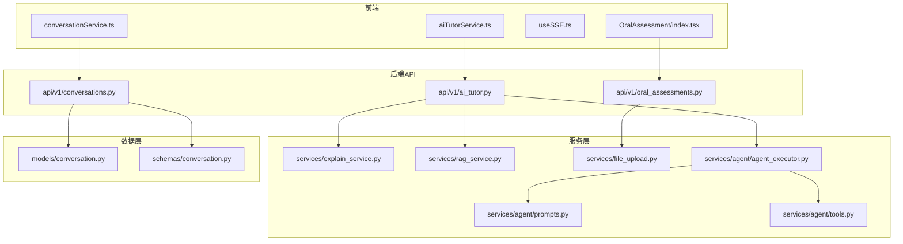
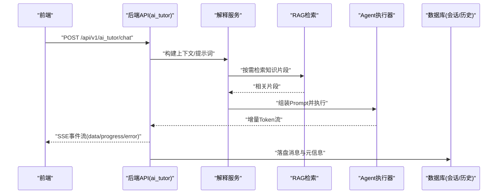
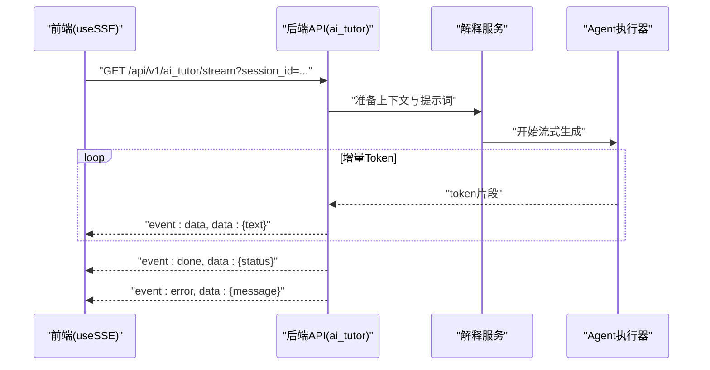
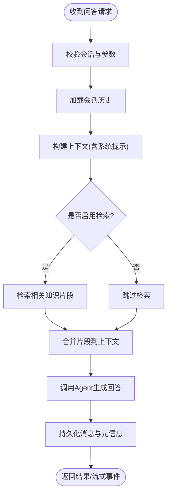
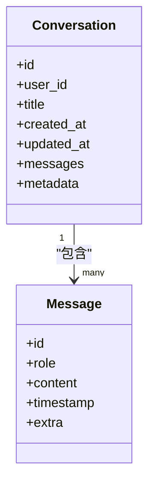
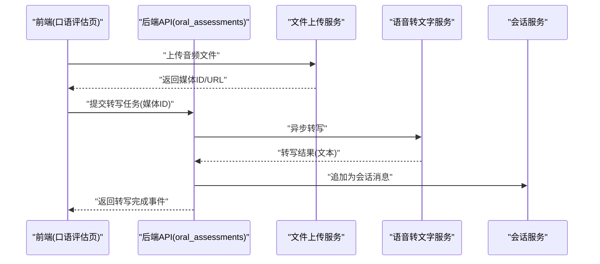
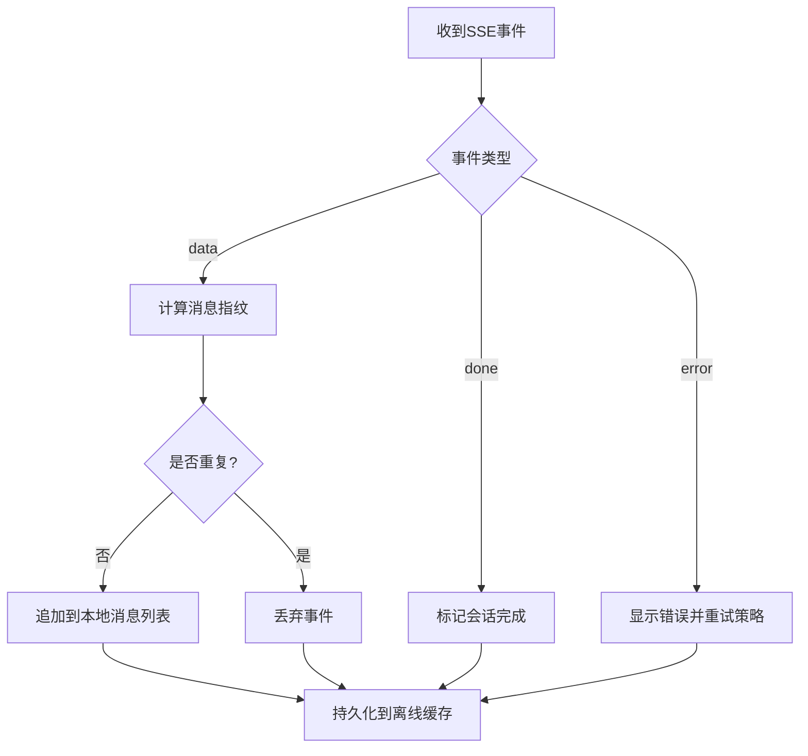
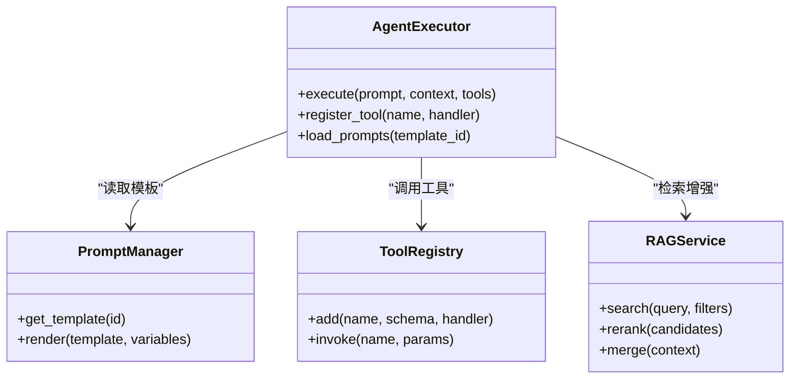
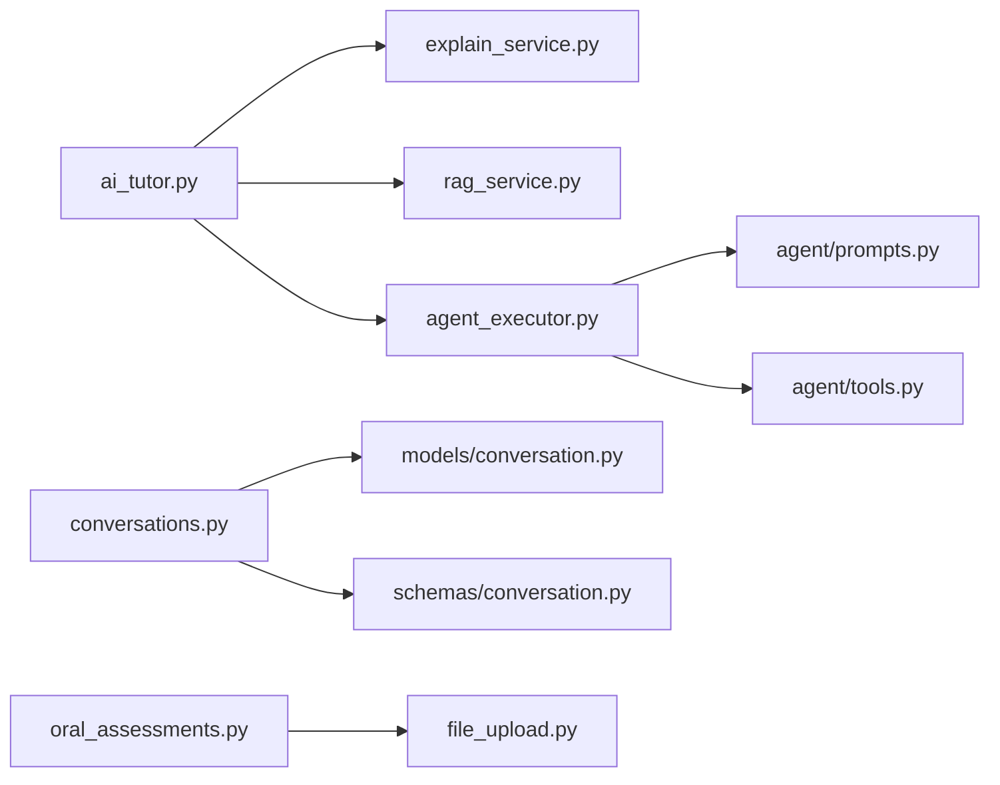

# AI辅导服务

<cite>
**本文引用的文件**   
- [backend/app/api/v1/ai_tutor.py](file://backend/app/api/v1/ai_tutor.py)
- [backend/app/api/v1/conversations.py](file://backend/app/api/v1/conversations.py)
- [backend/app/api/v1/oral_assessments.py](file://backend/app/api/v1/oral_assessments.py)
- [backend/app/services/explain_service.py](file://backend/app/services/explain_service.py)
- [backend/app/services/rag_service.py](file://backend/app/services/rag_service.py)
- [backend/app/services/file_upload.py](file://backend/app/services/file_upload.py)
- [backend/app/services/agent/agent_executor.py](file://backend/app/services/agent/agent_executor.py)
- [backend/app/services/agent/prompts.py](file://backend/app/services/agent/prompts.py)
- [backend/app/services/agent/tools.py](file://backend/app/services/agent/tools.py)
- [backend/app/models/conversation.py](file://backend/app/models/conversation.py)
- [backend/app/schemas/conversation.py](file://backend/app/schemas/conversation.py)
- [frontend/src/hooks/useSSE.ts](file://frontend/src/hooks/useSSE.ts)
- [frontend/src/services/aiTutorService.ts](file://frontend/src/services/aiTutorService.ts)
- [frontend/src/services/conversationService.ts](file://frontend/src/services/conversationService.ts)
- [frontend/src/pages/OralAssessment/index.tsx](file://frontend/src/pages/OralAssessment/index.tsx)
</cite>

## 目录
1. [简介](#简介)
2. [项目结构](#项目结构)
3. [核心组件](#核心组件)
4. [架构总览](#架构总览)
5. [详细组件分析](#详细组件分析)
6. [依赖关系分析](#依赖关系分析)
7. [性能考虑](#性能考虑)
8. [故障排查指南](#故障排查指南)
9. [结论](#结论)
10. [附录](#附录)

## 简介
本文件面向AI辅导服务的后端与前端实现，系统性阐述以下能力：
- 实时对话接口、流式响应处理（SSE）与连接管理
- AI问答接口调用、上下文维护与历史记录管理
- 语音转文字接口、音频文件上传与实时语音交互
- 对话状态同步、消息去重与离线缓存策略
- AI能力扩展接口、自定义提示词配置与知识库检索集成

文档以“从概念到代码”的方式组织，既提供高层架构图，也给出关键流程的时序图与流程图，并附带可定位的源码路径，便于读者快速对照实现。

## 项目结构
本项目采用前后端分离架构：
- 后端基于Python，提供REST API与SSE流式接口；包含模型定义、Schema校验、服务层、Agent执行器、RAG检索、任务队列等模块
- 前端基于React+TypeScript，封装API服务、SSE Hook、页面组件与服务编排

图表来源
- [backend/app/api/v1/ai_tutor.py](file://backend/app/api/v1/ai_tutor.py)
- [backend/app/api/v1/conversations.py](file://backend/app/api/v1/conversations.py)
- [backend/app/api/v1/oral_assessments.py](file://backend/app/api/v1/oral_assessments.py)
- [backend/app/services/explain_service.py](file://backend/app/services/explain_service.py)
- [backend/app/services/rag_service.py](file://backend/app/services/rag_service.py)
- [backend/app/services/file_upload.py](file://backend/app/services/file_upload.py)
- [backend/app/services/agent/agent_executor.py](file://backend/app/services/agent/agent_executor.py)
- [backend/app/services/agent/prompts.py](file://backend/app/services/agent/prompts.py)
- [backend/app/services/agent/tools.py](file://backend/app/services/agent/tools.py)
- [backend/app/models/conversation.py](file://backend/app/models/conversation.py)
- [backend/app/schemas/conversation.py](file://backend/app/schemas/conversation.py)
- [frontend/src/hooks/useSSE.ts](file://frontend/src/hooks/useSSE.ts)
- [frontend/src/services/aiTutorService.ts](file://frontend/src/services/aiTutorService.ts)
- [frontend/src/services/conversationService.ts](file://frontend/src/services/conversationService.ts)
- [frontend/src/pages/OralAssessment/index.tsx](file://frontend/src/pages/OralAssessment/index.tsx)

章节来源
- [backend/app/api/v1/ai_tutor.py](file://backend/app/api/v1/ai_tutor.py)
- [backend/app/api/v1/conversations.py](file://backend/app/api/v1/conversations.py)
- [backend/app/api/v1/oral_assessments.py](file://backend/app/api/v1/oral_assessments.py)
- [backend/app/services/explain_service.py](file://backend/app/services/explain_service.py)
- [backend/app/services/rag_service.py](file://backend/app/services/rag_service.py)
- [backend/app/services/file_upload.py](file://backend/app/services/file_upload.py)
- [backend/app/services/agent/agent_executor.py](file://backend/app/services/agent/agent_executor.py)
- [backend/app/services/agent/prompts.py](file://backend/app/services/agent/prompts.py)
- [backend/app/services/agent/tools.py](file://backend/app/services/agent/tools.py)
- [backend/app/models/conversation.py](file://backend/app/models/conversation.py)
- [backend/app/schemas/conversation.py](file://backend/app/schemas/conversation.py)
- [frontend/src/hooks/useSSE.ts](file://frontend/src/hooks/useSSE.ts)
- [frontend/src/services/aiTutorService.ts](file://frontend/src/services/aiTutorService.ts)
- [frontend/src/services/conversationService.ts](file://frontend/src/services/conversationService.ts)
- [frontend/src/pages/OralAssessment/index.tsx](file://frontend/src/pages/OralAssessment/index.tsx)

## 核心组件
- 实时对话与流式响应
  - 后端提供SSE流式输出接口，将大模型增量内容逐步推送至客户端
  - 前端通过专用Hook建立与管理SSE连接，支持断线重连、事件分发与错误处理
- AI问答与上下文
  - 问答接口聚合用户问题、会话ID与可选系统提示，调用解释服务与Agent执行器生成回答
  - 会话上下文由会话模型与Schema共同约束，确保消息顺序与一致性
- 语音交互与文件上传
  - 提供音频上传与语音转文字接口，结合会话上下文进行口语评估或对话引导
- 扩展能力
  - Agent执行器统一调度工具与提示词模板，支持知识库检索（RAG）与外部工具调用
  - 提示词模板集中管理，便于按场景切换与A/B测试

章节来源
- [backend/app/api/v1/ai_tutor.py](file://backend/app/api/v1/ai_tutor.py)
- [backend/app/api/v1/conversations.py](file://backend/app/api/v1/conversations.py)
- [backend/app/api/v1/oral_assessments.py](file://backend/app/api/v1/oral_assessments.py)
- [backend/app/services/explain_service.py](file://backend/app/services/explain_service.py)
- [backend/app/services/rag_service.py](file://backend/app/services/rag_service.py)
- [backend/app/services/file_upload.py](file://backend/app/services/file_upload.py)
- [backend/app/services/agent/agent_executor.py](file://backend/app/services/agent/agent_executor.py)
- [backend/app/services/agent/prompts.py](file://backend/app/services/agent/prompts.py)
- [backend/app/services/agent/tools.py](file://backend/app/services/agent/tools.py)
- [backend/app/models/conversation.py](file://backend/app/models/conversation.py)
- [backend/app/schemas/conversation.py](file://backend/app/schemas/conversation.py)
- [frontend/src/hooks/useSSE.ts](file://frontend/src/hooks/useSSE.ts)
- [frontend/src/services/aiTutorService.ts](file://frontend/src/services/aiTutorService.ts)
- [frontend/src/services/conversationService.ts](file://frontend/src/services/conversationService.ts)
- [frontend/src/pages/OralAssessment/index.tsx](file://frontend/src/pages/OralAssessment/index.tsx)

## 架构总览
整体数据流：前端发起请求 → 路由到对应API → 服务层编排业务逻辑（解释、RAG、Agent）→ 持久化会话/结果 → SSE流式返回增量内容 → 前端渲染与状态同步。

图表来源
- [backend/app/api/v1/ai_tutor.py](file://backend/app/api/v1/ai_tutor.py)
- [backend/app/services/explain_service.py](file://backend/app/services/explain_service.py)
- [backend/app/services/rag_service.py](file://backend/app/services/rag_service.py)
- [backend/app/services/agent/agent_executor.py](file://backend/app/services/agent/agent_executor.py)
- [backend/app/models/conversation.py](file://backend/app/models/conversation.py)

## 详细组件分析

### 实时对话与SSE流式响应
- 后端职责
  - 接收聊天请求，校验参数与会话有效性
  - 调用解释服务与Agent执行器，获取增量Token
  - 将增量内容以SSE事件形式推送，同时记录进度与错误事件
  - 在完成后持久化完整对话消息
- 前端职责
  - 使用SSE Hook建立连接，订阅事件类型（如文本增量、完成、错误）
  - 维护本地消息列表与光标位置，支持断线重连与幂等追加
  - 对重复事件做去重，避免UI闪烁或重复渲染

图表来源
- [backend/app/api/v1/ai_tutor.py](file://backend/app/api/v1/ai_tutor.py)
- [backend/app/services/explain_service.py](file://backend/app/services/explain_service.py)
- [backend/app/services/agent/agent_executor.py](file://backend/app/services/agent/agent_executor.py)
- [frontend/src/hooks/useSSE.ts](file://frontend/src/hooks/useSSE.ts)

章节来源
- [backend/app/api/v1/ai_tutor.py](file://backend/app/api/v1/ai_tutor.py)
- [backend/app/services/explain_service.py](file://backend/app/services/explain_service.py)
- [backend/app/services/agent/agent_executor.py](file://backend/app/services/agent/agent_executor.py)
- [frontend/src/hooks/useSSE.ts](file://frontend/src/hooks/useSSE.ts)

### AI问答接口与上下文维护
- 接口要点
  - 输入：用户问题、会话ID、可选系统提示与检索开关
  - 处理：合并历史消息、注入系统提示、触发RAG检索、调用Agent生成
  - 输出：结构化回答与必要元信息（如引用片段、耗时）
- 上下文维护
  - 会话模型负责存储消息序列、角色、时间戳与关联元数据
  - Schema保证字段完整性与类型安全，防止脏数据进入上下文
  - 建议限制上下文窗口长度，优先保留最近N条与关键摘要

图表来源
- [backend/app/api/v1/ai_tutor.py](file://backend/app/api/v1/ai_tutor.py)
- [backend/app/services/rag_service.py](file://backend/app/services/rag_service.py)
- [backend/app/services/agent/agent_executor.py](file://backend/app/services/agent/agent_executor.py)
- [backend/app/models/conversation.py](file://backend/app/models/conversation.py)
- [backend/app/schemas/conversation.py](file://backend/app/schemas/conversation.py)

章节来源
- [backend/app/api/v1/ai_tutor.py](file://backend/app/api/v1/ai_tutor.py)
- [backend/app/services/rag_service.py](file://backend/app/services/rag_service.py)
- [backend/app/services/agent/agent_executor.py](file://backend/app/services/agent/agent_executor.py)
- [backend/app/models/conversation.py](file://backend/app/models/conversation.py)
- [backend/app/schemas/conversation.py](file://backend/app/schemas/conversation.py)

### 历史记录管理与状态同步
- 历史管理
  - 会话模型承载消息列表与元数据，提供分页查询与过滤能力
  - 建议在写入时采用追加模式，避免覆盖已确认的消息
- 状态同步
  - 前端维护本地消息数组与游标，服务端推送增量事件后合并更新
  - 对于网络异常导致的乱序或丢失，采用事件ID或时间戳进行去重与补齐

图表来源
- [backend/app/models/conversation.py](file://backend/app/models/conversation.py)
- [backend/app/schemas/conversation.py](file://backend/app/schemas/conversation.py)

章节来源
- [backend/app/models/conversation.py](file://backend/app/models/conversation.py)
- [backend/app/schemas/conversation.py](file://backend/app/schemas/conversation.py)
- [frontend/src/services/conversationService.ts](file://frontend/src/services/conversationService.ts)

### 语音转文字与音频上传
- 功能概览
  - 提供音频文件上传接口，支持分片与断点续传（建议）
  - 语音转文字接口将音频转为文本，并与当前会话上下文联动，用于口语评估或对话引导
- 交互流程
  - 前端选择或录制音频，调用上传接口获取媒体ID
  - 提交转写任务，轮询或监听回调获取转写结果
  - 将转写文本作为用户消息加入会话，继续AI问答流程

图表来源
- [backend/app/api/v1/oral_assessments.py](file://backend/app/api/v1/oral_assessments.py)
- [backend/app/services/file_upload.py](file://backend/app/services/file_upload.py)
- [frontend/src/pages/OralAssessment/index.tsx](file://frontend/src/pages/OralAssessment/index.tsx)

章节来源
- [backend/app/api/v1/oral_assessments.py](file://backend/app/api/v1/oral_assessments.py)
- [backend/app/services/file_upload.py](file://backend/app/services/file_upload.py)
- [frontend/src/pages/OralAssessment/index.tsx](file://frontend/src/pages/OralAssessment/index.tsx)

### 对话状态同步、消息去重与离线缓存
- 状态同步
  - 使用事件驱动（SSE）推送增量，前端根据事件类型合并消息
  - 对长任务采用进度事件，提升用户体验
- 消息去重
  - 基于消息ID或“会话ID+时间戳+内容指纹”进行去重
  - 对重复事件丢弃，避免重复渲染
- 离线缓存
  - 前端使用IndexedDB或LocalStorage缓存未发送消息与本地草稿
  - 恢复网络后自动重试，保证最终一致性

[此图为概念性流程图，不直接映射具体源码文件]

### AI能力扩展接口、自定义提示词与知识库检索
- 扩展接口
  - Agent执行器统一入口，支持动态加载工具与插件
  - 工具注册表与权限控制，保障扩展安全性
- 自定义提示词
  - 提示词模板集中管理，支持按学科/年级/难度切换
  - 运行时注入变量（如学生画像、知识点标签），实现个性化
- 知识库检索（RAG）
  - 检索策略：关键词+向量相似度混合召回
  - 片段裁剪与排序：依据相关性、时效性与可信度加权
  - 结果融合：将片段作为上下文注入Prompt，提高回答准确性

图表来源
- [backend/app/services/agent/agent_executor.py](file://backend/app/services/agent/agent_executor.py)
- [backend/app/services/agent/prompts.py](file://backend/app/services/agent/prompts.py)
- [backend/app/services/agent/tools.py](file://backend/app/services/agent/tools.py)
- [backend/app/services/rag_service.py](file://backend/app/services/rag_service.py)

章节来源
- [backend/app/services/agent/agent_executor.py](file://backend/app/services/agent/agent_executor.py)
- [backend/app/services/agent/prompts.py](file://backend/app/services/agent/prompts.py)
- [backend/app/services/agent/tools.py](file://backend/app/services/agent/tools.py)
- [backend/app/services/rag_service.py](file://backend/app/services/rag_service.py)

## 依赖关系分析
- 组件耦合
  - API层仅暴露HTTP契约，内部依赖服务层，保持低耦合
  - 服务层之间通过明确接口交互，避免循环依赖
- 外部依赖
  - 大模型服务（流式生成）、向量数据库（RAG）、对象存储（音频文件）
- 潜在风险
  - 流式接口需关注超时与背压，避免内存泄漏
  - RAG检索质量直接影响回答准确度，需持续优化索引与排序

图表来源
- [backend/app/api/v1/ai_tutor.py](file://backend/app/api/v1/ai_tutor.py)
- [backend/app/api/v1/conversations.py](file://backend/app/api/v1/conversations.py)
- [backend/app/api/v1/oral_assessments.py](file://backend/app/api/v1/oral_assessments.py)
- [backend/app/services/explain_service.py](file://backend/app/services/explain_service.py)
- [backend/app/services/rag_service.py](file://backend/app/services/rag_service.py)
- [backend/app/services/file_upload.py](file://backend/app/services/file_upload.py)
- [backend/app/services/agent/agent_executor.py](file://backend/app/services/agent/agent_executor.py)
- [backend/app/services/agent/prompts.py](file://backend/app/services/agent/prompts.py)
- [backend/app/services/agent/tools.py](file://backend/app/services/agent/tools.py)
- [backend/app/models/conversation.py](file://backend/app/models/conversation.py)
- [backend/app/schemas/conversation.py](file://backend/app/schemas/conversation.py)

章节来源
- [backend/app/api/v1/ai_tutor.py](file://backend/app/api/v1/ai_tutor.py)
- [backend/app/api/v1/conversations.py](file://backend/app/api/v1/conversations.py)
- [backend/app/api/v1/oral_assessments.py](file://backend/app/api/v1/oral_assessments.py)
- [backend/app/services/explain_service.py](file://backend/app/services/explain_service.py)
- [backend/app/services/rag_service.py](file://backend/app/services/rag_service.py)
- [backend/app/services/file_upload.py](file://backend/app/services/file_upload.py)
- [backend/app/services/agent/agent_executor.py](file://backend/app/services/agent/agent_executor.py)
- [backend/app/services/agent/prompts.py](file://backend/app/services/agent/prompts.py)
- [backend/app/services/agent/tools.py](file://backend/app/services/agent/tools.py)
- [backend/app/models/conversation.py](file://backend/app/models/conversation.py)
- [backend/app/schemas/conversation.py](file://backend/app/schemas/conversation.py)

## 性能考虑
- 流式传输
  - 合理设置SSE心跳与超时，避免空闲连接被中间设备断开
  - 前端节流渲染，降低频繁更新带来的重排开销
- 上下文窗口
  - 限制历史消息数量，必要时引入摘要压缩策略
- 检索优化
  - 向量索引定期重建，热点知识预热缓存
  - 多路召回+精排，减少无关片段干扰
- 并发与资源
  - 对CPU密集任务使用异步或任务队列，避免阻塞主线程
  - 对象存储采用CDN加速音频下载与播放

[本节为通用指导，不直接分析具体文件]

## 故障排查指南
- SSE连接失败
  - 检查跨域与代理配置，确认服务端SSE头正确
  - 前端增加指数退避重连与最大重试次数
- 流式中断
  - 服务端记录错误事件并推送给前端，前端提示用户重试
  - 对长任务增加进度事件，便于定位卡点
- 消息重复或乱序
  - 使用唯一消息ID与时间戳进行去重与排序
  - 前端维护本地游标，避免覆盖已确认消息
- 语音转写失败
  - 校验音频格式与大小，记录上传日志
  - 对失败任务提供重试与人工复核入口

章节来源
- [frontend/src/hooks/useSSE.ts](file://frontend/src/hooks/useSSE.ts)
- [backend/app/api/v1/ai_tutor.py](file://backend/app/api/v1/ai_tutor.py)
- [backend/app/api/v1/oral_assessments.py](file://backend/app/api/v1/oral_assessments.py)

## 结论
本AI辅导服务围绕“实时对话+流式响应+上下文管理+语音交互+可扩展Agent”的核心能力展开。通过清晰的API分层、稳健的SSE机制与完善的上下文与检索策略，实现了高可用、可扩展且体验流畅的辅导场景。后续可在检索质量、提示词工程与工具生态方面持续迭代，进一步提升回答准确性与个性化水平。

[本节为总结性内容，不直接分析具体文件]

## 附录
- 前端服务封装
  - aiTutorService.ts：封装问答与流式接口调用
  - conversationService.ts：封装会话CRUD与历史查询
  - useSSE.ts：封装SSE连接、事件分发与重连策略
- 页面示例
  - OralAssessment/index.tsx：演示音频上传、转写与对话联动

章节来源
- [frontend/src/services/aiTutorService.ts](file://frontend/src/services/aiTutorService.ts)
- [frontend/src/services/conversationService.ts](file://frontend/src/services/conversationService.ts)
- [frontend/src/hooks/useSSE.ts](file://frontend/src/hooks/useSSE.ts)
- [frontend/src/pages/OralAssessment/index.tsx](file://frontend/src/pages/OralAssessment/index.tsx)