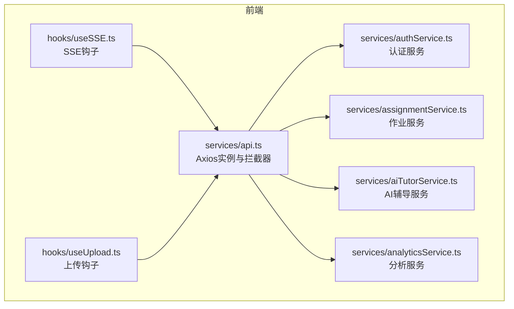
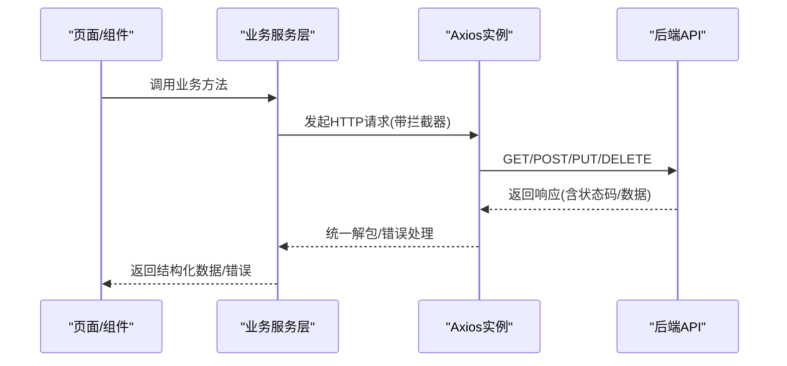
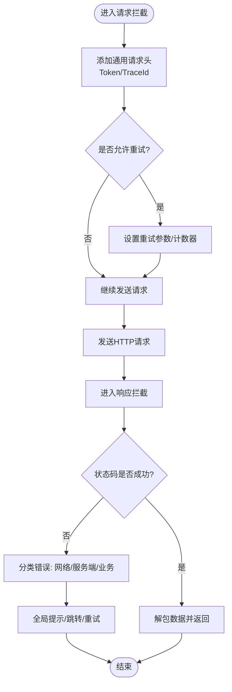
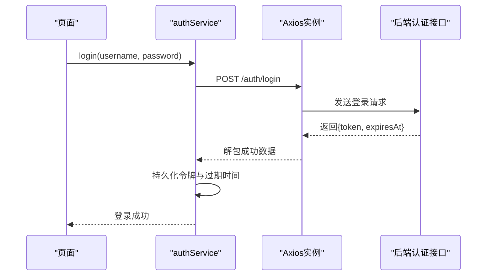
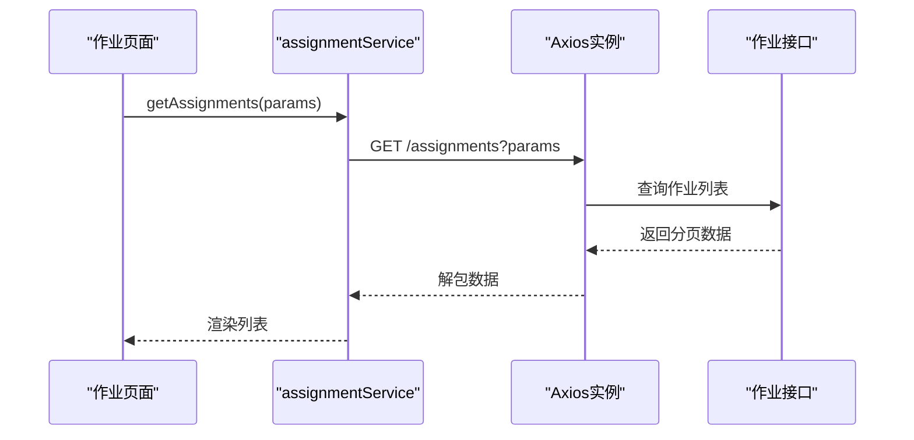
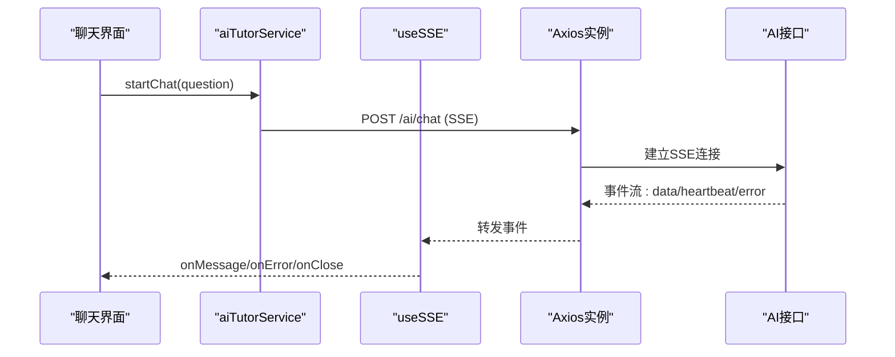
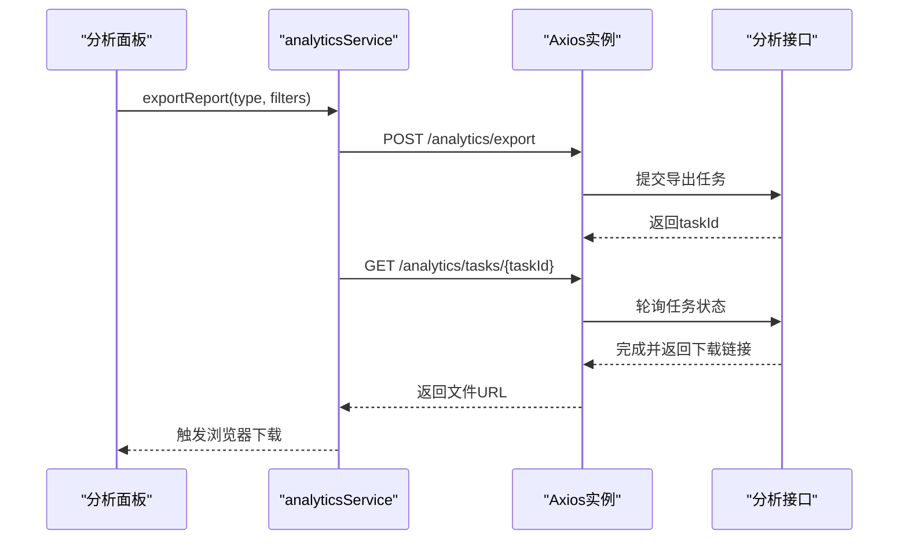
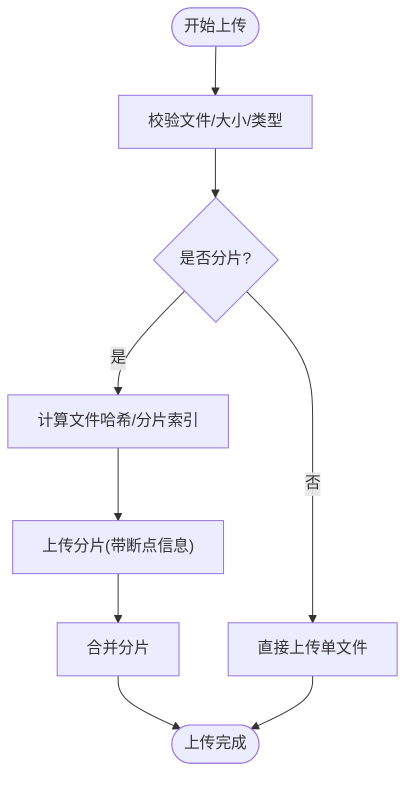
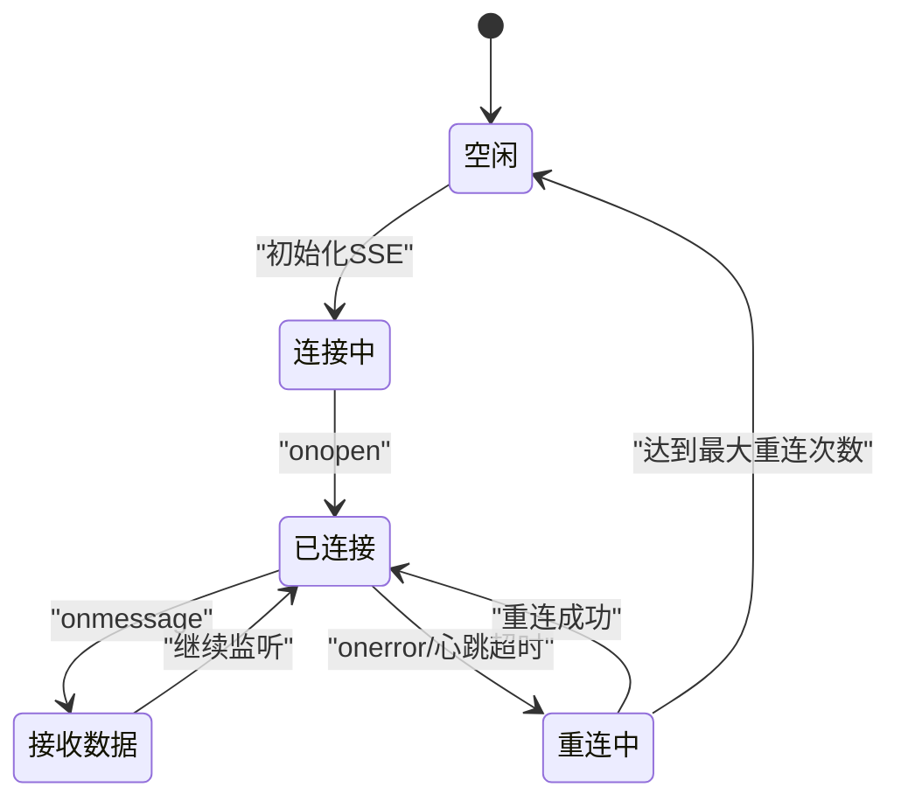
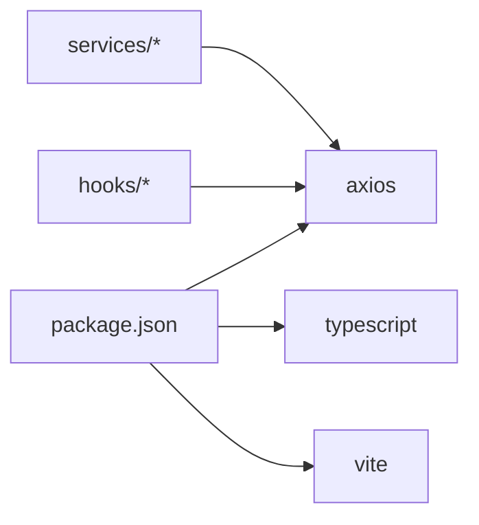

# API服务集成

<cite>
**本文引用的文件**   
- [frontend/src/services/api.ts](file://frontend/src/services/api.ts)
- [frontend/src/services/authService.ts](file://frontend/src/services/authService.ts)
- [frontend/src/services/assignmentService.ts](file://frontend/src/services/assignmentService.ts)
- [frontend/src/services/aiTutorService.ts](file://frontend/src/services/aiTutorService.ts)
- [frontend/src/services/analyticsService.ts](file://frontend/src/services/analyticsService.ts)
- [frontend/src/hooks/useSSE.ts](file://frontend/src/hooks/useSSE.ts)
- [frontend/src/hooks/useUpload.ts](file://frontend/src/hooks/useUpload.ts)
- [frontend/package.json](file://frontend/package.json)
</cite>

## 目录
1. [简介](#简介)
2. [项目结构](#项目结构)
3. [核心组件](#核心组件)
4. [架构总览](#架构总览)
5. [详细组件分析](#详细组件分析)
6. [依赖分析](#依赖分析)
7. [性能考虑](#性能考虑)
8. [故障排查指南](#故障排查指南)
9. [结论](#结论)
10. [附录](#附录)

## 简介
本文件面向AI助教系统前端，系统化梳理API集成方案与最佳实践。内容覆盖：
- Axios实例配置、请求拦截器设计、响应数据统一处理
- 业务服务层封装：认证服务（authService）、作业服务（assignmentService）、AI辅导服务（aiTutorService）、分析服务（analyticsService）
- RESTful API调用规范、错误处理机制、重试策略
- 文件上传下载处理、实时通信集成（SSE/WebSocket）
- API版本控制、接口文档生成、Mock数据开发方案

## 项目结构
前端采用“服务层”组织方式，将HTTP客户端、业务接口按模块拆分，便于维护与扩展。关键目录与职责：
- services：Axios实例与业务服务封装
- hooks：通用能力封装（如SSE、上传进度）
- components/pages：页面与组件消费服务层

图表来源
- [frontend/src/services/api.ts](file://frontend/src/services/api.ts)
- [frontend/src/services/authService.ts](file://frontend/src/services/authService.ts)
- [frontend/src/services/assignmentService.ts](file://frontend/src/services/assignmentService.ts)
- [frontend/src/services/aiTutorService.ts](file://frontend/src/services/aiTutorService.ts)
- [frontend/src/services/analyticsService.ts](file://frontend/src/services/analyticsService.ts)
- [frontend/src/hooks/useSSE.ts](file://frontend/src/hooks/useSSE.ts)
- [frontend/src/hooks/useUpload.ts](file://frontend/src/hooks/useUpload.ts)

章节来源
- [frontend/src/services/api.ts](file://frontend/src/services/api.ts)
- [frontend/src/services/authService.ts](file://frontend/src/services/authService.ts)
- [frontend/src/services/assignmentService.ts](file://frontend/src/services/assignmentService.ts)
- [frontend/src/services/aiTutorService.ts](file://frontend/src/services/aiTutorService.ts)
- [frontend/src/services/analyticsService.ts](file://frontend/src/services/analyticsService.ts)
- [frontend/src/hooks/useSSE.ts](file://frontend/src/hooks/useSSE.ts)
- [frontend/src/hooks/useUpload.ts](file://frontend/src/hooks/useUpload.ts)

## 核心组件
本节聚焦Axios实例与拦截器的设计要点，以及各业务服务的职责边界。

- Axios实例与拦截器
  - 基础URL与超时：集中管理后端地址、默认超时时间
  - 请求头：自动注入鉴权令牌、语言/时区等通用头
  - 请求拦截：统一携带Token、防重复提交、请求去抖/节流（可选）
  - 响应拦截：统一解包成功数据、标准化错误对象、全局提示
  - 错误分类：网络异常、服务端错误码、业务校验失败
  - 重试策略：针对幂等GET请求或可恢复错误的指数退避重试
  - 取消与竞态：基于AbortController的并发控制与取消
  - 日志与埋点：记录请求耗时、关键指标上报（可选）

- 业务服务层
  - authService：登录、注册、刷新令牌、权限校验
  - assignmentService：作业列表、详情、提交、批改结果查询
  - aiTutorService：AI对话、题目解析、个性化建议
  - analyticsService：学习分析、统计报表、导出

章节来源
- [frontend/src/services/api.ts](file://frontend/src/services/api.ts)
- [frontend/src/services/authService.ts](file://frontend/src/services/authService.ts)
- [frontend/src/services/assignmentService.ts](file://frontend/src/services/assignmentService.ts)
- [frontend/src/services/aiTutorService.ts](file://frontend/src/services/aiTutorService.ts)
- [frontend/src/services/analyticsService.ts](file://frontend/src/services/analyticsService.ts)

## 架构总览
下图展示前端服务层与后端REST/SSE接口的交互关系。

图表来源
- [frontend/src/services/api.ts](file://frontend/src/services/api.ts)
- [frontend/src/services/authService.ts](file://frontend/src/services/authService.ts)
- [frontend/src/services/assignmentService.ts](file://frontend/src/services/assignmentService.ts)
- [frontend/src/services/aiTutorService.ts](file://frontend/src/services/aiTutorService.ts)
- [frontend/src/services/analyticsService.ts](file://frontend/src/services/analyticsService.ts)

## 详细组件分析

### Axios实例与拦截器（api.ts）
- 职责
  - 创建并导出Axios实例
  - 配置基础URL、超时、Content-Type等
  - 实现请求/响应拦截器
  - 提供统一的错误处理与重试工具
- 关键点
  - 请求拦截：附加Authorization、TraceId、请求ID
  - 响应拦截：根据状态码分支处理；对401触发刷新流程；对可重试错误执行指数退避
  - 取消控制：为长耗时或频繁切换的请求提供AbortController支持
  - 类型安全：TS泛型约束请求/响应体结构

图表来源
- [frontend/src/services/api.ts](file://frontend/src/services/api.ts)

章节来源
- [frontend/src/services/api.ts](file://frontend/src/services/api.ts)

### 认证服务（authService.ts）
- 职责
  - 用户登录、注册、退出
  - 访问令牌获取与刷新
  - 登录态持久化与守卫
- 典型流程
  - 登录成功后保存令牌与过期时间
  - 401时尝试刷新令牌，失败则清理会话并跳转登录页
  - 提供isAuthenticated、getRole等便捷方法

图表来源
- [frontend/src/services/authService.ts](file://frontend/src/services/authService.ts)
- [frontend/src/services/api.ts](file://frontend/src/services/api.ts)

章节来源
- [frontend/src/services/authService.ts](file://frontend/src/services/authService.ts)

### 作业服务（assignmentService.ts）
- 职责
  - 作业列表查询、分页、筛选
  - 作业详情、提交、重交
  - 批改结果与反馈获取
- 注意事项
  - 大文件提交使用分片/断点续传（结合useUpload）
  - 批量操作需保证幂等性
  - 列表接口支持缓存与失效策略

图表来源
- [frontend/src/services/assignmentService.ts](file://frontend/src/services/assignmentService.ts)
- [frontend/src/services/api.ts](file://frontend/src/services/api.ts)

章节来源
- [frontend/src/services/assignmentService.ts](file://frontend/src/services/assignmentService.ts)

### AI辅导服务（aiTutorService.ts）
- 职责
  - 发起AI对话、获取题目解析与建议
  - 流式输出（SSE）集成
  - 上下文管理与历史会话
- 实时通信
  - 通过SSE接收增量文本片段
  - 连接建立、心跳保活、断线重连
  - 错误与中断处理

图表来源
- [frontend/src/services/aiTutorService.ts](file://frontend/src/services/aiTutorService.ts)
- [frontend/src/hooks/useSSE.ts](file://frontend/src/hooks/useSSE.ts)
- [frontend/src/services/api.ts](file://frontend/src/services/api.ts)

章节来源
- [frontend/src/services/aiTutorService.ts](file://frontend/src/services/aiTutorService.ts)
- [frontend/src/hooks/useSSE.ts](file://frontend/src/hooks/useSSE.ts)

### 分析服务（analyticsService.ts）
- 职责
  - 学习分析数据聚合与可视化
  - 统计报表导出（Excel/PDF）
  - 定时任务结果查询（异步）
- 注意事项
  - 大数据量导出采用异步任务+轮询/回调
  - 导出文件下载遵循统一错误处理

图表来源
- [frontend/src/services/analyticsService.ts](file://frontend/src/services/analyticsService.ts)
- [frontend/src/services/api.ts](file://frontend/src/services/api.ts)

章节来源
- [frontend/src/services/analyticsService.ts](file://frontend/src/services/analyticsService.ts)

### 文件上传与下载（useUpload.ts）
- 职责
  - 封装分片上传、断点续传、进度回调
  - 统一错误处理与重试
  - 兼容多端浏览器差异
- 关键点
  - 使用FormData传输二进制
  - 上传前计算哈希用于断点续传
  - 大文件分片合并与失败重试

图表来源
- [frontend/src/hooks/useUpload.ts](file://frontend/src/hooks/useUpload.ts)
- [frontend/src/services/api.ts](file://frontend/src/services/api.ts)

章节来源
- [frontend/src/hooks/useUpload.ts](file://frontend/src/hooks/useUpload.ts)

### 实时通信集成（useSSE.ts）
- 职责
  - 封装EventSource/SSE连接生命周期
  - 自动重连、心跳检测、错误上报
  - 提供onMessage/onError/onClose回调
- 适用场景
  - AI对话流式输出
  - 任务进度推送
  - 实时通知

图表来源
- [frontend/src/hooks/useSSE.ts](file://frontend/src/hooks/useSSE.ts)

章节来源
- [frontend/src/hooks/useSSE.ts](file://frontend/src/hooks/useSSE.ts)

## 依赖分析
- 运行时依赖
  - axios：HTTP客户端
  - eventsource或原生EventSource：SSE
  - 其他：可选的加密/压缩库（按需）
- 构建期依赖
  - TypeScript、Vite、ESLint、Prettier等

图表来源
- [frontend/package.json](file://frontend/package.json)

章节来源
- [frontend/package.json](file://frontend/package.json)

## 性能考虑
- 请求优化
  - 合理设置超时与重试上限，避免雪崩
  - 列表接口启用内存缓存与失效策略
  - 使用AbortController取消过时请求
- 传输优化
  - 开启Gzip/Brotli（后端配合）
  - 图片/文件走CDN
  - 大文件分片上传与断点续传
- 渲染优化
  - 流式输出逐步渲染，减少首屏等待
  - 虚拟列表渲染大量数据
- 监控与观测
  - 记录请求耗时、错误率、重试次数
  - 关键路径埋点与告警

[本节为通用指导，不直接分析具体文件]

## 故障排查指南
- 常见问题定位
  - 401未授权：检查Token是否存在且未过期；确认刷新逻辑是否生效
  - 跨域问题：核对CORS配置与请求头白名单
  - 上传失败：检查分片大小、哈希一致性、合并接口状态
  - SSE断开：查看心跳间隔、重连次数、网络波动
- 调试技巧
  - 在请求拦截器打印TraceId与请求体摘要
  - 在响应拦截器记录状态码与错误堆栈
  - 使用浏览器Network面板过滤特定域名
- 快速修复清单
  - 确保所有受保护接口携带Authorization头
  - 对幂等请求启用重试，非幂等请求禁用自动重试
  - 为大文件上传增加进度与失败重试提示

章节来源
- [frontend/src/services/api.ts](file://frontend/src/services/api.ts)
- [frontend/src/hooks/useSSE.ts](file://frontend/src/hooks/useSSE.ts)
- [frontend/src/hooks/useUpload.ts](file://frontend/src/hooks/useUpload.ts)

## 结论
通过统一的Axios实例与拦截器、清晰的服务层划分、完善的错误与重试策略，以及SSE/上传能力的封装，前端API集成具备高内聚、低耦合、易扩展的特点。建议在后续迭代中持续完善接口版本控制、文档自动化与Mock方案，以提升团队协作效率与交付质量。

[本节为总结性内容，不直接分析具体文件]

## 附录

### RESTful API调用规范
- 资源命名：名词复数形式，层级清晰
- HTTP方法：GET/POST/PUT/PATCH/DELETE语义明确
- 状态码：2xx成功，4xx客户端错误，5xx服务端错误
- 请求体：JSON为主，文件上传使用multipart/form-data
- 响应体：统一包装{code, message, data}
- 分页：page、pageSize、total字段约定
- 排序与筛选：sort、filter、order等标准参数

[本节为通用规范，不直接分析具体文件]

### 错误处理机制
- 网络错误：超时、DNS解析失败、网络不可用
- 服务端错误：根据code/message进行差异化处理
- 业务校验错误：表单级提示与字段级错误映射
- 全局错误：Toast/Modal提示、路由跳转、日志上报

章节来源
- [frontend/src/services/api.ts](file://frontend/src/services/api.ts)

### 重试策略
- 适用场景：幂等GET、可恢复的网络抖动
- 算法：指数退避+抖动，限制最大重试次数
- 取消：用户主动取消或页面卸载时终止重试

章节来源
- [frontend/src/services/api.ts](file://frontend/src/services/api.ts)

### 文件上传下载处理
- 上传：分片、断点续传、进度回调、失败重试
- 下载：直链下载、Blob流式下载、文件名与MIME处理
- 安全：签名URL、防盗链、大小与类型校验

章节来源
- [frontend/src/hooks/useUpload.ts](file://frontend/src/hooks/useUpload.ts)
- [frontend/src/services/api.ts](file://frontend/src/services/api.ts)

### 实时通信集成（SSE/WebSocket）
- SSE：适合单向流式输出（AI对话、任务进度）
- WebSocket：适合双向实时通信（在线协作、即时消息）
- 连接管理：心跳、重连、错误上报、优雅关闭

章节来源
- [frontend/src/hooks/useSSE.ts](file://frontend/src/hooks/useSSE.ts)

### API版本控制
- URL版本：/api/v1/...
- Header版本：X-API-Version
- 兼容性：向后兼容变更、废弃标记与迁移指引

[本节为通用方案，不直接分析具体文件]

### 接口文档生成
- OpenAPI/Swagger：自动生成前后端契约
- 前端SDK：从OpenAPI生成类型与服务类
- 文档站点：在线浏览与在线调试

[本节为通用方案，不直接分析具体文件]

### Mock数据开发方案
- 本地Mock：基于Vite插件或msw
- 云端Mock：独立Mock服务与数据工厂
- 联调策略：先契约后实现，保持前后端并行开发

[本节为通用方案，不直接分析具体文件]