# 作业服务

<cite>
**本文引用的文件**   
- [backend/app/api/v1/assignments.py](file://backend/app/api/v1/assignments.py)
- [backend/app/models/assignment.py](file://backend/app/models/assignment.py)
- [backend/app/schemas/assignment.py](file://backend/app/schemas/assignment.py)
- [backend/app/services/file_upload.py](file://backend/app/services/file_upload.py)
- [backend/app/services/pdf_renderer.py](file://backend/app/services/pdf_renderer.py)
- [backend/app/tasks/celery_app.py](file://backend/app/tasks/celery_app.py)
- [backend/app/tasks/analysis_tasks.py](file://backend/app/tasks/analysis_tasks.py)
- [backend/app/core/deps.py](file://backend/app/core/deps.py)
- [backend/app/db/session.py](file://backend/app/db/session.py)
- [frontend/src/pages/AssignmentManagement/UploadAssignment/index.tsx](file://frontend/src/pages/AssignmentManagement/UploadAssignment/index.tsx)
- [frontend/src/hooks/useUpload.ts](file://frontend/src/hooks/useUpload.ts)
- [frontend/src/services/assignmentService.ts](file://frontend/src/services/assignmentService.ts)
- [frontend/src/utils/exportExcel.ts](file://frontend/src/utils/exportExcel.ts)
</cite>

## 目录
1. [简介](#简介)
2. [项目结构](#项目结构)
3. [核心组件](#核心组件)
4. [架构总览](#架构总览)
5. [详细组件分析](#详细组件分析)
6. [依赖关系分析](#依赖关系分析)
7. [性能考虑](#性能考虑)
8. [故障排查指南](#故障排查指南)
9. [结论](#结论)
10. [附录](#附录)

## 简介
本文件面向“作业服务”的后端与前端实现，系统性阐述以下能力：
- 作业CRUD操作、批量上传下载、文件处理机制
- 作业状态管理、批改结果获取、成绩统计分析
- 作业模板管理、题型支持、答案格式验证
- 大文件分片上传、进度跟踪、断点续传
- 作业导出、Excel数据处理、打印格式生成

文档以代码级为依据，结合架构图、时序图、流程图帮助读者快速理解系统设计与关键流程。

## 项目结构
后端采用分层架构：API层（路由）、模型层（ORM）、Schema层（请求/响应校验）、服务层（业务逻辑）、任务层（异步处理），以及数据库会话与依赖注入。前端提供作业上传、统计面板、导出等交互能力。

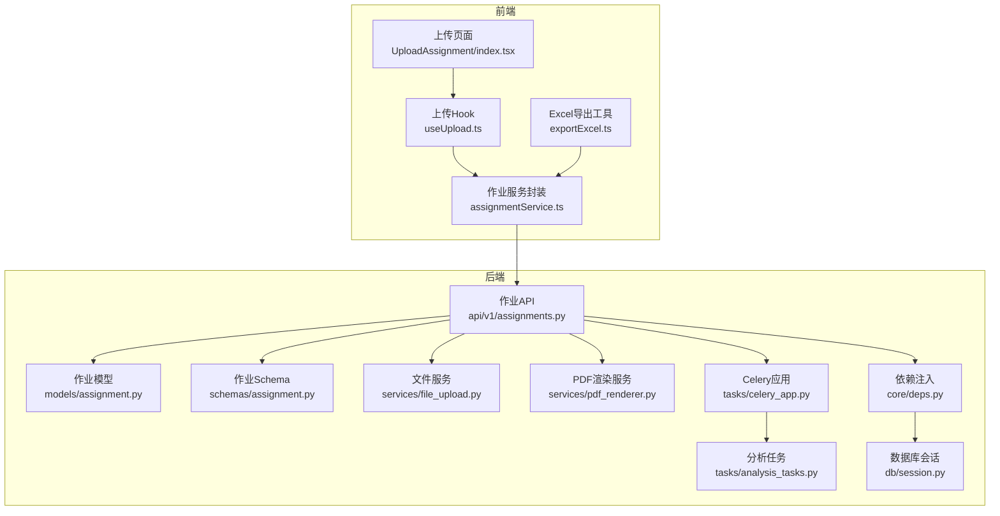

图表来源
- [backend/app/api/v1/assignments.py](file://backend/app/api/v1/assignments.py)
- [backend/app/models/assignment.py](file://backend/app/models/assignment.py)
- [backend/app/schemas/assignment.py](file://backend/app/schemas/assignment.py)
- [backend/app/services/file_upload.py](file://backend/app/services/file_upload.py)
- [backend/app/services/pdf_renderer.py](file://backend/app/services/pdf_renderer.py)
- [backend/app/tasks/celery_app.py](file://backend/app/tasks/celery_app.py)
- [backend/app/tasks/analysis_tasks.py](file://backend/app/tasks/analysis_tasks.py)
- [backend/app/core/deps.py](file://backend/app/core/deps.py)
- [backend/app/db/session.py](file://backend/app/db/session.py)
- [frontend/src/pages/AssignmentManagement/UploadAssignment/index.tsx](file://frontend/src/pages/AssignmentManagement/UploadAssignment/index.tsx)
- [frontend/src/hooks/useUpload.ts](file://frontend/src/hooks/useUpload.ts)
- [frontend/src/services/assignmentService.ts](file://frontend/src/services/assignmentService.ts)
- [frontend/src/utils/exportExcel.ts](file://frontend/src/utils/exportExcel.ts)

章节来源
- [backend/app/api/v1/assignments.py](file://backend/app/api/v1/assignments.py)
- [backend/app/models/assignment.py](file://backend/app/models/assignment.py)
- [backend/app/schemas/assignment.py](file://backend/app/schemas/assignment.py)
- [backend/app/services/file_upload.py](file://backend/app/services/file_upload.py)
- [backend/app/services/pdf_renderer.py](file://backend/app/services/pdf_renderer.py)
- [backend/app/tasks/celery_app.py](file://backend/app/tasks/celery_app.py)
- [backend/app/tasks/analysis_tasks.py](file://backend/app/tasks/analysis_tasks.py)
- [backend/app/core/deps.py](file://backend/app/core/deps.py)
- [backend/app/db/session.py](file://backend/app/db/session.py)
- [frontend/src/pages/AssignmentManagement/UploadAssignment/index.tsx](file://frontend/src/pages/AssignmentManagement/UploadAssignment/index.tsx)
- [frontend/src/hooks/useUpload.ts](file://frontend/src/hooks/useUpload.ts)
- [frontend/src/services/assignmentService.ts](file://frontend/src/services/assignmentService.ts)
- [frontend/src/utils/exportExcel.ts](file://frontend/src/utils/exportExcel.ts)

## 核心组件
- 作业API层：提供作业的创建、查询、更新、删除、批量导入/导出、分片上传、进度查询等接口。
- 数据模型与Schema：定义作业实体字段、枚举（如状态、题型）及请求/响应结构，负责数据校验。
- 文件服务：处理分片上传、合并、校验、存储路径管理、临时文件清理。
- PDF渲染服务：将作业或批阅结果渲染为可打印的PDF。
- Celery任务：执行耗时任务（如批量分析、统计聚合、PDF生成）。
- 依赖注入与会话：统一数据库连接、事务边界、资源释放。
- 前端上传Hook与服务：封装分片上传、进度上报、断点续传、错误重试；导出Excel工具用于本地生成报表。

章节来源
- [backend/app/api/v1/assignments.py](file://backend/app/api/v1/assignments.py)
- [backend/app/models/assignment.py](file://backend/app/models/assignment.py)
- [backend/app/schemas/assignment.py](file://backend/app/schemas/assignment.py)
- [backend/app/services/file_upload.py](file://backend/app/services/file_upload.py)
- [backend/app/services/pdf_renderer.py](file://backend/app/services/pdf_renderer.py)
- [backend/app/tasks/celery_app.py](file://backend/app/tasks/celery_app.py)
- [backend/app/tasks/analysis_tasks.py](file://backend/app/tasks/analysis_tasks.py)
- [backend/app/core/deps.py](file://backend/app/core/deps.py)
- [backend/app/db/session.py](file://backend/app/db/session.py)
- [frontend/src/hooks/useUpload.ts](file://frontend/src/hooks/useUpload.ts)
- [frontend/src/services/assignmentService.ts](file://frontend/src/services/assignmentService.ts)
- [frontend/src/utils/exportExcel.ts](file://frontend/src/utils/exportExcel.ts)

## 架构总览
作业服务整体遵循“前后端分离 + 异步任务”的架构模式。前端通过REST接口与后端交互，大文件上传采用分片策略并配合进度上报；后端在需要时调度Celery任务完成重计算、统计与导出。

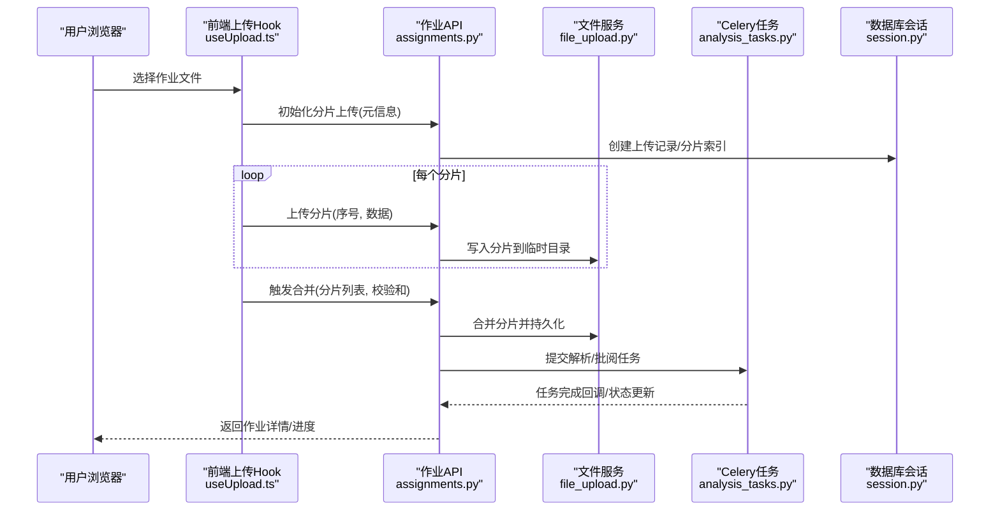

图表来源
- [frontend/src/hooks/useUpload.ts](file://frontend/src/hooks/useUpload.ts)
- [backend/app/api/v1/assignments.py](file://backend/app/api/v1/assignments.py)
- [backend/app/services/file_upload.py](file://backend/app/services/file_upload.py)
- [backend/app/tasks/analysis_tasks.py](file://backend/app/tasks/analysis_tasks.py)
- [backend/app/db/session.py](file://backend/app/db/session.py)

## 详细组件分析

### 作业CRUD与模板管理
- 作业实体包含基础信息、模板关联、题型集合、状态机字段等；Schema对必填项、取值范围进行约束。
- 模板管理通常与作业模型解耦，通过外键或映射表建立“模板-题型-规则”的关系，便于复用与扩展。
- 常见操作：
  - 创建作业：校验模板与题型配置，初始化默认状态。
  - 查询作业：支持按班级、时间、状态过滤，分页返回。
  - 更新作业：变更模板、题型、截止时间等。
  - 删除作业：软删除或物理删除，附带权限校验。

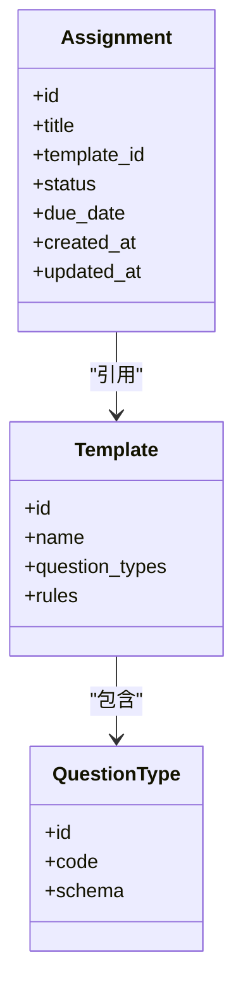

图表来源
- [backend/app/models/assignment.py](file://backend/app/models/assignment.py)
- [backend/app/schemas/assignment.py](file://backend/app/schemas/assignment.py)

章节来源
- [backend/app/models/assignment.py](file://backend/app/models/assignment.py)
- [backend/app/schemas/assignment.py](file://backend/app/schemas/assignment.py)

### 批量上传下载与文件处理机制
- 批量上传：前端按固定大小切分文件，逐个上传分片；服务端落盘至临时目录，记录分片索引。
- 合并与校验：客户端发送合并请求携带分片清单与校验和；服务端校验完整性后合并为完整文件。
- 下载：服务端读取已持久化的作业文件或打包后的压缩包，流式返回。

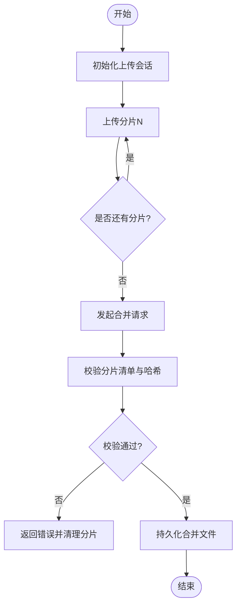

图表来源
- [backend/app/services/file_upload.py](file://backend/app/services/file_upload.py)
- [frontend/src/hooks/useUpload.ts](file://frontend/src/hooks/useUpload.ts)

章节来源
- [backend/app/services/file_upload.py](file://backend/app/services/file_upload.py)
- [frontend/src/hooks/useUpload.ts](file://frontend/src/hooks/useUpload.ts)

### 大文件分片上传、进度跟踪、断点续传
- 分片上传：前端根据文件大小动态决定分片大小，并发上传以提升吞吐。
- 进度跟踪：每上传一个分片即上报进度；服务端维护上传会话与分片集合，供前端轮询或SSE推送。
- 断点续传：客户端缓存已上传分片清单；重新上传前向服务端查询已存在分片，跳过重复上传。

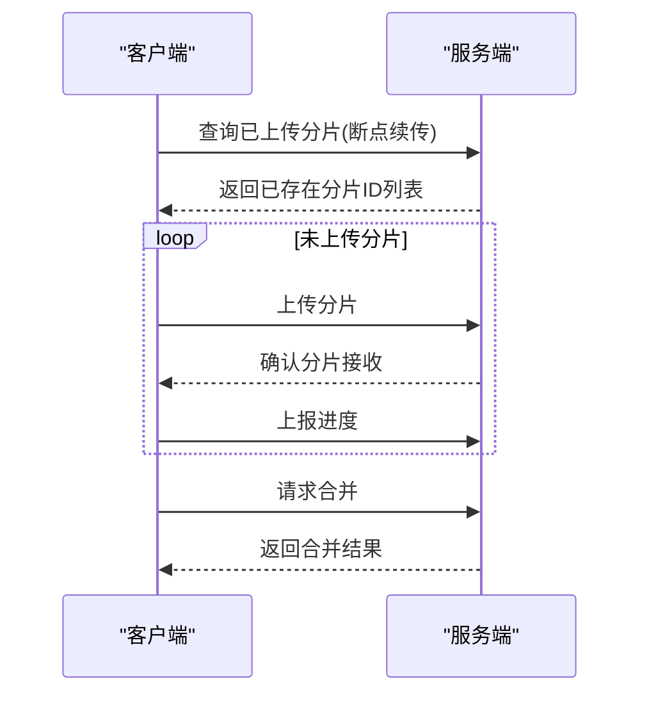

图表来源
- [frontend/src/hooks/useUpload.ts](file://frontend/src/hooks/useUpload.ts)
- [backend/app/services/file_upload.py](file://backend/app/services/file_upload.py)

章节来源
- [frontend/src/hooks/useUpload.ts](file://frontend/src/hooks/useUpload.ts)
- [backend/app/services/file_upload.py](file://backend/app/services/file_upload.py)

### 作业状态管理与批改结果获取
- 状态机：作业从“草稿/待提交/进行中/已截止/已批阅/归档”流转，受时间与权限控制。
- 批改结果：支持人工与AI批阅；结果包含分数、评语、知识点掌握度等，可通过作业详情接口获取。
- 进度查询：针对批量批阅与分析任务，提供任务ID与状态查询接口。

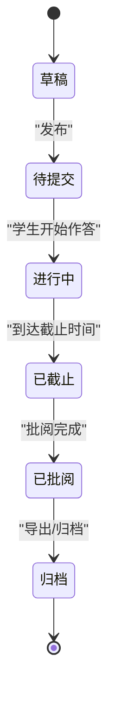

图表来源
- [backend/app/models/assignment.py](file://backend/app/models/assignment.py)
- [backend/app/api/v1/assignments.py](file://backend/app/api/v1/assignments.py)

章节来源
- [backend/app/models/assignment.py](file://backend/app/models/assignment.py)
- [backend/app/api/v1/assignments.py](file://backend/app/api/v1/assignments.py)

### 成绩统计分析
- 指标维度：平均分、最高/最低分、分数段分布、知识点正确率、题目难度区分度等。
- 计算方式：基于已批阅的作业结果聚合，支持按班级、题型、知识点筛选。
- 异步计算：大数据量场景下通过Celery任务离线计算，完成后通知前端刷新。

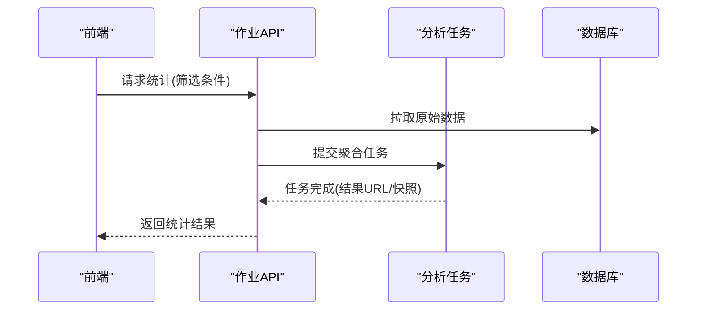

图表来源
- [backend/app/tasks/analysis_tasks.py](file://backend/app/tasks/analysis_tasks.py)
- [backend/app/api/v1/assignments.py](file://backend/app/api/v1/assignments.py)
- [backend/app/db/session.py](file://backend/app/db/session.py)

章节来源
- [backend/app/tasks/analysis_tasks.py](file://backend/app/tasks/analysis_tasks.py)
- [backend/app/api/v1/assignments.py](file://backend/app/api/v1/assignments.py)
- [backend/app/db/session.py](file://backend/app/db/session.py)

### 作业模板管理、题型支持与答案格式验证
- 模板：定义作业的结构（题型顺序、分值、评分规则、提示语等），支持版本化管理。
- 题型：选择题、填空题、简答题、作文题等，每种题型对应不同的输入结构与校验规则。
- 答案验证：基于Schema对答案进行类型、长度、正则、范围等校验，失败则拒绝提交。

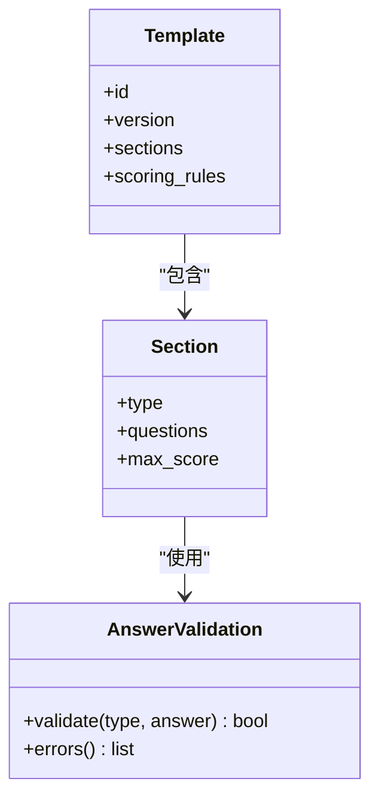

图表来源
- [backend/app/schemas/assignment.py](file://backend/app/schemas/assignment.py)
- [backend/app/models/assignment.py](file://backend/app/models/assignment.py)

章节来源
- [backend/app/schemas/assignment.py](file://backend/app/schemas/assignment.py)
- [backend/app/models/assignment.py](file://backend/app/models/assignment.py)

### 作业导出、Excel数据处理、打印格式生成
- Excel导出：后端生成结构化数据，前端使用工具库生成xlsx文件，支持多Sheet与样式。
- PDF打印：将作业详情、批阅结果、成绩单渲染为PDF，适配A4纸张与页眉页脚。
- 数据清洗：导出前进行空值填充、单位转换、排序与去重。

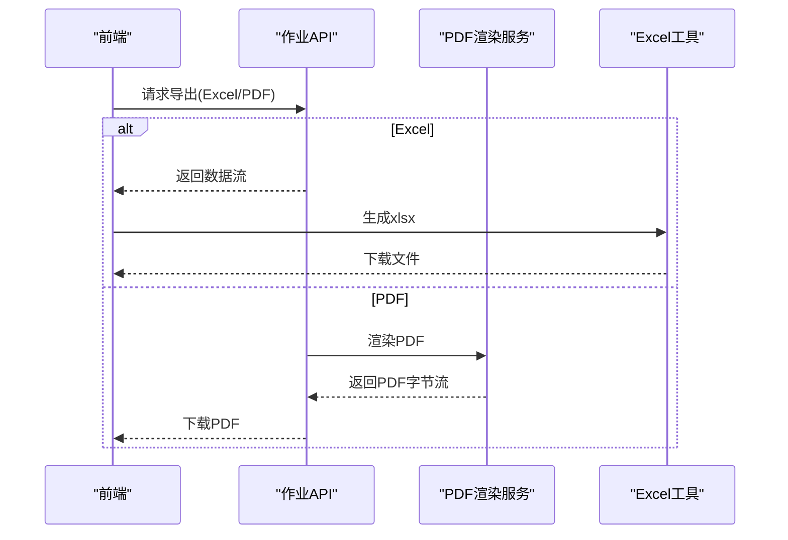

图表来源
- [backend/app/services/pdf_renderer.py](file://backend/app/services/pdf_renderer.py)
- [frontend/src/utils/exportExcel.ts](file://frontend/src/utils/exportExcel.ts)
- [backend/app/api/v1/assignments.py](file://backend/app/api/v1/assignments.py)

章节来源
- [backend/app/services/pdf_renderer.py](file://backend/app/services/pdf_renderer.py)
- [frontend/src/utils/exportExcel.ts](file://frontend/src/utils/exportExcel.ts)
- [backend/app/api/v1/assignments.py](file://backend/app/api/v1/assignments.py)

### 前端上传与作业服务封装
- 上传Hook：封装分片、并发、重试、进度上报、断点续传逻辑，提供统一的调用接口。
- 作业服务：集中管理作业相关API调用，包括CRUD、批量导入/导出、任务状态查询。
- 页面集成：上传页面调用Hook与服务，展示进度条与结果反馈。

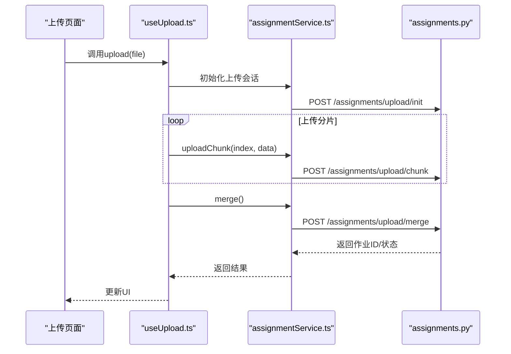

图表来源
- [frontend/src/pages/AssignmentManagement/UploadAssignment/index.tsx](file://frontend/src/pages/AssignmentManagement/UploadAssignment/index.tsx)
- [frontend/src/hooks/useUpload.ts](file://frontend/src/hooks/useUpload.ts)
- [frontend/src/services/assignmentService.ts](file://frontend/src/services/assignmentService.ts)
- [backend/app/api/v1/assignments.py](file://backend/app/api/v1/assignments.py)

章节来源
- [frontend/src/pages/AssignmentManagement/UploadAssignment/index.tsx](file://frontend/src/pages/AssignmentManagement/UploadAssignment/index.tsx)
- [frontend/src/hooks/useUpload.ts](file://frontend/src/hooks/useUpload.ts)
- [frontend/src/services/assignmentService.ts](file://frontend/src/services/assignmentService.ts)
- [backend/app/api/v1/assignments.py](file://backend/app/api/v1/assignments.py)

## 依赖关系分析
- API层依赖Schema与Model进行数据校验与持久化，同时调用文件服务与任务队列。
- 任务层依赖数据库会话与外部渲染服务，避免阻塞HTTP请求。
- 前端依赖上传Hook与服务封装，降低页面复杂度。

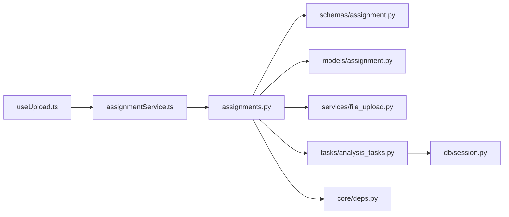

图表来源
- [backend/app/api/v1/assignments.py](file://backend/app/api/v1/assignments.py)
- [backend/app/schemas/assignment.py](file://backend/app/schemas/assignment.py)
- [backend/app/models/assignment.py](file://backend/app/models/assignment.py)
- [backend/app/services/file_upload.py](file://backend/app/services/file_upload.py)
- [backend/app/tasks/analysis_tasks.py](file://backend/app/tasks/analysis_tasks.py)
- [backend/app/db/session.py](file://backend/app/db/session.py)
- [backend/app/core/deps.py](file://backend/app/core/deps.py)
- [frontend/src/hooks/useUpload.ts](file://frontend/src/hooks/useUpload.ts)
- [frontend/src/services/assignmentService.ts](file://frontend/src/services/assignmentService.ts)

章节来源
- [backend/app/api/v1/assignments.py](file://backend/app/api/v1/assignments.py)
- [backend/app/schemas/assignment.py](file://backend/app/schemas/assignment.py)
- [backend/app/models/assignment.py](file://backend/app/models/assignment.py)
- [backend/app/services/file_upload.py](file://backend/app/services/file_upload.py)
- [backend/app/tasks/analysis_tasks.py](file://backend/app/tasks/analysis_tasks.py)
- [backend/app/db/session.py](file://backend/app/db/session.py)
- [backend/app/core/deps.py](file://backend/app/core/deps.py)
- [frontend/src/hooks/useUpload.ts](file://frontend/src/hooks/useUpload.ts)
- [frontend/src/services/assignmentService.ts](file://frontend/src/services/assignmentService.ts)

## 性能考虑
- 分片大小与并发数：根据网络与服务器负载动态调整，平衡吞吐与内存占用。
- 临时文件清理：合并成功后及时清理分片，避免磁盘膨胀。
- 异步任务：批量分析与导出走Celery，避免长连接超时。
- 数据库访问：分页与选择性字段加载，减少IO压力。
- 缓存策略：热点统计结果可短期缓存，降低重复计算。

[本节为通用指导，不直接分析具体文件]

## 故障排查指南
- 上传失败：检查分片编号连续性、哈希校验、临时目录权限；查看服务端日志定位缺失分片。
- 合并异常：核对分片清单与文件大小一致性；必要时回滚并清理残留分片。
- 任务卡住：检查Celery Worker状态、消息队列堆积情况；必要时重启Worker或清理死任务。
- 导出为空：确认数据源筛选条件与权限；检查渲染服务依赖是否安装。

章节来源
- [backend/app/services/file_upload.py](file://backend/app/services/file_upload.py)
- [backend/app/tasks/celery_app.py](file://backend/app/tasks/celery_app.py)
- [backend/app/tasks/analysis_tasks.py](file://backend/app/tasks/analysis_tasks.py)

## 结论
作业服务围绕“作业生命周期”构建，涵盖从模板配置、批量上传、分片续传到批阅统计与导出的全链路能力。通过前后端协作与异步任务，系统在易用性与可扩展性之间取得平衡。建议在生产环境完善监控告警、限流熔断与审计日志，进一步提升稳定性与可观测性。

[本节为总结性内容，不直接分析具体文件]

## 附录
- 术语说明：
  - 分片上传：将大文件切分为多个小块依次上传，提升可靠性与速度。
  - 断点续传：中断后可从上次位置继续上传，无需从头开始。
  - 作业状态机：描述作业在不同阶段的合法转移与约束。
- 参考实现路径：
  - 分片上传与合并：[backend/app/services/file_upload.py](file://backend/app/services/file_upload.py)、[frontend/src/hooks/useUpload.ts](file://frontend/src/hooks/useUpload.ts)
  - 作业API与Schema：[backend/app/api/v1/assignments.py](file://backend/app/api/v1/assignments.py)、[backend/app/schemas/assignment.py](file://backend/app/schemas/assignment.py)
  - 统计与导出：[backend/app/tasks/analysis_tasks.py](file://backend/app/tasks/analysis_tasks.py)、[frontend/src/utils/exportExcel.ts](file://frontend/src/utils/exportExcel.ts)