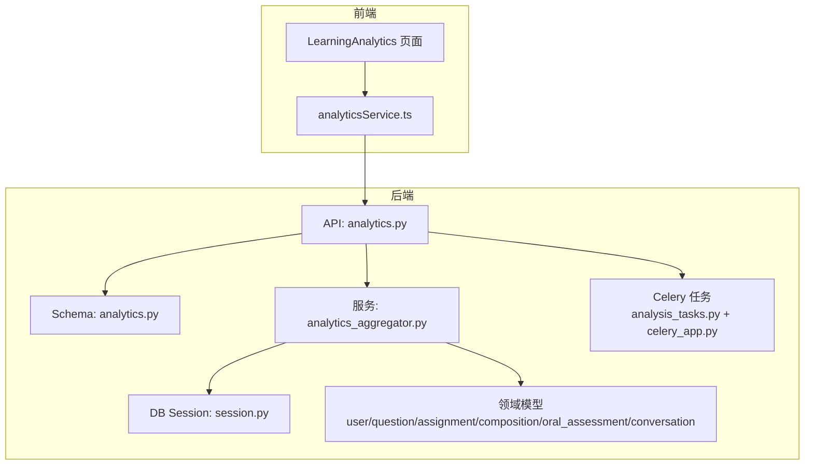
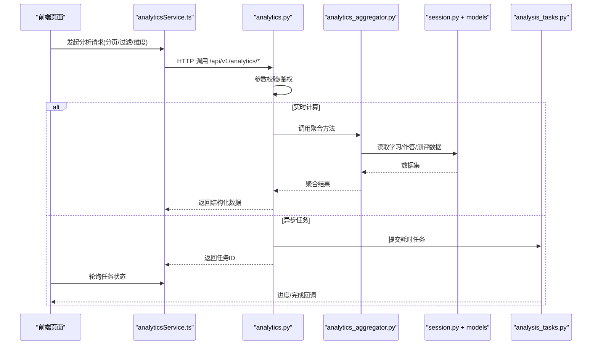
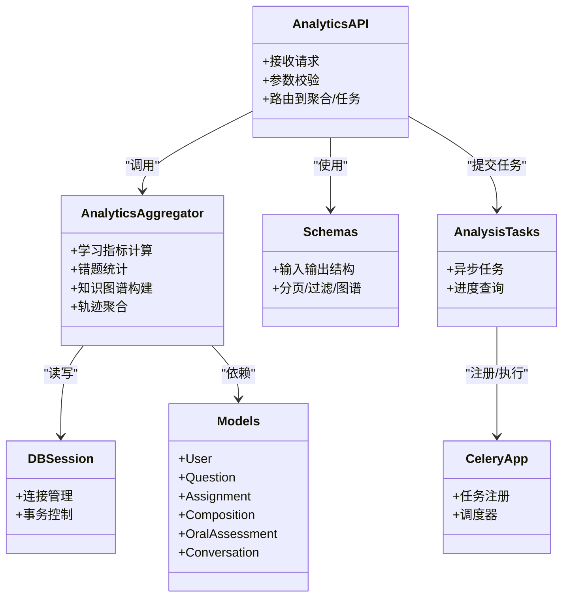

# 分析服务

<cite>
**本文引用的文件**   
- [backend/app/api/v1/analytics.py](file://backend/app/api/v1/analytics.py)
- [backend/app/services/analytics_aggregator.py](file://backend/app/services/analytics_aggregator.py)
- [backend/app/schemas/analytics.py](file://backend/app/schemas/analytics.py)
- [backend/app/tasks/analysis_tasks.py](file://backend/app/tasks/analysis_tasks.py)
- [backend/app/tasks/celery_app.py](file://backend/app/tasks/celery_app.py)
- [backend/app/models/user.py](file://backend/app/models/user.py)
- [backend/app/models/question.py](file://backend/app/models/question.py)
- [backend/app/models/assignment.py](file://backend/app/models/assignment.py)
- [backend/app/models/composition.py](file://backend/app/models/composition.py)
- [backend/app/models/oral_assessment.py](file://backend/app/models/oral_assessment.py)
- [backend/app/models/conversation.py](file://backend/app/models/conversation.py)
- [backend/app/db/session.py](file://backend/app/db/session.py)
- [frontend/src/pages/LearningAnalytics/index.tsx](file://frontend/src/pages/LearningAnalytics/index.tsx)
- [frontend/src/pages/LearningAnalytics/StudentDashboardPanel.tsx](file://frontend/src/pages/LearningAnalytics/StudentDashboardPanel.tsx)
- [frontend/src/pages/LearningAnalytics/HomeworkStatsPanel.tsx](file://frontend/src/pages/LearningAnalytics/HomeworkStatsPanel.tsx)
- [frontend/src/pages/LearningAnalytics/KnowledgeHeatmapPanel.tsx](file://frontend/src/pages/LearningAnalytics/KnowledgeHeatmapPanel.tsx)
- [frontend/src/services/analyticsService.ts](file://frontend/src/services/analyticsService.ts)
</cite>

## 目录
1. [简介](#简介)
2. [项目结构](#项目结构)
3. [核心组件](#核心组件)
4. [架构总览](#架构总览)
5. [详细组件分析](#详细组件分析)
6. [依赖关系分析](#依赖关系分析)
7. [性能考虑](#性能考虑)
8. [故障排查指南](#故障排查指南)
9. [结论](#结论)
10. [附录](#附录)

## 简介
本文件面向“分析服务”的完整技术文档，覆盖学习数据分析接口、统计图表数据获取、知识图谱构建、学生表现分析、错题统计、学习轨迹追踪、报告生成与数据导出、可视化数据格式、大数据量分页处理、异步任务查询、缓存策略优化、自定义分析维度、报表模板配置以及定时任务调度等主题。文档同时提供前后端交互流程、关键数据结构与复杂度说明，并给出可操作的排障建议与最佳实践。

## 项目结构
分析服务位于后端 API 层、领域模型层、聚合服务层与任务调度层之间，前端通过统一的服务封装调用分析接口，并在“学习分析”页面进行可视化展示。

图示来源
- [backend/app/api/v1/analytics.py](file://backend/app/api/v1/analytics.py)
- [backend/app/schemas/analytics.py](file://backend/app/schemas/analytics.py)
- [backend/app/services/analytics_aggregator.py](file://backend/app/services/analytics_aggregator.py)
- [backend/app/db/session.py](file://backend/app/db/session.py)
- [backend/app/models/user.py](file://backend/app/models/user.py)
- [backend/app/models/question.py](file://backend/app/models/question.py)
- [backend/app/models/assignment.py](file://backend/app/models/assignment.py)
- [backend/app/models/composition.py](file://backend/app/models/composition.py)
- [backend/app/models/oral_assessment.py](file://backend/app/models/oral_assessment.py)
- [backend/app/models/conversation.py](file://backend/app/models/conversation.py)
- [backend/app/tasks/analysis_tasks.py](file://backend/app/tasks/analysis_tasks.py)
- [backend/app/tasks/celery_app.py](file://backend/app/tasks/celery_app.py)
- [frontend/src/pages/LearningAnalytics/index.tsx](file://frontend/src/pages/LearningAnalytics/index.tsx)
- [frontend/src/services/analyticsService.ts](file://frontend/src/services/analyticsService.ts)

章节来源
- [backend/app/api/v1/analytics.py](file://backend/app/api/v1/analytics.py)
- [backend/app/services/analytics_aggregator.py](file://backend/app/services/analytics_aggregator.py)
- [backend/app/schemas/analytics.py](file://backend/app/schemas/analytics.py)
- [backend/app/tasks/analysis_tasks.py](file://backend/app/tasks/analysis_tasks.py)
- [backend/app/tasks/celery_app.py](file://backend/app/tasks/celery_app.py)
- [backend/app/db/session.py](file://backend/app/db/session.py)
- [backend/app/models/user.py](file://backend/app/models/user.py)
- [backend/app/models/question.py](file://backend/app/models/question.py)
- [backend/app/models/assignment.py](file://backend/app/models/assignment.py)
- [backend/app/models/composition.py](file://backend/app/models/composition.py)
- [backend/app/models/oral_assessment.py](file://backend/app/models/oral_assessment.py)
- [backend/app/models/conversation.py](file://backend/app/models/conversation.py)
- [frontend/src/pages/LearningAnalytics/index.tsx](file://frontend/src/pages/LearningAnalytics/index.tsx)
- [frontend/src/services/analyticsService.ts](file://frontend/src/services/analyticsService.ts)

## 核心组件
- 分析 API 控制器：负责接收请求参数、校验、路由到聚合服务或异步任务，返回统一响应结构。
- 分析聚合服务：实现学习行为指标计算、错题统计、知识掌握度评估、学习轨迹聚合等核心逻辑。
- 分析数据模式（Schema）：定义输入输出结构，包括分页、过滤条件、图表数据项、知识图谱节点/边等。
- 异步任务：用于耗时分析任务的后台执行与进度查询。
- 数据库会话与模型：提供对学习者、题目、作业、作文、口语测评、对话记录等数据的访问。
- 前端分析页面与服务封装：提供学习仪表盘、作业统计、知识热力图、学生画像等可视化能力。

章节来源
- [backend/app/api/v1/analytics.py](file://backend/app/api/v1/analytics.py)
- [backend/app/services/analytics_aggregator.py](file://backend/app/services/analytics_aggregator.py)
- [backend/app/schemas/analytics.py](file://backend/app/schemas/analytics.py)
- [backend/app/tasks/analysis_tasks.py](file://backend/app/tasks/analysis_tasks.py)
- [backend/app/tasks/celery_app.py](file://backend/app/tasks/celery_app.py)
- [backend/app/db/session.py](file://backend/app/db/session.py)
- [backend/app/models/user.py](file://backend/app/models/user.py)
- [backend/app/models/question.py](file://backend/app/models/question.py)
- [backend/app/models/assignment.py](file://backend/app/models/assignment.py)
- [backend/app/models/composition.py](file://backend/app/models/composition.py)
- [backend/app/models/oral_assessment.py](file://backend/app/models/oral_assessment.py)
- [backend/app/models/conversation.py](file://backend/app/models/conversation.py)
- [frontend/src/pages/LearningAnalytics/index.tsx](file://frontend/src/pages/LearningAnalytics/index.tsx)
- [frontend/src/services/analyticsService.ts](file://frontend/src/services/analyticsService.ts)

## 架构总览
分析服务采用“API 控制器 -> 聚合服务 -> 数据模型”的分层架构，并通过 Celery 异步任务处理重计算场景；前端以统一的 analyticsService 调用后端接口，渲染学习分析相关面板。

图示来源
- [backend/app/api/v1/analytics.py](file://backend/app/api/v1/analytics.py)
- [backend/app/services/analytics_aggregator.py](file://backend/app/services/analytics_aggregator.py)
- [backend/app/db/session.py](file://backend/app/db/session.py)
- [backend/app/tasks/analysis_tasks.py](file://backend/app/tasks/analysis_tasks.py)
- [frontend/src/services/analyticsService.ts](file://frontend/src/services/analyticsService.ts)

## 详细组件分析

### 学习数据分析接口
- 功能范围
  - 学习概览：时间窗口内的学习时长、练习次数、正确率趋势。
  - 错题统计：按知识点/题型/难度分布的错误频次与错误类型。
  - 知识图谱：知识点节点与关联边，支持按掌握度着色与筛选。
  - 学习轨迹：按时间序列的学习事件（做题、测评、对话、上传等）。
  - 报告生成：汇总上述指标，支持导出为 Excel/PDF。
- 接口设计要点
  - 统一分页参数：page、page_size、sort_by、order。
  - 过滤条件：时间范围、用户/班级/年级、知识点标签、题型、难度。
  - 维度扩展：支持自定义维度键值对，便于后续扩展。
  - 响应结构：包含 data、meta（分页信息）、links（任务链接，若异步）。
- 典型调用流程
  - 前端根据面板需求构造查询参数，调用 analyticsService。
  - 后端在控制器中解析参数，选择同步或异步路径。
  - 聚合服务组合多模型数据，输出标准化图表数据。

章节来源
- [backend/app/api/v1/analytics.py](file://backend/app/api/v1/analytics.py)
- [backend/app/schemas/analytics.py](file://backend/app/schemas/analytics.py)
- [frontend/src/services/analyticsService.ts](file://frontend/src/services/analyticsService.ts)

### 统计图表数据获取
- 数据源
  - 作业与题目作答记录、作文评分、口语测评、对话交互日志。
- 聚合维度
  - 时间粒度：日/周/月；知识点维度；题型/难度维度；用户/班级维度。
- 输出格式
  - 折线图：时间序列指标（正确率、用时、题数）。
  - 柱状图：分类对比（知识点掌握度、题型得分）。
  - 饼图：比例分布（错误原因、题型占比）。
  - 热力图：知识点×时间的掌握强度矩阵。
- 性能优化
  - 预聚合表：针对高频维度建立物化视图或汇总表。
  - 索引优化：按时间、用户、知识点建立复合索引。
  - 增量更新：仅刷新变化区间的数据。

章节来源
- [backend/app/services/analytics_aggregator.py](file://backend/app/services/analytics_aggregator.py)
- [backend/app/models/assignment.py](file://backend/app/models/assignment.py)
- [backend/app/models/question.py](file://backend/app/models/question.py)
- [backend/app/models/composition.py](file://backend/app/models/composition.py)
- [backend/app/models/oral_assessment.py](file://backend/app/models/oral_assessment.py)
- [backend/app/models/conversation.py](file://backend/app/models/conversation.py)

### 知识图谱构建
- 节点与边
  - 节点：知识点、题型、能力维度、学生个体。
  - 边：知识点关联、前置/后继关系、学生掌握度权重。
- 构建流程
  - 从题目元数据抽取知识点标签。
  - 基于历史作答与测评结果计算掌握度。
  - 生成节点属性与边权重，输出可视化所需结构。
- 可视化适配
  - 节点大小映射掌握度，颜色映射薄弱点。
  - 边粗细映射关联强度或迁移概率。

章节来源
- [backend/app/services/analytics_aggregator.py](file://backend/app/services/analytics_aggregator.py)
- [backend/app/models/question.py](file://backend/app/models/question.py)
- [backend/app/models/user.py](file://backend/app/models/user.py)

### 学生表现分析
- 指标体系
  - 基础指标：答题总数、正确率、平均用时、波动性。
  - 进阶指标：知识点掌握曲线、易错点聚类、进步速率。
  - 多维对比：同班/同龄对比、目标达成度。
- 数据来源
  - 作业、题目、作文、口语测评、对话记录。
- 输出
  - 仪表盘卡片、趋势图、雷达图、对比条形图。

章节来源
- [backend/app/services/analytics_aggregator.py](file://backend/app/services/analytics_aggregator.py)
- [backend/app/models/assignment.py](file://backend/app/models/assignment.py)
- [backend/app/models/composition.py](file://backend/app/models/composition.py)
- [backend/app/models/oral_assessment.py](file://backend/app/models/oral_assessment.py)
- [backend/app/models/conversation.py](file://backend/app/models/conversation.py)

### 错题统计
- 统计维度
  - 按知识点、题型、难度、错误类型（概念不清、计算失误、审题偏差等）。
- 算法要点
  - 错误判定：基于答案比对与评分阈值。
  - 去重与归一：合并相似错误，避免重复计数。
  - 趋势分析：错误率随时间变化，定位改善拐点。
- 输出
  - 错误分布图、错题清单、推荐复习路径。

章节来源
- [backend/app/services/analytics_aggregator.py](file://backend/app/services/analytics_aggregator.py)
- [backend/app/models/question.py](file://backend/app/models/question.py)
- [backend/app/models/assignment.py](file://backend/app/models/assignment.py)

### 学习轨迹追踪
- 事件类型
  - 做题、提交、批改、讲解、对话、上传、测评。
- 时序聚合
  - 按用户/班级/时间段聚合事件流，生成轨迹序列。
- 洞察
  - 学习节奏、专注时段、干预时机识别。

章节来源
- [backend/app/models/conversation.py](file://backend/app/models/conversation.py)
- [backend/app/models/assignment.py](file://backend/app/models/assignment.py)
- [backend/app/models/composition.py](file://backend/app/models/composition.py)
- [backend/app/models/oral_assessment.py](file://backend/app/models/oral_assessment.py)

### 报告生成功能与数据导出
- 报告内容
  - 学习概览、错题分析、知识图谱摘要、个性化建议。
- 导出格式
  - Excel：明细与汇总双工作表。
  - PDF：固定模板排版，适合打印与归档。
- 触发方式
  - 同步导出小样本数据。
  - 异步任务生成大样本报告，完成后通知下载。

章节来源
- [backend/app/api/v1/analytics.py](file://backend/app/api/v1/analytics.py)
- [backend/app/tasks/analysis_tasks.py](file://backend/app/tasks/analysis_tasks.py)

### 可视化数据格式
- 通用结构
  - 列表型：{id, label, value, meta}
  - 时序型：{time, metrics: {key: value}}
  - 图谱型：{nodes: [{id, label, attrs}], edges: [{source, target, weight}]}
- 前端适配
  - 统一转换函数将后端结构映射至图表库所需格式。

章节来源
- [backend/app/schemas/analytics.py](file://backend/app/schemas/analytics.py)
- [frontend/src/pages/LearningAnalytics/index.tsx](file://frontend/src/pages/LearningAnalytics/index.tsx)

### 大数据量分页处理
- 后端策略
  - 游标分页或偏移分页，结合排序字段保证稳定性。
  - 限制最大 page_size，防止过大响应。
  - 按需加载：只返回必要字段，延迟加载详情。
- 前端策略
  - 滚动加载与虚拟列表，减少 DOM 压力。
  - 防抖搜索与节流刷新。

章节来源
- [backend/app/api/v1/analytics.py](file://backend/app/api/v1/analytics.py)
- [backend/app/schemas/analytics.py](file://backend/app/schemas/analytics.py)
- [frontend/src/pages/LearningAnalytics/index.tsx](file://frontend/src/pages/LearningAnalytics/index.tsx)

### 异步任务查询
- 任务生命周期
  - 提交任务 -> 返回任务ID -> 轮询状态 -> 获取结果。
- 进度反馈
  - 阶段划分：准备、计算、导出、完成。
  - 失败重试与错误码说明。
- 前端体验
  - 进度条与提示文案，超时与断线恢复。

章节来源
- [backend/app/tasks/analysis_tasks.py](file://backend/app/tasks/analysis_tasks.py)
- [backend/app/tasks/celery_app.py](file://backend/app/tasks/celery_app.py)
- [frontend/src/pages/LearningAnalytics/index.tsx](file://frontend/src/pages/LearningAnalytics/index.tsx)

### 缓存策略优化
- 缓存层级
  - 应用内内存缓存：热点聚合结果短 TTL。
  - 分布式缓存：跨实例共享，降低重复计算。
- 失效策略
  - 基于数据变更事件主动失效。
  - 时间片过期与惰性刷新。
- 命中监控
  - 命中率、延迟、内存占用指标上报。

章节来源
- [backend/app/services/analytics_aggregator.py](file://backend/app/services/analytics_aggregator.py)
- [backend/app/api/v1/analytics.py](file://backend/app/api/v1/analytics.py)

### 自定义分析维度
- 维度定义
  - 键值对形式，如 {subject: math, level: intermediate}。
  - 支持多级维度组合与动态筛选。
- 聚合扩展
  - 通过插件式维度处理器扩展新维度。
- 前端配置
  - 维度下拉与多选，联动图表刷新。

章节来源
- [backend/app/schemas/analytics.py](file://backend/app/schemas/analytics.py)
- [backend/app/services/analytics_aggregator.py](file://backend/app/services/analytics_aggregator.py)
- [frontend/src/pages/LearningAnalytics/index.tsx](file://frontend/src/pages/LearningAnalytics/index.tsx)

### 报表模板配置
- 模板要素
  - 标题、页眉页脚、图表占位、表格样式、导出格式。
- 配置方式
  - JSON/YAML 模板描述，支持变量替换与条件渲染。
- 版本管理
  - 模板版本控制与回滚机制。

章节来源
- [backend/app/api/v1/analytics.py](file://backend/app/api/v1/analytics.py)
- [backend/app/tasks/analysis_tasks.py](file://backend/app/tasks/analysis_tasks.py)

### 定时任务调度
- 调度目标
  - 定期刷新聚合表、生成日报周报、清理过期缓存。
- 实现方式
  - Celery Beat 或系统级 cron 触发。
- 监控告警
  - 任务执行时长、失败重试、资源使用告警。

章节来源
- [backend/app/tasks/celery_app.py](file://backend/app/tasks/celery_app.py)
- [backend/app/tasks/analysis_tasks.py](file://backend/app/tasks/analysis_tasks.py)

## 依赖关系分析
分析服务的关键依赖如下：

图示来源
- [backend/app/api/v1/analytics.py](file://backend/app/api/v1/analytics.py)
- [backend/app/services/analytics_aggregator.py](file://backend/app/services/analytics_aggregator.py)
- [backend/app/schemas/analytics.py](file://backend/app/schemas/analytics.py)
- [backend/app/db/session.py](file://backend/app/db/session.py)
- [backend/app/models/user.py](file://backend/app/models/user.py)
- [backend/app/models/question.py](file://backend/app/models/question.py)
- [backend/app/models/assignment.py](file://backend/app/models/assignment.py)
- [backend/app/models/composition.py](file://backend/app/models/composition.py)
- [backend/app/models/oral_assessment.py](file://backend/app/models/oral_assessment.py)
- [backend/app/models/conversation.py](file://backend/app/models/conversation.py)
- [backend/app/tasks/analysis_tasks.py](file://backend/app/tasks/analysis_tasks.py)
- [backend/app/tasks/celery_app.py](file://backend/app/tasks/celery_app.py)

章节来源
- [backend/app/api/v1/analytics.py](file://backend/app/api/v1/analytics.py)
- [backend/app/services/analytics_aggregator.py](file://backend/app/services/analytics_aggregator.py)
- [backend/app/schemas/analytics.py](file://backend/app/schemas/analytics.py)
- [backend/app/db/session.py](file://backend/app/db/session.py)
- [backend/app/models/user.py](file://backend/app/models/user.py)
- [backend/app/models/question.py](file://backend/app/models/question.py)
- [backend/app/models/assignment.py](file://backend/app/models/assignment.py)
- [backend/app/models/composition.py](file://backend/app/models/composition.py)
- [backend/app/models/oral_assessment.py](file://backend/app/models/oral_assessment.py)
- [backend/app/models/conversation.py](file://backend/app/models/conversation.py)
- [backend/app/tasks/analysis_tasks.py](file://backend/app/tasks/analysis_tasks.py)
- [backend/app/tasks/celery_app.py](file://backend/app/tasks/celery_app.py)

## 性能考虑
- 查询优化
  - 合理索引：时间、用户、知识点、题型、难度。
  - 预聚合：热点维度物化视图，缩短查询路径。
  - 分批拉取：大数据集分块处理，降低内存峰值。
- 缓存与并发
  - 热点结果短期缓存，设置合理 TTL。
  - 限流与熔断：保护聚合服务与数据库。
- 前端体验
  - 虚拟列表与懒加载，减少首屏渲染压力。
  - 请求去重与缓存，避免重复计算。

[本节为通用指导，不直接分析具体文件]

## 故障排查指南
- 常见问题
  - 接口超时：检查是否进入异步任务路径，确认任务队列健康。
  - 数据不一致：核对聚合逻辑与数据源更新时间戳。
  - 分页异常：确认排序字段唯一性与稳定性。
  - 缓存未命中：检查缓存键生成规则与失效策略。
- 定位步骤
  - 查看任务日志与错误堆栈。
  - 验证数据库索引与慢查询。
  - 对比前后端数据结构差异。
- 修复建议
  - 增加重试与退避策略。
  - 完善监控指标与告警阈值。
  - 回归测试关键聚合用例。

章节来源
- [backend/app/tasks/analysis_tasks.py](file://backend/app/tasks/analysis_tasks.py)
- [backend/app/api/v1/analytics.py](file://backend/app/api/v1/analytics.py)
- [backend/app/services/analytics_aggregator.py](file://backend/app/services/analytics_aggregator.py)

## 结论
分析服务通过清晰的层次结构与可扩展的聚合逻辑，支撑了学习数据分析、错题统计、知识图谱、学习轨迹追踪与报告导出等核心能力。借助异步任务与缓存策略，系统在大数据量场景下仍能提供稳定与高效的体验。未来可进一步引入更丰富的自定义维度与模板配置，提升分析与报告的灵活性。

[本节为总结性内容，不直接分析具体文件]

## 附录
- 前端分析页面组织
  - 学习分析主入口与各面板组件协同工作，统一通过 analyticsService 调用后端接口。
- 关键前端文件
  - 学习分析页面入口与面板组件。
  - 分析服务封装与常量配置。

章节来源
- [frontend/src/pages/LearningAnalytics/index.tsx](file://frontend/src/pages/LearningAnalytics/index.tsx)
- [frontend/src/pages/LearningAnalytics/StudentDashboardPanel.tsx](file://frontend/src/pages/LearningAnalytics/StudentDashboardPanel.tsx)
- [frontend/src/pages/LearningAnalytics/HomeworkStatsPanel.tsx](file://frontend/src/pages/LearningAnalytics/HomeworkStatsPanel.tsx)
- [frontend/src/pages/LearningAnalytics/KnowledgeHeatmapPanel.tsx](file://frontend/src/pages/LearningAnalytics/KnowledgeHeatmapPanel.tsx)
- [frontend/src/services/analyticsService.ts](file://frontend/src/services/analyticsService.ts)