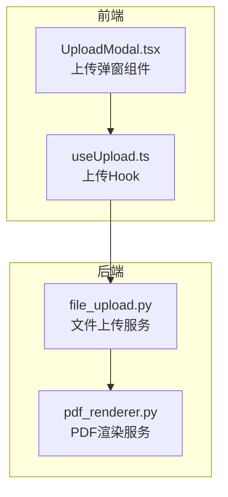
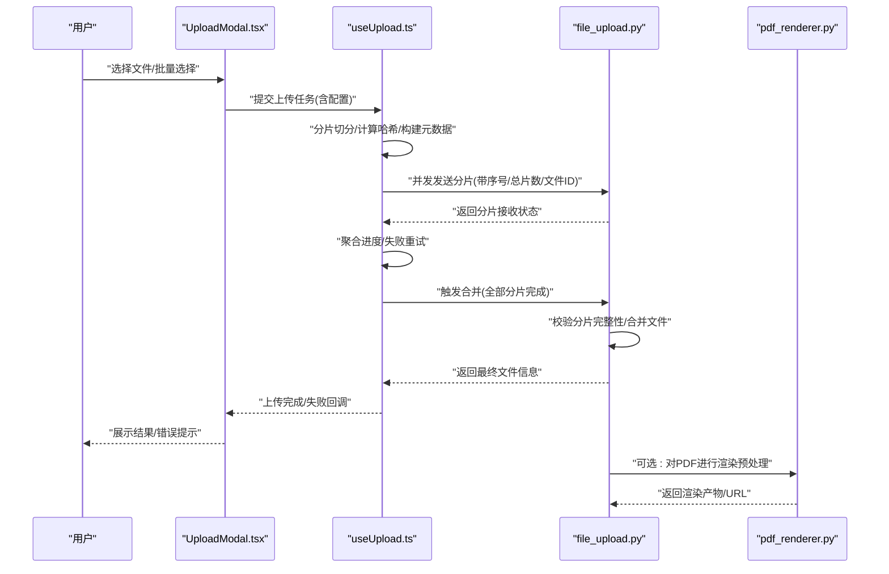
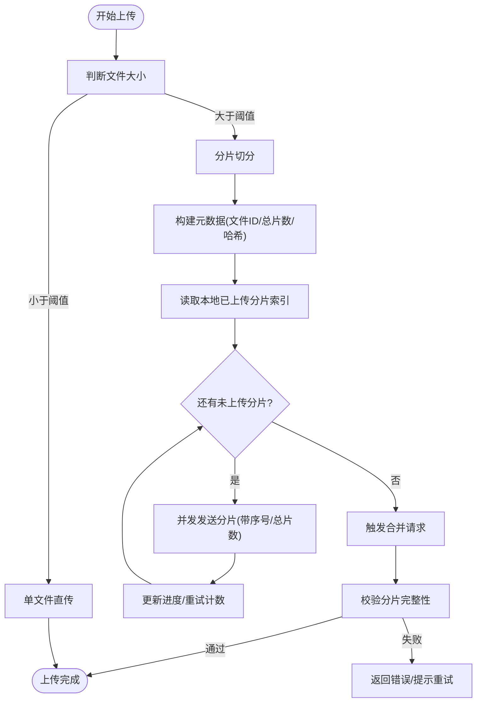
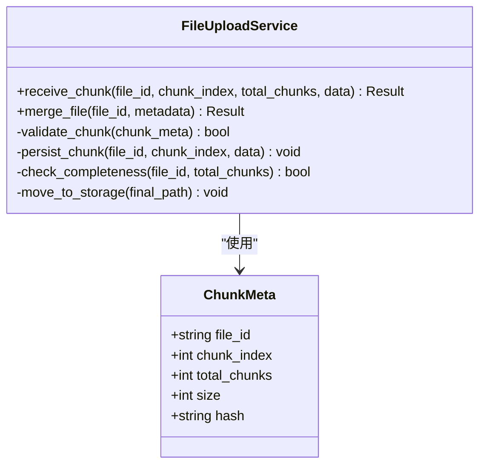
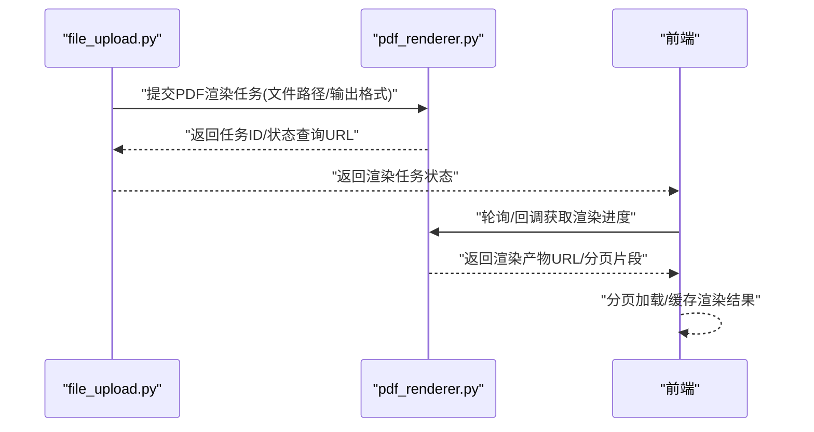

# 文件上传下载

<cite>
**本文引用的文件**   
- [frontend/src/components/UploadModal.tsx](file://frontend/src/components/UploadModal.tsx)
- [frontend/src/hooks/useUpload.ts](file://frontend/src/hooks/useUpload.ts)
- [backend/app/services/file_upload.py](file://backend/app/services/file_upload.py)
- [backend/app/services/pdf_renderer.py](file://backend/app/services/pdf_renderer.py)
</cite>

## 目录
1. [简介](#简介)
2. [项目结构](#项目结构)
3. [核心组件](#核心组件)
4. [架构总览](#架构总览)
5. [详细组件分析](#详细组件分析)
6. [依赖关系分析](#依赖关系分析)
7. [性能考虑](#性能考虑)
8. [故障排查指南](#故障排查指南)
9. [结论](#结论)
10. [附录](#附录)

## 简介
本文件围绕“文件上传下载”主题，结合仓库中的前端上传组件与后端服务，系统性说明以下能力：
- 上传组件封装、进度条显示、错误重试机制
- 大文件分片上传、断点续传、并发控制策略
- 文件格式验证、大小限制、安全校验
- 图片预览、PDF渲染、Office文档在线查看
- 批量文件处理、压缩优化、云存储集成方案

为便于读者快速上手，文档从整体架构入手，逐步深入到关键实现细节，并提供可视化流程图与时序图辅助理解。

## 项目结构
与“文件上传下载”直接相关的代码主要分布在前后端两个位置：
- 前端
  - 上传弹窗组件：负责用户交互、选择文件、展示进度、错误提示等
  - 上传 Hook：封装上传逻辑（含分片、并发、重试、进度聚合）
- 后端
  - 文件上传服务：接收分片、合并、落盘或转存至对象存储
  - PDF 渲染服务：将 PDF 转换为可在线查看的格式或页面片段

图表来源
- [frontend/src/components/UploadModal.tsx](file://frontend/src/components/UploadModal.tsx)
- [frontend/src/hooks/useUpload.ts](file://frontend/src/hooks/useUpload.ts)
- [backend/app/services/file_upload.py](file://backend/app/services/file_upload.py)
- [backend/app/services/pdf_renderer.py](file://backend/app/services/pdf_renderer.py)

章节来源
- [frontend/src/components/UploadModal.tsx](file://frontend/src/components/UploadModal.tsx)
- [frontend/src/hooks/useUpload.ts](file://frontend/src/hooks/useUpload.ts)
- [backend/app/services/file_upload.py](file://backend/app/services/file_upload.py)
- [backend/app/services/pdf_renderer.py](file://backend/app/services/pdf_renderer.py)

## 核心组件
本节聚焦上传相关的前后端核心模块及其职责边界。

- 前端上传弹窗组件
  - 提供文件选择、多文件队列、进度展示、错误提示、取消/重试操作入口
  - 与上传 Hook 协作，统一触发上传流程并消费进度事件
- 前端上传 Hook
  - 封装分片策略、并发控制、断点续传、失败重试、进度聚合
  - 暴露统一的上传 API，供组件调用
- 后端文件上传服务
  - 接收分片请求，校验元数据与分片完整性
  - 支持分片合并、临时目录管理、最终落盘或迁移到云存储
- 后端 PDF 渲染服务
  - 将 PDF 转为可在线展示的中间格式或页面切片
  - 配合前端进行分页加载与缓存

章节来源
- [frontend/src/components/UploadModal.tsx](file://frontend/src/components/UploadModal.tsx)
- [frontend/src/hooks/useUpload.ts](file://frontend/src/hooks/useUpload.ts)
- [backend/app/services/file_upload.py](file://backend/app/services/file_upload.py)
- [backend/app/services/pdf_renderer.py](file://backend/app/services/pdf_renderer.py)

## 架构总览
下图展示了从用户选择文件到后端落盘及后续处理的端到端流程，包括分片上传、进度上报、合并与可选的云存储迁移。

图表来源
- [frontend/src/components/UploadModal.tsx](file://frontend/src/components/UploadModal.tsx)
- [frontend/src/hooks/useUpload.ts](file://frontend/src/hooks/useUpload.ts)
- [backend/app/services/file_upload.py](file://backend/app/services/file_upload.py)
- [backend/app/services/pdf_renderer.py](file://backend/app/services/pdf_renderer.py)

## 详细组件分析

### 前端上传组件（UploadModal）
- 职责
  - 收集用户选择的文件列表，生成唯一任务标识
  - 根据文件大小与类型决定上传策略（单文件直传/分片上传）
  - 展示每个文件的上传进度、剩余时间估算、错误信息
  - 提供取消、重试、批量操作的交互入口
- 与 Hook 的协作
  - 通过 Hook 提供的接口发起上传，订阅进度事件
  - 在 UI 层做错误分类提示（网络错误、服务端拒绝、格式不符等）
- 关键点
  - 批量上传时维护任务队列与并发上限
  - 对超大文件自动启用分片模式
  - 支持暂停/恢复（基于分片索引与本地记录）

章节来源
- [frontend/src/components/UploadModal.tsx](file://frontend/src/components/UploadModal.tsx)

### 前端上传 Hook（useUpload）
- 核心能力
  - 分片切分：按固定大小切分文件，生成有序分片
  - 并发控制：限制同时上传的分片数量，避免阻塞
  - 断点续传：记录已上传分片索引，跳过重复上传
  - 失败重试：指数退避重试，区分可重试与不可重试错误
  - 进度聚合：汇总各分片进度，计算总体百分比
- 数据结构建议
  - 任务对象：包含文件元信息、分片数组、当前状态、进度、错误信息
  - 分片对象：包含分片索引、偏移量、大小、是否已上传、重试次数
- 算法要点
  - 分片大小与并发度需根据网络环境与服务器能力动态调整
  - 使用幂等键（如文件哈希+分片索引）保证断点续传一致性
  - 合并阶段先校验分片集合完整性再执行合并

图表来源
- [frontend/src/hooks/useUpload.ts](file://frontend/src/hooks/useUpload.ts)

章节来源
- [frontend/src/hooks/useUpload.ts](file://frontend/src/hooks/useUpload.ts)

### 后端文件上传服务（file_upload.py）
- 职责
  - 接收分片请求，校验请求头与参数（文件ID、分片序号、总片数、分片大小）
  - 持久化分片到临时目录，记录分片清单
  - 响应合并请求，校验分片集合完整性后合并为完整文件
  - 可选：将最终文件迁移至云存储（如对象存储桶），并清理临时文件
- 安全与校验
  - 文件名白名单/黑名单、MIME 类型校验、扩展名二次校验
  - 大小限制、路径穿越防护、分片重放保护（幂等键）
  - 病毒扫描/内容检测（可选）
- 并发与稳定性
  - 分片写入采用原子性命名与锁机制，避免竞态
  - 合并前检查分片缺失，返回明确错误码以便前端重试
  - 支持分片过期清理策略，释放磁盘空间

图表来源
- [backend/app/services/file_upload.py](file://backend/app/services/file_upload.py)

章节来源
- [backend/app/services/file_upload.py](file://backend/app/services/file_upload.py)

### 后端 PDF 渲染服务（pdf_renderer.py）
- 职责
  - 将 PDF 转换为可在线查看的中间格式（如 HTML/SVG/图片序列）
  - 支持分页渲染与按需加载，降低首屏压力
  - 提供渲染产物 URL 或二进制流，供前端嵌入展示
- 性能优化
  - 异步任务队列处理耗时渲染
  - 渲染产物缓存与版本管理
  - 资源压缩与懒加载

图表来源
- [backend/app/services/pdf_renderer.py](file://backend/app/services/pdf_renderer.py)
- [backend/app/services/file_upload.py](file://backend/app/services/file_upload.py)

章节来源
- [backend/app/services/pdf_renderer.py](file://backend/app/services/pdf_renderer.py)

## 依赖关系分析
- 前端
  - UploadModal 依赖 useUpload，仅关注 UI 与交互
  - useUpload 依赖网络层与本地存储（用于断点续传记录）
- 后端
  - file_upload 作为上传主入口，必要时调用 pdf_renderer 进行预处理
  - pdf_renderer 独立于上传流程，可作为通用渲染服务被其他模块复用

图表来源
- [frontend/src/components/UploadModal.tsx](file://frontend/src/components/UploadModal.tsx)
- [frontend/src/hooks/useUpload.ts](file://frontend/src/hooks/useUpload.ts)
- [backend/app/services/file_upload.py](file://backend/app/services/file_upload.py)
- [backend/app/services/pdf_renderer.py](file://backend/app/services/pdf_renderer.py)

章节来源
- [frontend/src/components/UploadModal.tsx](file://frontend/src/components/UploadModal.tsx)
- [frontend/src/hooks/useUpload.ts](file://frontend/src/hooks/useUpload.ts)
- [backend/app/services/file_upload.py](file://backend/app/services/file_upload.py)
- [backend/app/services/pdf_renderer.py](file://backend/app/services/pdf_renderer.py)

## 性能考虑
- 分片大小与并发度
  - 小文件直传减少握手开销；大文件分片提升吞吐与容错
  - 并发度受限于浏览器连接池与服务端处理能力，建议默认 4~8，可按网络质量动态调整
- 断点续传与去重
  - 使用文件级哈希与分片级哈希双重校验，避免重复传输
  - 本地记录分片索引，重启后可无缝恢复
- 进度与用户体验
  - 实时聚合分片进度，预估剩余时间
  - 失败重试采用指数退避，避免雪崩
- 后端存储与 I/O
  - 分片写入采用顺序追加与原子重命名，降低碎片
  - 合并完成后及时迁移至冷存储或对象存储，释放热盘空间
- PDF 渲染
  - 分页渲染与懒加载，首屏只加载必要页面
  - 渲染产物缓存，命中则直接返回

[本节为通用性能建议，不直接分析具体文件]

## 故障排查指南
- 常见错误与定位
  - 分片丢失：检查服务端分片清单与本地记录是否一致，确认断点续传索引是否正确
  - 合并失败：核对分片总数与序号范围，确保无重复或缺失
  - 权限/大小限制：确认服务端对 MIME、扩展名、大小的限制策略
  - 渲染超时：检查 PDF 渲染任务队列与资源占用，适当扩容或降级
- 日志与追踪
  - 前端：记录任务 ID、分片索引、重试次数、错误堆栈
  - 后端：记录分片接收、合并、迁移的关键步骤与异常
- 回滚与清理
  - 失败任务保留分片与元数据，支持一键清理
  - 临时目录定期清理，防止磁盘占满

章节来源
- [frontend/src/hooks/useUpload.ts](file://frontend/src/hooks/useUpload.ts)
- [backend/app/services/file_upload.py](file://backend/app/services/file_upload.py)

## 结论
通过前端分片上传 Hook 与后端分片合并服务的协同，系统实现了高可靠、可扩展的文件上传能力，并结合 PDF 渲染服务提供了良好的在线查看体验。建议在现有基础上进一步完善：
- 完善安全校验与内容检测
- 引入云存储 SDK 与生命周期策略
- 增强批量处理与压缩优化能力
- 建立完善的监控与告警体系

[本节为总结性内容，不直接分析具体文件]

## 附录

### 功能清单与实现映射
- 上传组件封装与进度条
  - 前端：UploadModal 与 useUpload
- 错误重试与断点续传
  - 前端：useUpload 的分片索引与重试策略
- 大文件分片与并发控制
  - 前端：useUpload 的分片切分与并发上限
  - 后端：file_upload 的分片接收与合并
- 文件格式验证与安全校验
  - 后端：file_upload 的白名单、MIME、大小限制
- 图片预览、PDF 渲染、Office 在线查看
  - 后端：pdf_renderer 的 PDF 渲染
  - 前端：根据返回 URL 进行在线查看
- 批量处理、压缩优化、云存储集成
  - 前端：批量任务队列与压缩（可选）
  - 后端：file_upload 的对象存储迁移（可选）

章节来源
- [frontend/src/components/UploadModal.tsx](file://frontend/src/components/UploadModal.tsx)
- [frontend/src/hooks/useUpload.ts](file://frontend/src/hooks/useUpload.ts)
- [backend/app/services/file_upload.py](file://backend/app/services/file_upload.py)
- [backend/app/services/pdf_renderer.py](file://backend/app/services/pdf_renderer.py)