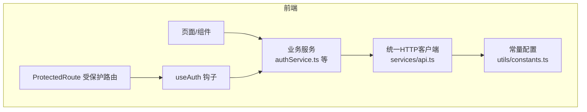
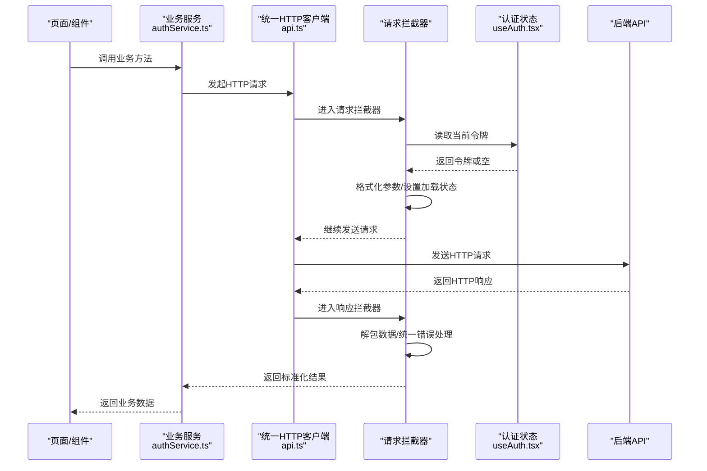
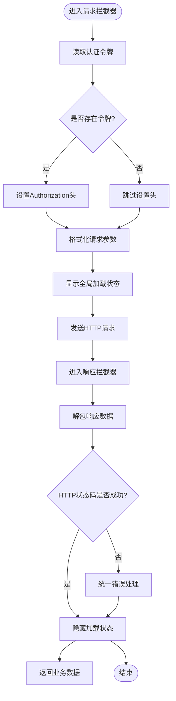
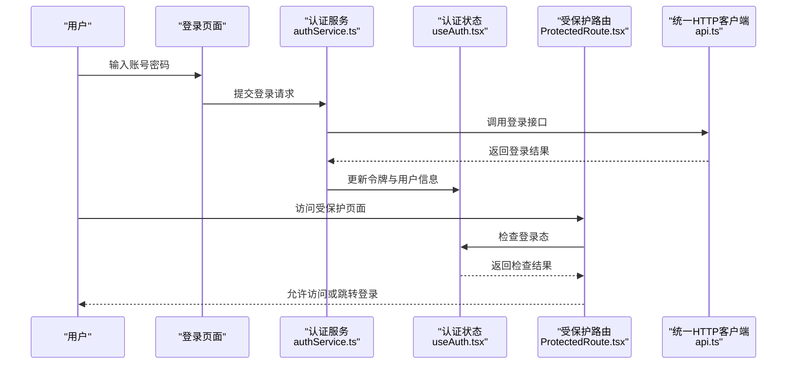
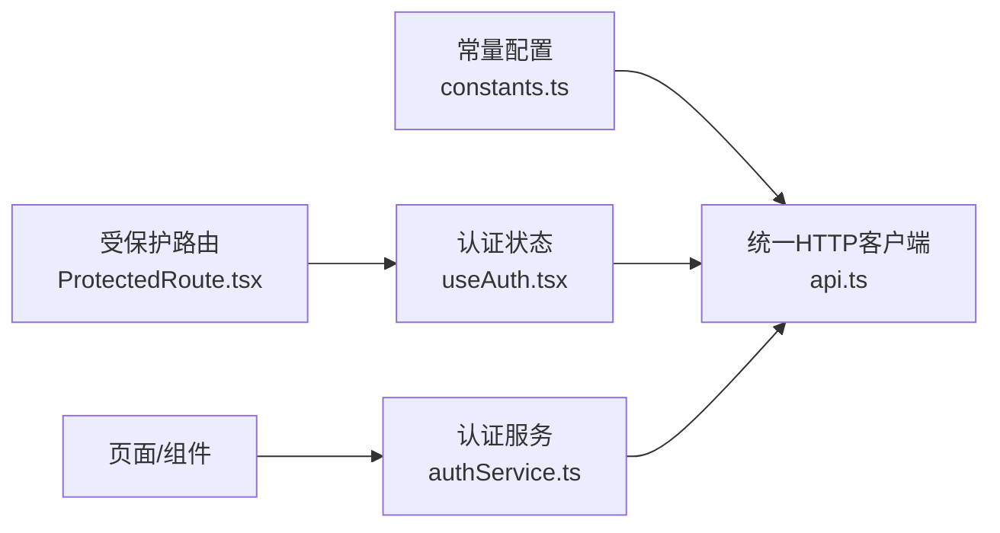

# 网络请求封装

<cite>
**本文引用的文件**   
- [frontend/src/services/api.ts](file://frontend/src/services/api.ts)
- [frontend/src/services/authService.ts](file://frontend/src/services/authService.ts)
- [frontend/src/hooks/useAuth.tsx](file://frontend/src/hooks/useAuth.tsx)
- [frontend/src/utils/constants.ts](file://frontend/src/utils/constants.ts)
- [frontend/src/components/ProtectedRoute.tsx](file://frontend/src/components/ProtectedRoute.tsx)
</cite>

## 目录
1. [简介](#简介)
2. [项目结构](#项目结构)
3. [核心组件](#核心组件)
4. [架构总览](#架构总览)
5. [详细组件分析](#详细组件分析)
6. [依赖关系分析](#依赖关系分析)
7. [性能考虑](#性能考虑)
8. [故障排查指南](#故障排查指南)
9. [结论](#结论)
10. [附录](#附录)

## 简介
本文件面向前端工程中的网络请求封装，围绕 Axios 实例配置、拦截器设计（请求与响应）、错误处理、重试机制、取消请求与并发控制等主题进行系统化说明。文档以仓库中实际实现为依据，结合可视化图表帮助读者快速理解整体设计与关键流程。

## 项目结构
前端服务层采用“统一 HTTP 客户端 + 业务服务”的分层组织方式：
- 统一的 HTTP 客户端定义在 services/api.ts，负责 Axios 实例化、基础 URL、超时、通用请求头、拦截器等全局能力。
- 各业务模块通过独立的 service 文件（如 authService.ts）调用统一客户端，完成领域 API 的封装。
- 认证状态由 hooks/useAuth.tsx 管理，并在受保护路由 components/ProtectedRoute.tsx 中生效。
- 常量配置位于 utils/constants.ts，用于集中管理环境相关参数。

**图示来源**
- [frontend/src/services/api.ts](file://frontend/src/services/api.ts)
- [frontend/src/services/authService.ts](file://frontend/src/services/authService.ts)
- [frontend/src/hooks/useAuth.tsx](file://frontend/src/hooks/useAuth.tsx)
- [frontend/src/components/ProtectedRoute.tsx](file://frontend/src/components/ProtectedRoute.tsx)
- [frontend/src/utils/constants.ts](file://frontend/src/utils/constants.ts)

**章节来源**
- [frontend/src/services/api.ts](file://frontend/src/services/api.ts)
- [frontend/src/services/authService.ts](file://frontend/src/services/authService.ts)
- [frontend/src/hooks/useAuth.tsx](file://frontend/src/hooks/useAuth.tsx)
- [frontend/src/components/ProtectedRoute.tsx](file://frontend/src/components/ProtectedRoute.tsx)
- [frontend/src/utils/constants.ts](file://frontend/src/utils/constants.ts)

## 核心组件
本节聚焦统一 HTTP 客户端与服务层的职责划分与协作方式。

- 统一 HTTP 客户端（services/api.ts）
  - 提供 Axios 实例，集中配置基础 URL、超时时间、通用请求头等。
  - 实现请求拦截器：注入认证令牌、格式化请求参数、管理加载状态等。
  - 实现响应拦截器：解包响应数据、统一错误处理、根据 HTTP 状态码分支处理。
  - 可选扩展点：重试策略、取消请求、并发控制等。

- 业务服务（如 services/authService.ts）
  - 基于统一客户端封装具体业务接口，保持调用方代码简洁一致。
  - 将业务语义与底层 HTTP 细节解耦，便于测试与维护。

- 认证与权限（hooks/useAuth.tsx、components/ProtectedRoute.tsx）
  - 管理用户登录态与令牌生命周期，配合请求拦截器自动注入令牌。
  - 在路由层面校验登录态，未登录时引导跳转。

- 常量配置（utils/constants.ts）
  - 集中管理环境变量、API 前缀、默认超时等，避免硬编码分散在各处。

**章节来源**
- [frontend/src/services/api.ts](file://frontend/src/services/api.ts)
- [frontend/src/services/authService.ts](file://frontend/src/services/authService.ts)
- [frontend/src/hooks/useAuth.tsx](file://frontend/src/hooks/useAuth.tsx)
- [frontend/src/components/ProtectedRoute.tsx](file://frontend/src/components/ProtectedRoute.tsx)
- [frontend/src/utils/constants.ts](file://frontend/src/utils/constants.ts)

## 架构总览
下图展示了从页面到后端的核心调用链路，以及拦截器与认证状态在其中的作用位置。

**图示来源**
- [frontend/src/services/api.ts](file://frontend/src/services/api.ts)
- [frontend/src/services/authService.ts](file://frontend/src/services/authService.ts)
- [frontend/src/hooks/useAuth.tsx](file://frontend/src/hooks/useAuth.tsx)

## 详细组件分析

### 统一HTTP客户端（Axios实例与拦截器）
- Axios 实例配置
  - 基础URL：从常量配置中读取，确保多环境一致性。
  - 超时配置：为不同场景提供合理的默认超时值，必要时在业务层覆盖。
  - 请求头管理：统一设置 Content-Type、Accept 等；在需要时附加鉴权头。

- 请求拦截器
  - JWT 令牌自动注入：从认证状态中获取令牌并写入 Authorization 头。
  - 请求参数格式化：对 GET/POST 等不同方法进行参数规范化，保证后端可解析。
  - 加载状态管理：在进入请求前开启全局加载指示，在响应后关闭，提升用户体验。

- 响应拦截器
  - 统一错误处理：捕获网络异常、超时、服务端错误等，转换为统一错误对象。
  - 响应数据解包：剥离外层包装，直接返回业务数据，简化上层调用。
  - HTTP 状态码处理：针对 401/403/404/5xx 等状态码进行分支处理，例如重定向登录、提示错误等。

- 可扩展能力
  - 重试机制：对幂等请求在网络抖动或临时失败时进行有限次重试，支持指数退避。
  - 取消请求：使用 AbortController 在组件卸载或用户主动取消时中断请求，避免内存泄漏。
  - 并发控制：通过信号量或队列限制同时进行的请求数，降低服务器压力。

**图示来源**
- [frontend/src/services/api.ts](file://frontend/src/services/api.ts)
- [frontend/src/hooks/useAuth.tsx](file://frontend/src/hooks/useAuth.tsx)

**章节来源**
- [frontend/src/services/api.ts](file://frontend/src/services/api.ts)
- [frontend/src/hooks/useAuth.tsx](file://frontend/src/hooks/useAuth.tsx)

### 认证服务与令牌注入
- 认证服务（authService.ts）
  - 封装登录、登出、刷新令牌等业务接口。
  - 在登录成功后更新本地存储与认证状态，供请求拦截器读取。

- 认证状态（useAuth.tsx）
  - 维护当前用户信息与令牌，提供读写接口。
  - 在令牌过期或无效时触发重新登录流程。

- 受保护路由（ProtectedRoute.tsx）
  - 在路由切换前检查认证状态，未登录则跳转到登录页。
  - 与请求拦截器的 401 处理形成双重保障。

**图示来源**
- [frontend/src/services/authService.ts](file://frontend/src/services/authService.ts)
- [frontend/src/hooks/useAuth.tsx](file://frontend/src/hooks/useAuth.tsx)
- [frontend/src/components/ProtectedRoute.tsx](file://frontend/src/components/ProtectedRoute.tsx)
- [frontend/src/services/api.ts](file://frontend/src/services/api.ts)

**章节来源**
- [frontend/src/services/authService.ts](file://frontend/src/services/authService.ts)
- [frontend/src/hooks/useAuth.tsx](file://frontend/src/hooks/useAuth.tsx)
- [frontend/src/components/ProtectedRoute.tsx](file://frontend/src/components/ProtectedRoute.tsx)

### 常量与环境配置
- 常量配置（constants.ts）
  - 集中管理 API 基础路径、默认超时、重试次数等。
  - 便于在不同环境（开发/测试/生产）间切换。

**章节来源**
- [frontend/src/utils/constants.ts](file://frontend/src/utils/constants.ts)

## 依赖关系分析
- 低耦合高内聚
  - 业务服务仅依赖统一 HTTP 客户端，不关心底层实现细节。
  - 认证状态与路由校验独立于 HTTP 客户端，通过接口契约协作。

- 外部依赖
  - Axios：作为 HTTP 客户端库，提供请求/响应拦截、取消、超时等能力。
  - 浏览器 API：AbortController 用于取消请求；localStorage/sessionStorage 用于持久化令牌。

**图示来源**
- [frontend/src/services/api.ts](file://frontend/src/services/api.ts)
- [frontend/src/services/authService.ts](file://frontend/src/services/authService.ts)
- [frontend/src/hooks/useAuth.tsx](file://frontend/src/hooks/useAuth.tsx)
- [frontend/src/components/ProtectedRoute.tsx](file://frontend/src/components/ProtectedRoute.tsx)
- [frontend/src/utils/constants.ts](file://frontend/src/utils/constants.ts)

**章节来源**
- [frontend/src/services/api.ts](file://frontend/src/services/api.ts)
- [frontend/src/services/authService.ts](file://frontend/src/services/authService.ts)
- [frontend/src/hooks/useAuth.tsx](file://frontend/src/hooks/useAuth.tsx)
- [frontend/src/components/ProtectedRoute.tsx](file://frontend/src/components/ProtectedRoute.tsx)
- [frontend/src/utils/constants.ts](file://frontend/src/utils/constants.ts)

## 性能考虑
- 合理设置超时与重试
  - 根据接口类型（短查询/长任务）配置不同的超时阈值。
  - 对幂等接口启用有限次重试，避免雪崩效应。

- 取消与并发控制
  - 在组件卸载或用户离开页面时取消未完成请求，减少资源浪费。
  - 对批量操作使用并发上限，防止瞬时流量冲击后端。

- 缓存与去抖
  - 对热点只读数据引入短期缓存，降低重复请求。
  - 对高频输入事件进行去抖，减少不必要的请求。

[本节为通用指导，不涉及具体文件分析]

## 故障排查指南
- 常见问题定位
  - 401 未授权：检查令牌是否正确注入、是否过期；确认登录态与路由校验逻辑。
  - 403 禁止访问：检查权限模型与角色分配；确认请求参数是否包含必要标识。
  - 404 未找到：核对 API 路径与版本前缀；确认后端路由是否变更。
  - 5xx 服务端错误：查看服务端日志；确认请求体格式是否符合约定。

- 调试建议
  - 在请求拦截器中打印关键信息（URL、方法、参数、令牌存在性）。
  - 在响应拦截器中记录状态码与错误消息，便于快速定位。
  - 使用浏览器开发者工具的 Network 面板观察请求与响应详情。

**章节来源**
- [frontend/src/services/api.ts](file://frontend/src/services/api.ts)
- [frontend/src/services/authService.ts](file://frontend/src/services/authService.ts)
- [frontend/src/hooks/useAuth.tsx](file://frontend/src/hooks/useAuth.tsx)
- [frontend/src/components/ProtectedRoute.tsx](file://frontend/src/components/ProtectedRoute.tsx)

## 结论
通过将 Axios 实例配置、拦截器、认证状态与路由校验有机结合，本项目实现了稳定、可维护且易扩展的网络请求封装。统一错误处理与加载状态管理提升了用户体验，而重试、取消与并发控制则为系统在高负载下的健壮性提供了保障。建议在后续迭代中持续完善日志记录与监控指标，进一步提升问题定位效率与系统可观测性。

[本节为总结性内容，不涉及具体文件分析]

## 附录
- 最佳实践清单
  - 将环境相关配置集中在常量文件中，避免硬编码。
  - 在请求拦截器中统一处理令牌注入与参数格式化。
  - 在响应拦截器中统一解包与错误处理，减少业务层样板代码。
  - 对幂等接口启用重试，非幂等接口谨慎使用。
  - 使用 AbortController 在合适时机取消请求，避免内存泄漏。
  - 对高频请求实施并发控制与缓存策略，优化性能。

[本节为通用指导，不涉及具体文件分析]