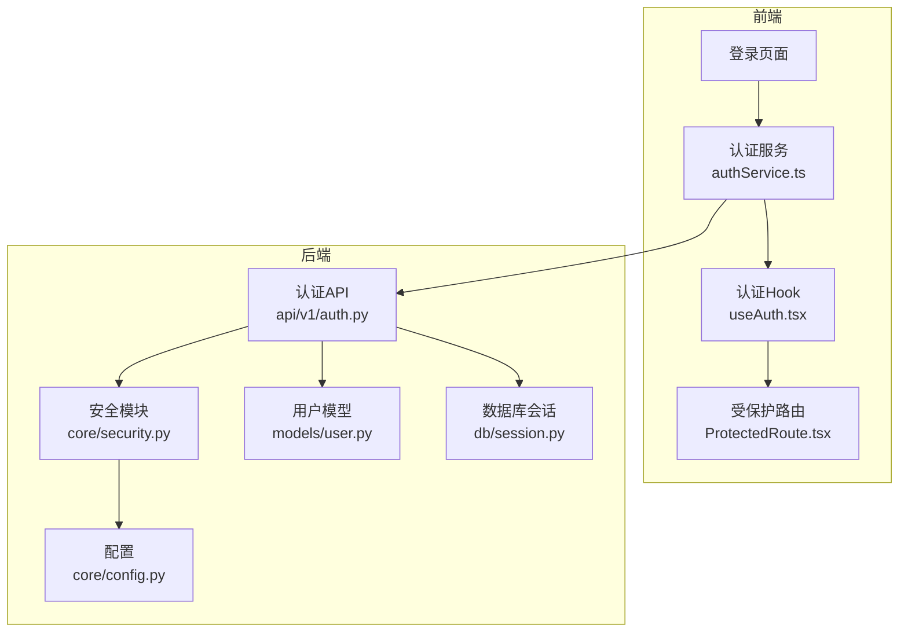
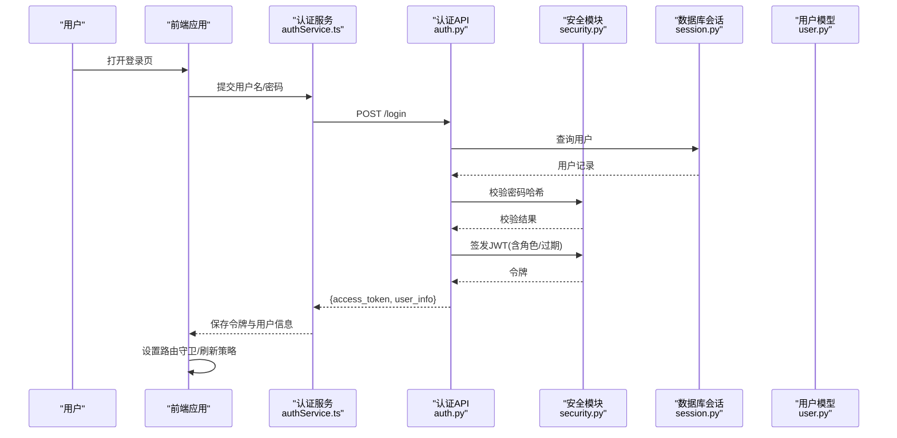
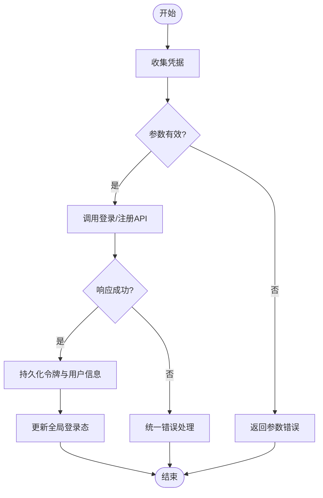
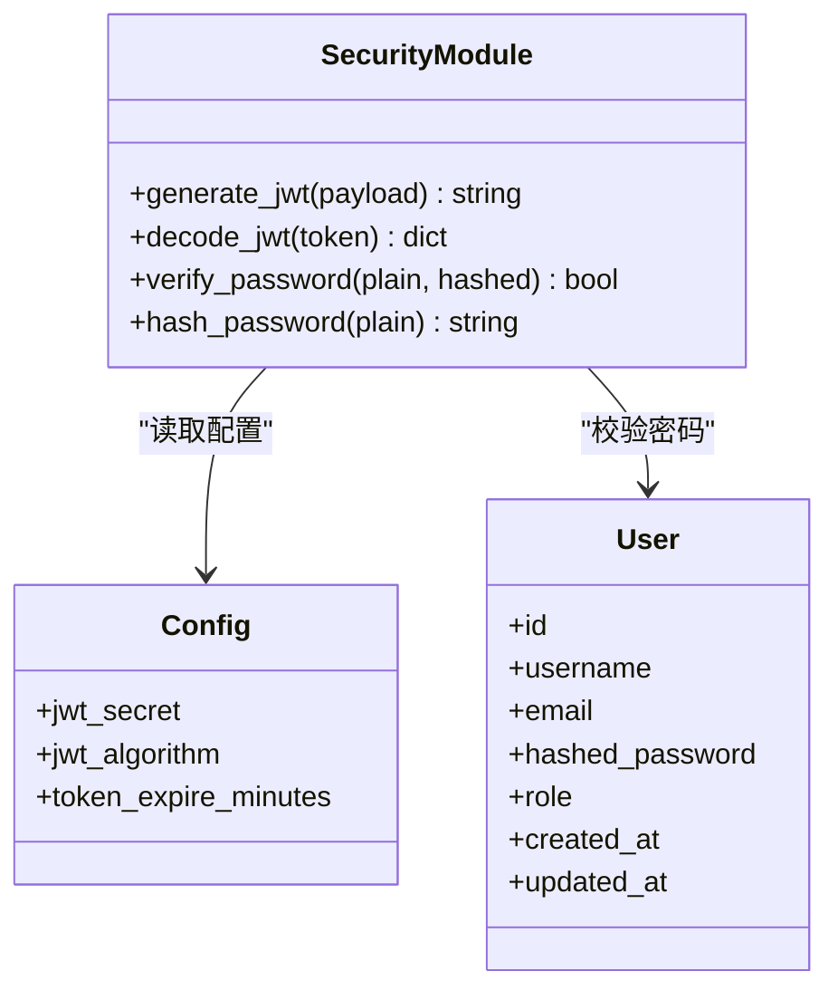
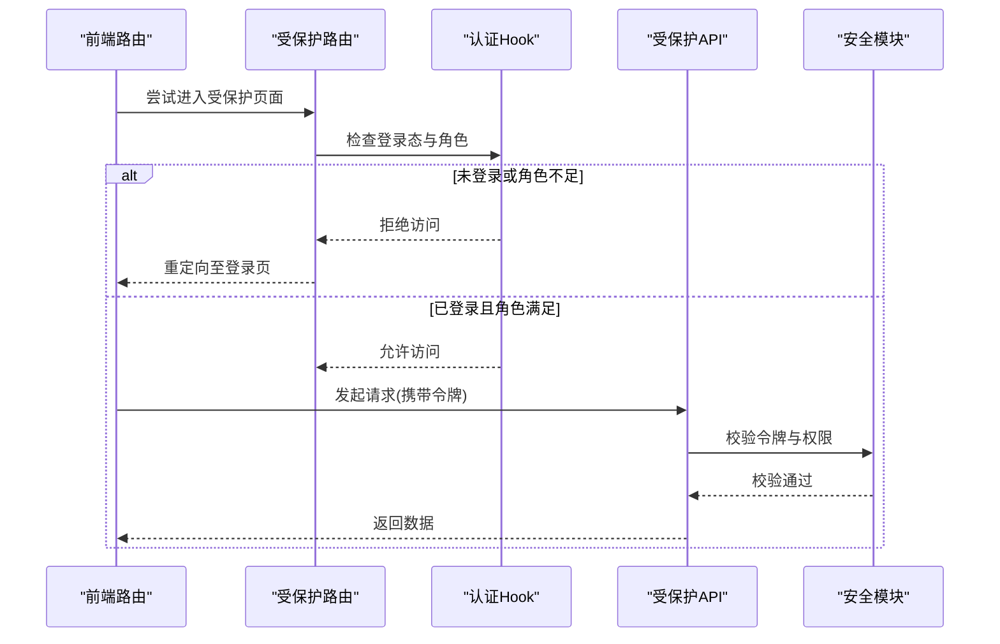
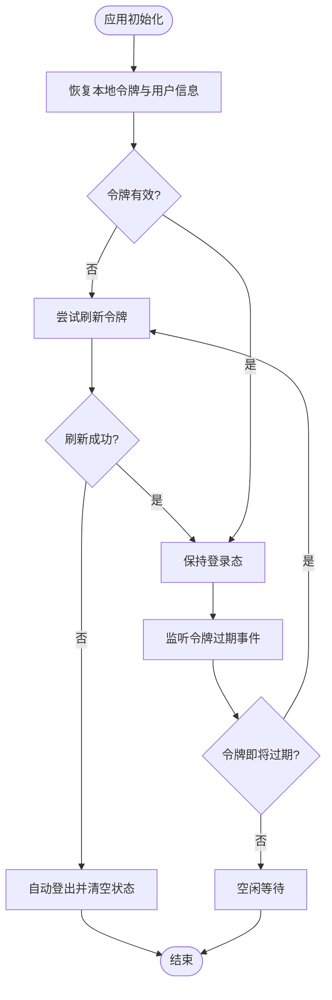
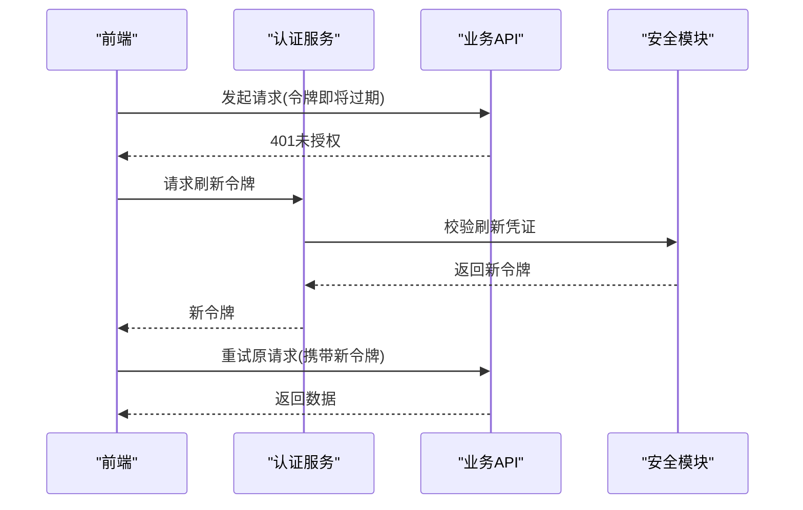
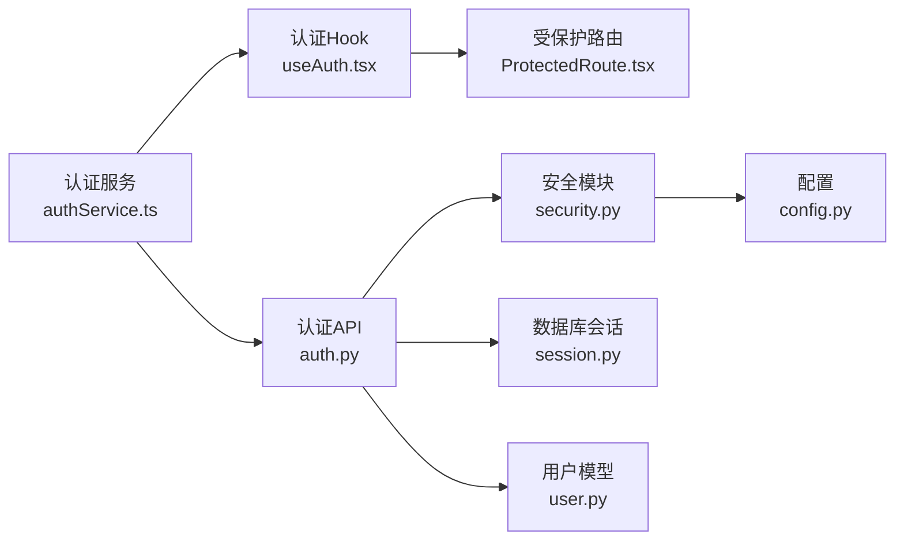

# 认证服务

<cite>
**本文引用的文件**   
- [backend/app/api/v1/auth.py](file://backend/app/api/v1/auth.py)
- [backend/app/core/security.py](file://backend/app/core/security.py)
- [backend/app/core/config.py](file://backend/app/core/config.py)
- [backend/app/models/user.py](file://backend/app/models/user.py)
- [backend/app/schemas/user.py](file://backend/app/schemas/user.py)
- [backend/app/db/session.py](file://backend/app/db/session.py)
- [frontend/src/services/authService.ts](file://frontend/src/services/authService.ts)
- [frontend/src/hooks/useAuth.tsx](file://frontend/src/hooks/useAuth.tsx)
- [frontend/src/components/ProtectedRoute.tsx](file://frontend/src/components/ProtectedRoute.tsx)
- [frontend/src/pages/Login/index.tsx](file://frontend/src/pages/Login/index.tsx)
</cite>

## 目录
1. [简介](#简介)
2. [项目结构](#项目结构)
3. [核心组件](#核心组件)
4. [架构总览](#架构总览)
5. [详细组件分析](#详细组件分析)
6. [依赖关系分析](#依赖关系分析)
7. [性能考虑](#性能考虑)
8. [故障排查指南](#故障排查指南)
9. [结论](#结论)
10. [附录](#附录)

## 简介
本文件面向“认证服务”的完整实现，覆盖用户登录注册、JWT令牌管理、权限验证、会话状态管理、令牌刷新策略、自动登出、角色与路由守卫、API访问控制、密码加密传输与安全存储、跨域认证处理、登录状态持久化、多设备登录管理与第三方认证集成方案。文档以代码级事实为依据，并提供可视化图示帮助理解。

## 项目结构
认证相关的关键位置：
- 后端
  - API层：认证接口定义（登录、注册、登出等）
  - 安全层：JWT签发/校验、密码哈希、配置项
  - 数据模型：用户实体与数据库会话
  - 请求/响应模式：Pydantic Schema
- 前端
  - 认证服务：封装HTTP调用、拦截器、错误处理
  - 认证Hook：全局登录态、刷新逻辑、登出动作
  - 路由守卫：受保护路由与未登录跳转
  - 登录页面：表单提交与结果反馈

图表来源
- [backend/app/api/v1/auth.py](file://backend/app/api/v1/auth.py)
- [backend/app/core/security.py](file://backend/app/core/security.py)
- [backend/app/core/config.py](file://backend/app/core/config.py)
- [backend/app/models/user.py](file://backend/app/models/user.py)
- [backend/app/db/session.py](file://backend/app/db/session.py)
- [frontend/src/services/authService.ts](file://frontend/src/services/authService.ts)
- [frontend/src/hooks/useAuth.tsx](file://frontend/src/hooks/useAuth.tsx)
- [frontend/src/components/ProtectedRoute.tsx](file://frontend/src/components/ProtectedRoute.tsx)

章节来源
- [backend/app/api/v1/auth.py](file://backend/app/api/v1/auth.py)
- [backend/app/core/security.py](file://backend/app/core/security.py)
- [backend/app/core/config.py](file://backend/app/core/config.py)
- [backend/app/models/user.py](file://backend/app/models/user.py)
- [backend/app/db/session.py](file://backend/app/db/session.py)
- [frontend/src/services/authService.ts](file://frontend/src/services/authService.ts)
- [frontend/src/hooks/useAuth.tsx](file://frontend/src/hooks/useAuth.tsx)
- [frontend/src/components/ProtectedRoute.tsx](file://frontend/src/components/ProtectedRoute.tsx)

## 核心组件
- 认证API（后端）
  - 负责接收登录/注册/登出请求，校验输入，调用安全模块生成或校验JWT，查询用户数据并返回标准化响应。
- 安全模块（后端）
  - 提供密码哈希与校验、JWT签发与解码、过期时间策略、密钥与算法配置读取。
- 用户模型（后端）
  - 定义用户表结构与字段，包含用户名、邮箱、密码哈希、角色、创建/更新时间等。
- 认证服务（前端）
  - 封装登录、注册、登出、刷新等HTTP调用；统一错误处理；维护本地令牌与用户信息。
- 认证Hook（前端）
  - 暴露全局登录态、刷新令牌、清除会话、判断是否已登录等方法，供页面与路由使用。
- 受保护路由（前端）
  - 在路由渲染前检查登录态与权限，未通过则重定向至登录页或无权限页。

章节来源
- [backend/app/api/v1/auth.py](file://backend/app/api/v1/auth.py)
- [backend/app/core/security.py](file://backend/app/core/security.py)
- [backend/app/models/user.py](file://backend/app/models/user.py)
- [frontend/src/services/authService.ts](file://frontend/src/services/authService.ts)
- [frontend/src/hooks/useAuth.tsx](file://frontend/src/hooks/useAuth.tsx)
- [frontend/src/components/ProtectedRoute.tsx](file://frontend/src/components/ProtectedRoute.tsx)

## 架构总览
认证流程从前端发起，经认证服务转发到后端API，由安全模块完成密码校验与JWT操作，最终返回令牌与用户信息。前端将令牌持久化并在后续请求中携带，路由守卫据此进行鉴权。

图表来源
- [backend/app/api/v1/auth.py](file://backend/app/api/v1/auth.py)
- [backend/app/core/security.py](file://backend/app/core/security.py)
- [backend/app/models/user.py](file://backend/app/models/user.py)
- [backend/app/db/session.py](file://backend/app/db/session.py)
- [frontend/src/services/authService.ts](file://frontend/src/services/authService.ts)
- [frontend/src/hooks/useAuth.tsx](file://frontend/src/hooks/useAuth.tsx)
- [frontend/src/components/ProtectedRoute.tsx](file://frontend/src/components/ProtectedRoute.tsx)

## 详细组件分析

### 用户登录与注册流程
- 登录
  - 前端收集凭据，调用认证服务登录接口。
  - 后端根据用户名/邮箱查找用户，校验密码哈希，签发JWT并返回。
  - 前端保存令牌与用户信息，更新全局登录态。
- 注册
  - 前端提交注册信息，后端校验唯一性，对密码进行哈希后入库，返回成功或错误。
- 登出
  - 前端清除本地令牌与会话，必要时调用后端登出接口（如需要服务端清理）。

图表来源
- [frontend/src/pages/Login/index.tsx](file://frontend/src/pages/Login/index.tsx)
- [frontend/src/services/authService.ts](file://frontend/src/services/authService.ts)
- [backend/app/api/v1/auth.py](file://backend/app/api/v1/auth.py)
- [backend/app/core/security.py](file://backend/app/core/security.py)
- [backend/app/models/user.py](file://backend/app/models/user.py)
- [backend/app/db/session.py](file://backend/app/db/session.py)

章节来源
- [frontend/src/pages/Login/index.tsx](file://frontend/src/pages/Login/index.tsx)
- [frontend/src/services/authService.ts](file://frontend/src/services/authService.ts)
- [backend/app/api/v1/auth.py](file://backend/app/api/v1/auth.py)
- [backend/app/core/security.py](file://backend/app/core/security.py)
- [backend/app/models/user.py](file://backend/app/models/user.py)
- [backend/app/db/session.py](file://backend/app/db/session.py)

### JWT令牌管理机制
- 签发
  - 安全模块根据配置生成JWT，载荷包含用户标识与角色等信息，设置过期时间。
- 校验
  - 中间件或依赖注入解析请求头中的令牌，校验签名与有效期，失败则拒绝访问。
- 刷新
  - 前端在令牌即将过期时触发刷新流程，调用刷新接口获取新令牌并替换旧令牌。
- 存储
  - 前端将令牌保存在内存与持久化存储（如localStorage），确保刷新与恢复登录态。

图表来源
- [backend/app/core/security.py](file://backend/app/core/security.py)
- [backend/app/core/config.py](file://backend/app/core/config.py)
- [backend/app/models/user.py](file://backend/app/models/user.py)

章节来源
- [backend/app/core/security.py](file://backend/app/core/security.py)
- [backend/app/core/config.py](file://backend/app/core/config.py)
- [backend/app/models/user.py](file://backend/app/models/user.py)

### 权限验证与路由守卫
- 后端权限
  - 基于JWT载荷中的角色信息进行访问控制，敏感接口需具备特定角色。
- 前端路由守卫
  - 在路由渲染前检查登录态与角色，未通过则重定向至登录页或提示无权限。
- 统一拦截
  - 前端HTTP拦截器自动附加令牌，处理401/403错误，触发刷新或登出。

图表来源
- [frontend/src/components/ProtectedRoute.tsx](file://frontend/src/components/ProtectedRoute.tsx)
- [frontend/src/hooks/useAuth.tsx](file://frontend/src/hooks/useAuth.tsx)
- [backend/app/api/v1/auth.py](file://backend/app/api/v1/auth.py)
- [backend/app/core/security.py](file://backend/app/core/security.py)

章节来源
- [frontend/src/components/ProtectedRoute.tsx](file://frontend/src/components/ProtectedRoute.tsx)
- [frontend/src/hooks/useAuth.tsx](file://frontend/src/hooks/useAuth.tsx)
- [backend/app/api/v1/auth.py](file://backend/app/api/v1/auth.py)
- [backend/app/core/security.py](file://backend/app/core/security.py)

### 会话状态管理与自动登出
- 会话状态
  - 前端通过Hook维护登录态、用户信息与令牌，提供刷新与登出方法。
- 自动登出
  - 当令牌过期且刷新失败时，自动清除本地状态并重定向至登录页。
- 持久化
  - 令牌与用户信息持久化到本地存储，应用启动时恢复登录态。

图表来源
- [frontend/src/hooks/useAuth.tsx](file://frontend/src/hooks/useAuth.tsx)
- [frontend/src/services/authService.ts](file://frontend/src/services/authService.ts)

章节来源
- [frontend/src/hooks/useAuth.tsx](file://frontend/src/hooks/useAuth.tsx)
- [frontend/src/services/authService.ts](file://frontend/src/services/authService.ts)

### 令牌刷新策略
- 前置刷新
  - 在令牌过期前主动刷新，减少401错误概率。
- 后置刷新
  - 收到401时触发刷新，成功后重试原请求。
- 并发控制
  - 避免多次并发刷新，采用队列或标志位保证单次刷新。
- 失败处理
  - 刷新失败则自动登出并提示重新登录。

图表来源
- [frontend/src/services/authService.ts](file://frontend/src/services/authService.ts)
- [frontend/src/hooks/useAuth.tsx](file://frontend/src/hooks/useAuth.tsx)
- [backend/app/api/v1/auth.py](file://backend/app/api/v1/auth.py)
- [backend/app/core/security.py](file://backend/app/core/security.py)

章节来源
- [frontend/src/services/authService.ts](file://frontend/src/services/authService.ts)
- [frontend/src/hooks/useAuth.tsx](file://frontend/src/hooks/useAuth.tsx)
- [backend/app/api/v1/auth.py](file://backend/app/api/v1/auth.py)
- [backend/app/core/security.py](file://backend/app/core/security.py)

### 密码加密传输与安全存储
- 传输安全
  - 所有认证请求通过HTTPS传输，防止中间人攻击。
- 密码存储
  - 后端对用户密码进行强哈希存储，不保存明文。
- 前端安全
  - 不在日志中输出敏感信息，避免XSS风险。

章节来源
- [backend/app/core/security.py](file://backend/app/core/security.py)
- [backend/app/models/user.py](file://backend/app/models/user.py)

### 跨域认证处理
- CORS配置
  - 后端启用CORS，仅允许可信域名访问。
- Cookie与令牌
  - 若使用Cookie方式，需配置SameSite与Secure属性；当前实现建议采用Authorization头携带令牌。
- 预检请求
  - 复杂请求会触发OPTIONS预检，需放行认证相关头部与方法。

章节来源
- [backend/app/core/config.py](file://backend/app/core/config.py)
- [backend/app/api/v1/auth.py](file://backend/app/api/v1/auth.py)

### 登录状态持久化与多设备登录管理
- 持久化
  - 前端将令牌与用户信息保存到本地存储，应用重启后恢复。
- 多设备
  - 每个设备独立持有令牌，支持同时在线；如需限制，可在后端引入设备指纹或黑名单机制。
- 一致性
  - 登出时同步清除所有设备的本地状态（可通过广播或通知机制）。

章节来源
- [frontend/src/services/authService.ts](file://frontend/src/services/authService.ts)
- [frontend/src/hooks/useAuth.tsx](file://frontend/src/hooks/useAuth.tsx)

### 第三方认证集成方案
- OAuth2/OIDC
  - 前端跳转到第三方授权页，回调携带授权码，后端换取令牌并建立本地会话。
- 单点登录
  - 结合企业身份提供商，统一认证入口，降低重复登录成本。
- 安全注意
  - 严格校验state与nonce，防止CSRF与重放攻击。

[本节为概念性说明，无需列出具体文件来源]

## 依赖关系分析
- 前端依赖
  - 认证服务依赖HTTP客户端与本地存储；认证Hook依赖认证服务；受保护路由依赖认证Hook。
- 后端依赖
  - 认证API依赖安全模块与数据库会话；安全模块依赖配置；用户模型用于数据存取。

图表来源
- [frontend/src/services/authService.ts](file://frontend/src/services/authService.ts)
- [frontend/src/hooks/useAuth.tsx](file://frontend/src/hooks/useAuth.tsx)
- [frontend/src/components/ProtectedRoute.tsx](file://frontend/src/components/ProtectedRoute.tsx)
- [backend/app/api/v1/auth.py](file://backend/app/api/v1/auth.py)
- [backend/app/core/security.py](file://backend/app/core/security.py)
- [backend/app/core/config.py](file://backend/app/core/config.py)
- [backend/app/models/user.py](file://backend/app/models/user.py)
- [backend/app/db/session.py](file://backend/app/db/session.py)

章节来源
- [frontend/src/services/authService.ts](file://frontend/src/services/authService.ts)
- [frontend/src/hooks/useAuth.tsx](file://frontend/src/hooks/useAuth.tsx)
- [frontend/src/components/ProtectedRoute.tsx](file://frontend/src/components/ProtectedRoute.tsx)
- [backend/app/api/v1/auth.py](file://backend/app/api/v1/auth.py)
- [backend/app/core/security.py](file://backend/app/core/security.py)
- [backend/app/core/config.py](file://backend/app/core/config.py)
- [backend/app/models/user.py](file://backend/app/models/user.py)
- [backend/app/db/session.py](file://backend/app/db/session.py)

## 性能考虑
- 令牌刷新节流
  - 合并并发刷新请求，避免频繁刷新造成额外负载。
- 最小化敏感数据
  - JWT载荷仅包含必要信息，减小传输开销。
- 缓存策略
  - 前端可缓存用户基本信息，减少重复请求。
- 后端优化
  - 合理设置索引与连接池，提升用户查询效率。

[本节提供通用指导，无需列出具体文件来源]

## 故障排查指南
- 常见问题
  - 401未授权：检查令牌是否存在、是否过期、是否正确附加到请求头。
  - 403禁止访问：检查用户角色与接口权限要求是否匹配。
  - 跨域错误：确认CORS配置与请求头是否被允许。
- 调试建议
  - 查看浏览器网络面板，确认请求与响应内容。
  - 在后端日志中定位JWT校验失败的具体原因。
  - 在前端控制台检查认证Hook的状态变化与错误信息。

章节来源
- [frontend/src/services/authService.ts](file://frontend/src/services/authService.ts)
- [frontend/src/hooks/useAuth.tsx](file://frontend/src/hooks/useAuth.tsx)
- [backend/app/api/v1/auth.py](file://backend/app/api/v1/auth.py)
- [backend/app/core/security.py](file://backend/app/core/security.py)

## 结论
本认证服务以后端JWT为核心，配合前端的全局状态管理与路由守卫，实现了完整的登录注册、权限控制与令牌生命周期管理。通过合理的刷新策略与错误处理，提升了用户体验与系统安全性。未来可扩展多设备管理与第三方认证能力，以满足更复杂的业务场景。

[本节为总结性内容，无需列出具体文件来源]

## 附录
- 术语
  - JWT：JSON Web Token，用于安全传递声明的开放标准。
  - CORS：跨域资源共享，允许受限资源在不同源间访问。
  - CSRF：跨站请求伪造，一种恶意攻击手段。
- 最佳实践
  - 始终使用HTTPS传输敏感数据。
  - 定期轮换JWT密钥与算法。
  - 最小化JWT载荷，避免泄露敏感信息。
  - 实施严格的CORS与同源策略。

[本节为补充信息，无需列出具体文件来源]