# UI设计规范

<cite>
**本文引用的文件**   
- [frontend/src/App.tsx](file://frontend/src/App.tsx)
- [frontend/src/main.tsx](file://frontend/src/main.tsx)
- [frontend/vite.config.ts](file://frontend/vite.config.ts)
- [frontend/package.json](file://frontend/package.json)
- [frontend/src/components/Layout/AppLayout.tsx](file://frontend/src/components/Layout/AppLayout.tsx)
- [frontend/src/components/Layout/AssignmentLayout.tsx](file://frontend/src/components/Layout/AssignmentLayout.tsx)
- [frontend/src/components/Layout/Header.tsx](file://frontend/src/components/Layout/Header.tsx)
- [frontend/src/pages/Login/index.tsx](file://frontend/src/pages/Login/index.tsx)
- [frontend/src/pages/Composition/index.tsx](file://frontend/src/pages/Composition/index.tsx)
- [frontend/src/pages/LearningAnalytics/index.tsx](file://frontend/src/pages/LearningAnalytics/index.tsx)
- [frontend/src/pages/OralAssessment/index.tsx](file://frontend/src/pages/OralAssessment/index.tsx)
- [frontend/src/pages/Settings/PersonalityConfig.tsx](file://frontend/src/pages/Settings/PersonalityConfig.tsx)
- [frontend/src/components/AIFloatButton.tsx](file://frontend/src/components/AIFloatButton.tsx)
- [frontend/src/components/ChatDrawer.tsx](file://frontend/src/components/ChatDrawer.tsx)
- [frontend/src/components/ProtectedRoute.tsx](file://frontend/src/components/ProtectedRoute.tsx)
</cite>

## 目录
1. [简介](#简介)
2. [项目结构](#项目结构)
3. [核心组件](#核心组件)
4. [架构总览](#架构总览)
5. [详细组件分析](#详细组件分析)
6. [依赖关系分析](#依赖关系分析)
7. [性能与可访问性](#性能与可访问性)
8. [故障排查指南](#故障排查指南)
9. [结论](#结论)
10. [附录：主题定制清单](#附录主题定制清单)

## 简介
本规范面向AI助教系统的前端UI设计与实现，聚焦Ant Design组件库的使用规范、主题定制方案、布局与响应式策略、图标与表单规范、动画与交互反馈、无障碍访问、国际化与多主题切换。文档以现有前端代码为依据，提炼出可复用的设计模式与最佳实践，帮助团队在统一视觉语言的前提下高效迭代。

## 项目结构
前端采用Vite + React + TypeScript技术栈，页面按功能域组织，通用布局与高频组件独立封装，服务层通过API模块统一管理请求。

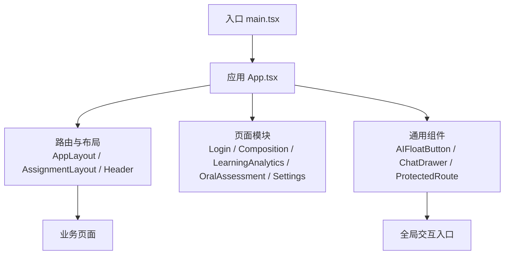

图表来源
- [frontend/src/main.tsx:1-100](file://frontend/src/main.tsx#L1-L100)
- [frontend/src/App.tsx:1-200](file://frontend/src/App.tsx#L1-L200)
- [frontend/src/components/Layout/AppLayout.tsx:1-200](file://frontend/src/components/Layout/AppLayout.tsx#L1-L200)
- [frontend/src/components/Layout/AssignmentLayout.tsx:1-200](file://frontend/src/components/Layout/AssignmentLayout.tsx#L1-L200)
- [frontend/src/components/Layout/Header.tsx:1-200](file://frontend/src/components/Layout/Header.tsx#L1-L200)

章节来源
- [frontend/src/main.tsx:1-100](file://frontend/src/main.tsx#L1-L100)
- [frontend/src/App.tsx:1-200](file://frontend/src/App.tsx#L1-L200)
- [frontend/src/components/Layout/AppLayout.tsx:1-200](file://frontend/src/components/Layout/AppLayout.tsx#L1-L200)
- [frontend/src/components/Layout/AssignmentLayout.tsx:1-200](file://frontend/src/components/Layout/AssignmentLayout.tsx#L1-L200)
- [frontend/src/components/Layout/Header.tsx:1-200](file://frontend/src/components/Layout/Header.tsx#L1-L200)

## 核心组件
- 布局容器
  - AppLayout：主框架布局，承载侧边导航、头部与内容区，提供响应式断点与移动端抽屉适配。
  - AssignmentLayout：作业相关页面的专用布局，强化任务区域与信息密度。
  - Header：顶部导航与用户信息、通知、设置入口。
- 全局交互
  - AIFloatButton：悬浮按钮，作为AI助教的快捷入口，支持展开聊天面板。
  - ChatDrawer：右侧抽屉式对话面板，承载即时问答与上下文展示。
  - ProtectedRoute：受保护路由守卫，结合鉴权状态控制页面访问。
- 页面级示例
  - Login：登录页，演示表单与认证流程的UI规范。
  - Composition：作文编辑页，演示富文本/输入框与操作栏组合。
  - LearningAnalytics：学习分析页，演示数据面板与卡片网格布局。
  - OralAssessment：口语评测页，演示媒体控件与步骤化流程。
  - PersonalityConfig：人格配置页，演示表单与开关类控件。

章节来源
- [frontend/src/components/Layout/AppLayout.tsx:1-200](file://frontend/src/components/Layout/AppLayout.tsx#L1-L200)
- [frontend/src/components/Layout/AssignmentLayout.tsx:1-200](file://frontend/src/components/Layout/AssignmentLayout.tsx#L1-L200)
- [frontend/src/components/Layout/Header.tsx:1-200](file://frontend/src/components/Layout/Header.tsx#L1-L200)
- [frontend/src/components/AIFloatButton.tsx:1-200](file://frontend/src/components/AIFloatButton.tsx#L1-L200)
- [frontend/src/components/ChatDrawer.tsx:1-200](file://frontend/src/components/ChatDrawer.tsx#L1-L200)
- [frontend/src/components/ProtectedRoute.tsx:1-200](file://frontend/src/components/ProtectedRoute.tsx#L1-L200)
- [frontend/src/pages/Login/index.tsx:1-200](file://frontend/src/pages/Login/index.tsx#L1-L200)
- [frontend/src/pages/Composition/index.tsx:1-200](file://frontend/src/pages/Composition/index.tsx#L1-L200)
- [frontend/src/pages/LearningAnalytics/index.tsx:1-200](file://frontend/src/pages/LearningAnalytics/index.tsx#L1-L200)
- [frontend/src/pages/OralAssessment/index.tsx:1-200](file://frontend/src/pages/OralAssessment/index.tsx#L1-L200)
- [frontend/src/pages/Settings/PersonalityConfig.tsx:1-200](file://frontend/src/pages/Settings/PersonalityConfig.tsx#L1-L200)

## 架构总览
整体采用“入口 -> 应用 -> 路由/布局 -> 页面/组件”的分层结构。主题与样式由构建配置与React应用初始化阶段注入；布局组件负责响应式与全局交互；页面组件聚合业务逻辑与第三方服务调用。

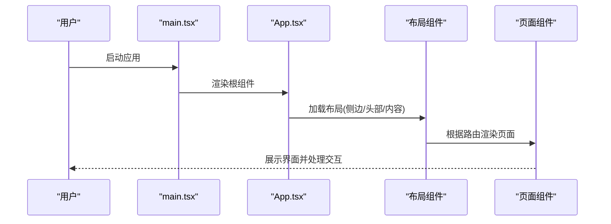

图表来源
- [frontend/src/main.tsx:1-100](file://frontend/src/main.tsx#L1-L100)
- [frontend/src/App.tsx:1-200](file://frontend/src/App.tsx#L1-L200)
- [frontend/src/components/Layout/AppLayout.tsx:1-200](file://frontend/src/components/Layout/AppLayout.tsx#L1-L200)

## 详细组件分析

### 布局系统（AppLayout / AssignmentLayout / Header）
- 设计要点
  - 栅格与间距：使用Ant Design栅格与内置间距变量，保持横向留白一致。
  - 响应式：基于断点在小屏隐藏侧边栏，切换为抽屉或底部导航。
  - 层级与阴影：Header与内容区使用轻量阴影区分层级。
- 交互建议
  - 侧边栏折叠时保留关键导航项，避免信息丢失。
  - 移动端优先保证主要操作的触控面积。

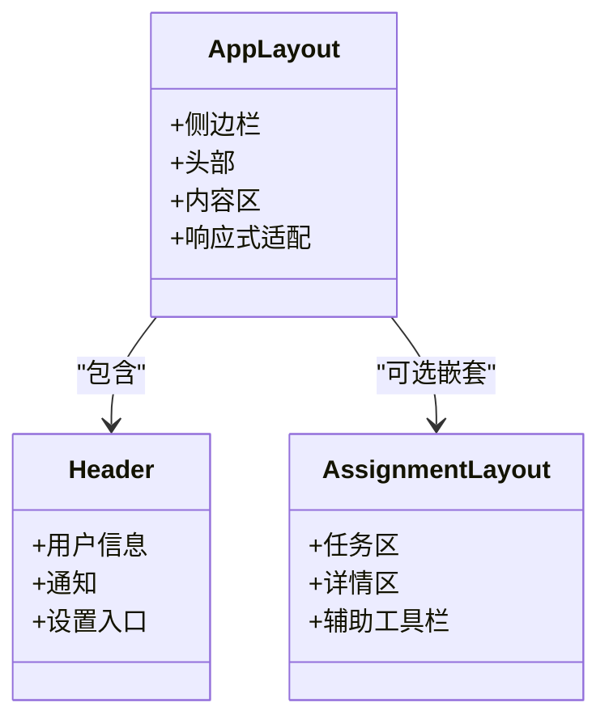

图表来源
- [frontend/src/components/Layout/AppLayout.tsx:1-200](file://frontend/src/components/Layout/AppLayout.tsx#L1-L200)
- [frontend/src/components/Layout/AssignmentLayout.tsx:1-200](file://frontend/src/components/Layout/AssignmentLayout.tsx#L1-L200)
- [frontend/src/components/Layout/Header.tsx:1-200](file://frontend/src/components/Layout/Header.tsx#L1-L200)

章节来源
- [frontend/src/components/Layout/AppLayout.tsx:1-200](file://frontend/src/components/Layout/AppLayout.tsx#L1-L200)
- [frontend/src/components/Layout/AssignmentLayout.tsx:1-200](file://frontend/src/components/Layout/AssignmentLayout.tsx#L1-L200)
- [frontend/src/components/Layout/Header.tsx:1-200](file://frontend/src/components/Layout/Header.tsx#L1-L200)

### AI浮动入口与对话抽屉（AIFloatButton / ChatDrawer）
- 设计要点
  - 悬浮按钮固定于右下角，具备明显的主色强调与微动效提示。
  - 抽屉从右侧滑入，承载消息列表、输入框与快捷指令。
- 交互流程

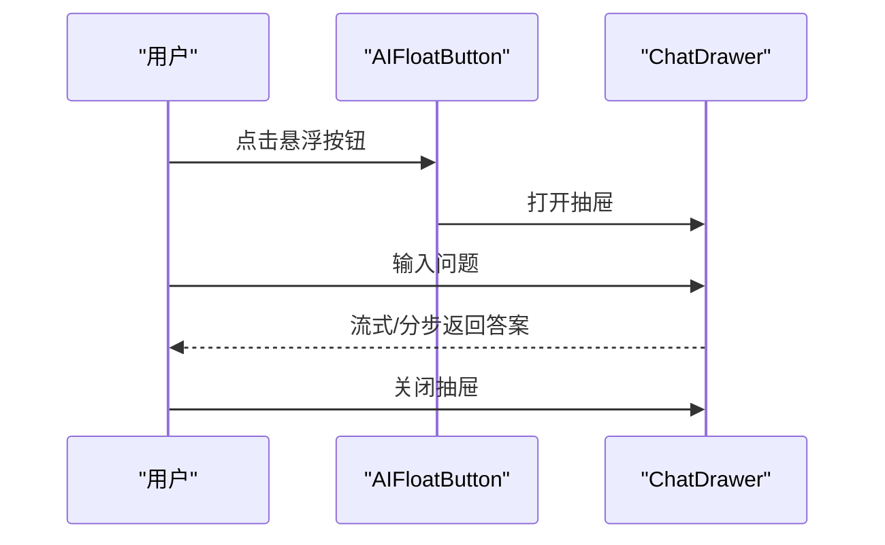

图表来源
- [frontend/src/components/AIFloatButton.tsx:1-200](file://frontend/src/components/AIFloatButton.tsx#L1-L200)
- [frontend/src/components/ChatDrawer.tsx:1-200](file://frontend/src/components/ChatDrawer.tsx#L1-L200)

章节来源
- [frontend/src/components/AIFloatButton.tsx:1-200](file://frontend/src/components/AIFloatButton.tsx#L1-L200)
- [frontend/src/components/ChatDrawer.tsx:1-200](file://frontend/src/components/ChatDrawer.tsx#L1-L200)

### 受保护路由（ProtectedRoute）
- 设计要点
  - 未登录跳转至登录页，已登录进入目标页面。
  - 结合全局鉴权状态，避免重复校验。
- 流程示意

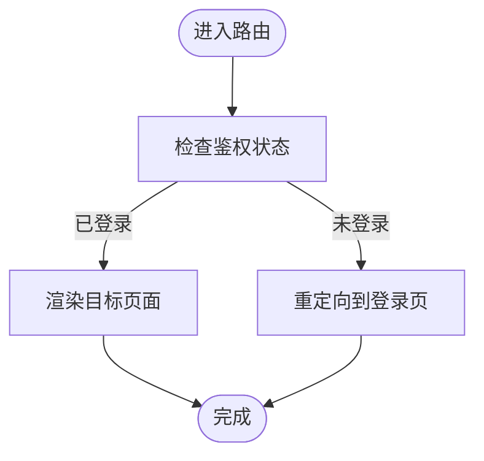

图表来源
- [frontend/src/components/ProtectedRoute.tsx:1-200](file://frontend/src/components/ProtectedRoute.tsx#L1-L200)

章节来源
- [frontend/src/components/ProtectedRoute.tsx:1-200](file://frontend/src/components/ProtectedRoute.tsx#L1-L200)

### 登录页（Login）
- 设计要点
  - 表单居中、留白充足，突出主操作按钮。
  - 错误提示就近显示，遵循Ant Design Form校验规则。
- 交互流程

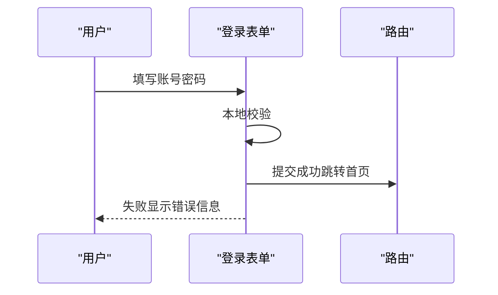

图表来源
- [frontend/src/pages/Login/index.tsx:1-200](file://frontend/src/pages/Login/index.tsx#L1-L200)

章节来源
- [frontend/src/pages/Login/index.tsx:1-200](file://frontend/src/pages/Login/index.tsx#L1-L200)

### 作文编辑页（Composition）
- 设计要点
  - 编辑器占满可用高度，工具栏置于上方或悬浮。
  - 保存/提交按钮常驻可见，提供快捷键提示。
- 布局示意

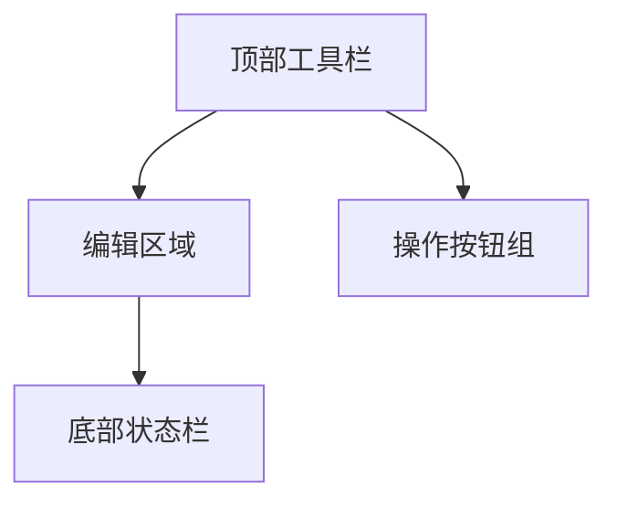

图表来源
- [frontend/src/pages/Composition/index.tsx:1-200](file://frontend/src/pages/Composition/index.tsx#L1-L200)

章节来源
- [frontend/src/pages/Composition/index.tsx:1-200](file://frontend/src/pages/Composition/index.tsx#L1-L200)

### 学习分析页（LearningAnalytics）
- 设计要点
  - 卡片网格布局，指标卡+趋势图组合。
  - 筛选器置于顶部，结果区域自适应宽度。
- 布局示意

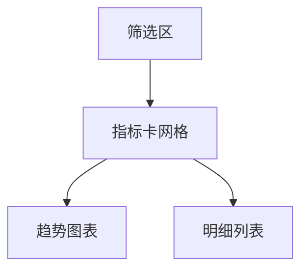

图表来源
- [frontend/src/pages/LearningAnalytics/index.tsx:1-200](file://frontend/src/pages/LearningAnalytics/index.tsx#L1-L200)

章节来源
- [frontend/src/pages/LearningAnalytics/index.tsx:1-200](file://frontend/src/pages/LearningAnalytics/index.tsx#L1-L200)

### 口语评测页（OralAssessment）
- 设计要点
  - 步骤条引导流程，媒体控件居中，进度可视化。
  - 结果页提供回放与导出能力。
- 流程示意

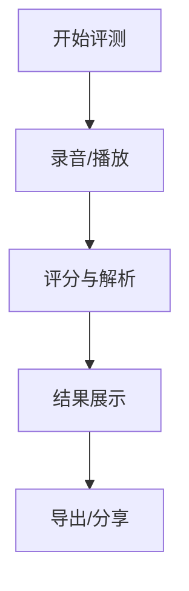

图表来源
- [frontend/src/pages/OralAssessment/index.tsx:1-200](file://frontend/src/pages/OralAssessment/index.tsx#L1-L200)

章节来源
- [frontend/src/pages/OralAssessment/index.tsx:1-200](file://frontend/src/pages/OralAssessment/index.tsx#L1-L200)

### 人格配置页（PersonalityConfig）
- 设计要点
  - 表单分组清晰，开关/滑块等控件与说明文案对齐。
  - 变更实时预览，提供重置与确认提交。
- 交互流程

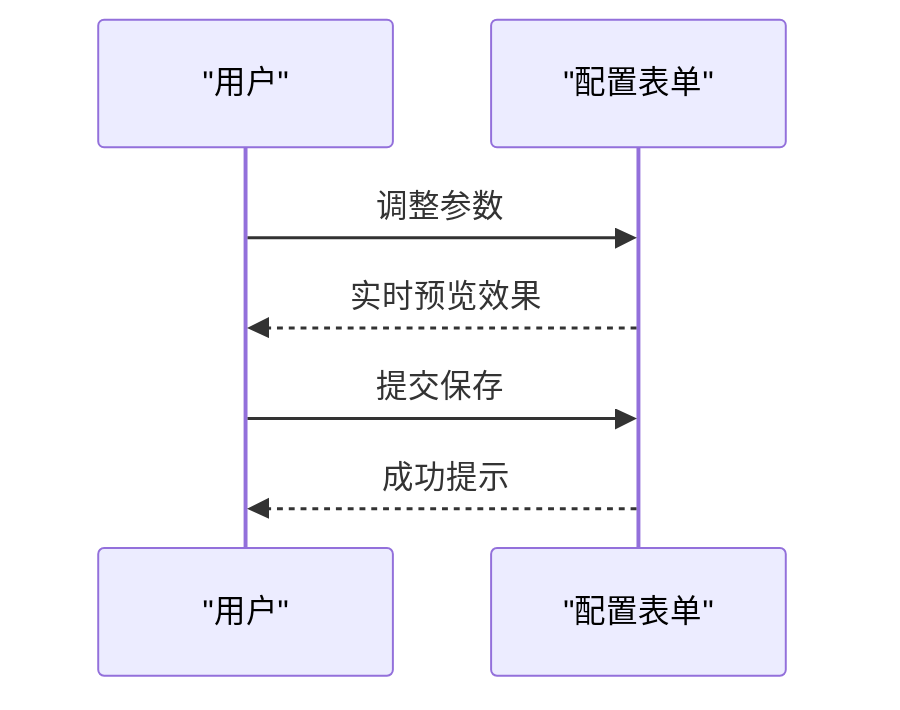

图表来源
- [frontend/src/pages/Settings/PersonalityConfig.tsx:1-200](file://frontend/src/pages/Settings/PersonalityConfig.tsx#L1-L200)

章节来源
- [frontend/src/pages/Settings/PersonalityConfig.tsx:1-200](file://frontend/src/pages/Settings/PersonalityConfig.tsx#L1-L200)

## 依赖关系分析
- 构建与运行
  - Vite配置文件用于开发服务器、插件与打包策略。
  - package.json声明依赖与脚本命令。
- 应用初始化
  - main.tsx挂载根组件。
  - App.tsx定义路由、布局与全局状态。

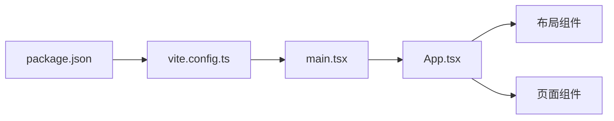

图表来源
- [frontend/package.json:1-200](file://frontend/package.json#L1-L200)
- [frontend/vite.config.ts:1-200](file://frontend/vite.config.ts#L1-L200)
- [frontend/src/main.tsx:1-100](file://frontend/src/main.tsx#L1-L100)
- [frontend/src/App.tsx:1-200](file://frontend/src/App.tsx#L1-L200)

章节来源
- [frontend/package.json:1-200](file://frontend/package.json#L1-L200)
- [frontend/vite.config.ts:1-200](file://frontend/vite.config.ts#L1-L200)
- [frontend/src/main.tsx:1-100](file://frontend/src/main.tsx#L1-L100)
- [frontend/src/App.tsx:1-200](file://frontend/src/App.tsx#L1-L200)

## 性能与可访问性
- 性能
  - 按需引入Ant Design组件与样式，减少包体体积。
  - 图片与资源懒加载，长列表虚拟化。
  - 合理拆分路由与组件，避免首屏阻塞。
- 可访问性
  - 为所有交互元素提供语义化标签与aria属性。
  - 键盘可达性与焦点管理，确保Tab顺序合理。
  - 颜色对比度满足WCAG标准，避免仅用颜色传达信息。
- 国际化与多主题
  - 通过构建配置与应用初始化阶段注入主题与语言包。
  - 提供主题切换入口，持久化用户偏好。

[本节为通用指导，不直接分析具体文件]

## 故障排查指南
- 常见问题
  - 主题未生效：检查构建配置与应用初始化是否注入主题变量。
  - 路由守卫异常：确认鉴权状态初始化时机与路由跳转逻辑。
  - 抽屉/弹窗遮挡：检查z-index层级与布局容器溢出设置。
- 定位方法
  - 使用浏览器开发者工具检查网络与控制台错误。
  - 逐步注释组件定位冲突，缩小范围后修复。

[本节为通用指导，不直接分析具体文件]

## 结论
本规范围绕Ant Design的设计体系，结合AI助教系统的业务场景，给出了布局、组件、交互、主题与可访问性的系统化建议。通过统一的视觉语言与工程化落地，可在保证体验一致性的同时提升研发效率。

[本节为总结性内容，不直接分析具体文件]

## 附录：主题定制清单
- 颜色系统
  - 品牌主色、中性色、语义色（成功/警告/错误）与明暗态映射。
  - 背景、边框、文字与禁用态的对比度要求。
- 字体规范
  - 字族、字号阶梯、行高与字重，中英文混排的最佳实践。
- 间距标准
  - 基础间距单位与栅格间距，组件内外边距的统一约定。
- 图标与按钮
  - 图标尺寸、描边与填充风格；按钮尺寸、主次样式与禁用态。
- 表单规范
  - 字段标签位置、校验提示、必填标识与错误态样式。
- 动画与过渡
  - 入场/出场时长、缓动曲线与可感知反馈原则。
- 无障碍与国际化
  - aria-label、role、tabIndex与键盘导航；i18n键值管理与回退策略。
- 多主题切换
  - 主题变量覆盖、运行时切换与持久化存储。

[本节为通用指导，不直接分析具体文件]