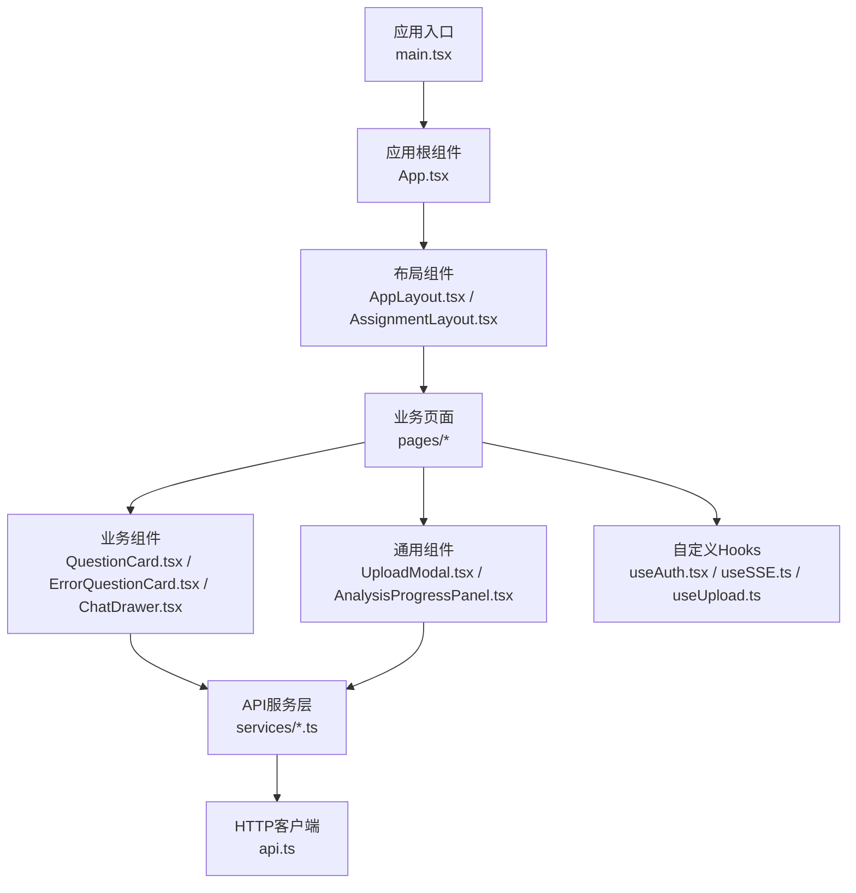
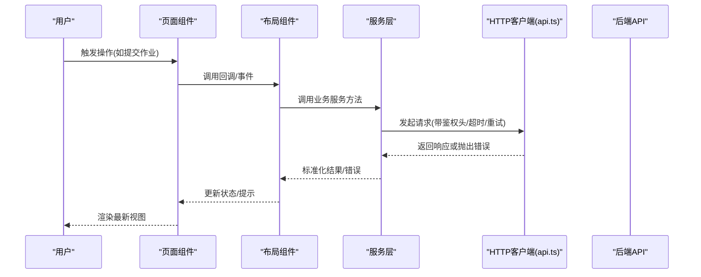
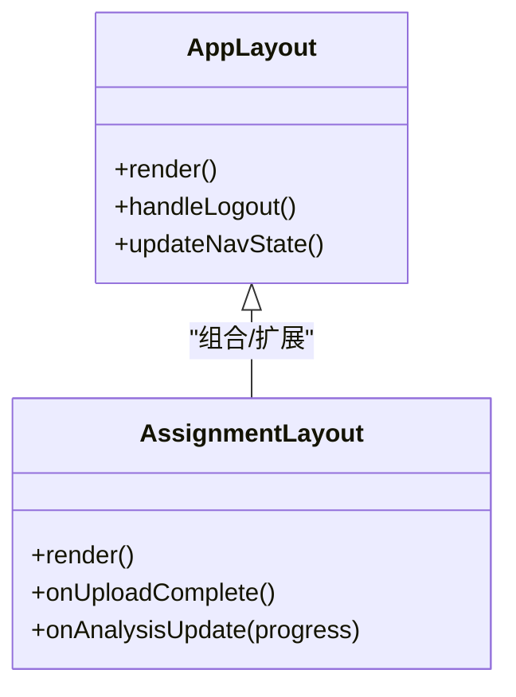
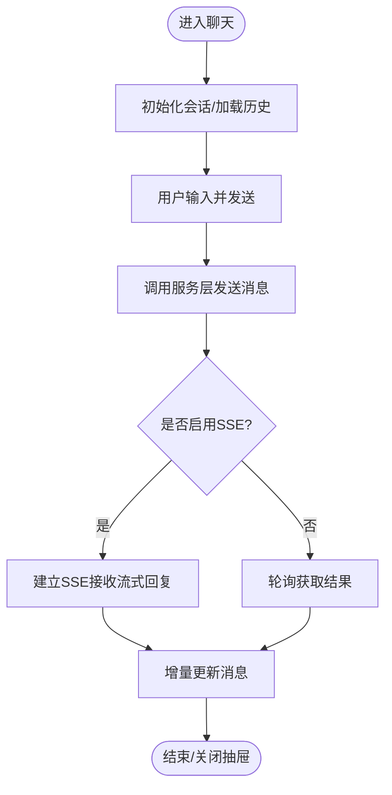
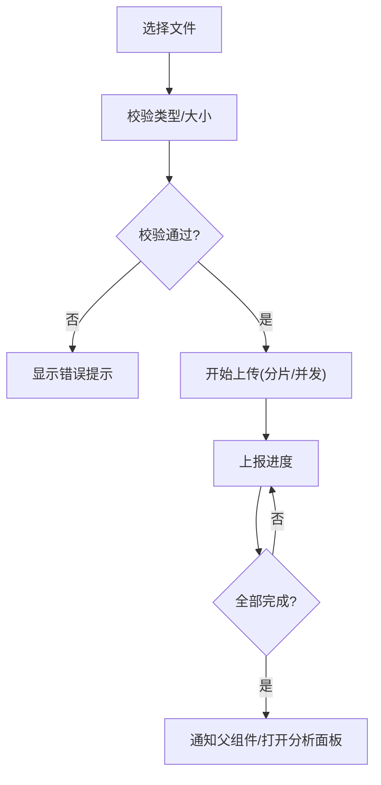
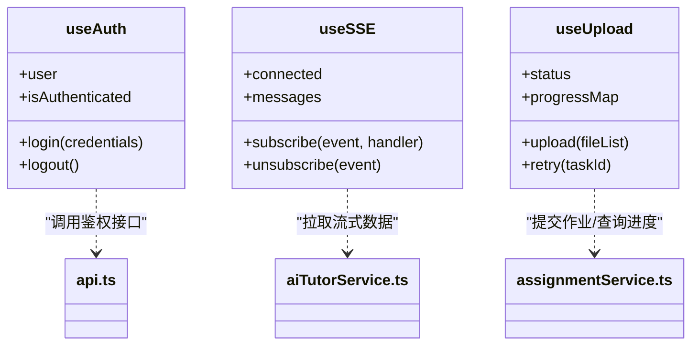
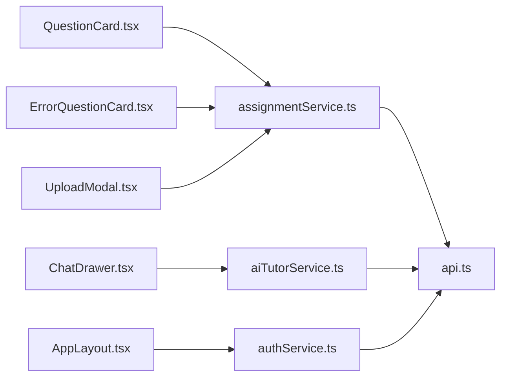

# 前端开发指南

<cite>
**本文引用的文件**   
- [frontend/src/App.tsx](file://frontend/src/App.tsx)
- [frontend/src/main.tsx](file://frontend/src/main.tsx)
- [frontend/vite.config.ts](file://frontend/vite.config.ts)
- [frontend/package.json](file://frontend/package.json)
- [frontend/tsconfig.json](file://frontend/tsconfig.json)
- [frontend/src/components/Layout/AppLayout.tsx](file://frontend/src/components/Layout/AppLayout.tsx)
- [frontend/src/components/Layout/AssignmentLayout.tsx](file://frontend/src/components/Layout/AssignmentLayout.tsx)
- [frontend/src/components/Layout/Header.tsx](file://frontend/src/components/Layout/Header.tsx)
- [frontend/src/components/QuestionCard.tsx](file://frontend/src/components/QuestionCard.tsx)
- [frontend/src/components/ErrorQuestionCard.tsx](file://frontend/src/components/ErrorQuestionCard.tsx)
- [frontend/src/components/ChatDrawer.tsx](file://frontend/src/components/ChatDrawer.tsx)
- [frontend/src/components/UploadModal.tsx](file://frontend/src/components/UploadModal.tsx)
- [frontend/src/components/AnalysisProgressPanel.tsx](file://frontend/src/components/AnalysisProgressPanel.tsx)
- [frontend/src/hooks/useAuth.tsx](file://frontend/src/hooks/useAuth.tsx)
- [frontend/src/hooks/useSSE.ts](file://frontend/src/hooks/useSSE.ts)
- [frontend/src/hooks/useUpload.ts](file://frontend/src/hooks/useUpload.ts)
- [frontend/src/services/api.ts](file://frontend/src/services/api.ts)
- [frontend/src/services/authService.ts](file://frontend/src/services/authService.ts)
- [frontend/src/services/assignmentService.ts](file://frontend/src/services/assignmentService.ts)
- [frontend/src/services/aiTutorService.ts](file://frontend/src/services/aiTutorService.ts)
- [frontend/src/pages/Login/index.tsx](file://frontend/src/pages/Login/index.tsx)
</cite>

## 目录
1. [简介](#简介)
2. [项目结构](#项目结构)
3. [核心组件](#核心组件)
4. [架构总览](#架构总览)
5. [详细组件分析](#详细组件分析)
6. [依赖关系分析](#依赖关系分析)
7. [性能考虑](#性能考虑)
8. [故障排查指南](#故障排查指南)
9. [结论](#结论)
10. [附录](#附录)

## 简介
本指南面向AI助教系统的前端开发，基于React 18与TypeScript，采用Vite构建。文档覆盖：
- 组件化开发模式、状态管理策略与路由设计
- Ant Design使用规范与自定义主题配置
- 核心布局与业务组件结构
- 通用组件与上传交互
- 自定义Hooks设计模式（认证、SSE、上传）
- API服务层封装规范、错误处理机制与性能优化
- 开发环境配置、构建流程、代码规范与最佳实践

## 项目结构
前端采用按功能域分层组织：
- src/components：UI组件（布局、业务、通用）
- src/hooks：可复用逻辑（认证、SSE、上传等）
- src/services：API服务封装
- src/pages：页面级路由入口
- src/utils：工具函数与常量
- 根级配置：vite.config.ts、tsconfig.json、package.json

图表来源
- [frontend/src/main.tsx](file://frontend/src/main.tsx)
- [frontend/src/App.tsx](file://frontend/src/App.tsx)
- [frontend/src/components/Layout/AppLayout.tsx](file://frontend/src/components/Layout/AppLayout.tsx)
- [frontend/src/components/Layout/AssignmentLayout.tsx](file://frontend/src/components/Layout/AssignmentLayout.tsx)
- [frontend/src/components/QuestionCard.tsx](file://frontend/src/components/QuestionCard.tsx)
- [frontend/src/components/ErrorQuestionCard.tsx](file://frontend/src/components/ErrorQuestionCard.tsx)
- [frontend/src/components/ChatDrawer.tsx](file://frontend/src/components/ChatDrawer.tsx)
- [frontend/src/components/UploadModal.tsx](file://frontend/src/components/UploadModal.tsx)
- [frontend/src/components/AnalysisProgressPanel.tsx](file://frontend/src/components/AnalysisProgressPanel.tsx)
- [frontend/src/services/api.ts](file://frontend/src/services/api.ts)
- [frontend/src/hooks/useAuth.tsx](file://frontend/src/hooks/useAuth.tsx)
- [frontend/src/hooks/useSSE.ts](file://frontend/src/hooks/useSSE.ts)
- [frontend/src/hooks/useUpload.ts](file://frontend/src/hooks/useUpload.ts)

章节来源
- [frontend/src/main.tsx](file://frontend/src/main.tsx)
- [frontend/src/App.tsx](file://frontend/src/App.tsx)
- [frontend/vite.config.ts](file://frontend/vite.config.ts)
- [frontend/package.json](file://frontend/package.json)
- [frontend/tsconfig.json](file://frontend/tsconfig.json)

## 核心组件
- 布局组件
  - AppLayout：全局侧边导航、顶部栏、主内容区；承载权限守卫与全局消息提示
  - AssignmentLayout：作业相关页面的专用布局，提供作业上下文与快捷操作
- 业务组件
  - QuestionCard：题目展示、解析展开、收藏/纠错标记
  - ErrorQuestionCard：错题卡片，支持重做、知识点标签、关联讲解
  - ChatDrawer：右侧对话抽屉，集成AI助教问答与历史会话
- 通用组件
  - UploadModal：文件选择、分片/进度、失败重试、预览
  - AnalysisProgressPanel：分析任务进度可视化，支持轮询或SSE更新

章节来源
- [frontend/src/components/Layout/AppLayout.tsx](file://frontend/src/components/Layout/AppLayout.tsx)
- [frontend/src/components/Layout/AssignmentLayout.tsx](file://frontend/src/components/Layout/AssignmentLayout.tsx)
- [frontend/src/components/QuestionCard.tsx](file://frontend/src/components/QuestionCard.tsx)
- [frontend/src/components/ErrorQuestionCard.tsx](file://frontend/src/components/ErrorQuestionCard.tsx)
- [frontend/src/components/ChatDrawer.tsx](file://frontend/src/components/ChatDrawer.tsx)
- [frontend/src/components/UploadModal.tsx](file://frontend/src/components/UploadModal.tsx)
- [frontend/src/components/AnalysisProgressPanel.tsx](file://frontend/src/components/AnalysisProgressPanel.tsx)

## 架构总览
整体采用“页面-布局-组件”三层结构，配合服务层统一访问后端API，通过自定义Hooks抽象跨组件状态与副作用。

图表来源
- [frontend/src/components/Layout/AppLayout.tsx](file://frontend/src/components/Layout/AppLayout.tsx)
- [frontend/src/components/Layout/AssignmentLayout.tsx](file://frontend/src/components/Layout/AssignmentLayout.tsx)
- [frontend/src/services/api.ts](file://frontend/src/services/api.ts)
- [frontend/src/services/authService.ts](file://frontend/src/services/authService.ts)
- [frontend/src/services/assignmentService.ts](file://frontend/src/services/assignmentService.ts)

## 详细组件分析

### 布局组件
- AppLayout
  - 职责：全局导航、面包屑、登录态校验、全局通知
  - 关键交互：路由切换时刷新数据、退出登录清理本地缓存
- AssignmentLayout
  - 职责：作业详情页的专属头部、步骤条、批量操作
  - 关键交互：与上传/分析进度联动

图表来源
- [frontend/src/components/Layout/AppLayout.tsx](file://frontend/src/components/Layout/AppLayout.tsx)
- [frontend/src/components/Layout/AssignmentLayout.tsx](file://frontend/src/components/Layout/AssignmentLayout.tsx)

章节来源
- [frontend/src/components/Layout/AppLayout.tsx](file://frontend/src/components/Layout/AppLayout.tsx)
- [frontend/src/components/Layout/AssignmentLayout.tsx](file://frontend/src/components/Layout/AssignmentLayout.tsx)

### 业务组件
- QuestionCard
  - 职责：题目信息展示、答案折叠、收藏/纠错
  - 状态：是否展开、是否收藏、是否已纠错
- ErrorQuestionCard
  - 职责：错题列表项、重做入口、关联讲解跳转
  - 状态：重做中、重做完成、错误原因标签
- ChatDrawer
  - 职责：AI助教对话面板，消息流渲染、输入框、发送/停止
  - 状态：消息列表、输入文本、发送中、连接状态

图表来源
- [frontend/src/components/ChatDrawer.tsx](file://frontend/src/components/ChatDrawer.tsx)
- [frontend/src/hooks/useSSE.ts](file://frontend/src/hooks/useSSE.ts)
- [frontend/src/services/aiTutorService.ts](file://frontend/src/services/aiTutorService.ts)

章节来源
- [frontend/src/components/QuestionCard.tsx](file://frontend/src/components/QuestionCard.tsx)
- [frontend/src/components/ErrorQuestionCard.tsx](file://frontend/src/components/ErrorQuestionCard.tsx)
- [frontend/src/components/ChatDrawer.tsx](file://frontend/src/components/ChatDrawer.tsx)
- [frontend/src/hooks/useSSE.ts](file://frontend/src/hooks/useSSE.ts)
- [frontend/src/services/aiTutorService.ts](file://frontend/src/services/aiTutorService.ts)

### 通用组件
- UploadModal
  - 职责：文件选择、格式校验、进度反馈、失败重试
  - 状态：文件列表、上传进度、错误信息
- AnalysisProgressPanel
  - 职责：分析任务进度展示，支持多任务并行
  - 状态：任务ID、当前阶段、百分比、错误提示

图表来源
- [frontend/src/components/UploadModal.tsx](file://frontend/src/components/UploadModal.tsx)
- [frontend/src/hooks/useUpload.ts](file://frontend/src/hooks/useUpload.ts)
- [frontend/src/components/AnalysisProgressPanel.tsx](file://frontend/src/components/AnalysisProgressPanel.tsx)

章节来源
- [frontend/src/components/UploadModal.tsx](file://frontend/src/components/UploadModal.tsx)
- [frontend/src/hooks/useUpload.ts](file://frontend/src/hooks/useUpload.ts)
- [frontend/src/components/AnalysisProgressPanel.tsx](file://frontend/src/components/AnalysisProgressPanel.tsx)

### 自定义Hooks设计模式
- useAuth
  - 职责：登录态维护、Token刷新、受保护路由判断
  - 输出：用户信息、登录/登出方法、鉴权状态
- useSSE
  - 职责：建立与服务端的SSE连接、断线重连、事件分发
  - 输出：连接状态、消息队列、订阅/取消订阅方法
- useUpload
  - 职责：上传生命周期管理、进度聚合、失败重试
  - 输出：上传状态、进度映射、错误集合、控制方法

图表来源
- [frontend/src/hooks/useAuth.tsx](file://frontend/src/hooks/useAuth.tsx)
- [frontend/src/hooks/useSSE.ts](file://frontend/src/hooks/useSSE.ts)
- [frontend/src/hooks/useUpload.ts](file://frontend/src/hooks/useUpload.ts)
- [frontend/src/services/api.ts](file://frontend/src/services/api.ts)
- [frontend/src/services/aiTutorService.ts](file://frontend/src/services/aiTutorService.ts)
- [frontend/src/services/assignmentService.ts](file://frontend/src/services/assignmentService.ts)

章节来源
- [frontend/src/hooks/useAuth.tsx](file://frontend/src/hooks/useAuth.tsx)
- [frontend/src/hooks/useSSE.ts](file://frontend/src/hooks/useSSE.ts)
- [frontend/src/hooks/useUpload.ts](file://frontend/src/hooks/useUpload.ts)

### 路由设计与页面
- 路由组织：以页面为维度划分模块，结合布局组件进行嵌套
- 受保护路由：在布局层或路由守卫中统一校验登录态
- 典型页面：登录页、作业管理、作业详情、错题重做、口语评测、学习分析、设置

章节来源
- [frontend/src/App.tsx](file://frontend/src/App.tsx)
- [frontend/src/pages/Login/index.tsx](file://frontend/src/pages/Login/index.tsx)

## 依赖关系分析
- 组件到服务：业务与通用组件通过服务层访问API，避免直接耦合HTTP细节
- 服务到客户端：所有服务统一通过api.ts发起请求，集中处理鉴权、超时、错误码转换
- Hooks到服务：useAuth/useSSE/useUpload分别依赖对应服务，形成清晰的数据流向

图表来源
- [frontend/src/components/QuestionCard.tsx](file://frontend/src/components/QuestionCard.tsx)
- [frontend/src/components/ErrorQuestionCard.tsx](file://frontend/src/components/ErrorQuestionCard.tsx)
- [frontend/src/components/ChatDrawer.tsx](file://frontend/src/components/ChatDrawer.tsx)
- [frontend/src/components/UploadModal.tsx](file://frontend/src/components/UploadModal.tsx)
- [frontend/src/components/Layout/AppLayout.tsx](file://frontend/src/components/Layout/AppLayout.tsx)
- [frontend/src/services/assignmentService.ts](file://frontend/src/services/assignmentService.ts)
- [frontend/src/services/aiTutorService.ts](file://frontend/src/services/aiTutorService.ts)
- [frontend/src/services/authService.ts](file://frontend/src/services/authService.ts)
- [frontend/src/services/api.ts](file://frontend/src/services/api.ts)

章节来源
- [frontend/src/services/api.ts](file://frontend/src/services/api.ts)
- [frontend/src/services/authService.ts](file://frontend/src/services/authService.ts)
- [frontend/src/services/assignmentService.ts](file://frontend/src/services/assignmentService.ts)
- [frontend/src/services/aiTutorService.ts](file://frontend/src/services/aiTutorService.ts)

## 性能考虑
- 组件渲染
  - 合理使用React.memo与useMemo/useCallback减少不必要的重渲染
  - 大列表采用虚拟滚动或分页加载
- 网络请求
  - 请求去抖/节流（搜索、筛选）
  - 合理设置超时与重试策略，避免雪崩
- 资源加载
  - 路由懒加载与组件按需引入
  - 静态资源压缩与CDN缓存
- 长连接
  - SSE断线重连与指数退避
  - 及时释放监听器，防止内存泄漏

[本节为通用指导，不直接分析具体文件]

## 故障排查指南
- 登录态异常
  - 检查Token存储与刷新逻辑，确认鉴权拦截器是否正确注入
  - 查看鉴权服务的错误码映射与提示
- 上传失败
  - 核对文件大小/类型限制与后端一致
  - 检查分片大小、并发数与重试次数
- SSE无数据
  - 确认服务端事件名与客户端订阅一致
  - 检查网络代理与跨域配置
- 页面白屏
  - 检查路由守卫条件与受保护路由配置
  - 查看控制台错误堆栈与网络请求状态

章节来源
- [frontend/src/services/authService.ts](file://frontend/src/services/authService.ts)
- [frontend/src/services/api.ts](file://frontend/src/services/api.ts)
- [frontend/src/hooks/useUpload.ts](file://frontend/src/hooks/useUpload.ts)
- [frontend/src/hooks/useSSE.ts](file://frontend/src/hooks/useSSE.ts)

## 结论
本指南梳理了AI助教系统前端的架构与实现要点，涵盖组件化、状态管理、路由、服务层封装、错误处理与性能优化。遵循本文规范有助于提升可维护性与团队协作效率。

[本节为总结性内容，不直接分析具体文件]

## 附录

### 开发环境与构建
- 运行与构建命令参考package.json脚本
- Vite配置：开发服务器、别名、插件、代理等
- TypeScript配置：严格模式、路径别名、编译目标

章节来源
- [frontend/package.json](file://frontend/package.json)
- [frontend/vite.config.ts](file://frontend/vite.config.ts)
- [frontend/tsconfig.json](file://frontend/tsconfig.json)

### Ant Design使用规范与主题
- 统一通过Provider注入主题变量
- 组件使用遵循Ant Design官方命名与属性约定
- 全局样式隔离与CSS变量定制

[本节为通用指导，不直接分析具体文件]

### API服务层封装规范
- 统一请求封装：基础URL、超时、重试、错误码转换
- 鉴权注入：自动附加Token、刷新Token
- 错误处理：统一提示、日志记录、降级策略

章节来源
- [frontend/src/services/api.ts](file://frontend/src/services/api.ts)
- [frontend/src/services/authService.ts](file://frontend/src/services/authService.ts)

### 代码规范与最佳实践
- 命名：组件PascalCase，函数/变量camelCase，常量UPPER_SNAKE_CASE
- 文件组织：按功能域分组，单一职责
- 类型定义：优先使用interface/type明确数据结构
- 注释：复杂逻辑补充必要说明，保持可读性

[本节为通用指导，不直接分析具体文件]