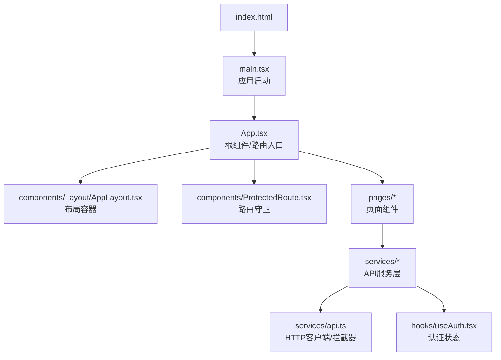
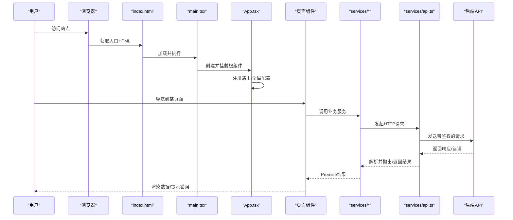
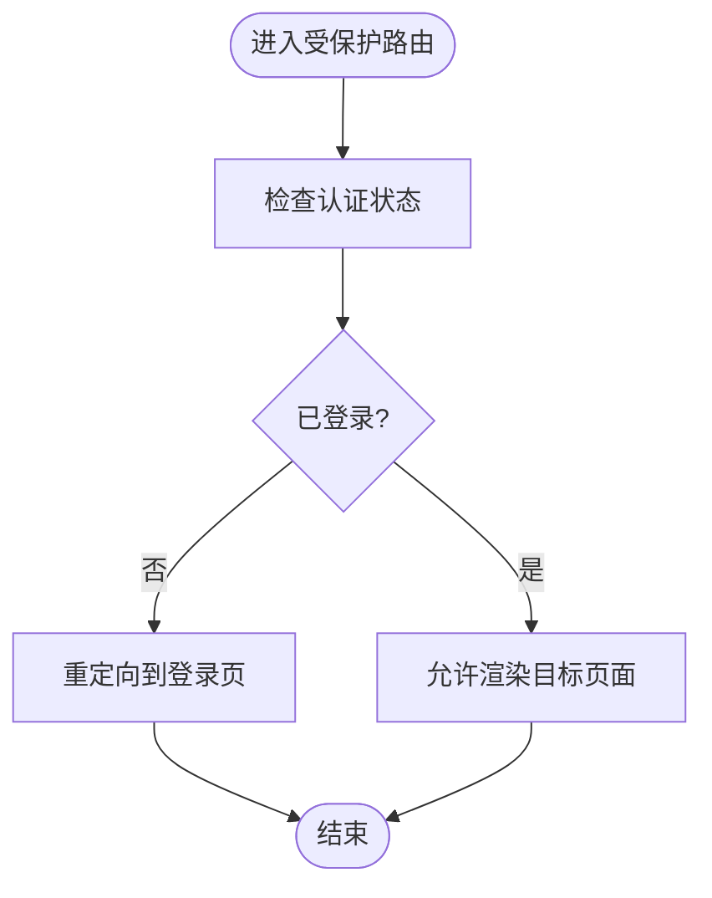
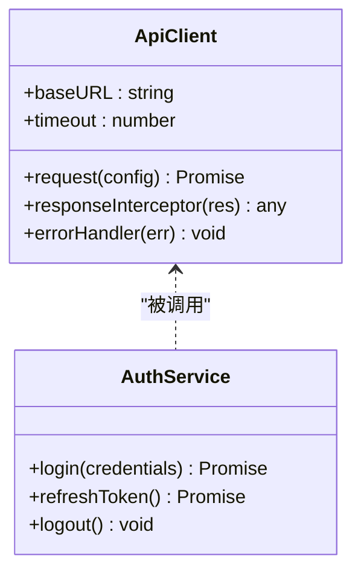
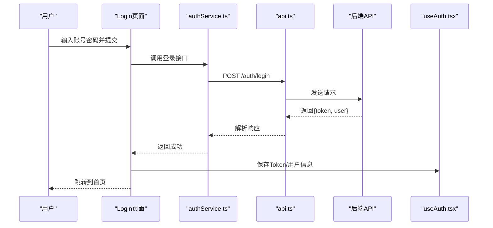
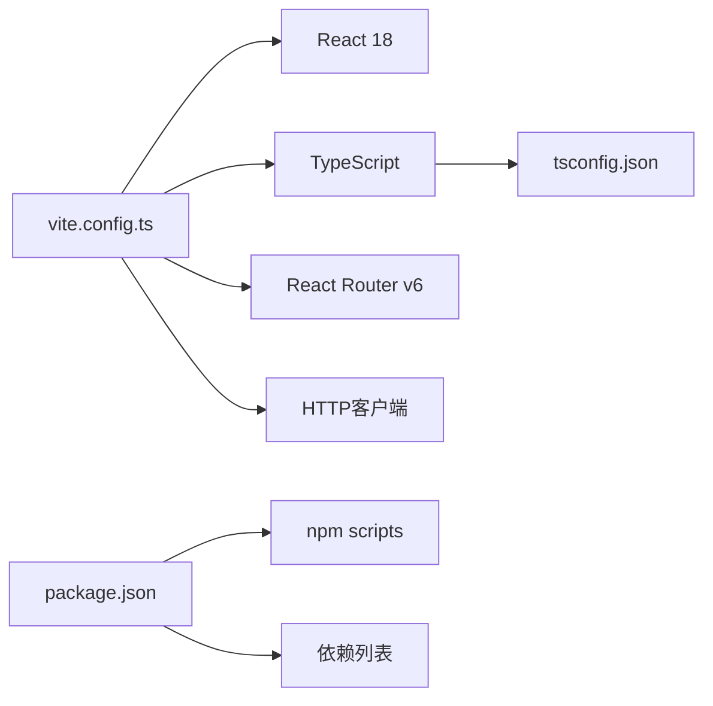

# 应用架构设计

<cite>
**本文引用的文件**   
- [frontend/src/main.tsx](file://frontend/src/main.tsx)
- [frontend/src/App.tsx](file://frontend/src/App.tsx)
- [frontend/vite.config.ts](file://frontend/vite.config.ts)
- [frontend/tsconfig.json](file://frontend/tsconfig.json)
- [frontend/package.json](file://frontend/package.json)
- [frontend/index.html](file://frontend/index.html)
- [frontend/src/components/Layout/AppLayout.tsx](file://frontend/src/components/Layout/AppLayout.tsx)
- [frontend/src/components/ProtectedRoute.tsx](file://frontend/src/components/ProtectedRoute.tsx)
- [frontend/src/hooks/useAuth.tsx](file://frontend/src/hooks/useAuth.tsx)
- [frontend/src/services/api.ts](file://frontend/src/services/api.ts)
- [frontend/src/services/authService.ts](file://frontend/src/services/authService.ts)
- [frontend/src/pages/Login/index.tsx](file://frontend/src/pages/Login/index.tsx)
</cite>

## 目录
1. [简介](#简介)
2. [项目结构](#项目结构)
3. [核心组件](#核心组件)
4. [架构总览](#架构总览)
5. [详细组件分析](#详细组件分析)
6. [依赖分析](#依赖分析)
7. [性能考虑](#性能考虑)
8. [故障排查指南](#故障排查指南)
9. [结论](#结论)
10. [附录](#附录)

## 简介
本文件面向AI助教系统的前端工程，聚焦基于React 18 + TypeScript的现代化Web应用架构。内容涵盖：
- 应用初始化流程与模块组织
- 路由配置策略与页面划分
- Vite构建优化、TypeScript编译配置与开发环境设置
- 前后端分离实现、API请求拦截器设计与全局错误处理
- 性能优化：代码分割、懒加载、缓存策略
- 项目结构规范、命名约定与模块化原则

## 项目结构
前端采用“按功能域+分层”的组织方式：
- src/components：通用与布局组件（如AppLayout、ProtectedRoute）
- src/pages：页面级组件，按业务域分目录（登录、作业管理、口语评估等）
- src/services：API服务层，封装HTTP请求与服务调用
- src/hooks：可复用逻辑（认证、SSE、上传等）
- src/utils：工具函数与常量
- vite.config.ts：Vite构建配置
- tsconfig.json：TypeScript编译选项
- package.json：依赖与脚本
- index.html：入口HTML

图表来源
- [frontend/index.html](file://frontend/index.html)
- [frontend/src/main.tsx](file://frontend/src/main.tsx)
- [frontend/src/App.tsx](file://frontend/src/App.tsx)
- [frontend/src/components/Layout/AppLayout.tsx](file://frontend/src/components/Layout/AppLayout.tsx)
- [frontend/src/components/ProtectedRoute.tsx](file://frontend/src/components/ProtectedRoute.tsx)
- [frontend/src/services/api.ts](file://frontend/src/services/api.ts)
- [frontend/src/hooks/useAuth.tsx](file://frontend/src/hooks/useAuth.tsx)

章节来源
- [frontend/index.html](file://frontend/index.html)
- [frontend/src/main.tsx](file://frontend/src/main.tsx)
- [frontend/src/App.tsx](file://frontend/src/App.tsx)
- [frontend/vite.config.ts](file://frontend/vite.config.ts)
- [frontend/tsconfig.json](file://frontend/tsconfig.json)
- [frontend/package.json](file://frontend/package.json)

## 核心组件
- 应用启动与挂载
  - main.tsx负责创建React应用实例并挂载到DOM节点，通常结合React 18的createRoot进行渲染。
  - App.tsx作为根组件，集中注册路由、主题、全局上下文或错误边界。
- 布局与路由守卫
  - Layout/AppLayout.tsx提供整体页面框架（头部、侧边栏、主内容区）。
  - ProtectedRoute.tsx用于受保护路由的鉴权控制，结合useAuth.tsx中的认证状态决定跳转或放行。
- API服务层
  - services/api.ts封装HTTP客户端，统一处理基础URL、请求头、响应拦截、错误码映射与重试策略。
  - 各业务service文件（如authService.ts）通过api.ts发起具体接口调用，返回Promise以便上层使用。
- 认证与权限
  - hooks/useAuth.tsx维护用户登录态、Token存储与刷新逻辑，供ProtectedRoute与页面组件消费。

章节来源
- [frontend/src/main.tsx](file://frontend/src/main.tsx)
- [frontend/src/App.tsx](file://frontend/src/App.tsx)
- [frontend/src/components/Layout/AppLayout.tsx](file://frontend/src/components/Layout/AppLayout.tsx)
- [frontend/src/components/ProtectedRoute.tsx](file://frontend/src/components/ProtectedRoute.tsx)
- [frontend/src/services/api.ts](file://frontend/src/services/api.ts)
- [frontend/src/services/authService.ts](file://frontend/src/services/authService.ts)
- [frontend/src/hooks/useAuth.tsx](file://frontend/src/hooks/useAuth.tsx)

## 架构总览
前后端分离架构下，前端通过REST/JSON与后端交互；关键路径包括：
- 浏览器访问index.html，加载main.tsx，初始化React应用
- App.tsx注册路由，根据当前URL渲染对应页面
- 页面组件在需要时调用services下的API方法
- api.ts对请求进行拦截（添加Token、统一错误处理），再转发至后端
- 认证流程由authService.ts与useAuth.tsx协同完成

图表来源
- [frontend/index.html](file://frontend/index.html)
- [frontend/src/main.tsx](file://frontend/src/main.tsx)
- [frontend/src/App.tsx](file://frontend/src/App.tsx)
- [frontend/src/services/api.ts](file://frontend/src/services/api.ts)
- [frontend/src/services/authService.ts](file://frontend/src/services/authService.ts)

## 详细组件分析

### 应用初始化与根组件
- main.tsx
  - 职责：创建React 18应用实例、挂载到DOM、可选地注入全局样式或第三方库。
  - 关键点：确保只挂载一次，避免重复渲染；在生产环境关闭调试输出。
- App.tsx
  - 职责：顶层路由注册、全局Provider（如主题、国际化）、错误边界、全局状态初始化。
  - 关键点：将受保护路由与公共路由解耦，便于扩展与维护。

章节来源
- [frontend/src/main.tsx](file://frontend/src/main.tsx)
- [frontend/src/App.tsx](file://frontend/src/App.tsx)

### 路由与布局
- Layout/AppLayout.tsx
  - 职责：提供统一的页面外壳（Header、侧边栏、主区域），承载子路由内容。
  - 关键点：保持布局稳定，减少重排；按需加载侧边菜单项。
- 路由策略
  - 建议采用静态路由表与动态懒加载结合的方式，提升首屏性能。
  - 使用React Router v6的路由配置模式，将页面组件以懒加载形式引入。

章节来源
- [frontend/src/components/Layout/AppLayout.tsx](file://frontend/src/components/Layout/AppLayout.tsx)

### 认证与受保护路由
- hooks/useAuth.tsx
  - 职责：维护登录态、Token存取、过期检测与刷新、登出清理。
  - 关键点：与localStorage/sessionStorage或安全Cookie集成；提供isAuthenticated、user等派生状态。
- components/ProtectedRoute.tsx
  - 职责：在路由渲染前校验认证状态，未登录则重定向至登录页。
  - 关键点：支持角色/权限判断，可扩展为细粒度授权。

图表来源
- [frontend/src/components/ProtectedRoute.tsx](file://frontend/src/components/ProtectedRoute.tsx)
- [frontend/src/hooks/useAuth.tsx](file://frontend/src/hooks/useAuth.tsx)
- [frontend/src/pages/Login/index.tsx](file://frontend/src/pages/Login/index.tsx)

章节来源
- [frontend/src/components/ProtectedRoute.tsx](file://frontend/src/components/ProtectedRoute.tsx)
- [frontend/src/hooks/useAuth.tsx](file://frontend/src/hooks/useAuth.tsx)
- [frontend/src/pages/Login/index.tsx](file://frontend/src/pages/Login/index.tsx)

### API服务层与请求拦截器
- services/api.ts
  - 职责：封装HTTP客户端，统一处理：
    - 基础URL与超时配置
    - 请求拦截：自动附加Authorization头、追踪ID、防抖/节流开关
    - 响应拦截：统一错误码映射、网络异常处理、Token刷新重试
    - 类型化响应包装，便于TS推断
- 业务服务（示例：authService.ts）
  - 职责：定义登录、注册、刷新Token等业务接口，内部调用api.ts。
  - 关键点：参数校验、错误透传、幂等性处理（必要时）。

图表来源
- [frontend/src/services/api.ts](file://frontend/src/services/api.ts)
- [frontend/src/services/authService.ts](file://frontend/src/services/authService.ts)

章节来源
- [frontend/src/services/api.ts](file://frontend/src/services/api.ts)
- [frontend/src/services/authService.ts](file://frontend/src/services/authService.ts)

### 登录流程时序

图表来源
- [frontend/src/pages/Login/index.tsx](file://frontend/src/pages/Login/index.tsx)
- [frontend/src/services/authService.ts](file://frontend/src/services/authService.ts)
- [frontend/src/services/api.ts](file://frontend/src/services/api.ts)
- [frontend/src/hooks/useAuth.tsx](file://frontend/src/hooks/useAuth.tsx)

章节来源
- [frontend/src/pages/Login/index.tsx](file://frontend/src/pages/Login/index.tsx)
- [frontend/src/services/authService.ts](file://frontend/src/services/authService.ts)
- [frontend/src/services/api.ts](file://frontend/src/services/api.ts)
- [frontend/src/hooks/useAuth.tsx](file://frontend/src/hooks/useAuth.tsx)

## 依赖分析
- 运行时依赖
  - React 18：UI框架与并发特性
  - React Router v6：声明式路由与懒加载
  - HTTP客户端（如axios/fetch封装）：统一网络请求
  - 可选：状态管理（Zustand/Redux Toolkit）、UI库（Ant Design/Material）
- 构建与开发依赖
  - Vite：快速构建与热更新
  - TypeScript：类型系统与编译期检查
  - ESLint/Prettier：代码质量与格式化
  - Jest/Vitest：单元测试

图表来源
- [frontend/vite.config.ts](file://frontend/vite.config.ts)
- [frontend/tsconfig.json](file://frontend/tsconfig.json)
- [frontend/package.json](file://frontend/package.json)

章节来源
- [frontend/vite.config.ts](file://frontend/vite.config.ts)
- [frontend/tsconfig.json](file://frontend/tsconfig.json)
- [frontend/package.json](file://frontend/package.json)

## 性能考虑
- 代码分割与懒加载
  - 路由级懒加载：使用React.lazy与Suspense按需加载页面组件，降低首屏体积。
  - 组件级拆分：将大组件拆分为小模块，按需引入。
- 资源优化
  - 图片与字体压缩、CDN加速、按需引入图标库。
  - 静态资源版本化与缓存策略（Cache-Control、ETag）。
- 缓存策略
  - 接口层缓存：对幂等GET请求做短期内存缓存，减少重复请求。
  - Token与用户信息持久化：合理选择localStorage或安全Cookie，注意过期与刷新。
- 构建优化
  - Vite开启生产优化（Tree Shaking、代码压缩、预构建依赖）。
  - 分包策略：将第三方库与业务代码分离，利用浏览器长期缓存。

[本节为通用指导，不直接分析具体文件]

## 故障排查指南
- 常见问题定位
  - 路由无法访问：检查路由注册顺序、受保护路由守卫逻辑与重定向路径。
  - 401/403错误：确认Token是否有效、是否携带正确Header、后端权限配置。
  - 跨域问题：检查CORS配置与代理设置（开发环境）。
  - 构建失败：核对TypeScript配置、Vite插件兼容性与Node版本。
- 日志与调试
  - 在api.ts中增加请求/响应日志与错误堆栈上报。
  - 使用浏览器开发者工具的Network与Console定位问题。
- 恢复策略
  - 网络异常重试与退避策略。
  - Token刷新失败时的降级处理与引导用户重新登录。

章节来源
- [frontend/src/services/api.ts](file://frontend/src/services/api.ts)
- [frontend/src/components/ProtectedRoute.tsx](file://frontend/src/components/ProtectedRoute.tsx)

## 结论
本架构以React 18与TypeScript为基础，结合Vite构建与React Router路由体系，形成清晰的分层与职责划分。通过统一的API服务层与拦截器，实现了前后端分离、鉴权与错误处理的标准化。配合代码分割、懒加载与缓存策略，可在保证可维护性的同时获得良好的性能表现。后续可按需引入状态管理与测试框架，进一步完善工程化能力。

[本节为总结性内容，不直接分析具体文件]

## 附录
- 项目结构规范
  - 组件：src/components/{领域}/{组件名}.tsx
  - 页面：src/pages/{领域}/index.tsx
  - 服务：src/services/{领域}Service.ts
  - Hooks：src/hooks/use{功能}.tsx
  - 工具：src/utils/{功能}.ts
- 命名约定
  - 组件与文件使用帕斯卡命名（PascalCase）
  - Hook与工具函数使用驼峰命名（camelCase）
  - 常量使用全大写加下划线（UPPER_SNAKE_CASE）
- 模块化原则
  - 单一职责：每个文件只做一件事
  - 低耦合高内聚：通过接口与类型约束模块边界
  - 可测试性：尽量无副作用，便于单测覆盖

[本节为通用规范说明，不直接分析具体文件]