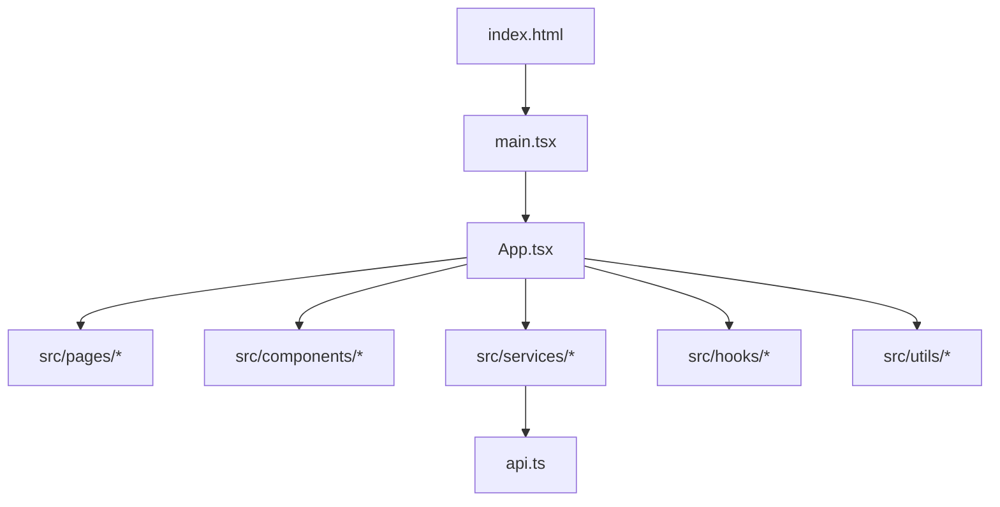
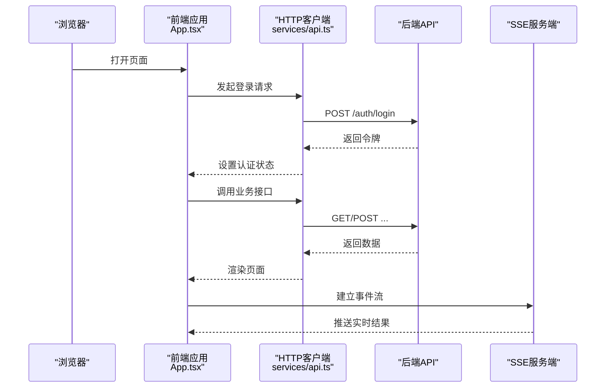
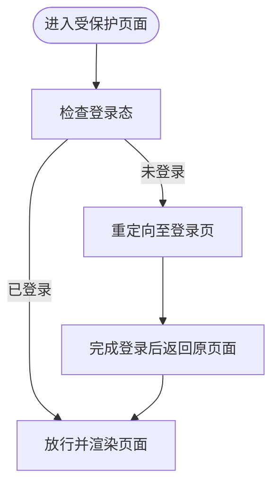

# 开发工作流

<cite>
**本文引用的文件**   
- [frontend/package.json](file://frontend/package.json)
- [frontend/vite.config.ts](file://frontend/vite.config.ts)
- [frontend/tsconfig.json](file://frontend/tsconfig.json)
- [frontend/index.html](file://frontend/index.html)
- [frontend/src/main.tsx](file://frontend/src/main.tsx)
- [frontend/src/App.tsx](file://frontend/src/App.tsx)
- [frontend/src/services/api.ts](file://frontend/src/services/api.ts)
- [frontend/src/hooks/useAuth.tsx](file://frontend/src/hooks/useAuth.tsx)
- [frontend/src/components/ProtectedRoute.tsx](file://frontend/src/components/ProtectedRoute.tsx)
- [start_dev.bat](file://start_dev.bat)
</cite>

## 目录
1. [简介](#简介)
2. [项目结构](#项目结构)
3. [核心组件](#核心组件)
4. [架构总览](#架构总览)
5. [详细组件分析](#详细组件分析)
6. [依赖分析](#依赖分析)
7. [性能考虑](#性能考虑)
8. [故障排查指南](#故障排查指南)
9. [结论](#结论)
10. [附录](#附录)

## 简介
本指南面向AI助教系统的前端开发，聚焦于本地开发环境搭建、依赖管理、构建与部署流程、代码规范与协作规范、调试与性能分析、错误日志收集以及持续集成建议。文档以仓库中的前端工程为基础，结合现有脚本与配置，给出可落地的最佳实践与常见问题解决方案。

## 项目结构
前端采用基于 Vite + TypeScript + React 的工程化方案，入口位于 index.html，应用启动由 main.tsx 初始化，路由与页面组织在 src 下按功能域划分（pages、components、services、hooks、utils）。

图表来源
- [frontend/index.html:1-50](file://frontend/index.html#L1-L50)
- [frontend/src/main.tsx:1-50](file://frontend/src/main.tsx#L1-L50)
- [frontend/src/App.tsx:1-50](file://frontend/src/App.tsx#L1-L50)
- [frontend/src/services/api.ts:1-50](file://frontend/src/services/api.ts#L1-L50)

章节来源
- [frontend/index.html:1-50](file://frontend/index.html#L1-L50)
- [frontend/src/main.tsx:1-50](file://frontend/src/main.tsx#L1-L50)
- [frontend/src/App.tsx:1-50](file://frontend/src/App.tsx#L1-L50)

## 核心组件
- 应用入口与挂载：index.html 提供根容器，main.tsx 负责创建 React 应用并挂载到 DOM。
- 应用壳与路由：App.tsx 作为顶层组件，承载全局布局、路由与权限控制。
- 网络请求层：services/api.ts 封装 HTTP 客户端，统一处理基础地址、拦截器、错误码与重试策略。
- 认证与受保护路由：hooks/useAuth.tsx 提供登录态与用户信息；components/ProtectedRoute.tsx 用于路由级鉴权。

章节来源
- [frontend/src/main.tsx:1-50](file://frontend/src/main.tsx#L1-L50)
- [frontend/src/App.tsx:1-50](file://frontend/src/App.tsx#L1-L50)
- [frontend/src/services/api.ts:1-50](file://frontend/src/services/api.ts#L1-L50)
- [frontend/src/hooks/useAuth.tsx:1-50](file://frontend/src/hooks/useAuth.tsx#L1-L50)
- [frontend/src/components/ProtectedRoute.tsx:1-50](file://frontend/src/components/ProtectedRoute.tsx#L1-L50)

## 架构总览
下图展示前端与后端 API 的交互关系，包括认证、业务服务调用与 SSE 事件流等典型路径。

图表来源
- [frontend/src/App.tsx:1-50](file://frontend/src/App.tsx#L1-L50)
- [frontend/src/services/api.ts:1-50](file://frontend/src/services/api.ts#L1-L50)
- [frontend/src/hooks/useAuth.tsx:1-50](file://frontend/src/hooks/useAuth.tsx#L1-L50)

## 详细组件分析

### 开发环境与依赖管理
- 包管理与脚本：通过 package.json 定义依赖与常用脚本（安装、开发、构建、类型检查、格式化等）。
- 版本锁定：使用 package-lock.json 确保团队一致的依赖树。
- 推荐策略：
  - 固定主版本号，避免破坏性升级影响构建。
  - 新增依赖需评估体积与安全漏洞。
  - 定期运行安全扫描与依赖更新。

章节来源
- [frontend/package.json:1-50](file://frontend/package.json#L1-L50)
- [frontend/package-lock.json:1-50](file://frontend/package-lock.json#L1-L50)

### 本地开发服务器配置
- 启动方式：
  - 使用 npm/yarn/pnpm 执行开发脚本。
  - 或使用仓库提供的 Windows 批处理脚本 start_dev.bat 一键启动。
- 代理与跨域：
  - 在 vite.config.ts 中配置 devServer.proxy，将 /api 等前缀转发至后端服务，解决本地跨域问题。
- 环境变量：
  - 使用 Vite 的环境变量约定（如 VITE_API_BASE_URL），在 .env 或 .env.development 中配置，并在 services/api.ts 中读取。
- 热重载与调试：
  - 启用 Vite HMR，配合浏览器开发者工具进行断点调试。

章节来源
- [frontend/vite.config.ts:1-50](file://frontend/vite.config.ts#L1-L50)
- [frontend/src/services/api.ts:1-50](file://frontend/src/services/api.ts#L1-L50)
- [start_dev.bat:1-50](file://start_dev.bat#L1-L50)

### 代码规范检查与格式化
- TypeScript 类型检查：tsconfig.json 定义编译选项与严格模式，建议在提交前运行类型检查。
- ESLint 与 Prettier：
  - 在 package.json 中声明 lint/format 脚本。
  - 建议配置编辑器保存时自动修复与格式化。
- Git Hooks（可选）：
  - 使用 husky + lint-staged 在提交前对变更文件执行检查与格式化，保证提交质量。

章节来源
- [frontend/tsconfig.json:1-50](file://frontend/tsconfig.json#L1-L50)
- [frontend/package.json:1-50](file://frontend/package.json#L1-L50)

### Git 工作流与分支管理
- 分支模型：
  - main：生产可用分支，仅接受合并后的稳定版本。
  - develop：日常集成分支。
  - feature/*：新功能分支，从 develop 切出，完成后合并回 develop。
  - hotfix/*：紧急修复分支，从 main 切出，修复后同时合并回 main 与 develop。
- 提交规范：
  - 使用约定式提交（feat/fix/docs/chore 等），便于自动生成变更日志。
- 代码审查：
  - 所有变更通过 Pull Request 审查，至少一名维护者批准后方可合并。

章节来源
- [frontend/package.json:1-50](file://frontend/package.json#L1-L50)

### 构建优化与生产部署
- 构建产物：
  - 使用 Vite 构建静态资源，开启压缩、Tree Shaking、按需加载等优化。
- 环境变量：
  - 通过 Vite 的构建环境变量注入后端地址、功能开关等。
- 部署建议：
  - 将 dist 目录部署至静态站点托管（Nginx、CDN、云对象存储等）。
  - 配置反向代理将 /api 转发至后端服务。
  - 开启缓存策略与 HTTPS。

章节来源
- [frontend/vite.config.ts:1-50](file://frontend/vite.config.ts#L1-L50)
- [frontend/package.json:1-50](file://frontend/package.json#L1-L50)

### 认证与会话管理
- 认证流程：
  - 登录成功后，将令牌存入持久化存储（如 localStorage 或 httpOnly Cookie）。
  - useAuth.tsx 提供统一的登录态与用户信息访问。
- 受保护路由：
  - ProtectedRoute.tsx 在路由切换前校验登录态，未登录则跳转至登录页。
- 请求拦截：
  - api.ts 在请求头携带令牌，并在响应拦截器中处理 401 等状态码，必要时刷新令牌或跳转登录。

图表来源
- [frontend/src/components/ProtectedRoute.tsx:1-50](file://frontend/src/components/ProtectedRoute.tsx#L1-L50)
- [frontend/src/hooks/useAuth.tsx:1-50](file://frontend/src/hooks/useAuth.tsx#L1-L50)
- [frontend/src/services/api.ts:1-50](file://frontend/src/services/api.ts#L1-L50)

章节来源
- [frontend/src/hooks/useAuth.tsx:1-50](file://frontend/src/hooks/useAuth.tsx#L1-L50)
- [frontend/src/components/ProtectedRoute.tsx:1-50](file://frontend/src/components/ProtectedRoute.tsx#L1-L50)
- [frontend/src/services/api.ts:1-50](file://frontend/src/services/api.ts#L1-L50)

### 网络请求与错误处理
- 统一基址与拦截器：
  - 在 api.ts 中设置基础 URL、超时、重试与错误码映射。
- 业务错误：
  - 将后端业务错误码转换为前端友好的提示，并记录上下文以便定位问题。
- 网络异常：
  - 捕获网络错误，提供重试与降级策略，保障用户体验。

章节来源
- [frontend/src/services/api.ts:1-50](file://frontend/src/services/api.ts#L1-L50)

### 实时通信（SSE）
- 连接建立：
  - 在需要实时结果的页面建立 SSE 连接，订阅事件流。
- 消息处理：
  - 根据事件类型分发到对应处理器，更新 UI 状态。
- 断线重连：
  - 监听连接关闭事件，实现指数退避重连。

章节来源
- [frontend/src/hooks/useAuth.tsx:1-50](file://frontend/src/hooks/useAuth.tsx#L1-L50)
- [frontend/src/services/api.ts:1-50](file://frontend/src/services/api.ts#L1-L50)

## 依赖分析
- 运行时依赖：React、Vite、TypeScript、UI 库、HTTP 客户端等。
- 开发依赖：ESLint、Prettier、lint-staged、husky、测试框架等。
- 依赖治理：
  - 定期审计依赖安全漏洞。
  - 移除未使用的依赖，减少包体积。
  - 使用锁文件确保一致性。

章节来源
- [frontend/package.json:1-50](file://frontend/package.json#L1-L50)
- [frontend/package-lock.json:1-50](file://frontend/package-lock.json#L1-L50)

## 性能考虑
- 构建优化：
  - 开启代码分割与懒加载，按路由拆分模块。
  - 启用资源压缩与缓存策略。
- 运行时优化：
  - 列表虚拟化、图片懒加载、防抖节流。
  - 合理使用 useMemo/useCallback 避免不必要的重渲染。
- 监控与分析：
  - 使用浏览器 Performance 面板与 Lighthouse 进行性能分析。
  - 接入前端埋点统计关键指标（首屏时间、接口耗时、错误率）。

[本节为通用指导，不直接分析具体文件]

## 故障排查指南
- 开发环境问题：
  - Node 版本不匹配：确认与 package.json 要求的版本一致。
  - 端口占用：修改 vite.config.ts 的端口或释放占用端口。
- 跨域与代理：
  - 检查 vite.config.ts 的代理规则是否覆盖所有后端路径。
  - 确认后端 CORS 配置允许本地域名与端口。
- 构建失败：
  - 清理 node_modules 与缓存后重新安装。
  - 检查 TypeScript 报错与 ESLint 警告。
- 运行时错误：
  - 使用浏览器控制台与 Network 面板定位接口错误。
  - 在 api.ts 的错误拦截器中打印请求上下文与响应体。
- 认证问题：
  - 检查令牌是否正确设置与过期处理逻辑。
  - 确认 ProtectedRoute 的重定向逻辑符合预期。

章节来源
- [frontend/vite.config.ts:1-50](file://frontend/vite.config.ts#L1-L50)
- [frontend/src/services/api.ts:1-50](file://frontend/src/services/api.ts#L1-L50)
- [frontend/src/components/ProtectedRoute.tsx:1-50](file://frontend/src/components/ProtectedRoute.tsx#L1-L50)

## 结论
通过规范的依赖管理、清晰的本地开发与构建流程、严格的代码规范与协作机制，以及完善的调试与性能分析手段，可以显著提升 AI 助教系统前端的交付效率与质量。建议结合持续集成流水线，将上述流程自动化，确保每次提交都经过检查与验证。

[本节为总结性内容，不直接分析具体文件]

## 附录
- 常用命令参考：
  - 安装依赖：npm install / yarn / pnpm install
  - 启动开发：npm run dev / 或直接运行 start_dev.bat
  - 类型检查：npm run type-check
  - 代码检查与格式化：npm run lint / npm run format
  - 构建生产：npm run build
- 环境变量示例键名：
  - VITE_API_BASE_URL：后端 API 基础地址
  - VITE_APP_TITLE：应用标题
  - VITE_ENABLE_SSE：是否启用 SSE

章节来源
- [frontend/package.json:1-50](file://frontend/package.json#L1-L50)
- [frontend/vite.config.ts:1-50](file://frontend/vite.config.ts#L1-L50)
- [start_dev.bat:1-50](file://start_dev.bat#L1-L50)