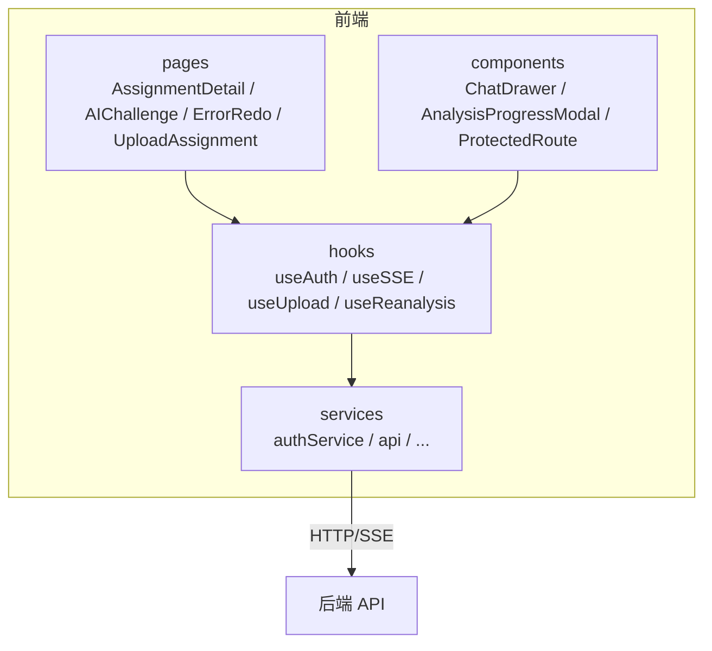
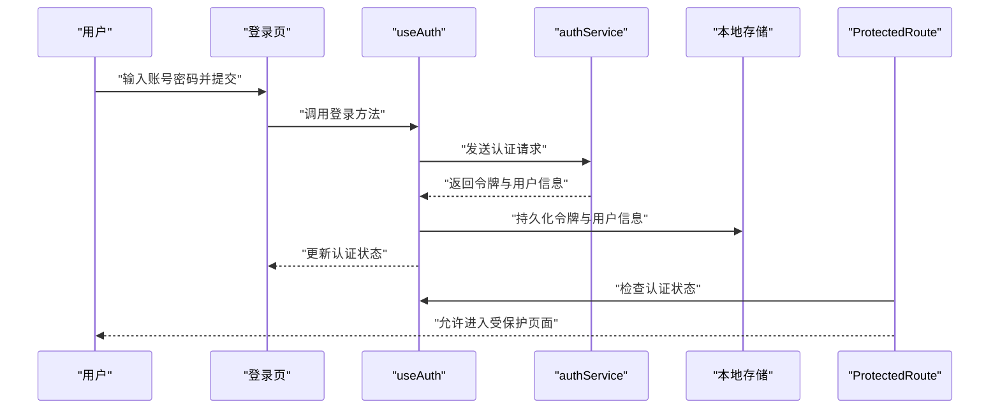
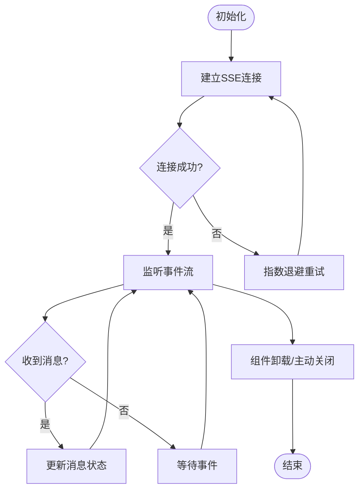
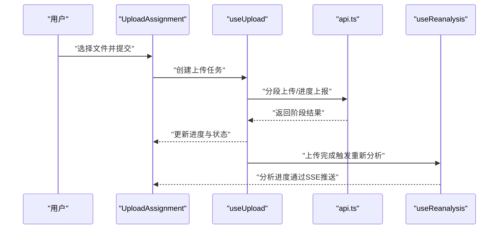
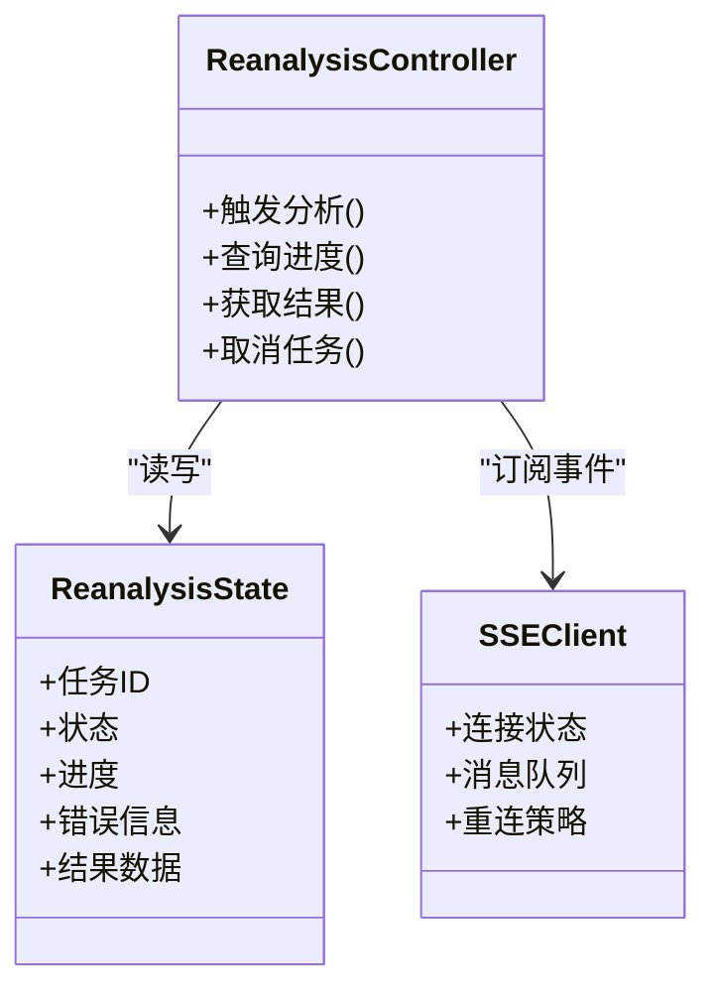
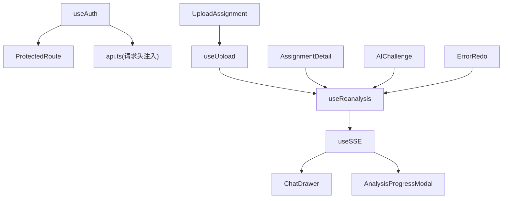
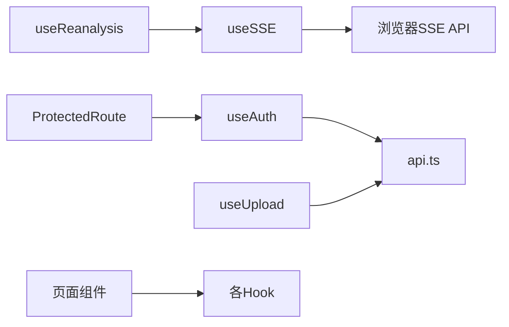

# 状态管理策略

<cite>
**本文引用的文件**   
- [useAuth.tsx](file://frontend/src/hooks/useAuth.tsx)
- [useSSE.ts](file://frontend/src/hooks/useSSE.ts)
- [useUpload.ts](file://frontend/src/hooks/useUpload.ts)
- [useReanalysis.ts](file://frontend/src/hooks/useReanalysis.ts)
- [authService.ts](file://frontend/src/services/authService.ts)
- [api.ts](file://frontend/src/services/api.ts)
- [AssignmentDetail/index.tsx](file://frontend/src/pages/AssignmentManagement/AssignmentDetail/index.tsx)
- [AIChallenge/index.tsx](file://frontend/src/pages/AssignmentManagement/AIChallenge/index.tsx)
- [ErrorRedo/index.tsx](file://frontend/src/pages/AssignmentManagement/ErrorRedo/index.tsx)
- [UploadAssignment/index.tsx](file://frontend/src/pages/AssignmentManagement/UploadAssignment/index.tsx)
- [ChatDrawer.tsx](file://frontend/src/components/ChatDrawer.tsx)
- [AnalysisProgressModal.tsx](file://frontend/src/components/AnalysisProgressModal.tsx)
- [ProtectedRoute.tsx](file://frontend/src/components/ProtectedRoute.tsx)
</cite>

## 目录
1. [引言](#引言)
2. [项目结构](#项目结构)
3. [核心组件](#核心组件)
4. [架构总览](#架构总览)
5. [详细组件分析](#详细组件分析)
6. [依赖分析](#依赖分析)
7. [性能考虑](#性能考虑)
8. [故障排查指南](#故障排查指南)
9. [结论](#结论)
10. [附录](#附录)

## 引言
本指南聚焦于AI助教系统前端的状态管理，围绕四个自定义Hooks展开：认证状态 useAuth、实时通信 useSSE、文件上传 useUpload、重新分析 useReanalysis。文档从设计模式与最佳实践出发，覆盖状态持久化、异步状态处理、错误状态管理、组件间共享方案、全局与局部状态划分原则，并给出调试工具、性能监控与内存泄漏防护建议，以及复杂场景的处理模式与重构建议。

## 项目结构
前端采用“按功能域组织”的目录结构，核心状态逻辑集中在 hooks 目录，业务页面通过 services 调用后端接口，UI 组件消费 hooks 暴露的状态与方法。

图表来源
- [useAuth.tsx](file://frontend/src/hooks/useAuth.tsx)
- [useSSE.ts](file://frontend/src/hooks/useSSE.ts)
- [useUpload.ts](file://frontend/src/hooks/useUpload.ts)
- [useReanalysis.ts](file://frontend/src/hooks/useReanalysis.ts)
- [authService.ts](file://frontend/src/services/authService.ts)
- [api.ts](file://frontend/src/services/api.ts)
- [AssignmentDetail/index.tsx](file://frontend/src/pages/AssignmentManagement/AssignmentDetail/index.tsx)
- [AIChallenge/index.tsx](file://frontend/src/pages/AssignmentManagement/AIChallenge/index.tsx)
- [ErrorRedo/index.tsx](file://frontend/src/pages/AssignmentManagement/ErrorRedo/index.tsx)
- [UploadAssignment/index.tsx](file://frontend/src/pages/AssignmentManagement/UploadAssignment/index.tsx)
- [ChatDrawer.tsx](file://frontend/src/components/ChatDrawer.tsx)
- [AnalysisProgressModal.tsx](file://frontend/src/components/AnalysisProgressModal.tsx)
- [ProtectedRoute.tsx](file://frontend/src/components/ProtectedRoute.tsx)

章节来源
- [useAuth.tsx](file://frontend/src/hooks/useAuth.tsx)
- [useSSE.ts](file://frontend/src/hooks/useSSE.ts)
- [useUpload.ts](file://frontend/src/hooks/useUpload.ts)
- [useReanalysis.ts](file://frontend/src/hooks/useReanalysis.ts)
- [authService.ts](file://frontend/src/services/authService.ts)
- [api.ts](file://frontend/src/services/api.ts)
- [AssignmentDetail/index.tsx](file://frontend/src/pages/AssignmentManagement/AssignmentDetail/index.tsx)
- [AIChallenge/index.tsx](file://frontend/src/pages/AssignmentManagement/AIChallenge/index.tsx)
- [ErrorRedo/index.tsx](file://frontend/src/pages/AssignmentManagement/ErrorRedo/index.tsx)
- [UploadAssignment/index.tsx](file://frontend/src/pages/AssignmentManagement/UploadAssignment/index.tsx)
- [ChatDrawer.tsx](file://frontend/src/components/ChatDrawer.tsx)
- [AnalysisProgressModal.tsx](file://frontend/src/components/AnalysisProgressModal.tsx)
- [ProtectedRoute.tsx](file://frontend/src/components/ProtectedRoute.tsx)

## 核心组件
本节对四个关键自定义Hook进行深度解析，涵盖职责边界、数据流、错误处理、持久化与生命周期管理。

### useAuth 认证状态管理
- 职责
  - 维护登录态、用户信息、令牌等认证相关状态
  - 提供登录、登出、刷新会话等方法
  - 在应用启动时尝试恢复本地持久化的认证信息
- 状态设计
  - 典型字段包括：是否已认证、用户基本信息、令牌、加载与错误状态
  - 将敏感信息（如令牌）持久化到安全存储，并在必要时设置请求拦截器自动携带
- 异步流程
  - 登录成功后保存令牌与用户信息，更新认证状态
  - 登出时清理本地存储与状态，必要时通知其他模块失效缓存
- 错误处理
  - 网络异常、令牌过期、权限不足等错误统一收敛为可展示的错误状态
  - 提供重试或引导用户重新登录的能力
- 持久化策略
  - 使用安全的本地存储保存令牌与必要用户信息
  - 应用初始化时读取并校验，失败则回退为未登录态
- 与其他模块协作
  - 路由守卫（如受保护路由）基于此Hook判断访问权限
  - 服务层在发起请求前注入认证头

图表来源
- [useAuth.tsx](file://frontend/src/hooks/useAuth.tsx)
- [authService.ts](file://frontend/src/services/authService.ts)
- [ProtectedRoute.tsx](file://frontend/src/components/ProtectedRoute.tsx)

章节来源
- [useAuth.tsx](file://frontend/src/hooks/useAuth.tsx)
- [authService.ts](file://frontend/src/services/authService.ts)
- [ProtectedRoute.tsx](file://frontend/src/components/ProtectedRoute.tsx)

### useSSE 实时通信状态处理
- 职责
  - 建立与服务端的事件流连接（SSE），订阅消息事件
  - 维护连接状态、消息队列、重连策略与错误状态
- 状态设计
  - 连接状态：未连接/连接中/已连接/断开
  - 消息列表：按主题或会话聚合的消息数组
  - 错误与重试：最近错误信息、重试次数、退避策略
- 生命周期
  - 组件挂载时建立连接，卸载时关闭连接并清理定时器
  - 支持动态切换主题或会话ID以复用连接
- 错误处理
  - 网络抖动或服务端中断时触发重连，带指数退避
  - 捕获解析错误并记录日志，避免崩溃
- 与组件交互
  - 聊天抽屉等组件订阅消息并渲染
  - 进度面板监听特定事件类型以驱动UI

图表来源
- [useSSE.ts](file://frontend/src/hooks/useSSE.ts)
- [ChatDrawer.tsx](file://frontend/src/components/ChatDrawer.tsx)
- [AnalysisProgressModal.tsx](file://frontend/src/components/AnalysisProgressModal.tsx)

章节来源
- [useSSE.ts](file://frontend/src/hooks/useSSE.ts)
- [ChatDrawer.tsx](file://frontend/src/components/ChatDrawer.tsx)
- [AnalysisProgressModal.tsx](file://frontend/src/components/AnalysisProgressModal.tsx)

### useUpload 文件上传状态控制
- 职责
  - 封装分片/断点续传/进度跟踪/取消上传等能力
  - 管理上传任务的生命周期与结果回调
- 状态设计
  - 任务列表：每个文件的上传进度、状态、错误信息
  - 全局控制：批量操作、取消全部、重试单个
- 异步流程
  - 选择文件后创建任务，逐步推进上传阶段
  - 上传完成后触发后续处理（如提交作业、触发分析）
- 错误处理
  - 网络失败、服务端拒绝、文件过大等错误分类提示
  - 支持断点续传与手动重试
- 与业务集成
  - 作业上传页面直接消费该Hook
  - 上传完成后可联动重新分析流程

图表来源
- [useUpload.ts](file://frontend/src/hooks/useUpload.ts)
- [api.ts](file://frontend/src/services/api.ts)
- [useReanalysis.ts](file://frontend/src/hooks/useReanalysis.ts)
- [UploadAssignment/index.tsx](file://frontend/src/pages/AssignmentManagement/UploadAssignment/index.tsx)

章节来源
- [useUpload.ts](file://frontend/src/hooks/useUpload.ts)
- [api.ts](file://frontend/src/services/api.ts)
- [useReanalysis.ts](file://frontend/src/hooks/useReanalysis.ts)
- [UploadAssignment/index.tsx](file://frontend/src/pages/AssignmentManagement/UploadAssignment/index.tsx)

### useReanalysis 重新分析状态管理
- 职责
  - 管理作业或题目的重新分析任务，协调上传、调度与结果展示
  - 与SSE对接，接收分析进度与最终报告
- 状态设计
  - 任务状态：待处理/进行中/已完成/失败
  - 进度信息：百分比、阶段描述、错误详情
  - 结果数据：分析报告、知识点掌握度等
- 异步流程
  - 触发条件：上传完成、用户手动点击、系统定时任务
  - 通过SSE订阅分析事件，实时更新UI
- 错误处理
  - 任务失败时提供重试入口与错误原因
  - 超时或中断时保留中间状态以便恢复
- 与组件协作
  - 分析进度弹窗显示实时进度
  - 作业详情页展示最终分析结果

图表来源
- [useReanalysis.ts](file://frontend/src/hooks/useReanalysis.ts)
- [useSSE.ts](file://frontend/src/hooks/useSSE.ts)
- [AnalysisProgressModal.tsx](file://frontend/src/components/AnalysisProgressModal.tsx)
- [AssignmentDetail/index.tsx](file://frontend/src/pages/AssignmentManagement/AssignmentDetail/index.tsx)

章节来源
- [useReanalysis.ts](file://frontend/src/hooks/useReanalysis.ts)
- [useSSE.ts](file://frontend/src/hooks/useSSE.ts)
- [AnalysisProgressModal.tsx](file://frontend/src/components/AnalysisProgressModal.tsx)
- [AssignmentDetail/index.tsx](file://frontend/src/pages/AssignmentManagement/AssignmentDetail/index.tsx)

## 架构总览
整体状态管理遵循“单一职责、最小共享面”的原则：
- 全局状态：认证、SSE连接、上传任务集合、分析任务集合
- 局部状态：表单输入、弹窗显隐、分页参数等
- 跨组件共享：通过Context或组合式Hook在父级集中管理，子组件仅消费所需片段

图表来源
- [useAuth.tsx](file://frontend/src/hooks/useAuth.tsx)
- [ProtectedRoute.tsx](file://frontend/src/components/ProtectedRoute.tsx)
- [api.ts](file://frontend/src/services/api.ts)
- [useUpload.ts](file://frontend/src/hooks/useUpload.ts)
- [useReanalysis.ts](file://frontend/src/hooks/useReanalysis.ts)
- [useSSE.ts](file://frontend/src/hooks/useSSE.ts)
- [ChatDrawer.tsx](file://frontend/src/components/ChatDrawer.tsx)
- [AnalysisProgressModal.tsx](file://frontend/src/components/AnalysisProgressModal.tsx)
- [AssignmentDetail/index.tsx](file://frontend/src/pages/AssignmentManagement/AssignmentDetail/index.tsx)
- [AIChallenge/index.tsx](file://frontend/src/pages/AssignmentManagement/AIChallenge/index.tsx)
- [ErrorRedo/index.tsx](file://frontend/src/pages/AssignmentManagement/ErrorRedo/index.tsx)
- [UploadAssignment/index.tsx](file://frontend/src/pages/AssignmentManagement/UploadAssignment/index.tsx)

## 详细组件分析

### 认证状态（useAuth）最佳实践
- 设计要点
  - 将认证状态与UI解耦，提供纯函数式API
  - 在应用启动时执行一次静默校验，避免重复登录
  - 将令牌与用户信息持久化，确保刷新后保持登录态
- 错误与边界
  - 令牌过期自动跳转登录页
  - 网络不可用时降级为离线提示
- 与路由集成
  - 受保护路由根据认证状态决定渲染内容或重定向

章节来源
- [useAuth.tsx](file://frontend/src/hooks/useAuth.tsx)
- [ProtectedRoute.tsx](file://frontend/src/components/ProtectedRoute.tsx)

### 实时通信（useSSE）最佳实践
- 设计要点
  - 连接池化管理，避免重复建立连接
  - 消息去重与顺序保证，防止乱序导致UI错乱
  - 重连策略稳定可靠，避免风暴式重试
- 错误与边界
  - 捕获JSON解析错误，记录上下文便于定位
  - 长时间无心跳时主动断开并重试
- 与组件集成
  - 聊天抽屉按需订阅，减少无关消息处理开销
  - 进度弹窗只关注分析事件类型

章节来源
- [useSSE.ts](file://frontend/src/hooks/useSSE.ts)
- [ChatDrawer.tsx](file://frontend/src/components/ChatDrawer.tsx)
- [AnalysisProgressModal.tsx](file://frontend/src/components/AnalysisProgressModal.tsx)

### 文件上传（useUpload）最佳实践
- 设计要点
  - 分片上传与并发控制，提升大文件体验
  - 进度上报与可视化反馈，增强用户感知
  - 取消与重试机制，提高容错性
- 错误与边界
  - 区分网络错误与服务端错误，提供不同处理策略
  - 超大文件提前校验，避免无效上传
- 与业务联动
  - 上传完成后自动触发重新分析，形成闭环

章节来源
- [useUpload.ts](file://frontend/src/hooks/useUpload.ts)
- [api.ts](file://frontend/src/services/api.ts)
- [UploadAssignment/index.tsx](file://frontend/src/pages/AssignmentManagement/UploadAssignment/index.tsx)

### 重新分析（useReanalysis）最佳实践
- 设计要点
  - 任务幂等设计，避免重复触发
  - 与SSE紧密耦合，实时同步分析进度
  - 结果缓存与增量更新，减少重复计算
- 错误与边界
  - 任务失败保留上下文，支持一键重试
  - 长耗时任务提供取消与暂停能力
- 与页面集成
  - 作业详情页展示最终报告
  - 挑战与错题页面联动分析结果

章节来源
- [useReanalysis.ts](file://frontend/src/hooks/useReanalysis.ts)
- [useSSE.ts](file://frontend/src/hooks/useSSE.ts)
- [AssignmentDetail/index.tsx](file://frontend/src/pages/AssignmentManagement/AssignmentDetail/index.tsx)
- [AIChallenge/index.tsx](file://frontend/src/pages/AssignmentManagement/AIChallenge/index.tsx)
- [ErrorRedo/index.tsx](file://frontend/src/pages/AssignmentManagement/ErrorRedo/index.tsx)

## 依赖分析
- 组件耦合
  - 页面组件依赖对应Hook，Hook再依赖服务层与浏览器API
  - 受保护路由依赖认证Hook，实现访问控制
- 外部依赖
  - HTTP客户端用于常规请求
  - SSE客户端用于事件流
  - 本地存储用于持久化
- 潜在循环依赖
  - 避免Hook之间相互import，必要时通过回调或事件总线解耦

图表来源
- [useAuth.tsx](file://frontend/src/hooks/useAuth.tsx)
- [useSSE.ts](file://frontend/src/hooks/useSSE.ts)
- [useUpload.ts](file://frontend/src/hooks/useUpload.ts)
- [useReanalysis.ts](file://frontend/src/hooks/useReanalysis.ts)
- [api.ts](file://frontend/src/services/api.ts)
- [ProtectedRoute.tsx](file://frontend/src/components/ProtectedRoute.tsx)

章节来源
- [useAuth.tsx](file://frontend/src/hooks/useAuth.tsx)
- [useSSE.ts](file://frontend/src/hooks/useSSE.ts)
- [useUpload.ts](file://frontend/src/hooks/useUpload.ts)
- [useReanalysis.ts](file://frontend/src/hooks/useReanalysis.ts)
- [api.ts](file://frontend/src/services/api.ts)
- [ProtectedRoute.tsx](file://frontend/src/components/ProtectedRoute.tsx)

## 性能考虑
- 状态粒度
  - 将频繁更新的SSE消息与低频的认证状态分离，避免不必要的重渲染
- 计算优化
  - 对分析结果进行缓存与增量更新，减少重复计算
- 资源管理
  - 及时关闭SSE连接与定时器，避免内存泄漏
- 网络优化
  - 合并小请求、启用压缩、合理设置超时与重试

[本节为通用指导，不直接分析具体文件]

## 故障排查指南
- 常见问题
  - 认证失败：检查令牌是否过期、本地存储是否被清空、请求头是否正确注入
  - SSE断连：查看重连日志、确认服务端事件流是否正常、浏览器兼容性
  - 上传失败：核对文件大小限制、分片大小、网络稳定性
  - 分析任务失败：查看任务状态与错误信息，确认依赖资源是否就绪
- 调试技巧
  - 在Hook内部增加结构化日志，包含时间戳、任务ID、错误堆栈
  - 使用浏览器开发者工具的Network与Performance面板定位瓶颈
  - 针对SSE，使用控制台过滤事件类型，观察消息序列

章节来源
- [useAuth.tsx](file://frontend/src/hooks/useAuth.tsx)
- [useSSE.ts](file://frontend/src/hooks/useSSE.ts)
- [useUpload.ts](file://frontend/src/hooks/useUpload.ts)
- [useReanalysis.ts](file://frontend/src/hooks/useReanalysis.ts)

## 结论
通过统一的自定义Hook抽象，AI助教系统实现了清晰的状态分层与职责边界。认证、实时通信、上传与分析四大领域各司其职，既保证了用户体验的流畅性，也提升了系统的可维护性与可扩展性。建议在后续迭代中持续完善错误分类、性能监控与自动化测试，进一步提升系统健壮性。

[本节为总结性内容，不直接分析具体文件]

## 附录
- 全局与局部状态划分原则
  - 全局：认证、连接、任务集合；局部：表单、弹窗、分页
- 组件间共享方案
  - 父级集中管理并通过props或回调传递；必要时引入轻量Context
- 复杂场景处理模式
  - 多步骤流程：用有限状态机建模，明确状态迁移与守卫条件
  - 长任务：结合SSE与轮询兜底，提供取消与重试
- 重构建议
  - 将业务无关的通用逻辑下沉至独立Hook
  - 对大型Hook进行拆分，按领域拆分为更小的原子Hook

[本节为概念性内容，不直接分析具体文件]