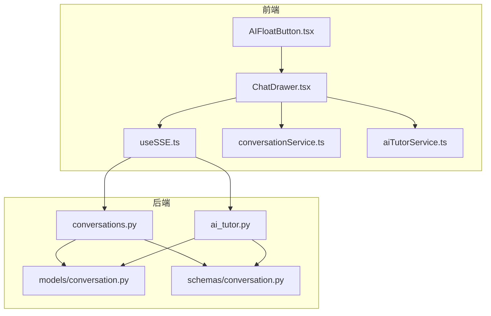
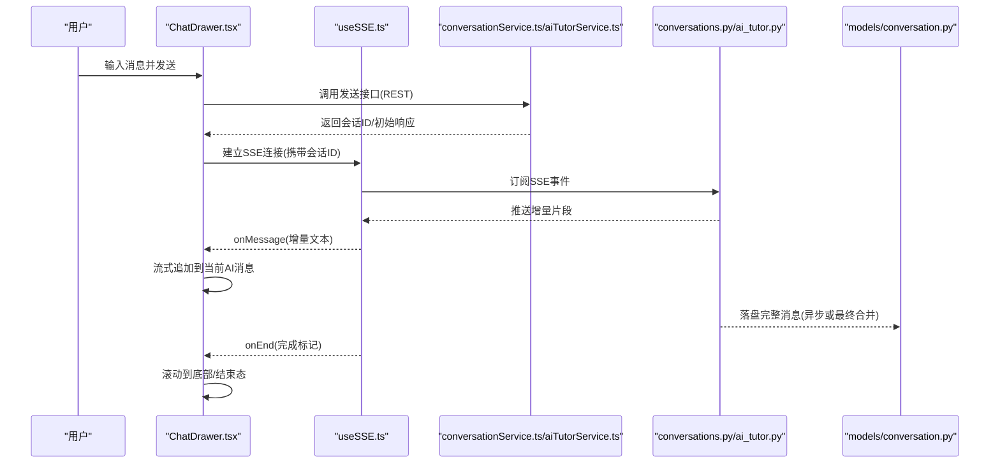
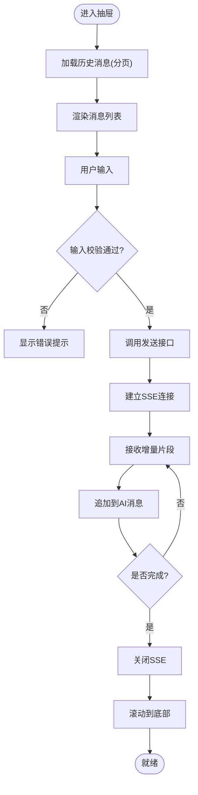
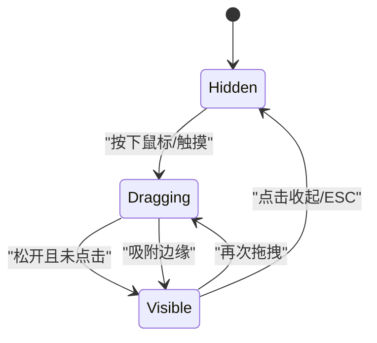
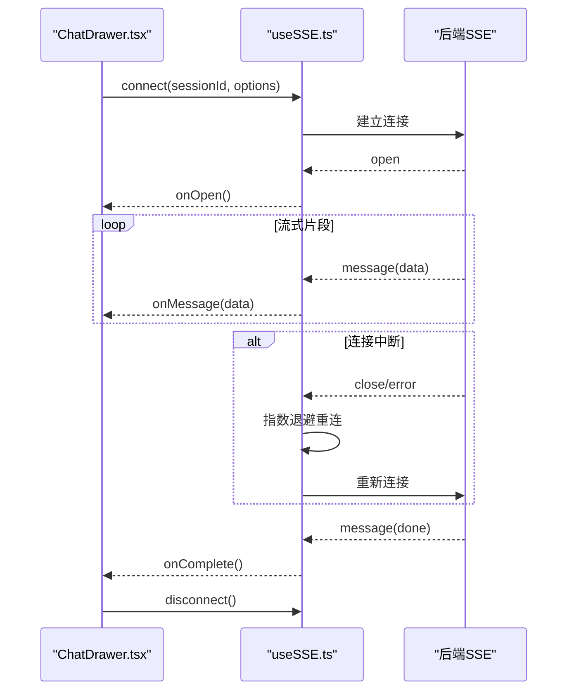
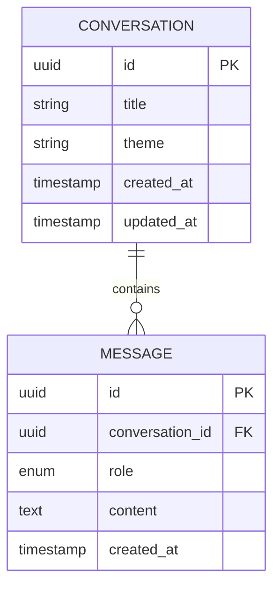
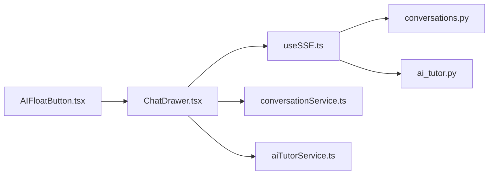

# AI对话组件

<cite>
**本文引用的文件**   
- [ChatDrawer.tsx](file://frontend/src/components/ChatDrawer.tsx)
- [AIFloatButton.tsx](file://frontend/src/components/AIFloatButton.tsx)
- [useSSE.ts](file://frontend/src/hooks/useSSE.ts)
- [conversationService.ts](file://frontend/src/services/conversationService.ts)
- [aiTutorService.ts](file://frontend/src/services/aiTutorService.ts)
- [conversations.py](file://backend/app/api/v1/conversations.py)
- [ai_tutor.py](file://backend/app/api/v1/ai_tutor.py)
- [conversation.py](file://backend/app/models/conversation.py)
- [conversation.py](file://backend/app/schemas/conversation.py)
</cite>

## 目录
1. [简介](#简介)
2. [项目结构](#项目结构)
3. [核心组件](#核心组件)
4. [架构总览](#架构总览)
5. [详细组件分析](#详细组件分析)
6. [依赖关系分析](#依赖关系分析)
7. [性能考虑](#性能考虑)
8. [故障排查指南](#故障排查指南)
9. [结论](#结论)
10. [附录](#附录)

## 简介
本文件面向AI对话相关的前后端组件，聚焦以下目标：
- ChatDrawer聊天抽屉：消息列表渲染、输入框交互、实时通信集成
- AIFloatButton浮动按钮：状态管理、位置控制、动画效果
- SSE实时消息接收与断线重连机制
- 消息历史记录管理与多轮对话上下文维护
- AI回复流式渲染、用户输入校验
- 对话主题切换、消息搜索过滤、导出分享功能

## 项目结构
前端负责UI与交互（抽屉、浮动按钮、SSE Hook、服务层），后端提供REST/SSE接口与持久化模型。关键文件如下：
- 前端组件与服务
  - ChatDrawer.tsx：聊天抽屉主组件
  - AIFloatButton.tsx：悬浮入口按钮
  - useSSE.ts：SSE连接与事件处理Hook
  - conversationService.ts / aiTutorService.ts：API封装
- 后端API与模型
  - conversations.py / ai_tutor.py：对话与AI助教接口
  - models/conversation.py / schemas/conversation.py：数据模型与序列化

图表来源
- [ChatDrawer.tsx](file://frontend/src/components/ChatDrawer.tsx)
- [AIFloatButton.tsx](file://frontend/src/components/AIFloatButton.tsx)
- [useSSE.ts](file://frontend/src/hooks/useSSE.ts)
- [conversationService.ts](file://frontend/src/services/conversationService.ts)
- [aiTutorService.ts](file://frontend/src/services/aiTutorService.ts)
- [conversations.py](file://backend/app/api/v1/conversations.py)
- [ai_tutor.py](file://backend/app/api/v1/ai_tutor.py)
- [conversation.py](file://backend/app/models/conversation.py)
- [conversation.py](file://backend/app/schemas/conversation.py)

章节来源
- [ChatDrawer.tsx](file://frontend/src/components/ChatDrawer.tsx)
- [AIFloatButton.tsx](file://frontend/src/components/AIFloatButton.tsx)
- [useSSE.ts](file://frontend/src/hooks/useSSE.ts)
- [conversationService.ts](file://frontend/src/services/conversationService.ts)
- [aiTutorService.ts](file://frontend/src/services/aiTutorService.ts)
- [conversations.py](file://backend/app/api/v1/conversations.py)
- [ai_tutor.py](file://backend/app/api/v1/ai_tutor.py)
- [conversation.py](file://backend/app/models/conversation.py)
- [conversation.py](file://backend/app/schemas/conversation.py)

## 核心组件
- ChatDrawer聊天抽屉
  - 职责：承载会话历史、消息渲染、输入区、发送逻辑、搜索过滤、导出分享、主题切换等
  - 关键能力：消息列表滚动定位、增量更新、流式渲染、错误提示、键盘快捷键
- AIFloatButton浮动按钮
  - 职责：全局入口、打开/关闭抽屉、拖拽定位、吸附边缘、动画过渡
  - 关键能力：状态机（隐藏/显示/拖拽中）、边界检测、防抖节流、无障碍支持
- useSSE实时通信Hook
  - 职责：建立SSE连接、解析事件、断线重连、心跳保活、错误恢复
  - 关键能力：指数退避重试、超时控制、事件去重、内存泄漏防护
- 服务层
  - conversationService.ts：会话CRUD、分页、搜索、导出
  - aiTutorService.ts：发起AI对话、获取历史、上传附件等

章节来源
- [ChatDrawer.tsx](file://frontend/src/components/ChatDrawer.tsx)
- [AIFloatButton.tsx](file://frontend/src/components/AIFloatButton.tsx)
- [useSSE.ts](file://frontend/src/hooks/useSSE.ts)
- [conversationService.ts](file://frontend/src/services/conversationService.ts)
- [aiTutorService.ts](file://frontend/src/services/aiTutorService.ts)

## 架构总览
整体采用“前端组件 + Hook + 服务层”与“后端REST/SSE + 模型/Schema”的分层架构。SSE用于AI回复的流式推送；REST用于会话管理、历史查询与导出。

图表来源
- [ChatDrawer.tsx](file://frontend/src/components/ChatDrawer.tsx)
- [useSSE.ts](file://frontend/src/hooks/useSSE.ts)
- [conversationService.ts](file://frontend/src/services/conversationService.ts)
- [aiTutorService.ts](file://frontend/src/services/aiTutorService.ts)
- [conversations.py](file://backend/app/api/v1/conversations.py)
- [ai_tutor.py](file://backend/app/api/v1/ai_tutor.py)
- [conversation.py](file://backend/app/models/conversation.py)

## 详细组件分析

### ChatDrawer聊天抽屉
- 消息列表渲染
  - 使用虚拟滚动或按需渲染策略，避免长列表卡顿
  - 区分用户/AI消息样式，支持Markdown/代码高亮
  - 流式追加时保持滚动锚点，必要时智能回滚
- 输入框交互
  - 支持回车发送、Shift+换行、粘贴图片/文件、字数限制、占位符提示
  - 输入校验：空内容拦截、敏感词/长度/格式校验、错误提示
- 实时通信集成
  - 通过useSSE订阅SSE事件，按会话ID路由消息
  - 对onMessage/onError/onClose进行统一处理
- 搜索过滤
  - 基于关键词匹配消息内容，支持大小写不敏感、模糊匹配
  - 搜索结果高亮，快速定位
- 导出分享
  - 支持导出为文本/Markdown/PDF，包含时间戳与元信息
  - 生成分享链接或二维码（可选）
- 主题切换
  - 支持浅色/深色模式，动态切换CSS变量或主题类名
  - 记忆用户偏好至本地存储

图表来源
- [ChatDrawer.tsx](file://frontend/src/components/ChatDrawer.tsx)
- [useSSE.ts](file://frontend/src/hooks/useSSE.ts)
- [conversationService.ts](file://frontend/src/services/conversationService.ts)
- [aiTutorService.ts](file://frontend/src/services/aiTutorService.ts)

章节来源
- [ChatDrawer.tsx](file://frontend/src/components/ChatDrawer.tsx)
- [conversationService.ts](file://frontend/src/services/conversationService.ts)
- [aiTutorService.ts](file://frontend/src/services/aiTutorService.ts)

### AIFloatButton浮动按钮
- 状态管理
  - 状态：隐藏/显示/拖拽中
  - 触发：点击打开抽屉、点击收起、ESC关闭
- 位置控制
  - 默认右下角，支持拖拽移动
  - 边界检测与吸附边缘，防止移出可视区域
- 动画效果
  - 打开/收起使用过渡动画
  - 拖拽过程平滑跟随，释放后缓动归位
- 可访问性
  - 键盘导航、焦点管理、ARIA标签

图表来源
- [AIFloatButton.tsx](file://frontend/src/components/AIFloatButton.tsx)

章节来源
- [AIFloatButton.tsx](file://frontend/src/components/AIFloatButton.tsx)

### useSSE实时通信Hook
- 连接生命周期
  - 初始化：携带会话ID、鉴权头、超时配置
  - 事件：onopen/onmessage/onerror/onclose
  - 清理：组件卸载时断开连接，防止内存泄漏
- 断线重连
  - 指数退避重试，最大重试次数与上限间隔
  - 心跳检测与保活，异常自动恢复
- 消息处理
  - 事件类型分发：文本片段、完成标记、错误码
  - 去重与幂等：基于序列号或时间戳
- 错误处理
  - 网络异常、服务端错误、超时降级
  - 用户可见的错误提示与重试入口

图表来源
- [useSSE.ts](file://frontend/src/hooks/useSSE.ts)
- [conversations.py](file://backend/app/api/v1/conversations.py)
- [ai_tutor.py](file://backend/app/api/v1/ai_tutor.py)

章节来源
- [useSSE.ts](file://frontend/src/hooks/useSSE.ts)
- [conversations.py](file://backend/app/api/v1/conversations.py)
- [ai_tutor.py](file://backend/app/api/v1/ai_tutor.py)

### 后端API与数据模型
- REST接口
  - 会话创建/查询/更新/删除
  - 消息分页、搜索、导出
- SSE接口
  - 按会话ID推送增量片段与完成信号
- 数据模型
  - 会话实体：ID、标题、主题、创建/更新时间
  - 消息实体：角色、内容、时间戳、附件信息
- 序列化
  - 统一响应格式、错误码规范

图表来源
- [conversation.py](file://backend/app/models/conversation.py)
- [conversation.py](file://backend/app/schemas/conversation.py)

章节来源
- [conversations.py](file://backend/app/api/v1/conversations.py)
- [ai_tutor.py](file://backend/app/api/v1/ai_tutor.py)
- [conversation.py](file://backend/app/models/conversation.py)
- [conversation.py](file://backend/app/schemas/conversation.py)

## 依赖关系分析
- 组件耦合
  - ChatDrawer依赖useSSE与两个服务层模块
  - AIFloatButton仅与ChatDrawer存在显式交互（打开/关闭）
- 外部依赖
  - SSE客户端库（浏览器原生EventSource或第三方）
  - Markdown渲染器、导出工具库
- 潜在循环依赖
  - 建议将SSE逻辑完全收敛于Hook，避免组件直接引用后端实现

图表来源
- [ChatDrawer.tsx](file://frontend/src/components/ChatDrawer.tsx)
- [AIFloatButton.tsx](file://frontend/src/components/AIFloatButton.tsx)
- [useSSE.ts](file://frontend/src/hooks/useSSE.ts)
- [conversationService.ts](file://frontend/src/services/conversationService.ts)
- [aiTutorService.ts](file://frontend/src/services/aiTutorService.ts)
- [conversations.py](file://backend/app/api/v1/conversations.py)
- [ai_tutor.py](file://backend/app/api/v1/ai_tutor.py)

章节来源
- [ChatDrawer.tsx](file://frontend/src/components/ChatDrawer.tsx)
- [AIFloatButton.tsx](file://frontend/src/components/AIFloatButton.tsx)
- [useSSE.ts](file://frontend/src/hooks/useSSE.ts)
- [conversationService.ts](file://frontend/src/services/conversationService.ts)
- [aiTutorService.ts](file://frontend/src/services/aiTutorService.ts)
- [conversations.py](file://backend/app/api/v1/conversations.py)
- [ai_tutor.py](file://backend/app/api/v1/ai_tutor.py)

## 性能考虑
- 消息列表
  - 虚拟滚动/窗口化渲染，减少DOM节点数量
  - 增量更新而非全量替换，避免重排重绘
- 流式渲染
  - 节流追加频率，避免频繁setState导致抖动
  - 大段文本分片渲染，结合requestIdleCallback
- SSE重连
  - 指数退避与最大重试上限，避免雪崩
  - 连接池复用与会话绑定，降低握手开销
- 导出分享
  - 异步生成与下载，避免阻塞主线程
  - 大文档分块打包与压缩

[本节为通用指导，无需具体文件来源]

## 故障排查指南
- SSE连接失败
  - 检查鉴权头与会话ID是否正确传递
  - 查看网络面板是否有跨域或超时错误
  - 确认后端SSE端点可用与权限控制
- 消息丢失或重复
  - 核对事件序列号/时间戳，确保幂等处理
  - 检查重连后的补发逻辑
- 输入校验失败
  - 明确错误码与提示文案
  - 记录用户输入摘要（脱敏）便于复现
- 导出失败
  - 检查文件大小与格式限制
  - 验证浏览器下载权限与安全策略

章节来源
- [useSSE.ts](file://frontend/src/hooks/useSSE.ts)
- [conversationService.ts](file://frontend/src/services/conversationService.ts)
- [aiTutorService.ts](file://frontend/src/services/aiTutorService.ts)
- [conversations.py](file://backend/app/api/v1/conversations.py)
- [ai_tutor.py](file://backend/app/api/v1/ai_tutor.py)

## 结论
本方案以ChatDrawer为核心交互入口，配合AIFloatButton提升可达性，通过useSSE实现稳定高效的流式通信。前后端分层清晰、职责单一，具备可扩展性与可维护性。建议在后续迭代中完善错误监控、性能埋点与国际化支持。

[本节为总结，无需具体文件来源]

## 附录
- 术语
  - SSE：Server-Sent Events，服务器推送事件
  - 流式渲染：增量接收并逐步展示AI回复
  - 指数退避：重试间隔随失败次数呈指数增长
- 最佳实践
  - 组件内只持有必要状态，复杂逻辑下沉至Hook或服务层
  - 对外暴露最小API，内部实现可替换
  - 所有用户输入均需服务端二次校验

[本节为补充说明，无需具体文件来源]