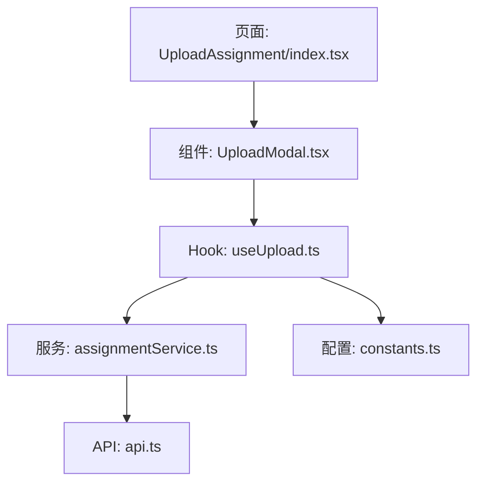
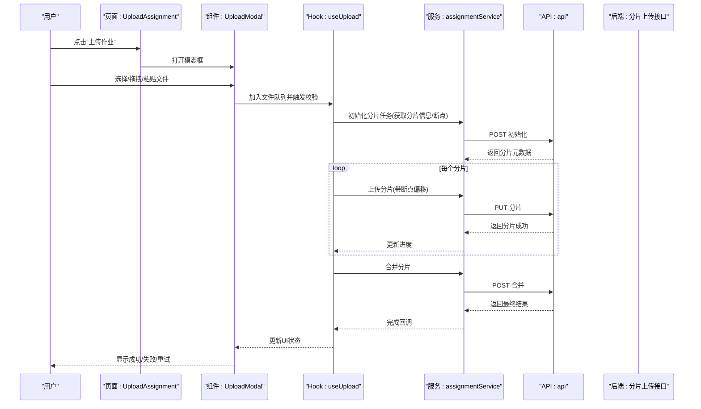
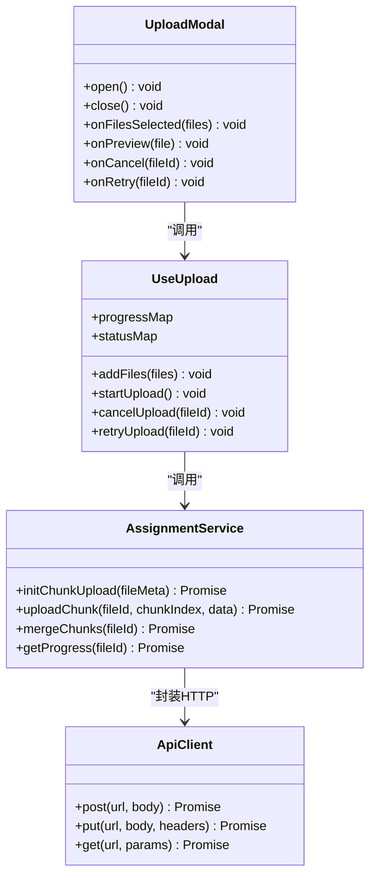
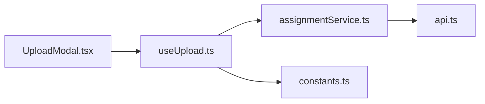

# 上传模态框组件

<cite>
**本文引用的文件**   
- [UploadModal.tsx](file://frontend/src/components/UploadModal.tsx)
- [useUpload.ts](file://frontend/src/hooks/useUpload.ts)
- [assignmentService.ts](file://frontend/src/services/assignmentService.ts)
- [api.ts](file://frontend/src/services/api.ts)
- [constants.ts](file://frontend/src/utils/constants.ts)
- [AssignmentManagement/UploadAssignment/index.tsx](file://frontend/src/pages/AssignmentManagement/UploadAssignment/index.tsx)
</cite>

## 目录
1. [简介](#简介)
2. [项目结构](#项目结构)
3. [核心组件](#核心组件)
4. [架构总览](#架构总览)
5. [详细组件分析](#详细组件分析)
6. [依赖关系分析](#依赖关系分析)
7. [性能考虑](#性能考虑)
8. [故障排查指南](#故障排查指南)
9. [结论](#结论)
10. [附录](#附录)

## 简介
本文件围绕前端“上传模态框”组件进行系统化开发文档编写，聚焦以下能力：
- 文件选择器实现与多文件批量处理
- 支持的文件格式验证、文件大小限制检查
- 上传进度条显示、断点续传支持（方案设计与集成点）
- 预览功能实现、图片压缩优化、PDF 文件解析
- 拖拽上传、粘贴上传、云存储集成
- 失败重试机制、错误提示展示、取消上传操作

该组件服务于作业上传等场景，通过统一的 Hook 与服务层封装，提供一致的用户体验与可维护的扩展点。

## 项目结构
与上传模态框相关的代码主要分布在以下位置：
- 组件层：UploadModal.tsx
- 逻辑层：useUpload.ts（上传状态机、进度、重试、取消、分片等）
- 服务层：assignmentService.ts、api.ts（HTTP 请求、分片上传接口调用）
- 配置层：constants.ts（允许的文件类型、大小上限等常量）
- 页面集成：AssignmentManagement/UploadAssignment/index.tsx（触发模态框、接收回调）

图表来源
- [AssignmentManagement/UploadAssignment/index.tsx](file://frontend/src/pages/AssignmentManagement/UploadAssignment/index.tsx)
- [UploadModal.tsx](file://frontend/src/components/UploadModal.tsx)
- [useUpload.ts](file://frontend/src/hooks/useUpload.ts)
- [assignmentService.ts](file://frontend/src/services/assignmentService.ts)
- [api.ts](file://frontend/src/services/api.ts)
- [constants.ts](file://frontend/src/utils/constants.ts)

章节来源
- [UploadModal.tsx](file://frontend/src/components/UploadModal.tsx)
- [useUpload.ts](file://frontend/src/hooks/useUpload.ts)
- [assignmentService.ts](file://frontend/src/services/assignmentService.ts)
- [api.ts](file://frontend/src/services/api.ts)
- [constants.ts](file://frontend/src/utils/constants.ts)
- [AssignmentManagement/UploadAssignment/index.tsx](file://frontend/src/pages/AssignmentManagement/UploadAssignment/index.tsx)

## 核心组件
- 上传模态框（UploadModal.tsx）
  - 负责用户交互：打开/关闭、选择文件、拖拽区域、粘贴区域、预览面板、进度列表、错误提示、取消按钮
  - 将文件队列与上传状态委托给 useUpload Hook
  - 根据文件类型渲染不同预览（图片缩略图、PDF 预览）
- 上传 Hook（useUpload.ts）
  - 管理文件队列、校验规则、进度跟踪、并发控制、重试策略、取消信号
  - 对接 assignmentService 的分片上传流程（初始化、分片上传、合并）
  - 暴露统一的状态与操作方法供组件消费
- 服务层（assignmentService.ts、api.ts）
  - 封装 HTTP 请求、分片上传、进度上报、错误码映射
  - 提供断点续传所需的上次进度查询与分片去重能力
- 配置（constants.ts）
  - 定义允许的文件扩展名、MIME 类型、最大文件大小、分片大小、并发数等

章节来源
- [UploadModal.tsx](file://frontend/src/components/UploadModal.tsx)
- [useUpload.ts](file://frontend/src/hooks/useUpload.ts)
- [assignmentService.ts](file://frontend/src/services/assignmentService.ts)
- [api.ts](file://frontend/src/services/api.ts)
- [constants.ts](file://frontend/src/utils/constants.ts)

## 架构总览
上传流程从用户交互到服务端落盘的端到端时序如下：

图表来源
- [useUpload.ts](file://frontend/src/hooks/useUpload.ts)
- [assignmentService.ts](file://frontend/src/services/assignmentService.ts)
- [api.ts](file://frontend/src/services/api.ts)
- [AssignmentManagement/UploadAssignment/index.tsx](file://frontend/src/pages/AssignmentManagement/UploadAssignment/index.tsx)
- [UploadModal.tsx](file://frontend/src/components/UploadModal.tsx)

## 详细组件分析

### 文件选择器与批量处理
- 支持三种输入方式：
  - 传统文件选择器（input[type=file]），支持 multiple
  - 拖拽区域（dragover/drop）
  - 剪贴板粘贴（paste）
- 批量处理策略：
  - 去重：基于文件名+大小+最后修改时间
  - 排序：按添加顺序或大小优先级
  - 并发：通过并发上限控制同时上传数量
  - 队列：未完成的任务进入等待队列，完成后自动取下一个

章节来源
- [UploadModal.tsx](file://frontend/src/components/UploadModal.tsx)
- [useUpload.ts](file://frontend/src/hooks/useUpload.ts)

### 文件格式验证与大小限制
- 白名单校验：
  - 扩展名匹配（如 .pdf, .jpg, .png, .docx 等）
  - MIME 类型二次校验
- 大小限制：
  - 单文件上限（由常量配置）
  - 超出时即时提示并拒绝入队
- 特殊类型处理：
  - PDF：仅用于预览与解析，不直接作为作业内容（视业务而定）
  - 图片：可选压缩后再上传

章节来源
- [constants.ts](file://frontend/src/utils/constants.ts)
- [useUpload.ts](file://frontend/src/hooks/useUpload.ts)

### 上传进度条与断点续传
- 进度展示：
  - 全局进度（所有文件累计）
  - 单文件进度（分片累计）
  - 实时百分比与剩余时间估算
- 断点续传：
  - 初始化阶段向服务端查询已上传分片集合
  - 跳过已存在分片，仅补传缺失部分
  - 失败后记录偏移量，下次恢复继续上传
- 取消上传：
  - 使用 AbortController 中断当前请求
  - 清理本地临时分片缓存（若采用浏览器缓存）

章节来源
- [useUpload.ts](file://frontend/src/hooks/useUpload.ts)
- [assignmentService.ts](file://frontend/src/services/assignmentService.ts)
- [api.ts](file://frontend/src/services/api.ts)

### 预览功能、图片压缩与 PDF 解析
- 图片预览：
  - 生成缩略图（Canvas 绘制）
  - 可选压缩（调整尺寸/质量）以减少带宽占用
- PDF 预览：
  - 使用 PDF.js 渲染首屏或指定页
  - 提供分页浏览与缩放
- 解析：
  - 提取文本/元数据用于后续分析（如 OCR、关键词抽取）

章节来源
- [UploadModal.tsx](file://frontend/src/components/UploadModal.tsx)
- [useUpload.ts](file://frontend/src/hooks/useUpload.ts)

### 拖拽上传与粘贴上传
- 拖拽：
  - dragenter/dragleave/dragover 高亮反馈
  - drop 事件解析 DataTransfer 中的文件
- 粘贴：
  - paste 事件监听，读取 clipboardData.files
  - 兼容移动端粘贴行为差异

章节来源
- [UploadModal.tsx](file://frontend/src/components/UploadModal.tsx)

### 云存储集成
- 直传云存储（推荐）：
  - 服务端下发签名 URL 与分片策略
  - 客户端直传 OSS/S3/COS 等，减轻应用服务器压力
- 代理上传：
  - 通过应用服务器中转，便于审计与统一鉴权
- 切换策略：
  - 通过配置项决定直传或代理
  - 统一抽象接口，保持 Hook 与组件不变

章节来源
- [assignmentService.ts](file://frontend/src/services/assignmentService.ts)
- [api.ts](file://frontend/src/services/api.ts)

### 失败重试与错误提示
- 重试策略：
  - 指数退避 + 抖动
  - 最大重试次数与超时控制
  - 网络错误与服务器错误区分处理
- 错误提示：
  - 用户友好的文案与定位（文件名、行号/页码等）
  - 一键重试与查看详情
- 取消与恢复：
  - 支持中途取消
  - 支持从最近一次成功分片恢复

章节来源
- [useUpload.ts](file://frontend/src/hooks/useUpload.ts)
- [assignmentService.ts](file://frontend/src/services/assignmentService.ts)

### 组件类图（代码级关系）

图表来源
- [UploadModal.tsx](file://frontend/src/components/UploadModal.tsx)
- [useUpload.ts](file://frontend/src/hooks/useUpload.ts)
- [assignmentService.ts](file://frontend/src/services/assignmentService.ts)
- [api.ts](file://frontend/src/services/api.ts)

章节来源
- [UploadModal.tsx](file://frontend/src/components/UploadModal.tsx)
- [useUpload.ts](file://frontend/src/hooks/useUpload.ts)
- [assignmentService.ts](file://frontend/src/services/assignmentService.ts)
- [api.ts](file://frontend/src/services/api.ts)

## 依赖关系分析
- 组件对 Hook 的依赖：
  - UploadModal 仅依赖 useUpload 提供的状态与方法，避免在组件内实现复杂逻辑
- Hook 对服务层的依赖：
  - useUpload 通过 assignmentService 发起分片上传、进度查询、合并等操作
- 服务层对 API 的依赖：
  - assignmentService 基于 api.ts 的通用请求封装，统一处理鉴权、错误、序列化
- 配置集中化：
  - constants.ts 提供可扩展的上传策略参数（分片大小、并发、超时、允许类型等）

图表来源
- [UploadModal.tsx](file://frontend/src/components/UploadModal.tsx)
- [useUpload.ts](file://frontend/src/hooks/useUpload.ts)
- [assignmentService.ts](file://frontend/src/services/assignmentService.ts)
- [api.ts](file://frontend/src/services/api.ts)
- [constants.ts](file://frontend/src/utils/constants.ts)

章节来源
- [UploadModal.tsx](file://frontend/src/components/UploadModal.tsx)
- [useUpload.ts](file://frontend/src/hooks/useUpload.ts)
- [assignmentService.ts](file://frontend/src/services/assignmentService.ts)
- [api.ts](file://frontend/src/services/api.ts)
- [constants.ts](file://frontend/src/utils/constants.ts)

## 性能考虑
- 分片大小与并发：
  - 大文件建议增大分片大小（如 5~10MB）以提升吞吐
  - 合理设置并发（通常 3~6），避免阻塞主线程与网络拥塞
- 图片压缩：
  - 优先在客户端压缩大图，减少上传体积与渲染开销
  - 控制目标分辨率与质量，平衡清晰度与速度
- 预览优化：
  - 懒加载与虚拟滚动，避免一次性渲染大量预览
  - PDF 仅渲染首屏或可视区域
- 内存管理：
  - 及时释放 Blob URL 与 Canvas 资源
  - 取消上传时清理未完成的请求与中间数据

[本节为通用性能建议，无需源码引用]

## 故障排查指南
- 常见问题与定位步骤：
  - 无法选择文件：检查 input accept 属性与 MIME 白名单
  - 上传无进度：确认服务端是否返回分片进度或心跳
  - 断点续传无效：核对分片 ID 与偏移量一致性
  - 预览空白：检查 PDF.js 版本与跨域策略
  - 粘贴无效：确认浏览器权限与剪贴板 API 可用性
- 日志与调试：
  - 打印关键事件（选择、校验、初始化、分片、合并、错误）
  - 捕获网络异常栈与响应体摘要（脱敏）
- 快速修复：
  - 降低并发或分片大小
  - 增加重试次数与退避间隔
  - 开启直传模式以绕过代理瓶颈

章节来源
- [useUpload.ts](file://frontend/src/hooks/useUpload.ts)
- [assignmentService.ts](file://frontend/src/services/assignmentService.ts)
- [api.ts](file://frontend/src/services/api.ts)

## 结论
上传模态框组件通过清晰的职责分层（组件-Hook-服务-API）实现了稳定的上传体验。结合分片上传、断点续传、重试与取消机制，能够在大文件与弱网环境下保持良好鲁棒性。配合预览、压缩与云存储直传，可在保证用户体验的同时提升系统整体效率。建议在后续迭代中完善可视化错误定位、国际化与无障碍支持。

[本节为总结性内容，无需源码引用]

## 附录
- 关键入口与集成点
  - 页面集成：在作业上传页面中打开模态框并订阅回调
  - 配置项：在常量文件中调整允许类型、大小上限、分片策略
  - 服务扩展：新增云存储直传策略时，仅需替换 assignmentService 的实现

章节来源
- [AssignmentManagement/UploadAssignment/index.tsx](file://frontend/src/pages/AssignmentManagement/UploadAssignment/index.tsx)
- [constants.ts](file://frontend/src/utils/constants.ts)
- [assignmentService.ts](file://frontend/src/services/assignmentService.ts)