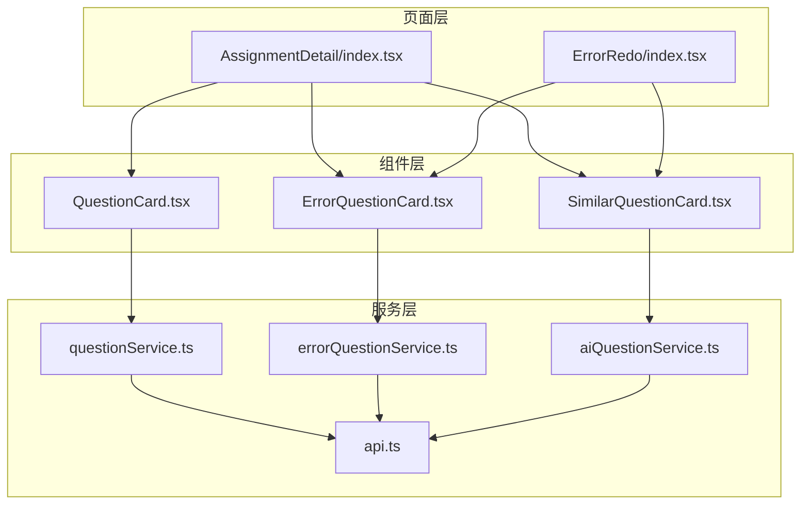
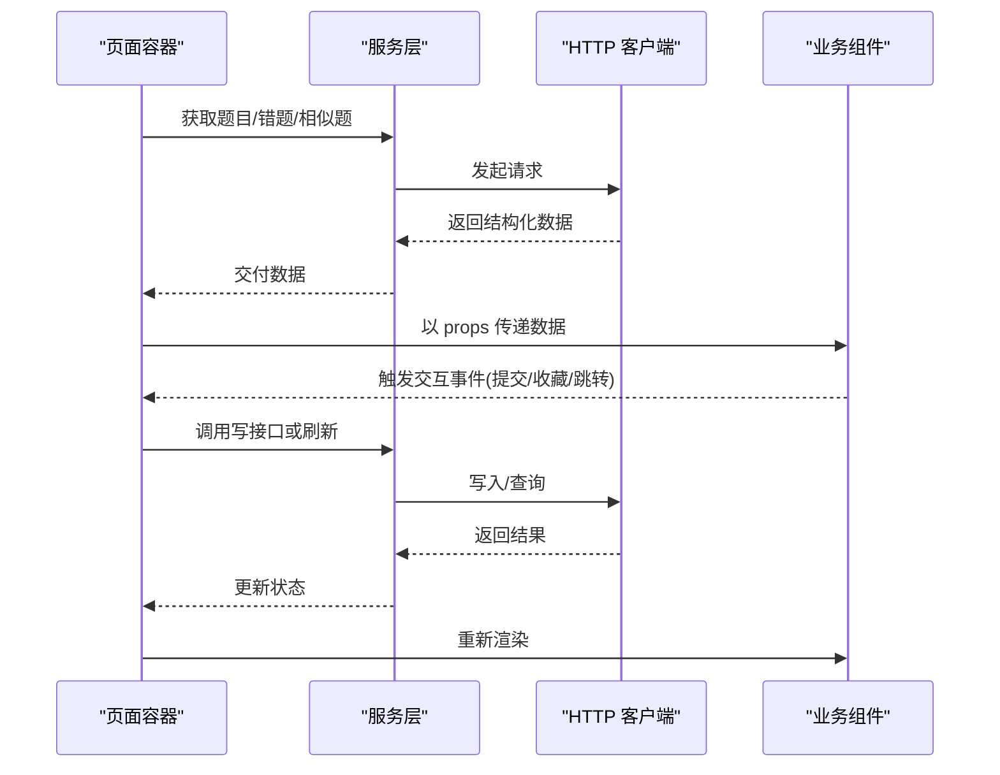
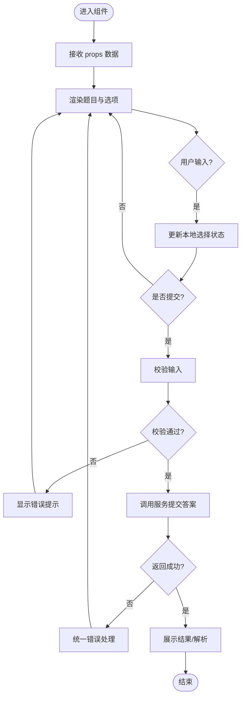
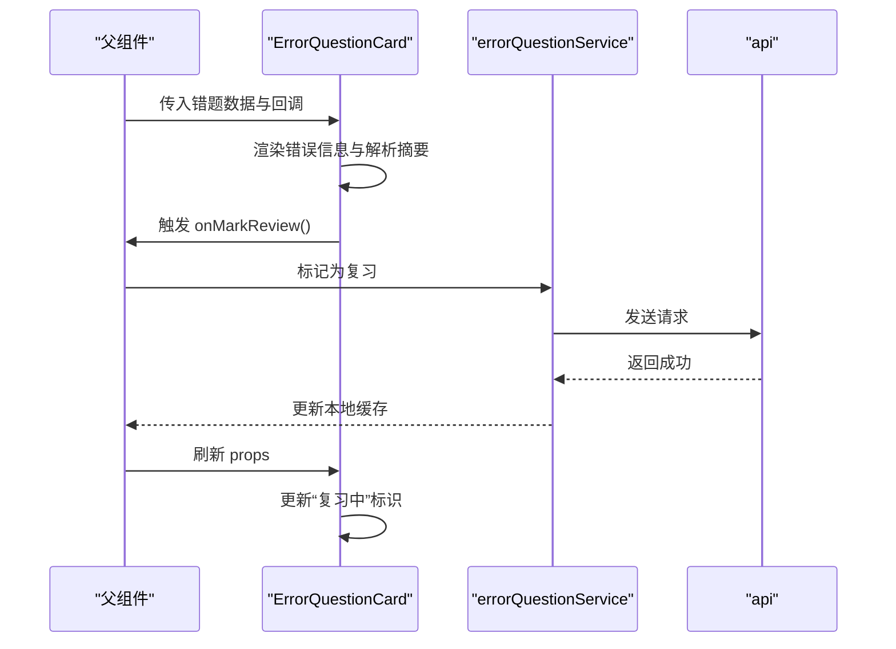
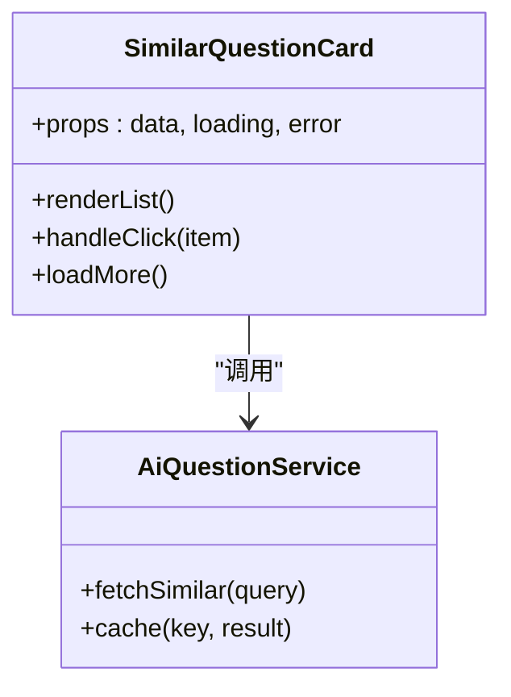
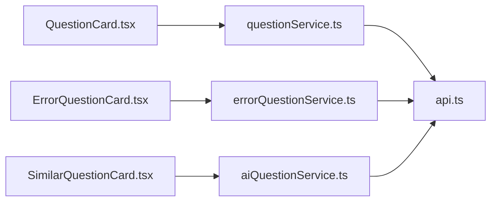

# 业务组件开发

<cite>
**本文引用的文件**   
- [QuestionCard.tsx](file://frontend/src/components/QuestionCard.tsx)
- [ErrorQuestionCard.tsx](file://frontend/src/components/ErrorQuestionCard.tsx)
- [SimilarQuestionCard.tsx](file://frontend/src/components/SimilarQuestionCard.tsx)
- [aiQuestionService.ts](file://frontend/src/services/aiQuestionService.ts)
- [errorQuestionService.ts](file://frontend/src/services/errorQuestionService.ts)
- [questionService.ts](file://frontend/src/services/questionService.ts)
- [api.ts](file://frontend/src/services/api.ts)
- [AssignmentDetail/index.tsx](file://frontend/src/pages/AssignmentManagement/AssignmentDetail/index.tsx)
- [ErrorRedo/index.tsx](file://frontend/src/pages/AssignmentManagement/ErrorRedo/index.tsx)
</cite>

## 目录
1. [引言](#引言)
2. [项目结构](#项目结构)
3. [核心组件](#核心组件)
4. [架构总览](#架构总览)
5. [详细组件分析](#详细组件分析)
6. [依赖关系分析](#依赖关系分析)
7. [性能考虑](#性能考虑)
8. [故障排查指南](#故障排查指南)
9. [结论](#结论)
10. [附录](#附录)

## 引言
本指南面向业务组件开发者，聚焦题目展示与错题复习场景中的三个关键前端组件：
- QuestionCard：题目展示与答题交互
- ErrorQuestionCard：错题卡片的信息展示、解析呈现与复习标记
- SimilarQuestionCard：相似题推荐的结果渲染与点击跳转

文档将围绕数据绑定、交互逻辑、状态管理、事件处理机制、数据流设计、与服务集成模式展开，并提供复杂业务场景下的组件拆分策略、性能优化方案与错误处理最佳实践。

## 项目结构
前端采用按功能域组织的组件与服务分层：
- components：业务组件（QuestionCard、ErrorQuestionCard、SimilarQuestionCard）
- services：API 服务封装（aiQuestionService、errorQuestionService、questionService、api）
- pages：页面级容器（AssignmentDetail、ErrorRedo），负责组合与编排组件

图表来源
- [AssignmentDetail/index.tsx](file://frontend/src/pages/AssignmentManagement/AssignmentDetail/index.tsx)
- [ErrorRedo/index.tsx](file://frontend/src/pages/AssignmentManagement/ErrorRedo/index.tsx)
- [QuestionCard.tsx](file://frontend/src/components/QuestionCard.tsx)
- [ErrorQuestionCard.tsx](file://frontend/src/components/ErrorQuestionCard.tsx)
- [SimilarQuestionCard.tsx](file://frontend/src/components/SimilarQuestionCard.tsx)
- [questionService.ts](file://frontend/src/services/questionService.ts)
- [errorQuestionService.ts](file://frontend/src/services/errorQuestionService.ts)
- [aiQuestionService.ts](file://frontend/src/services/aiQuestionService.ts)
- [api.ts](file://frontend/src/services/api.ts)

章节来源
- [AssignmentDetail/index.tsx](file://frontend/src/pages/AssignmentManagement/AssignmentDetail/index.tsx)
- [ErrorRedo/index.tsx](file://frontend/src/pages/AssignmentManagement/ErrorRedo/index.tsx)
- [QuestionCard.tsx](file://frontend/src/components/QuestionCard.tsx)
- [ErrorQuestionCard.tsx](file://frontend/src/components/ErrorQuestionCard.tsx)
- [SimilarQuestionCard.tsx](file://frontend/src/components/SimilarQuestionCard.tsx)
- [questionService.ts](file://frontend/src/services/questionService.ts)
- [errorQuestionService.ts](file://frontend/src/services/errorQuestionService.ts)
- [aiQuestionService.ts](file://frontend/src/services/aiQuestionService.ts)
- [api.ts](file://frontend/src/services/api.ts)

## 核心组件
本节概述三大组件的职责边界与协作方式：
- QuestionCard：承载题目内容、选项、用户输入与提交；向上抛出交互事件；按需加载解析与反馈
- ErrorQuestionCard：展示错题元信息、错误原因、正确答案与解析；支持“加入复习”等动作
- SimilarQuestionCard：基于算法或后端返回的相似题列表进行渲染；提供点击跳转至对应题目详情

章节来源
- [QuestionCard.tsx](file://frontend/src/components/QuestionCard.tsx)
- [ErrorQuestionCard.tsx](file://frontend/src/components/ErrorQuestionCard.tsx)
- [SimilarQuestionCard.tsx](file://frontend/src/components/SimilarQuestionCard.tsx)

## 架构总览
从数据到视图的整体流程如下：
- 页面容器从服务层拉取题目、错题与相似题数据
- 服务层通过统一 API 客户端发起请求并返回标准化响应
- 组件以 props 接收数据，内部维护本地交互状态（如选中项、是否显示解析）
- 用户交互触发回调，由父组件协调持久化或刷新相关数据

图表来源
- [AssignmentDetail/index.tsx](file://frontend/src/pages/AssignmentManagement/AssignmentDetail/index.tsx)
- [ErrorRedo/index.tsx](file://frontend/src/pages/AssignmentManagement/ErrorRedo/index.tsx)
- [questionService.ts](file://frontend/src/services/questionService.ts)
- [errorQuestionService.ts](file://frontend/src/services/errorQuestionService.ts)
- [aiQuestionService.ts](file://frontend/src/services/aiQuestionService.ts)
- [api.ts](file://frontend/src/services/api.ts)

## 详细组件分析

### QuestionCard 题目展示组件
- 数据绑定
  - 题目文本、题型、选项、分值、图片等多字段通过 props 注入
  - 解析与答案可延迟加载，避免首屏过重
- 交互逻辑
  - 单选/多选/填空等输入态管理
  - 提交后计算得分、展示解析与反馈
  - 防抖提交与重复提交保护
- 状态管理
  - 本地状态：当前选择、是否已提交、是否显示解析、错误提示
  - 受控与非受控结合：外层可控制禁用/只读
- 事件处理
  - onChange、onSubmit、onShowExplanation 等回调由父组件实现
- 与服务集成
  - 提交答案时调用 questionService 写接口
  - 解析内容可通过 aiQuestionService 异步获取

图表来源
- [QuestionCard.tsx](file://frontend/src/components/QuestionCard.tsx)
- [questionService.ts](file://frontend/src/services/questionService.ts)
- [aiQuestionService.ts](file://frontend/src/services/aiQuestionService.ts)
- [api.ts](file://frontend/src/services/api.ts)

章节来源
- [QuestionCard.tsx](file://frontend/src/components/QuestionCard.tsx)
- [questionService.ts](file://frontend/src/services/questionService.ts)
- [aiQuestionService.ts](file://frontend/src/services/aiQuestionService.ts)
- [api.ts](file://frontend/src/services/api.ts)

### ErrorQuestionCard 错题卡片组件
- 错误信息展示
  - 展示错误原因、正确答案、知识点标签、时间戳等
  - 支持富文本/公式渲染占位
- 解析功能
  - 解析内容可折叠/展开，按需懒加载
  - 支持“重新生成解析”触发 AI 能力
- 复习标记
  - “加入复习计划”、“已掌握”等状态切换
  - 与错题服务同步，保证跨端一致
- 事件与数据流
  - 对外暴露 onMarkReview、onToggleMastery、onRegenerateExplanation 等事件
  - 父组件负责持久化与列表刷新

图表来源
- [ErrorQuestionCard.tsx](file://frontend/src/components/ErrorQuestionCard.tsx)
- [errorQuestionService.ts](file://frontend/src/services/errorQuestionService.ts)
- [api.ts](file://frontend/src/services/api.ts)

章节来源
- [ErrorQuestionCard.tsx](file://frontend/src/components/ErrorQuestionCard.tsx)
- [errorQuestionService.ts](file://frontend/src/services/errorQuestionService.ts)
- [api.ts](file://frontend/src/services/api.ts)

### SimilarQuestionCard 相似题推荐组件
- 算法集成
  - 通过 aiQuestionService 获取相似题集合（向量检索/规则匹配由后端实现）
  - 支持分页与去重
- 结果渲染
  - 列表/网格布局，展示题干摘要、难度、来源
  - 骨架屏与空状态处理
- 点击跳转
  - 点击跳转到题目详情或练习页
  - 携带上下文参数（如来源作业、知识点）
- 性能与体验
  - 虚拟滚动（大数据量）
  - 预取与缓存策略

图表来源
- [SimilarQuestionCard.tsx](file://frontend/src/components/SimilarQuestionCard.tsx)
- [aiQuestionService.ts](file://frontend/src/services/aiQuestionService.ts)
- [api.ts](file://frontend/src/services/api.ts)

章节来源
- [SimilarQuestionCard.tsx](file://frontend/src/components/SimilarQuestionCard.tsx)
- [aiQuestionService.ts](file://frontend/src/services/aiQuestionService.ts)
- [api.ts](file://frontend/src/services/api.ts)

## 依赖关系分析
- 组件耦合度
  - 组件仅依赖服务层接口，不直接访问网络，便于测试与替换
- 服务层职责
  - 统一错误处理、重试、缓存、鉴权头注入
- 页面编排
  - AssignmentDetail 与 ErrorRedo 作为容器，聚合多个组件并协调数据流

图表来源
- [QuestionCard.tsx](file://frontend/src/components/QuestionCard.tsx)
- [ErrorQuestionCard.tsx](file://frontend/src/components/ErrorQuestionCard.tsx)
- [SimilarQuestionCard.tsx](file://frontend/src/components/SimilarQuestionCard.tsx)
- [questionService.ts](file://frontend/src/services/questionService.ts)
- [errorQuestionService.ts](file://frontend/src/services/errorQuestionService.ts)
- [aiQuestionService.ts](file://frontend/src/services/aiQuestionService.ts)
- [api.ts](file://frontend/src/services/api.ts)

章节来源
- [QuestionCard.tsx](file://frontend/src/components/QuestionCard.tsx)
- [ErrorQuestionCard.tsx](file://frontend/src/components/ErrorQuestionCard.tsx)
- [SimilarQuestionCard.tsx](file://frontend/src/components/SimilarQuestionCard.tsx)
- [questionService.ts](file://frontend/src/services/questionService.ts)
- [errorQuestionService.ts](file://frontend/src/services/errorQuestionService.ts)
- [aiQuestionService.ts](file://frontend/src/services/aiQuestionService.ts)
- [api.ts](file://frontend/src/services/api.ts)

## 性能考虑
- 渲染优化
  - 大列表使用虚拟滚动与分页加载
  - 图片懒加载与占位图
  - 解析内容按需展开与缓存
- 网络优化
  - 请求合并与去抖
  - 失败重试与指数退避
  - 合理缓存键与失效策略
- 状态优化
  - 局部状态下沉，减少不必要重渲染
  - 使用不可变数据结构提升比较效率
- 资源优化
  - 代码分割与路由懒加载
  - 第三方库按需引入

[本节为通用指导，无需特定文件引用]

## 故障排查指南
- 常见问题定位
  - 数据未渲染：检查 props 来源与服务返回值结构
  - 交互无响应：确认事件冒泡与回调绑定
  - 解析加载失败：查看网络错误码与重试策略
- 日志与埋点
  - 在关键路径记录入参、出参与耗时
  - 对异常分支输出堆栈与上下文
- 回滚与降级
  - 网络失败时展示友好提示与重试入口
  - 解析失败时降级为纯文本或隐藏解析区

章节来源
- [api.ts](file://frontend/src/services/api.ts)
- [questionService.ts](file://frontend/src/services/questionService.ts)
- [errorQuestionService.ts](file://frontend/src/services/errorQuestionService.ts)
- [aiQuestionService.ts](file://frontend/src/services/aiQuestionService.ts)

## 结论
通过清晰的分层与职责划分，QuestionCard、ErrorQuestionCard、SimilarQuestionCard 实现了高内聚低耦合的业务组件体系。配合统一的服务层与页面编排，既保证了用户体验，也提升了可维护性与可扩展性。建议在后续迭代中持续完善缓存策略、错误恢复与监控指标，进一步提升稳定性与性能。

[本节为总结性内容，无需特定文件引用]

## 附录
- 组件拆分策略
  - 将复杂题目拆分为“题干区/选项区/解析区/操作区”子组件
  - 将错题卡片拆分为“信息区/解析区/复习操作区”
  - 将相似题卡片拆分为“列表区/筛选区/分页区”
- 事件总线与状态共享
  - 小范围可用 Context/Store，大范围建议集中式状态管理
- 安全与合规
  - 敏感信息脱敏
  - 输入校验与输出转义

[本节为概念性内容，无需特定文件引用]