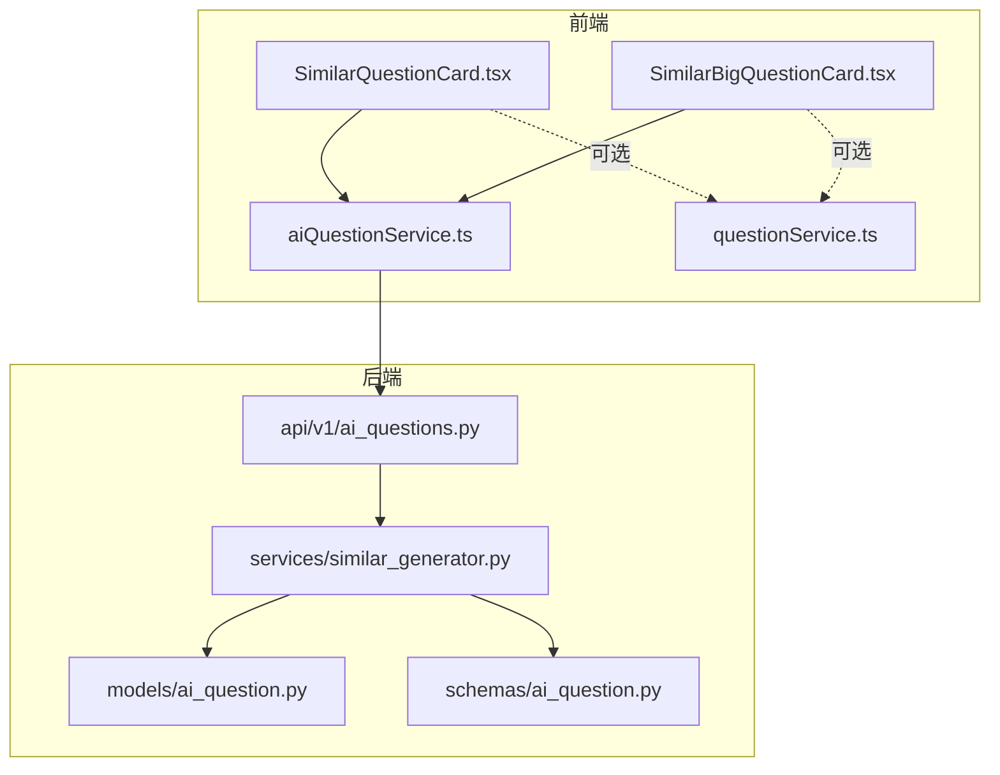
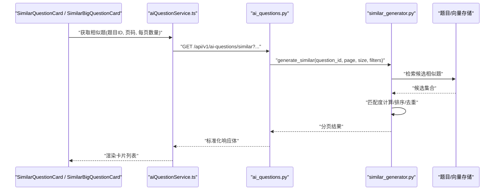
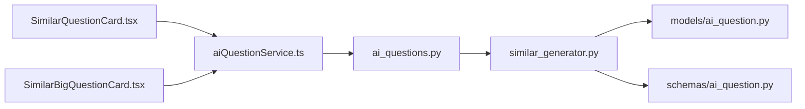
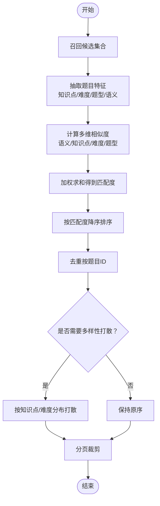

# 相似题推荐组件

<cite>
**本文引用的文件**   
- [SimilarQuestionCard.tsx](file://frontend/src/components/SimilarQuestionCard.tsx)
- [SimilarBigQuestionCard.tsx](file://frontend/src/components/SimilarBigQuestionCard.tsx)
- [aiQuestionService.ts](file://frontend/src/services/aiQuestionService.ts)
- [questionService.ts](file://frontend/src/services/questionService.ts)
- [ai_questions.py](file://backend/app/api/v1/ai_questions.py)
- [similar_generator.py](file://backend/app/services/similar_generator.py)
- [ai_question.py](file://backend/app/models/ai_question.py)
- [ai_question.py](file://backend/app/schemas/ai_question.py)
</cite>

## 目录
1. [简介](#简介)
2. [项目结构](#项目结构)
3. [核心组件](#核心组件)
4. [架构总览](#架构总览)
5. [详细组件分析](#详细组件分析)
6. [依赖关系分析](#依赖关系分析)
7. [性能与缓存策略](#性能与缓存策略)
8. [故障排查指南](#故障排查指南)
9. [结论](#结论)
10. [附录](#附录)

## 简介
本文件面向前端与后端开发者，系统化说明“相似题推荐”功能在系统中的实现方式，重点覆盖：
- SimilarQuestionCard 与 SimilarBigQuestionCard 两种卡片组件的职责、差异设计与使用场景
- 相似题算法在后端的集成路径、数据结构定义、匹配度计算逻辑
- 推荐结果的排序规则、去重机制、分页加载实现
- 用户反馈收集、推荐效果评估与算法调优接口
- 缓存策略、预加载优化与实时更新机制

## 项目结构
相似题推荐涉及前后端协作：
- 前端组件层：SimilarQuestionCard、SimilarBigQuestionCard
- 前端服务层：aiQuestionService（调用相似题相关 API）、questionService（通用题目数据）
- 后端 API 层：ai_questions.py（暴露相似题查询接口）
- 后端服务层：similar_generator.py（相似题生成/检索逻辑）
- 后端模型与模式：ai_question.py（模型）、ai_question.py（Schema）

图表来源
- [SimilarQuestionCard.tsx](file://frontend/src/components/SimilarQuestionCard.tsx)
- [SimilarBigQuestionCard.tsx](file://frontend/src/components/SimilarBigQuestionCard.tsx)
- [aiQuestionService.ts](file://frontend/src/services/aiQuestionService.ts)
- [questionService.ts](file://frontend/src/services/questionService.ts)
- [ai_questions.py](file://backend/app/api/v1/ai_questions.py)
- [similar_generator.py](file://backend/app/services/similar_generator.py)
- [ai_question.py](file://backend/app/models/ai_question.py)
- [ai_question.py](file://backend/app/schemas/ai_question.py)

章节来源
- [SimilarQuestionCard.tsx](file://frontend/src/components/SimilarQuestionCard.tsx)
- [SimilarBigQuestionCard.tsx](file://frontend/src/components/SimilarBigQuestionCard.tsx)
- [aiQuestionService.ts](file://frontend/src/services/aiQuestionService.ts)
- [questionService.ts](file://frontend/src/services/questionService.ts)
- [ai_questions.py](file://backend/app/api/v1/ai_questions.py)
- [similar_generator.py](file://backend/app/services/similar_generator.py)
- [ai_question.py](file://backend/app/models/ai_question.py)
- [ai_question.py](file://backend/app/schemas/ai_question.py)

## 核心组件
- SimilarQuestionCard：用于列表或侧边栏等紧凑布局的相似题卡片，强调信息密度与快速浏览。
- SimilarBigQuestionCard：用于详情页或主内容区的相似题卡片，强调可读性与交互深度。

两者共同职责：
- 展示相似题列表
- 支持分页加载
- 提供点击跳转、收藏/反馈入口
- 统一的数据结构与错误处理

章节来源
- [SimilarQuestionCard.tsx](file://frontend/src/components/SimilarQuestionCard.tsx)
- [SimilarBigQuestionCard.tsx](file://frontend/src/components/SimilarBigQuestionCard.tsx)

## 架构总览
相似题推荐的整体流程如下：
- 前端组件通过 aiQuestionService 发起请求
- 后端 ai_questions.py 接收参数并调用 similar_generator.py
- similar_generator.py 基于题目特征与向量检索生成候选集，进行匹配度计算、排序与去重
- 返回标准化响应体，前端渲染为卡片

图表来源
- [aiQuestionService.ts](file://frontend/src/services/aiQuestionService.ts)
- [ai_questions.py](file://backend/app/api/v1/ai_questions.py)
- [similar_generator.py](file://backend/app/services/similar_generator.py)

## 详细组件分析

### SimilarQuestionCard 组件
- 设计目标：高信息密度、轻量交互，适合列表/侧边栏
- 关键特性：
  - 标题/题干摘要显示
  - 难度标签、知识点标签
  - 点击跳转至题目详情
  - 支持“收藏/反馈”快捷操作
  - 内部维护分页状态，滚动触底加载更多
- 布局适配：
  - 在小屏下自动缩减标签与描述长度
  - 在大屏下可展开更多元数据

章节来源
- [SimilarQuestionCard.tsx](file://frontend/src/components/SimilarQuestionCard.tsx)

### SimilarBigQuestionCard 组件
- 设计目标：强可读性、丰富交互，适合详情页或主内容区
- 关键特性：
  - 完整题干与选项展示
  - 更详细的解析预览与知识点关联
  - 内置“收藏/反馈/加入错题本”等动作
  - 支持内联分页加载
- 布局适配：
  - 自适应宽度，支持多列网格布局
  - 在窄屏下切换为单列堆叠

章节来源
- [SimilarBigQuestionCard.tsx](file://frontend/src/components/SimilarBigQuestionCard.tsx)

### 前端服务：aiQuestionService
- 职责：封装相似题相关 API 调用，统一参数构建、错误处理与重试策略
- 主要能力：
  - 获取相似题列表（支持分页、过滤）
  - 提交用户反馈（如“不感兴趣/已掌握/太难/太易”）
  - 触发预加载（对下一页或下一批数据进行静默拉取）
- 与 questionService 的关系：
  - 当需要补充题目基础信息时，可复用 questionService 的通用接口

章节来源
- [aiQuestionService.ts](file://frontend/src/services/aiQuestionService.ts)
- [questionService.ts](file://frontend/src/services/questionService.ts)

### 后端 API：ai_questions.py
- 职责：暴露相似题查询与反馈接口，校验入参，转发到服务层
- 典型接口：
  - GET /api/v1/ai-questions/similar：根据题目 ID 与筛选条件返回相似题
  - POST /api/v1/ai-questions/similar-feedback：记录用户对某条推荐的反馈
- 参数规范：
  - question_id：当前题目标识
  - page、size：分页参数
  - filters：难度、知识点、题型等过滤条件
- 响应规范：
  - 包含分页元信息（总数、页码、每页大小）
  - 包含推荐结果数组（含相似度分数、题目基本信息）

章节来源
- [ai_questions.py](file://backend/app/api/v1/ai_questions.py)

### 后端服务：similar_generator.py
- 职责：实现相似题生成与排序的核心逻辑
- 关键步骤：
  - 候选召回：基于题目特征与向量检索获取候选集合
  - 匹配度计算：综合语义相似度、知识点重合度、难度差值、题型一致性等维度加权
  - 排序与去重：按匹配度降序；按题目 ID 去重；必要时按知识点/难度分布做多样性打散
  - 分页裁剪：根据 page、size 截取最终结果
- 扩展点：
  - 权重可调（便于 A/B 测试与在线调优）
  - 过滤策略可扩展（黑名单、最近做过题目排除等）

章节来源
- [similar_generator.py](file://backend/app/services/similar_generator.py)

### 数据模型与模式
- 模型（models/ai_question.py）：定义相似题相关持久化字段与关系
- 模式（schemas/ai_question.py）：定义 API 请求/响应的结构化类型约束

章节来源
- [ai_question.py](file://backend/app/models/ai_question.py)
- [ai_question.py](file://backend/app/schemas/ai_question.py)

## 依赖关系分析
- 组件依赖服务：SimilarQuestionCard/SimilarBigQuestionCard → aiQuestionService
- 服务依赖 API：aiQuestionService → ai_questions.py
- API 依赖服务：ai_questions.py → similar_generator.py
- 服务依赖数据：similar_generator.py → models/ai_question.py 与外部向量/题库存储

图表来源
- [SimilarQuestionCard.tsx](file://frontend/src/components/SimilarQuestionCard.tsx)
- [SimilarBigQuestionCard.tsx](file://frontend/src/components/SimilarBigQuestionCard.tsx)
- [aiQuestionService.ts](file://frontend/src/services/aiQuestionService.ts)
- [ai_questions.py](file://backend/app/api/v1/ai_questions.py)
- [similar_generator.py](file://backend/app/services/similar_generator.py)
- [ai_question.py](file://backend/app/models/ai_question.py)
- [ai_question.py](file://backend/app/schemas/ai_question.py)

## 性能与缓存策略
- 前端缓存
  - 内存缓存：对热门题目的相似题结果进行短期缓存，减少重复请求
  - 预加载：在页面可见或滚动接近底部时，提前拉取下一页数据
  - 去抖与节流：避免频繁触发加载
- 后端缓存
  - 结果缓存：对相同 question_id + filters + page/size 的请求进行短时缓存
  - 向量检索加速：对高频题目建立索引与近似最近邻检索
- 实时更新
  - 当用户完成练习或收藏后，可触发局部刷新或增量更新
  - 结合 SSE/WebSocket 推送新推荐（可选）

[本节为通用指导，无需源码引用]

## 故障排查指南
- 常见问题
  - 无结果：检查 question_id 是否有效、filters 是否过严、向量库是否正常
  - 结果重复：确认去重逻辑是否生效（按题目 ID 去重）
  - 排序异常：核对匹配度权重配置与打分函数
  - 分页错位：检查 page/size 边界处理与总数统计
- 定位方法
  - 查看前端网络请求参数与响应体
  - 检查后端日志中的候选召回数量与排序过程
  - 验证 Schema 校验是否拦截了非法字段

章节来源
- [ai_questions.py](file://backend/app/api/v1/ai_questions.py)
- [similar_generator.py](file://backend/app/services/similar_generator.py)

## 结论
SimilarQuestionCard 与 SimilarBigQuestionCard 分别满足高密度浏览与深度阅读两类场景。通过 aiQuestionService 与后端 ai_questions.py、similar_generator.py 的协同，实现了从候选召回、匹配度计算、排序去重到分页展示的完整链路。建议在生产环境引入缓存与预加载，并结合用户反馈持续调优匹配度权重，以提升推荐质量与用户体验。

[本节为总结，无需源码引用]

## 附录

### 数据结构定义（推荐结果）
- 字段建议
  - id：题目唯一标识
  - title：题干摘要或标题
  - difficulty：难度等级
  - knowledge_points：知识点集合
  - type：题型
  - similarity_score：匹配度分数
  - preview：简要解析或提示
  - url：跳转链接
- 分页元信息
  - total：总条数
  - page：当前页码
  - size：每页数量

章节来源
- [ai_question.py](file://backend/app/schemas/ai_question.py)

### 匹配度计算逻辑（流程）

图表来源
- [similar_generator.py](file://backend/app/services/similar_generator.py)

### 用户反馈与效果评估
- 反馈采集
  - 事件：点击“不感兴趣/已掌握/太难/太易”
  - 上报：aiQuestionService 调用反馈接口，携带 question_id、feedback_type、target_item_id
- 效果指标
  - 点击率（CTR）：推荐项被点击的比例
  - 收藏率：被收藏的比例
  - 完成率：后续作答完成率
  - 负反馈率：负面反馈占比
- 调优接口
  - 调整匹配度权重（A/B 实验）
  - 动态过滤策略（如最近做过题目排除）
  - 多样性打散强度

章节来源
- [aiQuestionService.ts](file://frontend/src/services/aiQuestionService.ts)
- [ai_questions.py](file://backend/app/api/v1/ai_questions.py)

### 使用场景区分与布局适配
- 场景区分
  - SimilarQuestionCard：列表页、侧边栏、作业回顾面板
  - SimilarBigQuestionCard：题目详情页、错题讲解页、复习计划页
- 布局适配
  - 小屏：单列堆叠、隐藏次要标签
  - 大屏：多列网格、展示更多元数据
  - 交互：大卡片支持内联收藏/反馈，小卡片以轻量图标为主

章节来源
- [SimilarQuestionCard.tsx](file://frontend/src/components/SimilarQuestionCard.tsx)
- [SimilarBigQuestionCard.tsx](file://frontend/src/components/SimilarBigQuestionCard.tsx)