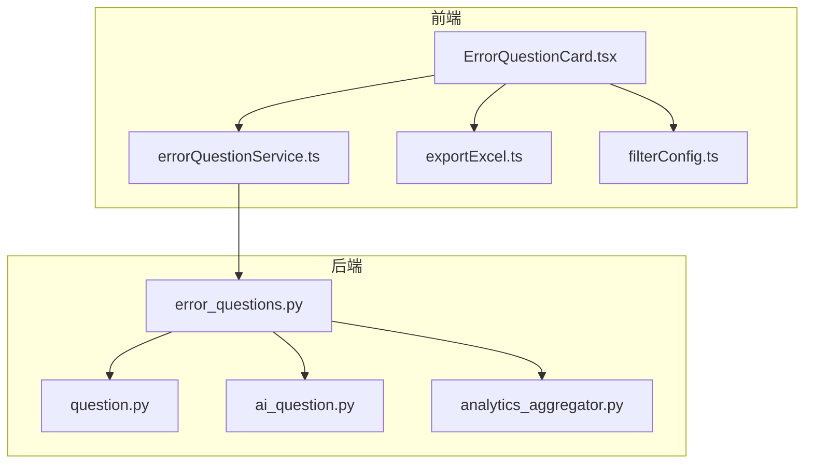
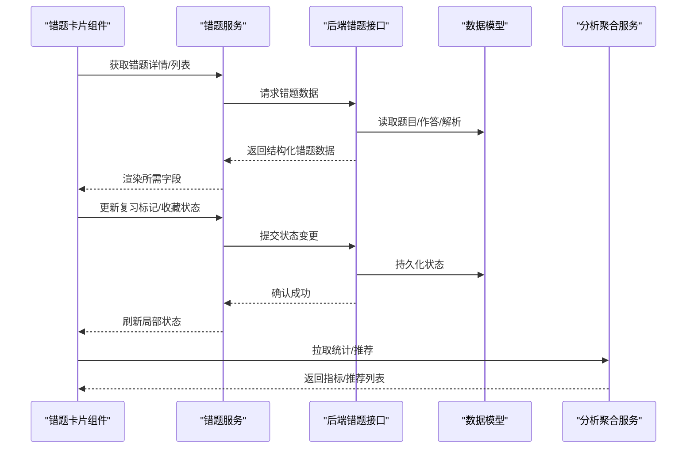
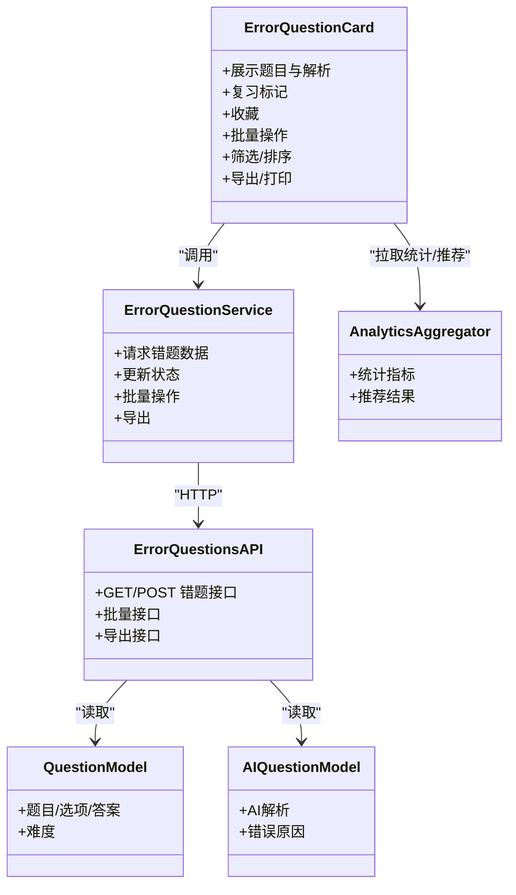

# 错题卡片组件

<cite>
**本文引用的文件**   
- [ErrorQuestionCard.tsx](file://frontend/src/components/ErrorQuestionCard.tsx)
- [errorQuestionService.ts](file://frontend/src/services/errorQuestionService.ts)
- [error_questions.py](file://backend/app/api/v1/error_questions.py)
- [question.py](file://backend/app/models/question.py)
- [ai_question.py](file://backend/app/models/ai_question.py)
- [analytics_aggregator.py](file://backend/app/services/analytics_aggregator.py)
- [exportExcel.ts](file://frontend/src/utils/exportExcel.ts)
- [filterConfig.ts](file://frontend/src/utils/filterConfig.ts)
</cite>

## 目录
1. [简介](#简介)
2. [项目结构](#项目结构)
3. [核心组件](#核心组件)
4. [架构总览](#架构总览)
5. [详细组件分析](#详细组件分析)
6. [依赖分析](#依赖分析)
7. [性能考虑](#性能考虑)
8. [故障排查指南](#故障排查指南)
9. [结论](#结论)
10. [附录](#附录)

## 简介
本文件围绕“错题卡片组件”进行系统化文档化，覆盖以下关键主题：
- 错题数据的特殊展示逻辑、错误原因分析显示、解析内容渲染
- 复习标记功能的状态管理、错题收藏机制、难度等级标识
- 与错题管理服务（前后端）的集成方式、批量操作支持、筛选排序
- 错题统计信息的可视化展示、学习进度追踪、个性化推荐算法集成
- 错题本导出、打印格式定制、移动端适配方案

目标读者包括前端开发者、后端工程师、产品与测试人员。

## 项目结构
与错题卡片相关的代码主要分布在如下位置：
- 前端组件：ErrorQuestionCard.tsx
- 前端服务：errorQuestionService.ts
- 后端接口：error_questions.py
- 数据模型：question.py、ai_question.py
- 分析聚合：analytics_aggregator.py
- 工具：exportExcel.ts、filterConfig.ts

图表来源
- [ErrorQuestionCard.tsx](file://frontend/src/components/ErrorQuestionCard.tsx)
- [errorQuestionService.ts](file://frontend/src/services/errorQuestionService.ts)
- [error_questions.py](file://backend/app/api/v1/error_questions.py)
- [question.py](file://backend/app/models/question.py)
- [ai_question.py](file://backend/app/models/ai_question.py)
- [analytics_aggregator.py](file://backend/app/services/analytics_aggregator.py)
- [exportExcel.ts](file://frontend/src/utils/exportExcel.ts)
- [filterConfig.ts](file://frontend/src/utils/filterConfig.ts)

章节来源
- [ErrorQuestionCard.tsx](file://frontend/src/components/ErrorQuestionCard.tsx)
- [errorQuestionService.ts](file://frontend/src/services/errorQuestionService.ts)
- [error_questions.py](file://backend/app/api/v1/error_questions.py)
- [question.py](file://backend/app/models/question.py)
- [ai_question.py](file://backend/app/models/ai_question.py)
- [analytics_aggregator.py](file://backend/app/services/analytics_aggregator.py)
- [exportExcel.ts](file://frontend/src/utils/exportExcel.ts)
- [filterConfig.ts](file://frontend/src/utils/filterConfig.ts)

## 核心组件
- 错题卡片组件负责：
  - 展示题目、用户作答、正确答案、错误原因分析与解析
  - 提供复习标记、收藏、难度标识等交互
  - 触发批量操作（如批量收藏、批量导出）
  - 联动筛选与排序，结合统计面板与推荐能力

章节来源
- [ErrorQuestionCard.tsx](file://frontend/src/components/ErrorQuestionCard.tsx)
- [errorQuestionService.ts](file://frontend/src/services/errorQuestionService.ts)

## 架构总览
错题卡片的数据流与交互流程如下：

图表来源
- [ErrorQuestionCard.tsx](file://frontend/src/components/ErrorQuestionCard.tsx)
- [errorQuestionService.ts](file://frontend/src/services/errorQuestionService.ts)
- [error_questions.py](file://backend/app/api/v1/error_questions.py)
- [question.py](file://backend/app/models/question.py)
- [ai_question.py](file://backend/app/models/ai_question.py)
- [analytics_aggregator.py](file://backend/app/services/analytics_aggregator.py)

## 详细组件分析

### 错题数据展示与解析渲染
- 展示要点
  - 题干、选项、用户答案、标准答案对比高亮
  - 错误原因分析区块：由后端或AI生成，按段落/要点分段渲染
  - 解析内容渲染：支持富文本/公式/图片等多媒体元素的安全渲染
- 实现建议
  - 使用安全HTML渲染器，过滤危险脚本
  - 对长解析启用折叠/展开，提升首屏性能
  - 为数学公式与图片提供占位与懒加载

章节来源
- [ErrorQuestionCard.tsx](file://frontend/src/components/ErrorQuestionCard.tsx)
- [error_questions.py](file://backend/app/api/v1/error_questions.py)
- [ai_question.py](file://backend/app/models/ai_question.py)

### 错误原因分析显示
- 数据来源
  - 来自AI判题或人工标注的错误原因字段
- 展示策略
  - 分点呈现，便于快速定位薄弱知识点
  - 关联知识标签，点击跳转至相关讲解

章节来源
- [ai_question.py](file://backend/app/models/ai_question.py)
- [error_questions.py](file://backend/app/api/v1/error_questions.py)

### 复习标记与收藏机制
- 复习标记
  - 状态：未复习/已复习/重点复习
  - 交互：一键切换，即时反馈并同步后端
- 收藏机制
  - 支持单题收藏与批量收藏
  - 收藏后可在“我的收藏”中集中查看与复习
- 状态管理
  - 本地缓存最近一次状态，网络失败时回退到本地
  - 乐观更新+失败重试，保证用户体验

章节来源
- [ErrorQuestionCard.tsx](file://frontend/src/components/ErrorQuestionCard.tsx)
- [errorQuestionService.ts](file://frontend/src/services/errorQuestionService.ts)
- [error_questions.py](file://backend/app/api/v1/error_questions.py)

### 难度等级标识
- 维度
  - 基础/中等/困难三级，可叠加AI评估难度
- 展示
  - 以徽章形式显示于卡片头部，便于快速识别
- 用途
  - 作为筛选与推荐的依据之一

章节来源
- [question.py](file://backend/app/models/question.py)
- [ai_question.py](file://backend/app/models/ai_question.py)

### 与错题管理服务的集成
- 接口职责
  - 获取错题列表/详情、更新复习与收藏状态、批量操作、导出
- 调用约定
  - 统一错误码与消息体，前端根据状态码提示与重试
- 幂等性
  - 批量操作需具备幂等键，避免重复提交

章节来源
- [errorQuestionService.ts](file://frontend/src/services/errorQuestionService.ts)
- [error_questions.py](file://backend/app/api/v1/error_questions.py)

### 批量操作支持
- 场景
  - 批量收藏、批量导出、批量设置复习状态
- 实现要点
  - 分批提交，避免单次请求过大
  - 进度条与失败重试，失败项单独提示

章节来源
- [errorQuestionService.ts](file://frontend/src/services/errorQuestionService.ts)
- [error_questions.py](file://backend/app/api/v1/error_questions.py)

### 筛选与排序
- 筛选维度
  - 难度、是否收藏、是否已复习、时间范围、知识点标签
- 排序规则
  - 按错误次数、最近错误时间、难度降序等
- 配置化
  - 通过过滤器配置文件维护默认筛选项与排序策略

章节来源
- [filterConfig.ts](file://frontend/src/utils/filterConfig.ts)
- [errorQuestionService.ts](file://frontend/src/services/errorQuestionService.ts)

### 错题统计与学习进度
- 统计指标
  - 错题总数、正确率趋势、各难度分布、知识点掌握度
- 可视化
  - 折线图（趋势）、饼图（分布）、热力图（知识点）
- 进度追踪
  - 基于复习标记与重做记录计算掌握度曲线

章节来源
- [analytics_aggregator.py](file://backend/app/services/analytics_aggregator.py)
- [ErrorQuestionCard.tsx](file://frontend/src/components/ErrorQuestionCard.tsx)

### 个性化推荐算法集成
- 输入特征
  - 历史错题、错误原因标签、知识点图谱、复习间隔
- 输出
  - 相似题/变式题推荐列表，附带匹配理由
- 集成方式
  - 通过独立接口拉取推荐结果，卡片内嵌入“推荐练习”入口

章节来源
- [error_questions.py](file://backend/app/api/v1/error_questions.py)
- [ai_question.py](file://backend/app/models/ai_question.py)

### 错题本导出与打印
- 导出
  - 支持Excel导出，包含题目、答案、解析、错误原因、复习状态等字段
- 打印
  - 提供打印样式表，隐藏交互控件，仅保留必要信息
- 移动端适配
  - 响应式布局、触摸友好的按钮尺寸、横向滚动表格优化

章节来源
- [exportExcel.ts](file://frontend/src/utils/exportExcel.ts)
- [ErrorQuestionCard.tsx](file://frontend/src/components/ErrorQuestionCard.tsx)

## 依赖分析
组件与服务之间的依赖关系如下：

图表来源
- [ErrorQuestionCard.tsx](file://frontend/src/components/ErrorQuestionCard.tsx)
- [errorQuestionService.ts](file://frontend/src/services/errorQuestionService.ts)
- [error_questions.py](file://backend/app/api/v1/error_questions.py)
- [question.py](file://backend/app/models/question.py)
- [ai_question.py](file://backend/app/models/ai_question.py)
- [analytics_aggregator.py](file://backend/app/services/analytics_aggregator.py)

章节来源
- [ErrorQuestionCard.tsx](file://frontend/src/components/ErrorQuestionCard.tsx)
- [errorQuestionService.ts](file://frontend/src/services/errorQuestionService.ts)
- [error_questions.py](file://backend/app/api/v1/error_questions.py)
- [question.py](file://backend/app/models/question.py)
- [ai_question.py](file://backend/app/models/ai_question.py)
- [analytics_aggregator.py](file://backend/app/services/analytics_aggregator.py)

## 性能考虑
- 首屏渲染
  - 解析内容按需加载，长文本折叠
  - 图片与公式懒加载
- 网络优化
  - 列表分页与增量更新
  - 批量操作分片提交
- 内存占用
  - 大对象及时释放，避免长时间持有引用
- 交互体验
  - 乐观更新+失败回滚
  - 防抖/节流减少重复请求

[本节为通用指导，不直接分析具体文件]

## 故障排查指南
- 常见问题
  - 解析渲染异常：检查HTML白名单与资源路径
  - 状态不同步：核对本地缓存与后端返回状态
  - 批量操作失败：检查分片大小与重试策略
- 日志与监控
  - 记录关键请求ID与错误堆栈
  - 上报前端错误与性能指标
- 恢复策略
  - 离线可用：优先读本地缓存
  - 断网续传：失败任务入队，网络恢复后自动重试

章节来源
- [ErrorQuestionCard.tsx](file://frontend/src/components/ErrorQuestionCard.tsx)
- [errorQuestionService.ts](file://frontend/src/services/errorQuestionService.ts)
- [error_questions.py](file://backend/app/api/v1/error_questions.py)

## 结论
错题卡片组件通过清晰的前后端分层与模块化设计，实现了错题数据的精细化展示、复习与收藏的状态管理、批量操作与筛选排序、统计与推荐能力的集成，以及导出与打印的实用特性。建议在后续迭代中持续优化解析渲染性能、增强推荐准确性与移动端体验。

[本节为总结性内容，不直接分析具体文件]

## 附录
- 术语
  - 复习标记：用于标识用户对某道错题的复习进度
  - 收藏：将错题加入个人收藏集合以便集中复习
  - 难度等级：反映题目难度的分级标识
- 最佳实践
  - 保持接口契约稳定，前端做好容错与降级
  - 对敏感内容进行安全渲染与权限校验
  - 定期清理过期缓存与无用数据

[本节为补充说明，不直接分析具体文件]