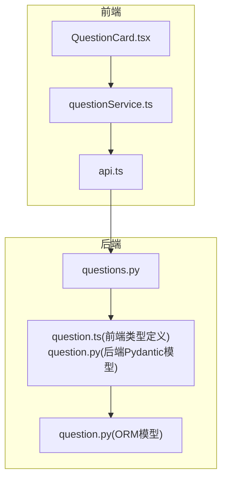
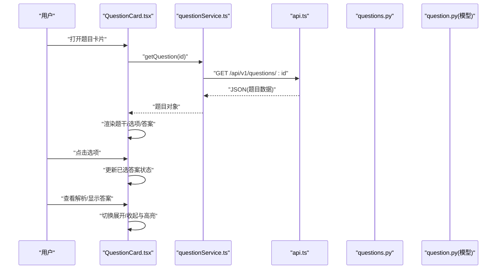
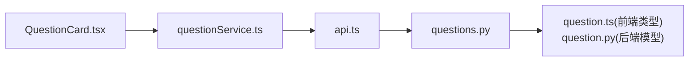

# 题目展示组件

<cite>
**本文引用的文件**   
- [QuestionCard.tsx](file://frontend/src/components/QuestionCard.tsx)
- [questionService.ts](file://frontend/src/services/questionService.ts)
- [api.ts](file://frontend/src/services/api.ts)
- [question.ts](file://backend/app/schemas/question.ts)
- [questions.py](file://backend/app/api/v1/questions.py)
- [question.py](file://backend/app/models/question.py)
</cite>

## 目录
1. [简介](#简介)
2. [项目结构](#项目结构)
3. [核心组件](#核心组件)
4. [架构总览](#架构总览)
5. [详细组件分析](#详细组件分析)
6. [依赖分析](#依赖分析)
7. [性能考虑](#性能考虑)
8. [故障排查指南](#故障排查指南)
9. [结论](#结论)
10. [附录](#附录)

## 简介
本文件为“题目展示组件”（QuestionCard）的详细开发文档，面向前端与后端开发者。内容涵盖：
- 数据结构设计：前后端数据模型、字段约定与校验
- 渲染逻辑：题干、选项、答案与解析的渲染策略
- 交互与状态管理：展开收起、选项选择、正确答案高亮等
- API 绑定与错误处理：请求流程、错误码与重试策略
- 自定义配置与样式覆盖：主题、尺寸、排版等
- 响应式设计与性能优化：虚拟滚动、懒加载、缓存策略

## 项目结构
QuestionCard 位于前端组件目录，负责单题的展示与交互；通过 questionService 调用后端 questions API，后端基于 FastAPI + Pydantic 提供数据模型与接口。

图表来源
- [QuestionCard.tsx](file://frontend/src/components/QuestionCard.tsx)
- [questionService.ts](file://frontend/src/services/questionService.ts)
- [api.ts](file://frontend/src/services/api.ts)
- [questions.py](file://backend/app/api/v1/questions.py)
- [question.ts](file://backend/app/schemas/question.ts)
- [question.py](file://backend/app/models/question.py)

章节来源
- [QuestionCard.tsx](file://frontend/src/components/QuestionCard.tsx)
- [questionService.ts](file://frontend/src/services/questionService.ts)
- [api.ts](file://frontend/src/services/api.ts)
- [questions.py](file://backend/app/api/v1/questions.py)
- [question.ts](file://backend/app/schemas/question.ts)
- [question.py](file://backend/app/models/question.py)

## 核心组件
- QuestionCard：单题卡片容器，负责渲染题干、选项、答案与解析，管理用户交互状态（展开/收起、已选答案、是否显示答案）。
- questionService：封装对后端题目的查询与提交逻辑，统一错误处理与返回类型。
- api：HTTP 客户端封装，提供基础请求能力（如 baseURL、拦截器、超时等）。

章节来源
- [QuestionCard.tsx](file://frontend/src/components/QuestionCard.tsx)
- [questionService.ts](file://frontend/src/services/questionService.ts)
- [api.ts](file://frontend/src/services/api.ts)

## 架构总览
QuestionCard 通过 questionService 发起请求获取题目详情或提交作答，后端由 FastAPI 路由接收并返回符合 Pydantic 模型的 JSON。前端根据返回数据渲染 UI，并在用户交互时更新本地状态。

图表来源
- [QuestionCard.tsx](file://frontend/src/components/QuestionCard.tsx)
- [questionService.ts](file://frontend/src/services/questionService.ts)
- [api.ts](file://frontend/src/services/api.ts)
- [questions.py](file://backend/app/api/v1/questions.py)
- [question.py](file://backend/app/models/question.py)

## 详细组件分析

### 数据结构设计
- 后端模型（Pydantic）：定义题目字段（如 id、题干、题型、选项列表、正确答案、解析、难度、标签等），用于序列化与校验。
- 前端类型：在 questionService 中定义 TS 类型，确保与后端一致，便于 TypeScript 静态检查。
- 字段约定：
  - 题干与解析支持富文本或 Markdown，需在前端进行安全渲染。
  - 选项为数组，包含序号、文本、是否为正确项标记等。
  - 答案字段可为单选或多选，按题型决定交互行为。

章节来源
- [question.ts](file://backend/app/schemas/question.ts)
- [question.py](file://backend/app/models/question.py)
- [questionService.ts](file://frontend/src/services/questionService.ts)

### 题目内容渲染逻辑
- 题干渲染：将后端返回的文本/富文本安全地渲染到 DOM，避免 XSS。
- 选项渲染：根据题型（单选/多选）渲染不同交互控件；若后端返回了正确答案，可在“显示答案”模式下高亮正确项。
- 答案与解析：默认隐藏，用户触发“显示答案”后展开，并对正确选项进行视觉强调。

章节来源
- [QuestionCard.tsx](file://frontend/src/components/QuestionCard.tsx)

### 答案显示机制
- 模式控制：
  - 练习模式：仅显示题干与选项，不暴露正确答案。
  - 解析模式：显示正确答案与解析，并对正确项高亮。
- 高亮策略：
  - 正确项使用显著颜色或边框。
  - 用户选择的错误项以警示色提示。
- 多题联动：当批量展示题目时，可维护一个全局答案映射表，实现跨题状态同步。

章节来源
- [QuestionCard.tsx](file://frontend/src/components/QuestionCard.tsx)

### 交互功能与状态管理
- 展开/收起：控制解析区域的可见性，减少首屏渲染压力。
- 选项选择：
  - 单选：点击即选中，再次点击取消。
  - 多选：支持勾选多个选项，限制最大选择数。
- 正确答案高亮：在“显示答案”模式下，自动高亮正确项，并可选地禁用进一步编辑。
- 状态存储：
  - 本地状态：当前题的已选答案、是否展开、是否显示答案。
  - 持久化：可将关键状态写入 localStorage 或上下文，以便刷新恢复。

章节来源
- [QuestionCard.tsx](file://frontend/src/components/QuestionCard.tsx)

### 与后端 API 的数据绑定
- 获取题目：
  - 方法：GET
  - 路径：/api/v1/questions/:id
  - 返回：题目对象（含题干、选项、答案、解析等）
- 提交答案：
  - 方法：POST
  - 路径：/api/v1/questions/:id/submit
  - 请求体：{ selectedOptions: [...] }
  - 返回：评分结果或反馈信息
- 错误处理：
  - 网络异常：重试策略与降级提示。
  - 业务错误：根据错误码给出友好提示。
  - 超时：设置合理超时时间，并提供重试按钮。

章节来源
- [questionService.ts](file://frontend/src/services/questionService.ts)
- [api.ts](file://frontend/src/services/api.ts)
- [questions.py](file://backend/app/api/v1/questions.py)

### 错误处理机制
- 前端：
  - 捕获 HTTP 错误，区分网络错误与服务端错误。
  - 提供重试与反馈入口。
- 后端：
  - 统一错误响应格式，包含错误码与消息。
  - 参数校验失败返回明确字段级错误。

章节来源
- [questionService.ts](file://frontend/src/services/questionService.ts)
- [questions.py](file://backend/app/api/v1/questions.py)

### 加载状态管理
- 初始加载：显示骨架屏或占位符，提升感知性能。
- 提交中：禁用交互，防止重复提交。
- 错误态：清晰提示并允许重试。

章节来源
- [QuestionCard.tsx](file://frontend/src/components/QuestionCard.tsx)

### 自定义配置与样式覆盖
- 配置项：
  - showAnswer：是否默认显示答案
  - expandByDefault：是否默认展开解析
  - theme：主题色、字体大小、间距等
  - maxSelection：多选最大选择数
- 样式覆盖：
  - 通过 CSS 变量或 className 注入，覆盖选项、高亮、解析区域样式。
  - 支持暗色模式与无障碍对比度。

章节来源
- [QuestionCard.tsx](file://frontend/src/components/QuestionCard.tsx)

### 响应式设计实现
- 布局适配：在小屏幕下调整选项排列与字号，保证可读性。
- 触摸友好：增大点击区域，优化移动端体验。
- 动态计算：根据容器宽度自适应排版。

章节来源
- [QuestionCard.tsx](file://frontend/src/components/QuestionCard.tsx)

## 依赖分析
QuestionCard 依赖 questionService 与 api；questionService 依赖后端 questions API；后端使用 Pydantic 模型进行数据校验与序列化。

图表来源
- [QuestionCard.tsx](file://frontend/src/components/QuestionCard.tsx)
- [questionService.ts](file://frontend/src/services/questionService.ts)
- [api.ts](file://frontend/src/services/api.ts)
- [questions.py](file://backend/app/api/v1/questions.py)
- [question.ts](file://backend/app/schemas/question.ts)
- [question.py](file://backend/app/models/question.py)

章节来源
- [QuestionCard.tsx](file://frontend/src/components/QuestionCard.tsx)
- [questionService.ts](file://frontend/src/services/questionService.ts)
- [api.ts](file://frontend/src/services/api.ts)
- [questions.py](file://backend/app/api/v1/questions.py)
- [question.ts](file://backend/app/schemas/question.ts)
- [question.py](file://backend/app/models/question.py)

## 性能考虑
- 虚拟滚动：在长列表场景中使用虚拟滚动，仅渲染可视区域内的题目卡片，降低内存占用与重排开销。
- 懒加载：按需加载题目详情与图片资源，减少首屏体积。
- 缓存策略：对只读题目数据做短期缓存，避免重复请求。
- 渲染优化：
  - 使用 React.memo 包裹 QuestionCard，避免不必要的重渲染。
  - 大段解析文本采用分片渲染或 Web Worker 处理。
- 网络优化：
  - 合并请求：批量获取题目列表与详情。
  - 压缩与 CDN：静态资源与富文本图片走 CDN。

[本节为通用性能建议，无需具体文件引用]

## 故障排查指南
- 常见问题：
  - 题目未渲染：检查后端返回字段是否与前端类型一致。
  - 选项无法选择：确认题型与最大选择数配置。
  - 答案高亮异常：核对正确答案字段与渲染逻辑。
  - 网络错误：查看 api 拦截器日志与后端错误码。
- 调试步骤：
  - 打开浏览器 Network 面板，定位请求与响应。
  - 在 questionService 中添加日志输出。
  - 在后端 FastAPI 路由打印入参与出参。

章节来源
- [questionService.ts](file://frontend/src/services/questionService.ts)
- [api.ts](file://frontend/src/services/api.ts)
- [questions.py](file://backend/app/api/v1/questions.py)

## 结论
QuestionCard 作为题目展示的核心组件，通过清晰的数据契约与良好的状态管理，实现了灵活的交互与可扩展的样式体系。结合虚拟滚动、懒加载与缓存策略，可在大规模题目场景中保持流畅体验。建议持续完善错误处理与可观测性，以提升稳定性与可维护性。

[本节为总结性内容，无需具体文件引用]

## 附录

### API 参考
- 获取题目详情
  - 方法：GET
  - 路径：/api/v1/questions/:id
  - 返回：题目对象（含题干、选项、答案、解析等）
- 提交答案
  - 方法：POST
  - 路径：/api/v1/questions/:id/submit
  - 请求体：{ selectedOptions: [...] }
  - 返回：评分或反馈信息

章节来源
- [questions.py](file://backend/app/api/v1/questions.py)
- [questionService.ts](file://frontend/src/services/questionService.ts)

### 数据模型参考
- 后端 Pydantic 模型：question.py
- 前端类型定义：question.ts（用于类型对齐）

章节来源
- [question.py](file://backend/app/models/question.py)
- [question.ts](file://backend/app/schemas/question.ts)