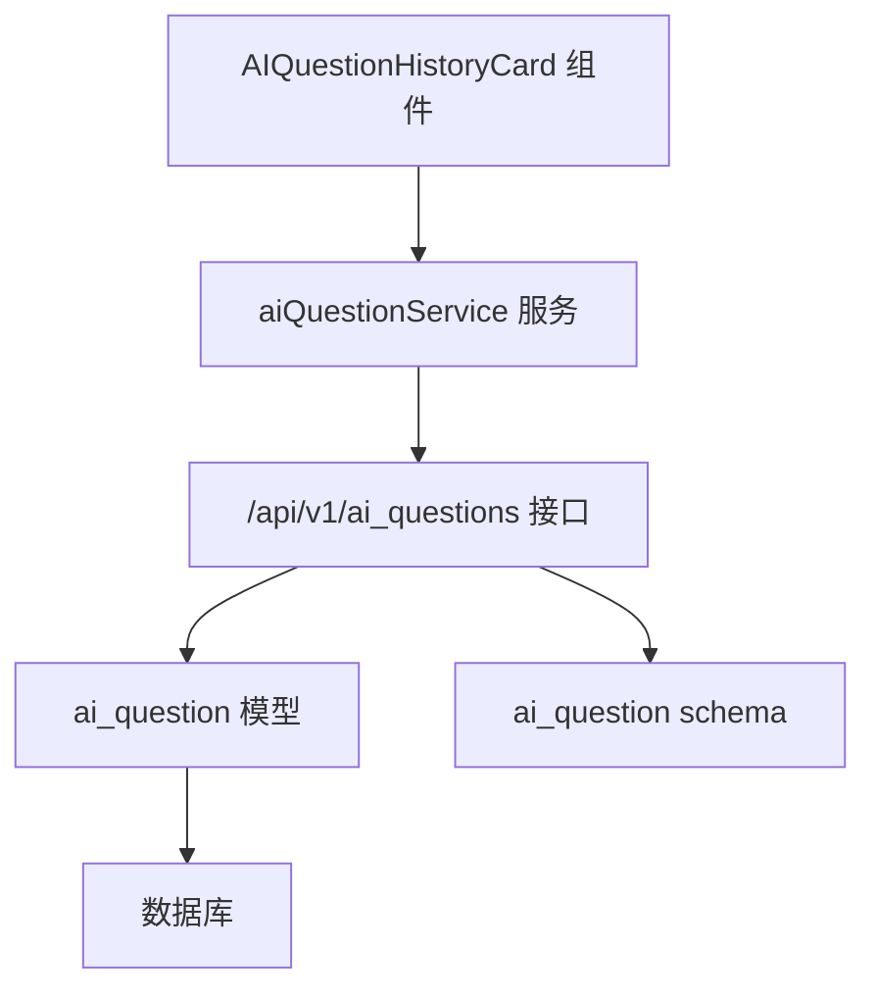
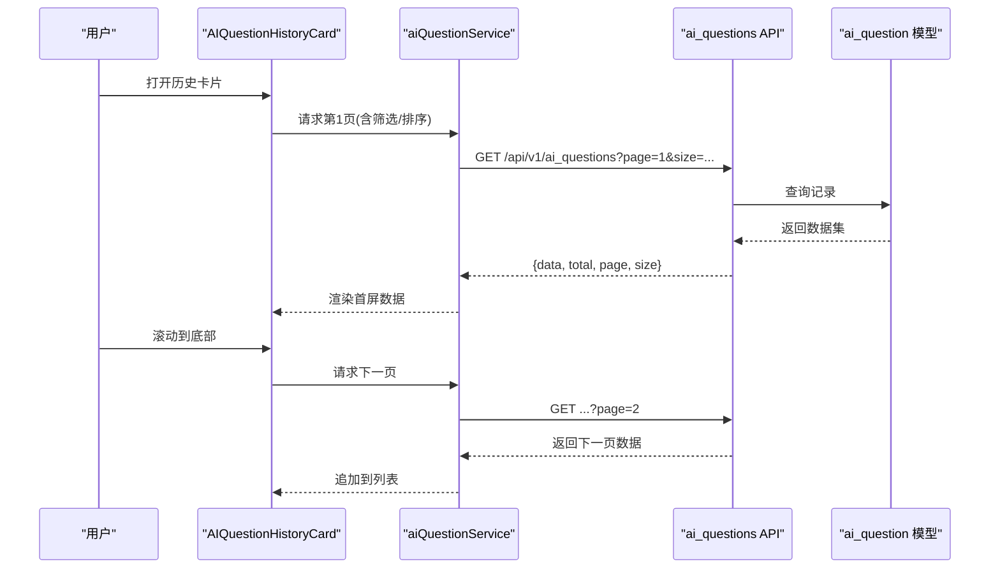
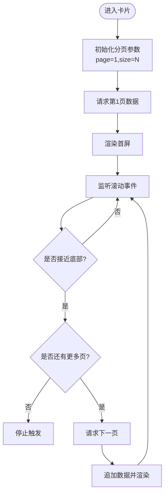
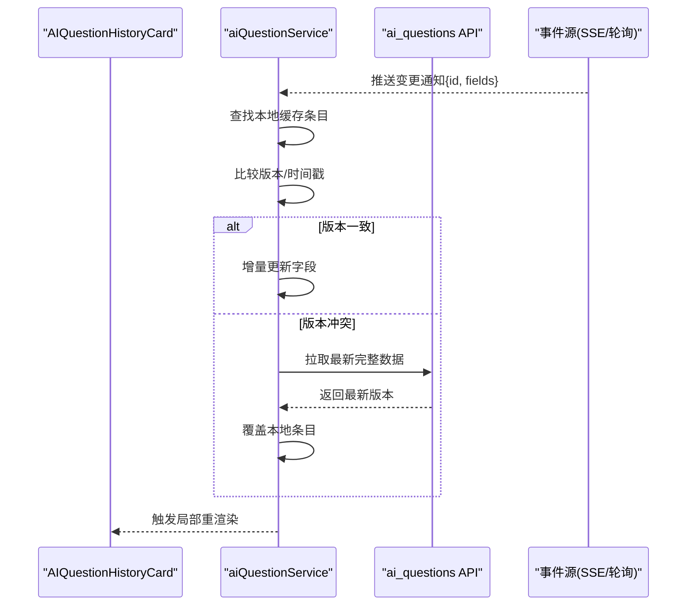
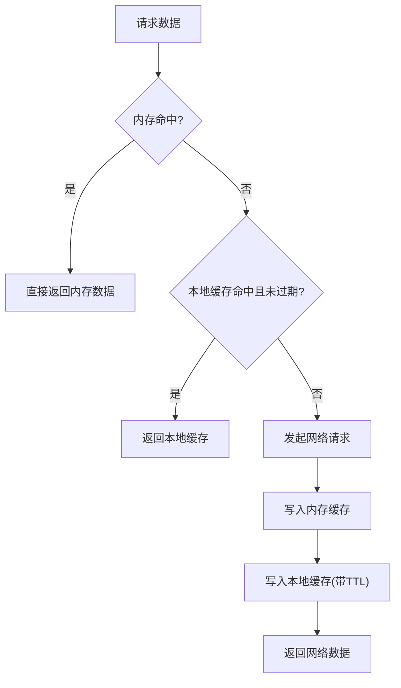
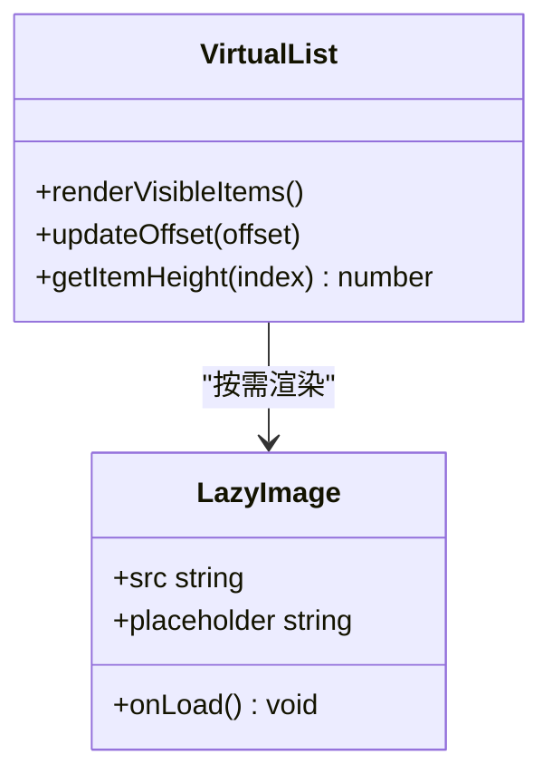
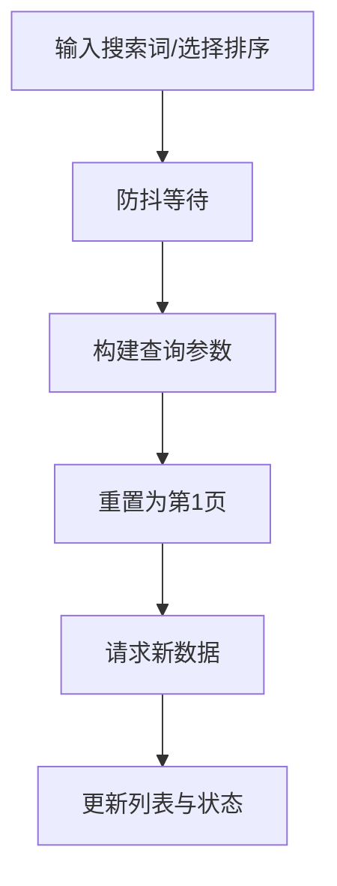
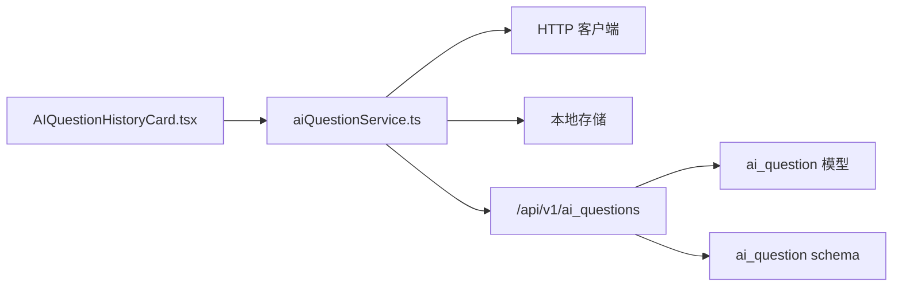

# AI问答历史卡片

<cite>
**本文引用的文件**   
- [AIQuestionHistoryCard.tsx](file://frontend/src/components/AIQuestionHistoryCard.tsx)
- [aiQuestionService.ts](file://frontend/src/services/aiQuestionService.ts)
- [ai_questions.py](file://backend/app/api/v1/ai_questions.py)
- [ai_question.py](file://backend/app/models/ai_question.py)
- [ai_question.py](file://backend/app/schemas/ai_question.py)
</cite>

## 目录
1. [简介](#简介)
2. [项目结构](#项目结构)
3. [核心组件](#核心组件)
4. [架构总览](#架构总览)
5. [详细组件分析](#详细组件分析)
6. [依赖分析](#依赖分析)
7. [性能考虑](#性能考虑)
8. [故障排查指南](#故障排查指南)
9. [结论](#结论)
10. [附录](#附录)

## 简介
本文件面向“AI问答历史卡片”（AIQuestionHistoryCard）的前端组件与后端接口，系统性阐述其滚动加载、状态同步、缓存策略、数据展示优化、用户交互增强、配置项以及性能监控与调试方法。文档以代码为依据，结合架构图与流程图，帮助开发者快速理解并扩展该功能。

## 项目结构
前端侧：
- 组件层：AIQuestionHistoryCard.tsx 负责历史问答列表的渲染、滚动加载、搜索过滤、排序、收藏标记等交互。
- 服务层：aiQuestionService.ts 封装对后端的请求，提供分页、增量更新、缓存读写等能力。
- 页面集成：在相关页面中引入并使用该卡片组件。

后端侧：
- API 层：ai_questions.py 暴露查询历史问答的分页接口，支持筛选、排序、分页参数。
- 模型层：ai_question.py 定义数据库模型字段与关系。
- Schema 层：ai_question.py 定义请求/响应数据结构校验。

图表来源
- [AIQuestionHistoryCard.tsx](file://frontend/src/components/AIQuestionHistoryCard.tsx)
- [aiQuestionService.ts](file://frontend/src/services/aiQuestionService.ts)
- [ai_questions.py](file://backend/app/api/v1/ai_questions.py)
- [ai_question.py](file://backend/app/models/ai_question.py)
- [ai_question.py](file://backend/app/schemas/ai_question.py)

章节来源
- [AIQuestionHistoryCard.tsx](file://frontend/src/components/AIQuestionHistoryCard.tsx)
- [aiQuestionService.ts](file://frontend/src/services/aiQuestionService.ts)
- [ai_questions.py](file://backend/app/api/v1/ai_questions.py)
- [ai_question.py](file://backend/app/models/ai_question.py)
- [ai_question.py](file://backend/app/schemas/ai_question.py)

## 核心组件
- AIQuestionHistoryCard：承载历史问答列表的展示与交互，包括无限滚动、分页加载、搜索过滤、排序、收藏标记、主题定制、事件回调等。
- aiQuestionService：统一的数据访问层，负责请求构建、分页参数组装、错误处理、缓存读写、增量更新与冲突合并。

章节来源
- [AIQuestionHistoryCard.tsx](file://frontend/src/components/AIQuestionHistoryCard.tsx)
- [aiQuestionService.ts](file://frontend/src/services/aiQuestionService.ts)

## 架构总览
整体采用“组件-服务-接口-模型”的分层架构。组件通过服务发起分页请求，服务根据本地缓存与网络状态决定数据来源；后端接口按分页参数返回数据，并对筛选、排序进行服务端处理。

图表来源
- [AIQuestionHistoryCard.tsx](file://frontend/src/components/AIQuestionHistoryCard.tsx)
- [aiQuestionService.ts](file://frontend/src/services/aiQuestionService.ts)
- [ai_questions.py](file://backend/app/api/v1/ai_questions.py)
- [ai_question.py](file://backend/app/models/ai_question.py)

## 详细组件分析

### 滚动加载机制（无限滚动与分页）
- 触发条件：监听容器滚动位置，当接近底部阈值时自动触发下一页加载。
- 分页参数：page、size、total 由服务层维护，避免重复请求。
- 防抖与节流：滚动事件使用节流减少频繁计算；加载完成后再启用下一次触发。
- 边界处理：无更多数据时停止触发；网络失败时显示重试提示。

图表来源
- [AIQuestionHistoryCard.tsx](file://frontend/src/components/AIQuestionHistoryCard.tsx)
- [aiQuestionService.ts](file://frontend/src/services/aiQuestionService.ts)

章节来源
- [AIQuestionHistoryCard.tsx](file://frontend/src/components/AIQuestionHistoryCard.tsx)
- [aiQuestionService.ts](file://frontend/src/services/aiQuestionService.ts)

### 状态同步策略（实时更新、增量更新、冲突处理）
- 实时更新：通过轮询或事件通道（如 SSE/WebSocket）监听数据变化，收到变更后刷新对应条目。
- 增量更新：仅更新变更字段，保持其他状态不变，减少重渲染开销。
- 冲突处理：基于时间戳或版本号进行合并；若客户端与服务器版本不一致，优先采用服务器版本并提示用户。

图表来源
- [AIQuestionHistoryCard.tsx](file://frontend/src/components/AIQuestionHistoryCard.tsx)
- [aiQuestionService.ts](file://frontend/src/services/aiQuestionService.ts)
- [ai_questions.py](file://backend/app/api/v1/ai_questions.py)

章节来源
- [AIQuestionHistoryCard.tsx](file://frontend/src/components/AIQuestionHistoryCard.tsx)
- [aiQuestionService.ts](file://frontend/src/services/aiQuestionService.ts)

### 缓存策略设计（本地缓存、内存缓存、失效机制）
- 内存缓存：在组件生命周期内缓存已加载页数据，避免重复请求。
- 本地缓存：将分页结果持久化到 localStorage/sessionStorage，提升冷启动速度。
- 失效机制：
  - 时间过期：超过 TTL 自动失效。
  - 条件失效：筛选条件、排序规则变化时失效对应缓存。
  - 主动失效：新增/编辑/删除操作后失效相关键。

图表来源
- [aiQuestionService.ts](file://frontend/src/services/aiQuestionService.ts)

章节来源
- [aiQuestionService.ts](file://frontend/src/services/aiQuestionService.ts)

### 数据展示优化（虚拟列表、懒加载、图片优化）
- 虚拟列表：仅渲染可视区域条目，降低 DOM 节点数量，提升滚动性能。
- 懒加载：非关键内容（如详情、长文本）按需展开；图片延迟加载。
- 图片优化：使用缩略图、占位图、CDN 压缩；设置宽高避免布局抖动。

图表来源
- [AIQuestionHistoryCard.tsx](file://frontend/src/components/AIQuestionHistoryCard.tsx)

章节来源
- [AIQuestionHistoryCard.tsx](file://frontend/src/components/AIQuestionHistoryCard.tsx)

### 用户交互增强（搜索过滤、排序、收藏标记）
- 搜索过滤：支持关键词匹配、多字段组合筛选；输入防抖以减少请求频率。
- 排序：支持按时间、评分、收藏数等维度排序；切换排序时重置分页并重新加载。
- 收藏标记：点击收藏按钮即时反馈，异步提交至后端；失败回滚并提示。

图表来源
- [AIQuestionHistoryCard.tsx](file://frontend/src/components/AIQuestionHistoryCard.tsx)
- [aiQuestionService.ts](file://frontend/src/services/aiQuestionService.ts)

章节来源
- [AIQuestionHistoryCard.tsx](file://frontend/src/components/AIQuestionHistoryCard.tsx)
- [aiQuestionService.ts](file://frontend/src/services/aiQuestionService.ts)

### 组件配置选项（主题定制、行为配置、事件监听）
- 主题定制：颜色、字体、间距、圆角等样式变量，支持明暗主题切换。
- 行为配置：每页大小、滚动阈值、是否启用虚拟列表、是否启用本地缓存、TTL 时长等。
- 事件监听：加载开始/结束、错误回调、收藏状态变化回调、分页变化回调等。

章节来源
- [AIQuestionHistoryCard.tsx](file://frontend/src/components/AIQuestionHistoryCard.tsx)

## 依赖分析
- 前端依赖：
  - AIQuestionHistoryCard 依赖 aiQuestionService 进行数据获取与缓存管理。
  - aiQuestionService 依赖 HTTP 客户端与本地存储模块。
- 后端依赖：
  - ai_questions API 依赖 ai_question 模型与 schema 进行数据校验与查询。

图表来源
- [AIQuestionHistoryCard.tsx](file://frontend/src/components/AIQuestionHistoryCard.tsx)
- [aiQuestionService.ts](file://frontend/src/services/aiQuestionService.ts)
- [ai_questions.py](file://backend/app/api/v1/ai_questions.py)
- [ai_question.py](file://backend/app/models/ai_question.py)
- [ai_question.py](file://backend/app/schemas/ai_question.py)

章节来源
- [AIQuestionHistoryCard.tsx](file://frontend/src/components/AIQuestionHistoryCard.tsx)
- [aiQuestionService.ts](file://frontend/src/services/aiQuestionService.ts)
- [ai_questions.py](file://backend/app/api/v1/ai_questions.py)
- [ai_question.py](file://backend/app/models/ai_question.py)
- [ai_question.py](file://backend/app/schemas/ai_question.py)

## 性能考虑
- 滚动性能：使用虚拟列表与节流，控制渲染批次，避免主线程阻塞。
- 网络性能：分页加载、去重请求、并发限制；合理设置缓存 TTL。
- 渲染性能：最小化重渲染范围，使用 key 稳定标识；图片懒加载与占位图。
- 内存占用：及时释放不再使用的缓存条目；清理定时器与事件监听器。

[本节为通用指导，不直接分析具体文件]

## 故障排查指南
- 常见问题：
  - 滚动不触发下一页：检查滚动阈值与容器高度计算是否正确。
  - 重复加载：确认分页状态与去重逻辑是否生效。
  - 缓存不一致：核对 TTL 与失效条件；必要时清空本地缓存重试。
  - 收藏状态不同步：检查冲突处理逻辑与网络重试策略。
- 调试建议：
  - 在服务层打印请求参数与响应结构，验证分页与筛选。
  - 在组件层输出渲染次数与可见项范围，评估虚拟列表效果。
  - 使用浏览器网络面板观察请求频率与耗时，定位瓶颈。

章节来源
- [AIQuestionHistoryCard.tsx](file://frontend/src/components/AIQuestionHistoryCard.tsx)
- [aiQuestionService.ts](file://frontend/src/services/aiQuestionService.ts)

## 结论
AIQuestionHistoryCard 通过分层架构与完善的缓存、滚动加载、状态同步与展示优化策略，提供了高性能、可配置、易扩展的历史问答卡片体验。建议在后续迭代中持续完善事件体系、错误恢复与监控指标，以提升稳定性与可观测性。

[本节为总结，不直接分析具体文件]

## 附录
- 参考实现路径：
  - 组件入口与交互逻辑：[AIQuestionHistoryCard.tsx](file://frontend/src/components/AIQuestionHistoryCard.tsx)
  - 数据服务与缓存实现：[aiQuestionService.ts](file://frontend/src/services/aiQuestionService.ts)
  - 后端分页接口：[ai_questions.py](file://backend/app/api/v1/ai_questions.py)
  - 数据模型与校验：[ai_question.py](file://backend/app/models/ai_question.py)、[ai_question.py](file://backend/app/schemas/ai_question.py)