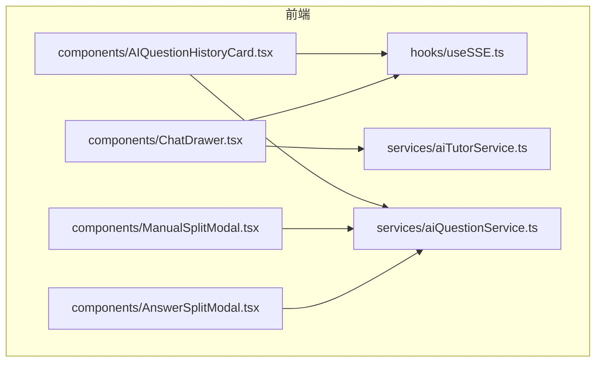
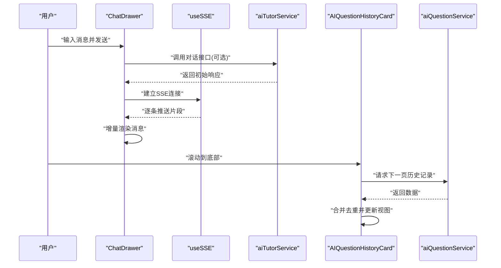
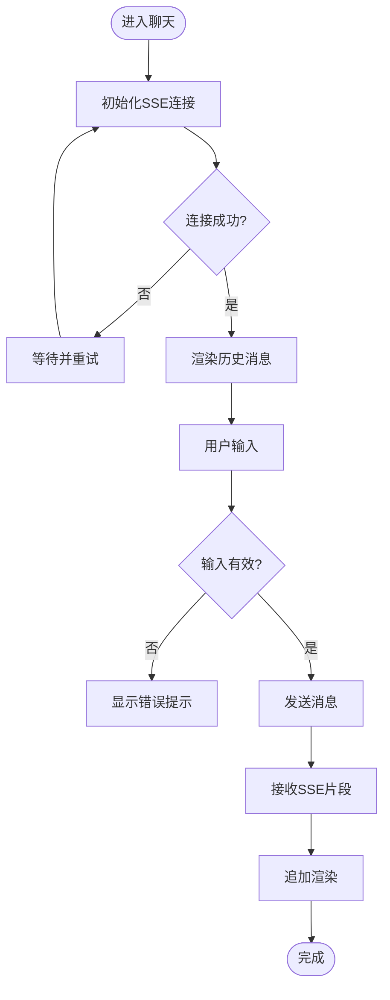
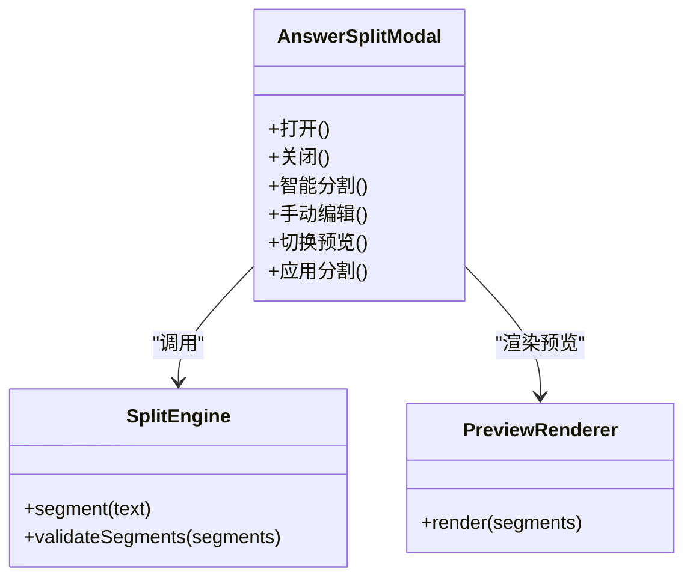
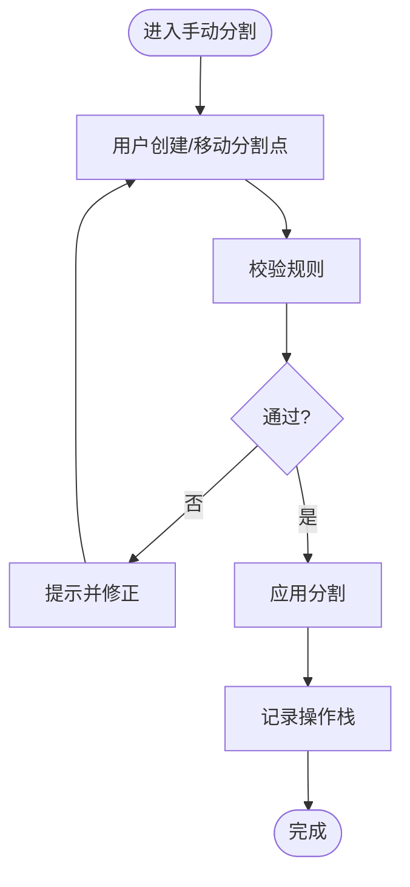
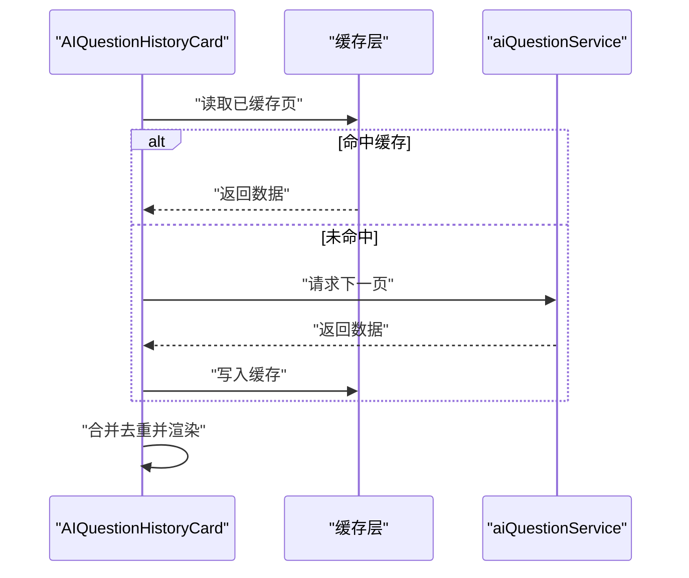
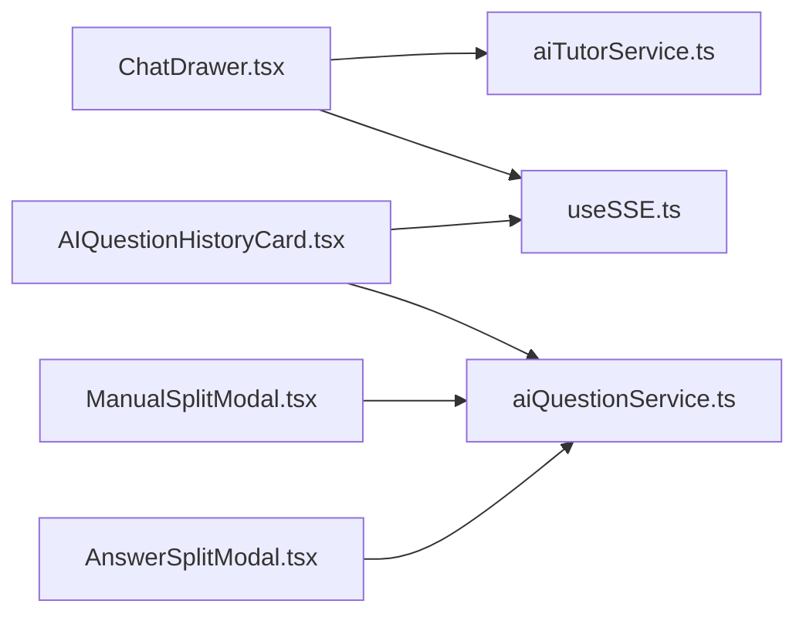

# 交互组件开发

<cite>
**本文引用的文件**   
- [ChatDrawer.tsx](file://frontend/src/components/ChatDrawer.tsx)
- [AnswerSplitModal.tsx](file://frontend/src/components/AnswerSplitModal.tsx)
- [ManualSplitModal.tsx](file://frontend/src/components/ManualSplitModal.tsx)
- [AIQuestionHistoryCard.tsx](file://frontend/src/components/AIQuestionHistoryCard.tsx)
- [useSSE.ts](file://frontend/src/hooks/useSSE.ts)
- [aiTutorService.ts](file://frontend/src/services/aiTutorService.ts)
- [aiQuestionService.ts](file://frontend/src/services/aiQuestionService.ts)
</cite>

## 目录
1. [简介](#简介)
2. [项目结构](#项目结构)
3. [核心组件](#核心组件)
4. [架构总览](#架构总览)
5. [详细组件分析](#详细组件分析)
6. [依赖分析](#依赖分析)
7. [性能考虑](#性能考虑)
8. [故障排查指南](#故障排查指南)
9. [结论](#结论)
10. [附录](#附录)

## 简介
本指南面向交互组件开发者，聚焦以下四个关键组件：
- ChatDrawer 聊天抽屉：实时通信、消息渲染与输入处理
- AnswerSplitModal 答案分割模态框：智能分割、手动编辑与预览
- ManualSplitModal 手动分割组件：用户交互、验证规则、撤销重做
- AIQuestionHistoryCard 历史问答卡片：滚动加载、状态同步与缓存策略

文档从系统架构到代码级实现进行分层解析，提供流程图与时序图帮助理解数据流与事件流，并给出复杂交互场景下的状态管理、事件冒泡处理与用户体验优化建议。

## 项目结构
前端采用按功能域组织的方式，交互组件集中于 components 目录，相关服务在 services 目录，实时通信能力通过 hooks/useSSE.ts 封装。

图表来源
- [ChatDrawer.tsx](file://frontend/src/components/ChatDrawer.tsx)
- [AnswerSplitModal.tsx](file://frontend/src/components/AnswerSplitModal.tsx)
- [ManualSplitModal.tsx](file://frontend/src/components/ManualSplitModal.tsx)
- [AIQuestionHistoryCard.tsx](file://frontend/src/components/AIQuestionHistoryCard.tsx)
- [useSSE.ts](file://frontend/src/hooks/useSSE.ts)
- [aiTutorService.ts](file://frontend/src/services/aiTutorService.ts)
- [aiQuestionService.ts](file://frontend/src/services/aiQuestionService.ts)

章节来源
- [ChatDrawer.tsx](file://frontend/src/components/ChatDrawer.tsx)
- [AnswerSplitModal.tsx](file://frontend/src/components/AnswerSplitModal.tsx)
- [ManualSplitModal.tsx](file://frontend/src/components/ManualSplitModal.tsx)
- [AIQuestionHistoryCard.tsx](file://frontend/src/components/AIQuestionHistoryCard.tsx)
- [useSSE.ts](file://frontend/src/hooks/useSSE.ts)
- [aiTutorService.ts](file://frontend/src/services/aiTutorService.ts)
- [aiQuestionService.ts](file://frontend/src/services/aiQuestionService.ts)

## 核心组件
本节概述各组件的职责边界与对外接口约定，便于跨团队协作与集成。

- ChatDrawer
  - 职责：发起对话、接收服务端推送、渲染消息列表、处理输入与发送
  - 关键能力：SSE 连接管理、增量渲染、输入校验与防抖、错误提示
- AnswerSplitModal
  - 职责：对长答案进行智能切分、支持人工调整与预览
  - 关键能力：自动分段算法触发、段落编辑、预览模式切换、变更回写
- ManualSplitModal
  - 职责：以拖拽或点击方式手动划分答案段落
  - 关键能力：交互校验（最小段数、长度限制）、撤销/重做栈、批量操作
- AIQuestionHistoryCard
  - 职责：展示历史问答记录，支持分页滚动加载与状态同步
  - 关键能力：无限滚动、去重缓存、状态一致性、失败重试

章节来源
- [ChatDrawer.tsx](file://frontend/src/components/ChatDrawer.tsx)
- [AnswerSplitModal.tsx](file://frontend/src/components/AnswerSplitModal.tsx)
- [ManualSplitModal.tsx](file://frontend/src/components/ManualSplitModal.tsx)
- [AIQuestionHistoryCard.tsx](file://frontend/src/components/AIQuestionHistoryCard.tsx)

## 架构总览
下图展示了组件与服务层、实时通道之间的交互关系。

图表来源
- [ChatDrawer.tsx](file://frontend/src/components/ChatDrawer.tsx)
- [useSSE.ts](file://frontend/src/hooks/useSSE.ts)
- [aiTutorService.ts](file://frontend/src/services/aiTutorService.ts)
- [AIQuestionHistoryCard.tsx](file://frontend/src/components/AIQuestionHistoryCard.tsx)
- [aiQuestionService.ts](file://frontend/src/services/aiQuestionService.ts)

## 详细组件分析

### ChatDrawer 聊天抽屉
- 实时通信
  - 使用 SSE 钩子维持与服务端的长连接，按事件类型分流处理
  - 断线重连与心跳检测，避免长时间无响应导致会话失效
- 消息渲染
  - 消息列表采用虚拟滚动或增量更新策略，减少大列表重排
  - 区分用户消息与助手消息，支持富文本/Markdown 渲染
- 输入处理
  - 输入框具备基础校验（非空、长度限制）与防抖提交
  - 发送前可附加上下文信息（如题目ID、会话ID），确保后端路由正确

图表来源
- [ChatDrawer.tsx](file://frontend/src/components/ChatDrawer.tsx)
- [useSSE.ts](file://frontend/src/hooks/useSSE.ts)

章节来源
- [ChatDrawer.tsx](file://frontend/src/components/ChatDrawer.tsx)
- [useSSE.ts](file://frontend/src/hooks/useSSE.ts)
- [aiTutorService.ts](file://frontend/src/services/aiTutorService.ts)

### AnswerSplitModal 答案分割模态框
- 智能分割
  - 基于语义或固定分隔符进行自动分段，生成候选段落
  - 支持阈值调节与分段数量上限控制
- 手动编辑
  - 段落内联编辑、插入/删除段落、拖拽排序
  - 变更即时反馈，保留撤销/重做栈
- 预览
  - 提供只读预览模式，对比原始内容与分割结果
  - 一键应用分割结果，回写到上层状态

图表来源
- [AnswerSplitModal.tsx](file://frontend/src/components/AnswerSplitModal.tsx)

章节来源
- [AnswerSplitModal.tsx](file://frontend/src/components/AnswerSplitModal.tsx)

### ManualSplitModal 手动分割组件
- 用户交互
  - 通过点击或拖拽创建分割点，支持多选与批量移动
  - 提供快捷键与辅助对齐工具，提升效率
- 验证规则
  - 最少段数、最大段数、每段最小长度等约束
  - 非法操作时即时提示并阻止提交
- 撤销重做
  - 维护操作栈，支持多次撤销/重做
  - 快照粒度控制在段落级别，兼顾性能与体验

图表来源
- [ManualSplitModal.tsx](file://frontend/src/components/ManualSplitModal.tsx)

章节来源
- [ManualSplitModal.tsx](file://frontend/src/components/ManualSplitModal.tsx)

### AIQuestionHistoryCard 历史问答卡片
- 滚动加载
  - 监听容器滚动位置，到达阈值时触发下一页请求
  - 合并新数据并去重，保持列表顺序稳定
- 状态同步
  - 与全局会话状态保持一致，刷新后恢复上次阅读位置
  - 失败重试与降级策略（本地缓存优先）
- 缓存策略
  - 内存缓存最近页数据，磁盘缓存持久化
  - 过期时间与版本标记，保证数据一致性

图表来源
- [AIQuestionHistoryCard.tsx](file://frontend/src/components/AIQuestionHistoryCard.tsx)
- [aiQuestionService.ts](file://frontend/src/services/aiQuestionService.ts)

章节来源
- [AIQuestionHistoryCard.tsx](file://frontend/src/components/AIQuestionHistoryCard.tsx)
- [aiQuestionService.ts](file://frontend/src/services/aiQuestionService.ts)

## 依赖分析
组件间与服务层的依赖关系如下：

图表来源
- [ChatDrawer.tsx](file://frontend/src/components/ChatDrawer.tsx)
- [AnswerSplitModal.tsx](file://frontend/src/components/AnswerSplitModal.tsx)
- [ManualSplitModal.tsx](file://frontend/src/components/ManualSplitModal.tsx)
- [AIQuestionHistoryCard.tsx](file://frontend/src/components/AIQuestionHistoryCard.tsx)
- [useSSE.ts](file://frontend/src/hooks/useSSE.ts)
- [aiTutorService.ts](file://frontend/src/services/aiTutorService.ts)
- [aiQuestionService.ts](file://frontend/src/services/aiQuestionService.ts)

章节来源
- [ChatDrawer.tsx](file://frontend/src/components/ChatDrawer.tsx)
- [AnswerSplitModal.tsx](file://frontend/src/components/AnswerSplitModal.tsx)
- [ManualSplitModal.tsx](file://frontend/src/components/ManualSplitModal.tsx)
- [AIQuestionHistoryCard.tsx](file://frontend/src/components/AIQuestionHistoryCard.tsx)
- [useSSE.ts](file://frontend/src/hooks/useSSE.ts)
- [aiTutorService.ts](file://frontend/src/services/aiTutorService.ts)
- [aiQuestionService.ts](file://frontend/src/services/aiQuestionService.ts)

## 性能考虑
- 列表渲染
  - 对长列表启用虚拟滚动或增量更新，避免整表重绘
  - 为每条消息设置稳定 key，减少不必要的 diff
- 网络与流式
  - SSE 连接复用与优雅降级，弱网环境下降低推送频率
  - 图片与富媒体懒加载，按需渲染
- 计算与存储
  - 分割算法尽量在前端轻量执行，复杂任务交由后端
  - 缓存命中率监控与淘汰策略，防止内存泄漏

[本节为通用指导，不直接分析具体文件]

## 故障排查指南
- 实时通信问题
  - 检查 SSE 连接状态与错误回调，确认服务端推送格式
  - 断线重连间隔退避策略是否生效
- 分割逻辑异常
  - 校验规则边界条件（空内容、超长段落）
  - 撤销/重做栈是否越界或重复入栈
- 历史加载失败
  - 分页参数是否正确，去重键是否唯一
  - 缓存版本不一致导致的脏读

章节来源
- [useSSE.ts](file://frontend/src/hooks/useSSE.ts)
- [AnswerSplitModal.tsx](file://frontend/src/components/AnswerSplitModal.tsx)
- [ManualSplitModal.tsx](file://frontend/src/components/ManualSplitModal.tsx)
- [AIQuestionHistoryCard.tsx](file://frontend/src/components/AIQuestionHistoryCard.tsx)

## 结论
通过对 ChatDrawer、AnswerSplitModal、ManualSplitModal 与 AIQuestionHistoryCard 的深入分析，明确了各自职责、数据流与交互边界。结合 SSE 实时通信、智能与手动分割、滚动加载与缓存策略，可在复杂交互场景中实现高可用与良好体验。建议在后续迭代中持续优化性能指标与错误恢复机制。

[本节为总结性内容，不直接分析具体文件]

## 附录
- 术语
  - SSE：Server-Sent Events，服务端推送事件
  - 虚拟滚动：仅渲染可视区域元素以提升性能
  - 去重缓存：基于唯一键合并与过滤重复数据
- 最佳实践
  - 统一错误码与提示文案规范
  - 关键路径增加埋点与日志
  - 组件对外暴露最小必要 API，内部状态尽量私有

[本节为补充说明，不直接分析具体文件]