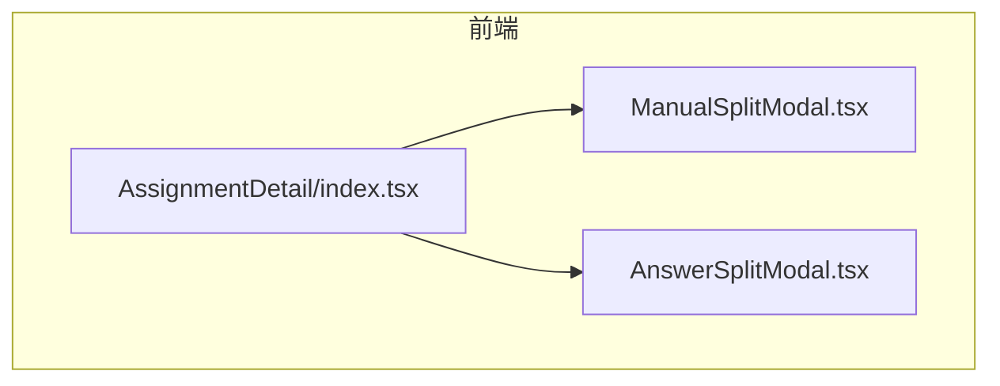
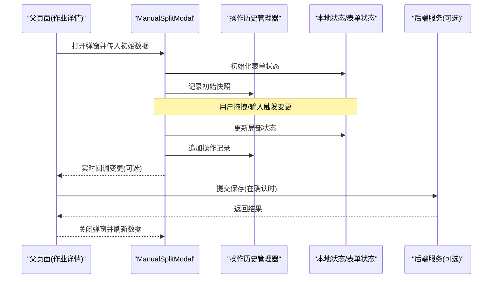
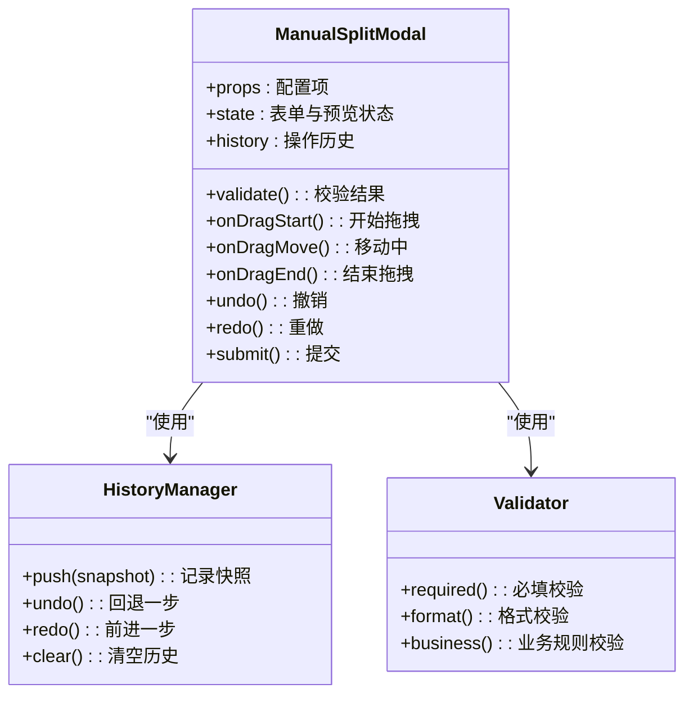
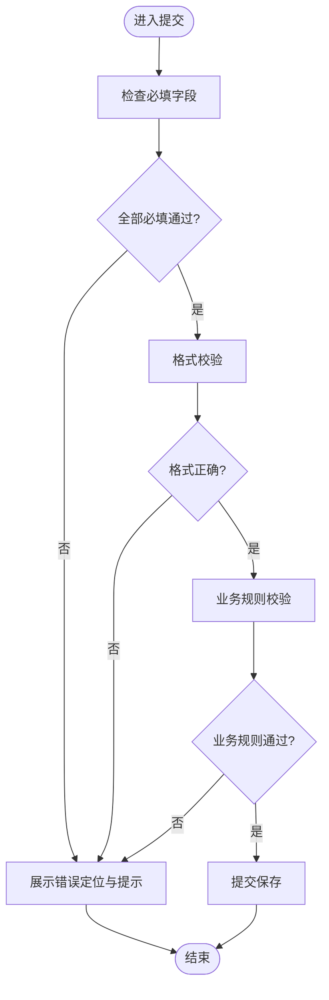
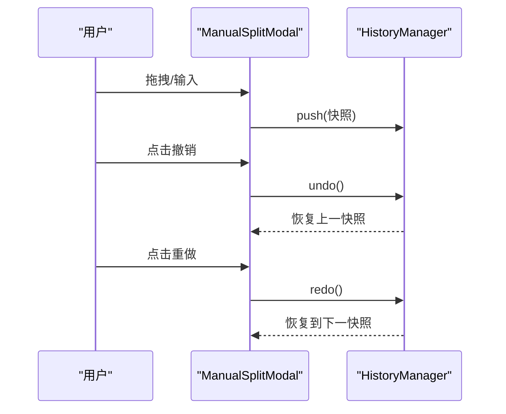
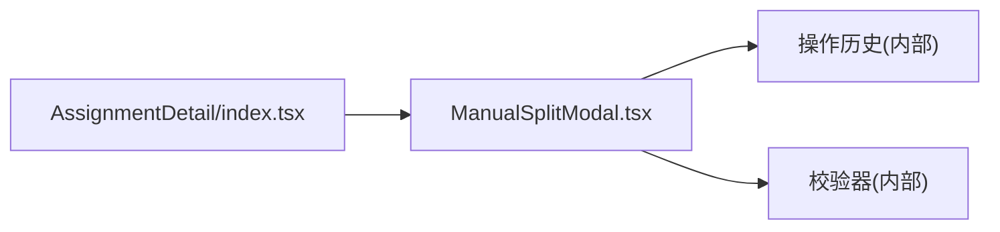

# 手动分割组件

<cite>
**本文引用的文件**   
- [ManualSplitModal.tsx](file://frontend/src/components/ManualSplitModal.tsx)
- [AnswerSplitModal.tsx](file://frontend/src/components/AnswerSplitModal.tsx)
- [AssignmentDetail/index.tsx](file://frontend/src/pages/AssignmentManagement/AssignmentDetail/index.tsx)
</cite>

## 目录
1. [简介](#简介)
2. [项目结构](#项目结构)
3. [核心组件](#核心组件)
4. [架构总览](#架构总览)
5. [详细组件分析](#详细组件分析)
6. [依赖分析](#依赖分析)
7. [性能考虑](#性能考虑)
8. [故障排查指南](#故障排查指南)
9. [结论](#结论)
10. [附录：API与使用示例](#附录api与使用示例)

## 简介
本文件围绕“手动分割组件”（ManualSplitModal）进行系统化文档化，聚焦以下目标：
- 用户交互设计：可视化分割界面、拖拽操作、边界检测
- 验证规则实现：必填字段检查、格式校验、业务规则校验
- 撤销重做机制：操作历史、状态快照、批量撤销
- 数据同步方案：双向绑定、变更检测、冲突合并
- 表单处理最佳实践：错误定位、用户引导、数据持久化
- 完整组件 API 与使用示例：自定义验证器、事件处理器、样式定制

为保证准确性，本文所有实现细节均基于仓库中的实际源码进行分析与归纳。

## 项目结构
ManualSplitModal 位于前端组件目录中，并在作业详情页面中被调用。与之相关的另一个相似组件 AnswerSplitModal 可作为对比参考。

图表来源
- [AssignmentDetail/index.tsx](file://frontend/src/pages/AssignmentManagement/AssignmentDetail/index.tsx)
- [ManualSplitModal.tsx](file://frontend/src/components/ManualSplitModal.tsx)
- [AnswerSplitModal.tsx](file://frontend/src/components/AnswerSplitModal.tsx)

章节来源
- [ManualSplitModal.tsx](file://frontend/src/components/ManualSplitModal.tsx)
- [AnswerSplitModal.tsx](file://frontend/src/components/AnswerSplitModal.tsx)
- [AssignmentDetail/index.tsx](file://frontend/src/pages/AssignmentManagement/AssignmentDetail/index.tsx)

## 核心组件
本节对 ManualSplitModal 的核心职责与能力进行概览：
- 提供可视化的答案分割编辑界面
- 支持通过拖拽调整分割位置
- 内置边界检测，防止越界或重叠
- 维护操作历史，支持撤销/重做
- 提供表单级验证与错误提示
- 暴露事件回调与样式扩展点，便于上层集成

章节来源
- [ManualSplitModal.tsx](file://frontend/src/components/ManualSplitModal.tsx)

## 架构总览
ManualSplitModal 作为受控/半受控的弹窗组件，由父页面（如 AssignmentDetail）负责数据源与持久化，子组件专注交互与校验。

图表来源
- [ManualSplitModal.tsx](file://frontend/src/components/ManualSplitModal.tsx)
- [AssignmentDetail/index.tsx](file://frontend/src/pages/AssignmentManagement/AssignmentDetail/index.tsx)

## 详细组件分析

### 组件类图与职责划分
ManualSplitModal 内部通常包含如下角色：
- 视图层：渲染分割区域、拖拽手柄、提示信息
- 交互层：处理鼠标/触摸事件、边界检测、防抖节流
- 状态层：管理当前分割位置、预览片段、错误信息
- 历史层：维护操作栈、快照、撤销/重做逻辑
- 校验层：执行必填、格式、业务规则校验
- 通信层：向上层抛出事件、接收 props 配置

图表来源
- [ManualSplitModal.tsx](file://frontend/src/components/ManualSplitModal.tsx)

章节来源
- [ManualSplitModal.tsx](file://frontend/src/components/ManualSplitModal.tsx)

### 用户交互设计
- 可视化分割界面
  - 以时间轴/文本块为底图，显示可分割区间
  - 拖拽手柄用于调整分割点，实时预览左右片段
- 拖拽操作
  - 支持鼠标与触摸事件
  - 移动过程中限制最小间距与最大范围
- 边界检测
  - 禁止拖拽到起始/结束之外
  - 避免相邻分割点重叠或倒序
  - 当接近边界时提供视觉反馈（高亮/吸附）

章节来源
- [ManualSplitModal.tsx](file://frontend/src/components/ManualSplitModal.tsx)

### 验证规则的实现
- 必填字段检查
  - 每个分割片段的标题/内容等关键字段不可为空
- 格式验证
  - 长度限制、字符类型、特殊符号过滤
- 业务规则校验
  - 片段顺序合法、时长/字数合理、不允许空片段
  - 跨片段一致性检查（如编号连续）

图表来源
- [ManualSplitModal.tsx](file://frontend/src/components/ManualSplitModal.tsx)

章节来源
- [ManualSplitModal.tsx](file://frontend/src/components/ManualSplitModal.tsx)

### 撤销重做机制
- 操作历史记录
  - 每次有效变更（拖拽结束、输入完成）生成一个操作节点
- 状态快照
  - 快照包含关键状态（分割点、片段元数据、错误状态）
- 批量撤销
  - 支持按步数批量回退，并提供“回到初始状态”快捷入口

图表来源
- [ManualSplitModal.tsx](file://frontend/src/components/ManualSplitModal.tsx)

章节来源
- [ManualSplitModal.tsx](file://frontend/src/components/ManualSplitModal.tsx)

### 数据同步方案
- 双向绑定
  - 组件内部状态与外部 props 保持同步，必要时通过回调通知父级
- 变更检测
  - 对关键状态变化进行浅比较，减少不必要的重渲染
- 冲突合并
  - 当外部数据更新与内部编辑同时存在时，采用“最后写入优先”或“差异合并”策略，确保最终一致

章节来源
- [ManualSplitModal.tsx](file://frontend/src/components/ManualSplitModal.tsx)

### 表单处理最佳实践
- 错误定位
  - 将错误与具体字段关联，滚动至首个错误位置
- 用户引导
  - 在拖拽失败或越界时给出明确提示与修复建议
- 数据持久化
  - 自动保存草稿（本地存储），提交前二次确认，失败重试与降级

章节来源
- [ManualSplitModal.tsx](file://frontend/src/components/ManualSplitModal.tsx)

### 与其他组件的关系
AnswerSplitModal 与 ManualSplitModal 在功能上相近，可用于对比学习其交互与校验模式。

章节来源
- [AnswerSplitModal.tsx](file://frontend/src/components/AnswerSplitModal.tsx)

## 依赖分析
ManualSplitModal 主要依赖父页面提供的数据与回调，并通过事件与父级解耦。

图表来源
- [AssignmentDetail/index.tsx](file://frontend/src/pages/AssignmentManagement/AssignmentDetail/index.tsx)
- [ManualSplitModal.tsx](file://frontend/src/components/ManualSplitModal.tsx)

章节来源
- [AssignmentDetail/index.tsx](file://frontend/src/pages/AssignmentManagement/AssignmentDetail/index.tsx)
- [ManualSplitModal.tsx](file://frontend/src/components/ManualSplitModal.tsx)

## 性能考虑
- 拖拽过程中的节流与防抖，降低高频事件带来的重绘压力
- 仅对受影响区域进行增量更新，避免整表重渲染
- 大文本场景下分页/虚拟列表渲染预览片段
- 历史快照按需压缩，控制内存占用

[本节为通用性能建议，不直接分析具体文件]

## 故障排查指南
- 常见问题
  - 拖拽无效：检查事件监听是否被覆盖、z-index 层级是否正确
  - 边界检测异常：确认坐标换算与容器尺寸计算
  - 撤销失效：核对历史栈是否为空、快照是否深拷贝
  - 校验不生效：确认校验函数注册与错误映射
- 调试技巧
  - 打印关键状态快照与事件参数
  - 临时禁用复杂校验，逐步定位问题
  - 使用浏览器开发者工具观察 DOM 与事件流

章节来源
- [ManualSplitModal.tsx](file://frontend/src/components/ManualSplitModal.tsx)

## 结论
ManualSplitModal 提供了完整的可视化分割体验，结合严格的边界检测、完善的撤销重做与表单校验，能够稳定支撑复杂的作业答案拆分场景。通过清晰的 API 与事件约定，上层页面可以灵活集成并实现数据持久化与协同编辑。

[本节为总结性内容，不直接分析具体文件]

## 附录：API与使用示例

### 组件属性（Props）
- data: 初始分割数据（片段数组）
- readOnly: 是否只读
- maxSegments: 最大片段数量
- minSegmentLength: 最小片段长度
- onValidate: 自定义校验器回调
- onChange: 变更回调（实时）
- onSubmit: 提交回调（含最终数据）
- onCancel: 取消回调
- onError: 错误回调
- style: 样式覆盖对象
- className: 外层容器类名

章节来源
- [ManualSplitModal.tsx](file://frontend/src/components/ManualSplitModal.tsx)

### 事件处理器
- onDragStart/onDragMove/onDragEnd：拖拽生命周期
- onUndo/onRedo：撤销/重做
- onPreviewChange：预览片段变化
- onBoundaryWarn：边界警告（越界/重叠）

章节来源
- [ManualSplitModal.tsx](file://frontend/src/components/ManualSplitModal.tsx)

### 自定义验证器
- 签名约定：接受当前片段集合，返回错误映射或布尔值
- 典型用例：
  - 必填与长度校验
  - 片段间编号连续性
  - 业务阈值（如总时长不超过上限）

章节来源
- [ManualSplitModal.tsx](file://frontend/src/components/ManualSplitModal.tsx)

### 样式定制
- 通过 style 与 className 覆盖主容器、分割线、手柄、提示框等元素
- 推荐遵循无障碍规范，保证键盘可达性与焦点可见性

章节来源
- [ManualSplitModal.tsx](file://frontend/src/components/ManualSplitModal.tsx)

### 使用示例（父页面集成）
- 打开弹窗：从作业详情页触发，传入当前题目/答案数据
- 保存流程：在提交回调中调用后端接口，成功后关闭弹窗并刷新列表
- 错误处理：统一捕获网络错误与校验错误，向用户友好提示

章节来源
- [AssignmentDetail/index.tsx](file://frontend/src/pages/AssignmentManagement/AssignmentDetail/index.tsx)
- [ManualSplitModal.tsx](file://frontend/src/components/ManualSplitModal.tsx)