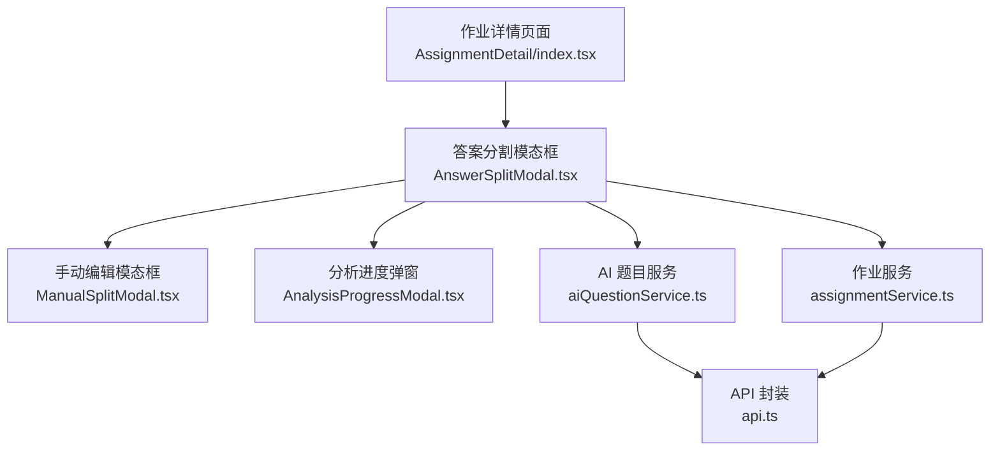
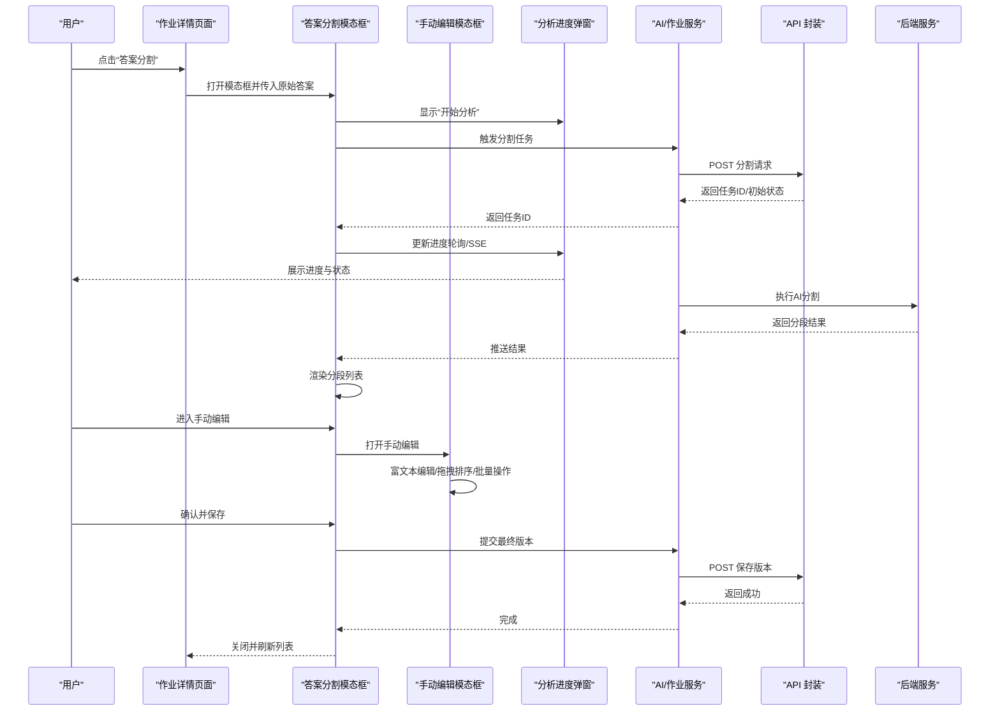
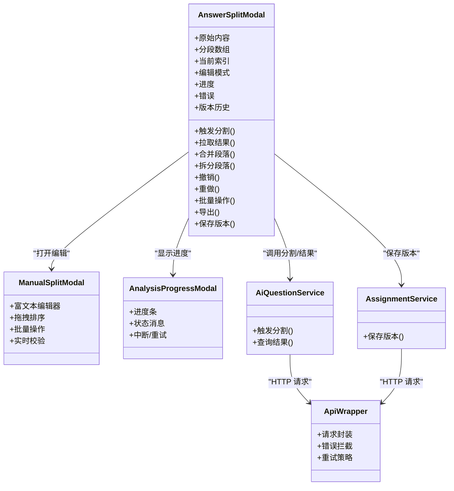
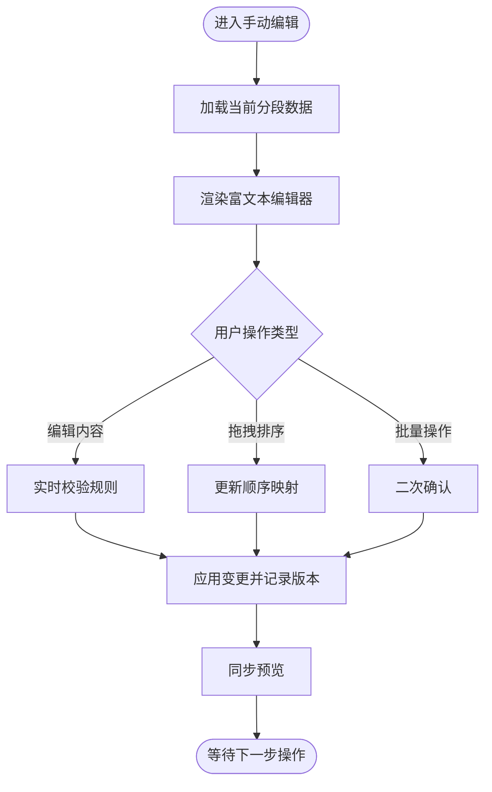
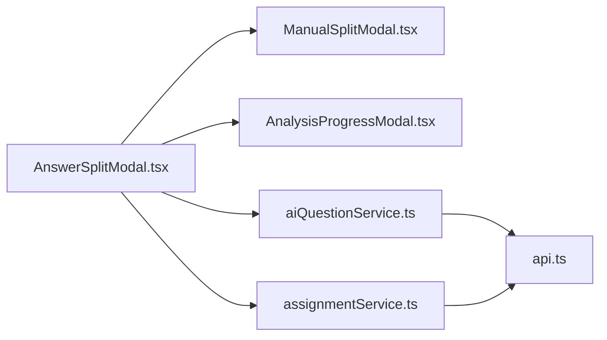

# 答案分割模态框

<cite>
**本文引用的文件**   
- [AnswerSplitModal.tsx](file://frontend/src/components/AnswerSplitModal.tsx)
- [ManualSplitModal.tsx](file://frontend/src/components/ManualSplitModal.tsx)
- [AnalysisProgressModal.tsx](file://frontend/src/components/AnalysisProgressModal.tsx)
- [aiQuestionService.ts](file://frontend/src/services/aiQuestionService.ts)
- [assignmentService.ts](file://frontend/src/services/assignmentService.ts)
- [api.ts](file://frontend/src/services/api.ts)
- [AssignmentDetail/index.tsx](file://frontend/src/pages/AssignmentManagement/AssignmentDetail/index.tsx)
</cite>

## 目录
1. [简介](#简介)
2. [项目结构](#项目结构)
3. [核心组件](#核心组件)
4. [架构总览](#架构总览)
5. [详细组件分析](#详细组件分析)
6. [依赖分析](#依赖分析)
7. [性能考虑](#性能考虑)
8. [故障排查指南](#故障排查指南)
9. [结论](#结论)
10. [附录](#附录)

## 简介
本文件围绕“答案分割模态框”进行系统化开发文档编写，覆盖智能分割算法、手动编辑能力、预览与导出、复杂交互（撤销重做、版本控制、冲突解决）、用户体验优化以及配置与事件回调接口。目标是帮助开发者快速理解并扩展该功能模块，同时为产品与测试人员提供清晰的验收标准与排障指引。

## 项目结构
答案分割相关的前端实现集中在 components 与 services 层：
- AnswerSplitModal.tsx：主入口模态框，负责触发 AI 分割、展示结果、联动手动编辑与预览。
- ManualSplitModal.tsx：手动编辑模态框，支持富文本编辑、拖拽排序、批量操作等。
- AnalysisProgressModal.tsx：分析进度弹窗，用于长耗时任务的状态反馈。
- aiQuestionService.ts / assignmentService.ts：封装与后端 API 的调用，包括触发分割、获取结果、保存版本等。
- api.ts：统一请求封装与拦截器。
- AssignmentDetail/index.tsx：作业详情页面，作为 AnswerSplitModal 的宿主场景之一。

图表来源
- [AssignmentDetail/index.tsx](file://frontend/src/pages/AssignmentManagement/AssignmentDetail/index.tsx)
- [AnswerSplitModal.tsx](file://frontend/src/components/AnswerSplitModal.tsx)
- [ManualSplitModal.tsx](file://frontend/src/components/ManualSplitModal.tsx)
- [AnalysisProgressModal.tsx](file://frontend/src/components/AnalysisProgressModal.tsx)
- [aiQuestionService.ts](file://frontend/src/services/aiQuestionService.ts)
- [assignmentService.ts](file://frontend/src/services/assignmentService.ts)
- [api.ts](file://frontend/src/services/api.ts)

章节来源
- [AnswerSplitModal.tsx](file://frontend/src/components/AnswerSplitModal.tsx)
- [ManualSplitModal.tsx](file://frontend/src/components/ManualSplitModal.tsx)
- [AnalysisProgressModal.tsx](file://frontend/src/components/AnalysisProgressModal.tsx)
- [aiQuestionService.ts](file://frontend/src/services/aiQuestionService.ts)
- [assignmentService.ts](file://frontend/src/services/assignmentService.ts)
- [api.ts](file://frontend/src/services/api.ts)
- [AssignmentDetail/index.tsx](file://frontend/src/pages/AssignmentManagement/AssignmentDetail/index.tsx)

## 核心组件
- 答案分割模态框（AnswerSplitModal）
  - 职责：承载完整的答案分割工作流，包括触发 AI 分割、展示分段结果、进入手动编辑、预览校验、导出与保存。
  - 关键状态：原始答案、分割结果列表、当前选中段落、编辑模式开关、进度状态、错误信息、版本快照。
  - 关键行为：发起分割、合并/拆分段落、撤销/重做、批量删除/复制、导出为多种格式、保存版本。
- 手动编辑模态框（ManualSplitModal）
  - 职责：提供富文本编辑能力、段落拖拽排序、批量操作（多选、批量删除、批量移动）。
  - 关键能力：编辑器集成、拖拽排序、快捷键、实时校验提示。
- 分析进度弹窗（AnalysisProgressModal）
  - 职责：在 AI 分割或批量处理期间提供进度反馈、中断与重试机制。
- 服务层（aiQuestionService / assignmentService）
  - 职责：封装与后端的 REST/异步任务交互，包括触发分割、轮询/订阅进度、拉取结果、保存版本。
- API 封装（api.ts）
  - 职责：统一的请求构建、错误拦截、重试策略、超时控制。

章节来源
- [AnswerSplitModal.tsx](file://frontend/src/components/AnswerSplitModal.tsx)
- [ManualSplitModal.tsx](file://frontend/src/components/ManualSplitModal.tsx)
- [AnalysisProgressModal.tsx](file://frontend/src/components/AnalysisProgressModal.tsx)
- [aiQuestionService.ts](file://frontend/src/services/aiQuestionService.ts)
- [assignmentService.ts](file://frontend/src/services/assignmentService.ts)
- [api.ts](file://frontend/src/services/api.ts)

## 架构总览
从用户操作到数据落库的整体流程如下：

图表来源
- [AssignmentDetail/index.tsx](file://frontend/src/pages/AssignmentManagement/AssignmentDetail/index.tsx)
- [AnswerSplitModal.tsx](file://frontend/src/components/AnswerSplitModal.tsx)
- [ManualSplitModal.tsx](file://frontend/src/components/ManualSplitModal.tsx)
- [AnalysisProgressModal.tsx](file://frontend/src/components/AnalysisProgressModal.tsx)
- [aiQuestionService.ts](file://frontend/src/services/aiQuestionService.ts)
- [assignmentService.ts](file://frontend/src/services/assignmentService.ts)
- [api.ts](file://frontend/src/services/api.ts)

## 详细组件分析

### 答案分割模态框（AnswerSplitModal）
- 设计要点
  - 以“任务化”方式驱动分割流程：创建任务 -> 进度反馈 -> 结果渲染 -> 人工修正 -> 保存版本。
  - 将“自动分割结果”与“手动编辑结果”解耦，通过版本快照记录每次变更。
  - 提供撤销/重做栈，确保可回溯；对批量操作进行幂等处理。
- 关键状态与字段（示例说明）
  - 原始内容、分段数组、当前索引、编辑模式、进度、错误、版本历史。
- 关键方法（示例说明）
  - 触发分割、拉取结果、合并/拆分段落、撤销/重做、批量操作、导出、保存版本。
- 与服务的交互
  - 使用 aiQuestionService 触发分割与获取结果；使用 assignmentService 保存版本。
- 与 UI 的协作
  - 通过 AnalysisProgressModal 展示进度；通过 ManualSplitModal 进行富文本编辑与拖拽排序。

图表来源
- [AnswerSplitModal.tsx](file://frontend/src/components/AnswerSplitModal.tsx)
- [ManualSplitModal.tsx](file://frontend/src/components/ManualSplitModal.tsx)
- [AnalysisProgressModal.tsx](file://frontend/src/components/AnalysisProgressModal.tsx)
- [aiQuestionService.ts](file://frontend/src/services/aiQuestionService.ts)
- [assignmentService.ts](file://frontend/src/services/assignmentService.ts)
- [api.ts](file://frontend/src/services/api.ts)

章节来源
- [AnswerSplitModal.tsx](file://frontend/src/components/AnswerSplitModal.tsx)
- [ManualSplitModal.tsx](file://frontend/src/components/ManualSplitModal.tsx)
- [AnalysisProgressModal.tsx](file://frontend/src/components/AnalysisProgressModal.tsx)
- [aiQuestionService.ts](file://frontend/src/services/aiQuestionService.ts)
- [assignmentService.ts](file://frontend/src/services/assignmentService.ts)
- [api.ts](file://frontend/src/services/api.ts)

### 手动编辑模态框（ManualSplitModal）
- 富文本编辑器集成
  - 支持插入/删除段落、加粗/斜体/列表等基础样式；保持与分割结果的结构一致。
- 拖拽排序
  - 基于 HTML5 Drag & Drop 或第三方库实现，维护稳定的 key 与顺序映射。
- 批量操作
  - 多选段落后进行批量删除、复制、移动到指定位置；操作前进行二次确认。
- 实时校验
  - 对空段落、重复标题、过长段落等进行高亮提示，并提供一键修复建议。

图表来源
- [ManualSplitModal.tsx](file://frontend/src/components/ManualSplitModal.tsx)
- [AnswerSplitModal.tsx](file://frontend/src/components/AnswerSplitModal.tsx)

章节来源
- [ManualSplitModal.tsx](file://frontend/src/components/ManualSplitModal.tsx)
- [AnswerSplitModal.tsx](file://frontend/src/components/AnswerSplitModal.tsx)

### 分析进度弹窗（AnalysisProgressModal）
- 进度反馈
  - 支持百分比、阶段描述、预计剩余时间；失败时提供重试按钮。
- 中断与恢复
  - 允许用户主动中断任务；支持断点续查（若后端支持）。
- 与主流程联动
  - 当分割完成时自动关闭并通知父组件渲染结果。

章节来源
- [AnalysisProgressModal.tsx](file://frontend/src/components/AnalysisProgressModal.tsx)
- [AnswerSplitModal.tsx](file://frontend/src/components/AnswerSplitModal.tsx)

### 服务层与 API 封装
- aiQuestionService
  - 触发分割：POST 分割任务，返回任务 ID。
  - 查询结果：根据任务 ID 轮询或 SSE 接收结果。
- assignmentService
  - 保存版本：提交最终分段结果与元数据。
- api.ts
  - 统一请求封装：URL 拼接、鉴权头、错误码处理、重试与超时。

章节来源
- [aiQuestionService.ts](file://frontend/src/services/aiQuestionService.ts)
- [assignmentService.ts](file://frontend/src/services/assignmentService.ts)
- [api.ts](file://frontend/src/services/api.ts)

## 依赖分析
- 组件耦合
  - AnswerSplitModal 是编排中心，依赖 ManualSplitModal 与 AnalysisProgressModal 提供子能力。
  - 服务层与 API 封装解耦业务逻辑与网络细节，便于替换与测试。
- 外部依赖
  - 富文本编辑器（如 Quill/TinyMCE/ProseMirror 等，具体取决于实现）。
  - 拖拽库（可选，HTML5 原生亦可）。
  - 导出库（如 SheetJS、html-to-docx 等，视导出格式而定）。
- 潜在循环依赖
  - 避免在 Modal 与服务之间互相引用；通过 props/callback 或服务单例解耦。

图表来源
- [AnswerSplitModal.tsx](file://frontend/src/components/AnswerSplitModal.tsx)
- [ManualSplitModal.tsx](file://frontend/src/components/ManualSplitModal.tsx)
- [AnalysisProgressModal.tsx](file://frontend/src/components/AnalysisProgressModal.tsx)
- [aiQuestionService.ts](file://frontend/src/services/aiQuestionService.ts)
- [assignmentService.ts](file://frontend/src/services/assignmentService.ts)
- [api.ts](file://frontend/src/services/api.ts)

章节来源
- [AnswerSplitModal.tsx](file://frontend/src/components/AnswerSplitModal.tsx)
- [ManualSplitModal.tsx](file://frontend/src/components/ManualSplitModal.tsx)
- [AnalysisProgressModal.tsx](file://frontend/src/components/AnalysisProgressModal.tsx)
- [aiQuestionService.ts](file://frontend/src/services/aiQuestionService.ts)
- [assignmentService.ts](file://frontend/src/services/assignmentService.ts)
- [api.ts](file://frontend/src/services/api.ts)

## 性能考虑
- 大段文本处理
  - 采用分块渲染与虚拟滚动，减少 DOM 压力。
  - 对富文本内容进行懒加载与增量更新。
- 拖拽排序
  - 使用稳定 key 与最小化重绘；必要时使用 requestAnimationFrame 批处理。
- 网络请求
  - 合理设置超时与重试；对长任务使用 SSE 或轮询退避策略。
- 内存管理
  - 及时释放监听器与定时器；避免闭包持有大对象引用。

[本节为通用指导，不直接分析具体文件]

## 故障排查指南
- 常见问题
  - 分割任务无响应：检查任务 ID 是否有效、SSE/轮询是否正确连接、后端是否返回错误码。
  - 富文本编辑异常：确认编辑器初始化参数、DOM 容器是否存在、样式冲突。
  - 拖拽失效：检查 dragstart/dragover/drop 事件绑定、z-index 遮挡、浏览器兼容性。
  - 导出失败：确认目标格式支持、依赖库安装、权限与路径。
- 定位步骤
  - 查看控制台错误与网络面板；核对 API 请求/响应。
  - 在关键节点打印状态快照，对比前后差异。
  - 复现最小用例，逐步缩小范围。

章节来源
- [api.ts](file://frontend/src/services/api.ts)
- [aiQuestionService.ts](file://frontend/src/services/aiQuestionService.ts)
- [assignmentService.ts](file://frontend/src/services/assignmentService.ts)
- [AnswerSplitModal.tsx](file://frontend/src/components/AnswerSplitModal.tsx)
- [ManualSplitModal.tsx](file://frontend/src/components/ManualSplitModal.tsx)
- [AnalysisProgressModal.tsx](file://frontend/src/components/AnalysisProgressModal.tsx)

## 结论
答案分割模态框通过“自动分割 + 手动编辑 + 预览导出 + 版本控制”的闭环，兼顾效率与可控性。建议在后续迭代中完善：
- 更丰富的语义分析与关键词提取策略。
- 更完善的撤销/重做与冲突合并机制。
- 更细粒度的权限与审计日志。
- 更友好的键盘导航与无障碍支持。

[本节为总结性内容，不直接分析具体文件]

## 附录

### 配置选项（示例说明）
- 分割策略
  - 语义阈值、关键词权重、段落长度限制、标题识别规则。
- 编辑器
  - 工具栏配置、主题、只读/编辑模式、占位符。
- 导出
  - 目标格式（PDF/Word/Excel）、模板选择、页眉页脚。
- 进度与错误
  - 超时时间、重试次数、错误提示文案。

[本节为概念性说明，不直接分析具体文件]

### 事件回调接口（示例说明）
- 生命周期
  - onOpen/onClose：模态框打开/关闭回调。
  - onResultReady：分割结果就绪回调。
  - onSaveVersion：保存版本回调。
- 交互
  - onSegmentChange：段落变更回调。
  - onBatchOperation：批量操作回调。
  - onExport：导出回调。
- 错误与进度
  - onError：错误回调。
  - onProgress：进度回调。

[本节为概念性说明，不直接分析具体文件]