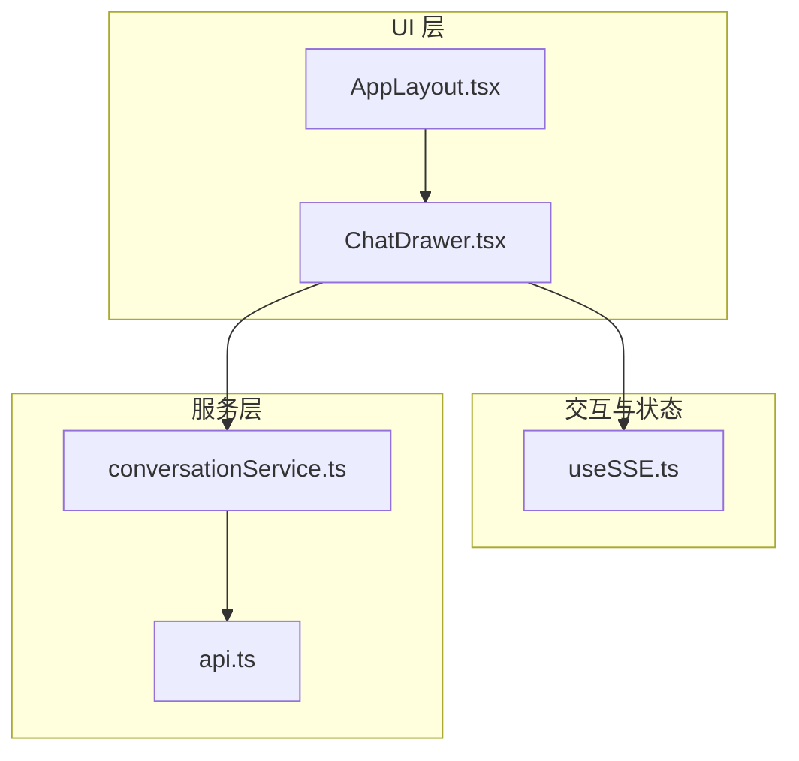
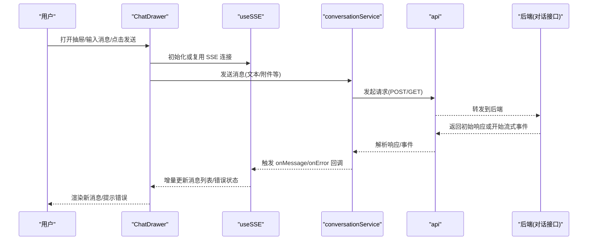
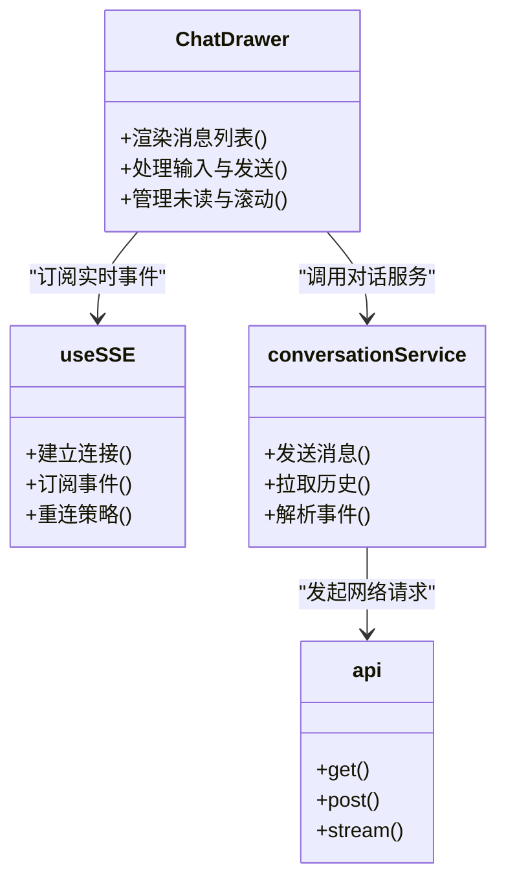

# 聊天抽屉组件

<cite>
**本文引用的文件**   
- [ChatDrawer.tsx](file://frontend/src/components/ChatDrawer.tsx)
- [useSSE.ts](file://frontend/src/hooks/useSSE.ts)
- [conversationService.ts](file://frontend/src/services/conversationService.ts)
- [api.ts](file://frontend/src/services/api.ts)
- [AppLayout.tsx](file://frontend/src/components/Layout/AppLayout.tsx)
</cite>

## 目录
1. [简介](#简介)
2. [项目结构](#项目结构)
3. [核心组件](#核心组件)
4. [架构总览](#架构总览)
5. [详细组件分析](#详细组件分析)
6. [依赖关系分析](#依赖关系分析)
7. [性能考虑](#性能考虑)
8. [故障排查指南](#故障排查指南)
9. [结论](#结论)
10. [附录：API 与扩展指南](#附录api-与扩展指南)

## 简介
本文件面向“聊天抽屉”（ChatDrawer）组件的开发与维护，聚焦以下目标：
- 实时通信机制：基于服务端事件（SSE）的流式消息接收、连接管理、错误重连策略。
- 消息渲染系统：支持文本、代码块、图片等类型的格式化显示。
- 输入处理逻辑：用户输入校验、快捷键支持、自动完成能力。
- 状态管理方案：消息历史缓存、滚动位置保持、未读消息计数。
- 性能优化：虚拟滚动、懒加载、内存管理。
- API 接口说明与自定义扩展指南。

## 项目结构
前端采用 React + TypeScript 技术栈，聊天抽屉位于 components 层，通过 hooks 与 services 协作完成数据获取与 UI 更新。

图表来源
- [ChatDrawer.tsx](file://frontend/src/components/ChatDrawer.tsx)
- [useSSE.ts](file://frontend/src/hooks/useSSE.ts)
- [conversationService.ts](file://frontend/src/services/conversationService.ts)
- [api.ts](file://frontend/src/services/api.ts)
- [AppLayout.tsx](file://frontend/src/components/Layout/AppLayout.tsx)

章节来源
- [ChatDrawer.tsx](file://frontend/src/components/ChatDrawer.tsx)
- [useSSE.ts](file://frontend/src/hooks/useSSE.ts)
- [conversationService.ts](file://frontend/src/services/conversationService.ts)
- [api.ts](file://frontend/src/services/api.ts)
- [AppLayout.tsx](file://frontend/src/components/Layout/AppLayout.tsx)

## 核心组件
- ChatDrawer：聊天抽屉容器，负责消息列表渲染、输入区、发送按钮、未读提示、展开收起控制等。
- useSSE：封装 SSE 连接生命周期、事件订阅、断线重连、增量更新消息。
- conversationService：对话相关的业务服务，封装请求参数构造、调用底层 HTTP/SSE 接口、返回标准化结果。
- api：统一网络请求封装，提供基础 URL、拦截器、错误处理等。

章节来源
- [ChatDrawer.tsx](file://frontend/src/components/ChatDrawer.tsx)
- [useSSE.ts](file://frontend/src/hooks/useSSE.ts)
- [conversationService.ts](file://frontend/src/services/conversationService.ts)
- [api.ts](file://frontend/src/services/api.ts)

## 架构总览
聊天抽屉采用“组件 + Hook + Service”的分层设计：
- UI 层（ChatDrawer）仅关注展示与交互。
- 状态与实时通信由 useSSE 管理，将 SSE 事件转换为消息增量。
- 业务服务 conversationService 负责与后端对话接口对接。
- 网络层 api 提供统一的请求能力。

图表来源
- [ChatDrawer.tsx](file://frontend/src/components/ChatDrawer.tsx)
- [useSSE.ts](file://frontend/src/hooks/useSSE.ts)
- [conversationService.ts](file://frontend/src/services/conversationService.ts)
- [api.ts](file://frontend/src/services/api.ts)

## 详细组件分析

### ChatDrawer 组件
职责与要点：
- 渲染消息列表与输入框，维护本地可见状态（是否展开、滚动位置、未读数）。
- 与 useSSE 集成，订阅新增消息并追加到列表。
- 与 conversationService 协作，发送用户消息并触发流式输出。
- 提供键盘快捷键（如 Enter 发送、Shift+Enter 换行）、输入校验、自动完成入口。
- 支持多种消息类型渲染（文本、代码块、图片），可扩展更多类型。

关键实现点（路径参考）：
- 消息渲染与类型分发：[ChatDrawer.tsx](file://frontend/src/components/ChatDrawer.tsx)
- 输入处理与快捷键：[ChatDrawer.tsx](file://frontend/src/components/ChatDrawer.tsx)
- 未读计数与滚动保持：[ChatDrawer.tsx](file://frontend/src/components/ChatDrawer.tsx)

章节来源
- [ChatDrawer.tsx](file://frontend/src/components/ChatDrawer.tsx)

### useSSE Hook（实时通信）
职责与要点：
- 建立与后端的 SSE 连接，监听事件流。
- 将事件流中的增量片段合并为完整消息，避免重复渲染。
- 实现断线检测与指数退避重连，保障稳定性。
- 暴露 onMessage、onError、onClose 等回调，供上层消费。

关键实现点（路径参考）：
- 连接管理与事件订阅：[useSSE.ts](file://frontend/src/hooks/useSSE.ts)
- 错误与重连策略：[useSSE.ts](file://frontend/src/hooks/useSSE.ts)

章节来源
- [useSSE.ts](file://frontend/src/hooks/useSSE.ts)

### conversationService（对话服务）
职责与要点：
- 封装对话相关请求：创建会话、发送消息、拉取历史等。
- 根据后端约定组装请求体与查询参数。
- 对 SSE 事件进行初步解析，转化为标准数据结构供 UI 使用。

关键实现点（路径参考）：
- 请求封装与参数构建：[conversationService.ts](file://frontend/src/services/conversationService.ts)
- 与 api 客户端集成：[conversationService.ts](file://frontend/src/services/conversationService.ts)

章节来源
- [conversationService.ts](file://frontend/src/services/conversationService.ts)

### api（网络请求封装）
职责与要点：
- 统一 baseURL、请求头、鉴权注入。
- 错误拦截与重试策略（HTTP 级别）。
- 提供 get/post/stream 等方法，适配不同场景。

关键实现点（路径参考）：
- 基础配置与拦截器：[api.ts](file://frontend/src/services/api.ts)

章节来源
- [api.ts](file://frontend/src/services/api.ts)

## 依赖关系分析
组件与服务之间的依赖如下：

图表来源
- [ChatDrawer.tsx](file://frontend/src/components/ChatDrawer.tsx)
- [useSSE.ts](file://frontend/src/hooks/useSSE.ts)
- [conversationService.ts](file://frontend/src/services/conversationService.ts)
- [api.ts](file://frontend/src/services/api.ts)

章节来源
- [ChatDrawer.tsx](file://frontend/src/components/ChatDrawer.tsx)
- [useSSE.ts](file://frontend/src/hooks/useSSE.ts)
- [conversationService.ts](file://frontend/src/services/conversationService.ts)
- [api.ts](file://frontend/src/services/api.ts)

## 性能考虑
- 虚拟滚动：对长列表采用虚拟滚动，仅渲染可视区域的消息节点，降低 DOM 压力。
- 懒加载：图片等资源按需加载，结合占位图提升首屏体验。
- 增量渲染：SSE 事件按片段增量更新，避免整段重绘。
- 去抖与节流：输入框防抖、滚动节流，减少不必要的计算与渲染。
- 内存管理：及时清理定时器、事件监听器与连接；在组件卸载时断开 SSE 连接。
- 历史分页：首次加载只拉取最近 N 条，向上滚动再加载更多。

[本节为通用性能建议，不直接分析具体文件]

## 故障排查指南
常见问题与定位思路：
- 无法收到流式消息：检查 SSE 连接是否建立成功、事件名是否正确、浏览器兼容性。
- 频繁重连：查看网络状况、后端是否主动关闭连接、重连间隔是否合理。
- 消息重复或丢失：确认增量合并逻辑是否正确、事件顺序是否稳定。
- 输入无响应：检查表单校验、快捷键冲突、事件冒泡与阻止默认行为。
- 图片不显示：核对资源地址、跨域策略、懒加载触发条件。

章节来源
- [useSSE.ts](file://frontend/src/hooks/useSSE.ts)
- [conversationService.ts](file://frontend/src/services/conversationService.ts)
- [api.ts](file://frontend/src/services/api.ts)

## 结论
ChatDrawer 通过清晰的组件分层与 SSE 实时通信，实现了流畅的对话体验。配合完善的输入处理、消息渲染与性能优化策略，可在复杂场景下保持稳定与高效。后续可进一步扩展消息类型、增强自动完成与智能推荐能力。

[本节为总结性内容，不直接分析具体文件]

## 附录：API 与扩展指南

### 实时通信（SSE）
- 连接建立：由 useSSE 负责，内部维护连接状态与心跳。
- 事件订阅：onMessage 用于增量消息，onError 用于异常处理，onClose 用于收尾。
- 重连策略：指数退避、最大重试次数、抖动随机化，避免雪崩。

章节来源
- [useSSE.ts](file://frontend/src/hooks/useSSE.ts)

### 消息发送与接收
- 发送：ChatDrawer 调用 conversationService 发送消息，携带必要上下文与会话标识。
- 接收：后端以 SSE 推送增量片段，useSSE 合并为完整消息并通知 ChatDrawer 渲染。

章节来源
- [ChatDrawer.tsx](file://frontend/src/components/ChatDrawer.tsx)
- [conversationService.ts](file://frontend/src/services/conversationService.ts)
- [useSSE.ts](file://frontend/src/hooks/useSSE.ts)

### 消息类型与渲染
- 文本：普通文本渲染，支持换行与基础样式。
- 代码块：语法高亮与复制功能。
- 图片：懒加载与缩放预览。
- 扩展：在渲染分发处新增类型分支，并在输入侧提供对应快捷方式。

章节来源
- [ChatDrawer.tsx](file://frontend/src/components/ChatDrawer.tsx)

### 输入处理与快捷键
- 校验：必填、长度限制、敏感词过滤等。
- 快捷键：Enter 发送、Shift+Enter 换行、Ctrl/Cmd+K 触发自动完成。
- 自动完成：基于已输入前缀触发候选项，支持键盘导航与回车选择。

章节来源
- [ChatDrawer.tsx](file://frontend/src/components/ChatDrawer.tsx)

### 状态管理
- 消息历史缓存：本地存储最近会话消息，支持分页加载。
- 滚动位置保持：进入抽屉时恢复上次滚动位置，新增消息时智能滚动。
- 未读计数：新增消息且不在可视区域时累加未读数，点击或滚动到底部清零。

章节来源
- [ChatDrawer.tsx](file://frontend/src/components/ChatDrawer.tsx)

### 网络与错误处理
- 统一封装：api 提供基础方法与拦截器，集中处理鉴权与错误。
- 业务错误：conversationService 将后端错误码映射为用户可读提示。
- 网络异常：useSSE 捕获连接失败并重试，必要时降级为轮询。

章节来源
- [api.ts](file://frontend/src/services/api.ts)
- [conversationService.ts](file://frontend/src/services/conversationService.ts)
- [useSSE.ts](file://frontend/src/hooks/useSSE.ts)

### 集成与布局
- 抽屉开关：由 AppLayout 控制抽屉的展开与收起，ChatDrawer 作为子组件嵌入。
- 主题与尺寸：遵循全局主题与响应式布局，确保多端一致体验。

章节来源
- [AppLayout.tsx](file://frontend/src/components/Layout/AppLayout.tsx)
- [ChatDrawer.tsx](file://frontend/src/components/ChatDrawer.tsx)