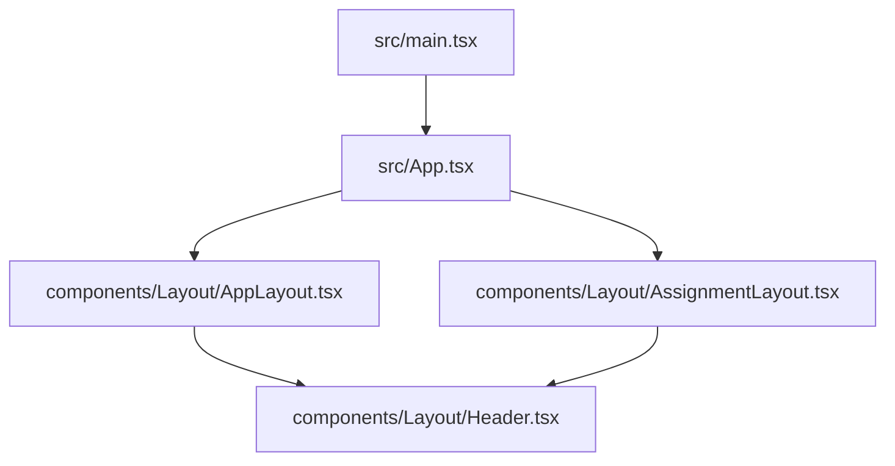
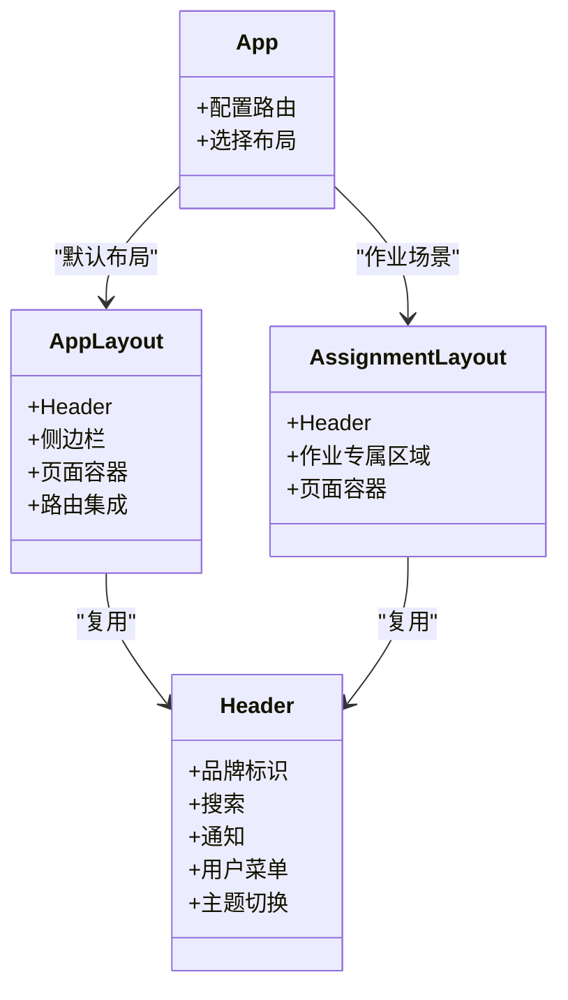
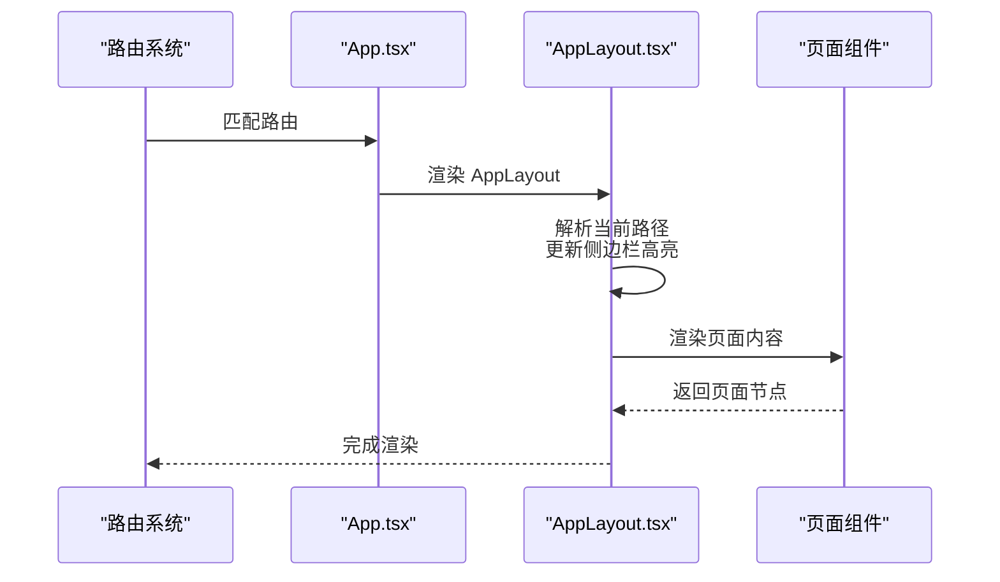
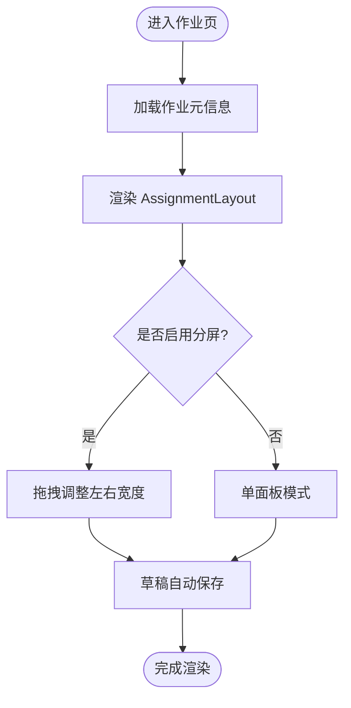
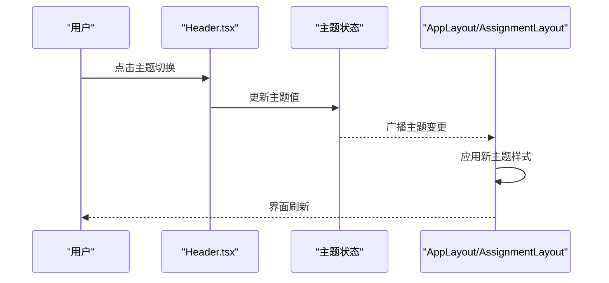
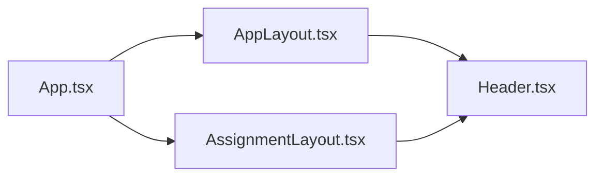

# 布局组件开发

<cite>
**本文引用的文件**   
- [AppLayout.tsx](file://frontend/src/components/Layout/AppLayout.tsx)
- [AssignmentLayout.tsx](file://frontend/src/components/Layout/AssignmentLayout.tsx)
- [Header.tsx](file://frontend/src/components/Layout/Header.tsx)
- [App.tsx](file://frontend/src/App.tsx)
- [main.tsx](file://frontend/src/main.tsx)
</cite>

## 目录
1. [简介](#简介)
2. [项目结构](#项目结构)
3. [核心组件](#核心组件)
4. [架构总览](#架构总览)
5. [详细组件分析](#详细组件分析)
6. [依赖关系分析](#依赖关系分析)
7. [性能考虑](#性能考虑)
8. [故障排查指南](#故障排查指南)
9. [结论](#结论)
10. [附录](#附录)

## 简介
本指南聚焦于前端布局组件的开发实践，围绕以下目标展开：
- AppLayout 主布局组件的架构设计：路由集成、侧边栏管理、页面容器模式。
- AssignmentLayout 作业专用布局的结构设计与功能特性。
- Header 头部组件的可复用性设计与用户交互处理。
- 响应式布局与移动端适配策略。
- 主题切换支持方案。
- Props 设计规范、嵌套布局模式与性能优化技巧。

## 项目结构
前端采用按功能域组织的方式，布局相关代码集中在 components/Layout 目录下，应用入口在 src/App.tsx 与 src/main.tsx。

图表来源
- [main.tsx:1-50](file://frontend/src/main.tsx#L1-L50)
- [App.tsx:1-120](file://frontend/src/App.tsx#L1-L120)
- [AppLayout.tsx:1-200](file://frontend/src/components/Layout/AppLayout.tsx#L1-L200)
- [AssignmentLayout.tsx:1-200](file://frontend/src/components/Layout/AssignmentLayout.tsx#L1-L200)
- [Header.tsx:1-200](file://frontend/src/components/Layout/Header.tsx#L1-L200)

章节来源
- [main.tsx:1-50](file://frontend/src/main.tsx#L1-L50)
- [App.tsx:1-120](file://frontend/src/App.tsx#L1-L120)

## 核心组件
- AppLayout：全局主布局，负责顶部导航（Header）、侧边栏、内容区域渲染与路由集成。
- AssignmentLayout：面向作业场景的专用布局，提供作业相关的上下文与操作区。
- Header：可复用的头部组件，承载品牌、搜索、通知、用户菜单等通用交互。

章节来源
- [AppLayout.tsx:1-200](file://frontend/src/components/Layout/AppLayout.tsx#L1-L200)
- [AssignmentLayout.tsx:1-200](file://frontend/src/components/Layout/AssignmentLayout.tsx#L1-L200)
- [Header.tsx:1-200](file://frontend/src/components/Layout/Header.tsx#L1-L200)

## 架构总览
整体布局采用“壳层 + 内容”的分层模式：
- 根应用通过路由选择不同布局（AppLayout 或 AssignmentLayout）。
- AppLayout 作为全局壳层，内部包含 Header、侧边栏与页面容器。
- AssignmentLayout 作为作业场景的专用壳层，复用 Header，并扩展作业专属区域。
- Header 独立封装，供多个布局复用。

图表来源
- [App.tsx:1-120](file://frontend/src/App.tsx#L1-L120)
- [AppLayout.tsx:1-200](file://frontend/src/components/Layout/AppLayout.tsx#L1-L200)
- [AssignmentLayout.tsx:1-200](file://frontend/src/components/Layout/AssignmentLayout.tsx#L1-L200)
- [Header.tsx:1-200](file://frontend/src/components/Layout/Header.tsx#L1-L200)

## 详细组件分析

### AppLayout 主布局组件
职责与特性
- 路由集成：根据当前路由决定侧边栏高亮与内容渲染。
- 侧边栏管理：维护折叠状态、分组导航、权限可见性。
- 页面容器模式：统一内边距、背景、滚动行为与错误边界包裹。
- 响应式适配：小屏自动隐藏侧边栏并提供抽屉式入口。
- 主题支持：与 Header 联动实现明暗主题切换。

关键流程（路由到渲染）

图表来源
- [App.tsx:1-120](file://frontend/src/App.tsx#L1-L120)
- [AppLayout.tsx:1-200](file://frontend/src/components/Layout/AppLayout.tsx#L1-L200)

Props 设计规范（建议）
- collapsed: boolean，控制侧边栏折叠。
- theme: "light" | "dark"，主题模式。
- sidebarItems: 数组，描述导航项（id、label、icon、path、children、visibleByRole 等）。
- onToggleSidebar: 回调，切换折叠。
- onThemeChange: 回调，切换主题。
- contentPadding: number|string，内容区内边距。
- errorBoundary: ReactNode，错误边界包裹内容。

响应式与移动端适配
- 断点策略：在窄屏下隐藏侧边栏，使用抽屉或底部导航替代。
- 手势支持：侧滑打开/关闭侧边栏。
- 字体与间距：基于 rem 或缩放单位，保证可读性与触控面积。

主题切换支持
- 通过 context 或全局状态集中管理主题。
- Header 暴露切换入口，AppLayout 监听变化并应用到根容器。

章节来源
- [AppLayout.tsx:1-200](file://frontend/src/components/Layout/AppLayout.tsx#L1-L200)
- [App.tsx:1-120](file://frontend/src/App.tsx#L1-L120)

### AssignmentLayout 作业专用布局
职责与特性
- 作业上下文：提供作业 ID、版本、提交状态等上下文。
- 专属区域：左侧为题目/材料预览，右侧为作答/批注区，中间为工具栏。
- 与 AppLayout 的关系：可作为 AppLayout 的子页面容器，或在特定路由下直接挂载。
- 交互增强：分屏拖拽调整宽度、快捷键支持、草稿自动保存提示。

典型数据流

图表来源
- [AssignmentLayout.tsx:1-200](file://frontend/src/components/Layout/AssignmentLayout.tsx#L1-L200)

Props 设计规范（建议）
- assignmentId: string，作业唯一标识。
- mode: "preview" | "answer" | "review"，作业模式。
- splitEnabled: boolean，是否允许分屏。
- defaultSplitRatio: number，默认分屏比例。
- onSaveDraft: 回调，触发草稿保存。
- onModeChange: 回调，切换作业模式。

章节来源
- [AssignmentLayout.tsx:1-200](file://frontend/src/components/Layout/AssignmentLayout.tsx#L1-L200)

### Header 头部组件
职责与特性
- 可复用性：被 AppLayout 与 AssignmentLayout 共同复用。
- 用户交互：搜索框、通知中心、用户头像下拉菜单、设置入口。
- 主题切换：提供明暗主题切换按钮，并与全局主题状态同步。
- 无障碍：键盘可达、ARIA 标签完善。

交互序列（以主题切换为例）

图表来源
- [Header.tsx:1-200](file://frontend/src/components/Layout/Header.tsx#L1-L200)
- [AppLayout.tsx:1-200](file://frontend/src/components/Layout/AppLayout.tsx#L1-L200)
- [AssignmentLayout.tsx:1-200](file://frontend/src/components/Layout/AssignmentLayout.tsx#L1-L200)

Props 设计规范（建议）
- title: string，站点标题。
- searchPlaceholder: string，搜索占位文本。
- notificationsCount: number，未读通知数。
- user: object，用户信息（avatar、name、role）。
- onSearch: 回调，处理搜索。
- onNotificationClick: 回调，打开通知中心。
- onUserMenuAction: 回调，处理用户菜单动作。
- onThemeToggle: 回调，切换主题。

章节来源
- [Header.tsx:1-200](file://frontend/src/components/Layout/Header.tsx#L1-L200)

## 依赖关系分析
- App.tsx 负责路由与布局选择，依赖 AppLayout 与 AssignmentLayout。
- AppLayout 与 AssignmentLayout 均依赖 Header。
- 主题状态可由全局状态管理，Header 与布局组件共同订阅。

图表来源
- [App.tsx:1-120](file://frontend/src/App.tsx#L1-L120)
- [AppLayout.tsx:1-200](file://frontend/src/components/Layout/AppLayout.tsx#L1-L200)
- [AssignmentLayout.tsx:1-200](file://frontend/src/components/Layout/AssignmentLayout.tsx#L1-L200)
- [Header.tsx:1-200](file://frontend/src/components/Layout/Header.tsx#L1-L200)

章节来源
- [App.tsx:1-120](file://frontend/src/App.tsx#L1-L120)
- [AppLayout.tsx:1-200](file://frontend/src/components/Layout/AppLayout.tsx#L1-L200)
- [AssignmentLayout.tsx:1-200](file://frontend/src/components/Layout/AssignmentLayout.tsx#L1-L200)
- [Header.tsx:1-200](file://frontend/src/components/Layout/Header.tsx#L1-L200)

## 性能考虑
- 路由级懒加载：将页面组件按需加载，减少首屏体积。
- 列表虚拟化：长列表使用虚拟滚动，避免一次性渲染大量节点。
- 防抖与节流：搜索输入、窗口尺寸变化事件进行防抖/节流。
- 状态提升与拆分：将频繁变化的状态尽量局部化，避免不必要的重渲染。
- 图片与资源优化：使用懒加载、WebP 格式与 CDN。
- 骨架屏与占位：在异步数据加载时展示骨架屏，提升感知性能。

## 故障排查指南
- 侧边栏无法收起：检查 collapsed 状态绑定与 onToggleSidebar 回调是否正确传递。
- 主题不生效：确认 Header 的主题切换回调是否与全局状态同步，布局容器是否应用了主题类名。
- 路由跳转后布局错乱：核对路由配置与布局选择逻辑，确保对应路由挂载正确的布局组件。
- 移动端交互异常：验证断点判断与触摸事件处理，确保抽屉开关与手势兼容。
- 作业分屏拖拽卡顿：检查拖拽事件节流与计算复杂度，必要时引入 requestAnimationFrame。

## 结论
通过分层清晰的布局架构与可复用的 Header 组件，结合响应式与主题能力，能够构建出稳定、可扩展的前端界面体系。建议在项目中持续沉淀 Props 规范、状态管理模式与性能优化策略，以提升团队协作效率与用户体验。

## 附录
- 术语说明
  - 布局组件：用于组织页面结构的容器型组件。
  - 页面容器：承载具体业务页面的外层包装，提供统一的边距、背景与错误边界。
  - 主题：明暗两套或多套视觉风格集合。
- 最佳实践清单
  - 明确 Props 类型与默认值。
  - 保持组件职责单一，避免过度耦合。
  - 对复杂交互进行单元测试与可视化回归测试。
  - 关注无障碍与国际化扩展性。