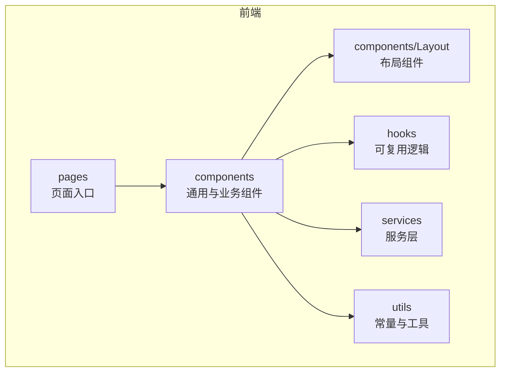
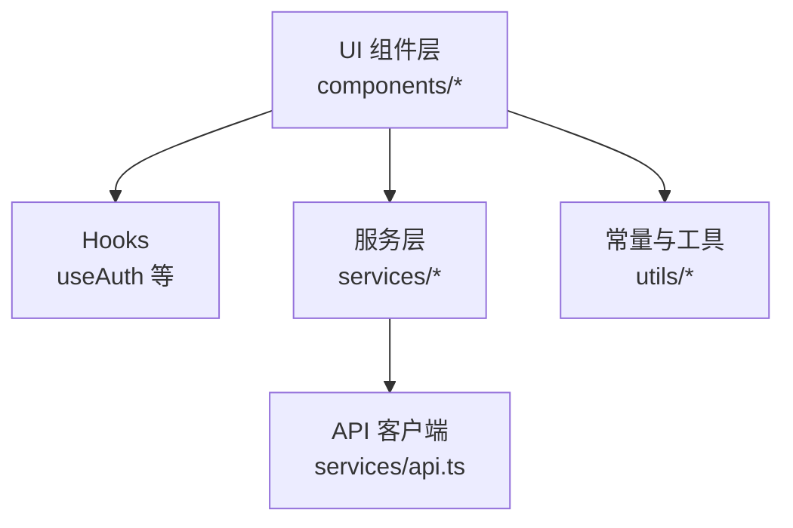
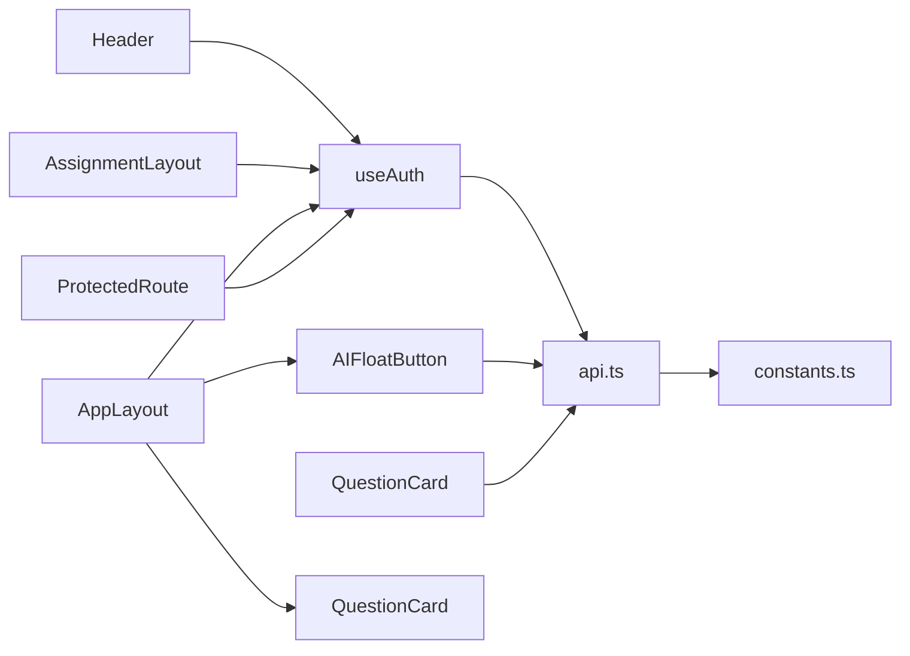

# 组件开发标准

<cite>
**本文引用的文件**   
- [frontend/src/components/Layout/AppLayout.tsx](file://frontend/src/components/Layout/AppLayout.tsx)
- [frontend/src/components/Layout/AssignmentLayout.tsx](file://frontend/src/components/Layout/AssignmentLayout.tsx)
- [frontend/src/components/Layout/Header.tsx](file://frontend/src/components/Layout/Header.tsx)
- [frontend/src/components/AIFloatButton.tsx](file://frontend/src/components/AIFloatButton.tsx)
- [frontend/src/components/QuestionCard.tsx](file://frontend/src/components/QuestionCard.tsx)
- [frontend/src/components/ProtectedRoute.tsx](file://frontend/src/components/ProtectedRoute.tsx)
- [frontend/src/hooks/useAuth.tsx](file://frontend/src/hooks/useAuth.tsx)
- [frontend/src/services/api.ts](file://frontend/src/services/api.ts)
- [frontend/src/utils/constants.ts](file://frontend/src/utils/constants.ts)
- [frontend/tsconfig.json](file://frontend/tsconfig.json)
- [frontend/vite.config.ts](file://frontend/vite.config.ts)
- [frontend/package.json](file://frontend/package.json)
</cite>

## 目录
1. [引言](#引言)
2. [项目结构](#项目结构)
3. [核心组件](#核心组件)
4. [架构总览](#架构总览)
5. [详细组件分析](#详细组件分析)
6. [依赖分析](#依赖分析)
7. [性能考虑](#性能考虑)
8. [故障排查指南](#故障排查指南)
9. [结论](#结论)
10. [附录](#附录)

## 引言
本指南面向前端组件开发者，围绕 TypeScript 类型定义规范、接口设计原则、泛型使用模式、组件命名与文件组织、导入导出规范、测试策略与 Mock 数据准备、性能优化与内存泄漏防护、Bundle 大小控制、代码审查清单、质量检查工具配置以及持续集成流程等方面，提供可落地的标准与实践。内容基于仓库现有前端结构与实现进行提炼，确保建议与工程现状一致且可直接执行。

## 项目结构
前端采用按功能域组织的目录结构：
- components：通用与业务组件，布局类组件集中于 Layout 子目录
- hooks：可复用逻辑封装
- services：网络请求与服务层封装
- utils：常量、工具函数
- pages：页面级入口（本指南聚焦组件层面）

图表来源
- [frontend/src/components/Layout/AppLayout.tsx](file://frontend/src/components/Layout/AppLayout.tsx)
- [frontend/src/components/Layout/AssignmentLayout.tsx](file://frontend/src/components/Layout/AssignmentLayout.tsx)
- [frontend/src/components/Layout/Header.tsx](file://frontend/src/components/Layout/Header.tsx)
- [frontend/src/components/AIFloatButton.tsx](file://frontend/src/components/AIFloatButton.tsx)
- [frontend/src/components/QuestionCard.tsx](file://frontend/src/components/QuestionCard.tsx)
- [frontend/src/components/ProtectedRoute.tsx](file://frontend/src/components/ProtectedRoute.tsx)
- [frontend/src/hooks/useAuth.tsx](file://frontend/src/hooks/useAuth.tsx)
- [frontend/src/services/api.ts](file://frontend/src/services/api.ts)
- [frontend/src/utils/constants.ts](file://frontend/src/utils/constants.ts)

章节来源
- [frontend/src/components/Layout/AppLayout.tsx](file://frontend/src/components/Layout/AppLayout.tsx)
- [frontend/src/components/Layout/AssignmentLayout.tsx](file://frontend/src/components/Layout/AssignmentLayout.tsx)
- [frontend/src/components/Layout/Header.tsx](file://frontend/src/components/Layout/Header.tsx)
- [frontend/src/components/AIFloatButton.tsx](file://frontend/src/components/AIFloatButton.tsx)
- [frontend/src/components/QuestionCard.tsx](file://frontend/src/components/QuestionCard.tsx)
- [frontend/src/components/ProtectedRoute.tsx](file://frontend/src/components/ProtectedRoute.tsx)
- [frontend/src/hooks/useAuth.tsx](file://frontend/src/hooks/useAuth.tsx)
- [frontend/src/services/api.ts](file://frontend/src/services/api.ts)
- [frontend/src/utils/constants.ts](file://frontend/src/utils/constants.ts)

## 核心组件
- 布局组件
  - AppLayout：应用级布局容器，负责整体框架与路由区域
  - AssignmentLayout：作业相关页面的布局容器
  - Header：顶部导航/信息展示
- 业务组件
  - AIFloatButton：悬浮按钮，承载 AI 交互入口
  - QuestionCard：题目卡片，展示题目信息与操作
- 安全组件
  - ProtectedRoute：受保护路由，结合鉴权 Hook 控制访问
- 可复用逻辑
  - useAuth：鉴权状态与登录态管理

章节来源
- [frontend/src/components/Layout/AppLayout.tsx](file://frontend/src/components/Layout/AppLayout.tsx)
- [frontend/src/components/Layout/AssignmentLayout.tsx](file://frontend/src/components/Layout/AssignmentLayout.tsx)
- [frontend/src/components/Layout/Header.tsx](file://frontend/src/components/Layout/Header.tsx)
- [frontend/src/components/AIFloatButton.tsx](file://frontend/src/components/AIFloatButton.tsx)
- [frontend/src/components/QuestionCard.tsx](file://frontend/src/components/QuestionCard.tsx)
- [frontend/src/components/ProtectedRoute.tsx](file://frontend/src/components/ProtectedRoute.tsx)
- [frontend/src/hooks/useAuth.tsx](file://frontend/src/hooks/useAuth.tsx)

## 架构总览
组件层通过 Hooks 获取状态与副作用，通过 Services 发起网络请求，统一由 API 客户端处理。常量与工具函数在 utils 中集中维护，布局组件组合业务组件形成页面骨架。

图表来源
- [frontend/src/components/ProtectedRoute.tsx](file://frontend/src/components/ProtectedRoute.tsx)
- [frontend/src/hooks/useAuth.tsx](file://frontend/src/hooks/useAuth.tsx)
- [frontend/src/services/api.ts](file://frontend/src/services/api.ts)
- [frontend/src/utils/constants.ts](file://frontend/src/utils/constants.ts)

## 详细组件分析

### 组件命名约定与文件组织
- 命名约定
  - 组件名使用 PascalCase，文件名与组件名保持一致
  - 布局组件以 Layout 后缀或置于 Layout 目录
  - 可复用 Hook 以 use 前缀命名
- 文件组织
  - 布局组件集中在 components/Layout
  - 业务组件按功能域放置于 components 根目录或子目录
  - 公共逻辑下沉至 hooks，避免在组件内重复实现

章节来源
- [frontend/src/components/Layout/AppLayout.tsx](file://frontend/src/components/Layout/AppLayout.tsx)
- [frontend/src/components/Layout/AssignmentLayout.tsx](file://frontend/src/components/Layout/AssignmentLayout.tsx)
- [frontend/src/components/Layout/Header.tsx](file://frontend/src/components/Layout/Header.tsx)
- [frontend/src/components/AIFloatButton.tsx](file://frontend/src/components/AIFloatButton.tsx)
- [frontend/src/components/QuestionCard.tsx](file://frontend/src/components/QuestionCard.tsx)
- [frontend/src/components/ProtectedRoute.tsx](file://frontend/src/components/ProtectedRoute.tsx)
- [frontend/src/hooks/useAuth.tsx](file://frontend/src/hooks/useAuth.tsx)

### TypeScript 类型定义规范
- 优先使用 interface 描述对象形状，type 用于联合类型、映射类型与计算属性
- Props 必须显式声明，可选字段使用 ?，必填字段不得省略默认值
- 枚举或字面量联合类型用于状态与选项，避免魔法字符串
- 泛型参数需有明确约束与默认值，必要时提供类型守卫辅助
- 对外暴露的类型应集中管理，便于跨模块复用

章节来源
- [frontend/src/components/QuestionCard.tsx](file://frontend/src/components/QuestionCard.tsx)
- [frontend/src/components/AIFloatButton.tsx](file://frontend/src/components/AIFloatButton.tsx)
- [frontend/src/components/ProtectedRoute.tsx](file://frontend/src/components/ProtectedRoute.tsx)
- [frontend/src/hooks/useAuth.tsx](file://frontend/src/hooks/useAuth.tsx)
- [frontend/src/services/api.ts](file://frontend/src/services/api.ts)
- [frontend/src/utils/constants.ts](file://frontend/src/utils/constants.ts)

### 接口设计原则
- 单一职责：每个组件只关注一个领域，复杂场景拆分为子组件
- 最小可见性：Props 仅暴露必要字段，内部状态私有化
- 可组合性：通过 children、插槽或高阶组件组合能力
- 可测试性：纯函数与无副作用逻辑尽量外置为工具或 Hook
- 向后兼容：新增字段保持可选，废弃字段保留过渡期

章节来源
- [frontend/src/components/Layout/AppLayout.tsx](file://frontend/src/components/Layout/AppLayout.tsx)
- [frontend/src/components/Layout/AssignmentLayout.tsx](file://frontend/src/components/Layout/AssignmentLayout.tsx)
- [frontend/src/components/Layout/Header.tsx](file://frontend/src/components/Layout/Header.tsx)
- [frontend/src/components/QuestionCard.tsx](file://frontend/src/components/QuestionCard.tsx)

### 泛型使用模式
- 列表渲染：使用数组泛型约束 item 类型，避免 any
- 响应式数据：对异步结果使用 Result<T, E> 风格类型，区分成功与失败分支
- 表单与校验：将表单字段类型与校验规则解耦，通过泛型传递字段集合
- 服务层：对 API 返回体使用泛型包装，统一错误处理

章节来源
- [frontend/src/services/api.ts](file://frontend/src/services/api.ts)
- [frontend/src/hooks/useAuth.tsx](file://frontend/src/hooks/useAuth.tsx)
- [frontend/src/components/QuestionCard.tsx](file://frontend/src/components/QuestionCard.tsx)

### 导入导出规范
- 相对路径导入：同目录或父子目录使用相对路径，避免绝对路径滥用
- 按需导出：组件与类型分别导出，避免 barrel 文件过度聚合
- 循环依赖：通过延迟导入或重构 Hook/Service 打破环
- 命名导出优于默认导出：提升可读性与静态分析效果

章节来源
- [frontend/src/components/Layout/AppLayout.tsx](file://frontend/src/components/Layout/AppLayout.tsx)
- [frontend/src/components/ProtectedRoute.tsx](file://frontend/src/components/ProtectedRoute.tsx)
- [frontend/src/services/api.ts](file://frontend/src/services/api.ts)

### 组件测试策略与单元测试编写
- 测试分层
  - 单元：Hook 与纯函数，断言输入输出
  - 组件：渲染快照、用户交互事件、条件渲染
  - 集成：服务调用与路由跳转
- 推荐实践
  - 使用 React Testing Library 模拟用户行为而非 DOM 细节
  - 对网络请求使用 Mock 服务或拦截器
  - 对鉴权逻辑使用 Hook 注入 mock 状态
- 覆盖率目标
  - 关键路径与边界条件覆盖率达到 80%+

章节来源
- [frontend/src/hooks/useAuth.tsx](file://frontend/src/hooks/useAuth.tsx)
- [frontend/src/components/ProtectedRoute.tsx](file://frontend/src/components/ProtectedRoute.tsx)
- [frontend/src/services/api.ts](file://frontend/src/services/api.ts)

### Mock 数据准备
- 固定数据集：针对常见用例准备稳定数据，避免随机性影响稳定性
- 工厂函数：根据场景生成不同形态的数据，减少样板
- 分层 Mock：UI 层使用轻量 Mock，服务层使用真实或半真实响应
- 版本化：Mock 数据随接口演进同步更新，避免漂移

章节来源
- [frontend/src/services/api.ts](file://frontend/src/services/api.ts)
- [frontend/src/utils/constants.ts](file://frontend/src/utils/constants.ts)

### 组件性能优化技巧
- 渲染优化
  - 使用 memo 包裹纯展示组件，避免不必要的重渲染
  - 拆分大组件，减少 diff 范围
  - 列表渲染使用稳定 key，避免索引作为 key
- 资源加载
  - 懒加载重型组件与路由
  - 图片与图标按需引入
- 状态管理
  - 局部状态就近管理，避免全局状态膨胀
  - 合并频繁更新的 state，降低更新频率

章节来源
- [frontend/src/components/Layout/AppLayout.tsx](file://frontend/src/components/Layout/AppLayout.tsx)
- [frontend/src/components/QuestionCard.tsx](file://frontend/src/components/QuestionCard.tsx)
- [frontend/src/components/AIFloatButton.tsx](file://frontend/src/components/AIFloatButton.tsx)

### 内存泄漏防护
- 清理副作用
  - useEffect 返回清理函数，移除事件监听、定时器、订阅
- 取消请求
  - 使用 AbortController 取消未完成的网络请求
- 组件卸载
  - 避免在已卸载组件上更新状态
- 弱引用
  - 缓存对象使用 WeakMap/WeakRef，防止强引用导致泄漏

章节来源
- [frontend/src/hooks/useAuth.tsx](file://frontend/src/hooks/useAuth.tsx)
- [frontend/src/services/api.ts](file://frontend/src/services/api.ts)

### Bundle 大小控制
- 按需引入：第三方库使用按需导入，避免全量引入
- 代码分割：路由级与组件级懒加载
- Tree Shaking：确保 ES Module 导出与死代码剔除
- 依赖审计：定期扫描并替换体积大的依赖

章节来源
- [frontend/vite.config.ts](file://frontend/vite.config.ts)
- [frontend/package.json](file://frontend/package.json)

### 代码审查清单
- 类型安全
  - 是否避免 any；泛型是否具约束；Props 是否完整
- 可维护性
  - 组件职责是否单一；命名是否清晰；文件是否合理拆分
- 安全性
  - 鉴权是否正确；敏感信息是否脱敏；输入是否校验
- 性能
  - 是否存在不必要渲染；是否有内存泄漏风险
- 可测试性
  - 是否提供足够测试用例；Mock 是否稳定

章节来源
- [frontend/src/components/ProtectedRoute.tsx](file://frontend/src/components/ProtectedRoute.tsx)
- [frontend/src/hooks/useAuth.tsx](file://frontend/src/hooks/useAuth.tsx)
- [frontend/src/components/QuestionCard.tsx](file://frontend/src/components/QuestionCard.tsx)

### 质量检查工具配置
- TypeScript 严格模式
  - 启用 strict、noImplicitAny、strictNullChecks 等
- 代码风格
  - ESLint + Prettier 统一风格与规则
- 提交前检查
  - Husky + lint-staged 在提交时运行检查
- 构建验证
  - Vite 构建失败即阻断发布

章节来源
- [frontend/tsconfig.json](file://frontend/tsconfig.json)
- [frontend/vite.config.ts](file://frontend/vite.config.ts)
- [frontend/package.json](file://frontend/package.json)

### 持续集成流程
- 流水线阶段
  - 安装依赖 -> 类型检查 -> 代码风格检查 -> 单元测试 -> 构建产物
- 缓存策略
  - 缓存 node_modules 与构建缓存，缩短 CI 时间
- 制品归档
  - 上传构建产物供预览与回滚
- 质量门禁
  - 覆盖率阈值、构建成功率、安全扫描

章节来源
- [frontend/package.json](file://frontend/package.json)
- [frontend/vite.config.ts](file://frontend/vite.config.ts)

## 依赖分析
组件与 Hook、Service、Utils 的依赖关系如下：

图表来源
- [frontend/src/components/ProtectedRoute.tsx](file://frontend/src/components/ProtectedRoute.tsx)
- [frontend/src/hooks/useAuth.tsx](file://frontend/src/hooks/useAuth.tsx)
- [frontend/src/components/QuestionCard.tsx](file://frontend/src/components/QuestionCard.tsx)
- [frontend/src/components/AIFloatButton.tsx](file://frontend/src/components/AIFloatButton.tsx)
- [frontend/src/components/Layout/AppLayout.tsx](file://frontend/src/components/Layout/AppLayout.tsx)
- [frontend/src/components/Layout/AssignmentLayout.tsx](file://frontend/src/components/Layout/AssignmentLayout.tsx)
- [frontend/src/components/Layout/Header.tsx](file://frontend/src/components/Layout/Header.tsx)
- [frontend/src/services/api.ts](file://frontend/src/services/api.ts)
- [frontend/src/utils/constants.ts](file://frontend/src/utils/constants.ts)

章节来源
- [frontend/src/components/ProtectedRoute.tsx](file://frontend/src/components/ProtectedRoute.tsx)
- [frontend/src/hooks/useAuth.tsx](file://frontend/src/hooks/useAuth.tsx)
- [frontend/src/components/QuestionCard.tsx](file://frontend/src/components/QuestionCard.tsx)
- [frontend/src/components/AIFloatButton.tsx](file://frontend/src/components/AIFloatButton.tsx)
- [frontend/src/components/Layout/AppLayout.tsx](file://frontend/src/components/Layout/AppLayout.tsx)
- [frontend/src/components/Layout/AssignmentLayout.tsx](file://frontend/src/components/Layout/AssignmentLayout.tsx)
- [frontend/src/components/Layout/Header.tsx](file://frontend/src/components/Layout/Header.tsx)
- [frontend/src/services/api.ts](file://frontend/src/services/api.ts)
- [frontend/src/utils/constants.ts](file://frontend/src/utils/constants.ts)

## 性能考虑
- 渲染路径优化：减少深层嵌套与多余 re-render，合理使用 memo 与 useMemo/useCallback
- 网络请求优化：合并请求、去抖与节流、分页与虚拟列表
- 资源优化：图片压缩、字体按需加载、CDN 加速
- 监控与度量：首屏时间、交互延迟、内存占用监控

[本节为通用指导，不直接分析具体文件]

## 故障排查指南
- 常见问题定位
  - 类型报错：检查泛型约束与可选链使用
  - 路由权限异常：确认鉴权 Hook 状态与路由守卫逻辑
  - 网络请求失败：检查 API 客户端错误处理与重试策略
- 调试手段
  - 控制台日志分级与开关
  - 浏览器性能面板与内存快照对比
  - 单元测试失败用例复现

章节来源
- [frontend/src/hooks/useAuth.tsx](file://frontend/src/hooks/useAuth.tsx)
- [frontend/src/components/ProtectedRoute.tsx](file://frontend/src/components/ProtectedRoute.tsx)
- [frontend/src/services/api.ts](file://frontend/src/services/api.ts)

## 结论
通过统一的类型与接口规范、清晰的组件职责划分、完善的测试与质量门禁、严格的性能与内存管理，以及稳定的 CI 流程，可显著提升组件的可维护性、可靠性与交付效率。建议在团队内推广本指南，并结合实际迭代持续完善。

[本节为总结性内容，不直接分析具体文件]

## 附录
- 术语表
  - 组件：可复用的 UI 单元
  - Hook：封装可复用逻辑的函数
  - 服务层：封装业务逻辑与网络请求
  - 常量与工具：跨模块共享的常量与纯函数
- 参考文件
  - 类型与构建配置：tsconfig.json、vite.config.ts、package.json
  - 核心组件与 Hook：ProtectedRoute.tsx、useAuth.tsx、QuestionCard.tsx、AIFloatButton.tsx
  - 布局组件：AppLayout.tsx、AssignmentLayout.tsx、Header.tsx
  - 服务与常量：api.ts、constants.ts

[本节为补充说明，不直接分析具体文件]