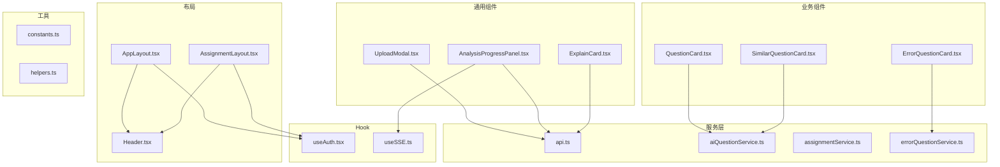
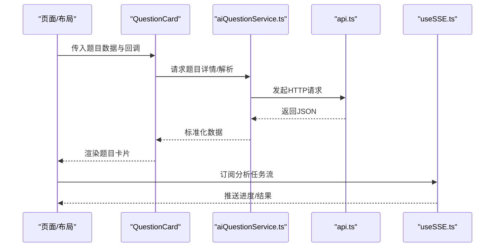
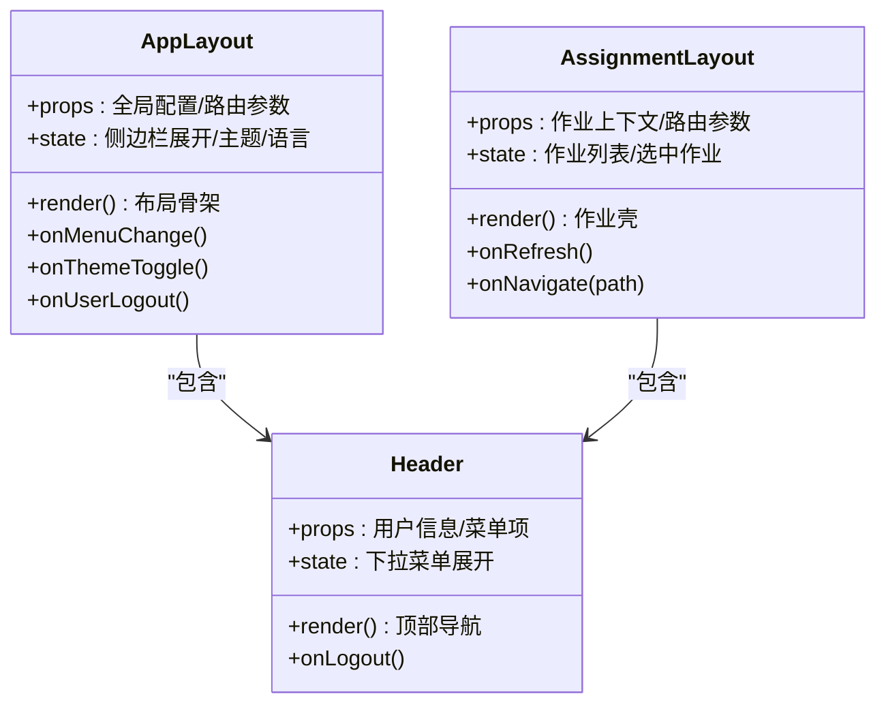
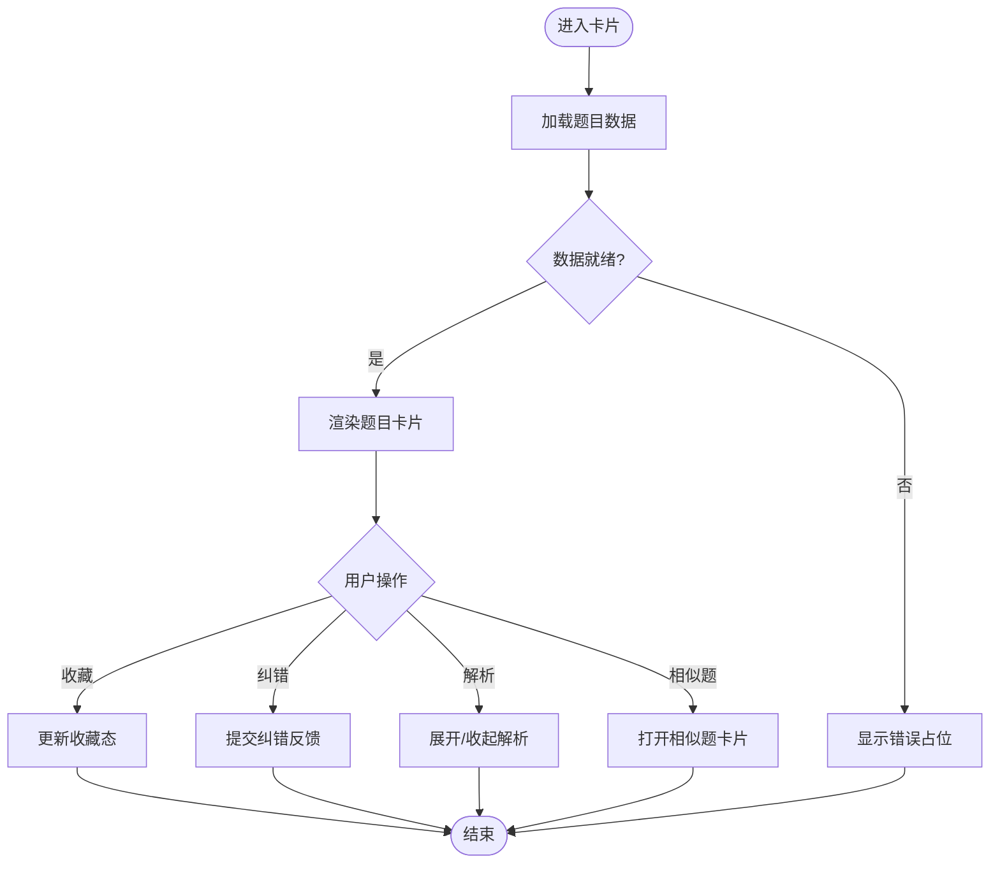
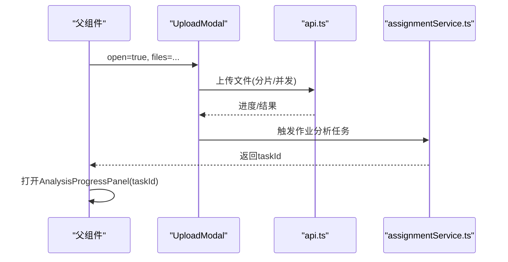
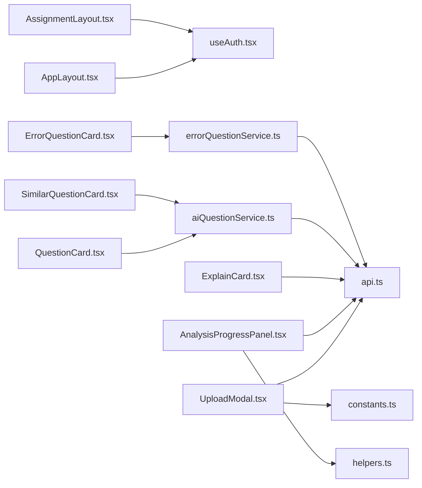

# 组件开发规范

<cite>
**本文引用的文件**   
- [AppLayout.tsx](file://frontend/src/components/Layout/AppLayout.tsx)
- [AssignmentLayout.tsx](file://frontend/src/components/Layout/AssignmentLayout.tsx)
- [Header.tsx](file://frontend/src/components/Layout/Header.tsx)
- [QuestionCard.tsx](file://frontend/src/components/QuestionCard.tsx)
- [ErrorQuestionCard.tsx](file://frontend/src/components/ErrorQuestionCard.tsx)
- [SimilarQuestionCard.tsx](file://frontend/src/components/SimilarQuestionCard.tsx)
- [UploadModal.tsx](file://frontend/src/components/UploadModal.tsx)
- [AnalysisProgressPanel.tsx](file://frontend/src/components/AnalysisProgressPanel.tsx)
- [ExplainCard.tsx](file://frontend/src/components/ExplainCard.tsx)
- [useAuth.tsx](file://frontend/src/hooks/useAuth.tsx)
- [useSSE.ts](file://frontend/src/hooks/useSSE.ts)
- [api.ts](file://frontend/src/services/api.ts)
- [aiQuestionService.ts](file://frontend/src/services/aiQuestionService.ts)
- [assignmentService.ts](file://frontend/src/services/assignmentService.ts)
- [errorQuestionService.ts](file://frontend/src/services/errorQuestionService.ts)
- [constants.ts](file://frontend/src/utils/constants.ts)
- [helpers.ts](file://frontend/src/utils/helpers.ts)
</cite>

## 目录
1. [简介](#简介)
2. [项目结构](#项目结构)
3. [核心组件](#核心组件)
4. [架构总览](#架构总览)
5. [详细组件分析](#详细组件分析)
6. [依赖分析](#依赖分析)
7. [性能考虑](#性能考虑)
8. [故障排查指南](#故障排查指南)
9. [结论](#结论)
10. [附录](#附录)

## 简介
本指南面向AI助教系统前端组件开发，聚焦于组件化设计原则与实现规范。内容覆盖：
- 布局组件（AppLayout、AssignmentLayout）的结构设计与响应式适配
- 业务组件（QuestionCard、ErrorQuestionCard、SimilarQuestionCard）的数据绑定、事件处理与状态管理
- 通用组件（UploadModal、AnalysisProgressPanel、ExplainCard）的可复用性与配置项
- Props定义规范、TypeScript类型约束、事件回调设计
- 组件测试策略、性能优化技巧、可访问性支持

## 项目结构
前端采用按功能域组织的方式，组件位于 components 目录，页面在 pages，服务层在 services，工具与常量在 utils，自定义 Hook 在 hooks。布局组件集中于 Layout 子目录，便于统一导航与页面壳结构。

图表来源
- [AppLayout.tsx](file://frontend/src/components/Layout/AppLayout.tsx)
- [AssignmentLayout.tsx](file://frontend/src/components/Layout/AssignmentLayout.tsx)
- [Header.tsx](file://frontend/src/components/Layout/Header.tsx)
- [QuestionCard.tsx](file://frontend/src/components/QuestionCard.tsx)
- [ErrorQuestionCard.tsx](file://frontend/src/components/ErrorQuestionCard.tsx)
- [SimilarQuestionCard.tsx](file://frontend/src/components/SimilarQuestionCard.tsx)
- [UploadModal.tsx](file://frontend/src/components/UploadModal.tsx)
- [AnalysisProgressPanel.tsx](file://frontend/src/components/AnalysisProgressPanel.tsx)
- [ExplainCard.tsx](file://frontend/src/components/ExplainCard.tsx)
- [api.ts](file://frontend/src/services/api.ts)
- [aiQuestionService.ts](file://frontend/src/services/aiQuestionService.ts)
- [assignmentService.ts](file://frontend/src/services/assignmentService.ts)
- [errorQuestionService.ts](file://frontend/src/services/errorQuestionService.ts)
- [useAuth.tsx](file://frontend/src/hooks/useAuth.tsx)
- [useSSE.ts](file://frontend/src/hooks/useSSE.ts)
- [constants.ts](file://frontend/src/utils/constants.ts)
- [helpers.ts](file://frontend/src/utils/helpers.ts)

章节来源
- [AppLayout.tsx](file://frontend/src/components/Layout/AppLayout.tsx)
- [AssignmentLayout.tsx](file://frontend/src/components/Layout/AssignmentLayout.tsx)
- [Header.tsx](file://frontend/src/components/Layout/Header.tsx)
- [QuestionCard.tsx](file://frontend/src/components/QuestionCard.tsx)
- [ErrorQuestionCard.tsx](file://frontend/src/components/ErrorQuestionCard.tsx)
- [SimilarQuestionCard.tsx](file://frontend/src/components/SimilarQuestionCard.tsx)
- [UploadModal.tsx](file://frontend/src/components/UploadModal.tsx)
- [AnalysisProgressPanel.tsx](file://frontend/src/components/AnalysisProgressPanel.tsx)
- [ExplainCard.tsx](file://frontend/src/components/ExplainCard.tsx)
- [api.ts](file://frontend/src/services/api.ts)
- [aiQuestionService.ts](file://frontend/src/services/aiQuestionService.ts)
- [assignmentService.ts](file://frontend/src/services/assignmentService.ts)
- [errorQuestionService.ts](file://frontend/src/services/errorQuestionService.ts)
- [useAuth.tsx](file://frontend/src/hooks/useAuth.tsx)
- [useSSE.ts](file://frontend/src/hooks/useSSE.ts)
- [constants.ts](file://frontend/src/utils/constants.ts)
- [helpers.ts](file://frontend/src/utils/helpers.ts)

## 核心组件
本节概述三类组件的职责边界与交互契约，为后续深入分析奠定基础。

- 布局组件
  - AppLayout：应用级外壳，承载全局导航、侧边栏、主内容区与页脚；负责路由容器与主题/语言等全局上下文。
  - AssignmentLayout：作业场景专用布局，提供作业详情/记录/错题重做等子页面的统一头部与操作区。
  - Header：顶部导航与用户信息展示，集成鉴权状态与快捷入口。

- 业务组件
  - QuestionCard：题目卡片，展示题目元数据、答案与解析入口，触发收藏/纠错/相似题等动作。
  - ErrorQuestionCard：错题卡片，强化错误标记、重做入口与知识点标签。
  - SimilarQuestionCard：相似题卡片，用于推荐练习与跳转。

- 通用组件
  - UploadModal：上传弹窗，封装文件选择、校验、进度与结果回传。
  - AnalysisProgressPanel：分析进度面板，通过SSE或轮询更新任务状态。
  - ExplainCard：讲解卡片，渲染结构化讲解内容，支持折叠/展开与复制。

章节来源
- [AppLayout.tsx](file://frontend/src/components/Layout/AppLayout.tsx)
- [AssignmentLayout.tsx](file://frontend/src/components/Layout/AssignmentLayout.tsx)
- [Header.tsx](file://frontend/src/components/Layout/Header.tsx)
- [QuestionCard.tsx](file://frontend/src/components/QuestionCard.tsx)
- [ErrorQuestionCard.tsx](file://frontend/src/components/ErrorQuestionCard.tsx)
- [SimilarQuestionCard.tsx](file://frontend/src/components/SimilarQuestionCard.tsx)
- [UploadModal.tsx](file://frontend/src/components/UploadModal.tsx)
- [AnalysisProgressPanel.tsx](file://frontend/src/components/AnalysisProgressPanel.tsx)
- [ExplainCard.tsx](file://frontend/src/components/ExplainCard.tsx)

## 架构总览
组件与服务层的协作关系如下：布局组件组合页面骨架，业务组件消费服务层API并驱动UI状态，通用组件提供跨场景能力。

图表来源
- [QuestionCard.tsx](file://frontend/src/components/QuestionCard.tsx)
- [aiQuestionService.ts](file://frontend/src/services/aiQuestionService.ts)
- [api.ts](file://frontend/src/services/api.ts)
- [useSSE.ts](file://frontend/src/hooks/useSSE.ts)

## 详细组件分析

### 布局组件：AppLayout 与 AssignmentLayout
- 设计要点
  - 分层清晰：外层容器负责全局样式与栅格，内层区域划分明确（导航、侧边、主体、页脚）。
  - 响应式适配：基于断点切换侧边栏显隐与网格列数，移动端优先的触摸友好布局。
  - 权限与路由：结合鉴权Hook控制菜单可见性与受保护路由。
- 关键职责
  - AppLayout：全局导航、主题/语言上下文、路由容器、消息通知中心。
  - AssignmentLayout：作业相关操作的统一入口（上传、查看记录、错题重做），与Header联动。
- 事件与状态
  - 暴露 onMenuChange、onThemeToggle、onUserLogout 等回调，供上层页面订阅。
  - 内部维护侧边栏展开态、面包屑路径、当前作业ID等局部状态。

图表来源
- [AppLayout.tsx](file://frontend/src/components/Layout/AppLayout.tsx)
- [AssignmentLayout.tsx](file://frontend/src/components/Layout/AssignmentLayout.tsx)
- [Header.tsx](file://frontend/src/components/Layout/Header.tsx)

章节来源
- [AppLayout.tsx](file://frontend/src/components/Layout/AppLayout.tsx)
- [AssignmentLayout.tsx](file://frontend/src/components/Layout/AssignmentLayout.tsx)
- [Header.tsx](file://frontend/src/components/Layout/Header.tsx)

### 业务组件：QuestionCard、ErrorQuestionCard、SimilarQuestionCard
- 数据绑定
  - 题目数据模型由服务层标准化后注入，字段包括题目ID、题干、选项、答案、难度、知识点标签、解析摘要等。
  - 使用只读Props传递数据，避免直接修改外部状态。
- 事件处理
  - 点击“收藏”、“纠错”、“查看解析”、“相似题”等按钮触发回调，由父组件协调服务层调用与状态更新。
  - 长文本解析支持折叠/展开，提升首屏性能。
- 状态管理
  - 本地状态仅保留交互态（如加载、展开、收藏标记），持久态交由父组件或服务层缓存。
- 可访问性
  - 所有可交互元素具备语义化标签与aria属性，键盘可达，焦点顺序合理。

图表来源
- [QuestionCard.tsx](file://frontend/src/components/QuestionCard.tsx)
- [ErrorQuestionCard.tsx](file://frontend/src/components/ErrorQuestionCard.tsx)
- [SimilarQuestionCard.tsx](file://frontend/src/components/SimilarQuestionCard.tsx)

章节来源
- [QuestionCard.tsx](file://frontend/src/components/QuestionCard.tsx)
- [ErrorQuestionCard.tsx](file://frontend/src/components/ErrorQuestionCard.tsx)
- [SimilarQuestionCard.tsx](file://frontend/src/components/SimilarQuestionCard.tsx)

### 通用组件：UploadModal、AnalysisProgressPanel、ExplainCard
- UploadModal
  - 可复用性：支持多文件、拖拽、预览、大小/格式校验、并发限制、失败重试。
  - 配置项：accept、maxSize、maxCount、onSuccess、onError、onCancel、progressCallback。
  - 状态：open、files、uploading、progress、error。
- AnalysisProgressPanel
  - 实时性：基于SSE或轮询获取任务进度，支持断线重连与超时提示。
  - 配置项：taskId、interval、onComplete、onError、autoClose。
  - 状态：status、percent、message、logs。
- ExplainCard
  - 渲染：支持富文本/Markdown片段、代码高亮、图片与链接。
  - 配置项：content、expandable、copyable、actions。
  - 状态：expanded、copied。

图表来源
- [UploadModal.tsx](file://frontend/src/components/UploadModal.tsx)
- [api.ts](file://frontend/src/services/api.ts)
- [assignmentService.ts](file://frontend/src/services/assignmentService.ts)

章节来源
- [UploadModal.tsx](file://frontend/src/components/UploadModal.tsx)
- [AnalysisProgressPanel.tsx](file://frontend/src/components/AnalysisProgressPanel.tsx)
- [ExplainCard.tsx](file://frontend/src/components/ExplainCard.tsx)
- [api.ts](file://frontend/src/services/api.ts)
- [assignmentService.ts](file://frontend/src/services/assignmentService.ts)

## 依赖分析
组件间与服务层的耦合关系如下：布局组件依赖鉴权Hook，业务组件依赖具体服务，通用组件依赖基础API与工具函数。

图表来源
- [AppLayout.tsx](file://frontend/src/components/Layout/AppLayout.tsx)
- [AssignmentLayout.tsx](file://frontend/src/components/Layout/AssignmentLayout.tsx)
- [QuestionCard.tsx](file://frontend/src/components/QuestionCard.tsx)
- [ErrorQuestionCard.tsx](file://frontend/src/components/ErrorQuestionCard.tsx)
- [SimilarQuestionCard.tsx](file://frontend/src/components/SimilarQuestionCard.tsx)
- [UploadModal.tsx](file://frontend/src/components/UploadModal.tsx)
- [AnalysisProgressPanel.tsx](file://frontend/src/components/AnalysisProgressPanel.tsx)
- [ExplainCard.tsx](file://frontend/src/components/ExplainCard.tsx)
- [useAuth.tsx](file://frontend/src/hooks/useAuth.tsx)
- [api.ts](file://frontend/src/services/api.ts)
- [aiQuestionService.ts](file://frontend/src/services/aiQuestionService.ts)
- [errorQuestionService.ts](file://frontend/src/services/errorQuestionService.ts)
- [constants.ts](file://frontend/src/utils/constants.ts)
- [helpers.ts](file://frontend/src/utils/helpers.ts)

章节来源
- [useAuth.tsx](file://frontend/src/hooks/useAuth.tsx)
- [api.ts](file://frontend/src/services/api.ts)
- [aiQuestionService.ts](file://frontend/src/services/aiQuestionService.ts)
- [errorQuestionService.ts](file://frontend/src/services/errorQuestionService.ts)
- [constants.ts](file://frontend/src/utils/constants.ts)
- [helpers.ts](file://frontend/src/utils/helpers.ts)

## 性能考虑
- 渲染优化
  - 对大列表使用虚拟滚动或分页加载；对复杂卡片使用React.memo包裹纯展示节点。
  - 解析内容懒加载，仅在展开时渲染富文本与图片。
- 网络优化
  - 请求去抖/节流，合并重复请求；启用缓存与条件请求头。
  - SSE连接复用与自动重连，避免频繁建立连接。
- 资源优化
  - 图片按需加载与压缩，图标使用SVG Sprite或按需引入。
  - 组件级代码分割，路由级懒加载。
- 内存与CPU
  - 及时清理定时器与事件监听器，避免闭包引用导致泄漏。
  - 大数据量计算下沉至Web Worker或后端。

[本节为通用指导，不直接分析具体文件]

## 故障排查指南
- 常见问题定位
  - 上传失败：检查文件大小/格式校验逻辑、并发限制与后端返回码；查看UploadModal的错误分支与重试策略。
  - 分析无进度：确认taskId是否正确、SSE连接是否建立、useSSE的重连机制是否生效。
  - 题目解析空白：核对接口返回字段映射、ExplainCard的内容渲染分支与空值兜底。
- 调试建议
  - 在服务层打印请求/响应摘要，必要时开启Mock。
  - 在关键回调处输出必要上下文（如userId、taskId、路由参数）。
  - 使用浏览器开发者工具的Performance与Memory面板定位瓶颈。

章节来源
- [UploadModal.tsx](file://frontend/src/components/UploadModal.tsx)
- [AnalysisProgressPanel.tsx](file://frontend/src/components/AnalysisProgressPanel.tsx)
- [ExplainCard.tsx](file://frontend/src/components/ExplainCard.tsx)
- [useSSE.ts](file://frontend/src/hooks/useSSE.ts)
- [api.ts](file://frontend/src/services/api.ts)

## 结论
本规范围绕布局、业务与通用三类组件，明确了数据结构、事件契约、状态管理与可访问性要求。通过清晰的依赖边界与性能优化策略，可在保证可维护性的同时提升用户体验。建议在迭代中持续完善类型约束、单元测试与E2E用例，确保质量与演进效率。

## 附录

### Props定义与TypeScript类型约束规范
- 命名约定
  - 组件名使用帕斯卡命名；Props接口以组件名+Props结尾。
  - 可选字段使用?，必填字段需有默认值或在上层保证存在。
- 类型设计
  - 枚举与联合类型集中定义，避免魔法字符串。
  - 对外暴露的类型尽量最小化，内部类型保持私有。
- 示例参考路径
  - 布局组件Props：[AppLayout.tsx](file://frontend/src/components/Layout/AppLayout.tsx)、[AssignmentLayout.tsx](file://frontend/src/components/Layout/AssignmentLayout.tsx)
  - 业务组件Props：[QuestionCard.tsx](file://frontend/src/components/QuestionCard.tsx)、[ErrorQuestionCard.tsx](file://frontend/src/components/ErrorQuestionCard.tsx)、[SimilarQuestionCard.tsx](file://frontend/src/components/SimilarQuestionCard.tsx)
  - 通用组件Props：[UploadModal.tsx](file://frontend/src/components/UploadModal.tsx)、[AnalysisProgressPanel.tsx](file://frontend/src/components/AnalysisProgressPanel.tsx)、[ExplainCard.tsx](file://frontend/src/components/ExplainCard.tsx)

### 事件回调设计规范
- 命名约定
  - 以on开头，动词过去分词或动名词形式，如onSave、onCancel、onProgress。
- 参数约定
  - 第一个参数为事件对象或变更后的数据，第二个参数为额外上下文（可选）。
- 幂等与副作用
  - 回调应为纯函数或仅触发必要的副作用，避免在回调中执行昂贵计算。
- 示例参考路径
  - 上传回调：[UploadModal.tsx](file://frontend/src/components/UploadModal.tsx)
  - 进度回调：[AnalysisProgressPanel.tsx](file://frontend/src/components/AnalysisProgressPanel.tsx)
  - 题目交互回调：[QuestionCard.tsx](file://frontend/src/components/QuestionCard.tsx)

### 组件测试策略
- 单元与快照
  - 对纯展示组件进行快照测试，验证渲染稳定性。
  - 对交互组件使用模拟事件与断言行为。
- 集成测试
  - 使用Mock服务层，验证端到端流程（如上传→分析→进度更新）。
- 可访问性测试
  - 使用axe-core或类似工具检测语义与键盘可达性。
- 参考路径
  - 上传流程：[UploadModal.tsx](file://frontend/src/components/UploadModal.tsx)、[api.ts](file://frontend/src/services/api.ts)
  - 进度流程：[AnalysisProgressPanel.tsx](file://frontend/src/components/AnalysisProgressPanel.tsx)、[useSSE.ts](file://frontend/src/hooks/useSSE.ts)

### 可访问性支持清单
- 语义化标签与aria属性齐全
- 键盘可达与焦点管理
- 颜色对比度与字体缩放兼容
- 屏幕阅读器友好的文案与提示

[本节为通用指导，不直接分析具体文件]