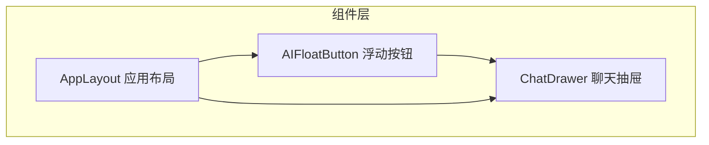
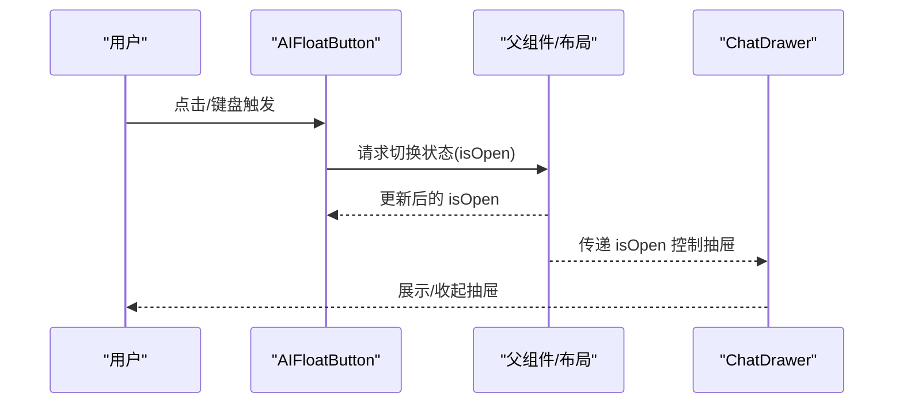
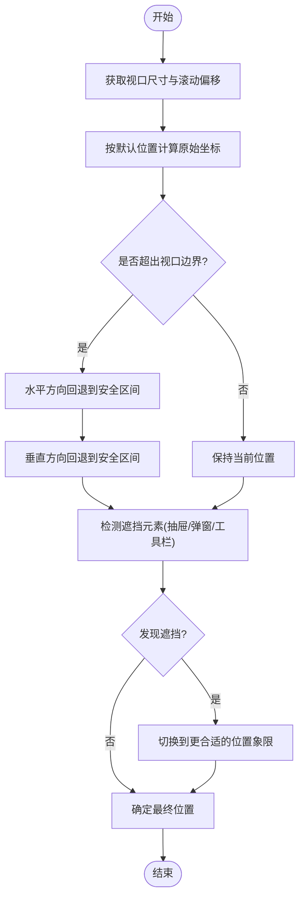
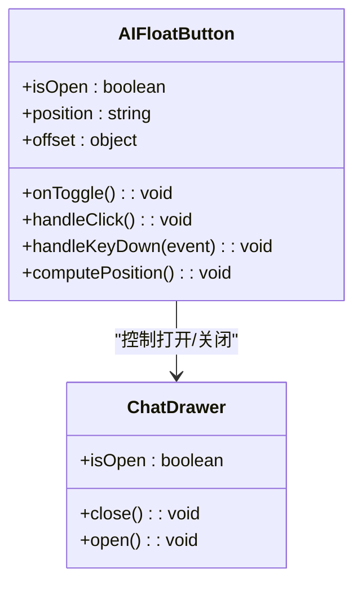
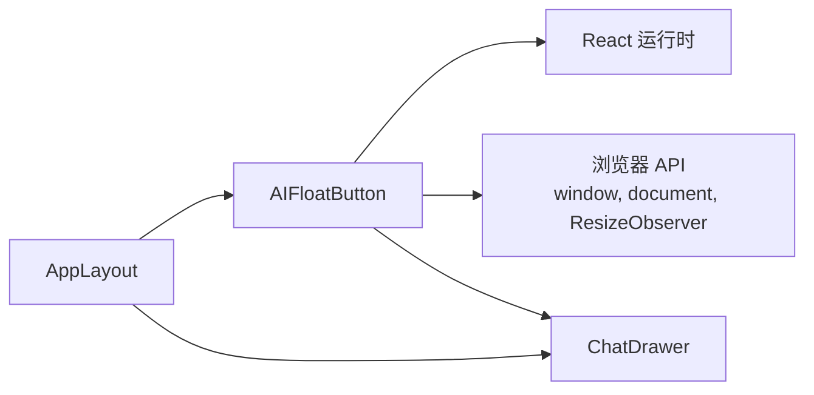

# AIFloatButton浮动按钮

<cite>
**本文引用的文件**   
- [AIFloatButton.tsx](file://frontend/src/components/AIFloatButton.tsx)
- [ChatDrawer.tsx](file://frontend/src/components/ChatDrawer.tsx)
- [AppLayout.tsx](file://frontend/src/components/Layout/AppLayout.tsx)
</cite>

## 目录
1. [简介](#简介)
2. [项目结构](#项目结构)
3. [核心组件](#核心组件)
4. [架构总览](#架构总览)
5. [详细组件分析](#详细组件分析)
6. [依赖关系分析](#依赖关系分析)
7. [性能考虑](#性能考虑)
8. [故障排查指南](#故障排查指南)
9. [结论](#结论)
10. [附录](#附录)

## 简介
本文件为 AIFloatButton 浮动按钮组件的开发文档，聚焦以下方面：
- 定位计算算法：视口检测、边界碰撞检测、智能位置调整
- 动画效果系统：CSS3 动画与过渡、性能优化策略
- 事件委托机制：点击处理、键盘导航、无障碍访问
- 状态管理设计：激活态、悬停态、加载指示
- 可配置化选项：位置、图标样式、动画时长、触发条件
- 与其他组件集成：聊天抽屉联动、菜单展开、弹窗控制
- 移动端适配：触摸手势、屏幕旋转、虚拟键盘避让

## 项目结构
AIFloatButton 位于前端组件目录中，并与聊天抽屉等组件存在交互。整体结构如下：
- 组件层：AIFloatButton 负责悬浮入口；ChatDrawer 承载对话面板；布局组件 AppLayout 负责页面骨架与全局挂载点
- 服务层：业务逻辑通过 services 调用后端 API（不在本组件范围内）
- 工具层：通用常量与辅助函数（如尺寸、常量）

图表来源
- [AIFloatButton.tsx](file://frontend/src/components/AIFloatButton.tsx)
- [ChatDrawer.tsx](file://frontend/src/components/ChatDrawer.tsx)
- [AppLayout.tsx](file://frontend/src/components/Layout/AppLayout.tsx)

章节来源
- [AIFloatButton.tsx](file://frontend/src/components/AIFloatButton.tsx)
- [ChatDrawer.tsx](file://frontend/src/components/ChatDrawer.tsx)
- [AppLayout.tsx](file://frontend/src/components/Layout/AppLayout.tsx)

## 核心组件
AIFFloatButton 作为全局悬浮入口，承担以下职责：
- 渲染悬浮按钮，支持多种位置与图标样式
- 监听滚动、窗口尺寸变化，动态计算并修正位置
- 提供点击、键盘与无障碍交互
- 与 ChatDrawer 联动，控制抽屉的打开/关闭
- 在加载或不可用状态下显示加载指示或禁用态

章节来源
- [AIFloatButton.tsx](file://frontend/src/components/AIFloatButton.tsx)

## 架构总览
AIFloatButton 与 ChatDrawer 通过受控模式进行状态同步，由上层布局或父组件持有“是否打开”的状态，并通过 props 传递给两个组件，实现双向联动。

图表来源
- [AIFloatButton.tsx](file://frontend/src/components/AIFloatButton.tsx)
- [ChatDrawer.tsx](file://frontend/src/components/ChatDrawer.tsx)
- [AppLayout.tsx](file://frontend/src/components/Layout/AppLayout.tsx)

## 详细组件分析

### 定位计算算法
目标：确保按钮始终可见且不被遮挡，自动避开底部工具栏、侧边栏、弹窗等元素。

- 视口检测
  - 基于可视区域高度与滚动偏移，判断按钮是否处于可视范围
  - 当页面滚动时重新评估位置，避免被内容覆盖
- 边界碰撞检测
  - 计算按钮外框与视口四边的距离，若越界则进行回退
  - 检测其他固定定位元素（如底部导航、侧边栏）的占用空间，预留安全边距
- 智能位置调整
  - 默认右下角，根据可用空间选择右下/右上/左下/左上
  - 优先保持水平方向靠近边缘，垂直方向尽量贴近底部，提升可达性
  - 当检测到弹窗或抽屉打开时，临时调整位置以避免重叠

图表来源
- [AIFloatButton.tsx](file://frontend/src/components/AIFloatButton.tsx)

章节来源
- [AIFloatButton.tsx](file://frontend/src/components/AIFloatButton.tsx)

### 动画效果系统
- CSS3 动画与过渡
  - 使用 transform 与 opacity 实现入场/出场动画，减少重排重绘
  - 结合 transition 完成缩放、位移、淡入淡出等动效
- 性能优化
  - 仅对合成层属性做动画，避免触发布局抖动
  - 在滚动与 resize 事件中节流/防抖，降低计算频率
  - 使用 requestAnimationFrame 批量更新位置，保证帧率稳定
- 动画时长与缓动
  - 提供可配置的动画时长与缓动曲线，兼顾流畅性与响应速度

章节来源
- [AIFloatButton.tsx](file://frontend/src/components/AIFloatButton.tsx)

### 事件委托机制
- 点击事件处理
  - 在容器上统一注册点击事件，委托到按钮节点，减少事件监听器数量
  - 阻止冒泡至抽屉或弹窗，避免误触关闭
- 键盘导航支持
  - 支持 Tab 聚焦、Enter/Space 触发、Esc 关闭抽屉
  - 焦点管理：打开抽屉时将焦点移入抽屉内部，关闭后恢复焦点
- 无障碍访问
  - 提供 aria-label、aria-expanded、role 等语义属性
  - 为图标按钮提供文本替代，确保读屏器可读

章节来源
- [AIFloatButton.tsx](file://frontend/src/components/AIFloatButton.tsx)

### 状态管理设计
- 激活状态
  - 通过受控 prop 控制 isOpen，父组件维护真实状态
  - 组件内部维护本地 UI 状态（如 hover、focus、loading），用于即时反馈
- 悬停效果
  - 鼠标悬停时放大或高亮，移动设备通过 focus-visible 模拟
- 加载指示
  - 在初始化或首次拉取数据时显示加载动画，完成后隐藏
  - 错误状态时提供重试入口或提示

章节来源
- [AIFloatButton.tsx](file://frontend/src/components/AIFloatButton.tsx)

### 可配置化选项
以下为常见配置项（以类型定义为准）：
- 位置与间距
  - position: 可选值包括右下、右上、左下、左上
  - offset: 距离视口边缘的水平/垂直偏移
  - safeArea: 安全边距，避免与底部工具栏或侧边栏重叠
- 外观与图标
  - iconType: 图标类型或自定义图标组件
  - size: 按钮尺寸
  - color: 主色与悬停色
- 动画与交互
  - animationDuration: 动画时长
  - animationEasing: 缓动曲线
  - trigger: 触发方式（点击、悬停、滚动到达阈值）
- 行为与联动
  - onToggle: 状态切换回调
  - drawerRef: 与抽屉组件的引用或受控状态绑定
  - disabled: 是否禁用
  - loading: 是否处于加载态

章节来源
- [AIFloatButton.tsx](file://frontend/src/components/AIFloatButton.tsx)

### 与其他组件的集成
- 与聊天抽屉联动
  - 点击按钮触发抽屉打开/关闭，状态由父组件统一管理
  - 抽屉打开时，按钮自动调整位置避免遮挡
- 与菜单/弹窗控制
  - 当弹窗或菜单打开时，按钮自动避让或隐藏
  - 支持在特定路由或页面条件下隐藏按钮

图表来源
- [AIFloatButton.tsx](file://frontend/src/components/AIFloatButton.tsx)
- [ChatDrawer.tsx](file://frontend/src/components/ChatDrawer.tsx)

章节来源
- [AIFloatButton.tsx](file://frontend/src/components/AIFloatButton.tsx)
- [ChatDrawer.tsx](file://frontend/src/components/ChatDrawer.tsx)

### 移动端适配策略
- 触摸手势支持
  - 支持点击与长按操作，区分点击与拖拽
  - 在抽屉内支持滑动关闭（如需）
- 屏幕旋转处理
  - 监听 orientationchange 与 resize，重新计算位置
- 虚拟键盘避让
  - 检测输入框聚焦导致的视口高度变化，将按钮向上推移
  - 在键盘出现时缩短动画时长，提升响应速度

章节来源
- [AIFloatButton.tsx](file://frontend/src/components/AIFloatButton.tsx)

## 依赖关系分析
AIFloatButton 主要依赖 React 生态与浏览器 API，同时与 ChatDrawer 存在耦合关系。

图表来源
- [AIFloatButton.tsx](file://frontend/src/components/AIFloatButton.tsx)
- [ChatDrawer.tsx](file://frontend/src/components/ChatDrawer.tsx)
- [AppLayout.tsx](file://frontend/src/components/Layout/AppLayout.tsx)

章节来源
- [AIFloatButton.tsx](file://frontend/src/components/AIFloatButton.tsx)
- [ChatDrawer.tsx](file://frontend/src/components/ChatDrawer.tsx)
- [AppLayout.tsx](file://frontend/src/components/Layout/AppLayout.tsx)

## 性能考虑
- 计算与渲染
  - 使用 requestAnimationFrame 合并多次位置更新
  - 在滚动与 resize 事件中采用节流/防抖，避免频繁重算
- 动画与合成层
  - 仅对 transform 与 opacity 做动画，减少布局抖动
  - 合理设置 will-change，仅在必要时启用
- 事件与内存
  - 在组件卸载时移除全局事件监听，防止内存泄漏
  - 使用事件委托减少监听器数量

[本节为通用指导，不直接分析具体文件]

## 故障排查指南
- 按钮被遮挡
  - 检查安全边距与遮挡元素检测逻辑，确认抽屉/弹窗打开时的避让策略
  - 验证视口尺寸与滚动偏移是否正确读取
- 动画卡顿
  - 检查是否在滚动过程中频繁触发重排，确认节流/防抖与 requestAnimationFrame 的使用
  - 确认动画属性仅为合成层属性
- 键盘与无障碍问题
  - 确认焦点顺序与 aria 属性是否正确设置
  - 测试 Enter/Space/Esc 的行为是否符合预期
- 移动端异常
  - 验证虚拟键盘出现时的位置调整逻辑
  - 检查屏幕旋转后的位置重算是否生效

章节来源
- [AIFloatButton.tsx](file://frontend/src/components/AIFloatButton.tsx)

## 结论
AIFloatButton 通过稳健的定位算法、高效的动画系统与完善的无障碍支持，提供了跨端一致的悬浮入口体验。配合 ChatDrawer 的受控联动，可在复杂页面环境中保持稳定与易用性。建议在生产环境持续监控性能指标与用户反馈，按需优化动画与计算策略。

[本节为总结性内容，不直接分析具体文件]

## 附录
- 最佳实践
  - 将 isOpen 状态提升到父组件，确保多组件间状态一致
  - 为所有交互提供键盘与无障碍支持
  - 在移动端优先保证触控体验与键盘避让
- 扩展建议
  - 增加主题与样式变量，便于品牌定制
  - 提供预设位置模板与更多动画曲线
  - 支持多实例场景下的层级管理与冲突解决

[本节为概念性内容，不直接分析具体文件]