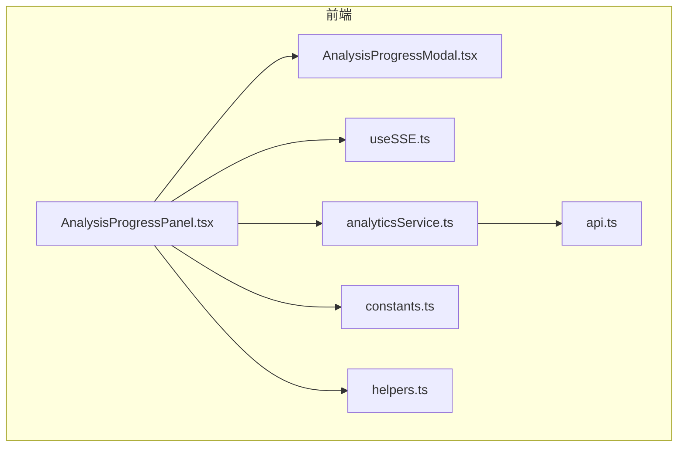
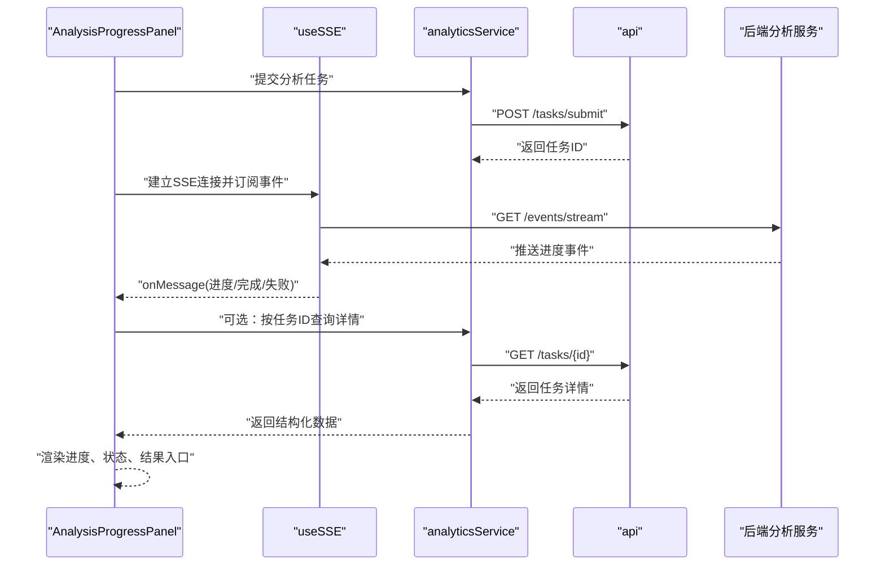
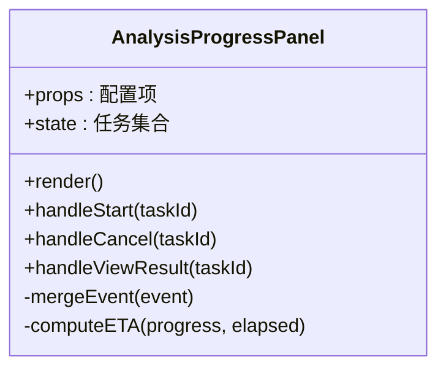
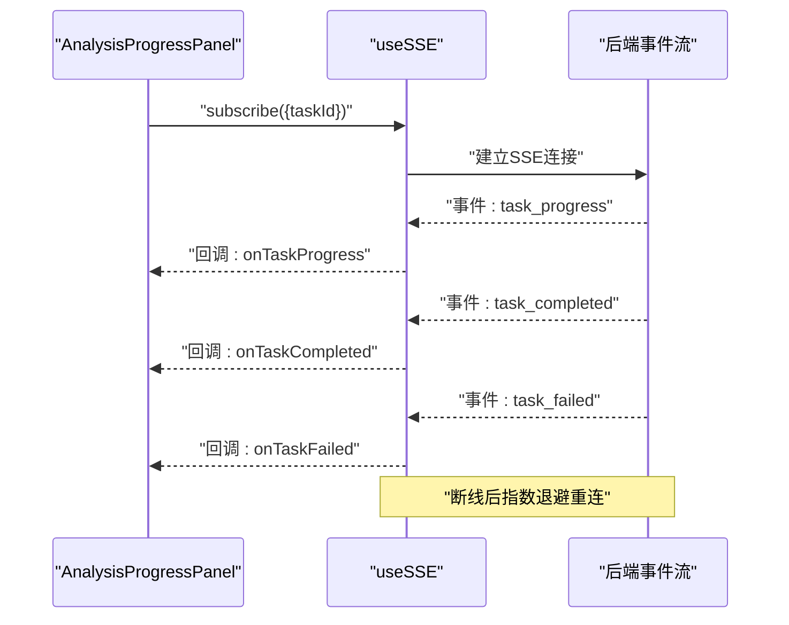
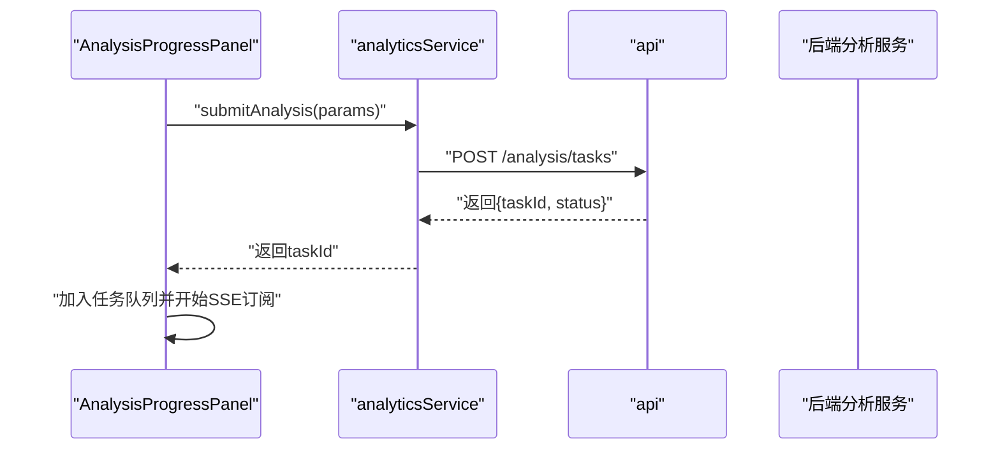
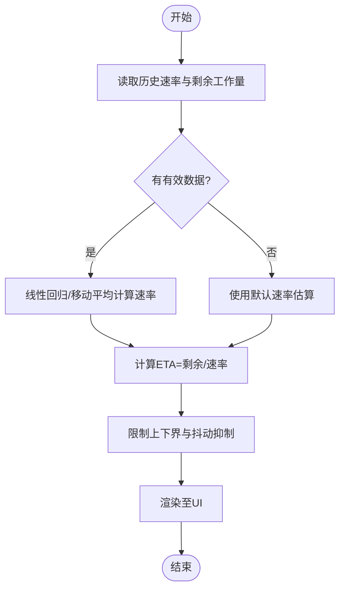
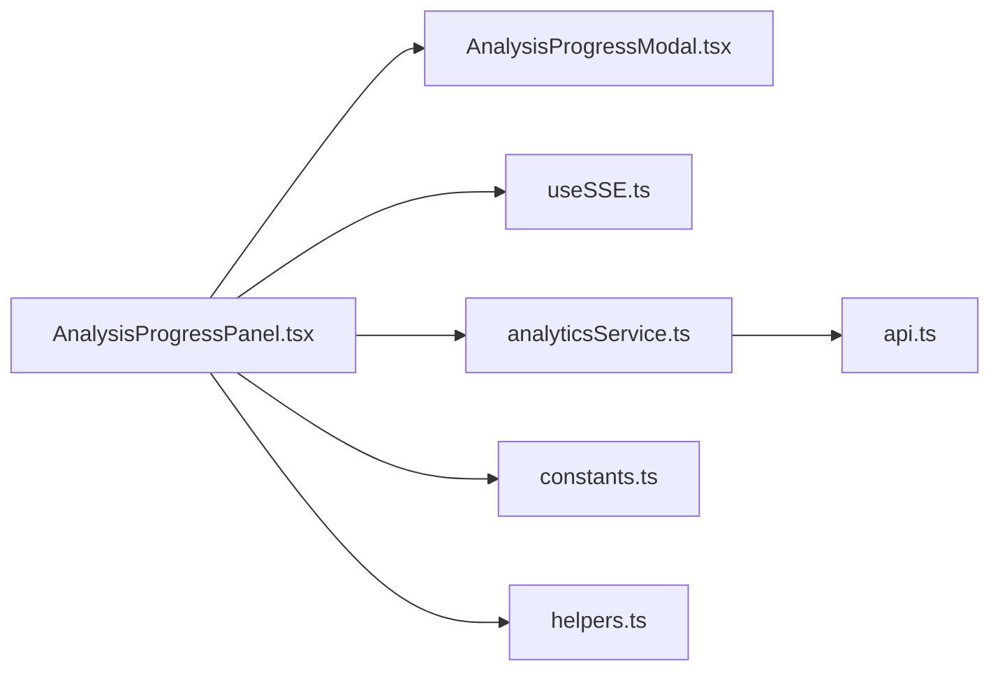

# AnalysisProgressPanel分析进度面板

<cite>
**本文引用的文件**   
- [AnalysisProgressPanel.tsx](file://frontend/src/components/AnalysisProgressPanel.tsx)
- [AnalysisProgressModal.tsx](file://frontend/src/components/AnalysisProgressModal.tsx)
- [useSSE.ts](file://frontend/src/hooks/useSSE.ts)
- [analyticsService.ts](file://frontend/src/services/analyticsService.ts)
- [api.ts](file://frontend/src/services/api.ts)
- [assignmentService.ts](file://frontend/src/services/assignmentService.ts)
- [aiQuestionService.ts](file://frontend/src/services/aiQuestionService.ts)
- [errorQuestionService.ts](file://frontend/src/services/errorQuestionService.ts)
- [compositionService.ts](file://frontend/src/services/compositionService.ts)
- [oralService.ts](file://frontend/src/services/oralService.ts)
- [personalityService.ts](file://frontend/src/services/personalityService.ts)
- [constants.ts](file://frontend/src/utils/constants.ts)
- [helpers.ts](file://frontend/src/utils/helpers.ts)
</cite>

## 目录
1. [简介](#简介)
2. [项目结构](#项目结构)
3. [核心组件](#核心组件)
4. [架构总览](#架构总览)
5. [详细组件分析](#详细组件分析)
6. [依赖关系分析](#依赖关系分析)
7. [性能考虑](#性能考虑)
8. [故障排查指南](#故障排查指南)
9. [结论](#结论)
10. [附录](#附录)

## 简介
本文件面向前端“AnalysisProgressPanel”分析进度面板组件，系统性阐述其设计目标、实时更新机制（WebSocket/SSE连接管理、消息订阅、状态同步）、进度状态管理（任务队列、执行进度计算、预计完成时间估算）、用户体验优化策略（动画、加载指示器、反馈提示）、错误处理与恢复（网络中断重连、失败重试、超时）、可配置化选项（更新频率、显示样式、通知），以及与后端分析服务的集成方式（任务提交、进度查询、结果获取）。文档以代码级事实为依据，结合可视化图示帮助读者快速理解并落地实现。

## 项目结构
AnalysisProgressPanel位于前端组件目录中，负责展示与分析任务相关的实时进度信息；与之配套的模态框用于在弹窗场景下复用相同能力。实时更新通过自定义Hook useSSE封装的SSE通道进行，服务层统一由analyticsService等模块发起请求，底层HTTP客户端由api.ts提供。

图表来源
- [AnalysisProgressPanel.tsx](file://frontend/src/components/AnalysisProgressPanel.tsx)
- [AnalysisProgressModal.tsx](file://frontend/src/components/AnalysisProgressModal.tsx)
- [useSSE.ts](file://frontend/src/hooks/useSSE.ts)
- [analyticsService.ts](file://frontend/src/services/analyticsService.ts)
- [api.ts](file://frontend/src/services/api.ts)
- [constants.ts](file://frontend/src/utils/constants.ts)
- [helpers.ts](file://frontend/src/utils/helpers.ts)

章节来源
- [AnalysisProgressPanel.tsx](file://frontend/src/components/AnalysisProgressPanel.tsx)
- [AnalysisProgressModal.tsx](file://frontend/src/components/AnalysisProgressModal.tsx)
- [useSSE.ts](file://frontend/src/hooks/useSSE.ts)
- [analyticsService.ts](file://frontend/src/services/analyticsService.ts)
- [api.ts](file://frontend/src/services/api.ts)
- [constants.ts](file://frontend/src/utils/constants.ts)
- [helpers.ts](file://frontend/src/utils/helpers.ts)

## 核心组件
- AnalysisProgressPanel：主面板组件，负责渲染任务列表、进度条、状态标签、操作按钮，以及接收SSE事件驱动的状态更新。
- AnalysisProgressModal：基于Panel能力的弹窗封装，便于在需要时以模态形式展示同一份进度信息。
- useSSE：封装SSE连接生命周期、事件订阅、断线重连、心跳保活、错误上报等逻辑，为上层组件提供稳定的事件流。
- analyticsService：聚合各业务域的分析任务接口（作业、错题、作文、口语、人格等），统一封装任务提交、进度查询、结果拉取等调用。
- api：统一的HTTP客户端封装，提供请求拦截、错误转换、重试策略等基础能力。
- constants/helpers：常量定义与通用工具函数，支撑UI文案、阈值、格式化等。

章节来源
- [AnalysisProgressPanel.tsx](file://frontend/src/components/AnalysisProgressPanel.tsx)
- [AnalysisProgressModal.tsx](file://frontend/src/components/AnalysisProgressModal.tsx)
- [useSSE.ts](file://frontend/src/hooks/useSSE.ts)
- [analyticsService.ts](file://frontend/src/services/analyticsService.ts)
- [api.ts](file://frontend/src/services/api.ts)
- [constants.ts](file://frontend/src/utils/constants.ts)
- [helpers.ts](file://frontend/src/utils/helpers.ts)

## 架构总览
从端到端视角，面板通过SSE订阅后端推送的任务进度事件，同时支持主动轮询或按需查询作为兜底。当任务完成后，面板自动刷新结果入口或触发后续动作。

图表来源
- [AnalysisProgressPanel.tsx](file://frontend/src/components/AnalysisProgressPanel.tsx)
- [useSSE.ts](file://frontend/src/hooks/useSSE.ts)
- [analyticsService.ts](file://frontend/src/services/analyticsService.ts)
- [api.ts](file://frontend/src/services/api.ts)

## 详细组件分析

### AnalysisProgressPanel 组件
职责
- 维护本地任务集合与单个任务的进度状态（排队、运行中、成功、失败、取消）。
- 根据SSE事件增量更新任务状态，避免全量刷新。
- 计算整体进度百分比、预估剩余时间、队列位置等指标。
- 提供用户交互：开始/暂停/取消、查看结果、导出报告等。
- 暴露可配置项：更新频率、是否启用声音提醒、主题样式等。

关键流程
- 初始化：读取配置、注册SSE事件处理器、启动首次任务列表拉取。
- 事件驱动：收到进度事件后合并到本地状态，触发最小粒度重渲染。
- 结果就绪：自动打开结果页或弹出下载入口。
- 清理：组件卸载时关闭SSE连接、清除定时器。

章节来源
- [AnalysisProgressPanel.tsx](file://frontend/src/components/AnalysisProgressPanel.tsx)

#### 类图（概念映射）

图表来源
- [AnalysisProgressPanel.tsx](file://frontend/src/components/AnalysisProgressPanel.tsx)

### AnalysisProgressModal 组件
职责
- 复用AnalysisProgressPanel的能力，以模态窗口形式呈现。
- 控制模态可见性、遮罩点击关闭、ESC关闭等行为。
- 在关闭前确认未完成任务的处理策略（继续后台运行/取消）。

章节来源
- [AnalysisProgressModal.tsx](file://frontend/src/components/AnalysisProgressModal.tsx)

### useSSE Hook
职责
- 管理SSE连接生命周期：创建、重连、心跳、关闭。
- 事件分发：将原始事件解析为领域事件（如“任务进度”、“任务完成”、“任务失败”）。
- 错误处理：网络异常降级为轮询、指数退避重连、最大重试次数限制。
- 订阅模型：支持按任务ID过滤事件，减少无关事件对UI的影响。

关键特性
- 断线重连：指数退避+抖动，避免雪崩。
- 心跳保活：周期性ping/pong或keepalive。
- 去抖节流：高频事件合并，降低渲染压力。
- 内存安全：组件卸载时确保断开连接、释放监听。

章节来源
- [useSSE.ts](file://frontend/src/hooks/useSSE.ts)

#### 序列图（SSE事件流）

图表来源
- [useSSE.ts](file://frontend/src/hooks/useSSE.ts)

### 服务层集成（analyticsService 与各业务服务）
职责
- 统一封装任务提交、进度查询、结果获取等API。
- 组合多业务域：作业分析、错题分析、作文批改、口语评测、人格测评等。
- 错误归一化：将HTTP错误转换为领域错误码与友好提示。
- 缓存与幂等：对重复提交做防抖与幂等键生成。

章节来源
- [analyticsService.ts](file://frontend/src/services/analyticsService.ts)
- [assignmentService.ts](file://frontend/src/services/assignmentService.ts)
- [errorQuestionService.ts](file://frontend/src/services/errorQuestionService.ts)
- [compositionService.ts](file://frontend/src/services/compositionService.ts)
- [oralService.ts](file://frontend/src/services/oralService.ts)
- [personalityService.ts](file://frontend/src/services/personalityService.ts)
- [api.ts](file://frontend/src/services/api.ts)

#### 序列图（任务提交流程）

图表来源
- [analyticsService.ts](file://frontend/src/services/analyticsService.ts)
- [api.ts](file://frontend/src/services/api.ts)

### 进度状态管理与计算
- 任务队列状态：pending、running、completed、failed、cancelled。
- 执行进度计算：基于已完成的子步骤数/总步骤数，或字节/文件大小比例。
- 预计完成时间（ETA）：基于历史速率与剩余工作量线性估算，支持平滑过渡与上限保护。
- 状态同步：SSE事件优先，轮询兜底；冲突时以服务端为准。

章节来源
- [AnalysisProgressPanel.tsx](file://frontend/src/components/AnalysisProgressPanel.tsx)
- [useSSE.ts](file://frontend/src/hooks/useSSE.ts)
- [analyticsService.ts](file://frontend/src/services/analyticsService.ts)

#### 流程图（ETA估算）

图表来源
- [AnalysisProgressPanel.tsx](file://frontend/src/components/AnalysisProgressPanel.tsx)

### 用户体验优化策略
- 动画效果：进度条缓动、骨架屏占位、微交互动画提升感知速度。
- 加载指示器：首帧快速响应，异步内容逐步填充。
- 用户反馈：成功/失败/警告的多形态提示，支持声音与桌面通知。
- 可访问性：键盘导航、ARIA标签、对比度与字体大小适配。

章节来源
- [AnalysisProgressPanel.tsx](file://frontend/src/components/AnalysisProgressPanel.tsx)
- [constants.ts](file://frontend/src/utils/constants.ts)
- [helpers.ts](file://frontend/src/utils/helpers.ts)

### 错误处理与恢复机制
- 网络中断：SSE断线自动重连，指数退避+最大重试；降级为短轮询。
- 任务失败：记录失败原因，提供重试/撤销/导出日志等操作。
- 超时处理：长任务设置超时阈值，超过阈值提示用户或自动取消。
- 幂等与一致性：提交接口幂等键，防止重复提交导致状态不一致。

章节来源
- [useSSE.ts](file://frontend/src/hooks/useSSE.ts)
- [api.ts](file://frontend/src/services/api.ts)
- [analyticsService.ts](file://frontend/src/services/analyticsService.ts)

### 可配置化选项
- 更新频率：SSE事件合并间隔、轮询间隔。
- 显示样式：主题、尺寸、是否显示ETA、是否显示队列位置。
- 通知设置：是否开启声音、桌面通知、静默模式。
- 行为策略：失败自动重试次数、最大并发任务数、超时阈值。

章节来源
- [AnalysisProgressPanel.tsx](file://frontend/src/components/AnalysisProgressPanel.tsx)
- [constants.ts](file://frontend/src/utils/constants.ts)

## 依赖关系分析
组件与服务之间的耦合关系如下：

图表来源
- [AnalysisProgressPanel.tsx](file://frontend/src/components/AnalysisProgressPanel.tsx)
- [AnalysisProgressModal.tsx](file://frontend/src/components/AnalysisProgressModal.tsx)
- [useSSE.ts](file://frontend/src/hooks/useSSE.ts)
- [analyticsService.ts](file://frontend/src/services/analyticsService.ts)
- [api.ts](file://frontend/src/services/api.ts)
- [constants.ts](file://frontend/src/utils/constants.ts)
- [helpers.ts](file://frontend/src/utils/helpers.ts)

章节来源
- [AnalysisProgressPanel.tsx](file://frontend/src/components/AnalysisProgressPanel.tsx)
- [useSSE.ts](file://frontend/src/hooks/useSSE.ts)
- [analyticsService.ts](file://frontend/src/services/analyticsService.ts)
- [api.ts](file://frontend/src/services/api.ts)

## 性能考虑
- 事件合并与节流：高频SSE事件批量处理，减少React重渲染次数。
- 局部更新：仅变更受影响任务的最小状态树节点。
- 懒加载与虚拟滚动：任务列表较长时采用分页或虚拟化渲染。
- 资源释放：组件卸载时及时关闭SSE连接、清理定时器与监听器。
- 网络优化：合理设置轮询间隔、启用压缩、缓存只读元数据。

[本节为通用指导，不直接分析具体文件]

## 故障排查指南
常见问题与定位建议
- SSE无法连接：检查网络、跨域、服务端事件流地址与鉴权头；查看Hook的重连日志。
- 进度不更新：确认事件类型匹配、任务ID过滤是否正确；必要时切换为轮询验证。
- 任务失败无提示：检查错误归一化逻辑与UI提示分支；核对后端返回的错误码。
- 长时间无响应：核对超时配置与心跳保活；观察浏览器网络面板是否有空闲连接。
- 重复提交：确认幂等键生成与防抖逻辑；比对后端任务ID是否一致。

章节来源
- [useSSE.ts](file://frontend/src/hooks/useSSE.ts)
- [api.ts](file://frontend/src/services/api.ts)
- [analyticsService.ts](file://frontend/src/services/analyticsService.ts)

## 结论
AnalysisProgressPanel通过SSE驱动的实时事件流与稳健的服务层封装，实现了高可靠、低延迟的分析任务进度可视化。配合完善的错误恢复、可配置化与用户体验优化，能够在复杂业务场景中稳定交付一致的进度体验。建议在后续迭代中持续完善ETA算法、增强可观测性与可测试性，并引入更细粒度的权限与审计能力。

## 附录
- 术语
  - SSE：Server-Sent Events，服务器推送事件流。
  - ETA：Estimated Time of Arrival，预计到达/完成时间。
  - 幂等：多次执行产生相同结果的操作。
- 相关参考
  - 前端组件与Hook：见“本文引用的文件”列表。
  - 后端任务与事件：参见后端对应API与事件流实现（不在本仓库范围内）。