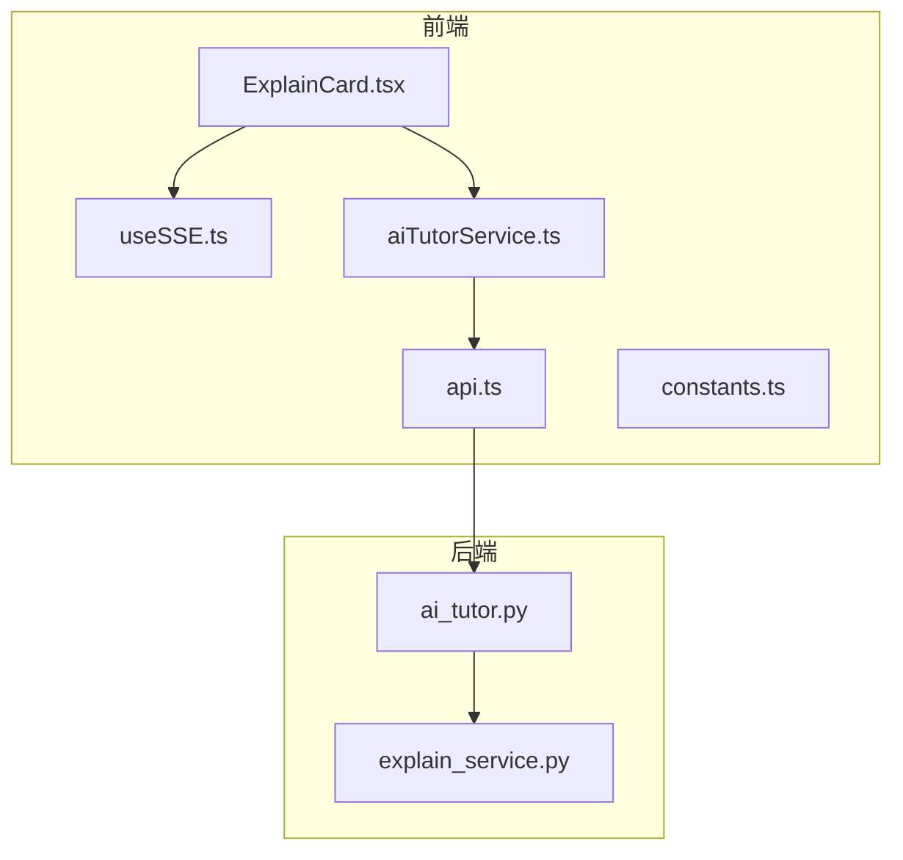
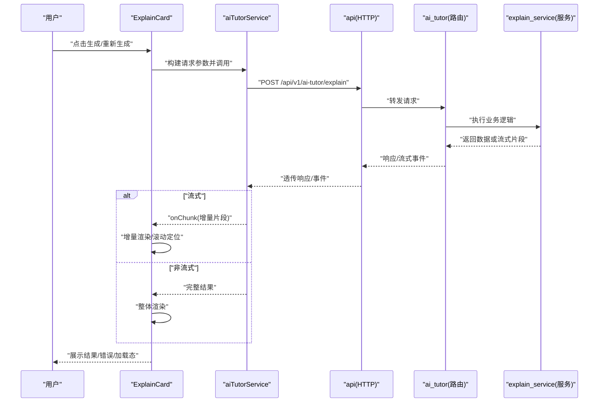
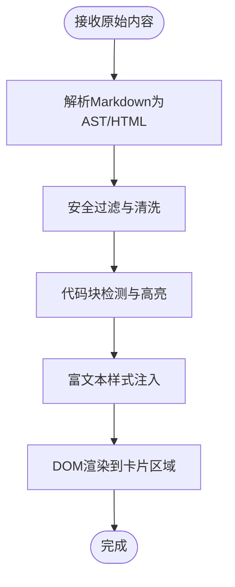
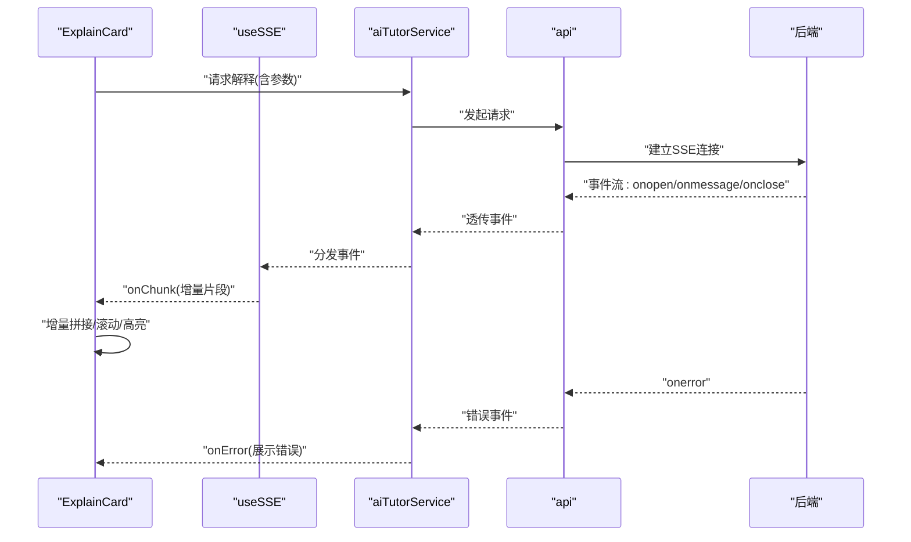

# ExplainCard解析卡片

<cite>
**本文引用的文件**   
- [ExplainCard.tsx](file://frontend/src/components/ExplainCard.tsx)
- [useSSE.ts](file://frontend/src/hooks/useSSE.ts)
- [aiTutorService.ts](file://frontend/src/services/aiTutorService.ts)
- [api.ts](file://frontend/src/services/api.ts)
- [constants.ts](file://frontend/src/utils/constants.ts)
- [explain_service.py](file://backend/app/services/explain_service.py)
- [ai_tutor.py](file://backend/app/api/v1/ai_tutor.py)
</cite>

## 目录
1. [简介](#简介)
2. [项目结构](#项目结构)
3. [核心组件](#核心组件)
4. [架构总览](#架构总览)
5. [详细组件分析](#详细组件分析)
6. [依赖关系分析](#依赖关系分析)
7. [性能考虑](#性能考虑)
8. [故障排查指南](#故障排查指南)
9. [结论](#结论)
10. [附录](#附录)

## 简介
本文件面向开发者，系统化阐述“ExplainCard解析卡片”的前端组件与后端服务集成方案。重点覆盖：
- 内容渲染引擎：Markdown语法支持、富文本格式化、代码高亮显示
- 动态内容处理：AI生成内容的流式渲染、增量更新、缓存策略
- 交互操作：复制内容、分享链接、收藏标记、反馈评分
- 响应式设计：移动端优化、屏幕自适应、字体大小调整
- 主题定制：颜色方案切换、布局模式选择、样式变量配置
- AI服务集成：请求参数配置、响应数据处理、错误状态展示

## 项目结构
前端以React+TypeScript实现，ExplainCard作为独立可复用卡片组件；后端提供解释类AI能力（如题目解析、知识点讲解）的API与服务。

图表来源
- [ExplainCard.tsx](file://frontend/src/components/ExplainCard.tsx)
- [useSSE.ts](file://frontend/src/hooks/useSSE.ts)
- [aiTutorService.ts](file://frontend/src/services/aiTutorService.ts)
- [api.ts](file://frontend/src/services/api.ts)
- [ai_tutor.py](file://backend/app/api/v1/ai_tutor.py)
- [explain_service.py](file://backend/app/services/explain_service.py)

章节来源
- [ExplainCard.tsx](file://frontend/src/components/ExplainCard.tsx)
- [useSSE.ts](file://frontend/src/hooks/useSSE.ts)
- [aiTutorService.ts](file://frontend/src/services/aiTutorService.ts)
- [api.ts](file://frontend/src/services/api.ts)
- [ai_tutor.py](file://backend/app/api/v1/ai_tutor.py)
- [explain_service.py](file://backend/app/services/explain_service.py)

## 核心组件
- ExplainCard：负责渲染AI生成的解释内容，承载交互按钮（复制、分享、收藏、评分）、主题与排版控制、流式增量更新与错误提示。
- useSSE：封装服务端事件流（SSE）连接、断线重连、消息分片合并、进度回调。
- aiTutorService：统一封装AI相关接口调用，包括请求参数构建、重试与超时、错误映射。
- api：HTTP客户端基础封装（拦截器、鉴权、错误码处理）。
- constants：全局常量（默认主题、断点、字体比例、API路径等）。

章节来源
- [ExplainCard.tsx](file://frontend/src/components/ExplainCard.tsx)
- [useSSE.ts](file://frontend/src/hooks/useSSE.ts)
- [aiTutorService.ts](file://frontend/src/services/aiTutorService.ts)
- [api.ts](file://frontend/src/services/api.ts)
- [constants.ts](file://frontend/src/utils/constants.ts)

## 架构总览
ExplainCard通过aiTutorService发起AI请求，后端ai_tutor路由将请求转发至explain_service进行内容生成。若采用流式输出，useSSE订阅事件并增量更新UI；非流式则等待完整响应后一次性渲染。

图表来源
- [ExplainCard.tsx](file://frontend/src/components/ExplainCard.tsx)
- [aiTutorService.ts](file://frontend/src/services/aiTutorService.ts)
- [api.ts](file://frontend/src/services/api.ts)
- [ai_tutor.py](file://backend/app/api/v1/ai_tutor.py)
- [explain_service.py](file://backend/app/services/explain_service.py)

## 详细组件分析

### 内容渲染引擎
- Markdown支持：使用Markdown解析库将原始文本转换为HTML片段，再交由富文本容器渲染。
- 富文本格式化：对标题、段落、列表、表格、引用等进行样式化，确保可读性与一致性。
- 代码高亮：识别代码块语言，应用语法高亮主题，支持行号与复制代码块。
- 安全渲染：过滤危险标签与脚本，避免XSS风险。

章节来源
- [ExplainCard.tsx](file://frontend/src/components/ExplainCard.tsx)

### 动态内容处理（流式渲染、增量更新、缓存）
- 流式渲染：基于SSE建立长连接，逐块接收AI生成片段，立即追加到已渲染内容末尾，保持滚动位置稳定。
- 增量更新：按段落或句子粒度合并片段，减少频繁重排；必要时使用虚拟滚动提升大文档性能。
- 缓存策略：
  - 内存缓存：相同输入参数命中时直接返回缓存结果，避免重复请求。
  - 持久化缓存：将结果写入本地存储，支持离线查看与快速恢复。
  - 失效策略：按时间或版本键失效，保证内容时效性。

图表来源
- [useSSE.ts](file://frontend/src/hooks/useSSE.ts)
- [aiTutorService.ts](file://frontend/src/services/aiTutorService.ts)
- [api.ts](file://frontend/src/services/api.ts)

章节来源
- [useSSE.ts](file://frontend/src/hooks/useSSE.ts)
- [aiTutorService.ts](file://frontend/src/services/aiTutorService.ts)
- [ExplainCard.tsx](file://frontend/src/components/ExplainCard.tsx)

### 交互操作功能
- 复制内容：一键复制当前卡片文本或选中内容，失败时给出提示。
- 分享链接：生成包含必要参数的短链或查询串，便于二次打开同一上下文。
- 收藏标记：将当前解释结果加入收藏列表，支持批量管理与导出。
- 反馈评分：对生成质量打分，提交至后端用于模型评估与改进。

章节来源
- [ExplainCard.tsx](file://frontend/src/components/ExplainCard.tsx)

### 响应式设计适配
- 移动端优化：在小屏下隐藏次要操作按钮，增大触控区域，优化行高与间距。
- 屏幕尺寸自适应：基于断点切换布局（单列/双列），图片与表格横向滚动。
- 字体大小调整：根据设备DPR与用户偏好动态调整基础字号，保持阅读舒适度。

章节来源
- [ExplainCard.tsx](file://frontend/src/components/ExplainCard.tsx)
- [constants.ts](file://frontend/src/utils/constants.ts)

### 主题定制能力
- 颜色方案切换：支持明暗主题与品牌色替换，通过CSS变量或主题对象注入。
- 布局模式选择：紧凑/宽松两种密度模式，影响内边距、行高与分割线。
- 样式变量配置：暴露常用变量（主色、背景、边框、阴影、圆角、字体族）供上层覆盖。

章节来源
- [ExplainCard.tsx](file://frontend/src/components/ExplainCard.tsx)
- [constants.ts](file://frontend/src/utils/constants.ts)

### 与AI服务的集成方式
- 请求参数配置：包含问题/上下文、风格/长度约束、是否流式、缓存键等。
- 响应数据处理：区分流式与非流式响应，统一错误码映射与重试策略。
- 错误状态展示：网络异常、超时、业务错误分类提示，并提供重试与反馈入口。

章节来源
- [aiTutorService.ts](file://frontend/src/services/aiTutorService.ts)
- [api.ts](file://frontend/src/services/api.ts)
- [ai_tutor.py](file://backend/app/api/v1/ai_tutor.py)
- [explain_service.py](file://backend/app/services/explain_service.py)

## 依赖关系分析
ExplainCard依赖SSE钩子与AI服务层，服务层依赖HTTP客户端与后端路由，路由再调用具体服务实现。

图表来源
- [ExplainCard.tsx](file://frontend/src/components/ExplainCard.tsx)
- [useSSE.ts](file://frontend/src/hooks/useSSE.ts)
- [aiTutorService.ts](file://frontend/src/services/aiTutorService.ts)
- [api.ts](file://frontend/src/services/api.ts)
- [ai_tutor.py](file://backend/app/api/v1/ai_tutor.py)
- [explain_service.py](file://backend/app/services/explain_service.py)

章节来源
- [ExplainCard.tsx](file://frontend/src/components/ExplainCard.tsx)
- [useSSE.ts](file://frontend/src/hooks/useSSE.ts)
- [aiTutorService.ts](file://frontend/src/services/aiTutorService.ts)
- [api.ts](file://frontend/src/services/api.ts)
- [ai_tutor.py](file://backend/app/api/v1/ai_tutor.py)
- [explain_service.py](file://backend/app/services/explain_service.py)

## 性能考虑
- 增量渲染：优先按最小单元（段落/句子）追加，避免整段重绘。
- 防抖与节流：对高频输入（如搜索/筛选）做节流，降低渲染压力。
- 虚拟滚动：超长内容启用虚拟列表，仅渲染可视区域节点。
- 资源懒加载：图片与外部资源按需加载，首屏更快。
- 缓存命中：相同参数命中内存/本地缓存，减少网络与计算开销。
- 主题切换：通过CSS变量切换，避免全量重算样式。

[本节为通用指导，不直接分析具体文件]

## 故障排查指南
- 流式连接失败：检查SSE事件流是否建立成功，确认后端是否返回正确的事件类型与编码。
- 增量错乱：核对片段边界与合并策略，确保按顺序拼接且无重复。
- 渲染空白：检查Markdown解析与安全过滤是否误删合法内容。
- 高亮异常：确认代码块语言标识是否正确，高亮主题是否加载。
- 复制失败：浏览器权限与剪贴板API兼容性，降级提示用户手动复制。
- 分享链接无效：校验URL参数完整性与后端解析逻辑。
- 收藏/评分失败：检查鉴权与接口返回码，记录错误日志并引导重试。

章节来源
- [useSSE.ts](file://frontend/src/hooks/useSSE.ts)
- [aiTutorService.ts](file://frontend/src/services/aiTutorService.ts)
- [api.ts](file://frontend/src/services/api.ts)
- [ExplainCard.tsx](file://frontend/src/components/ExplainCard.tsx)

## 结论
ExplainCard通过清晰的组件分层与前后端协作，实现了高质量的AI解释内容渲染与交互体验。结合流式渲染、缓存与主题系统，既满足性能要求，也具备良好的可扩展性与可维护性。建议后续持续完善错误监控、A/B测试与无障碍支持。

[本节为总结性内容，不直接分析具体文件]

## 附录
- 关键路径参考
  - 前端组件：[ExplainCard.tsx](file://frontend/src/components/ExplainCard.tsx)
  - 流式钩子：[useSSE.ts](file://frontend/src/hooks/useSSE.ts)
  - AI服务封装：[aiTutorService.ts](file://frontend/src/services/aiTutorService.ts)
  - HTTP客户端：[api.ts](file://frontend/src/services/api.ts)
  - 常量配置：[constants.ts](file://frontend/src/utils/constants.ts)
  - 后端路由：[ai_tutor.py](file://backend/app/api/v1/ai_tutor.py)
  - 后端服务：[explain_service.py](file://backend/app/services/explain_service.py)