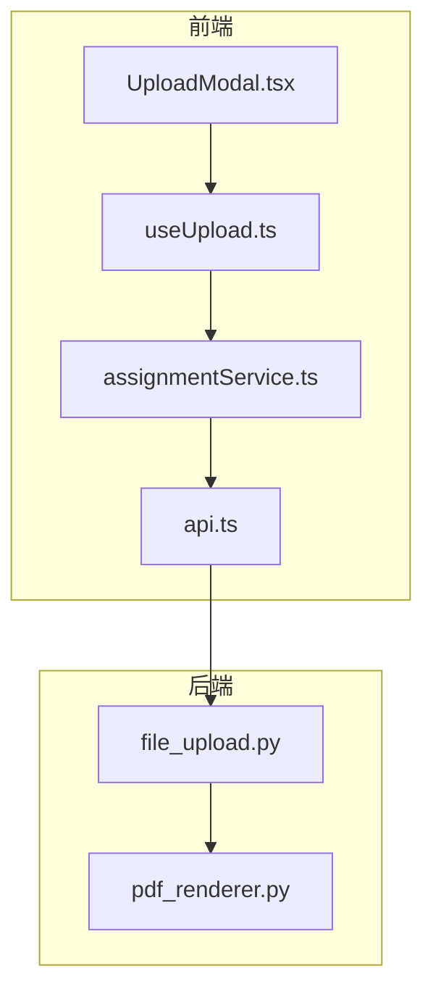
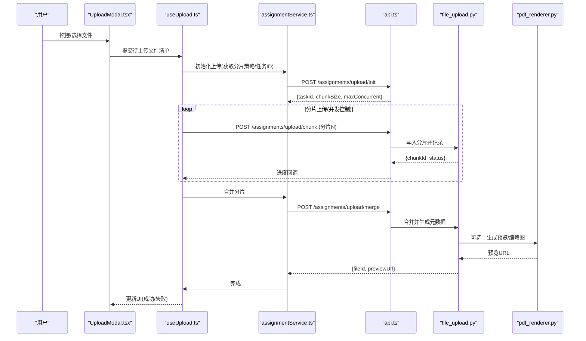
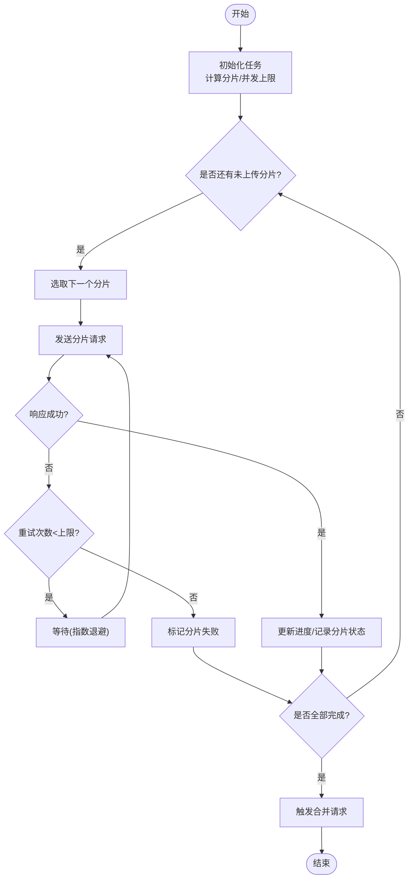
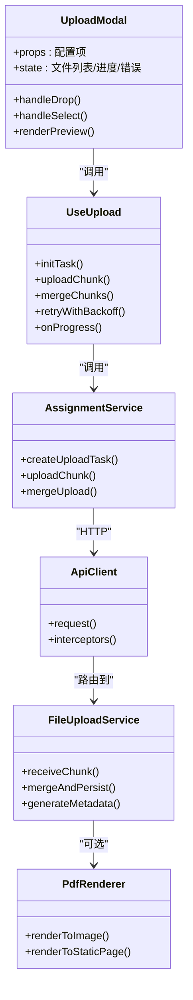

# UploadModal上传模态框

<cite>
**本文引用的文件**   
- [UploadModal.tsx](file://frontend/src/components/UploadModal.tsx)
- [useUpload.ts](file://frontend/src/hooks/useUpload.ts)
- [api.ts](file://frontend/src/services/api.ts)
- [assignmentService.ts](file://frontend/src/services/assignmentService.ts)
- [file_upload.py](file://backend/app/services/file_upload.py)
- [pdf_renderer.py](file://backend/app/services/pdf_renderer.py)
</cite>

## 目录
1. [简介](#简介)
2. [项目结构](#项目结构)
3. [核心组件](#核心组件)
4. [架构总览](#架构总览)
5. [详细组件分析](#详细组件分析)
6. [依赖关系分析](#依赖关系分析)
7. [性能考虑](#性能考虑)
8. [故障排查指南](#故障排查指南)
9. [结论](#结论)
10. [附录](#附录)

## 简介
本文件围绕前端“UploadModal”上传模态框组件，系统性阐述其拖拽上传、类型与大小校验、进度显示、断点续传、错误重试、预览能力以及与后端分片上传API的集成方式。文档同时覆盖配置项说明、并发控制策略和常见问题的定位方法，帮助开发者快速理解并扩展该组件。

## 项目结构
与UploadModal相关的代码主要分布在以下位置：
- 前端组件：UploadModal.tsx
- 上传逻辑Hook：useUpload.ts
- 服务层封装：assignmentService.ts、api.ts
- 后端上传服务：file_upload.py（分片上传、合并、存储）
- PDF渲染服务：pdf_renderer.py（用于PDF预览）

图表来源
- [UploadModal.tsx](file://frontend/src/components/UploadModal.tsx)
- [useUpload.ts](file://frontend/src/hooks/useUpload.ts)
- [assignmentService.ts](file://frontend/src/services/assignmentService.ts)
- [api.ts](file://frontend/src/services/api.ts)
- [file_upload.py](file://backend/app/services/file_upload.py)
- [pdf_renderer.py](file://backend/app/services/pdf_renderer.py)

章节来源
- [UploadModal.tsx](file://frontend/src/components/UploadModal.tsx)
- [useUpload.ts](file://frontend/src/hooks/useUpload.ts)
- [assignmentService.ts](file://frontend/src/services/assignmentService.ts)
- [api.ts](file://frontend/src/services/api.ts)
- [file_upload.py](file://backend/app/services/file_upload.py)
- [pdf_renderer.py](file://backend/app/services/pdf_renderer.py)

## 核心组件
- UploadModal：提供用户交互界面，支持点击选择与拖拽上传，展示文件列表、进度条、预览图与错误提示。
- useUpload：封装上传状态机、分片计算、并发控制、进度聚合、断点续传与重试逻辑。
- assignmentService：面向业务的上传统入参数组装、任务创建与结果查询等接口调用。
- api：通用HTTP请求封装（含鉴权头、超时、错误映射）。
- file_upload.py：后端分片接收、去重、合并、持久化与元数据记录。
- pdf_renderer.py：将PDF转换为可预览的静态资源或缩略图。

章节来源
- [UploadModal.tsx](file://frontend/src/components/UploadModal.tsx)
- [useUpload.ts](file://frontend/src/hooks/useUpload.ts)
- [assignmentService.ts](file://frontend/src/services/assignmentService.ts)
- [api.ts](file://frontend/src/services/api.ts)
- [file_upload.py](file://backend/app/services/file_upload.py)
- [pdf_renderer.py](file://backend/app/services/pdf_renderer.py)

## 架构总览
整体流程从UI触发开始，经Hook编排上传任务，通过服务层调用后端分片上传接口；完成后返回文件ID与预览信息，供组件渲染。

图表来源
- [useUpload.ts](file://frontend/src/hooks/useUpload.ts)
- [assignmentService.ts](file://frontend/src/services/assignmentService.ts)
- [api.ts](file://frontend/src/services/api.ts)
- [file_upload.py](file://backend/app/services/file_upload.py)
- [pdf_renderer.py](file://backend/app/services/pdf_renderer.py)

## 详细组件分析

### 拖拽与文件选择
- 使用HTML5 Drag & Drop API监听dragover/dragleave/drop事件，阻止默认行为并高亮拖拽区域。
- 支持input[type=file]多文件选择，兼容移动端。
- 对drop的文件集合进行去重与排序，避免重复提交。

章节来源
- [UploadModal.tsx](file://frontend/src/components/UploadModal.tsx)

### 文件类型与大小校验
- 基于文件扩展名与MIME类型双重校验，拒绝不支持的类型。
- 根据配置的最大文件大小进行限制，超出则给出明确提示。
- 可扩展自定义验证规则（如文件名白名单、特殊字符过滤）。

章节来源
- [UploadModal.tsx](file://frontend/src/components/UploadModal.tsx)
- [useUpload.ts](file://frontend/src/hooks/useUpload.ts)

### 进度显示机制
- 实时进度：按分片累计已发送字节数与总字节数计算百分比。
- 并发控制：通过信号量/队列限制同时上传的分片数量，避免浏览器带宽拥塞。
- 断点续传：记录每个分片的上传状态，支持从上次中断处继续。
- 错误重试：对网络异常与服务器临时错误进行指数退避重试，达到上限后标记失败。

图表来源
- [useUpload.ts](file://frontend/src/hooks/useUpload.ts)

章节来源
- [useUpload.ts](file://frontend/src/hooks/useUpload.ts)

### 文件预览功能
- 图片预览：使用本地URL.createObjectURL生成缩略图，必要时在内存中缩放以降低渲染开销。
- PDF预览：优先使用浏览器原生PDF查看器；若不可用，则回退到后端生成的静态预览页或缩略图。
- 其他格式：仅显示图标与名称，不提供在线预览。

章节来源
- [UploadModal.tsx](file://frontend/src/components/UploadModal.tsx)
- [pdf_renderer.py](file://backend/app/services/pdf_renderer.py)

### 错误处理策略
- 网络异常：捕获超时、DNS解析失败、连接中断等，自动重试并提示用户检查网络。
- 文件格式不支持：在客户端拦截并给出友好提示，允许用户更换文件。
- 存储空间不足：当后端返回容量不足时，停止后续上传并提示用户清理空间或联系管理员。
- 分片合并失败：提示用户稍后重试或重新发起上传任务。

章节来源
- [useUpload.ts](file://frontend/src/hooks/useUpload.ts)
- [assignmentService.ts](file://frontend/src/services/assignmentService.ts)
- [api.ts](file://frontend/src/services/api.ts)
- [file_upload.py](file://backend/app/services/file_upload.py)

### 组件配置选项
- maxSize：最大文件大小（字节），超过即拒绝。
- allowedTypes：允许的文件类型数组（扩展名或MIME）。
- chunkSize：分片大小（字节），影响并发与内存占用。
- maxConcurrent：最大并发分片数，平衡吞吐与稳定性。
- retryMax：单分片最大重试次数。
- retryDelayMs：初始重试延迟（毫秒），采用指数退避。
- onProgress：进度回调函数，返回当前文件/全局进度。
- onError：错误回调，统一收集并上报错误。
- onPreviewReady：预览就绪回调，便于懒加载或缓存。
- customValidators：自定义校验函数数组，按顺序执行。

章节来源
- [UploadModal.tsx](file://frontend/src/components/UploadModal.tsx)
- [useUpload.ts](file://frontend/src/hooks/useUpload.ts)

### 与后端API集成
- 初始化上传：创建任务、获取分片策略与并发上限。
- 分片上传：按序或乱序上传分片，携带taskId、分片序号、偏移量与哈希校验。
- 合并分片：通知服务端合并并生成最终文件对象与预览资源。
- 进度回调：服务端可返回增量进度，前端据此更新UI。
- 鉴权与错误映射：通过api.ts统一注入鉴权头、超时与错误码转换。

章节来源
- [assignmentService.ts](file://frontend/src/services/assignmentService.ts)
- [api.ts](file://frontend/src/services/api.ts)
- [file_upload.py](file://backend/app/services/file_upload.py)

## 依赖关系分析
- 组件与Hook：UploadModal依赖useUpload提供的状态与动作。
- Hook与服务：useUpload通过assignmentService调用具体API。
- 服务与HTTP：assignmentService依赖api.ts进行网络通信。
- 后端服务：file_upload.py负责分片落盘、合并与元数据管理；pdf_renderer.py提供PDF预览能力。

图表来源
- [UploadModal.tsx](file://frontend/src/components/UploadModal.tsx)
- [useUpload.ts](file://frontend/src/hooks/useUpload.ts)
- [assignmentService.ts](file://frontend/src/services/assignmentService.ts)
- [api.ts](file://frontend/src/services/api.ts)
- [file_upload.py](file://backend/app/services/file_upload.py)
- [pdf_renderer.py](file://backend/app/services/pdf_renderer.py)

章节来源
- [UploadModal.tsx](file://frontend/src/components/UploadModal.tsx)
- [useUpload.ts](file://frontend/src/hooks/useUpload.ts)
- [assignmentService.ts](file://frontend/src/services/assignmentService.ts)
- [api.ts](file://frontend/src/services/api.ts)
- [file_upload.py](file://backend/app/services/file_upload.py)
- [pdf_renderer.py](file://backend/app/services/pdf_renderer.py)

## 性能考虑
- 合理设置chunkSize与maxConcurrent：大文件建议增大分片并适度提升并发，但需兼顾内存与带宽。
- 预取与懒加载：仅在可见区域内生成预览，减少首屏压力。
- 去重与缓存：相同文件MD5命中时跳过上传，直接复用已有分片。
- 压缩与转码：对大图在客户端进行压缩后再上传，降低传输体积。
- 错误隔离：单个分片失败不影响其他分片，提高整体成功率。

[本节为通用指导，不直接分析具体文件]

## 故障排查指南
- 无法拖拽：确认dragover/drop事件未被父容器阻止；检查浏览器兼容性。
- 类型校验失败：核对allowedTypes与文件扩展名/MIME是否一致。
- 进度不更新：检查onProgress回调是否被正确挂载；确认服务端是否返回增量进度。
- 分片合并失败：查看后端日志中的分片完整性校验结果；确认taskId与分片序号是否正确。
- 预览空白：PDF可能受跨域或安全策略限制，尝试使用后端生成的静态预览链接。
- 存储空间不足：关注后端返回的错误码，提示用户清理或扩容。

章节来源
- [useUpload.ts](file://frontend/src/hooks/useUpload.ts)
- [assignmentService.ts](file://frontend/src/services/assignmentService.ts)
- [api.ts](file://frontend/src/services/api.ts)
- [file_upload.py](file://backend/app/services/file_upload.py)
- [pdf_renderer.py](file://backend/app/services/pdf_renderer.py)

## 结论
UploadModal通过清晰的职责划分与模块化设计，实现了稳定高效的拖拽上传体验。结合useUpload的并发控制、断点续传与重试机制，以及后端的分片合并与PDF预览能力，能够在复杂网络环境下保持良好可用性与用户体验。建议在生产环境开启完善的监控与告警，持续优化分片策略与预览性能。

[本节为总结性内容，不直接分析具体文件]

## 附录
- 最佳实践
  - 始终在客户端进行基础校验，减少无效请求。
  - 为关键路径添加埋点与错误上报，便于问题定位。
  - 对大文件启用后台静默上传与恢复能力。
- 扩展建议
  - 增加水印与敏感词检测。
  - 引入CDN直传与签名URL。
  - 支持多端协同编辑与版本回溯。

[本节为补充说明，不直接分析具体文件]