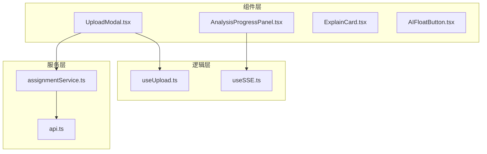
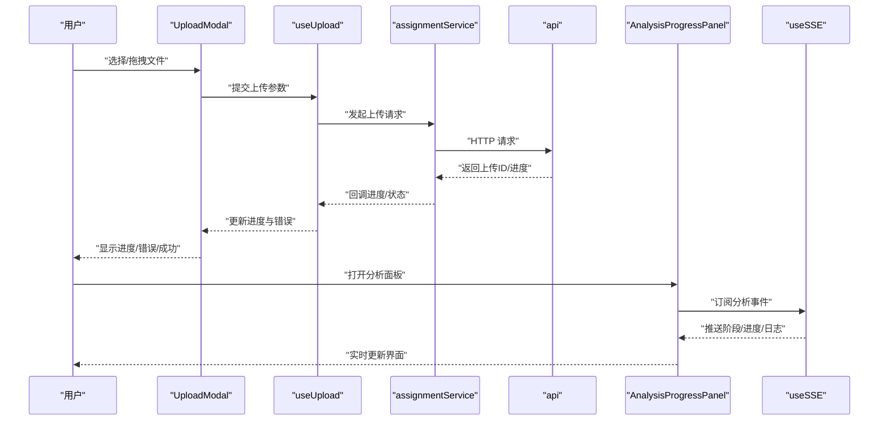
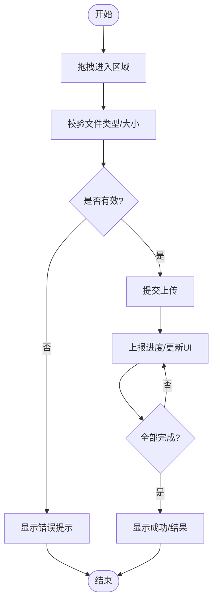
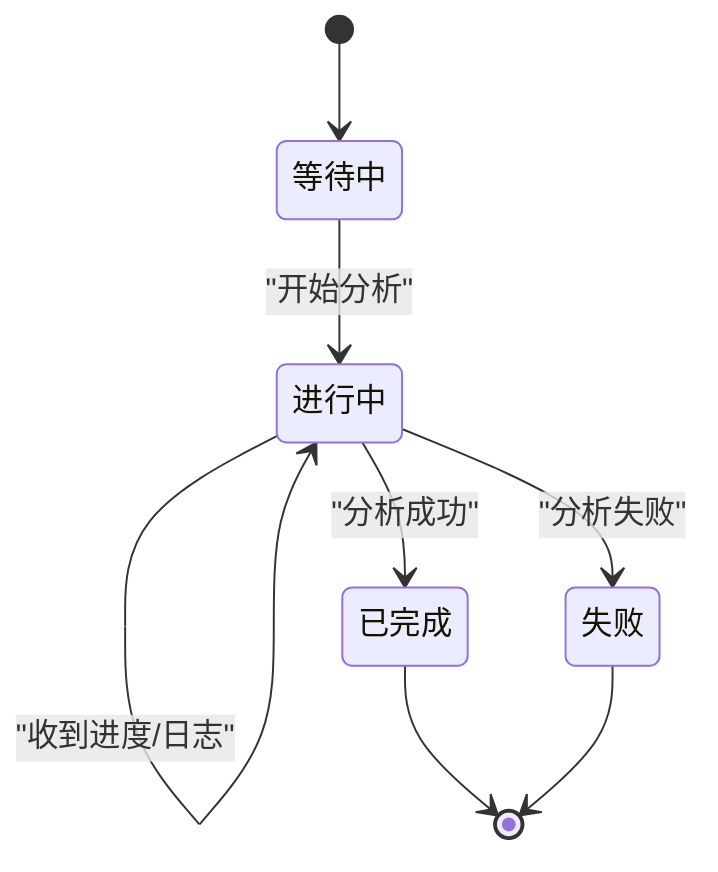
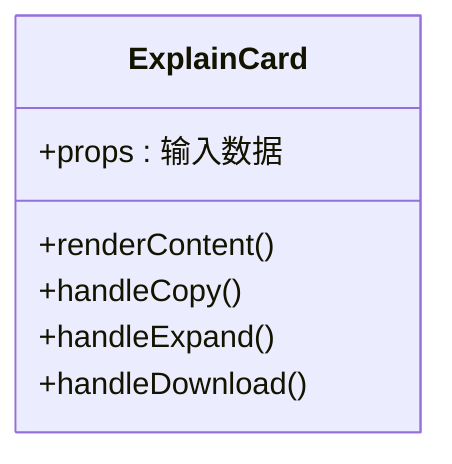
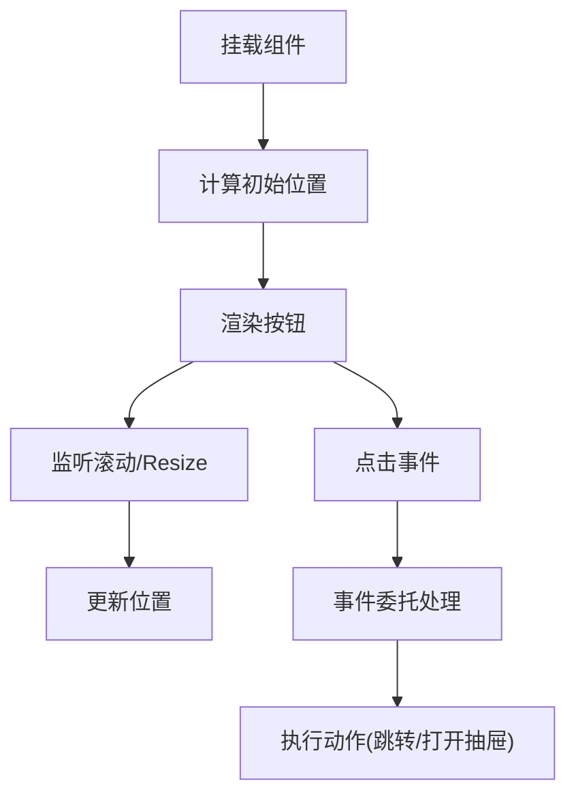
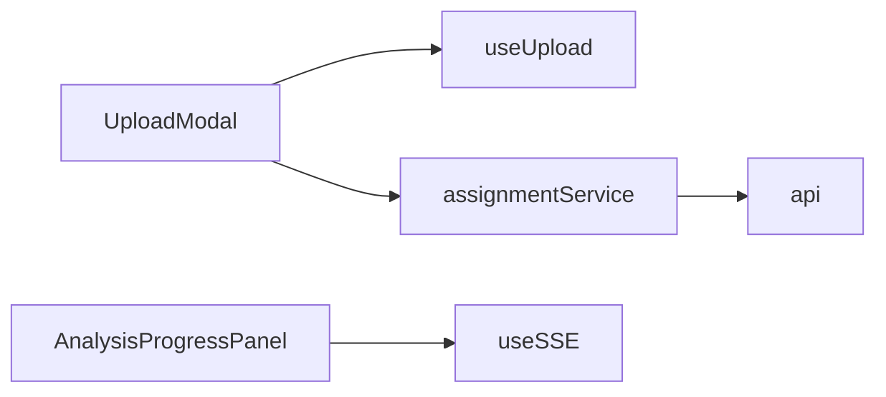

# 通用UI组件

<cite>
**本文引用的文件**   
- [UploadModal.tsx](file://frontend/src/components/UploadModal.tsx)
- [AnalysisProgressPanel.tsx](file://frontend/src/components/AnalysisProgressPanel.tsx)
- [ExplainCard.tsx](file://frontend/src/components/ExplainCard.tsx)
- [AIFloatButton.tsx](file://frontend/src/components/AIFloatButton.tsx)
- [useUpload.ts](file://frontend/src/hooks/useUpload.ts)
- [useSSE.ts](file://frontend/src/hooks/useSSE.ts)
- [assignmentService.ts](file://frontend/src/services/assignmentService.ts)
- [api.ts](file://frontend/src/services/api.ts)
</cite>

## 目录
1. [简介](#简介)
2. [项目结构](#项目结构)
3. [核心组件](#核心组件)
4. [架构总览](#架构总览)
5. [详细组件分析](#详细组件分析)
6. [依赖分析](#依赖分析)
7. [性能考虑](#性能考虑)
8. [故障排查指南](#故障排查指南)
9. [结论](#结论)
10. [附录](#附录)

## 简介
本指南面向通用UI组件开发，聚焦以下四个关键组件：
- UploadModal：文件上传模态框，支持拖拽上传、进度显示与错误处理。
- AnalysisProgressPanel：分析进度面板，提供实时更新、状态管理与用户体验优化。
- ExplainCard：解析卡片组件，负责内容渲染、格式化输出与交互操作。
- AIFloatButton：浮动按钮组件，包含定位计算、动画效果与事件委托。

同时给出可配置化设计、主题定制与国际化的通用实践建议，帮助团队构建一致、可维护的前端组件体系。

## 项目结构
前端采用按功能域组织的方式，组件位于 frontend/src/components，相关钩子与服务分别位于 hooks 与 services。本次文档重点涉及的文件如下：
- 组件层：UploadModal.tsx、AnalysisProgressPanel.tsx、ExplainCard.tsx、AIFloatButton.tsx
- 逻辑层（hooks）：useUpload.ts、useSSE.ts
- 服务层（services）：assignmentService.ts、api.ts

图表来源
- [UploadModal.tsx](file://frontend/src/components/UploadModal.tsx)
- [AnalysisProgressPanel.tsx](file://frontend/src/components/AnalysisProgressPanel.tsx)
- [ExplainCard.tsx](file://frontend/src/components/ExplainCard.tsx)
- [AIFloatButton.tsx](file://frontend/src/components/AIFloatButton.tsx)
- [useUpload.ts](file://frontend/src/hooks/useUpload.ts)
- [useSSE.ts](file://frontend/src/hooks/useSSE.ts)
- [assignmentService.ts](file://frontend/src/services/assignmentService.ts)
- [api.ts](file://frontend/src/services/api.ts)

章节来源
- [UploadModal.tsx](file://frontend/src/components/UploadModal.tsx)
- [AnalysisProgressPanel.tsx](file://frontend/src/components/AnalysisProgressPanel.tsx)
- [ExplainCard.tsx](file://frontend/src/components/ExplainCard.tsx)
- [AIFloatButton.tsx](file://frontend/src/components/AIFloatButton.tsx)
- [useUpload.ts](file://frontend/src/hooks/useUpload.ts)
- [useSSE.ts](file://frontend/src/hooks/useSSE.ts)
- [assignmentService.ts](file://frontend/src/services/assignmentService.ts)
- [api.ts](file://frontend/src/services/api.ts)

## 核心组件
本节概述各组件的职责边界与对外能力，便于快速理解整体协作关系。

- UploadModal
  - 职责：承载文件选择与拖拽上传、展示上传进度、统一错误提示与重试入口。
  - 关键能力：拖拽区域、多文件支持、类型与大小校验、分片或直传策略、失败重试、取消上传。
  - 外部依赖：useUpload（上传状态与回调）、assignmentService（调用后端接口）。

- AnalysisProgressPanel
  - 职责：可视化分析任务执行过程，实时反馈阶段与进度，管理生命周期状态。
  - 关键能力：阶段划分、百分比进度、日志/消息流、完成/失败终态、自动关闭与结果跳转。
  - 外部依赖：useSSE（服务端事件订阅）、assignmentService（触发分析任务）。

- ExplainCard
  - 职责：渲染解析结果，支持富文本/结构化数据展示、复制/展开/折叠等交互。
  - 关键能力：内容安全渲染、Markdown/HTML片段处理、代码块高亮、链接与图片预览、用户操作反馈。
  - 外部依赖：无强依赖，必要时可接入工具库进行格式化处理。

- AIFloatButton
  - 职责：提供悬浮入口，常驻页面右下角，具备定位计算、入场动画与点击事件委托。
  - 关键能力：视口自适应定位、滚动跟随、动画过渡、无障碍访问、全局事件监听。
  - 外部依赖：无强依赖，可与路由或弹窗系统联动。

章节来源
- [UploadModal.tsx](file://frontend/src/components/UploadModal.tsx)
- [AnalysisProgressPanel.tsx](file://frontend/src/components/AnalysisProgressPanel.tsx)
- [ExplainCard.tsx](file://frontend/src/components/ExplainCard.tsx)
- [AIFloatButton.tsx](file://frontend/src/components/AIFloatButton.tsx)

## 架构总览
下图展示了从用户操作到后端返回的端到端流程，以及组件间的依赖关系。

图表来源
- [UploadModal.tsx](file://frontend/src/components/UploadModal.tsx)
- [useUpload.ts](file://frontend/src/hooks/useUpload.ts)
- [assignmentService.ts](file://frontend/src/services/assignmentService.ts)
- [api.ts](file://frontend/src/services/api.ts)
- [AnalysisProgressPanel.tsx](file://frontend/src/components/AnalysisProgressPanel.tsx)
- [useSSE.ts](file://frontend/src/hooks/useSSE.ts)

## 详细组件分析

### UploadModal 文件上传模态框
- 拖拽上传
  - 通过拖拽区域监听拖拽进入/离开/放置事件，阻止默认行为并收集文件列表。
  - 对文件类型与大小进行前置校验，过滤不合规文件并给出提示。
- 进度显示
  - 使用上传钩子聚合每个文件的进度状态，以列表形式展示百分比与当前文件名。
  - 支持并发控制与队列机制，避免一次性过多请求导致阻塞。
- 错误处理
  - 网络异常、服务端错误、超时等统一捕获，提供重试与取消操作。
  - 失败项保留上下文信息，便于二次上传或人工干预。

图表来源
- [UploadModal.tsx](file://frontend/src/components/UploadModal.tsx)
- [useUpload.ts](file://frontend/src/hooks/useUpload.ts)
- [assignmentService.ts](file://frontend/src/services/assignmentService.ts)

章节来源
- [UploadModal.tsx](file://frontend/src/components/UploadModal.tsx)
- [useUpload.ts](file://frontend/src/hooks/useUpload.ts)
- [assignmentService.ts](file://frontend/src/services/assignmentService.ts)

### AnalysisProgressPanel 分析进度面板
- 实时更新
  - 基于服务端事件订阅，接收阶段切换、进度百分比与日志消息，驱动界面刷新。
  - 对高频事件进行节流/合并，减少重渲染开销。
- 状态管理
  - 定义清晰的状态机：等待中、进行中、已完成、失败；不同状态对应不同UI与交互。
  - 记录历史日志与时间戳，便于回溯与调试。
- 用户体验优化
  - 提供“最小化”、“暂停/继续”、“查看完整日志”等交互。
  - 在长耗时任务时展示占位骨架屏与预估剩余时间。

图表来源
- [AnalysisProgressPanel.tsx](file://frontend/src/components/AnalysisProgressPanel.tsx)
- [useSSE.ts](file://frontend/src/hooks/useSSE.ts)

章节来源
- [AnalysisProgressPanel.tsx](file://frontend/src/components/AnalysisProgressPanel.tsx)
- [useSSE.ts](file://frontend/src/hooks/useSSE.ts)

### ExplainCard 解析卡片组件
- 内容渲染
  - 支持多种输入源（纯文本、JSON、Markdown片段），根据类型选择渲染器。
  - 对敏感内容进行脱敏与安全过滤，防止XSS风险。
- 格式化输出
  - 代码块语法高亮、表格对齐、列表缩进、链接可点击。
  - 大段内容支持折叠/展开，按需加载以提升首屏性能。
- 交互操作
  - 一键复制、下载为文件、分享链接、收藏/标记。
  - 针对错误解析场景，提供“重新解析”与“反馈问题”入口。

图表来源
- [ExplainCard.tsx](file://frontend/src/components/ExplainCard.tsx)

章节来源
- [ExplainCard.tsx](file://frontend/src/components/ExplainCard.tsx)

### AIFloatButton 浮动按钮组件
- 定位计算
  - 基于视口尺寸与边距配置计算最终位置，确保不被遮挡且易于点击。
  - 监听窗口resize与滚动事件，动态修正位置。
- 动画效果
  - 入场/出场使用CSS过渡或轻量动画库，保证流畅性与低开销。
  - 支持缩放、位移、透明度组合动画，提升视觉层次。
- 事件委托
  - 将点击事件委托至父级容器，减少重复绑定，提高性能。
  - 结合路由或全局状态，实现跳转到AI助手或打开对话抽屉。

图表来源
- [AIFloatButton.tsx](file://frontend/src/components/AIFloatButton.tsx)

章节来源
- [AIFloatButton.tsx](file://frontend/src/components/AIFloatButton.tsx)

## 依赖分析
组件间与服务层的依赖关系如下：

图表来源
- [UploadModal.tsx](file://frontend/src/components/UploadModal.tsx)
- [useUpload.ts](file://frontend/src/hooks/useUpload.ts)
- [assignmentService.ts](file://frontend/src/services/assignmentService.ts)
- [api.ts](file://frontend/src/services/api.ts)
- [AnalysisProgressPanel.tsx](file://frontend/src/components/AnalysisProgressPanel.tsx)
- [useSSE.ts](file://frontend/src/hooks/useSSE.ts)

章节来源
- [UploadModal.tsx](file://frontend/src/components/UploadModal.tsx)
- [useUpload.ts](file://frontend/src/hooks/useUpload.ts)
- [assignmentService.ts](file://frontend/src/services/assignmentService.ts)
- [api.ts](file://frontend/src/services/api.ts)
- [AnalysisProgressPanel.tsx](file://frontend/src/components/AnalysisProgressPanel.tsx)
- [useSSE.ts](file://frontend/src/hooks/useSSE.ts)

## 性能考虑
- 上传
  - 限制并发数，避免浏览器连接池耗尽。
  - 对大文件启用分片与断点续传（如后端支持），降低失败成本。
  - 使用增量更新与虚拟列表渲染大量文件条目。
- 分析进度
  - 对事件流进行节流与批处理，减少频繁setState导致的重排。
  - 仅在必要字段变化时触发渲染，利用不可变数据结构与浅比较。
- 解析卡片
  - 懒加载长内容与代码块，按需引入高亮库。
  - 对图片与外链进行预加载与缓存策略。
- 浮动按钮
  - 使用requestAnimationFrame优化滚动时的位置更新。
  - 避免在高频事件中创建新对象，复用样式与计算结果。

[本节为通用指导，无需具体文件引用]

## 故障排查指南
- 上传失败
  - 检查网络状态与跨域配置，确认后端返回的错误码与消息。
  - 查看useUpload中的错误分支与重试逻辑，确认是否达到最大重试次数。
  - 验证文件大小与类型限制是否符合后端要求。
- 分析进度不更新
  - 确认useSSE是否正确建立连接与订阅频道。
  - 检查服务端事件格式与频率，必要时在前端增加容错与降级显示。
  - 观察控制台是否有连接断开或心跳丢失的日志。
- 解析卡片渲染异常
  - 检查输入数据的结构与编码，确保特殊字符转义正确。
  - 若使用第三方渲染器，确认版本兼容与白名单配置。
- 浮动按钮位置偏移
  - 检查视口尺寸与滚动位置，确认定位算法未受其他元素影响。
  - 验证事件委托是否被上层拦截或阻止冒泡。

章节来源
- [useUpload.ts](file://frontend/src/hooks/useUpload.ts)
- [useSSE.ts](file://frontend/src/hooks/useSSE.ts)
- [assignmentService.ts](file://frontend/src/services/assignmentService.ts)
- [api.ts](file://frontend/src/services/api.ts)

## 结论
通过对UploadModal、AnalysisProgressPanel、ExplainCard与AIFloatButton的系统性分析与设计建议，可以构建出高可用、易扩展的通用UI组件体系。配合可配置化、主题化与国际化策略，能够显著提升团队协作效率与产品一致性。

[本节为总结性内容，无需具体文件引用]

## 附录
- 可配置化设计
  - 为组件暴露统一的props接口，区分必填与可选参数，提供合理的默认值。
  - 使用工厂函数或配置对象集中管理复杂选项，便于测试与复用。
- 主题定制
  - 基于CSS变量或主题上下文提供颜色、字号、间距等主题键。
  - 支持暗色模式与品牌色替换，确保对比度与可读性。
- 国际化支持
  - 抽取所有用户可见文案为键值对，按语言包加载。
  - 在组件内部通过i18n钩子获取文案，避免硬编码字符串。

[本节为通用指导，无需具体文件引用]