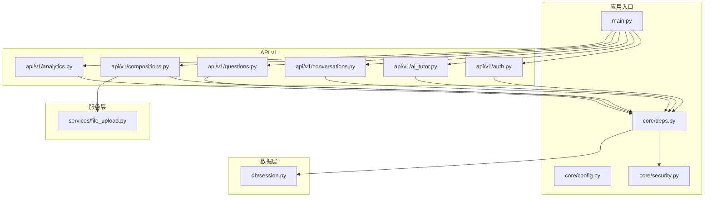
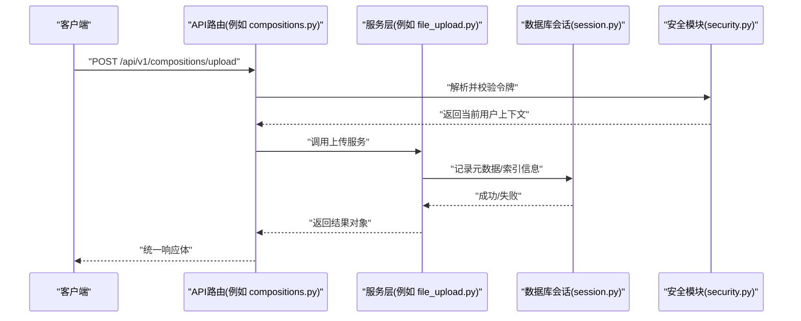
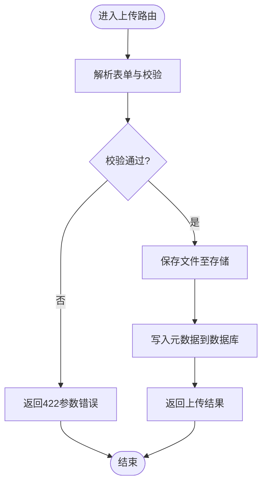
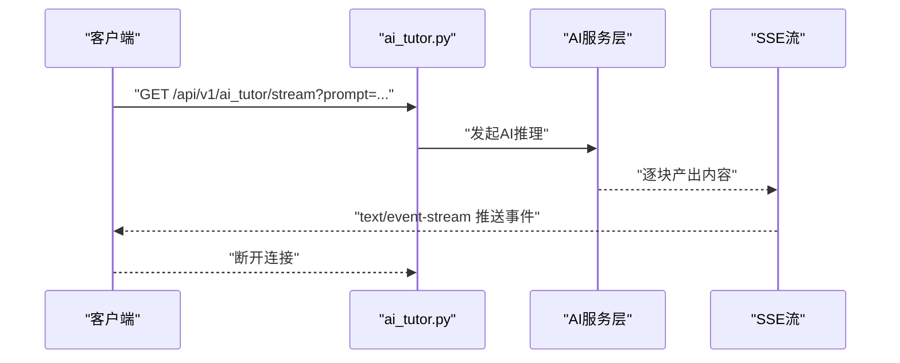
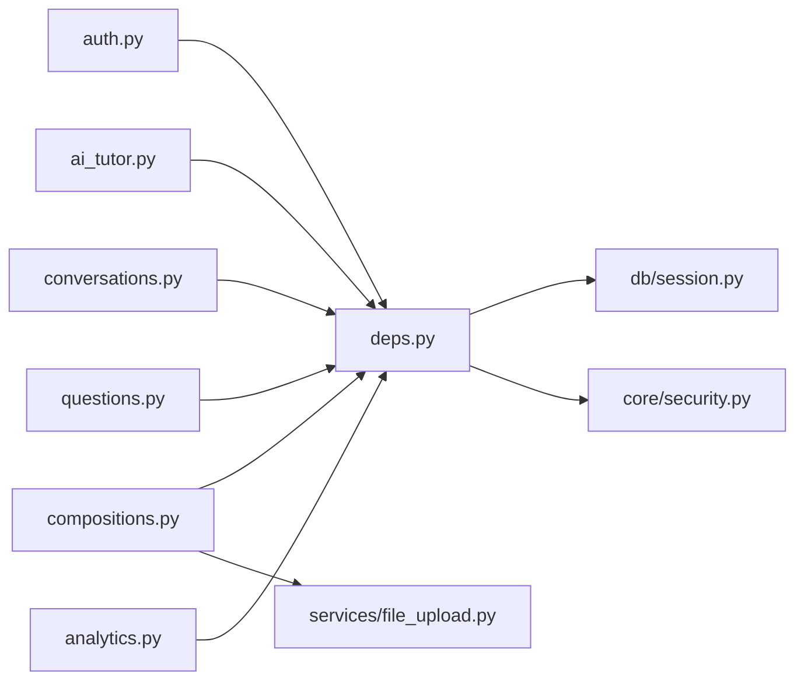

# API设计规范

<cite>
**本文引用的文件**   
- [backend/app/main.py](file://backend/app/main.py)
- [backend/app/core/config.py](file://backend/app/core/config.py)
- [backend/app/core/deps.py](file://backend/app/core/deps.py)
- [backend/app/core/security.py](file://backend/app/core/security.py)
- [backend/app/db/session.py](file://backend/app/db/session.py)
- [backend/app/api/v1/auth.py](file://backend/app/api/v1/auth.py)
- [backend/app/api/v1/ai_tutor.py](file://backend/app/api/v1/ai_tutor.py)
- [backend/app/api/v1/conversations.py](file://backend/app/api/v1/conversations.py)
- [backend/app/api/v1/compositions.py](file://backend/app/api/v1/compositions.py)
- [backend/app/api/v1/questions.py](file://backend/app/api/v1/questions.py)
- [backend/app/api/v1/analytics.py](file://backend/app/api/v1/analytics.py)
- [backend/app/services/file_upload.py](file://backend/app/services/file_upload.py)
- [backend/app/schemas/user.py](file://backend/app/schemas/user.py)
- [backend/app/schemas/ai.py](file://backend/app/schemas/ai.py)
</cite>

## 目录
1. [简介](#简介)
2. [项目结构](#项目结构)
3. [核心组件](#核心组件)
4. [架构总览](#架构总览)
5. [详细组件分析](#详细组件分析)
6. [依赖关系分析](#依赖关系分析)
7. [性能考虑](#性能考虑)
8. [故障排查指南](#故障排查指南)
9. [结论](#结论)
10. [附录](#附录)

## 简介
本规范面向AI助教系统的后端API设计，基于FastAPI框架，围绕RESTful原则、路由组织、请求响应格式、依赖注入、数据库会话管理、服务层集成、中间件注册、错误处理与统一响应、状态码定义、版本控制、权限验证、参数校验、分页查询、文件上传、实时通信（SSE）、文档自动生成、测试策略与性能优化等方面给出系统化指导。文档中的示例路径均指向仓库中具体实现位置，便于对照落地。

## 项目结构
后端采用分层与按功能域组织相结合的结构：
- 应用入口与全局配置：位于app目录下，包含主应用初始化、配置、依赖注入与安全模块
- API路由：按领域划分在api/v1下，每个路由文件对应一个业务域
- 数据模型与Schema：models用于ORM映射，schemas用于Pydantic请求/响应校验
- 服务层：services封装业务逻辑，agent与工具类集中管理AI相关能力
- 数据库：db提供会话管理与基础连接
- 任务：tasks用于异步任务（如Celery）

图表来源
- [backend/app/main.py](file://backend/app/main.py)
- [backend/app/core/config.py](file://backend/app/core/config.py)
- [backend/app/core/deps.py](file://backend/app/core/deps.py)
- [backend/app/core/security.py](file://backend/app/core/security.py)
- [backend/app/db/session.py](file://backend/app/db/session.py)
- [backend/app/api/v1/auth.py](file://backend/app/api/v1/auth.py)
- [backend/app/api/v1/ai_tutor.py](file://backend/app/api/v1/ai_tutor.py)
- [backend/app/api/v1/conversations.py](file://backend/app/api/v1/conversations.py)
- [backend/app/api/v1/compositions.py](file://backend/app/api/v1/compositions.py)
- [backend/app/api/v1/questions.py](file://backend/app/api/v1/questions.py)
- [backend/app/api/v1/analytics.py](file://backend/app/api/v1/analytics.py)
- [backend/app/services/file_upload.py](file://backend/app/services/file_upload.py)

章节来源
- [backend/app/main.py](file://backend/app/main.py)
- [backend/app/core/config.py](file://backend/app/core/config.py)
- [backend/app/core/deps.py](file://backend/app/core/deps.py)
- [backend/app/core/security.py](file://backend/app/core/security.py)
- [backend/app/db/session.py](file://backend/app/db/session.py)
- [backend/app/api/v1/auth.py](file://backend/app/api/v1/auth.py)
- [backend/app/api/v1/ai_tutor.py](file://backend/app/api/v1/ai_tutor.py)
- [backend/app/api/v1/conversations.py](file://backend/app/api/v1/conversations.py)
- [backend/app/api/v1/compositions.py](file://backend/app/api/v1/compositions.py)
- [backend/app/api/v1/questions.py](file://backend/app/api/v1/questions.py)
- [backend/app/api/v1/analytics.py](file://backend/app/api/v1/analytics.py)
- [backend/app/services/file_upload.py](file://backend/app/services/file_upload.py)

## 核心组件
- 应用入口与中间件
  - 应用实例创建、CORS、压缩、日志等中间件注册与挂载
  - 路由前缀与版本控制（v1）
  - 参考路径：[backend/app/main.py](file://backend/app/main.py)

- 配置中心
  - 环境变量加载、跨域白名单、JWT密钥、数据库URL等
  - 参考路径：[backend/app/core/config.py](file://backend/app/core/config.py)

- 依赖注入
  - 数据库会话工厂、当前用户解析、服务实例获取
  - 参考路径：[backend/app/core/deps.py](file://backend/app/core/deps.py)

- 安全与鉴权
  - JWT签发与校验、密码哈希、权限装饰器或依赖
  - 参考路径：[backend/app/core/security.py](file://backend/app/core/security.py)

- 数据库会话管理
  - 会话生命周期、事务边界、异常回滚
  - 参考路径：[backend/app/db/session.py](file://backend/app/db/session.py)

- 路由与领域接口
  - 认证、AI辅导、对话、作文、题目、分析等
  - 参考路径：
    - [backend/app/api/v1/auth.py](file://backend/app/api/v1/auth.py)
    - [backend/app/api/v1/ai_tutor.py](file://backend/app/api/v1/ai_tutor.py)
    - [backend/app/api/v1/conversations.py](file://backend/app/api/v1/conversations.py)
    - [backend/app/api/v1/compositions.py](file://backend/app/api/v1/compositions.py)
    - [backend/app/api/v1/questions.py](file://backend/app/api/v1/questions.py)
    - [backend/app/api/v1/analytics.py](file://backend/app/api/v1/analytics.py)

- 服务层
  - 文件上传、AI评分、RAG、口语评估等
  - 参考路径：[backend/app/services/file_upload.py](file://backend/app/services/file_upload.py)

- Schema校验
  - Pydantic模型用于入参与出参校验
  - 参考路径：
    - [backend/app/schemas/user.py](file://backend/app/schemas/user.py)
    - [backend/app/schemas/ai.py](file://backend/app/schemas/ai.py)

章节来源
- [backend/app/main.py](file://backend/app/main.py)
- [backend/app/core/config.py](file://backend/app/core/config.py)
- [backend/app/core/deps.py](file://backend/app/core/deps.py)
- [backend/app/core/security.py](file://backend/app/core/security.py)
- [backend/app/db/session.py](file://backend/app/db/session.py)
- [backend/app/api/v1/auth.py](file://backend/app/api/v1/auth.py)
- [backend/app/api/v1/ai_tutor.py](file://backend/app/api/v1/ai_tutor.py)
- [backend/app/api/v1/conversations.py](file://backend/app/api/v1/conversations.py)
- [backend/app/api/v1/compositions.py](file://backend/app/api/v1/compositions.py)
- [backend/app/api/v1/questions.py](file://backend/app/api/v1/questions.py)
- [backend/app/api/v1/analytics.py](file://backend/app/api/v1/analytics.py)
- [backend/app/services/file_upload.py](file://backend/app/services/file_upload.py)
- [backend/app/schemas/user.py](file://backend/app/schemas/user.py)
- [backend/app/schemas/ai.py](file://backend/app/schemas/ai.py)

## 架构总览
系统遵循“控制器-服务-仓储”的分层模式：
- 控制器（API路由）：负责HTTP协议适配、参数校验、调用服务层
- 服务层：封装业务逻辑，协调多个仓储或外部服务
- 数据访问：通过依赖注入的数据库会话进行持久化操作
- 安全与配置：贯穿各层的横切关注点

图表来源
- [backend/app/api/v1/compositions.py](file://backend/app/api/v1/compositions.py)
- [backend/app/services/file_upload.py](file://backend/app/services/file_upload.py)
- [backend/app/db/session.py](file://backend/app/db/session.py)
- [backend/app/core/security.py](file://backend/app/core/security.py)

## 详细组件分析

### RESTful API设计原则与路由组织
- 资源命名：使用名词复数形式，体现资源集合与单例
- HTTP方法语义：GET读取、POST创建、PUT完整更新、PATCH部分更新、DELETE删除
- 版本控制：统一前缀/api/v1，后续演进通过新增v2保持兼容
- 路由组织：按领域拆分文件，避免单体大路由；每个路由文件聚焦单一职责
- 参考路径：
  - [backend/app/api/v1/auth.py](file://backend/app/api/v1/auth.py)
  - [backend/app/api/v1/ai_tutor.py](file://backend/app/api/v1/ai_tutor.py)
  - [backend/app/api/v1/conversations.py](file://backend/app/api/v1/conversations.py)
  - [backend/app/api/v1/compositions.py](file://backend/app/api/v1/compositions.py)
  - [backend/app/api/v1/questions.py](file://backend/app/api/v1/questions.py)
  - [backend/app/api/v1/analytics.py](file://backend/app/api/v1/analytics.py)

章节来源
- [backend/app/api/v1/auth.py](file://backend/app/api/v1/auth.py)
- [backend/app/api/v1/ai_tutor.py](file://backend/app/api/v1/ai_tutor.py)
- [backend/app/api/v1/conversations.py](file://backend/app/api/v1/conversations.py)
- [backend/app/api/v1/compositions.py](file://backend/app/api/v1/compositions.py)
- [backend/app/api/v1/questions.py](file://backend/app/api/v1/questions.py)
- [backend/app/api/v1/analytics.py](file://backend/app/api/v1/analytics.py)

### 请求与响应格式规范
- 请求头：Content-Type、Authorization（Bearer Token）、Accept-Language（可选）
- 请求体：使用Pydantic Schema严格校验，缺失字段或类型不符返回422
- 响应体：统一包装{code, message, data}，其中code为业务码，message为可读提示，data为负载
- 分页：支持page、page_size或offset、limit参数，返回total、items
- 参考路径：
  - [backend/app/schemas/user.py](file://backend/app/schemas/user.py)
  - [backend/app/schemas/ai.py](file://backend/app/schemas/ai.py)

章节来源
- [backend/app/schemas/user.py](file://backend/app/schemas/user.py)
- [backend/app/schemas/ai.py](file://backend/app/schemas/ai.py)

### 依赖注入系统使用模式
- 数据库会话：通过依赖函数生成Session，并在请求结束时自动关闭
- 当前用户：从请求头解析JWT并注入到路由函数
- 服务实例：将服务层对象作为依赖注入，降低耦合
- 参考路径：
  - [backend/app/core/deps.py](file://backend/app/core/deps.py)
  - [backend/app/db/session.py](file://backend/app/db/session.py)
  - [backend/app/core/security.py](file://backend/app/core/security.py)

章节来源
- [backend/app/core/deps.py](file://backend/app/core/deps.py)
- [backend/app/db/session.py](file://backend/app/db/session.py)
- [backend/app/core/security.py](file://backend/app/core/security.py)

### 中间件注册与全局配置
- CORS：允许前端域名、方法与头部
- 压缩：对响应进行Gzip压缩
- 日志：结构化日志输出，便于追踪
- 参考路径：[backend/app/main.py](file://backend/app/main.py)

章节来源
- [backend/app/main.py](file://backend/app/main.py)

### 错误处理机制与统一响应
- 全局异常处理器：捕获未处理异常，转换为统一响应体
- 业务异常：自定义异常类携带业务码与消息
- 状态码：
  - 2xx：成功
  - 400：请求参数错误
  - 401：未认证
  - 403：无权限
  - 404：资源不存在
  - 422：参数校验失败
  - 500：服务器内部错误
- 参考路径：
  - [backend/app/main.py](file://backend/app/main.py)
  - [backend/app/core/security.py](file://backend/app/core/security.py)

章节来源
- [backend/app/main.py](file://backend/app/main.py)
- [backend/app/core/security.py](file://backend/app/core/security.py)

### 权限验证实现
- JWT令牌：登录成功后签发，客户端在后续请求携带
- 依赖注入：在每个需要鉴权的路由中注入当前用户
- 角色/权限：可在依赖中扩展检查用户角色或资源权限
- 参考路径：
  - [backend/app/core/security.py](file://backend/app/core/security.py)
  - [backend/app/core/deps.py](file://backend/app/core/deps.py)

章节来源
- [backend/app/core/security.py](file://backend/app/core/security.py)
- [backend/app/core/deps.py](file://backend/app/core/deps.py)

### 请求参数验证
- 使用Pydantic Schema定义请求体、查询参数、路径参数
- 内置校验规则：必填、长度、范围、正则表达式等
- 参考路径：
  - [backend/app/schemas/user.py](file://backend/app/schemas/user.py)
  - [backend/app/schemas/ai.py](file://backend/app/schemas/ai.py)

章节来源
- [backend/app/schemas/user.py](file://backend/app/schemas/user.py)
- [backend/app/schemas/ai.py](file://backend/app/schemas/ai.py)

### 分页查询最佳实践
- 查询参数：page、page_size或offset、limit
- 返回结构：包含total、items列表
- 适用场景：题目列表、作业列表、分析统计
- 参考路径：
  - [backend/app/api/v1/questions.py](file://backend/app/api/v1/questions.py)
  - [backend/app/api/v1/analytics.py](file://backend/app/api/v1/analytics.py)

章节来源
- [backend/app/api/v1/questions.py](file://backend/app/api/v1/questions.py)
- [backend/app/api/v1/analytics.py](file://backend/app/api/v1/analytics.py)

### 文件上传最佳实践
- 端点：POST /api/v1/compositions/upload
- 表单字段：file、metadata（JSON）
- 存储策略：本地磁盘或对象存储，记录元数据与索引
- 参考路径：
  - [backend/app/api/v1/compositions.py](file://backend/app/api/v1/compositions.py)
  - [backend/app/services/file_upload.py](file://backend/app/services/file_upload.py)

章节来源
- [backend/app/api/v1/compositions.py](file://backend/app/api/v1/compositions.py)
- [backend/app/services/file_upload.py](file://backend/app/services/file_upload.py)

### 实时通信（SSE）实现方式
- 端点：GET /api/v1/ai_tutor/stream
- 事件流：以文本流形式推送增量内容
- 客户端：使用EventSource或fetch流式读取
- 参考路径：
  - [backend/app/api/v1/ai_tutor.py](file://backend/app/api/v1/ai_tutor.py)

章节来源
- [backend/app/api/v1/ai_tutor.py](file://backend/app/api/v1/ai_tutor.py)

### API版本控制策略
- 前缀策略：/api/v1、/api/v2
- 兼容性：新版本不破坏旧版契约，逐步迁移
- 废弃通知：通过响应头或文档标注弃用时间线
- 参考路径：
  - [backend/app/main.py](file://backend/app/main.py)

章节来源
- [backend/app/main.py](file://backend/app/main.py)

### 代码级流程图：文件上传

图表来源
- [backend/app/api/v1/compositions.py](file://backend/app/api/v1/compositions.py)
- [backend/app/services/file_upload.py](file://backend/app/services/file_upload.py)
- [backend/app/db/session.py](file://backend/app/db/session.py)

### 代码级时序图：AI辅导流式响应

图表来源
- [backend/app/api/v1/ai_tutor.py](file://backend/app/api/v1/ai_tutor.py)

## 依赖关系分析
- 低耦合高内聚：路由仅负责协议适配，业务逻辑下沉至服务层
- 依赖注入：通过deps统一管理数据库会话、安全上下文与服务实例
- 外部依赖：数据库、对象存储、AI推理服务

图表来源
- [backend/app/api/v1/auth.py](file://backend/app/api/v1/auth.py)
- [backend/app/api/v1/ai_tutor.py](file://backend/app/api/v1/ai_tutor.py)
- [backend/app/api/v1/conversations.py](file://backend/app/api/v1/conversations.py)
- [backend/app/api/v1/compositions.py](file://backend/app/api/v1/compositions.py)
- [backend/app/api/v1/questions.py](file://backend/app/api/v1/questions.py)
- [backend/app/api/v1/analytics.py](file://backend/app/api/v1/analytics.py)
- [backend/app/core/deps.py](file://backend/app/core/deps.py)
- [backend/app/db/session.py](file://backend/app/db/session.py)
- [backend/app/core/security.py](file://backend/app/core/security.py)
- [backend/app/services/file_upload.py](file://backend/app/services/file_upload.py)

章节来源
- [backend/app/api/v1/auth.py](file://backend/app/api/v1/auth.py)
- [backend/app/api/v1/ai_tutor.py](file://backend/app/api/v1/ai_tutor.py)
- [backend/app/api/v1/conversations.py](file://backend/app/api/v1/conversations.py)
- [backend/app/api/v1/compositions.py](file://backend/app/api/v1/compositions.py)
- [backend/app/api/v1/questions.py](file://backend/app/api/v1/questions.py)
- [backend/app/api/v1/analytics.py](file://backend/app/api/v1/analytics.py)
- [backend/app/core/deps.py](file://backend/app/core/deps.py)
- [backend/app/db/session.py](file://backend/app/db/session.py)
- [backend/app/core/security.py](file://backend/app/core/security.py)
- [backend/app/services/file_upload.py](file://backend/app/services/file_upload.py)

## 性能考虑
- 数据库
  - 合理使用索引，避免N+1查询
  - 分页与选择性字段返回
- 网络
  - 启用响应压缩
  - 合理设置超时与重试
- 缓存
  - 热点数据缓存（Redis）
  - 静态资源CDN
- 并发
  - SSE流式传输减少首字节延迟
  - 异步IO提升吞吐
- 参考路径：
  - [backend/app/main.py](file://backend/app/main.py)
  - [backend/app/api/v1/ai_tutor.py](file://backend/app/api/v1/ai_tutor.py)

章节来源
- [backend/app/main.py](file://backend/app/main.py)
- [backend/app/api/v1/ai_tutor.py](file://backend/app/api/v1/ai_tutor.py)

## 故障排查指南
- 常见问题
  - 401/403：检查JWT签名、过期时间与权限策略
  - 422：核对Pydantic Schema与请求体字段
  - 500：查看服务端日志与异常堆栈
- 定位手段
  - 开启结构化日志，记录请求ID
  - 使用OpenAPI文档快速验证接口契约
- 参考路径：
  - [backend/app/core/security.py](file://backend/app/core/security.py)
  - [backend/app/main.py](file://backend/app/main.py)

章节来源
- [backend/app/core/security.py](file://backend/app/core/security.py)
- [backend/app/main.py](file://backend/app/main.py)

## 结论
本规范围绕FastAPI的最佳实践，结合AI助教系统的实际代码结构，给出了从路由组织、依赖注入、错误处理、权限验证、参数校验到分页、上传、SSE、文档与测试的系统性指导。建议团队在迭代中持续完善Schema与文档，强化测试覆盖与性能监控，确保API的可维护性与可扩展性。

## 附录
- OpenAPI文档自动生成
  - FastAPI默认提供/docs与/redoc
  - 可通过配置标题、描述、版本信息
  - 参考路径：[backend/app/main.py](file://backend/app/main.py)

- 测试策略
  - 单元测试：针对服务层与工具函数
  - 集成测试：模拟数据库与外部依赖，验证端到端流程
  - 性能测试：压测关键接口与SSE流
  - 参考路径：
    - [backend/app/api/v1/compositions.py](file://backend/app/api/v1/compositions.py)
    - [backend/app/services/file_upload.py](file://backend/app/services/file_upload.py)

章节来源
- [backend/app/main.py](file://backend/app/main.py)
- [backend/app/api/v1/compositions.py](file://backend/app/api/v1/compositions.py)
- [backend/app/services/file_upload.py](file://backend/app/services/file_upload.py)