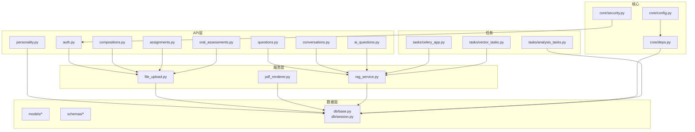
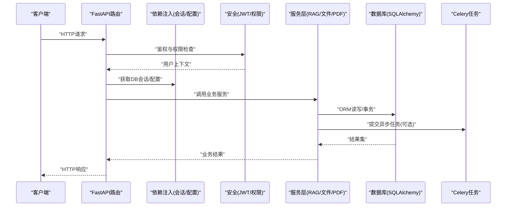
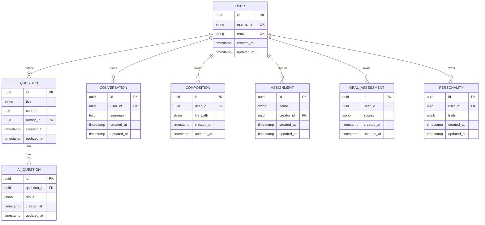
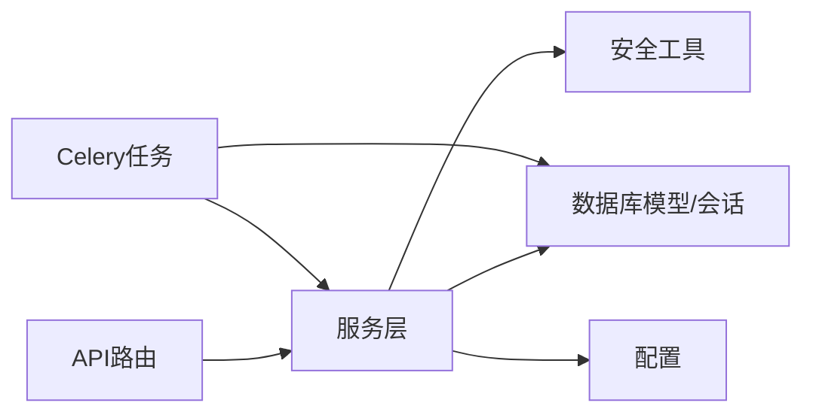

# 后端开发指南

<cite>
**本文引用的文件**   
- [backend/app/utils/main.py](file://backend/app/utils/main.py)
- [backend/app/core/config.py](file://backend/app/core/config.py)
- [backend/app/core/deps.py](file://backend/app/core/deps.py)
- [backend/app/core/security.py](file://backend/app/core/security.py)
- [backend/app/db/base.py](file://backend/app/db/base.py)
- [backend/app/db/session.py](file://backend/app/db/session.py)
- [backend/alembic.ini](file://backend/alembic.ini)
- [backend/alembic/env.py](file://backend/alembic/env.py)
- [backend/alembic/script.py.mako](file://backend/alembic/script.py.mako)
- [backend/app/models/user.py](file://backend/app/models/user.py)
- [backend/app/models/question.py](file://backend/app/models/question.py)
- [backend/app/models/conversation.py](file://backend/app/models/conversation.py)
- [backend/app/models/composition.py](file://backend/app/models/composition.py)
- [backend/app/models/assignment.py](file://backend/app/models/assignment.py)
- [backend/app/models/oral_assessment.py](file://backend/app/models/oral_assessment.py)
- [backend/app/models/personality.py](file://backend/app/models/personality.py)
- [backend/app/models/ai_question.py](file://backend/app/models/ai_question.py)
- [backend/app/schemas/user.py](file://backend/app/schemas/user.py)
- [backend/app/schemas/question.py](file://backend/app/schemas/question.py)
- [backend/app/schemas/conversation.py](file://backend/app/schemas/conversation.py)
- [backend/app/schemas/composition.py](file://backend/app/schemas/composition.py)
- [backend/app/schemas/assignment.py](file://backend/app/schemas/assignment.py)
- [backend/app/schemas/oral_assessment.py](file://backend/app/schemas/oral_assessment.py)
- [backend/app/schemas/personality.py](file://backend/app/schemas/personality.py)
- [backend/app/schemas/ai.py](file://backend/app/schemas/ai.py)
- [backend/app/api/v1/auth.py](file://backend/app/api/v1/auth.py)
- [backend/app/api/v1/questions.py](file://backend/app/api/v1/questions.py)
- [backend/app/api/v1/conversations.py](file://backend/app/api/v1/conversations.py)
- [backend/app/api/v1/compositions.py](file://backend/app/api/v1/compositions.py)
- [backend/app/api/v1/assignments.py](file://backend/app/api/v1/assignments.py)
- [backend/app/api/v1/oral_assessments.py](file://backend/app/api/v1/oral_assessments.py)
- [backend/app/api/v1/personality.py](file://backend/app/api/v1/personality.py)
- [backend/app/api/v1/ai_questions.py](file://backend/app/api/v1/ai_questions.py)
- [backend/app/services/file_upload.py](file://backend/app/services/file_upload.py)
- [backend/app/services/pdf_renderer.py](file://backend/app/services/pdf_renderer.py)
- [backend/app/services/rag_service.py](file://backend/app/services/rag_service.py)
- [backend/app/tasks/celery_app.py](file://backend/app/tasks/celery_app.py)
- [backend/app/tasks/vector_tasks.py](file://backend/app/tasks/vector_tasks.py)
- [backend/app/tasks/analysis_tasks.py](file://backend/app/tasks/analysis_tasks.py)
</cite>

## 目录
1. [简介](#简介)
2. [项目结构](#项目结构)
3. [核心组件](#核心组件)
4. [架构总览](#架构总览)
5. [详细组件分析](#详细组件分析)
6. [依赖关系分析](#依赖关系分析)
7. [性能考虑](#性能考虑)
8. [故障排查指南](#故障排查指南)
9. [结论](#结论)
10. [附录](#附录)

## 简介
本指南面向AI助教系统后端的开发与维护，围绕FastAPI应用、依赖注入、中间件与异常处理、数据库设计与SQLAlchemy ORM最佳实践、安全认证（JWT、权限控制、密码加密）、配置与环境变量管理、异步任务（Celery）、文件上传下载、PDF渲染、向量检索集成、API规范与错误码、日志策略、Alembic迁移、测试策略与性能调优进行系统化说明。文档以仓库现有实现为依据，提供可操作的实践建议与可视化图示，帮助读者快速理解并高效扩展系统。

## 项目结构
后端采用分层与按功能域组织相结合的结构：
- API层：按业务域划分路由模块，统一在v1版本下暴露REST接口
- 服务层：封装领域逻辑与外部服务调用（如RAG、PDF渲染、文件上传）
- 数据模型层：使用SQLAlchemy定义ORM模型
- 模式层：Pydantic Schema用于请求/响应校验与序列化
- 基础设施层：配置、依赖注入、数据库会话与安全工具
- 任务层：基于Celery的异步任务（分析、向量化等）
- 迁移层：Alembic管理数据库变更

图表来源
- [backend/app/api/v1/auth.py](file://backend/app/api/v1/auth.py)
- [backend/app/api/v1/questions.py](file://backend/app/api/v1/questions.py)
- [backend/app/api/v1/conversations.py](file://backend/app/api/v1/conversations.py)
- [backend/app/api/v1/compositions.py](file://backend/app/api/v1/compositions.py)
- [backend/app/api/v1/assignments.py](file://backend/app/api/v1/assignments.py)
- [backend/app/api/v1/oral_assessments.py](file://backend/app/api/v1/oral_assessments.py)
- [backend/app/api/v1/personality.py](file://backend/app/api/v1/personality.py)
- [backend/app/api/v1/ai_questions.py](file://backend/app/api/v1/ai_questions.py)
- [backend/app/services/file_upload.py](file://backend/app/services/file_upload.py)
- [backend/app/services/pdf_renderer.py](file://backend/app/services/pdf_renderer.py)
- [backend/app/services/rag_service.py](file://backend/app/services/rag_service.py)
- [backend/app/db/base.py](file://backend/app/db/base.py)
- [backend/app/db/session.py](file://backend/app/db/session.py)
- [backend/app/core/config.py](file://backend/app/core/config.py)
- [backend/app/core/deps.py](file://backend/app/core/deps.py)
- [backend/app/core/security.py](file://backend/app/core/security.py)
- [backend/app/tasks/celery_app.py](file://backend/app/tasks/celery_app.py)
- [backend/app/tasks/vector_tasks.py](file://backend/app/tasks/vector_tasks.py)
- [backend/app/tasks/analysis_tasks.py](file://backend/app/tasks/analysis_tasks.py)

章节来源
- [backend/app/utils/main.py](file://backend/app/utils/main.py)
- [backend/app/core/config.py](file://backend/app/core/config.py)
- [backend/app/core/deps.py](file://backend/app/core/deps.py)
- [backend/app/core/security.py](file://backend/app/core/security.py)
- [backend/app/db/base.py](file://backend/app/db/base.py)
- [backend/app/db/session.py](file://backend/app/db/session.py)
- [backend/alembic.ini](file://backend/alembic.ini)
- [backend/alembic/env.py](file://backend/alembic/env.py)
- [backend/alembic/script.py.mako](file://backend/alembic/script.py.mako)

## 核心组件
- 应用入口与生命周期
  - FastAPI应用初始化、中间件注册、异常处理器挂载、路由聚合通常在应用启动脚本中完成
  - 建议在启动时加载配置、初始化日志、连接池与外部服务客户端
- 配置与环境变量
  - 集中式配置类负责读取环境变量、提供默认值与类型转换
  - 敏感信息通过环境变量注入，避免硬编码
- 依赖注入
  - 通过FastAPI的Depends机制提供数据库会话、用户上下文、配置对象等
  - 将服务实例化与资源获取下沉到依赖函数，便于测试替换
- 安全认证
  - JWT令牌签发与验证、密码哈希与校验、访问控制装饰器或依赖
- 数据库会话与事务
  - 会话工厂与依赖提供器确保每个请求拥有独立会话
  - 显式事务边界管理，保证一致性
- 任务队列
  - Celery应用初始化、任务注册、重试与幂等设计
- 文件与PDF
  - 文件上传存储策略、路径管理与清理
  - PDF渲染流程与资源释放
- RAG与向量检索
  - 文本分块、嵌入生成、索引更新与查询

章节来源
- [backend/app/utils/main.py](file://backend/app/utils/main.py)
- [backend/app/core/config.py](file://backend/app/core/config.py)
- [backend/app/core/deps.py](file://backend/app/core/deps.py)
- [backend/app/core/security.py](file://backend/app/core/security.py)
- [backend/app/db/base.py](file://backend/app/db/base.py)
- [backend/app/db/session.py](file://backend/app/db/session.py)
- [backend/app/tasks/celery_app.py](file://backend/app/tasks/celery_app.py)
- [backend/app/services/file_upload.py](file://backend/app/services/file_upload.py)
- [backend/app/services/pdf_renderer.py](file://backend/app/services/pdf_renderer.py)
- [backend/app/services/rag_service.py](file://backend/app/services/rag_service.py)

## 架构总览
下图展示了从HTTP请求到数据库与外部服务的整体交互路径，包括认证、依赖注入、服务层、ORM与任务队列。

图表来源
- [backend/app/api/v1/auth.py](file://backend/app/api/v1/auth.py)
- [backend/app/api/v1/questions.py](file://backend/app/api/v1/questions.py)
- [backend/app/api/v1/conversations.py](file://backend/app/api/v1/conversations.py)
- [backend/app/api/v1/compositions.py](file://backend/app/api/v1/compositions.py)
- [backend/app/api/v1/assignments.py](file://backend/app/api/v1/assignments.py)
- [backend/app/api/v1/oral_assessments.py](file://backend/app/api/v1/oral_assessments.py)
- [backend/app/api/v1/personality.py](file://backend/app/api/v1/personality.py)
- [backend/app/api/v1/ai_questions.py](file://backend/app/api/v1/ai_questions.py)
- [backend/app/core/deps.py](file://backend/app/core/deps.py)
- [backend/app/core/security.py](file://backend/app/core/security.py)
- [backend/app/services/rag_service.py](file://backend/app/services/rag_service.py)
- [backend/app/services/file_upload.py](file://backend/app/services/file_upload.py)
- [backend/app/services/pdf_renderer.py](file://backend/app/services/pdf_renderer.py)
- [backend/app/db/session.py](file://backend/app/db/session.py)
- [backend/app/tasks/celery_app.py](file://backend/app/tasks/celery_app.py)

## 详细组件分析

### 配置与环境变量管理
- 目标
  - 统一管理运行时配置，支持多环境切换
  - 提供类型安全的配置访问与默认值
- 关键要点
  - 集中读取环境变量，提供结构化配置对象
  - 对敏感字段（密钥、URL）进行严格校验
  - 为不同环境（开发/测试/生产）提供覆盖策略
- 推荐实践
  - 使用命名空间前缀区分配置项
  - 记录配置加载失败时的回退策略与告警
  - 在单元测试中通过覆盖配置对象进行隔离

章节来源
- [backend/app/core/config.py](file://backend/app/core/config.py)

### 依赖注入系统
- 目标
  - 解耦资源创建与业务逻辑，提升可测试性
- 关键要点
  - 使用Depends提供数据库会话、配置、用户上下文
  - 在服务层通过参数注入依赖，避免全局状态
- 推荐实践
  - 为每个请求创建独立会话并在请求结束时关闭
  - 对外部服务（如向量库、对象存储）提供Mock以便测试

章节来源
- [backend/app/core/deps.py](file://backend/app/core/deps.py)

### 安全认证与授权
- 目标
  - 实现无状态身份认证与细粒度权限控制
- 关键要点
  - JWT令牌签发与验签、过期时间、刷新策略
  - 密码哈希算法选择与盐值管理
  - 基于角色或资源的访问控制
- 推荐实践
  - 短生命周期访问令牌+长生命周期刷新令牌
  - 敏感操作二次确认与审计日志
  - 白名单与黑名单机制结合

章节来源
- [backend/app/core/security.py](file://backend/app/core/security.py)
- [backend/app/api/v1/auth.py](file://backend/app/api/v1/auth.py)

### 数据库设计与SQLAlchemy ORM最佳实践
- 目标
  - 构建可扩展、高性能的数据访问层
- 关键要点
  - 模型定义与关系映射、索引与约束
  - 连接池配置、会话生命周期与事务边界
  - 查询优化：分页、选择性字段、预加载关联
- 推荐实践
  - 使用基类统一审计字段（创建/更新时间）
  - 显式事务包裹复杂写操作，失败回滚
  - 批量写入与惰性加载结合，避免N+1问题

章节来源
- [backend/app/db/base.py](file://backend/app/db/base.py)
- [backend/app/db/session.py](file://backend/app/db/session.py)
- [backend/app/models/user.py](file://backend/app/models/user.py)
- [backend/app/models/question.py](file://backend/app/models/question.py)
- [backend/app/models/conversation.py](file://backend/app/models/conversation.py)
- [backend/app/models/composition.py](file://backend/app/models/composition.py)
- [backend/app/models/assignment.py](file://backend/app/models/assignment.py)
- [backend/app/models/oral_assessment.py](file://backend/app/models/oral_assessment.py)
- [backend/app/models/personality.py](file://backend/app/models/personality.py)
- [backend/app/models/ai_question.py](file://backend/app/models/ai_question.py)

#### 数据模型关系图

图表来源
- [backend/app/models/user.py](file://backend/app/models/user.py)
- [backend/app/models/question.py](file://backend/app/models/question.py)
- [backend/app/models/conversation.py](file://backend/app/models/conversation.py)
- [backend/app/models/composition.py](file://backend/app/models/composition.py)
- [backend/app/models/assignment.py](file://backend/app/models/assignment.py)
- [backend/app/models/oral_assessment.py](file://backend/app/models/oral_assessment.py)
- [backend/app/models/personality.py](file://backend/app/models/personality.py)
- [backend/app/models/ai_question.py](file://backend/app/models/ai_question.py)

### 文件上传与PDF渲染
- 目标
  - 安全地接收与存储用户上传的文件，并提供PDF渲染能力
- 关键要点
  - 文件类型与大小限制、路径规范化与防穿越
  - 流式处理与临时文件清理
  - PDF渲染的资源占用与并发控制
- 推荐实践
  - 使用唯一文件名与目录归档策略
  - 异步任务执行耗时渲染，返回任务ID供前端轮询
  - 设置合理的超时与内存上限

章节来源
- [backend/app/services/file_upload.py](file://backend/app/services/file_upload.py)
- [backend/app/services/pdf_renderer.py](file://backend/app/services/pdf_renderer.py)

### RAG与向量检索集成
- 目标
  - 将知识内容向量化并支持语义检索，辅助AI问答与解析
- 关键要点
  - 文本预处理与分块策略
  - 嵌入模型选择与缓存
  - 向量索引的增量更新与查询优化
- 推荐实践
  - 任务队列驱动索引重建，避免阻塞请求
  - 查询去重与结果融合，提升相关性
  - 监控索引规模与查询延迟

章节来源
- [backend/app/services/rag_service.py](file://backend/app/services/rag_service.py)
- [backend/app/tasks/vector_tasks.py](file://backend/app/tasks/vector_tasks.py)

### 异步任务处理（Celery）
- 目标
  - 将耗时操作移出请求链路，提高吞吐与稳定性
- 关键要点
  - Celery应用初始化、任务注册与路由
  - 任务幂等、重试与死信队列
  - 与RAG、分析任务的协作
- 推荐实践
  - 为任务添加唯一键以避免重复执行
  - 记录任务执行轨迹与指标
  - 合理设置并发度与资源配额

章节来源
- [backend/app/tasks/celery_app.py](file://backend/app/tasks/celery_app.py)
- [backend/app/tasks/vector_tasks.py](file://backend/app/tasks/vector_tasks.py)
- [backend/app/tasks/analysis_tasks.py](file://backend/app/tasks/analysis_tasks.py)

### API设计规范与错误码
- 目标
  - 统一的接口风格与错误响应格式，提升前后端协作效率
- 关键要点
  - RESTful资源命名、HTTP方法与状态码约定
  - 请求/响应Schema使用Pydantic进行强校验
  - 错误码分类：业务错误、系统错误、第三方错误
- 推荐实践
  - 统一错误包装体，包含code、message、details
  - 分页参数标准化（page、size、sort）
  - 版本化API（/api/v1）

章节来源
- [backend/app/api/v1/auth.py](file://backend/app/api/v1/auth.py)
- [backend/app/api/v1/questions.py](file://backend/app/api/v1/questions.py)
- [backend/app/api/v1/conversations.py](file://backend/app/api/v1/conversations.py)
- [backend/app/api/v1/compositions.py](file://backend/app/api/v1/compositions.py)
- [backend/app/api/v1/assignments.py](file://backend/app/api/v1/assignments.py)
- [backend/app/api/v1/oral_assessments.py](file://backend/app/api/v1/oral_assessments.py)
- [backend/app/api/v1/personality.py](file://backend/app/api/v1/personality.py)
- [backend/app/api/v1/ai_questions.py](file://backend/app/api/v1/ai_questions.py)
- [backend/app/schemas/user.py](file://backend/app/schemas/user.py)
- [backend/app/schemas/question.py](file://backend/app/schemas/question.py)
- [backend/app/schemas/conversation.py](file://backend/app/schemas/conversation.py)
- [backend/app/schemas/composition.py](file://backend/app/schemas/composition.py)
- [backend/app/schemas/assignment.py](file://backend/app/schemas/assignment.py)
- [backend/app/schemas/oral_assessment.py](file://backend/app/schemas/oral_assessment.py)
- [backend/app/schemas/personality.py](file://backend/app/schemas/personality.py)
- [backend/app/schemas/ai.py](file://backend/app/schemas/ai.py)

### 日志记录策略
- 目标
  - 可观测性与问题定位，兼顾性能与隐私
- 关键要点
  - 结构化日志（JSON），包含请求ID、用户ID、耗时
  - 分级输出（DEBUG/INFO/WARN/ERROR）
  - 敏感字段脱敏与采样策略
- 推荐实践
  - 在中间件中注入请求追踪ID
  - 将慢查询与异常堆栈单独输出
  - 对接集中式日志平台

章节来源
- [backend/app/utils/main.py](file://backend/app/utils/main.py)

## 依赖关系分析
- 组件耦合
  - API层依赖服务层与依赖注入；服务层依赖数据库与会话；任务层依赖服务与数据库
- 外部依赖
  - 数据库驱动、向量库客户端、对象存储SDK、消息代理（Celery Broker）
- 循环依赖规避
  - 通过依赖注入与服务抽象降低直接导入耦合
- 接口契约
  - Pydantic Schema作为稳定契约，减少前后端联调成本

图表来源
- [backend/app/api/v1/auth.py](file://backend/app/api/v1/auth.py)
- [backend/app/api/v1/questions.py](file://backend/app/api/v1/questions.py)
- [backend/app/api/v1/conversations.py](file://backend/app/api/v1/conversations.py)
- [backend/app/api/v1/compositions.py](file://backend/app/api/v1/compositions.py)
- [backend/app/api/v1/assignments.py](file://backend/app/api/v1/assignments.py)
- [backend/app/api/v1/oral_assessments.py](file://backend/app/api/v1/oral_assessments.py)
- [backend/app/api/v1/personality.py](file://backend/app/api/v1/personality.py)
- [backend/app/api/v1/ai_questions.py](file://backend/app/api/v1/ai_questions.py)
- [backend/app/services/rag_service.py](file://backend/app/services/rag_service.py)
- [backend/app/services/file_upload.py](file://backend/app/services/file_upload.py)
- [backend/app/services/pdf_renderer.py](file://backend/app/services/pdf_renderer.py)
- [backend/app/db/session.py](file://backend/app/db/session.py)
- [backend/app/core/security.py](file://backend/app/core/security.py)
- [backend/app/core/config.py](file://backend/app/core/config.py)
- [backend/app/tasks/celery_app.py](file://backend/app/tasks/celery_app.py)

章节来源
- [backend/app/core/deps.py](file://backend/app/core/deps.py)
- [backend/app/core/config.py](file://backend/app/core/config.py)
- [backend/app/core/security.py](file://backend/app/core/security.py)
- [backend/app/db/session.py](file://backend/app/db/session.py)
- [backend/app/services/rag_service.py](file://backend/app/services/rag_service.py)
- [backend/app/tasks/celery_app.py](file://backend/app/tasks/celery_app.py)

## 性能考虑
- 数据库
  - 调整连接池大小与超时，避免连接耗尽
  - 使用索引与覆盖索引，减少全表扫描
  - 批量插入与UPSERT，减少往返次数
- 应用层
  - 启用Gunicorn/uwsgi多进程与事件循环优化
  - 缓存热点数据（Redis），缩短响应时间
  - 限流与熔断保护下游服务
- 任务队列
  - 根据CPU/IO特性调整worker并发
  - 任务拆分与并行化，避免长尾任务
- 文件与PDF
  - 流式传输与分片上传，降低内存峰值
  - PDF渲染限制并发与内存，必要时使用独立服务

[本节为通用性能指导，不直接分析具体文件]

## 故障排查指南
- 常见问题
  - 数据库连接失败：检查连接字符串、网络连通、凭据与SSL配置
  - JWT无效：核对签名密钥、过期时间与时钟同步
  - 任务堆积：检查Broker可用性、Worker数量与任务幂等
  - 文件上传失败：检查磁盘空间、权限与大小限制
- 诊断手段
  - 查看结构化日志中的错误码与堆栈
  - 使用请求ID追踪跨组件调用链
  - 监控数据库慢查询与连接池指标
- 恢复策略
  - 自动重试与降级开关
  - 死信队列与人工介入流程
  - 灰度发布与快速回滚

章节来源
- [backend/app/core/security.py](file://backend/app/core/security.py)
- [backend/app/tasks/celery_app.py](file://backend/app/tasks/celery_app.py)
- [backend/app/services/file_upload.py](file://backend/app/services/file_upload.py)
- [backend/app/db/session.py](file://backend/app/db/session.py)

## 结论
本指南基于仓库现有实现，梳理了AI助教系统后端的关键架构与最佳实践。通过清晰的依赖注入、严格的Schema校验、稳健的安全机制、高效的数据库与任务队列设计，系统具备良好的可扩展性与可维护性。建议在生产环境中完善监控与告警，持续优化查询与任务调度，保障高可用与低延迟。

[本节为总结性内容，不直接分析具体文件]

## 附录

### Alembic迁移管理
- 目标
  - 以版本化方式管理数据库结构变更，保证部署一致性
- 关键要点
  - 初始化与配置文件、模板脚本
  - 自动生成与手动编写迁移脚本
  - 升级与回滚策略
- 推荐实践
  - 迁移脚本幂等，避免破坏性操作
  - 大表变更分批执行，减少锁表时间
  - 在CI中执行迁移与兼容性检查

章节来源
- [backend/alembic.ini](file://backend/alembic.ini)
- [backend/alembic/env.py](file://backend/alembic/env.py)
- [backend/alembic/script.py.mako](file://backend/alembic/script.py.mako)

### 测试策略
- 目标
  - 保障代码质量与回归安全
- 关键要点
  - 单元测试：服务与工具函数
  - 集成测试：API路由与数据库交互
  - 端到端测试：关键业务流程
- 推荐实践
  - 使用TestClient与内存数据库
  - Mock外部依赖（向量库、对象存储）
  - 覆盖率阈值与门禁

[本节为通用测试指导，不直接分析具体文件]

### API示例清单（路径参考）
- 认证
  - [backend/app/api/v1/auth.py](file://backend/app/api/v1/auth.py)
- 题目与对话
  - [backend/app/api/v1/questions.py](file://backend/app/api/v1/questions.py)
  - [backend/app/api/v1/conversations.py](file://backend/app/api/v1/conversations.py)
- 作文与作业
  - [backend/app/api/v1/compositions.py](file://backend/app/api/v1/compositions.py)
  - [backend/app/api/v1/assignments.py](file://backend/app/api/v1/assignments.py)
- 口语评估与个性配置
  - [backend/app/api/v1/oral_assessments.py](file://backend/app/api/v1/oral_assessments.py)
  - [backend/app/api/v1/personality.py](file://backend/app/api/v1/personality.py)
- AI题目
  - [backend/app/api/v1/ai_questions.py](file://backend/app/api/v1/ai_questions.py)