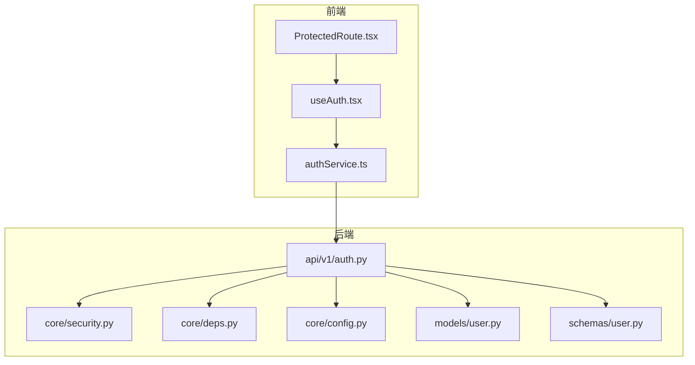
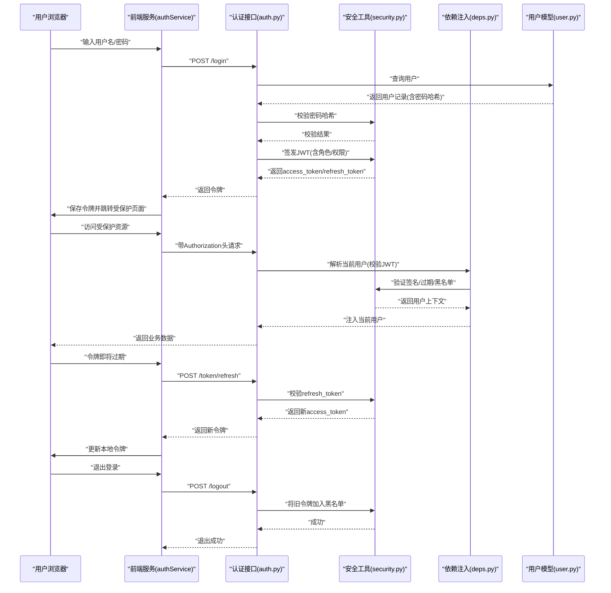
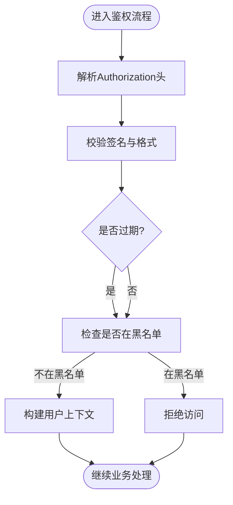
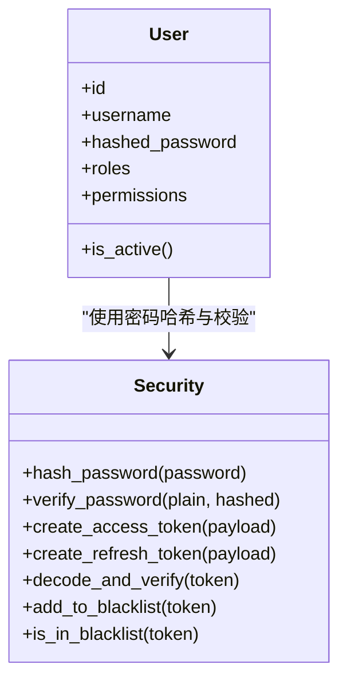
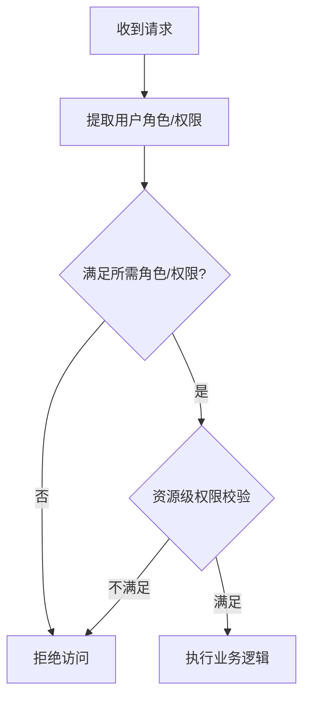
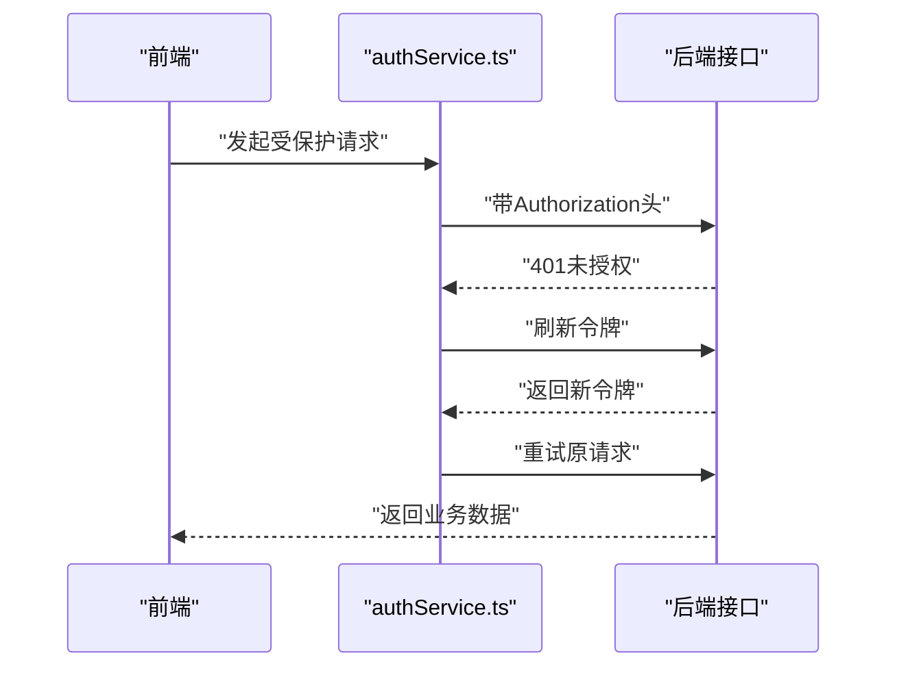
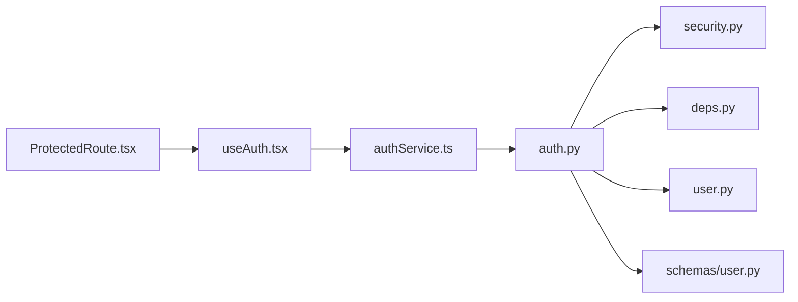

# 安全认证与授权

<cite>
**本文引用的文件**   
- [backend/app/core/security.py](file://backend/app/core/security.py)
- [backend/app/api/v1/auth.py](file://backend/app/api/v1/auth.py)
- [backend/app/models/user.py](file://backend/app/models/user.py)
- [backend/app/schemas/user.py](file://backend/app/schemas/user.py)
- [backend/app/core/deps.py](file://backend/app/core/deps.py)
- [backend/app/core/config.py](file://backend/app/core/config.py)
- [frontend/src/services/authService.ts](file://frontend/src/services/authService.ts)
- [frontend/src/hooks/useAuth.tsx](file://frontend/src/hooks/useAuth.tsx)
- [frontend/src/components/ProtectedRoute.tsx](file://frontend/src/components/ProtectedRoute.tsx)
</cite>

## 目录
1. [简介](#简介)
2. [项目结构](#项目结构)
3. [核心组件](#核心组件)
4. [架构总览](#架构总览)
5. [详细组件分析](#详细组件分析)
6. [依赖关系分析](#依赖关系分析)
7. [性能考虑](#性能考虑)
8. [故障排查指南](#故障排查指南)
9. [结论](#结论)
10. [附录](#附录)

## 简介
本技术文档聚焦AI助教系统的安全认证与授权实现，围绕以下主题展开：
- JWT令牌的生成、验证、刷新与撤销流程
- 用户密码加密存储、盐值处理与安全算法选择
- 基于角色的访问控制（RBAC）与细粒度权限校验
- 会话管理、CSRF防护、XSS防护、SQL注入防护等安全措施
- 安全配置最佳实践、敏感信息保护、日志审计策略
- 多租户安全隔离、API限流、异常安全处理

## 项目结构
后端采用分层架构，安全相关能力集中在core层与api层，前端通过服务与路由守卫配合完成鉴权体验。

图表来源
- [backend/app/api/v1/auth.py](file://backend/app/api/v1/auth.py)
- [backend/app/core/security.py](file://backend/app/core/security.py)
- [backend/app/core/deps.py](file://backend/app/core/deps.py)
- [backend/app/core/config.py](file://backend/app/core/config.py)
- [backend/app/models/user.py](file://backend/app/models/user.py)
- [backend/app/schemas/user.py](file://backend/app/schemas/user.py)
- [frontend/src/services/authService.ts](file://frontend/src/services/authService.ts)
- [frontend/src/hooks/useAuth.tsx](file://frontend/src/hooks/useAuth.tsx)
- [frontend/src/components/ProtectedRoute.tsx](file://frontend/src/components/ProtectedRoute.tsx)

章节来源
- [backend/app/api/v1/auth.py](file://backend/app/api/v1/auth.py)
- [backend/app/core/security.py](file://backend/app/core/security.py)
- [backend/app/core/deps.py](file://backend/app/core/deps.py)
- [backend/app/core/config.py](file://backend/app/core/config.py)
- [backend/app/models/user.py](file://backend/app/models/user.py)
- [backend/app/schemas/user.py](file://backend/app/schemas/user.py)
- [frontend/src/services/authService.ts](file://frontend/src/services/authService.ts)
- [frontend/src/hooks/useAuth.tsx](file://frontend/src/hooks/useAuth.tsx)
- [frontend/src/components/ProtectedRoute.tsx](file://frontend/src/components/ProtectedRoute.tsx)

## 核心组件
- 安全工具模块：负责JWT签发与校验、密码哈希与校验、令牌黑名单/撤销、时间戳与过期策略等。
- 认证接口：提供登录、注册、刷新令牌、退出（撤销）等端点。
- 依赖注入：提供当前用户解析、角色/权限校验的依赖项。
- 用户模型与Schema：定义用户实体字段、密码哈希字段、角色与权限集合、序列化规则。
- 前端认证服务与钩子：封装HTTP请求头携带令牌、刷新逻辑、错误处理；提供全局认证状态。
- 受保护路由：根据认证状态与权限进行页面级访问控制。

章节来源
- [backend/app/core/security.py](file://backend/app/core/security.py)
- [backend/app/api/v1/auth.py](file://backend/app/api/v1/auth.py)
- [backend/app/core/deps.py](file://backend/app/core/deps.py)
- [backend/app/models/user.py](file://backend/app/models/user.py)
- [backend/app/schemas/user.py](file://backend/app/schemas/user.py)
- [frontend/src/services/authService.ts](file://frontend/src/services/authService.ts)
- [frontend/src/hooks/useAuth.tsx](file://frontend/src/hooks/useAuth.tsx)
- [frontend/src/components/ProtectedRoute.tsx](file://frontend/src/components/ProtectedRoute.tsx)

## 架构总览
下图展示从前端到后端的认证与授权关键路径，包括登录、令牌校验、刷新与撤销。

图表来源
- [backend/app/api/v1/auth.py](file://backend/app/api/v1/auth.py)
- [backend/app/core/security.py](file://backend/app/core/security.py)
- [backend/app/core/deps.py](file://backend/app/core/deps.py)
- [backend/app/models/user.py](file://backend/app/models/user.py)
- [frontend/src/services/authService.ts](file://frontend/src/services/authService.ts)

## 详细组件分析

### JWT令牌机制
- 令牌生成
  - 使用安全工具模块签发access_token与refresh_token，载荷包含用户标识、角色与权限集合、签发时间与过期时间。
  - 建议为不同客户端或环境设置不同的密钥与受众，避免跨域复用。
- 令牌验证
  - 在依赖注入中统一解析Authorization头，调用安全工具校验签名、过期与黑名单状态。
  - 校验失败时返回未授权或令牌无效响应。
- 令牌刷新
  - 提供刷新端点，仅接受有效的refresh_token，签发新的access_token。
  - 支持一次性使用或滑动过期策略，防止重放攻击。
- 令牌撤销
  - 退出登录时将当前access_token加入黑名单，或在服务端维护会话失效列表。
  - 支持批量撤销（按用户或设备维度）。

图表来源
- [backend/app/core/security.py](file://backend/app/core/security.py)
- [backend/app/core/deps.py](file://backend/app/core/deps.py)

章节来源
- [backend/app/core/security.py](file://backend/app/core/security.py)
- [backend/app/core/deps.py](file://backend/app/core/deps.py)
- [backend/app/api/v1/auth.py](file://backend/app/api/v1/auth.py)

### 用户密码加密存储与盐值处理
- 算法选择
  - 推荐使用现代抗暴力破解算法（如bcrypt、argon2），内置随机盐值，避免手工拼接盐值。
- 存储规范
  - 仅存储哈希值，不存储明文或可逆密文。
  - 对敏感字段（如密码）在模型与Schema中明确标注不可序列化输出。
- 校验流程
  - 登录时读取数据库中的哈希值，交由安全工具进行比对，禁止自行比较字符串。

图表来源
- [backend/app/models/user.py](file://backend/app/models/user.py)
- [backend/app/core/security.py](file://backend/app/core/security.py)

章节来源
- [backend/app/models/user.py](file://backend/app/models/user.py)
- [backend/app/core/security.py](file://backend/app/core/security.py)

### 基于角色的访问控制（RBAC）与细粒度权限
- 角色与权限
  - 用户模型中包含角色集合与权限集合，可在JWT载荷中携带最小必要权限集。
- 中间件/依赖
  - 在依赖注入中提供“需要角色”和“需要权限”的装饰器或依赖项，用于快速声明式鉴权。
- 细粒度控制
  - 针对资源ID或操作类型进行二次校验，确保越权访问被拦截。

图表来源
- [backend/app/core/deps.py](file://backend/app/core/deps.py)
- [backend/app/models/user.py](file://backend/app/models/user.py)

章节来源
- [backend/app/core/deps.py](file://backend/app/core/deps.py)
- [backend/app/models/user.py](file://backend/app/models/user.py)

### 会话管理与CSRF/XSS/SQL注入防护
- 会话管理
  - 无状态JWT为主，必要时结合黑名单或短期会话表实现强制下线。
- CSRF防护
  - 若使用Cookie承载令牌，需启用SameSite、严格Referer校验与CSRF Token双重校验。
  - 纯Bearer方案下，避免将敏感操作暴露于GET，并对表单提交增加额外校验。
- XSS防护
  - 前端对用户输入进行转义与白名单过滤，后端对JSON响应禁用HTML内容类型。
- SQL注入防护
  - 使用ORM参数化查询，禁止拼接SQL字符串；对输入进行长度与类型校验。

章节来源
- [backend/app/core/security.py](file://backend/app/core/security.py)
- [backend/app/api/v1/auth.py](file://backend/app/api/v1/auth.py)
- [frontend/src/services/authService.ts](file://frontend/src/services/authService.ts)

### 安全配置与敏感信息保护
- 配置项
  - JWT密钥、算法、过期时间、黑名单存储位置、CORS允许源、日志级别等集中管理。
- 敏感信息
  - 使用环境变量或密钥管理服务注入，禁止硬编码；日志脱敏，避免打印令牌与密码。
- 传输安全
  - 全站HTTPS，启用HSTS；Cookie标记Secure与HttpOnly。

章节来源
- [backend/app/core/config.py](file://backend/app/core/config.py)
- [backend/app/core/security.py](file://backend/app/core/security.py)

### 前端认证集成
- 服务封装
  - 统一在请求头携带Authorization，自动重试刷新令牌，捕获401/403并引导重新登录。
- 全局状态
  - 提供useAuth钩子，暴露登录态、用户信息与权限，供组件消费。
- 路由守卫
  - ProtectedRoute根据认证与权限决定渲染目标页面或重定向。

图表来源
- [frontend/src/services/authService.ts](file://frontend/src/services/authService.ts)
- [frontend/src/hooks/useAuth.tsx](file://frontend/src/hooks/useAuth.tsx)
- [frontend/src/components/ProtectedRoute.tsx](file://frontend/src/components/ProtectedRoute.tsx)

章节来源
- [frontend/src/services/authService.ts](file://frontend/src/services/authService.ts)
- [frontend/src/hooks/useAuth.tsx](file://frontend/src/hooks/useAuth.tsx)
- [frontend/src/components/ProtectedRoute.tsx](file://frontend/src/components/ProtectedRoute.tsx)

## 依赖关系分析
- 模块耦合
  - auth.py依赖security.py与deps.py完成鉴权；user.py与schema.py提供数据契约。
- 外部依赖
  - 依赖数据库持久化（用户与黑名单）、缓存/存储（黑名单与刷新令牌）、消息队列（可选：异步审计）。
- 潜在循环
  - 保持core层不被业务层反向依赖，避免循环导入。

图表来源
- [backend/app/api/v1/auth.py](file://backend/app/api/v1/auth.py)
- [backend/app/core/security.py](file://backend/app/core/security.py)
- [backend/app/core/deps.py](file://backend/app/core/deps.py)
- [backend/app/models/user.py](file://backend/app/models/user.py)
- [backend/app/schemas/user.py](file://backend/app/schemas/user.py)
- [frontend/src/services/authService.ts](file://frontend/src/services/authService.ts)
- [frontend/src/hooks/useAuth.tsx](file://frontend/src/hooks/useAuth.tsx)
- [frontend/src/components/ProtectedRoute.tsx](file://frontend/src/components/ProtectedRoute.tsx)

章节来源
- [backend/app/api/v1/auth.py](file://backend/app/api/v1/auth.py)
- [backend/app/core/security.py](file://backend/app/core/security.py)
- [backend/app/core/deps.py](file://backend/app/core/deps.py)
- [backend/app/models/user.py](file://backend/app/models/user.py)
- [backend/app/schemas/user.py](file://backend/app/schemas/user.py)
- [frontend/src/services/authService.ts](file://frontend/src/services/authService.ts)
- [frontend/src/hooks/useAuth.tsx](file://frontend/src/hooks/useAuth.tsx)
- [frontend/src/components/ProtectedRoute.tsx](file://frontend/src/components/ProtectedRoute.tsx)

## 性能考虑
- 令牌校验开销
  - 优先使用对称算法或高性能非对称算法；对频繁校验的路径引入内存缓存（如最近黑名单条目）。
- 刷新令牌
  - 限制刷新频率与并发，避免风暴；支持滑动过期减少刷新次数。
- 密码哈希
  - 合理设置工作因子，平衡安全性与CPU占用；在高并发场景下考虑异步预处理或降级策略。
- 数据库查询
  - 用户查询走索引字段（用户名/邮箱），避免全表扫描。

[本节为通用指导，无需特定文件来源]

## 故障排查指南
- 常见错误
  - 401未授权：检查Authorization头格式、令牌是否过期、是否在黑名单。
  - 403禁止访问：检查角色/权限是否匹配，资源级权限是否满足。
  - 登录失败：确认密码哈希算法一致、用户是否存在且激活。
- 定位方法
  - 查看安全工具的日志输出（脱敏），核对签名校验与黑名单命中情况。
  - 检查依赖注入解析的用户上下文是否正确填充。
- 修复建议
  - 同步前后端时区与时间戳；统一JWT算法与密钥；完善黑名单存储的持久化与清理策略。

章节来源
- [backend/app/core/security.py](file://backend/app/core/security.py)
- [backend/app/core/deps.py](file://backend/app/core/deps.py)
- [backend/app/api/v1/auth.py](file://backend/app/api/v1/auth.py)

## 结论
本系统以JWT为核心，结合RBAC与细粒度权限校验，实现了端到端的认证与授权闭环。通过安全工具模块统一处理令牌生命周期与密码哈希，依赖注入简化了鉴权接入，前端服务与路由守卫提升了用户体验与安全性。后续可进一步引入更严格的刷新策略、设备指纹、动态权限与审计追踪，持续加固安全基线。

[本节为总结性内容，无需特定文件来源]

## 附录
- 安全配置清单
  - JWT密钥轮换策略、算法与过期时间
  - CORS白名单、Cookie安全属性
  - 日志脱敏与审计字段
  - 黑名单存储与清理周期
- 最佳实践
  - 最小权限原则、零信任理念
  - 输入校验与输出编码
  - 定期渗透测试与漏洞扫描

[本节为补充说明，无需特定文件来源]