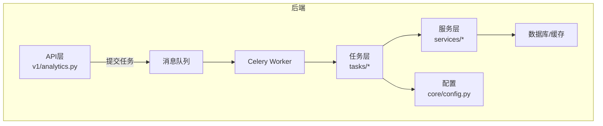
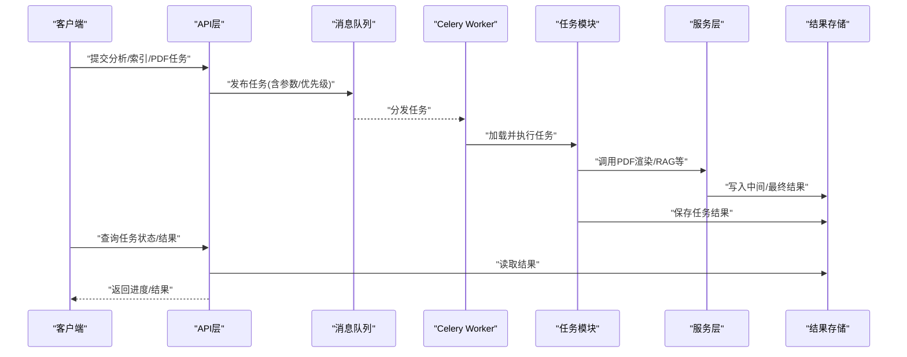
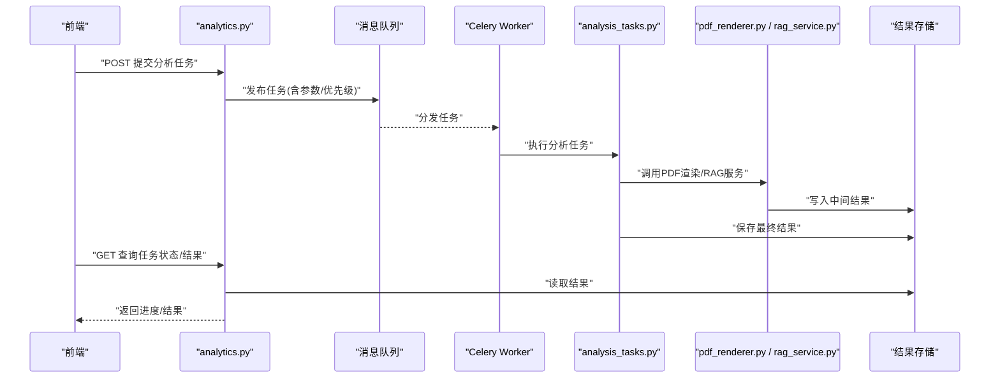
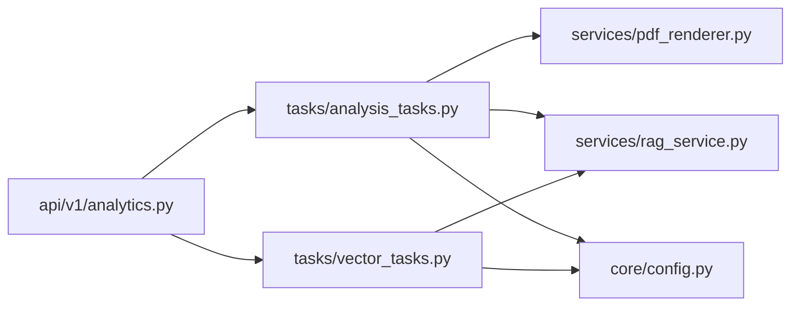
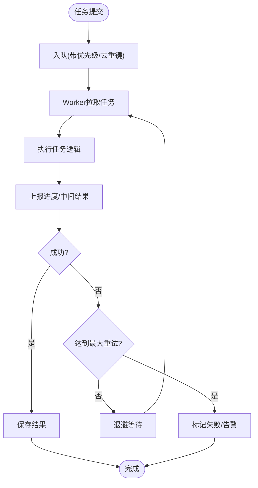

# 异步任务处理

<cite>
**本文引用的文件**   
- [backend/app/tasks/celery_app.py](file://backend/app/tasks/celery_app.py)
- [backend/app/tasks/analysis_tasks.py](file://backend/app/tasks/analysis_tasks.py)
- [backend/app/tasks/vector_tasks.py](file://backend/app/tasks/vector_tasks.py)
- [backend/app/tasks/dev_runner.py](file://backend/app/tasks/dev_runner.py)
- [backend/app/services/pdf_renderer.py](file://backend/app/services/pdf_renderer.py)
- [backend/app/services/rag_service.py](file://backend/app/services/rag_service.py)
- [backend/app/api/v1/analytics.py](file://backend/app/api/v1/analytics.py)
- [backend/app/core/config.py](file://backend/app/core/config.py)
</cite>

## 目录
1. [简介](#简介)
2. [项目结构](#项目结构)
3. [核心组件](#核心组件)
4. [架构总览](#架构总览)
5. [详细组件分析](#详细组件分析)
6. [依赖关系分析](#依赖关系分析)
7. [性能考虑](#性能考虑)
8. [故障排查指南](#故障排查指南)
9. [结论](#结论)
10. [附录](#附录)

## 简介
本指南面向AI助教系统的异步任务处理，聚焦于Celery任务队列的配置与使用。内容涵盖：
- 任务定义、调度策略、重试机制
- 执行流程、Worker配置、消息队列集成
- 长耗时任务模式（作业分析、向量索引构建、PDF渲染）
- 监控、日志、错误处理、性能调优
- 优先级管理、定时任务、分布式部署
- 结果存储、回调机制、进度跟踪实现

## 项目结构
后端采用分层组织，异步任务相关代码集中在 tasks 目录，服务层提供具体业务逻辑，API层负责触发任务并返回任务ID以便前端轮询或回调。

图表来源
- [backend/app/api/v1/analytics.py](file://backend/app/api/v1/analytics.py)
- [backend/app/tasks/celery_app.py](file://backend/app/tasks/celery_app.py)
- [backend/app/tasks/analysis_tasks.py](file://backend/app/tasks/analysis_tasks.py)
- [backend/app/tasks/vector_tasks.py](file://backend/app/tasks/vector_tasks.py)
- [backend/app/services/pdf_renderer.py](file://backend/app/services/pdf_renderer.py)
- [backend/app/services/rag_service.py](file://backend/app/services/rag_service.py)
- [backend/app/core/config.py](file://backend/app/core/config.py)

章节来源
- [backend/app/tasks/celery_app.py](file://backend/app/tasks/celery_app.py)
- [backend/app/tasks/analysis_tasks.py](file://backend/app/tasks/analysis_tasks.py)
- [backend/app/tasks/vector_tasks.py](file://backend/app/tasks/vector_tasks.py)
- [backend/app/tasks/dev_runner.py](file://backend/app/tasks/dev_runner.py)
- [backend/app/services/pdf_renderer.py](file://backend/app/services/pdf_renderer.py)
- [backend/app/services/rag_service.py](file://backend/app/services/rag_service.py)
- [backend/app/api/v1/analytics.py](file://backend/app/api/v1/analytics.py)
- [backend/app/core/config.py](file://backend/app/core/config.py)

## 核心组件
- Celery应用初始化与Broker/Backend配置：集中管理消息队列与结果后端连接参数，确保多环境一致性。
- 任务模块：按领域划分，如分析类任务、向量索引任务等，封装长耗时逻辑。
- 开发运行器：用于本地快速验证任务链路。
- 服务层：提供PDF渲染、RAG检索增强生成等可复用能力，供任务调用。
- API接口：接收请求后入队任务，返回任务ID，支持后续状态查询与结果获取。

章节来源
- [backend/app/tasks/celery_app.py](file://backend/app/tasks/celery_app.py)
- [backend/app/tasks/analysis_tasks.py](file://backend/app/tasks/analysis_tasks.py)
- [backend/app/tasks/vector_tasks.py](file://backend/app/tasks/vector_tasks.py)
- [backend/app/tasks/dev_runner.py](file://backend/app/tasks/dev_runner.py)
- [backend/app/services/pdf_renderer.py](file://backend/app/services/pdf_renderer.py)
- [backend/app/services/rag_service.py](file://backend/app/services/rag_service.py)
- [backend/app/api/v1/analytics.py](file://backend/app/api/v1/analytics.py)

## 架构总览
整体数据流从API触发任务开始，经由消息队列投递到Celery Worker，Worker消费任务并执行业务服务，最终将结果持久化并通过结果后端暴露给API查询。

图表来源
- [backend/app/api/v1/analytics.py](file://backend/app/api/v1/analytics.py)
- [backend/app/tasks/celery_app.py](file://backend/app/tasks/celery_app.py)
- [backend/app/tasks/analysis_tasks.py](file://backend/app/tasks/analysis_tasks.py)
- [backend/app/tasks/vector_tasks.py](file://backend/app/tasks/vector_tasks.py)
- [backend/app/services/pdf_renderer.py](file://backend/app/services/pdf_renderer.py)
- [backend/app/services/rag_service.py](file://backend/app/services/rag_service.py)

## 详细组件分析

### Celery应用与配置
- 职责：创建Celery实例，设置Broker URL、结果后端URL、序列化方式、时区、任务路由与并发策略等。
- 关键点：
  - Broker/Backend通过配置文件注入，便于切换Redis、RabbitMQ及不同结果存储。
  - 任务自动发现路径需包含所有任务模块。
  - 建议开启幂等性保护与任务去重键（基于输入指纹）。
  - 为长耗时任务设置超时与软超时，避免阻塞Worker。

章节来源
- [backend/app/tasks/celery_app.py](file://backend/app/tasks/celery_app.py)
- [backend/app/core/config.py](file://backend/app/core/config.py)

### 分析类任务（作业分析）
- 职责：对作业数据进行聚合、统计、画像生成等长耗时计算。
- 设计要点：
  - 分片处理：按学生/题目维度拆分子任务，提升并行度。
  - 进度上报：在关键阶段更新任务状态与进度百分比。
  - 失败重试：针对网络/外部依赖异常进行指数退避重试。
  - 结果落库：将分析结果持久化，并提供增量更新能力。

章节来源
- [backend/app/tasks/analysis_tasks.py](file://backend/app/tasks/analysis_tasks.py)
- [backend/app/api/v1/analytics.py](file://backend/app/api/v1/analytics.py)

### 向量索引任务（RAG索引构建）
- 职责：对文档/问答对进行向量化并构建索引，支撑检索增强生成。
- 设计要点：
  - 批处理：批量嵌入以减少模型调用开销。
  - 索引版本化：支持灰度切换与回滚。
  - 断点续建：记录已处理片段，避免重复工作。
  - 资源隔离：为高负载索引任务分配专用Worker池。

章节来源
- [backend/app/tasks/vector_tasks.py](file://backend/app/tasks/vector_tasks.py)
- [backend/app/services/rag_service.py](file://backend/app/services/rag_service.py)

### PDF渲染任务
- 职责：将结构化内容渲染为PDF，供下载或归档。
- 设计要点：
  - 模板与样式分离，便于维护。
  - 分页与内存控制，防止大文档导致OOM。
  - 失败重试与降级：当渲染引擎不可用时，返回占位或提示。

章节来源
- [backend/app/tasks/analysis_tasks.py](file://backend/app/tasks/analysis_tasks.py)
- [backend/app/services/pdf_renderer.py](file://backend/app/services/pdf_renderer.py)

### 开发运行器
- 职责：在本地快速验证任务链路，模拟Broker/Backend行为。
- 使用建议：
  - 仅用于开发调试，生产环境禁用。
  - 支持单步执行与断点调试。

章节来源
- [backend/app/tasks/dev_runner.py](file://backend/app/tasks/dev_runner.py)

### API触发与结果查询
- 职责：接收前端请求，入队任务并返回任务ID；提供状态与结果查询接口。
- 设计要点：
  - 幂等提交：相同输入不重复入队。
  - 进度查询：结合任务状态与自定义进度字段。
  - 结果过期策略：避免结果无限增长。

章节来源
- [backend/app/api/v1/analytics.py](file://backend/app/api/v1/analytics.py)

#### 序列图：分析任务端到端流程

图表来源
- [backend/app/api/v1/analytics.py](file://backend/app/api/v1/analytics.py)
- [backend/app/tasks/analysis_tasks.py](file://backend/app/tasks/analysis_tasks.py)
- [backend/app/services/pdf_renderer.py](file://backend/app/services/pdf_renderer.py)
- [backend/app/services/rag_service.py](file://backend/app/services/rag_service.py)

## 依赖关系分析
- 低耦合：API仅依赖任务入口与服务抽象，不直接持有Worker细节。
- 内聚性：任务模块按领域划分，服务层提供通用能力。
- 外部依赖：消息队列、结果后端、数据库/缓存、外部渲染/向量服务。

图表来源
- [backend/app/api/v1/analytics.py](file://backend/app/api/v1/analytics.py)
- [backend/app/tasks/analysis_tasks.py](file://backend/app/tasks/analysis_tasks.py)
- [backend/app/tasks/vector_tasks.py](file://backend/app/tasks/vector_tasks.py)
- [backend/app/services/pdf_renderer.py](file://backend/app/services/pdf_renderer.py)
- [backend/app/services/rag_service.py](file://backend/app/services/rag_service.py)
- [backend/app/core/config.py](file://backend/app/core/config.py)

章节来源
- [backend/app/api/v1/analytics.py](file://backend/app/api/v1/analytics.py)
- [backend/app/tasks/celery_app.py](file://backend/app/tasks/celery_app.py)
- [backend/app/core/config.py](file://backend/app/core/config.py)

## 性能考虑
- 并发与线程池：根据CPU/IO密集类型调整worker并发数与线程数，避免上下文切换过多。
- 任务拆分：将大任务拆分为多个小任务，提高吞吐与容错性。
- 批处理：向量嵌入、PDF渲染尽量批量操作，减少外部调用次数。
- 结果存储：合理设置TTL与清理策略，避免结果后端膨胀。
- 背压与限流：在高负载场景下限制入队速率，保障系统稳定。
- 监控指标：采集任务延迟、成功率、耗时分布、队列长度等指标。

[本节为通用指导，无需特定文件引用]

## 故障排查指南
- 常见问题定位：
  - 任务未执行：检查Broker连通性、Worker是否启动、任务路由是否正确。
  - 任务重复执行：确认幂等性与去重键策略。
  - 结果丢失：检查结果后端配置与TTL设置。
  - 渲染失败：查看渲染引擎日志与降级策略。
- 日志与追踪：
  - 统一日志格式，关联任务ID，便于跨进程追踪。
  - 关键步骤埋点，输出耗时与中间状态。
- 重试与补偿：
  - 区分可重试与不可重试异常，设置最大重试次数与退避策略。
  - 对部分失败的任务提供补偿任务或人工介入通道。

章节来源
- [backend/app/tasks/celery_app.py](file://backend/app/tasks/celery_app.py)
- [backend/app/tasks/analysis_tasks.py](file://backend/app/tasks/analysis_tasks.py)
- [backend/app/tasks/vector_tasks.py](file://backend/app/tasks/vector_tasks.py)
- [backend/app/services/pdf_renderer.py](file://backend/app/services/pdf_renderer.py)

## 结论
通过合理的任务拆分、重试与监控策略，结合消息队列与结果后端，AI助教系统能够稳定高效地处理长耗时任务。建议在开发与生产环境中分别配置不同的Worker规模与资源隔离方案，持续优化性能与可靠性。

[本节为总结性内容，无需特定文件引用]

## 附录

### 任务生命周期流程图

图表来源
- [backend/app/tasks/celery_app.py](file://backend/app/tasks/celery_app.py)
- [backend/app/tasks/analysis_tasks.py](file://backend/app/tasks/analysis_tasks.py)
- [backend/app/tasks/vector_tasks.py](file://backend/app/tasks/vector_tasks.py)

### 配置项速查
- Broker与结果后端：消息队列地址、认证信息、结果存储地址。
- 任务策略：默认重试次数、退避策略、超时时间、优先级队列。
- Worker参数：并发数、预取数量、内存上限、优雅关闭。
- 日志与监控：日志级别、采样率、指标上报目标。

章节来源
- [backend/app/core/config.py](file://backend/app/core/config.py)
- [backend/app/tasks/celery_app.py](file://backend/app/tasks/celery_app.py)