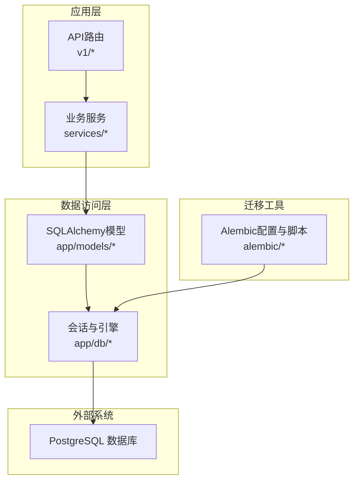
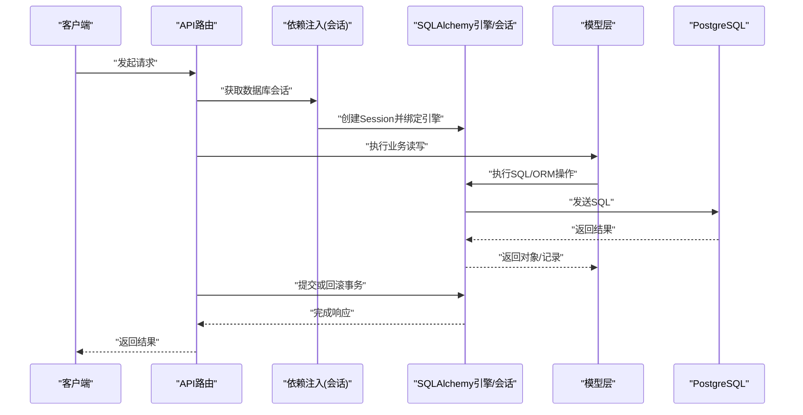
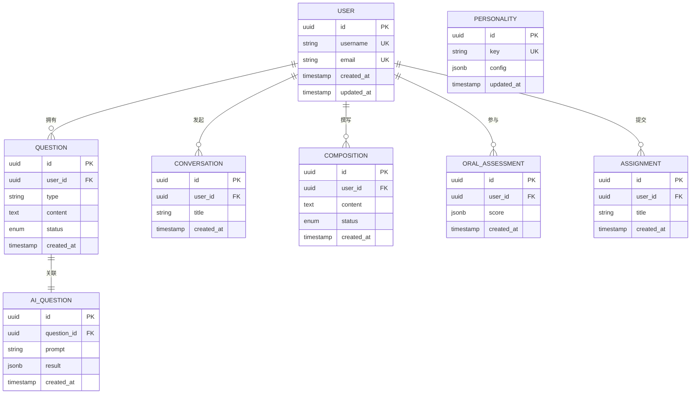
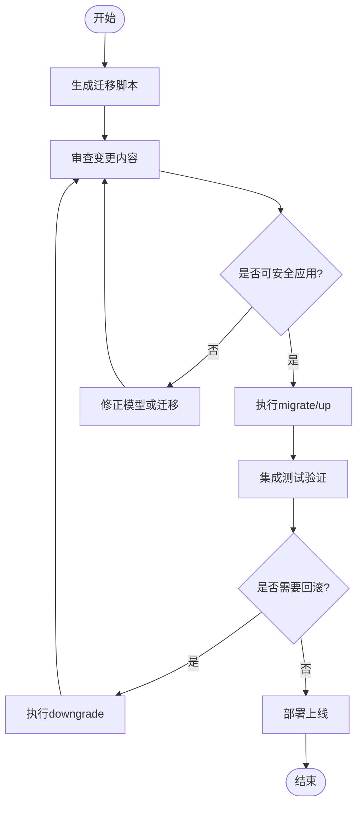
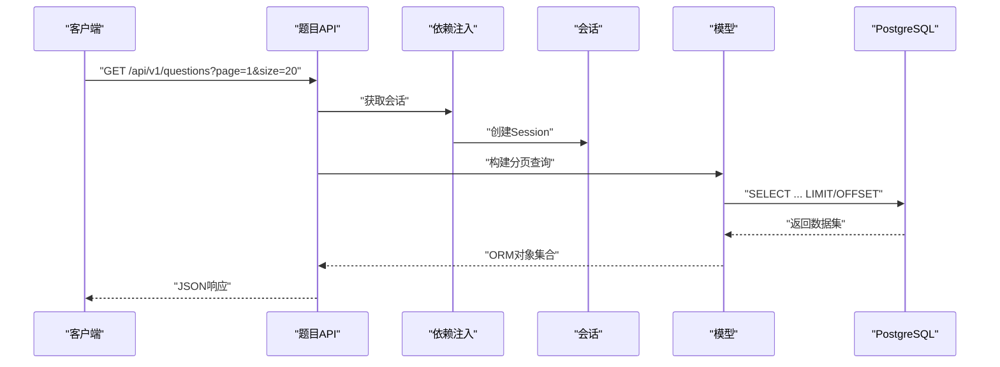
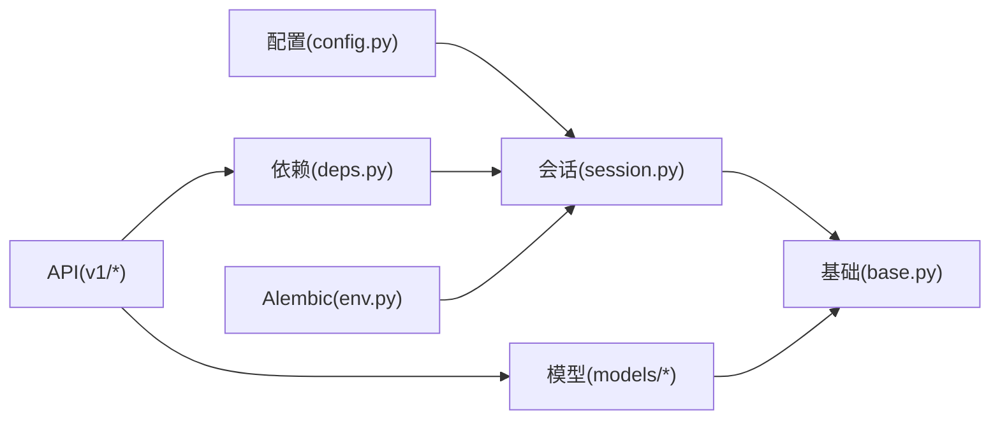

# 数据库设计与ORM

<cite>
**本文引用的文件**   
- [backend/app/db/base.py](file://backend/app/db/base.py)
- [backend/app/db/session.py](file://backend/app/db/session.py)
- [backend/alembic.ini](file://backend/alembic.ini)
- [backend/alembic/env.py](file://backend/alembic/env.py)
- [backend/alembic/script.py.mako](file://backend/alembic/script.py.mako)
- [backend/app/models/__init__.py](file://backend/app/models/__init__.py)
- [backend/app/models/user.py](file://backend/app/models/user.py)
- [backend/app/models/question.py](file://backend/app/models/question.py)
- [backend/app/models/ai_question.py](file://backend/app/models/ai_question.py)
- [backend/app/models/conversation.py](file://backend/app/models/conversation.py)
- [backend/app/models/composition.py](file://backend/app/models/composition.py)
- [backend/app/models/oral_assessment.py](file://backend/app/models/oral_assessment.py)
- [backend/app/models/personality.py](file://backend/app/models/personality.py)
- [backend/app/models/assignment.py](file://backend/app/models/assignment.py)
- [backend/app/core/config.py](file://backend/app/core/config.py)
- [backend/app/core/deps.py](file://backend/app/core/deps.py)
- [backend/app/api/v1/auth.py](file://backend/app/api/v1/auth.py)
- [backend/app/api/v1/questions.py](file://backend/app/api/v1/questions.py)
- [backend/app/api/v1/ai_questions.py](file://backend/app/api/v1/ai_questions.py)
- [backend/app/api/v1/conversations.py](file://backend/app/api/v1/conversations.py)
- [backend/app/api/v1/compositions.py](file://backend/app/api/v1/compositions.py)
- [backend/app/api/v1/oral_assessments.py](file://backend/app/api/v1/oral_assessments.py)
- [backend/app/api/v1/personality.py](file://backend/app/api/v1/personality.py)
- [backend/app/api/v1/assignments.py](file://backend/app/api/v1/assignments.py)
</cite>

## 目录
1. [简介](#简介)
2. [项目结构](#项目结构)
3. [核心组件](#核心组件)
4. [架构总览](#架构总览)
5. [详细组件分析](#详细组件分析)
6. [依赖关系分析](#依赖关系分析)
7. [性能考虑](#性能考虑)
8. [故障排查指南](#故障排查指南)
9. [结论](#结论)
10. [附录](#附录)

## 简介
本指南面向AI助教系统的后端数据层，聚焦于PostgreSQL数据库设计原则、表结构与关系建模、索引优化策略；SQLAlchemy ORM最佳实践（模型定义、关系映射、查询构建）；连接池与事务管理、批量操作优化；Alembic数据迁移工作流与版本控制策略；复杂查询示例与性能调优技巧；以及数据一致性保证、安全配置、备份恢复与监控指标。文档以仓库现有实现为依据，提供可落地的工程化建议与图示说明。

## 项目结构
后端采用分层架构：API层调用服务层，服务层通过依赖注入获取数据库会话，访问SQLAlchemy模型进行持久化。数据库相关代码集中在db、models、core/config与alembic目录中。

图表来源
- [backend/app/db/base.py](file://backend/app/db/base.py)
- [backend/app/db/session.py](file://backend/app/db/session.py)
- [backend/alembic/env.py](file://backend/alembic/env.py)
- [backend/app/core/config.py](file://backend/app/core/config.py)

章节来源
- [backend/app/db/base.py](file://backend/app/db/base.py)
- [backend/app/db/session.py](file://backend/app/db/session.py)
- [backend/app/core/config.py](file://backend/app/core/config.py)
- [backend/alembic/env.py](file://backend/alembic/env.py)

## 核心组件
- 数据库基础与引擎
  - Base元数据与声明式基类集中定义，便于统一约束与扩展。
  - 引擎与会话工厂在独立模块中初始化，支持连接池参数与异步/同步模式选择。
- 模型层
  - 各实体模型位于app/models下，包含用户、题目、AI题目、对话、作文、口语评估、人格配置、作业等。
  - 模型间通过外键与relationship建立一对多、多对一等关系。
- 依赖注入与会话生命周期
  - 通过FastAPI依赖项提供会话，确保请求级事务边界清晰。
- Alembic迁移
  - alembic.ini与env.py负责迁移环境、目标元数据与数据库URL加载。
  - script.py.mako为生成迁移脚本的模板。

章节来源
- [backend/app/db/base.py](file://backend/app/db/base.py)
- [backend/app/db/session.py](file://backend/app/db/session.py)
- [backend/app/models/__init__.py](file://backend/app/models/__init__.py)
- [backend/app/core/deps.py](file://backend/app/core/deps.py)
- [backend/alembic.ini](file://backend/alembic.ini)
- [backend/alembic/env.py](file://backend/alembic/env.py)
- [backend/alembic/script.py.mako](file://backend/alembic/script.py.mako)

## 架构总览
下图展示从HTTP请求到数据库写入的完整链路，包括会话创建、事务开启、模型操作与提交/回滚。

图表来源
- [backend/app/api/v1/auth.py](file://backend/app/api/v1/auth.py)
- [backend/app/api/v1/questions.py](file://backend/app/api/v1/questions.py)
- [backend/app/api/v1/ai_questions.py](file://backend/app/api/v1/ai_questions.py)
- [backend/app/api/v1/conversations.py](file://backend/app/api/v1/conversations.py)
- [backend/app/api/v1/compositions.py](file://backend/app/api/v1/compositions.py)
- [backend/app/api/v1/oral_assessments.py](file://backend/app/api/v1/oral_assessments.py)
- [backend/app/api/v1/personality.py](file://backend/app/api/v1/personality.py)
- [backend/app/api/v1/assignments.py](file://backend/app/api/v1/assignments.py)
- [backend/app/core/deps.py](file://backend/app/core/deps.py)
- [backend/app/db/session.py](file://backend/app/db/session.py)

## 详细组件分析

### 数据库基础与连接池
- 引擎与会话
  - 引擎由配置驱动，支持连接池大小、最大溢出、回收时间等参数。
  - 会话工厂提供scoped session或上下文管理器，确保每个请求拥有独立会话。
- 连接池配置要点
  - 根据并发量设置pool_size与max_overflow，避免连接耗尽。
  - 合理设置pool_recycle防止长连接被数据库端断开。
  - 使用echo或日志级别定位慢查询与连接问题。
- 事务边界
  - 建议在依赖注入中开启事务，请求结束时统一提交或回滚。
  - 对于写多读少场景，优先短事务，减少锁持有时间。

章节来源
- [backend/app/db/session.py](file://backend/app/db/session.py)
- [backend/app/core/config.py](file://backend/app/core/config.py)
- [backend/app/core/deps.py](file://backend/app/core/deps.py)

### 模型与关系映射
- 模型组织
  - 所有模型集中于app/models，按领域划分文件，__init__.py用于聚合导入。
- 常见关系
  - 用户与题目：一对多（一个用户可有多条题目记录）。
  - 题目与AI题目：一对一或一对多（视业务需求）。
  - 对话与消息：一对多（一次对话包含多条消息）。
  - 作文与评分：一对一或一对多（取决于是否保留历史版本）。
  - 口语评估与用户：一对多。
  - 作业与题目：一对多（一份作业包含多道题目）。
  - 人格配置：单例或按租户/角色维度存储。
- 字段与约束
  - 主键建议使用自增整数或UUID。
  - 常用过滤字段加索引（如user_id、question_type、status、created_at）。
  - 文本大字段使用TEXT类型，必要时配合GIN索引进行全文检索。

图表来源
- [backend/app/models/user.py](file://backend/app/models/user.py)
- [backend/app/models/question.py](file://backend/app/models/question.py)
- [backend/app/models/ai_question.py](file://backend/app/models/ai_question.py)
- [backend/app/models/conversation.py](file://backend/app/models/conversation.py)
- [backend/app/models/composition.py](file://backend/app/models/composition.py)
- [backend/app/models/oral_assessment.py](file://backend/app/models/oral_assessment.py)
- [backend/app/models/personality.py](file://backend/app/models/personality.py)
- [backend/app/models/assignment.py](file://backend/app/models/assignment.py)

章节来源
- [backend/app/models/__init__.py](file://backend/app/models/__init__.py)
- [backend/app/models/user.py](file://backend/app/models/user.py)
- [backend/app/models/question.py](file://backend/app/models/question.py)
- [backend/app/models/ai_question.py](file://backend/app/models/ai_question.py)
- [backend/app/models/conversation.py](file://backend/app/models/conversation.py)
- [backend/app/models/composition.py](file://backend/app/models/composition.py)
- [backend/app/models/oral_assessment.py](file://backend/app/models/oral_assessment.py)
- [backend/app/models/personality.py](file://backend/app/models/personality.py)
- [backend/app/models/assignment.py](file://backend/app/models/assignment.py)

### 依赖注入与会话生命周期
- 依赖项提供
  - 通过FastAPI依赖项暴露get_db，自动创建会话并在请求结束后关闭。
- 事务管理
  - 可在依赖项中包裹事务，或在服务层显式commit/rollback。
  - 异常时确保回滚，避免脏数据。
- 最佳实践
  - 避免跨请求共享会话。
  - 将耗时I/O移出事务，缩短事务持续时间。

章节来源
- [backend/app/core/deps.py](file://backend/app/core/deps.py)
- [backend/app/db/session.py](file://backend/app/db/session.py)

### Alembic迁移工作流
- 配置与环境
  - alembic.ini指定数据库URL与脚本目录。
  - env.py加载配置、设置目标元数据、运行迁移。
- 版本控制策略
  - 每次变更生成独立迁移脚本，保持幂等与可回滚。
  - 分支合并前需验证迁移顺序与兼容性。
- 回滚机制
  - 使用downgrade命令回退到上一版本。
  - 谨慎编写downgrade逻辑，确保数据可逆或提供补偿脚本。

图表来源
- [backend/alembic.ini](file://backend/alembic.ini)
- [backend/alembic/env.py](file://backend/alembic/env.py)
- [backend/alembic/script.py.mako](file://backend/alembic/script.py.mako)

章节来源
- [backend/alembic.ini](file://backend/alembic.ini)
- [backend/alembic/env.py](file://backend/alembic/env.py)
- [backend/alembic/script.py.mako](file://backend/alembic/script.py.mako)

### API层数据访问模式
- 认证与用户
  - 登录/注册流程涉及用户模型读写，注意密码哈希与唯一性约束。
- 题目与AI题目
  - 题目列表分页、筛选；AI题目生成后持久化并与原题目关联。
- 对话与作文
  - 对话消息追加、作文提交与状态流转。
- 口语评估与人格配置
  - 评估结果写入JSONB字段；人格配置作为全局或租户级开关。
- 作业
  - 作业与题目的一对多关系维护，批量插入题目记录。

图表来源
- [backend/app/api/v1/questions.py](file://backend/app/api/v1/questions.py)
- [backend/app/api/v1/ai_questions.py](file://backend/app/api/v1/ai_questions.py)
- [backend/app/api/v1/conversations.py](file://backend/app/api/v1/conversations.py)
- [backend/app/api/v1/compositions.py](file://backend/app/api/v1/compositions.py)
- [backend/app/api/v1/oral_assessments.py](file://backend/app/api/v1/oral_assessments.py)
- [backend/app/api/v1/personality.py](file://backend/app/api/v1/personality.py)
- [backend/app/api/v1/assignments.py](file://backend/app/api/v1/assignments.py)
- [backend/app/api/v1/auth.py](file://backend/app/api/v1/auth.py)
- [backend/app/core/deps.py](file://backend/app/core/deps.py)

章节来源
- [backend/app/api/v1/auth.py](file://backend/app/api/v1/auth.py)
- [backend/app/api/v1/questions.py](file://backend/app/api/v1/questions.py)
- [backend/app/api/v1/ai_questions.py](file://backend/app/api/v1/ai_questions.py)
- [backend/app/api/v1/conversations.py](file://backend/app/api/v1/conversations.py)
- [backend/app/api/v1/compositions.py](file://backend/app/api/v1/compositions.py)
- [backend/app/api/v1/oral_assessments.py](file://backend/app/api/v1/oral_assessments.py)
- [backend/app/api/v1/personality.py](file://backend/app/api/v1/personality.py)
- [backend/app/api/v1/assignments.py](file://backend/app/api/v1/assignments.py)

## 依赖关系分析
- 模块耦合
  - API层依赖deps提供会话，间接依赖session与config。
  - 模型层仅依赖base与SQLAlchemy核心类型。
- 外部依赖
  - PostgreSQL驱动、Alembic、Pydantic（若使用）、加密库（鉴权）。
- 潜在循环依赖
  - 避免在模型中直接导入API或服务层，保持单向依赖。

图表来源
- [backend/app/core/config.py](file://backend/app/core/config.py)
- [backend/app/db/session.py](file://backend/app/db/session.py)
- [backend/app/db/base.py](file://backend/app/db/base.py)
- [backend/app/core/deps.py](file://backend/app/core/deps.py)
- [backend/alembic/env.py](file://backend/alembic/env.py)

章节来源
- [backend/app/core/config.py](file://backend/app/core/config.py)
- [backend/app/db/session.py](file://backend/app/db/session.py)
- [backend/app/db/base.py](file://backend/app/db/base.py)
- [backend/app/core/deps.py](file://backend/app/core/deps.py)
- [backend/alembic/env.py](file://backend/alembic/env.py)

## 性能考虑
- 索引策略
  - 高频过滤字段建立B-Tree索引（如user_id、type、status、created_at）。
  - JSONB字段使用GIN索引支持快速查询（如score、result）。
  - 复合索引覆盖常见查询条件组合（如(user_id, created_at DESC)）。
- 查询优化
  - 使用分页与只取必要列，避免N+1查询（可使用joinedload/selectinload）。
  - 统计类查询使用物化视图或定时聚合任务。
- 批量操作
  - 使用bulk_insert_mappings或executemany提升写入吞吐。
  - 拆分大批次，避免长事务与锁竞争。
- 连接池与超时
  - 调整pool_size/max_overflow匹配并发峰值。
  - 设置statement_timeout与idle_in_transaction_session_timeout保护数据库。
- 缓存与离线计算
  - 热点数据引入Redis缓存，降低数据库压力。
  - 分析型报表走OLAP或ETL流水线。

[本节为通用性能指导，不直接分析具体文件]

## 故障排查指南
- 常见问题
  - 连接池耗尽：检查并发与池参数，确认未泄漏会话。
  - 死锁与长事务：缩短事务范围，避免在事务中进行外部I/O。
  - 慢查询：启用慢查询日志，结合EXPLAIN ANALYZE定位瓶颈。
  - 迁移失败：核对版本链与依赖，先downgrade再重试。
- 诊断步骤
  - 查看应用日志与数据库日志。
  - 使用pg_stat_statements定位热点SQL。
  - 检查Alembic当前版本与实际schema一致性。

章节来源
- [backend/app/db/session.py](file://backend/app/db/session.py)
- [backend/alembic/env.py](file://backend/alembic/env.py)

## 结论
本指南基于仓库现有实现，总结了AI助教系统的数据层架构与最佳实践。通过合理的PostgreSQL建模与索引、规范的SQLAlchemy ORM用法、严格的会话与事务管理、完善的Alembic迁移流程，可有效保障系统性能、一致性与可维护性。建议在生产环境完善监控告警与备份策略，持续优化关键路径。

[本节为总结性内容，不直接分析具体文件]

## 附录

### 安全配置清单
- 最小权限原则：为应用账户授予必要的最小权限。
- 传输加密：强制使用SSL/TLS连接数据库。
- 敏感信息：数据库凭据通过环境变量或密钥管理服务注入。
- 输入校验：在API层与Schema层严格校验，防范注入攻击。
- 审计日志：记录关键数据变更与访问行为。

[本节为通用安全指导，不直接分析具体文件]

### 备份与恢复策略
- 定期全量备份与增量WAL归档。
- 异地容灾与多副本。
- 制定RPO/RTO目标并演练恢复流程。
- 迁移前后快照备份，确保可回滚。

[本节为通用运维指导，不直接分析具体文件]

### 监控指标建议
- 连接池使用率、等待队列长度。
- 事务平均时长、锁等待与死锁次数。
- 慢查询数量与TOP SQL。
- 磁盘空间与增长趋势。
- Alembic版本漂移检测。

[本节为通用监控指导，不直接分析具体文件]