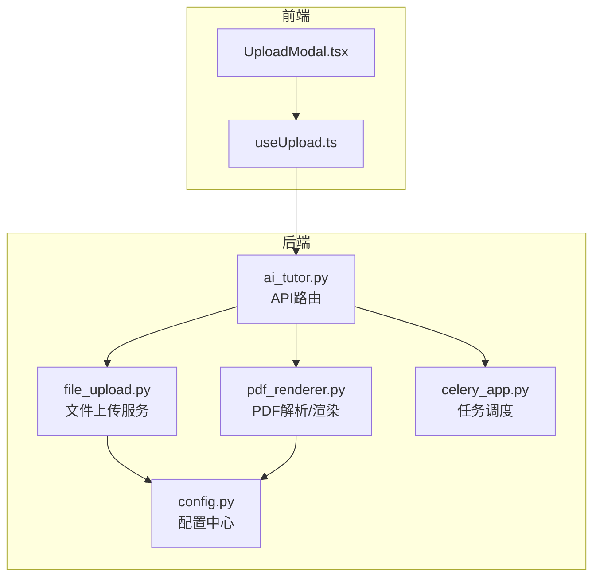
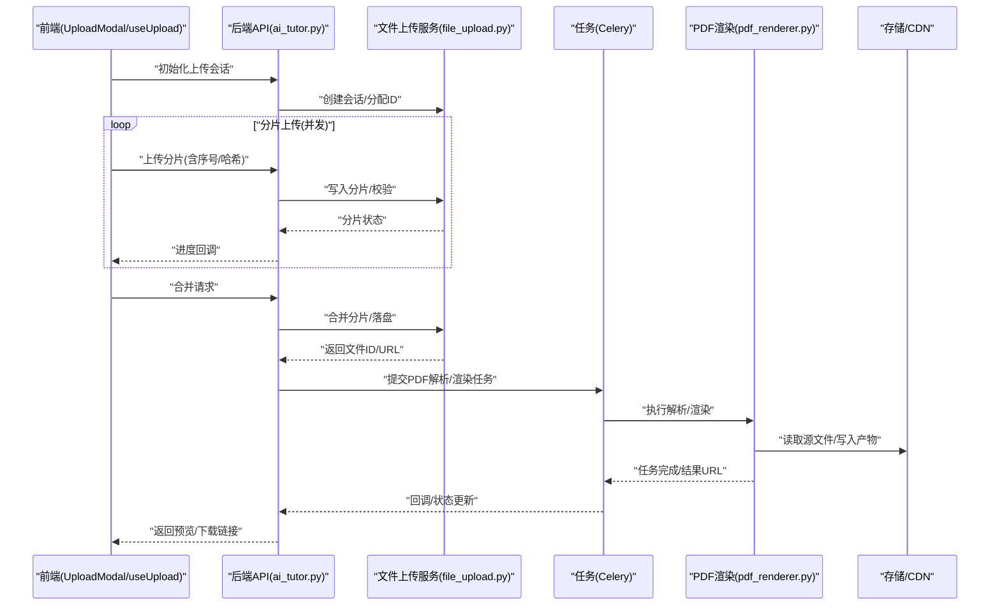
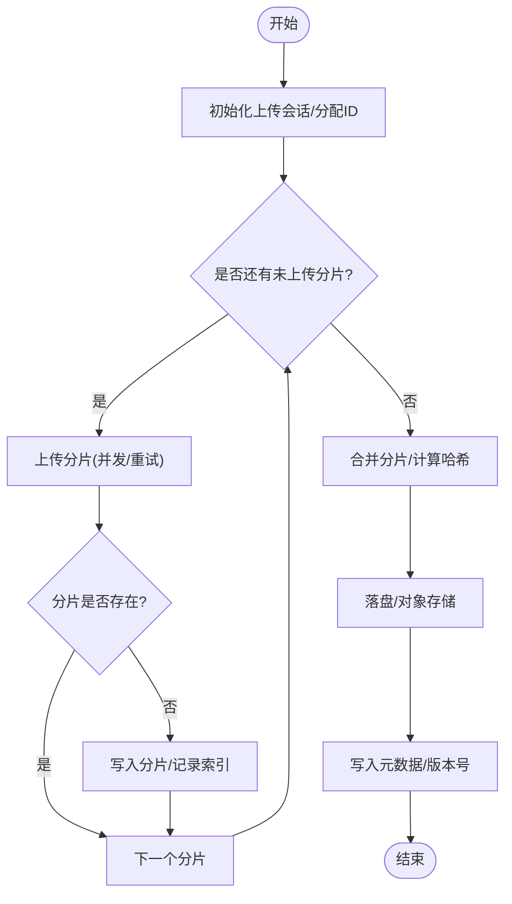
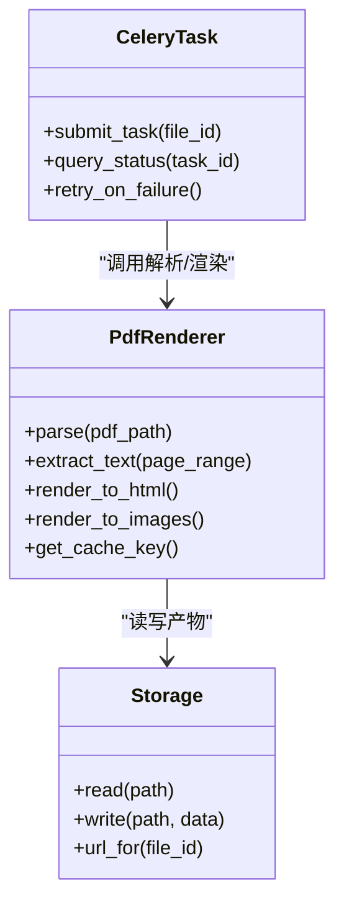
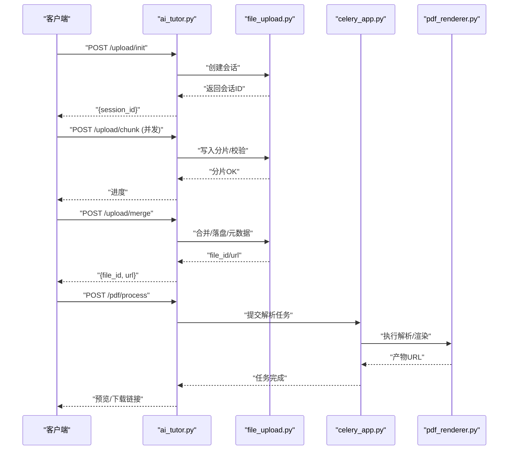
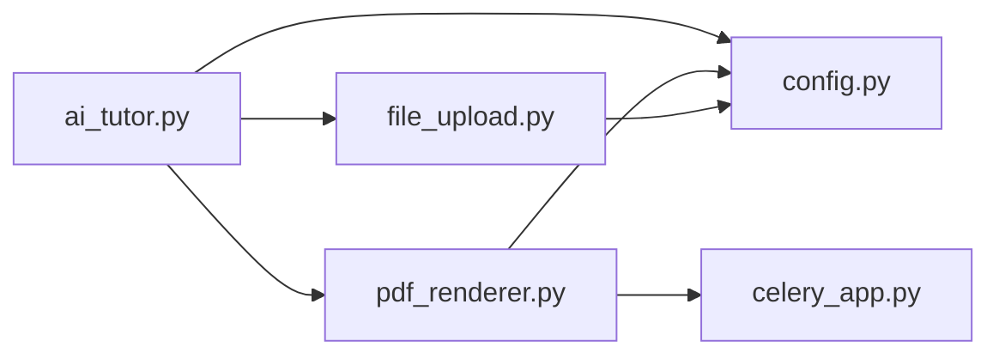

# 文件处理与存储

<cite>
**本文引用的文件**   
- [backend/app/services/file_upload.py](file://backend/app/services/file_upload.py)
- [backend/app/services/pdf_renderer.py](file://backend/app/services/pdf_renderer.py)
- [backend/app/api/v1/ai_tutor.py](file://backend/app/api/v1/ai_tutor.py)
- [backend/app/core/config.py](file://backend/app/core/config.py)
- [backend/app/tasks/celery_app.py](file://backend/app/tasks/celery_app.py)
- [frontend/src/components/UploadModal.tsx](file://frontend/src/components/UploadModal.tsx)
- [frontend/src/hooks/useUpload.ts](file://frontend/src/hooks/useUpload.ts)
</cite>

## 目录
1. [简介](#简介)
2. [项目结构](#项目结构)
3. [核心组件](#核心组件)
4. [架构总览](#架构总览)
5. [详细组件分析](#详细组件分析)
6. [依赖分析](#依赖分析)
7. [性能考虑](#性能考虑)
8. [故障排查指南](#故障排查指南)
9. [结论](#结论)
10. [附录](#附录)

## 简介
本技术文档聚焦AI助教系统中的“文件处理与存储”能力，覆盖以下关键主题：
- 文件上传下载机制：分片上传、断点续传、并发处理
- PDF解析、渲染与转换：文本提取、格式保持、性能优化
- 存储服务选型与配置：本地存储、云存储、CDN集成
- 安全策略：格式验证、病毒扫描、大小限制、类型白名单
- 大文件处理优化：内存管理、缓存策略
- 元数据管理与版本控制、清理策略

## 项目结构
后端采用分层设计：API层暴露接口，服务层封装业务逻辑（文件上传、PDF处理等），任务层使用Celery进行异步处理；前端提供上传交互与进度反馈。

图表来源
- [backend/app/api/v1/ai_tutor.py](file://backend/app/api/v1/ai_tutor.py)
- [backend/app/services/file_upload.py](file://backend/app/services/file_upload.py)
- [backend/app/services/pdf_renderer.py](file://backend/app/services/pdf_renderer.py)
- [backend/app/core/config.py](file://backend/app/core/config.py)
- [backend/app/tasks/celery_app.py](file://backend/app/tasks/celery_app.py)
- [frontend/src/components/UploadModal.tsx](file://frontend/src/components/UploadModal.tsx)
- [frontend/src/hooks/useUpload.ts](file://frontend/src/hooks/useUpload.ts)

章节来源
- [backend/app/api/v1/ai_tutor.py](file://backend/app/api/v1/ai_tutor.py)
- [backend/app/services/file_upload.py](file://backend/app/services/file_upload.py)
- [backend/app/services/pdf_renderer.py](file://backend/app/services/pdf_renderer.py)
- [backend/app/core/config.py](file://backend/app/core/config.py)
- [backend/app/tasks/celery_app.py](file://backend/app/tasks/celery_app.py)
- [frontend/src/components/UploadModal.tsx](file://frontend/src/components/UploadModal.tsx)
- [frontend/src/hooks/useUpload.ts](file://frontend/src/hooks/useUpload.ts)

## 核心组件
- 文件上传服务：负责接收文件、校验、分片组装、持久化、元数据记录与错误处理。
- PDF渲染服务：负责PDF解析、文本提取、页面渲染与格式保持，并提供异步任务入口。
- 任务调度器：基于Celery的异步任务框架，用于耗时操作（如PDF解析、转码）。
- 配置中心：集中管理存储路径、分片大小、并发数、超时、白名单等参数。
- 前端上传组件与Hook：实现分片、并发、断点续传、进度上报与重试。

章节来源
- [backend/app/services/file_upload.py](file://backend/app/services/file_upload.py)
- [backend/app/services/pdf_renderer.py](file://backend/app/services/pdf_renderer.py)
- [backend/app/tasks/celery_app.py](file://backend/app/tasks/celery_app.py)
- [backend/app/core/config.py](file://backend/app/core/config.py)
- [frontend/src/components/UploadModal.tsx](file://frontend/src/components/UploadModal.tsx)
- [frontend/src/hooks/useUpload.ts](file://frontend/src/hooks/useUpload.ts)

## 架构总览
整体流程：前端按分片并发上传至后端，后端完成校验与合并后落盘并记录元数据；对PDF类文件触发异步解析与渲染任务，结果可回写或生成预览资源；最终通过直链或CDN地址供前端展示与下载。

图表来源
- [backend/app/api/v1/ai_tutor.py](file://backend/app/api/v1/ai_tutor.py)
- [backend/app/services/file_upload.py](file://backend/app/services/file_upload.py)
- [backend/app/services/pdf_renderer.py](file://backend/app/services/pdf_renderer.py)
- [backend/app/tasks/celery_app.py](file://backend/app/tasks/celery_app.py)

## 详细组件分析

### 文件上传服务（分片、断点续传、并发）
- 分片上传
  - 前端将大文件切分为固定大小的分片，附带全局唯一会话ID、分片序号、分片哈希等信息并发上传。
  - 后端为每个会话维护分片索引与校验信息，支持幂等写入与去重。
- 断点续传
  - 客户端在恢复上传前查询已存在分片列表，仅补传缺失分片。
  - 服务端以会话ID+分片序号作为键，避免重复写入。
- 并发处理
  - 前端设置并发上限，结合队列与退避重试，避免打满服务器连接池。
  - 后端对分片写入采用原子性操作与锁机制，保证一致性。
- 合并与落盘
  - 所有分片完成后触发合并，计算完整文件哈希并与元数据绑定。
  - 落盘路径由配置中心决定，支持本地磁盘或对象存储桶路径映射。
- 元数据与版本
  - 每次合并生成新版本记录，保留历史版本以便回溯。
  - 元数据包含文件名、大小、MIME类型、哈希、创建时间、上传者等。

图表来源
- [backend/app/services/file_upload.py](file://backend/app/services/file_upload.py)
- [frontend/src/hooks/useUpload.ts](file://frontend/src/hooks/useUpload.ts)
- [frontend/src/components/UploadModal.tsx](file://frontend/src/components/UploadModal.tsx)

章节来源
- [backend/app/services/file_upload.py](file://backend/app/services/file_upload.py)
- [frontend/src/hooks/useUpload.ts](file://frontend/src/hooks/useUpload.ts)
- [frontend/src/components/UploadModal.tsx](file://frontend/src/components/UploadModal.tsx)

### PDF解析、渲染与转换
- 解析与文本提取
  - 支持逐页解析，提取文本、表格与图像占位信息，尽量保持原始排版结构。
  - 针对扫描型PDF，可扩展OCR流水线（可接入外部OCR服务）。
- 渲染与转换
  - 将PDF转换为HTML/图片/纯文本等中间格式，便于检索与展示。
  - 输出产物可压缩与缓存，减少重复计算。
- 异步任务
  - 通过Celery将解析与渲染放入后台队列，避免阻塞API响应。
  - 任务具备失败重试与死信队列，保障可靠性。
- 性能优化
  - 流式读取大PDF，避免一次性加载到内存。
  - 分页并行处理，合理设置线程/进程池大小。
  - 对相同哈希的PDF命中缓存，直接复用结果。

图表来源
- [backend/app/services/pdf_renderer.py](file://backend/app/services/pdf_renderer.py)
- [backend/app/tasks/celery_app.py](file://backend/app/tasks/celery_app.py)

章节来源
- [backend/app/services/pdf_renderer.py](file://backend/app/services/pdf_renderer.py)
- [backend/app/tasks/celery_app.py](file://backend/app/tasks/celery_app.py)

### API路由与编排
- 上传相关接口
  - 初始化会话、上传分片、查询进度、合并文件、获取文件详情与下载链接。
- PDF处理接口
  - 触发解析/渲染任务、查询任务状态、获取预览/下载链接。
- 统一鉴权与限流
  - 基于中间件进行身份校验与速率限制，保护上传与处理接口。

图表来源
- [backend/app/api/v1/ai_tutor.py](file://backend/app/api/v1/ai_tutor.py)
- [backend/app/services/file_upload.py](file://backend/app/services/file_upload.py)
- [backend/app/tasks/celery_app.py](file://backend/app/tasks/celery_app.py)
- [backend/app/services/pdf_renderer.py](file://backend/app/services/pdf_renderer.py)

章节来源
- [backend/app/api/v1/ai_tutor.py](file://backend/app/api/v1/ai_tutor.py)

### 配置中心（存储、分片、并发、白名单）
- 存储路径与策略
  - 本地存储根目录、对象存储桶名、访问密钥、CDN域名等。
- 分片与并发
  - 分片大小、最大并发数、超时时间、重试次数。
- 安全策略
  - 允许的文件扩展名白名单、MIME类型校验、最大文件大小、临时目录隔离。
- 任务与缓存
  - Celery Broker/Backend配置、任务超时、结果过期时间、缓存键规则。

章节来源
- [backend/app/core/config.py](file://backend/app/core/config.py)

## 依赖分析
- 模块耦合
  - API层依赖上传服务与PDF服务；上传服务依赖配置与存储；PDF服务依赖任务调度与存储。
- 外部依赖
  - 对象存储SDK（如S3兼容）、CDN、OCR服务（可选）、消息队列（RabbitMQ/Redis）。
- 潜在循环依赖
  - 确保API不反向依赖任务内部实现，任务只依赖服务与配置。

图表来源
- [backend/app/api/v1/ai_tutor.py](file://backend/app/api/v1/ai_tutor.py)
- [backend/app/services/file_upload.py](file://backend/app/services/file_upload.py)
- [backend/app/services/pdf_renderer.py](file://backend/app/services/pdf_renderer.py)
- [backend/app/core/config.py](file://backend/app/core/config.py)
- [backend/app/tasks/celery_app.py](file://backend/app/tasks/celery_app.py)

章节来源
- [backend/app/api/v1/ai_tutor.py](file://backend/app/api/v1/ai_tutor.py)
- [backend/app/services/file_upload.py](file://backend/app/services/file_upload.py)
- [backend/app/services/pdf_renderer.py](file://backend/app/services/pdf_renderer.py)
- [backend/app/core/config.py](file://backend/app/core/config.py)
- [backend/app/tasks/celery_app.py](file://backend/app/tasks/celery_app.py)

## 性能考虑
- 大文件处理
  - 流式读写、分块缓冲、避免全量载入内存；合并阶段顺序拼接，必要时使用零拷贝。
- 并发与背压
  - 前端限制并发度，服务端对分片写入加锁；根据CPU/IO瓶颈调整线程/进程池。
- 缓存策略
  - 对相同内容哈希的PDF解析结果进行缓存；产物按TTL过期；热点文件预热。
- I/O与网络
  - 启用HTTP Keep-Alive；对象存储使用多部分上传/下载；CDN缓存静态产物。
- 任务队列
  - 合理设置队列优先级与消费者数量；失败重试指数退避；监控队列积压。

[本节为通用指导，无需代码引用]

## 故障排查指南
- 上传失败
  - 检查分片哈希与大小是否与预期一致；确认会话是否过期；查看分片索引是否完整。
- 合并异常
  - 核对分片顺序与去重逻辑；检查目标路径权限与磁盘空间。
- PDF解析慢或失败
  - 观察任务队列长度与消费者健康；检查PDF是否为损坏或加密；确认OCR服务可用性。
- 产物不可访问
  - 校验对象存储ACL与CDN缓存失效；确认签名URL有效期。
- 日志与指标
  - 关注上传成功率、分片重试率、任务失败率、解析耗时P95/P99、存储IOPS与带宽占用。

章节来源
- [backend/app/services/file_upload.py](file://backend/app/services/file_upload.py)
- [backend/app/services/pdf_renderer.py](file://backend/app/services/pdf_renderer.py)
- [backend/app/tasks/celery_app.py](file://backend/app/tasks/celery_app.py)

## 结论
本系统围绕“可靠上传、高效解析、稳定存储”构建文件处理与存储能力。通过分片与断点续传提升鲁棒性，借助异步任务与缓存提高吞吐，配合严格的配置与安全策略保障稳定性与安全性。后续可在OCR、智能转码与更细粒度的版本治理方面持续演进。

[本节为总结，无需代码引用]

## 附录

### 安全措施清单
- 格式验证
  - 扩展名白名单、MIME类型校验、魔数检测。
- 病毒扫描
  - 上传后对文件进行病毒扫描，失败则拒绝入库。
- 大小限制
  - 单文件与单次会话大小上限，超限即拒绝。
- 类型白名单
  - 仅允许教学相关类型（如PDF、DOCX、图片等），其他一律拒绝。
- 访问控制
  - 私有桶/目录、签名URL短期有效、防盗链与Referer校验。

[本节为通用建议，无需代码引用]

### 元数据与版本控制
- 元数据字段
  - 文件ID、名称、大小、类型、哈希、上传者、创建时间、版本、存储位置、预览URL。
- 版本策略
  - 每次合并生成新版本；删除旧版本时保留回收站窗口期。
- 清理策略
  - 定期清理孤立分片与过期产物；按生命周期归档冷数据。

[本节为通用建议，无需代码引用]